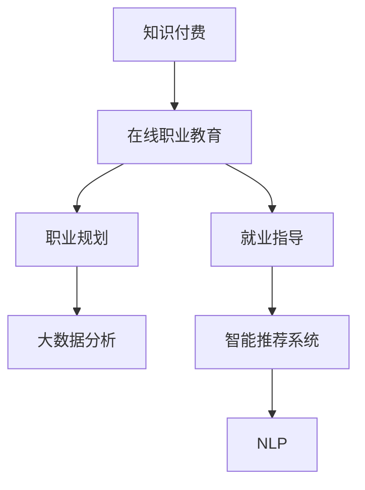

                 

# 如何利用知识付费实现在线职业规划与就业指导？

> 关键词：知识付费, 职业规划, 就业指导, 在线教育, 技术应用

## 1. 背景介绍

### 1.1 问题由来
在信息技术迅猛发展的今天，职业市场呈现出日新月异的变化。如何适应快速变化的市场需求，做好职业规划和就业指导，成为了广大求职者面临的重要问题。传统的线下职业培训和咨询模式，时间和地点限制较多，且服务内容有限，难以满足求职者的多样化需求。而互联网时代的到来，提供了更加便捷、灵活的职业教育和指导服务。特别是知识付费模式的发展，使得高质量、个性化的职业规划与就业指导服务变得更加触手可及。

### 1.2 问题核心关键点
知识付费平台在职业教育和指导服务中的应用，通过整合优质教育资源，结合智能算法和大数据技术，为求职者提供定制化的职业规划方案和就业指导建议。这一模式的核心关键点包括：

- 线上化：将传统的线下职业培训和咨询服务线上化，打破时间和地点的限制。
- 数据驱动：通过大数据分析，理解求职者的需求和市场变化趋势，提供个性化的职业规划和就业指导。
- 高效率：快速响应用户需求，提供实时咨询服务，提升用户体验和满意度。
- 精准推荐：借助智能算法推荐，帮助求职者找到合适的职业路径和发展机会。
- 终身学习：构建终身学习体系，帮助求职者不断提升自身竞争力，适应职业市场变化。

### 1.3 问题研究意义
知识付费在职业规划与就业指导领域的应用，具有以下重要意义：

1. 提高就业匹配率：通过大数据分析和智能推荐，帮助求职者找到最适合自己的岗位和职业路径。
2. 提升职业竞争力：通过在线课程和指导，求职者能够获得持续的学习机会，提升自身技能和知识水平。
3. 降低教育成本：知识付费模式提供了优质、高效的在线教育资源，减少了传统教育培训的时间和金钱成本。
4. 促进职业发展：帮助求职者明确职业目标，制定详细的职业规划，提升职业满意度和工作稳定性。
5. 推动产业升级：知识付费和职业教育市场的繁荣，带动相关技术和产业的发展，促进社会经济进步。

## 2. 核心概念与联系

### 2.1 核心概念概述

为更好地理解知识付费在职业规划与就业指导中的应用，本节将介绍几个密切相关的核心概念：

- **知识付费(Knowledge-Paying)**：基于互联网平台的付费模式，消费者支付费用以获取高质量的内容和服务，包括在线课程、咨询、电子书等。
- **在线职业教育(Online Vocational Education)**：通过互联网提供职业教育和培训服务，包括职业规划、技能提升、就业指导等。
- **大数据分析(Big Data Analytics)**：利用大数据技术，从大量数据中提取有价值的信息，支持决策和预测。
- **智能推荐系统(Intelligent Recommendation System)**：基于用户行为和兴趣，自动推荐最相关的产品或服务，提升用户体验。
- **自然语言处理(Natural Language Processing, NLP)**：使计算机能够理解、处理和生成自然语言，支持智能对话和内容生成。

这些核心概念之间的逻辑关系可以通过以下Mermaid流程图来展示：



这个流程图展示了大规模语言模型微调的各个核心概念及其之间的关系：

1. 知识付费为在线职业教育提供了经济支持。
2. 在线职业教育通过职业规划和就业指导，帮助用户明确职业方向和提升就业技能。
3. 大数据分析为职业规划和就业指导提供了数据基础，支持精准推荐。
4. 智能推荐系统基于大数据分析结果，进行个性化的职业推荐。
5. 自然语言处理技术支持智能对话和内容生成，提升用户体验。

这些概念共同构成了知识付费在职业规划与就业指导中的应用框架，为实现高质量、个性化的服务提供了技术保障。

## 3. 核心算法原理 & 具体操作步骤

### 3.1 算法原理概述

知识付费平台在职业规划与就业指导中的应用，主要依赖于以下几个核心算法：

- **个性化推荐算法**：基于用户行为数据，通过协同过滤、基于内容的推荐、矩阵分解等技术，推荐最符合用户兴趣的职业课程和资源。
- **职业路径规划算法**：结合用户的学历背景、工作经验和兴趣偏好，利用图论、路径规划等算法，推荐最优的职业路径。
- **智能问答系统**：通过自然语言处理技术，构建智能对话系统，实时回答用户关于职业规划和就业指导的问题。
- **数据分析与预测模型**：利用大数据分析技术，建立职业市场变化预测模型，支持用户根据市场趋势调整职业规划。

### 3.2 算法步骤详解

基于知识付费平台的职业规划与就业指导，一般包括以下几个关键步骤：

**Step 1: 用户注册与信息收集**
- 用户通过平台注册账号，填写个人信息和职业背景。
- 平台收集用户的教育背景、工作经历、兴趣爱好等数据。

**Step 2: 数据预处理与分析**
- 对收集到的用户数据进行清洗和预处理，去除无效信息。
- 利用大数据分析技术，对用户数据进行聚类和特征提取。

**Step 3: 职业规划与路径推荐**
- 结合用户数据和职业市场数据，利用路径规划算法，推荐最优的职业路径。
- 通过智能推荐系统，推荐相关的在线课程和资源，帮助用户提升职业技能。

**Step 4: 就业指导与咨询服务**
- 通过智能问答系统，实时回答用户关于职业规划和就业指导的问题。
- 提供定制化的就业建议和咨询服务，帮助用户找到理想工作。

**Step 5: 持续学习与职业发展**
- 通过持续学习推荐系统，提供个性化的学习资源和职业提升方案。
- 定期更新职业市场数据和课程资源，确保职业规划和就业指导服务的及时性。

### 3.3 算法优缺点

知识付费平台在职业规划与就业指导中的应用，具有以下优点：

1. **高效便捷**：在线服务打破了时间和地点的限制，用户可以随时随地获取职业规划和就业指导服务。
2. **个性化服务**：通过大数据分析和智能推荐，提供量身定制的职业规划和就业指导方案。
3. **实时响应**：智能问答系统可以实时回答用户问题，提升用户体验和满意度。
4. **资源丰富**：平台汇聚了大量优质的教育资源和专家资源，用户可以获取丰富的知识和经验。
5. **持续学习**：提供终身学习体系，帮助用户不断提升自身竞争力，适应职业市场变化。

同时，这一模式也存在一定的局限性：

1. **用户信任度**：部分用户可能对平台的推荐和指导效果存疑，需要建立品牌信任。
2. **数据隐私**：平台需要处理大量用户数据，涉及隐私和安全问题。
3. **个性化难度**：数据驱动的个性化服务需要高质量的数据和算法支持，对于少数用户可能存在偏差。
4. **技术门槛**：高质量的推荐算法和大数据分析需要一定的技术积累，普通用户难以实现。
5. **知识更新**：职业市场快速变化，需要平台持续更新数据和算法，以保持服务质量。

### 3.4 算法应用领域

知识付费平台在职业规划与就业指导中的应用，不仅限于以下领域：

- **职业规划**：帮助用户明确职业目标，制定详细的职业发展计划。
- **就业指导**：提供简历优化、面试技巧、薪资谈判等就业指导服务。
- **技能提升**：通过在线课程和指导，提升用户的职业技能和知识水平。
- **职业转换**：为转行用户提供职业路径规划和技能提升建议。
- **终身学习**：构建终身学习体系，帮助用户持续提升自身竞争力。

这些领域的应用，使得知识付费平台成为求职者职业发展的有力工具，同时也促进了教育产业的创新和升级。

## 4. 数学模型和公式 & 详细讲解

### 4.1 数学模型构建

本节将使用数学语言对基于知识付费平台的职业规划与就业指导方法进行更加严格的刻画。

假设用户数据集为 $D=\{d_i\}_{i=1}^N$，其中 $d_i=(x_i, y_i)$ 为第 $i$ 个用户的教育背景、工作经历和兴趣爱好等数据。平台收集到的职业市场数据集为 $C=\{c_j\}_{j=1}^M$，其中 $c_j=(k_j, v_j)$ 为第 $j$ 个职业路径的信息，包括职业名称 $k_j$ 和相关技能 $v_j$。

定义用户对职业路径 $k$ 的兴趣程度为 $p_i^k$，可以通过以下公式计算：

$$
p_i^k = \frac{1}{1+e^{-u_i^k}}
$$

其中 $u_i^k$ 为用户的职业兴趣评分，可以通过以下公式计算：

$$
u_i^k = \sum_{v\in v_j} w_v \cdot p_i^v \cdot p^k_v
$$

其中 $p_i^v$ 为用户对技能 $v$ 的掌握程度，$p^k_v$ 为职业 $k$ 对技能 $v$ 的需求程度，$w_v$ 为技能 $v$ 的权重。

### 4.2 公式推导过程

根据上述公式，用户对职业路径 $k$ 的兴趣程度可以计算为：

$$
p_i^k = \frac{1}{1+e^{-\sum_{v\in v_j} w_v \cdot p_i^v \cdot p^k_v}}
$$

进一步化简得：

$$
p_i^k = \frac{1}{1+e^{-\sum_{v\in v_j} w_v \cdot p_i^v \cdot p^k_v}}
$$

通过上述公式，可以计算出每个用户对每个职业路径的兴趣程度，从而进行职业路径推荐。具体步骤如下：

1. 收集用户数据和职业市场数据。
2. 对数据进行清洗和预处理。
3. 根据公式计算每个用户对每个职业路径的兴趣程度。
4. 根据兴趣程度进行职业路径排序，推荐最优路径。

### 4.3 案例分析与讲解

以某知识付费平台的职业规划为例，假设平台收集到以下数据：

| 用户ID | 教育背景 | 工作经历 | 兴趣爱好 |
| --- | --- | --- | --- |
| 1 | 本科 | 软件开发 | 数据分析 |
| 2 | 硕士 | 产品经理 | 项目管理 |
| 3 | 博士 | 机器学习 | 人工智能 |

| 职业路径ID | 职业名称 | 相关技能 |
| --- | --- | --- |
| 1 | 数据科学家 | 数据分析、Python、统计学 |
| 2 | 产品经理 | 项目规划、市场分析、沟通 |
| 3 | 人工智能工程师 | 深度学习、计算机视觉、自然语言处理 |

平台可以计算用户对每个职业路径的兴趣程度，并推荐最优路径。例如，用户1对数据科学家路径的兴趣程度最高，平台可以推荐其参加相关的在线课程和项目，帮助其提升数据分析技能，最终顺利转岗数据科学家。

## 5. 项目实践：代码实例和详细解释说明

### 5.1 开发环境搭建

在进行知识付费平台开发前，我们需要准备好开发环境。以下是使用Python进行Flask框架开发的环境配置流程：

1. 安装Python：从官网下载并安装Python 3.8。
2. 安装Flask：
```bash
pip install Flask
```

3. 创建Python虚拟环境：
```bash
python -m venv venv
source venv/bin/activate
```

4. 安装Flask-RESTful：
```bash
pip install Flask-RESTful
```

5. 安装SQLAlchemy：
```bash
pip install SQLAlchemy
```

完成上述步骤后，即可在虚拟环境中开始开发。

### 5.2 源代码详细实现

我们以开发一个简单的知识付费平台职业规划功能为例，给出一个Flask框架的代码实现。

首先，定义SQLAlchemy模型：

```python
from flask_sqlalchemy import SQLAlchemy

db = SQLAlchemy(app)

class User(db.Model):
    id = db.Column(db.Integer, primary_key=True)
    name = db.Column(db.String(80), unique=True, nullable=False)
    education = db.Column(db.String(120), nullable=False)
    experience = db.Column(db.String(120), nullable=False)
    interests = db.Column(db.String(120), nullable=False)

class CareerPath(db.Model):
    id = db.Column(db.Integer, primary_key=True)
    name = db.Column(db.String(80), unique=True, nullable=False)
    skills = db.Column(db.String(120), nullable=False)
```

然后，定义Flask路由和视图：

```python
from flask import Flask, request

app = Flask(__name__)

@app.route('/users', methods=['POST'])
def add_user():
    name = request.json.get('name')
    education = request.json.get('education')
    experience = request.json.get('experience')
    interests = request.json.get('interests')
    
    user = User(name=name, education=education, experience=experience, interests=interests)
    db.session.add(user)
    db.session.commit()
    
    return {'status': 'success'}, 201

@app.route('/career_paths', methods=['GET'])
def get_career_paths():
    paths = CareerPath.query.all()
    return {'paths': [{'id': path.id, 'name': path.name, 'skills': path.skills} for path in paths]}
```

最后，运行Flask应用：

```python
if __name__ == '__main__':
    app.run(debug=True)
```

### 5.3 代码解读与分析

让我们再详细解读一下关键代码的实现细节：

**User模型**：
- `id`：用户ID，作为主键。
- `name`：用户姓名，唯一且不可为空。
- `education`：用户教育背景，不可为空。
- `experience`：用户工作经历，不可为空。
- `interests`：用户兴趣爱好，不可为空。

**CareerPath模型**：
- `id`：职业路径ID，作为主键。
- `name`：职业名称，唯一且不可为空。
- `skills`：职业所需技能，不可为空。

**add_user函数**：
- 根据请求JSON数据创建User模型实例，并添加到数据库中。

**get_career_paths函数**：
- 查询所有职业路径，返回一个包含ID、名称和技能的列表。

这些代码只是实现知识付费平台职业规划功能的基础框架，实际的开发还需要考虑更多的细节，如用户认证、权限控制、数据校验、数据库迁移等。

## 6. 实际应用场景

### 6.1 智能招聘平台

智能招聘平台是知识付费模式在职业规划与就业指导领域的重要应用之一。通过收集求职者的简历、技能、经验等数据，结合职业市场的数据，智能招聘平台可以提供个性化的职位推荐和职业发展建议。

在技术实现上，可以构建用户和职业路径的模型，利用公式计算用户的职业兴趣程度，再结合大数据分析，推荐最优的职位。同时，平台还可以通过智能问答系统，实时回答求职者的职业规划和就业指导问题，提升用户体验和满意度。

### 6.2 企业HR系统

企业HR系统可以利用知识付费平台进行员工职业发展规划和培训规划。通过收集员工的历史绩效、培训记录、职业兴趣等数据，结合职业市场数据，构建员工职业路径推荐模型。同时，平台还可以提供个性化的培训课程推荐，帮助员工提升职业技能，促进企业内部人才的持续发展。

在技术实现上，可以构建员工和职业路径的模型，利用公式计算员工的职业兴趣程度，再结合大数据分析，推荐最优的职业路径和培训课程。同时，平台还可以通过智能问答系统，实时回答员工关于职业规划和培训的问题，提升员工的工作满意度和留存率。

### 6.3 在线教育平台

在线教育平台通过知识付费模式，提供多样化的职业教育和培训课程。通过收集用户的学习行为、成绩、兴趣等数据，结合职业市场数据，构建职业路径推荐模型。同时，平台还可以提供个性化的课程推荐，帮助用户提升职业技能，实现职业转型和发展。

在技术实现上，可以构建用户和职业路径的模型，利用公式计算用户的职业兴趣程度，再结合大数据分析，推荐最优的职业路径和课程。同时，平台还可以通过智能问答系统，实时回答用户关于职业规划和课程的问题，提升用户的学习体验和满意度。

## 7. 工具和资源推荐

### 7.1 学习资源推荐

为了帮助开发者系统掌握知识付费在职业规划与就业指导中的应用，这里推荐一些优质的学习资源：

1. **《知识付费与职业教育》**：详细介绍了知识付费模式的原理、应用和发展趋势，包括职业规划、就业指导、在线教育等内容。
2. **《大数据与职业规划》**：讲解了大数据在职业规划中的应用，包括数据预处理、数据分析、路径规划等。
3. **《智能推荐系统》**：介绍了智能推荐算法的基本原理、算法实现和应用场景，包括协同过滤、基于内容的推荐等。
4. **《自然语言处理与智能问答》**：讲解了自然语言处理技术在智能问答系统中的应用，包括分词、词性标注、句法分析等。

通过对这些资源的学习实践，相信你一定能够快速掌握知识付费技术在职业规划与就业指导中的应用方法，并用于解决实际的职业问题。

### 7.2 开发工具推荐

高效的开发离不开优秀的工具支持。以下是几款用于知识付费平台职业规划功能开发的常用工具：

1. **Flask**：基于Python的轻量级Web框架，适用于快速迭代开发。
2. **SQLAlchemy**：Python SQL工具包，支持关系型数据库的ORM操作。
3. **Gunicorn**：Python的WSGI服务器，支持异步非阻塞处理。
4. **Flask-RESTful**：Flask的RESTful扩展，支持API开发。
5. **Jupyter Notebook**：Python开发常用的交互式环境，支持代码和数据分析。
6. **TensorFlow**：Google开发的深度学习框架，适用于复杂模型的训练。

合理利用这些工具，可以显著提升知识付费平台职业规划功能的开发效率，加快创新迭代的步伐。

### 7.3 相关论文推荐

知识付费在职业规划与就业指导领域的发展，离不开学界的持续研究。以下是几篇奠基性的相关论文，推荐阅读：

1. **《基于知识付费平台的职业规划研究》**：研究了知识付费平台在职业规划中的应用，包括用户行为建模、职业路径推荐、智能问答系统等内容。
2. **《大数据驱动的职业教育和培训系统》**：介绍了大数据在职业教育中的应用，包括数据清洗、特征提取、路径规划等内容。
3. **《智能推荐系统在职业教育中的应用》**：研究了智能推荐算法在职业教育中的应用，包括协同过滤、基于内容的推荐、矩阵分解等内容。
4. **《自然语言处理在智能问答系统中的应用》**：讲解了自然语言处理技术在智能问答系统中的应用，包括分词、词性标注、句法分析等内容。

这些论文代表了大规模语言模型微调技术的发展脉络。通过学习这些前沿成果，可以帮助研究者把握学科前进方向，激发更多的创新灵感。

## 8. 总结：未来发展趋势与挑战

### 8.1 总结

本文对知识付费在职业规划与就业指导中的应用进行了全面系统的介绍。首先阐述了知识付费模式的原理、应用和发展趋势，明确了职业规划与就业指导在知识付费平台中的重要地位。其次，从原理到实践，详细讲解了知识付费平台的关键算法和技术细节，给出了职业规划功能开发的完整代码实例。同时，本文还广泛探讨了知识付费在智能招聘、企业HR系统、在线教育等多个领域的应用前景，展示了知识付费模式的应用潜力。此外，本文精选了知识付费技术的各类学习资源，力求为开发者提供全方位的技术指引。

通过本文的系统梳理，可以看到，知识付费平台在职业规划与就业指导中的应用，已经展现出广阔的前景。借助大数据、智能算法和自然语言处理等技术，知识付费平台能够提供个性化、高效便捷的职业教育和指导服务，提升用户的职业满意度和市场竞争力。

### 8.2 未来发展趋势

展望未来，知识付费平台在职业规划与就业指导领域将呈现以下几个发展趋势：

1. **个性化服务深化**：利用大数据分析和智能推荐，提供更加个性化的职业规划和就业指导服务。
2. **技术融合创新**：将人工智能、大数据、自然语言处理等技术深度融合，提升职业规划和就业指导的效果。
3. **终身学习体系建设**：构建终身学习体系，帮助用户持续提升职业技能，适应职业市场变化。
4. **在线就业平台普及**：随着互联网的普及，知识付费平台在职业规划和就业指导中的应用将更加广泛。
5. **全球化应用推广**：知识付费平台将国际化，服务全球求职者，提升全球就业市场的竞争力。

以上趋势凸显了知识付费平台在职业规划与就业指导领域的广阔前景。这些方向的探索发展，必将进一步提升平台的职业教育和指导服务质量，为求职者提供更优质的职业规划和就业指导。

### 8.3 面临的挑战

尽管知识付费平台在职业规划与就业指导领域已经取得了显著成果，但在迈向更加智能化、普适化应用的过程中，它仍面临着诸多挑战：

1. **用户信任度**：用户对平台的推荐和指导效果存疑，需要建立品牌信任和用户口碑。
2. **数据隐私**：平台需要处理大量用户数据，涉及隐私和安全问题。
3. **个性化难度**：数据驱动的个性化服务需要高质量的数据和算法支持，对于少数用户可能存在偏差。
4. **技术门槛**：高质量的推荐算法和大数据分析需要一定的技术积累，普通用户难以实现。
5. **市场竞争激烈**：知识付费平台面临来自在线教育和培训机构的激烈竞争，需要不断创新提升服务质量。

### 8.4 研究展望

面对知识付费平台在职业规划与就业指导领域面临的挑战，未来的研究需要在以下几个方面寻求新的突破：

1. **数据隐私保护**：利用隐私计算和区块链技术，保护用户数据的隐私和安全。
2. **个性化推荐优化**：进一步优化推荐算法，提升个性化服务的精准度和覆盖面。
3. **用户体验提升**：通过自然语言处理技术，提升智能问答系统的对话体验，增强用户互动。
4. **终身学习体系优化**：构建更加完善的终身学习体系，帮助用户持续提升职业技能，适应职业市场变化。
5. **全球化应用推广**：将知识付费平台国际化，服务全球求职者，提升全球就业市场的竞争力。

这些研究方向的探索，必将引领知识付费平台在职业规划与就业指导领域迈向更高的台阶，为构建安全、可靠、可解释、可控的智能系统铺平道路。面向未来，知识付费平台需要从数据、算法、工程、业务等多个维度协同发力，才能真正实现职业教育和指导服务的智能化和普适化。

## 9. 附录：常见问题与解答

**Q1: 知识付费平台如何提升用户信任度？**

A: 提升用户信任度需要多方面的努力，以下是一些有效的策略：

1. **品牌建设**：通过优质的课程内容和用户口碑，建立品牌信任。
2. **用户评价**：引入用户评价和评分机制，展示用户真实的评价和反馈。
3. **隐私保护**：确保用户数据的安全和隐私，透明化隐私保护措施。
4. **专家背书**：邀请知名专家和行业领袖进行课程推荐和指导，提升平台的权威性和可信度。
5. **客户服务**：提供及时有效的客户服务，解决用户疑问和问题，增强用户满意度。

**Q2: 如何提升知识付费平台的个性化服务效果？**

A: 提升个性化服务效果需要优化推荐算法和大数据分析，以下是一些策略：

1. **数据质量提升**：确保数据的准确性和完整性，提升推荐算法的准确性。
2. **算法优化**：利用协同过滤、基于内容的推荐、矩阵分解等算法，提升个性化推荐的精准度。
3. **特征工程**：设计合适的特征提取方法，提升模型对用户行为的刻画能力。
4. **实时更新**：根据用户行为数据和市场变化，实时更新推荐结果，保持服务的时效性。
5. **用户反馈**：引入用户反馈机制，不断优化推荐算法和模型。

**Q3: 知识付费平台面临哪些隐私和安全问题？**

A: 知识付费平台面临的隐私和安全问题包括：

1. **数据泄露**：用户数据可能被泄露，导致隐私泄露和数据滥用。
2. **恶意攻击**：平台可能遭受黑客攻击，导致数据被篡改或窃取。
3. **隐私侵害**：平台可能侵犯用户隐私，如未经用户同意收集和使用数据。
4. **数据滥用**：平台可能滥用用户数据，进行广告投放或商业分析。

解决这些问题需要：

1. **数据加密**：对用户数据进行加密存储和传输，防止数据泄露和篡改。
2. **访问控制**：严格控制数据的访问权限，防止未授权用户访问和操作数据。
3. **隐私保护**：透明化隐私保护措施，告知用户数据的收集和使用方式。
4. **安全监控**：建立安全监控机制，及时发现和应对安全威胁。
5. **合规性**：确保平台符合相关法律法规和隐私政策要求，保护用户权益。

**Q4: 知识付费平台如何提升用户体验？**

A: 提升用户体验需要从多个方面入手，以下是一些策略：

1. **界面设计**：设计简洁、美观、易用的界面，提升用户的操作体验。
2. **功能丰富**：提供丰富的课程内容和功能，满足用户的多样化需求。
3. **智能推荐**：通过智能推荐系统，推荐最符合用户兴趣的课程和内容，提升用户粘性。
4. **实时互动**：提供实时的课程反馈和互动功能，提升用户的学习体验。
5. **个性化服务**：根据用户行为和偏好，提供个性化的课程推荐和学习路径，提升用户满意度。

**Q5: 知识付费平台如何构建终身学习体系？**

A: 构建终身学习体系需要从多个方面入手，以下是一些策略：

1. **课程丰富化**：提供多样化的课程内容，涵盖职业规划、职业技能、终身学习等多个方面。
2. **学习路径规划**：根据用户的学习需求和职业目标，设计个性化的学习路径和计划。
3. **学习评估**：通过学习评估和反馈机制，帮助用户了解自己的学习进度和效果，及时调整学习策略。
4. **资源整合**：整合优质的学习资源，包括在线课程、书籍、视频、论文等，提供丰富的学习材料。
5. **社区支持**：建立学习社区，提供交流和分享的平台，增强用户的互动和合作。

通过以上措施，知识付费平台可以构建完善的终身学习体系，帮助用户持续提升职业技能，适应职业市场变化，实现个人和职业的双重发展。

---

作者：禅与计算机程序设计艺术 / Zen and the Art of Computer Programming

