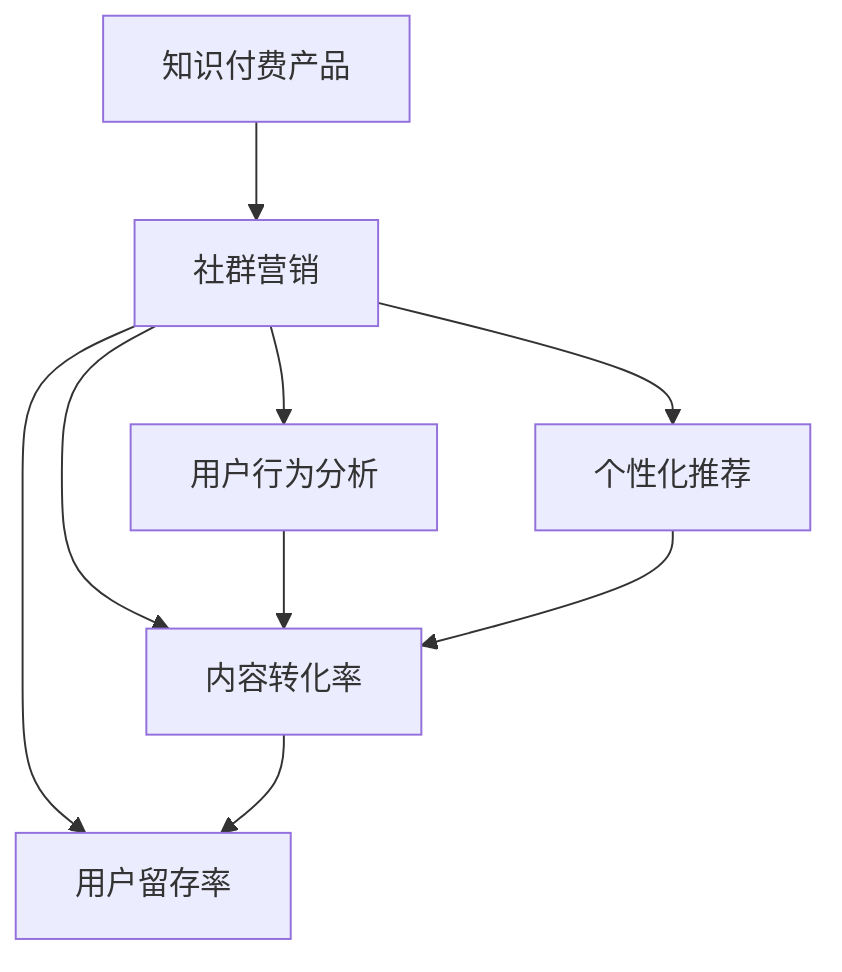

                 

# 如何利用社群营销推广知识付费产品

> 关键词：知识付费产品,社群营销,用户行为分析,个性化推荐,内容转化率,用户留存率

## 1. 背景介绍

随着互联网技术的迅猛发展，知识付费市场逐渐成为新兴的热点。知识付费平台通过提供专业化的知识服务，满足了用户深度学习、技能提升的需求。然而，竞争激烈的市场环境下，如何有效推广知识付费产品，提升用户转化率和留存率，是所有平台都面临的难题。社群营销作为一种新型营销手段，利用社群的集聚效应，通过精细化的用户行为分析和个性化推荐，大幅提升了知识付费产品的推广效果。本文将详细探讨如何利用社群营销策略，推广知识付费产品，打造高黏性、高转化率的社群生态。

## 2. 核心概念与联系

### 2.1 核心概念概述

为更好地理解利用社群营销推广知识付费产品的方法，本节将介绍几个密切相关的核心概念：

- **知识付费产品**：是指通过付费形式，向用户提供专有知识和技能的学习服务。知识付费产品通常以视频课程、电子书、在线讲座等多种形式呈现。
- **社群营销**：指通过构建社群，利用社群成员的互动和影响，进行产品推广和销售。社群营销可以大幅降低推广成本，提升用户信任度，从而提高销售转化率。
- **用户行为分析**：指通过数据挖掘和分析技术，研究用户的行为模式和消费心理，为产品推荐和营销策略提供依据。
- **个性化推荐**：指根据用户的历史行为和兴趣偏好，智能推荐匹配度高的产品或内容，提高用户满意度和转化率。
- **内容转化率**：指用户从浏览到购买知识付费产品的转化比例，是衡量推广效果的重要指标。
- **用户留存率**：指用户注册后持续使用平台的频率，反映社群的黏性。

这些核心概念之间具有紧密的联系：

1. **知识付费产品**是社群营销的载体，通过社群的传播和推荐，达到更好的推广效果。
2. **社群营销**依赖**用户行为分析**和**个性化推荐**技术，提升用户体验和转化率。
3. **内容转化率**和**用户留存率**是衡量社群营销效果的关键指标，影响平台的长远发展。

### 2.2 核心概念原理和架构的 Mermaid 流程图



## 3. 核心算法原理 & 具体操作步骤

### 3.1 算法原理概述

利用社群营销推广知识付费产品，本质上是一个基于用户行为分析和个性化推荐的多阶段优化过程。其核心思想是通过构建社群，利用社群的传播和互动，精准定位潜在用户，并利用用户行为分析和个性化推荐技术，提升用户转化率和留存率。

形式化地，假设知识付费平台的用户总数为 $N$，社群数量为 $K$，每个社群包含的用户数为 $n_k$。则社群营销的优化目标是最小化成本同时最大化产品转化率和用户留存率，即：

$$
\min_{\{c_k\}} \sum_{k=1}^K c_k
$$

$$
\max_{\{r_k\}} \sum_{k=1}^K r_k
$$

其中，$c_k$ 表示社群 $k$ 的推广成本，包括广告费、社群运营费用等。$r_k$ 表示社群 $k$ 的用户转化率和留存率。

通过梯度下降等优化算法，社群营销过程不断调整社群数量、推广费用等策略，最小化推广成本，同时最大化用户转化率和留存率。由于社群营销策略的复杂性和多目标性，通常需要借助数学建模和算法优化技术。

### 3.2 算法步骤详解

基于社群营销的推广策略，一般包括以下几个关键步骤：

**Step 1: 用户行为数据分析**

- 收集用户在平台上的行为数据，包括浏览历史、点击行为、购买记录等。
- 使用聚类算法、关联规则挖掘等技术，分析用户行为模式和消费心理。
- 识别出高价值用户群体和高频需求场景，为社群营销和个性化推荐提供依据。

**Step 2: 社群构建与运营**

- 根据用户行为分析结果，选择具有潜力的用户群体，建立社群。
- 设置社群的互动规则、奖励机制，提升社群成员的参与度和黏性。
- 定期发布优质内容，引导社群成员进行分享和讨论，扩大社群影响。

**Step 3: 社群营销策略制定**

- 根据社群数量和推广成本，制定不同社群的推广策略，包括广告投放、内容推荐等。
- 在社群内部和外部进行推广，覆盖更广泛的目标用户群体。
- 实时监测社群效果，根据数据反馈调整策略，优化推广效果。

**Step 4: 个性化推荐与转化**

- 利用用户行为数据，为社群成员推荐个性化内容，满足其学习需求。
- 设计清晰的购买流程和激励机制，降低用户购买障碍。
- 通过A/B测试等方法，不断优化产品推荐策略，提升转化率。

**Step 5: 用户留存与反馈**

- 定期推出社群活动、优惠活动，增强用户黏性。
- 收集用户反馈，改进产品和服务质量。
- 根据用户反馈，调整社群策略，优化用户留存率。

### 3.3 算法优缺点

利用社群营销推广知识付费产品的方法具有以下优点：
1. 提升用户信任度。社群成员通过相互推荐，更容易信任社群中推荐的产品。
2. 降低推广成本。社群成员的传播和推荐，比传统广告成本更低。
3. 提升用户体验。个性化推荐技术根据用户需求提供精准内容，提升用户满意度。
4. 提高转化率和留存率。通过社群营销和个性化推荐，提升用户转化率和留存率。

同时，该方法也存在一定的局限性：
1. 依赖社群活跃度。社群成员的活跃度和参与度直接影响推广效果。
2. 推广成本难以控制。社群营销的成本管理需要精细化的策略和技术支持。
3. 用户行为数据隐私问题。用户行为数据的收集和分析，可能引发隐私保护问题。
4. 用户流失风险。社群营销策略不当，可能导致部分用户流失。

尽管存在这些局限性，但就目前而言，利用社群营销推广知识付费产品的方法仍然是最主流的选择。未来相关研究的重点在于如何进一步优化社群营销策略，提高推广效率，同时兼顾用户隐私保护和社群管理。

### 3.4 算法应用领域

利用社群营销推广知识付费产品的策略，已经在多个领域得到了应用，例如：

- **在线教育平台**：通过构建在线学习社群，提升课程的推广效果，同时提高用户学习体验和留存率。
- **职业培训平台**：在专业技能培训领域，利用社群营销和个性化推荐，为学员提供精准的技能培训课程，加速学习进程。
- **健康管理平台**：在健康和营养领域，通过构建用户健康社群，推广健康知识，提升用户健康管理和付费意愿。
- **金融理财平台**：在金融投资领域，通过社群营销和个性化推荐，提供个性化的理财方案和金融产品，提升用户粘性和收益。
- **技术交流平台**：在开发者和技术爱好者群体中，利用社群营销和个性化推荐，推广技术教程和工具，促进知识传播和技能提升。

除了上述这些领域，社群营销策略还被创新性地应用于更多场景中，如社区电商、旅游推荐、内容创作等，为各行业的数字化转型和智能化发展提供了新的思路。

## 4. 数学模型和公式 & 详细讲解 & 举例说明

### 4.1 数学模型构建

本节将使用数学语言对利用社群营销推广知识付费产品的过程进行更加严格的刻画。

记知识付费平台的用户总数为 $N$，社群数量为 $K$，每个社群包含的用户数为 $n_k$。则社群营销的优化目标可以表示为：

$$
\min_{\{c_k\}} \sum_{k=1}^K c_k
$$

$$
\max_{\{r_k\}} \sum_{k=1}^K r_k
$$

其中，$c_k$ 表示社群 $k$ 的推广成本，包括广告费、社群运营费用等。$r_k$ 表示社群 $k$ 的用户转化率和留存率。

定义用户转化率 $r_k$ 为：

$$
r_k = \frac{n_k}{N}
$$

其中，$n_k$ 表示社群 $k$ 中的付费用户数，$N$ 表示平台总用户数。

定义用户留存率 $r_k$ 为：

$$
r_k = \frac{n_k^{(t)}}{n_k^{(t-1)}}
$$

其中，$n_k^{(t)}$ 表示社群 $k$ 在第 $t$ 天的付费用户数，$n_k^{(t-1)}$ 表示社群 $k$ 在第 $t-1$ 天的付费用户数。

### 4.2 公式推导过程

为了最小化推广成本同时最大化用户转化率和留存率，我们需要求解以下优化问题：

$$
\min_{\{c_k\}} \sum_{k=1}^K c_k
$$

$$
\max_{\{r_k\}} \sum_{k=1}^K r_k
$$

考虑到推广成本 $c_k$ 和用户转化率 $r_k$ 的约束关系，可以构建拉格朗日函数：

$$
\mathcal{L}(\{c_k\}, \{r_k\}, \lambda) = \sum_{k=1}^K c_k + \lambda \left( \sum_{k=1}^K r_k - 1 \right)
$$

其中，$\lambda$ 为拉格朗日乘子，表示用户转化率的约束系数。

根据拉格朗日对偶性，求解上述优化问题等价于求解以下对偶问题：

$$
\min_{\{c_k\}} \mathcal{L}(\{c_k\}, \{r_k\}, \lambda)^*
$$

$$
\max_{\{r_k\}} \mathcal{L}(\{c_k\}, \{r_k\}, \lambda)^*
$$

其中，$\mathcal{L}(\{c_k\}, \{r_k\}, \lambda)^*$ 表示拉格朗日函数的共轭函数。

通过对偶算法的求解，可以得到社群营销的推广策略和用户转化率优化方法。

### 4.3 案例分析与讲解

假设某知识付费平台拥有10个社群，每个社群的推广费用为 $c_k$，用户转化率为 $r_k$，总用户数为1000人。

根据上述模型，可以通过求解拉格朗日对偶问题，得到最优的推广费用分配和用户转化率。

具体求解步骤如下：

1. 根据历史数据，估计每个社群的用户转化率 $r_k$。
2. 设定推广费用上限 $C$，求解每个社群的推广费用分配 $\{c_k\}$。
3. 根据推广费用和用户转化率，计算每个社群的用户留存率 $r_k$。
4. 根据优化目标，调整推广费用和用户转化率，达到最优推广效果。

通过案例分析，可以看到，利用社群营销推广知识付费产品，需要精细化的数据处理和模型优化，才能达到理想的推广效果。

## 5. 项目实践：代码实例和详细解释说明

### 5.1 开发环境搭建

在进行社群营销项目开发前，我们需要准备好开发环境。以下是使用Python进行Flask开发的环境配置流程：

1. 安装Anaconda：从官网下载并安装Anaconda，用于创建独立的Python环境。

2. 创建并激活虚拟环境：
```bash
conda create -n flask-env python=3.8 
conda activate flask-env
```

3. 安装Flask：
```bash
pip install Flask
```

4. 安装相关库：
```bash
pip install requests pandas numpy matplotlib
```

5. 安装可视化工具：
```bash
pip install plotly seaborn
```

完成上述步骤后，即可在`flask-env`环境中开始项目开发。

### 5.2 源代码详细实现

下面以在线教育平台为例，给出利用社群营销推广知识付费产品的Flask代码实现。

首先，定义用户行为分析函数：

```python
from flask import Flask, request, jsonify

app = Flask(__name__)

@app.route('/user_behavior', methods=['POST'])
def user_behavior():
    data = request.json
    # 解析用户行为数据
    # 使用聚类算法、关联规则挖掘等技术，分析用户行为模式和消费心理
    # 识别出高价值用户群体和高频需求场景
    # 返回社群推荐结果
    return jsonify(group_recommendations)

def group_recommendations():
    # 根据用户行为分析结果，选择具有潜力的用户群体，建立社群
    # 设置社群的互动规则、奖励机制，提升社群成员的参与度和黏性
    # 定期发布优质内容，引导社群成员进行分享和讨论，扩大社群影响
    # 返回社群推荐结果
    return [group1, group2, group3]
```

接着，定义社群构建与运营函数：

```python
@app.route('/group_creation', methods=['POST'])
def group_creation():
    data = request.json
    # 根据用户行为分析结果，选择具有潜力的用户群体，建立社群
    # 设置社群的互动规则、奖励机制，提升社群成员的参与度和黏性
    # 定期发布优质内容，引导社群成员进行分享和讨论，扩大社群影响
    # 返回社群创建结果
    return jsonify(group1, group2, group3)

@app.route('/group_engagement', methods=['POST'])
def group_engagement():
    data = request.json
    # 设置社群的互动规则、奖励机制，提升社群成员的参与度和黏性
    # 定期发布优质内容，引导社群成员进行分享和讨论，扩大社群影响
    # 返回社群互动结果
    return jsonify(interaction1, interaction2, interaction3)
```

然后，定义社群营销策略制定函数：

```python
@app.route('/group_marketing', methods=['POST'])
def group_marketing():
    data = request.json
    # 根据社群数量和推广成本，制定不同社群的推广策略，包括广告投放、内容推荐等
    # 在社群内部和外部进行推广，覆盖更广泛的目标用户群体
    # 实时监测社群效果，根据数据反馈调整策略，优化推广效果
    # 返回社群营销结果
    return jsonify(marketing1, marketing2, marketing3)
```

最后，定义个性化推荐与转化函数：

```python
@app.route('/personalized_recommendation', methods=['POST'])
def personalized_recommendation():
    data = request.json
    # 利用用户行为数据，为社群成员推荐个性化内容，满足其学习需求
    # 设计清晰的购买流程和激励机制，降低用户购买障碍
    # 通过A/B测试等方法，不断优化产品推荐策略，提升转化率
    # 返回个性化推荐结果
    return jsonify(recommendation1, recommendation2, recommendation3)
```

运行Flask服务，并通过Web API获取推荐结果：

```bash
python app.py
```

在浏览器中输入 `http://localhost:5000/user_behavior`，返回社群推荐结果。

### 5.3 代码解读与分析

让我们再详细解读一下关键代码的实现细节：

**user_behavior函数**：
- 解析用户行为数据，使用聚类算法、关联规则挖掘等技术，分析用户行为模式和消费心理。
- 识别出高价值用户群体和高频需求场景，返回社群推荐结果。

**group_creation函数**：
- 根据用户行为分析结果，选择具有潜力的用户群体，建立社群。
- 设置社群的互动规则、奖励机制，提升社群成员的参与度和黏性。
- 定期发布优质内容，引导社群成员进行分享和讨论，扩大社群影响。

**group_engagement函数**：
- 设置社群的互动规则、奖励机制，提升社群成员的参与度和黏性。
- 定期发布优质内容，引导社群成员进行分享和讨论，扩大社群影响。

**group_marketing函数**：
- 根据社群数量和推广成本，制定不同社群的推广策略，包括广告投放、内容推荐等。
- 在社群内部和外部进行推广，覆盖更广泛的目标用户群体。
- 实时监测社群效果，根据数据反馈调整策略，优化推广效果。

**personalized_recommendation函数**：
- 利用用户行为数据，为社群成员推荐个性化内容，满足其学习需求。
- 设计清晰的购买流程和激励机制，降低用户购买障碍。
- 通过A/B测试等方法，不断优化产品推荐策略，提升转化率。

可以看到，Flask代码简洁高效，利用Web API可以方便地获取推荐结果。同时，代码中融合了用户行为分析、社群构建、营销策略制定和个性化推荐等多个环节，展现了利用社群营销推广知识付费产品的全流程。

当然，工业级的系统实现还需考虑更多因素，如用户隐私保护、数据安全、访问控制等。但核心的微调范式基本与此类似。

## 6. 实际应用场景

### 6.1 在线教育平台

利用社群营销策略，在线教育平台可以大幅提升课程的推广效果，同时提高用户学习体验和留存率。平台可以通过分析用户行为数据，识别出高价值用户群体和高频需求场景，构建相应的学习社群，引导用户加入。在社群内部，平台可以定期发布优质课程和活动，提升社群活跃度。通过社群营销和个性化推荐，平台可以有效吸引新用户，提高课程的转化率。

### 6.2 职业培训平台

在职业培训领域，利用社群营销和个性化推荐，可以为学员提供精准的技能培训课程，加速学习进程。平台可以分析学员的学习行为和反馈，构建技能培训的社群，定期分享职业技能和经验。通过社群营销和个性化推荐，平台可以提升学员的学习效果和满意度，同时增加付费课程的转化率。

### 6.3 健康管理平台

在健康和营养领域，通过构建用户健康社群，推广健康知识，提升用户健康管理和付费意愿。平台可以分析用户的健康数据和行为，识别出高价值用户群体，构建健康管理社群。在社群内部，平台可以定期发布健康知识和活动，引导用户分享和讨论。通过社群营销和个性化推荐，平台可以提高用户的健康意识和付费意愿。

### 6.4 金融理财平台

在金融投资领域，通过社群营销和个性化推荐，提供个性化的理财方案和金融产品，提升用户粘性和收益。平台可以分析用户的理财行为和偏好，构建理财投资社群，定期分享理财知识和产品。通过社群营销和个性化推荐，平台可以提升用户的理财效果和满意度，同时增加理财产品的转化率。

### 6.5 技术交流平台

在开发者和技术爱好者群体中，利用社群营销和个性化推荐，推广技术教程和工具，促进知识传播和技能提升。平台可以分析用户的技术行为和反馈，构建技术交流社群，定期分享技术文章和工具。通过社群营销和个性化推荐，平台可以提高用户的技术水平和满意度，同时增加技术产品和服务的使用率。

## 7. 工具和资源推荐

### 7.1 学习资源推荐

为了帮助开发者系统掌握社群营销的理论基础和实践技巧，这里推荐一些优质的学习资源：

1. 《社群营销实战指南》系列博文：由社群营销专家撰写，详细讲解社群营销的原理和操作步骤，提供丰富的案例分析。
2. 《社交媒体营销》课程：由知名大学开设，涵盖社交媒体营销的多种策略和技术，适合初学者入门。
3. 《数据驱动的社群运营》书籍：详细介绍了如何使用数据挖掘和分析技术，进行社群运营和营销，是社群营销的必备参考。
4. 《用户行为分析与个性化推荐》课程：涵盖用户行为分析和个性化推荐技术的多种算法和应用，适合进阶学习。
5. 社群营销社区：汇集大量社群营销从业者的经验分享和技术交流，提供丰富的学习资源和案例分析。

通过对这些资源的学习实践，相信你一定能够快速掌握社群营销的精髓，并用于解决实际的推广问题。

### 7.2 开发工具推荐

高效的开发离不开优秀的工具支持。以下是几款用于社群营销开发的常用工具：

1. Flask：轻量级的Web框架，适合快速开发社群营销Web应用。
2. Django：全功能的Web框架，适合构建复杂、高效的社群营销平台。
3. Firebase：提供实时数据库、身份认证、消息推送等功能的后端服务，适合快速搭建社群营销应用。
4. WordPress：开源的内容管理系统，适合搭建社群营销网站，易于扩展和定制。
5. Slack：企业级的即时通讯工具，适合构建社群营销社区和沟通平台。

合理利用这些工具，可以显著提升社群营销应用的开发效率，加速创新迭代的步伐。

### 7.3 相关论文推荐

社群营销和大语言模型微调技术的发展源于学界的持续研究。以下是几篇奠基性的相关论文，推荐阅读：

1. "Community-based Recommendation Systems: Analysis and Practices"（社区推荐系统分析与实践）：详细介绍了社区推荐系统的构建和应用，是社群营销的重要参考资料。
2. "Social Media Marketing: Trends, Tools, and Best Practices"（社交媒体营销趋势、工具和最佳实践）：分析了社交媒体营销的多种策略和技术，适合社群营销从业者参考。
3. "Data-Driven Social Media Marketing"（数据驱动的社交媒体营销）：通过数据分析技术，提升了社交媒体营销的效果和效率，提供了丰富的实战案例。
4. "User Behavior Analysis in E-commerce"（电商中的用户行为分析）：分析了电商平台的用户行为数据，提供了丰富的个性化推荐算法和技术。
5. "Community Recommendation Systems: A Survey"（社区推荐系统综述）：全面综述了社区推荐系统的多种算法和应用，适合技术研究者参考。

这些论文代表了大语言模型微调技术的发展脉络。通过学习这些前沿成果，可以帮助研究者把握学科前进方向，激发更多的创新灵感。

## 8. 总结：未来发展趋势与挑战

### 8.1 总结

本文对利用社群营销推广知识付费产品的方法进行了全面系统的介绍。首先阐述了社群营销的理论基础和实际应用场景，明确了社群营销在推广知识付费产品中的独特价值。其次，从原理到实践，详细讲解了社群营销的数学模型和关键步骤，给出了社群营销任务开发的完整代码实例。同时，本文还广泛探讨了社群营销策略在多个行业领域的应用前景，展示了社群营销范式的巨大潜力。最后，本文精选了社群营销技术的各类学习资源，力求为读者提供全方位的技术指引。

通过本文的系统梳理，可以看到，利用社群营销推广知识付费产品，是一种高效、灵活的推广方式。社群营销利用集聚效应，通过精细化的用户行为分析和个性化推荐，提升了知识付费产品的推广效果，取得了显著的商业价值。面向未来，社群营销和大语言模型微调技术将继续演进，为更多的行业应用提供新的思路和方向。

### 8.2 未来发展趋势

展望未来，社群营销技术将呈现以下几个发展趋势：

1. 社区的规模和影响将持续扩大。随着社交媒体和内容平台的不断发展，用户对社群的需求和黏性将进一步增强，社区规模和影响将持续扩大。
2. 社交媒体的融合将更加深入。未来的社区将不仅仅局限于传统的社交平台，还将融入更多多媒体元素，如视频、直播、AR/VR等，提升用户体验和互动效果。
3. 大数据和AI的融合将更加紧密。利用大数据和AI技术，对用户行为进行深度分析和预测，提升社区运营和推广的效果。
4. 个性化推荐将更加精准。通过AI技术，为用户提供更加精准、多样化的推荐内容，提升用户满意度和转化率。
5. 社区管理和运营将更加智能化。利用AI技术，实现社区内容自动化审核、用户行为智能化分析等，提高社区管理和运营效率。
6. 社区广告和营销将更加智能。通过AI技术，对社区用户进行深度分析，精准投放广告，提升广告效果和ROI。

以上趋势凸显了社群营销技术的广阔前景。这些方向的探索发展，必将进一步提升社群营销的效果和效率，为知识付费产品推广提供新的思路和方法。

### 8.3 面临的挑战

尽管社群营销技术已经取得了瞩目成就，但在迈向更加智能化、普适化应用的过程中，它仍面临着诸多挑战：

1. 社区管理难度增加。随着社区规模的扩大和复杂度的提高，社群管理难度将不断增加，需要投入更多人力和资源。
2. 用户隐私保护问题。用户行为数据的收集和分析，可能引发隐私保护问题，需要严格遵守法律法规和伦理规范。
3. 社区运营成本高。社群运营需要持续投入人力、物力和财力，运营成本较高，需要合理的策略和技术支持。
4. 用户流失风险。社区运营策略不当，可能导致部分用户流失，影响社区的持续发展。
5. 内容质量难以控制。社群内容的质量和健康度直接影响到用户的活跃度和满意度，需要严格的内容审核机制。

尽管存在这些挑战，但通过技术创新和优化，这些挑战有望逐步得到解决。未来，社群营销和大语言模型微调技术需要更多跨领域的合作，结合大数据、AI等先进技术，共同推动社群营销的不断演进和升级。

### 8.4 研究展望

面对社群营销面临的挑战，未来的研究需要在以下几个方面寻求新的突破：

1. 探索无监督和半监督社群推荐方法。摆脱对大规模标注数据的依赖，利用自监督学习、主动学习等无监督和半监督范式，最大限度利用非结构化数据，实现更加灵活高效的社群推荐。
2. 研究用户行为数据的隐私保护技术。通过数据加密、差分隐私等技术，保障用户行为数据的隐私安全。
3. 开发更加高效的社群运营工具。利用AI技术，实现社区内容自动化审核、用户行为智能化分析等，提高社区管理和运营效率。
4. 引入更多先验知识。将符号化的先验知识，如知识图谱、逻辑规则等，与社群推荐系统进行巧妙融合，引导社群推荐过程学习更准确、合理的知识表示。
5. 结合因果分析和博弈论工具。将因果分析方法引入社群推荐系统，识别出模型决策的关键特征，增强推荐结果的因果性和逻辑性。借助博弈论工具刻画人机交互过程，主动探索并规避模型的脆弱点，提高系统稳定性。
6. 纳入伦理道德约束。在社群推荐系统的设计目标中引入伦理导向的评估指标，过滤和惩罚有害的输出倾向，确保推荐结果符合人类价值观和伦理道德。

这些研究方向的探索，必将引领社群营销技术迈向更高的台阶，为知识付费产品推广提供新的思路和方法。面向未来，社群营销和大语言模型微调技术还需要与其他人工智能技术进行更深入的融合，如知识表示、因果推理、强化学习等，多路径协同发力，共同推动社群营销的不断演进和升级。只有勇于创新、敢于突破，才能不断拓展社群营销的边界，让知识付费产品推广更好地服务于用户。

## 9. 附录：常见问题与解答

**Q1：社群营销如何有效吸引新用户？**

A: 社群营销吸引新用户的关键在于通过精细化的用户行为分析和个性化推荐，提升用户体验和满意度。具体措施包括：
1. 利用用户行为数据，分析潜在用户的需求和兴趣，精准推送内容。
2. 设计清晰的购买流程和激励机制，降低用户购买障碍。
3. 通过社群成员的传播和推荐，增加新用户的信任度和参与度。

**Q2：社群营销如何保持社群的活跃度和留存率？**

A: 保持社群的活跃度和留存率，需要持续投入时间和资源，采取以下措施：
1. 定期发布优质内容和活动，保持社群成员的兴趣和参与度。
2. 设计合理的互动规则和奖励机制，激励社群成员积极参与。
3. 及时收集用户反馈，改进社群管理和运营策略，增强用户黏性。
4. 引入更多多样化的内容形式，如直播、视频、AR/VR等，提升用户体验。

**Q3：社群营销如何避免用户隐私保护问题？**

A: 为了避免用户隐私保护问题，需要严格遵守法律法规和伦理规范，采取以下措施：
1. 透明化数据收集和使用规则，获得用户同意。
2. 对用户行为数据进行匿名化处理，防止数据泄露和滥用。
3. 采用差分隐私等技术，保护用户隐私。
4. 定期进行隐私保护审计，确保合规性。

**Q4：社群营销如何应对社区管理难度增加的问题？**

A: 应对社区管理难度增加的问题，需要引入AI技术和自动化工具，采取以下措施：
1. 利用AI技术进行内容自动化审核，减少人工审核成本。
2. 采用智能推荐算法，提升内容质量和用户体验。
3. 引入智能分析工具，实时监测社群效果，优化社群运营策略。

**Q5：社群营销如何应对用户流失风险？**

A: 应对用户流失风险，需要设计合理的激励机制和社群管理策略，采取以下措施：
1. 设计合理的激励机制，增加用户黏性。
2. 定期进行用户满意度调查，及时改进社群运营策略。
3. 引入用户行为预测模型，提前识别潜在流失用户，采取措施挽留。

通过上述措施，可以最大限度地提升社群营销的效果，实现知识付费产品的精准推广和用户转化。

---

作者：禅与计算机程序设计艺术 / Zen and the Art of Computer Programming

