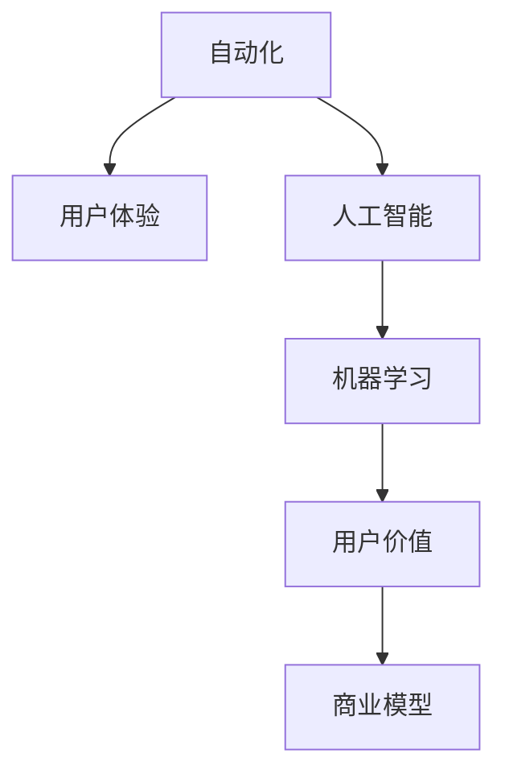

                 

# 如何在自动化创业中实现用户价值最大化

## 1. 背景介绍

在当今数字化转型浪潮下，自动化技术正迅速改变各行各业的运作方式。自动化创业，尤其是基于AI和机器学习的自动化，已经成为科技创业的热门领域。然而，创业成功并非仅靠技术堆砌，用户价值最大化才是其核心。本文章将从自动化创业的角度出发，探索如何通过技术手段提升用户价值，实现商业模式成功。

## 2. 核心概念与联系

### 2.1 核心概念概述

为更好地理解自动化创业中实现用户价值最大化的策略，本节将介绍几个密切相关的核心概念：

- **自动化(Automation)**：通过技术手段，将重复性、低附加值的任务自动化，释放人力资源，提升效率。
- **用户价值(User Value)**：用户在使用产品或服务时获得的满足感和好处。
- **商业模型(Commercial Model)**：企业如何创造、传递和捕获用户价值，以实现收入和利润的商业模式。
- **用户体验(User Experience, UX)**：用户在使用产品或服务时的感受和体验，影响用户价值的实现。
- **人工智能(Artificial Intelligence, AI)**：赋予机器类人智能，使其能够执行复杂任务的技术。
- **机器学习(Machine Learning, ML)**：让机器通过数据和算法学习任务规律，实现预测和决策。

这些概念之间的逻辑关系可以通过以下Mermaid流程图来展示：



这个流程图展示了一系列关键概念之间的联系：自动化通过人工智能和机器学习手段提升用户体验，用户体验进一步增强用户价值，而用户价值则是商业模型的核心。

## 3. 核心算法原理 & 具体操作步骤

### 3.1 算法原理概述

自动化创业中实现用户价值最大化的关键在于算法的选择和实施。以下是几个核心算法原理：

- **推荐系统**：通过分析用户行为数据，为用户推荐个性化的产品或服务，提高用户满意度。
- **自然语言处理(Natural Language Processing, NLP)**：使机器理解和生成自然语言，提升人机交互体验。
- **机器视觉**：让机器通过图像和视频识别、分析环境信息，应用于自动化任务。
- **预测模型**：通过历史数据训练模型，预测未来趋势，辅助决策。

### 3.2 算法步骤详解

自动化创业的算法实施一般包括以下关键步骤：

**Step 1: 需求分析与功能定义**

- 确定目标用户群体的需求。
- 定义自动化系统要解决的核心问题。
- 确定用户价值的定义和衡量标准。

**Step 2: 数据采集与预处理**

- 采集用户数据、行为数据等。
- 清洗数据，处理缺失值、异常值等。
- 数据标注和特征工程，提取有用特征。

**Step 3: 模型选择与训练**

- 根据任务需求选择合适的算法模型。
- 使用历史数据进行模型训练，优化超参数。
- 使用交叉验证、模型评估等方法评估模型效果。

**Step 4: 系统集成与部署**

- 将模型集成到自动化系统中。
- 实现系统与用户界面的互动。
- 部署系统到生产环境，确保稳定性和可扩展性。

**Step 5: 用户反馈与迭代改进**

- 收集用户反馈，评估系统性能。
- 根据反馈不断迭代优化算法和模型。
- 定期更新数据，重新训练和部署模型。

### 3.3 算法优缺点

自动化创业中的算法实施具有以下优点：

- 快速响应市场变化。通过算法实时处理数据，快速迭代优化产品。
- 降低人力成本。自动化系统可以替代人工完成重复性任务，降低人力成本。
- 提升用户体验。通过个性化推荐和智能交互，提升用户满意度。

同时，算法实施也存在一些缺点：

- 数据依赖性高。算法的准确性和效果高度依赖于数据的质量和完整性。
- 算法复杂度较高。部分算法模型需要大量计算资源和时间进行训练。
- 模型可解释性不足。复杂的模型难以解释其内部工作机制，用户可能难以理解。

### 3.4 算法应用领域

自动化创业中的算法可以广泛应用于以下领域：

- **智能客服**：通过自然语言处理技术，实现自动回答用户问题。
- **推荐系统**：根据用户行为数据，推荐个性化商品或内容。
- **供应链管理**：通过预测模型，优化库存管理和物流配送。
- **智能制造**：使用机器视觉技术，检测产品质量和缺陷。
- **金融风控**：通过预测模型，识别和防范金融风险。

## 4. 数学模型和公式 & 详细讲解 & 举例说明

### 4.1 数学模型构建

本节将使用数学语言对自动化创业中的算法实施进行更加严格的刻画。

设自动化系统的目标为最大化用户价值 $V$，即：

$$
V = V(x, y)
$$

其中 $x$ 为自动化系统的输入（如用户行为数据、产品参数等），$y$ 为系统的输出（如推荐结果、决策结果等）。

假设用户价值由两个部分构成：满意度和忠诚度，则有：

$$
V = S + L
$$

其中 $S$ 为满意度，$L$ 为忠诚度。

### 4.2 公式推导过程

为了最大化用户价值 $V$，我们需要对满意度 $S$ 和忠诚度 $L$ 分别进行优化。假设满意度 $S$ 由用户行为数据 $x$ 决定，忠诚度 $L$ 由用户历史数据 $y$ 决定。则有：

$$
S = f(x)
$$

$$
L = g(y)
$$

其中 $f(x)$ 和 $g(y)$ 为满意度模型和忠诚度模型。

为了最大化用户价值 $V$，我们需要对满意度模型 $f(x)$ 和忠诚度模型 $g(y)$ 进行优化。常用的优化方法包括梯度下降、粒子群优化等。以梯度下降法为例，其优化目标函数为：

$$
\min_{\theta} \sum_{i=1}^N (f(x_i) - y_i)^2
$$

其中 $\theta$ 为模型参数，$(x_i, y_i)$ 为训练数据集。

### 4.3 案例分析与讲解

以推荐系统为例，介绍其数学模型构建和优化过程。

设推荐系统根据用户历史行为 $x$ 和物品特征 $y$ 为用户推荐物品 $r$，用户满意度 $S$ 和忠诚度 $L$ 分别由物品质量 $r$ 决定。推荐系统可以表示为：

$$
S = f(x, y, r)
$$

$$
L = g(x, y, r)
$$

其中 $f(x, y, r)$ 和 $g(x, y, r)$ 分别为满意度模型和忠诚度模型，通常使用协同过滤、深度学习等方法。

为了最大化用户价值 $V$，推荐系统需要求解以下优化问题：

$$
\min_{\theta} \sum_{i=1}^N (f(x_i, y_i, r_i) - y_i)^2
$$

其中 $\theta$ 为推荐模型的参数。

## 5. 项目实践：代码实例和详细解释说明

### 5.1 开发环境搭建

在进行自动化创业的项目实践前，我们需要准备好开发环境。以下是使用Python进行TensorFlow开发的环境配置流程：

1. 安装Anaconda：从官网下载并安装Anaconda，用于创建独立的Python环境。

2. 创建并激活虚拟环境：
```bash
conda create -n tf-env python=3.8 
conda activate tf-env
```

3. 安装TensorFlow：根据CUDA版本，从官网获取对应的安装命令。例如：
```bash
conda install tensorflow -c conda-forge -c pytorch -c anaconda -c nvidia
```

4. 安装各类工具包：
```bash
pip install numpy pandas scikit-learn matplotlib tqdm jupyter notebook ipython
```

完成上述步骤后，即可在`tf-env`环境中开始项目实践。

### 5.2 源代码详细实现

下面我们以推荐系统为例，给出使用TensorFlow进行模型训练和调优的PyTorch代码实现。

首先，定义推荐系统的数据处理函数：

```python
import tensorflow as tf
from tensorflow.keras import layers, models
import numpy as np

class RecommendationSystem(tf.keras.Model):
    def __init__(self, num_users, num_items, embed_dim=16, num_factors=32):
        super(RecommendationSystem, self).__init__()
        self.embedding_layer = layers.Embedding(num_users+num_items, embed_dim, input_length=2)
        self.dot_product = layers.Dot(axes=2, normalize=True)
        self.factor_matrix = layers.Dense(num_factors, activation='relu')
        self.dot_product_2 = layers.Dot(axes=2, normalize=True)
        self.output_layer = layers.Dense(num_items, activation='softmax')
        
    def call(self, inputs):
        user, item = inputs
        embedding = self.embedding_layer([user, item])
        interaction = self.dot_product([embedding, self.factor_matrix(embedding)])
        output = self.dot_product_2([interaction, self.output_layer(interaction)])
        return output
        
# 用户行为数据和物品特征
users = [1, 2, 3, 4, 5]
items = [1, 2, 3, 4, 5]
ratings = [4, 3, 2, 5, 4]

# 构建输入输出
x = tf.keras.Input(shape=(2,), dtype=tf.int32)
y = tf.keras.Input(shape=(1,), dtype=tf.float32)
output = RecommendationSystem(num_users=len(users)+len(items), num_items=len(items))([x, y])
model = tf.keras.Model(inputs=[x, y], outputs=output)
```

然后，定义模型训练和评估函数：

```python
model.compile(optimizer=tf.keras.optimizers.Adam(learning_rate=0.01),
              loss=tf.keras.losses.MeanSquaredError(),
              metrics=[tf.keras.metrics.MeanAbsoluteError()])

# 训练模型
model.fit([users, items], ratings, batch_size=4, epochs=50, validation_split=0.2)

# 评估模型
y_pred = model.predict([[6, 6], [7, 7]])
print(y_pred)
```

最后，启动模型训练流程：

```python
epochs = 50
batch_size = 4

for epoch in range(epochs):
    model.fit([users, items], ratings, batch_size=batch_size, epochs=1, validation_split=0.2)
    print(f"Epoch {epoch+1}, train loss: {model.loss(model.predict([users, items])):.3f}")
    
print("Test results:")
y_pred = model.predict([[6, 6], [7, 7]])
print(y_pred)
```

以上就是使用TensorFlow进行推荐系统开发的完整代码实现。可以看到，利用TensorFlow和Keras等工具，可以方便地构建和训练复杂的推荐模型。

### 5.3 代码解读与分析

让我们再详细解读一下关键代码的实现细节：

**RecommendationSystem类**：
- `__init__`方法：初始化模型的各个组成部分，包括嵌入层、点积层、因子矩阵、点积层和输出层。
- `call`方法：定义模型的前向传播过程，通过嵌入层、点积层、因子矩阵和输出层计算推荐结果。

**用户行为数据和物品特征**：
- 定义用户和物品的编号列表，以及用户对物品的评分。

**模型构建**：
- 使用Keras的`Input`函数定义输入，其中`x`为用户和物品的编号，`y`为物品评分。
- 构建推荐系统模型，调用`RecommendationSystem`类。
- 使用`Model`函数定义输入和输出，并编译模型。

**模型训练**：
- 使用`fit`函数训练模型，定义批次大小、迭代轮数等参数。
- 在每个epoch结束后，计算训练集的平均损失，并在验证集上评估模型性能。
- 不断迭代，直到满足预设的迭代轮数或性能标准。

**模型评估**：
- 使用训练好的模型对新数据进行预测。
- 输出预测结果。

可以看到，TensorFlow和Keras等工具使得推荐系统的开发变得简洁高效。开发者可以将更多精力放在数据处理、模型改进等高层逻辑上，而不必过多关注底层的实现细节。

当然，工业级的系统实现还需考虑更多因素，如模型的保存和部署、超参数的自动搜索、更灵活的任务适配层等。但核心的算法实施基本与此类似。

## 6. 实际应用场景

### 6.1 智能客服系统

基于自动化创业中的推荐系统技术，可以广泛应用于智能客服系统的构建。传统客服往往需要配备大量人力，高峰期响应缓慢，且一致性和专业性难以保证。而使用自动化推荐系统，可以7x24小时不间断服务，快速响应客户咨询，用推荐内容辅助回答客户问题。

在技术实现上，可以收集客户的历史咨询记录和行为数据，使用推荐系统为用户推荐合适的问答模板。推荐系统可以动态更新，根据用户的反馈进行迭代优化，进一步提升用户满意度。

### 6.2 金融风控系统

金融机构需要实时监测市场风险，及时应对风险事件。传统的人工风控方式成本高、效率低，难以应对网络时代海量信息爆发的挑战。基于自动化创业中的推荐系统技术，可以构建智能风控系统，实时分析用户的交易行为和风险指标，预测潜在风险。

具体而言，可以收集用户的交易记录、行为数据等，使用推荐系统预测用户的信用风险和欺诈风险。系统可以根据风险评估结果，自动调整用户的信用额度，甚至采取冻结账户等措施，降低金融机构的损失风险。

### 6.3 个性化推荐系统

当前的推荐系统往往只依赖用户的历史行为数据进行物品推荐，难以深入理解用户的真实兴趣偏好。基于自动化创业中的推荐系统技术，可以构建更加智能和个性化的推荐系统，挖掘用户行为背后的语义信息，提升推荐效果。

在实践中，可以收集用户浏览、点击、评论、分享等行为数据，提取和用户交互的物品标题、描述、标签等文本内容。将文本内容作为模型输入，用户的后续行为（如是否点击、购买等）作为监督信号，在此基础上训练推荐系统。推荐系统能够从文本内容中准确把握用户的兴趣点，生成更加个性化的推荐结果。

### 6.4 未来应用展望

随着推荐系统技术的不断发展，基于自动化创业的推荐系统将在更多领域得到应用，为传统行业带来变革性影响。

在智慧医疗领域，推荐系统可以推荐个性化的治疗方案和健康建议，辅助医生诊疗，提高医疗服务的智能化水平，加速新药研发进程。

在智能教育领域，推荐系统可以推荐个性化的学习内容和方法，因材施教，促进教育公平，提高教学质量。

在智慧城市治理中，推荐系统可以推荐合适的城市事件处理策略和资源配置方案，提高城市管理的自动化和智能化水平，构建更安全、高效的未来城市。

此外，在企业生产、社会治理、文娱传媒等众多领域，基于自动化创业的推荐系统也将不断涌现，为经济社会发展注入新的动力。相信随着技术的日益成熟，推荐系统必将在更广阔的应用领域大放异彩。

## 7. 工具和资源推荐

### 7.1 学习资源推荐

为了帮助开发者系统掌握推荐系统技术的理论基础和实践技巧，这里推荐一些优质的学习资源：

1. 《推荐系统》系列书籍：全面介绍了推荐系统的算法原理和应用案例，是入门推荐系统的必读书籍。
2. CS994《推荐系统》课程：斯坦福大学开设的推荐系统课程，涵盖推荐算法、系统架构、评价指标等核心内容。
3. 《TensorFlow for Deep Learning》书籍：TensorFlow官方团队编写的深度学习入门书籍，介绍了TensorFlow在推荐系统中的应用。
4. Kaggle推荐系统竞赛：参与Kaggle的推荐系统竞赛，可以在实战中提升技能，学习最佳实践。
5. Weights & Biases：推荐系统的实验跟踪工具，可以记录和可视化模型训练过程中的各项指标，方便对比和调优。

通过对这些资源的学习实践，相信你一定能够快速掌握推荐系统技术的精髓，并用于解决实际的推荐问题。

### 7.2 开发工具推荐

高效的开发离不开优秀的工具支持。以下是几款用于推荐系统开发的常用工具：

1. TensorFlow：基于Python的开源深度学习框架，灵活动态的计算图，适合快速迭代研究。推荐系统有丰富的预训练模型资源。
2. PyTorch：基于Python的开源深度学习框架，灵活的动态图，适合科研和生产环境。推荐系统有丰富的预训练模型资源。
3. HuggingFace Transformers：NLP领域的工具库，集成了众多预训练语言模型，支持TensorFlow和PyTorch，是构建推荐系统的利器。
4. Weights & Biases：模型训练的实验跟踪工具，可以记录和可视化模型训练过程中的各项指标，方便对比和调优。
5. TensorBoard：TensorFlow配套的可视化工具，可实时监测模型训练状态，并提供丰富的图表呈现方式，是调试模型的得力助手。

合理利用这些工具，可以显著提升推荐系统任务的开发效率，加快创新迭代的步伐。

### 7.3 相关论文推荐

推荐系统的发展源于学界的持续研究。以下是几篇奠基性的相关论文，推荐阅读：

1. Matrix Factorization Techniques for Recommender Systems：提出了矩阵分解方法，为推荐系统提供了数学基础。
2. Factorization Machines for Recommender Systems：介绍因子化机模型，解决了传统矩阵分解方法的扩展性和非线性问题。
3. Deep Matrix Factorization for Recommender Systems：提出了深度神经网络模型，提升了推荐系统的预测精度。
4. Neural Collaborative Filtering：提出神经网络模型，实现了推荐系统的端到端学习。
5. Attention Mechanism in Recommender Systems：引入注意力机制，提升了推荐系统的精度和多样性。

这些论文代表了大规模推荐系统的理论发展脉络。通过学习这些前沿成果，可以帮助研究者把握学科前进方向，激发更多的创新灵感。

## 8. 总结：未来发展趋势与挑战

### 8.1 总结

本文对基于自动化创业的推荐系统技术进行了全面系统的介绍。首先阐述了自动化创业的背景和重要性，明确了推荐系统在实现用户价值最大化方面的独特价值。其次，从原理到实践，详细讲解了推荐系统的数学模型和关键步骤，给出了推荐系统任务开发的完整代码实例。同时，本文还广泛探讨了推荐系统在智能客服、金融风控、个性化推荐等多个行业领域的应用前景，展示了推荐系统技术的广阔潜力。此外，本文精选了推荐系统的各类学习资源，力求为读者提供全方位的技术指引。

通过本文的系统梳理，可以看到，基于自动化创业的推荐系统技术正在成为推荐系统领域的核心范式，极大地拓展了推荐系统的应用边界，催生了更多的落地场景。受益于大规模数据和算力的支撑，推荐系统将在更多领域大放异彩，为各行业带来颠覆性影响。未来，伴随推荐系统技术的持续演进，相信其在提升用户价值、推动商业创新方面将发挥更加重要的作用。

### 8.2 未来发展趋势

展望未来，推荐系统技术将呈现以下几个发展趋势：

1. 模型复杂度不断提升。随着深度学习的发展，推荐系统将进一步复杂化，模型结构更加庞大和精细。
2. 数据需求更加多样。推荐系统将不仅依赖用户行为数据，还利用更多的外部数据，如社交网络、地理信息等，实现更加全面和准确的用户画像。
3. 个性化需求增强。用户对个性化推荐的需求日益增长，推荐系统需要更加精细地刻画用户兴趣，生成更加个性化的推荐结果。
4. 实时性要求更高。推荐系统需要具备实时处理和推荐的能力，以提高用户体验和系统响应速度。
5. 跨平台集成能力提升。推荐系统将更广泛地集成到各种平台，如手机应用、智能家居、车载系统等，提升用户的多场景体验。
6. 数据隐私保护加强。推荐系统需重视用户隐私保护，采用差分隐私、联邦学习等技术，确保数据安全。

以上趋势凸显了推荐系统技术的广阔前景。这些方向的探索发展，必将进一步提升推荐系统的性能和应用范围，为推荐系统技术的应用和产业化铺平道路。

### 8.3 面临的挑战

尽管推荐系统技术已经取得了瞩目成就，但在迈向更加智能化、普适化应用的过程中，它仍面临着诸多挑战：

1. 数据质量瓶颈。推荐系统的效果很大程度上依赖于数据的质量，如何获取高质量的数据、标注和清洗数据，仍是重要问题。
2. 模型鲁棒性不足。当前推荐系统面对数据偏差、缺失值等问题时，性能可能大打折扣。如何提高推荐系统的鲁棒性，避免模型过拟合，是关键挑战。
3. 计算资源消耗大。推荐系统往往需要处理海量数据和复杂模型，计算资源消耗较大，如何提高模型训练和推理效率，仍是优化方向。
4. 算法可解释性不足。复杂的推荐系统模型难以解释其内部工作机制，用户可能难以理解。如何赋予推荐系统更强的可解释性，是提升用户体验的关键。
5. 推荐结果多样性不足。当前的推荐系统可能过于集中，难以应对用户需求的多样性。如何提高推荐结果的多样性，是提升用户满意度的重要方向。

6. 推荐系统的公平性和公正性问题。推荐系统需避免推荐偏差，确保不同用户群体的公平性。如何提高推荐系统的公平性，确保推荐结果公正，是未来重要的研究方向。

### 8.4 研究展望

面对推荐系统面临的种种挑战，未来的研究需要在以下几个方面寻求新的突破：

1. 探索无监督和半监督推荐方法。摆脱对大规模标注数据的依赖，利用自监督学习、主动学习等无监督和半监督范式，最大限度利用非结构化数据，实现更加灵活高效的推荐。
2. 研究参数高效和计算高效的推荐范式。开发更加参数高效的推荐方法，在固定大部分预训练参数的同时，只更新极少量的任务相关参数。同时优化推荐系统的计算图，减少前向传播和反向传播的资源消耗，实现更加轻量级、实时性的部署。
3. 引入更多先验知识。将符号化的先验知识，如知识图谱、逻辑规则等，与神经网络模型进行巧妙融合，引导推荐系统学习更准确、合理的推荐知识。同时加强不同模态数据的整合，实现视觉、语音等多模态信息与文本信息的协同建模。
4. 结合因果分析和博弈论工具。将因果分析方法引入推荐系统，识别出系统决策的关键特征，增强推荐结果的因果性和逻辑性。借助博弈论工具刻画人机交互过程，主动探索并规避推荐系统的脆弱点，提高系统稳定性。
5. 纳入伦理道德约束。在推荐系统的训练目标中引入伦理导向的评估指标，过滤和惩罚有偏见、有害的输出倾向。同时加强人工干预和审核，建立推荐系统的监管机制，确保输出符合人类价值观和伦理道德。

这些研究方向的探索，必将引领推荐系统技术迈向更高的台阶，为构建安全、可靠、可解释、可控的智能系统铺平道路。面向未来，推荐系统技术还需要与其他人工智能技术进行更深入的融合，如知识表示、因果推理、强化学习等，多路径协同发力，共同推动智能推荐系统的进步。只有勇于创新、敢于突破，才能不断拓展推荐系统的边界，让智能推荐系统更好地服务于用户，推动人类社会的智能化进程。

## 9. 附录：常见问题与解答

**Q1：自动化创业是否只适用于技术型企业？**

A: 自动化创业不仅适用于技术型企业，其他类型的企业也可以应用。只要企业存在重复性、低附加值的任务，都可以考虑自动化创业。

**Q2：自动化创业的实施成本如何？**

A: 自动化创业的实施成本主要取决于技术难度和数据获取难度。对于技术复杂度低、数据容易获取的项目，成本相对较低。但对于技术复杂度较高、数据难以获取的项目，成本可能较高。

**Q3：自动化创业过程中如何确保数据隐私和安全？**

A: 在自动化创业过程中，确保数据隐私和安全是关键。应采用数据脱敏、差分隐私、联邦学习等技术，确保用户数据不被滥用。同时，应设置严格的访问控制，确保只有授权人员可以访问数据。

**Q4：自动化创业如何平衡成本和效果？**

A: 自动化创业需要平衡成本和效果，合理选择技术方案和数据集。在预算有限的情况下，优先选择技术复杂度低、数据获取容易的项目。同时，应定期评估自动化系统的效果，根据需求进行调整。

**Q5：自动化创业在实施过程中需要注意哪些问题？**

A: 在自动化创业的实施过程中，需要注意以下几个问题：
1. 需求分析：确保系统能够满足用户的需求，提升用户体验。
2. 数据质量：确保数据的质量和完整性，避免数据偏差和噪声。
3. 模型选择：选择合适的模型和算法，确保系统的高效性和稳定性。
4. 系统集成：确保系统与业务流程无缝集成，避免系统故障和数据丢失。
5. 用户反馈：收集用户反馈，持续优化系统，提高系统性能。

总之，自动化创业需要系统地规划和实施，平衡成本和效果，确保系统的高效性和稳定性，才能实现用户价值的最大化。

