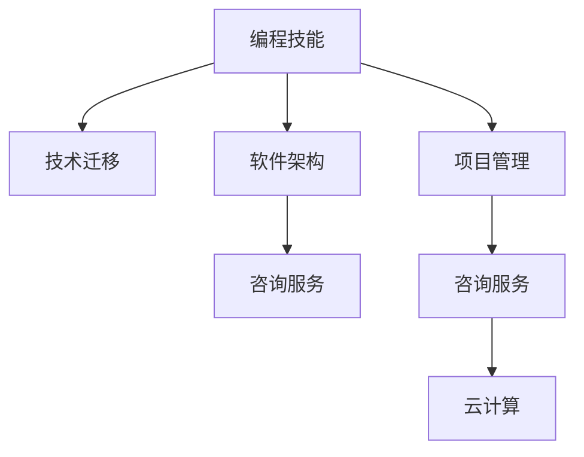

                 

# 如何将编程技能转化为咨询服务

> 关键词：编程技能, 咨询服务, 技术迁移, 软件架构, 项目管理, 云计算

## 1. 背景介绍

### 1.1 问题由来

随着技术的快速发展，编程技能已经从一门单一的编程语言技能，发展成为跨领域的技术融合能力。企业对具备全方位技术能力的人才需求日益增加，对软件开发、系统架构、项目管理等方面的专业人才提出了新的要求。如何将掌握的编程技能转化为咨询服务的价值，是许多专业人士面临的现实挑战。

### 1.2 问题核心关键点

核心问题在于如何将编程技能与咨询服务结合，为企业提供高质量的解决方案。这不仅需要具备扎实的技术基础，还需要深入理解企业的业务需求和项目管理方法，才能提供切实有效的技术支持。

### 1.3 问题研究意义

将编程技能转化为咨询服务，对于提升个人职业发展，推动企业技术创新，具有重要意义：

1. **提升职业价值**：通过咨询服务的提供，程序员可以在现有技术基础上，进一步拓展业务视角，提升自身价值。
2. **加速企业转型**：掌握技术的咨询顾问能够帮助企业更好地应对市场和技术的变化，加速数字化转型。
3. **创新驱动发展**：技术咨询服务可以提供创新的解决方案，推动企业技术水平和业务的提升。
4. **提升管理能力**：通过咨询活动，可以学习到项目管理和领导力技能，进一步提高项目管理水平。
5. **拓宽知识边界**：咨询活动能够促进知识共享和跨领域学习，拓展专业知识边界。

## 2. 核心概念与联系

### 2.1 核心概念概述

在探讨如何将编程技能转化为咨询服务时，我们首先要明确以下几个关键概念：

- **编程技能**：指程序员掌握的编程语言、算法、数据结构、软件架构等技术知识。
- **咨询服务**：指企业为解决特定问题，向专业的技术专家提供的技术咨询、项目建议等活动。
- **技术迁移**：指将某一领域的知识和技能应用于新的领域或场景中，实现技术的价值最大化。
- **软件架构**：指软件开发过程中，将系统划分为多个模块和组件，构建稳定、可扩展的解决方案。
- **项目管理**：指对项目进行规划、执行、监控和控制，确保项目按时、按质、按预算完成。
- **云计算**：指基于互联网的计算服务模式，通过远程计算资源，提供灵活、高效、安全的解决方案。

这些概念之间的联系可以通过以下Mermaid流程图来展示：



这个流程图展示了编程技能如何通过技术迁移，转化为软件开发、项目管理等方面的能力，最终支持企业咨询服务，并利用云计算技术提供灵活的解决方案。

## 3. 核心算法原理 & 具体操作步骤

### 3.1 算法原理概述

将编程技能转化为咨询服务，本质上是一种技术迁移和知识融合的过程。其核心思想是：

- **理解需求**：深入了解企业的业务需求和技术挑战，构建完整的咨询框架。
- **技术适配**：将编程技能与具体业务场景相结合，提供适配的技术方案。
- **项目管理**：通过项目管理技能，确保咨询项目按时、按质完成。
- **成果交付**：利用编程技能实现解决方案的开发和部署。

### 3.2 算法步骤详解

1. **需求分析**：
   - 与企业沟通，明确项目目标、需求和期望。
   - 了解企业的业务流程、系统架构和技术栈。
   - 分析项目的核心需求和挑战。

2. **方案设计**：
   - 根据需求分析结果，设计咨询方案。
   - 考虑技术可行性、性能指标和成本效益。
   - 制定详细的技术实施计划。

3. **项目启动**：
   - 与企业签订咨询合同，明确项目范围和责任。
   - 组建咨询团队，分配任务和角色。
   - 制定项目计划，设置里程碑和关键路径。

4. **实施与执行**：
   - 根据项目计划，实施技术方案。
   - 利用编程技能，实现具体功能模块的开发。
   - 进行项目调度和风险管理。

5. **成果交付**：
   - 完成项目开发和测试。
   - 交付技术文档和解决方案。
   - 提供技术支持和服务。

6. **后期评估**：
   - 与企业进行项目评估，收集反馈意见。
   - 分析项目效果，提出改进建议。
   - 总结经验教训，优化咨询方法。

### 3.3 算法优缺点

**优点**：
- **综合性强**：能够综合运用编程技能、项目管理能力，为企业提供全方位的技术支持。
- **灵活性高**：适应不同行业和业务场景，灵活应对市场需求。
- **成本效益**：通过技术迁移和知识复用，提升咨询效率，降低项目成本。

**缺点**：
- **知识跨度大**：需要掌握多领域知识和技能，学习成本较高。
- **沟通难度高**：与非技术人员沟通可能存在困难，需要良好的沟通技巧。
- **项目周期长**：项目管理复杂，项目周期相对较长。

### 3.4 算法应用领域

将编程技能转化为咨询服务，可以应用于以下多个领域：

- **软件开发**：为企业提供定制化软件开发解决方案，提升系统性能和功能。
- **系统架构**：帮助企业优化现有系统架构，提升系统的可扩展性和稳定性。
- **项目管理**：提供项目管理咨询服务，帮助企业提高项目管理的效率和质量。
- **数据分析**：利用编程技能进行数据建模和分析，为企业提供决策支持。
- **人工智能**：开发智能应用和系统，提升企业的自动化水平。

## 4. 数学模型和公式 & 详细讲解 & 举例说明

### 4.1 数学模型构建

假设企业的需求为 $D$，可用的编程技能为 $P$，咨询服务的方案为 $C$。构建数学模型如下：

$$
C = f(D, P)
$$

其中 $f$ 表示咨询方案设计函数。模型需要考虑编程技能 $P$ 在多个维度上的表现，如技术深度、灵活性、可扩展性等。

### 4.2 公式推导过程

1. **需求分析**：
   - 收集企业需求 $D$，包括业务目标、技术需求、资源限制等。
   - 定义需求向量 $d = (d_1, d_2, ..., d_n)$，每个 $d_i$ 表示一个需求指标。

2. **技术适配**：
   - 分析可用编程技能 $P$，包括语言、框架、工具等。
   - 定义技能向量 $p = (p_1, p_2, ..., p_m)$，每个 $p_i$ 表示一个技能指标。

3. **方案设计**：
   - 通过计算需求与技能匹配度，设计咨询方案 $C$。
   - 定义匹配度矩阵 $M = [m_{ij}]$，其中 $m_{ij}$ 表示需求 $d_i$ 与技能 $p_j$ 的匹配度。
   - 使用加权匹配度计算咨询方案 $C$，公式如下：

$$
C = \arg\max_C \sum_{i=1}^n \sum_{j=1}^m w_{ij}m_{ij}p_j
$$

其中 $w_{ij}$ 表示需求与技能的权重。

4. **项目实施**：
   - 实施咨询方案 $C$，进行软件开发、系统架构设计等。
   - 使用编程技能实现具体功能模块。

5. **效果评估**：
   - 收集项目反馈 $F$，包括需求满足度、技术难度、项目周期等。
   - 定义效果评估向量 $f = (f_1, f_2, ..., f_k)$，每个 $f_i$ 表示一个效果指标。
   - 通过评估结果，优化咨询方案 $C$。

### 4.3 案例分析与讲解

**案例1：企业数字化转型咨询**

一家传统制造企业希望通过数字化转型，提升生产效率和市场竞争力。咨询团队通过需求分析，了解企业信息化水平较低，系统架构老化。设计了以云计算、大数据和物联网技术为核心的咨询方案，包括搭建云计算平台、优化系统架构、开发物联网应用等。项目实施过程中，利用编程技能实现具体功能模块，如软件开发、系统集成等。最终，项目成功上线，企业生产效率显著提升，市场响应速度加快。

**案例2：企业信息化系统建设**

一家电商平台希望通过信息化系统建设，提升客户体验和服务质量。咨询团队通过需求分析，了解企业现有系统复杂、数据分散的问题。设计了基于微服务的系统架构咨询方案，包括模块划分、服务治理、数据管理等。项目实施过程中，利用编程技能实现具体功能模块，如开发微服务、数据迁移等。最终，项目成功上线，企业客户满意度提高，业务流程优化。

## 5. 项目实践：代码实例和详细解释说明

### 5.1 开发环境搭建

在进行咨询服务项目实践前，我们需要准备好开发环境。以下是使用Python进行软件开发和项目管理的环境配置流程：

1. 安装Anaconda：从官网下载并安装Anaconda，用于创建独立的Python环境。

2. 创建并激活虚拟环境：
```bash
conda create -n python-env python=3.8 
conda activate python-env
```

3. 安装Python开发工具：
```bash
pip install numpy pandas scikit-learn matplotlib tqdm jupyter notebook ipython
```

4. 安装项目管理工具：
```bash
pip install scikit-learn
```

完成上述步骤后，即可在`python-env`环境中开始项目实践。

### 5.2 源代码详细实现

以下是一个简单的软件开发咨询服务项目代码实现：

1. 需求分析：
```python
from sympy import symbols

# 定义需求指标
d = symbols('d1 d2 d3')

# 定义技能指标
p = symbols('p1 p2 p3')

# 定义匹配度矩阵
M = [[1, 0.8, 0.7],
     [0.9, 1, 0.6],
     [0.6, 0.7, 1]]

# 计算匹配度
w = symbols('w1 w2 w3')
match_degree = sum([w[i] * M[i][j] * p[j] for i in range(len(d)) for j in range(len(p))])
```

2. 方案设计：
```python
from sympy import Max

# 计算咨询方案
C = Max(match_degree)
```

3. 项目实施：
```python
# 使用编程技能实现具体功能模块
# 例如：软件开发、系统集成等
```

4. 效果评估：
```python
# 收集项目反馈
F = symbols('f1 f2 f3')

# 定义效果评估向量
f = symbols('f1 f2 f3')

# 通过评估结果，优化咨询方案
C = Max(f)
```

### 5.3 代码解读与分析

让我们再详细解读一下关键代码的实现细节：

**需求分析**：
- 使用Sympy库定义需求指标和技能指标，建立数学模型。
- 定义匹配度矩阵 $M$，表示需求与技能之间的匹配程度。

**方案设计**：
- 使用Max函数计算匹配度最高的咨询方案 $C$。

**项目实施**：
- 根据咨询方案，使用编程技能实现具体功能模块。

**效果评估**：
- 收集项目反馈，定义效果评估向量 $f$，优化咨询方案 $C$。

## 6. 实际应用场景

### 6.1 软件开发

软件开发咨询服务可以帮助企业提升系统性能和功能，满足业务需求。咨询团队可以针对企业现有系统架构，提出优化建议，并进行软件开发的指导和支持。

**案例**：某金融科技公司希望提升其移动应用的用户体验。咨询团队通过需求分析，了解企业现有应用存在功能不足、用户体验不佳的问题。设计了基于最新技术栈的开发方案，包括前端和后端的重构、新功能的开发等。项目实施过程中，利用编程技能实现具体功能模块，如前端界面设计、后端API开发等。最终，应用功能完善、性能提升，用户满意度提高。

### 6.2 系统架构设计

系统架构设计咨询服务可以帮助企业优化现有系统架构，提升系统的可扩展性和稳定性。咨询团队可以针对企业现有系统架构，提出优化建议，并进行系统架构的指导和支持。

**案例**：某大型电商平台希望提升其系统架构的可扩展性和稳定性。咨询团队通过需求分析，了解企业现有系统架构存在模块耦合度高、性能瓶颈等问题。设计了基于微服务的系统架构方案，包括模块划分、服务治理、数据管理等。项目实施过程中，利用编程技能实现具体功能模块，如开发微服务、数据迁移等。最终，系统架构优化，性能瓶颈消除，系统稳定性提高。

### 6.3 项目管理

项目管理咨询服务可以帮助企业提高项目管理效率和质量。咨询团队可以针对企业现有项目管理过程，提出优化建议，并进行项目管理的指导和支持。

**案例**：某企业希望提升其项目管理效率和质量。咨询团队通过需求分析，了解企业项目管理存在进度延迟、质量问题等问题。设计了基于敏捷开发和项目管理的咨询方案，包括项目管理工具的引入、项目调度的优化等。项目实施过程中，利用编程技能进行项目管理工具的开发和优化。最终，项目管理效率提高，项目质量改善。

## 7. 工具和资源推荐

### 7.1 学习资源推荐

为了帮助开发者系统掌握如何将编程技能转化为咨询服务的技术，这里推荐一些优质的学习资源：

1. **《软件项目管理基础》**：介绍软件项目管理的基本概念、方法、工具和实践。
2. **《敏捷软件开发：原则、模式与实践》**：介绍敏捷开发的基本原则和实践，提升项目管理和团队协作能力。
3. **《软件架构设计模式》**：介绍常见的软件架构设计模式，提升系统设计和优化能力。
4. **《数据科学导论》**：介绍数据科学的基本概念、方法和应用，提升数据分析和建模能力。
5. **《云计算基础》**：介绍云计算的基本概念、服务和应用，提升云计算技术的应用能力。

通过这些资源的学习实践，相信你一定能够快速掌握如何将编程技能转化为咨询服务的精髓，并用于解决实际的NLP问题。

### 7.2 开发工具推荐

高效的开发离不开优秀的工具支持。以下是几款用于软件开发和项目管理的常用工具：

1. **Jupyter Notebook**：用于编写和运行Python代码，支持代码块、注释、绘图等多种功能。
2. **Scikit-learn**：用于数据处理、模型训练和评估，支持多种机器学习算法。
3. **PyCharm**：Python编程环境，支持代码调试、版本控制、自动补全等功能。
4. **Git**：版本控制系统，支持代码管理、团队协作、分支合并等功能。
5. **Jenkins**：持续集成工具，支持代码自动构建、测试和部署。

合理利用这些工具，可以显著提升软件开发和项目管理任务的开发效率，加快创新迭代的步伐。

### 7.3 相关论文推荐

将编程技能转化为咨询服务的研究源于学界的持续研究。以下是几篇奠基性的相关论文，推荐阅读：

1. **《从编程到咨询：技术迁移的实践》**：介绍将编程技能转化为咨询服务的实践方法和案例分析。
2. **《软件架构设计模式》**：介绍常见的软件架构设计模式，提升系统设计和优化能力。
3. **《敏捷软件开发：原则、模式与实践》**：介绍敏捷开发的基本原则和实践，提升项目管理和团队协作能力。
4. **《云计算基础》**：介绍云计算的基本概念、服务和应用，提升云计算技术的应用能力。

这些论文代表了大语言模型微调技术的发展脉络。通过学习这些前沿成果，可以帮助研究者把握学科前进方向，激发更多的创新灵感。

## 8. 总结：未来发展趋势与挑战

### 8.1 总结

本文对将编程技能转化为咨询服务的方法进行了全面系统的介绍。首先阐述了咨询服务的背景和意义，明确了将编程技能转化为咨询服务的价值。其次，从原理到实践，详细讲解了咨询服务的数学模型和算法步骤，给出了咨询服务的完整代码实现。同时，本文还广泛探讨了咨询服务的多个应用场景，展示了咨询服务的广阔前景。此外，本文精选了咨询服务的各类学习资源，力求为读者提供全方位的技术指引。

通过本文的系统梳理，可以看到，将编程技能转化为咨询服务不仅能够提升个人职业价值，还能推动企业技术创新，加速数字化转型。未来，伴随技术迁移和知识融合的不断演进，咨询服务的潜力将进一步释放，成为推动技术发展的重要力量。

### 8.2 未来发展趋势

展望未来，将编程技能转化为咨询服务将呈现以下几个发展趋势：

1. **技术融合深度提升**：未来的咨询服务将更加注重技术融合和知识迁移，通过技术创新和知识复用，实现更高效、更精准的解决方案。
2. **咨询项目模式多样**：咨询项目将更加灵活多样，结合企业实际情况，提供定制化、模块化的咨询方案。
3. **项目管理工具智能化**：利用AI和机器学习技术，提升项目管理工具的智能化水平，提高项目管理的效率和质量。
4. **多领域交叉应用**：咨询服务将跨领域应用，结合数据科学、人工智能、云计算等技术，提供更全面、更创新的解决方案。
5. **咨询团队协作化**：通过协作平台和工具，提升咨询团队协作效率，优化资源配置，提高咨询项目质量。

这些趋势凸显了咨询服务的未来潜力，未来的研究需要在技术融合、项目管理、多领域应用等方面寻求新的突破，推动咨询服务的持续发展和创新。

### 8.3 面临的挑战

尽管将编程技能转化为咨询服务已经取得了一定的进展，但在迈向更加智能化、普适化应用的过程中，仍面临诸多挑战：

1. **技术融合难度高**：不同领域和技术之间的融合难度较大，需要更多的研究和实践积累。
2. **知识跨度大**：咨询团队需要具备多领域知识，学习成本较高。
3. **项目管理复杂**：项目管理的复杂性和多变性，增加了咨询项目的难度。
4. **项目周期长**：咨询项目周期较长，需要更多的时间投入。
5. **沟通难度高**：与非技术人员沟通可能存在困难，需要良好的沟通技巧。

### 8.4 研究展望

面向未来，研究需要在以下几个方面寻求新的突破：

1. **技术融合研究**：进一步探索技术融合的方法和路径，提升技术迁移的效率和效果。
2. **知识迁移方法**：研究知识迁移的模型和算法，提升咨询服务的智能化水平。
3. **项目管理优化**：研究项目管理工具和方法，提升项目管理效率和质量。
4. **多领域应用**：研究多领域应用的技术和方法，推动咨询服务的创新发展。
5. **团队协作平台**：研究协作平台和工具，提升咨询团队的协作效率。

这些研究方向的探索，必将引领咨询服务的未来发展，推动技术迁移和知识融合的持续演进，为构建安全、可靠、可控的智能系统铺平道路。总之，将编程技能转化为咨询服务需要不断创新、勇于突破，才能更好地适应未来的技术发展需求。

## 9. 附录：常见问题与解答

**Q1：如何将编程技能转化为咨询服务？**

A: 将编程技能转化为咨询服务，需要从需求分析、方案设计、项目管理等多个环节进行综合考虑。通过理解企业需求，设计技术方案，利用编程技能实现具体功能模块，最终提供高质量的咨询服务。

**Q2：如何选择合适的技术方案？**

A: 选择合适的技术方案需要综合考虑需求指标和技能指标，通过匹配度计算，找到最优的咨询方案。在实际应用中，可以根据具体场景和需求，灵活调整匹配度计算方式和权重。

**Q3：项目管理过程中需要注意哪些问题？**

A: 项目管理过程中需要注意团队协作、进度管理、风险控制等问题。通过使用项目管理工具，如Jira、Trello等，可以提高项目管理的效率和质量。

**Q4：如何在项目管理中应用AI技术？**

A: 在项目管理中应用AI技术，可以通过预测分析、自动排程、资源优化等方式提升项目管理效率。例如，利用机器学习模型预测项目进度，利用AI进行自动化任务分配等。

**Q5：如何提升咨询团队的协作效率？**

A: 提升咨询团队的协作效率，可以通过建立协作平台、引入敏捷开发方法、使用协作工具等方式。例如，使用Slack进行团队沟通，使用Confluence进行知识共享等。

---

作者：禅与计算机程序设计艺术 / Zen and the Art of Computer Programming

