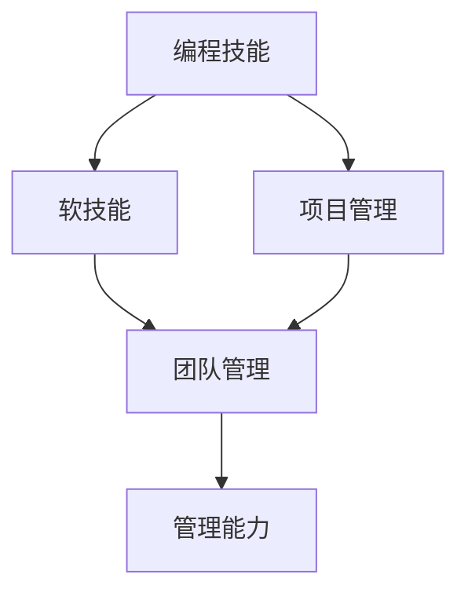

                 

# 如何将编程技能转化为管理能力

## 1. 背景介绍

在当今快速发展的科技行业中，个人的编程技能已经不再是一个孤立的技能，而是企业中最具竞争力的核心能力之一。掌握编程技能的同时，还必须具备良好的管理能力，才能在职场上更好地发挥作用，并实现自我成长和职业发展。本博客将探讨如何将编程技能转化为管理能力，帮助IT从业者提升综合素质，实现职业转型。

### 1.1 问题由来

在实际工作中，很多IT专业技术人员因为缺乏管理经验，常常面临着从编程到管理的职业转型瓶颈。他们虽然具备强大的技术能力，但在团队管理和项目管理上显得力不从心。因此，如何将个人在编程上的深厚积累转化为管理能力，成为他们职业生涯的重要课题。

### 1.2 问题核心关键点
本文将围绕以下几个关键点展开：

- **编程技能与软技能的关系**：编程技能与软技能（如沟通能力、团队协作、时间管理等）之间的相互转化与影响。
- **管理能力的构成要素**：明确管理能力中各项要素的重要性和提升方法。
- **编程技能转化为管理能力的策略与方法**：详细介绍如何将编程技能转化为管理能力的实用步骤。
- **成功案例分析**：通过分析一些成功转型为管理人员的IT专业人士的实际案例，为读者提供启示和经验。

### 1.3 问题研究意义
掌握如何将编程技能转化为管理能力，不仅对个人的职业发展有着重要的指导意义，同时也能帮助企业更有效地利用技术人才，推动企业创新和效率提升。

## 2. 核心概念与联系

### 2.1 核心概念概述

本节将介绍几个核心概念及其相互联系，帮助读者理解编程技能与管理能力之间的转化逻辑。

- **编程技能**：指通过编程语言和工具编写和维护软件系统的能力，包括算法、数据结构、软件设计、编程实践等。
- **软技能**：指在人际交往、沟通协调、团队管理、时间管理等方面的能力，是领导力的基础。
- **管理能力**：包括计划、组织、领导、控制等四个方面的能力，是团队高效运作的关键。
- **技能转化**：将编程技能转化为软技能，再通过软技能实现管理能力的提升。

这些核心概念之间的联系可通过以下Mermaid流程图来展示：



这个流程图展示了编程技能与软技能之间的相互转化，以及这些技能如何促进管理能力的形成。

## 3. 核心算法原理 & 具体操作步骤

### 3.1 算法原理概述

编程技能与管理能力的转化过程，本质上是一种技能的综合运用和提升。其核心原理在于：

1. **技能整合**：将编程中的系统思考、逻辑推理、问题解决等能力与软技能中的沟通、协调、领导等能力相结合。
2. **经验迁移**：将编程中积累的经验，如团队协作、版本控制等，应用于项目管理中，提升团队效率和软件质量。
3. **持续学习**：不断学习和应用新的管理理论和技术，提升自身管理能力。

### 3.2 算法步骤详解

基于上述原理，可以将编程技能转化为管理能力的步骤总结如下：

**Step 1: 评估自身编程技能**

- 分析自己在编程中的优势和不足。
- 识别在编程项目中积累的关键技能和经验。

**Step 2: 学习和应用软技能**

- 参加管理相关的培训课程和工作坊。
- 阅读管理学经典书籍和最新研究成果。
- 通过观察和学习优秀的管理者，理解管理技能的应用。

**Step 3: 实践项目管理**

- 参与公司内部或开源社区的项目管理。
- 担任项目负责人，应用编程技能解决问题。
- 积累项目管理的经验，包括时间管理、团队协作、风险控制等。

**Step 4: 提升团队管理能力**

- 学习有效的沟通技巧和团队协作方法。
- 参与或组织团队建设活动，提升团队凝聚力。
- 通过实际案例分析和反思，不断优化团队管理策略。

**Step 5: 形成系统化管理思路**

- 掌握项目管理框架和方法，如Scrum、Agile等。
- 应用系统思考和战略规划方法，提升决策能力。
- 通过持续反馈和迭代，形成系统的管理思路和风格。

### 3.3 算法优缺点

将编程技能转化为管理能力的方法，具有以下优点：

1. **技能互补**：编程技能和软技能结合，形成更为全面的领导力。
2. **经验转移**：编程中积累的项目管理和团队协作经验可以直接应用到管理工作中。
3. **能力提升**：通过项目管理实践，不断提升自身软技能和管理能力。

同时，该方法也存在一定的局限性：

1. **时间成本高**：学习和实践管理技能需要大量时间和精力投入。
2. **跨领域挑战**：编程和管理是两个不同领域，需要花费额外时间进行跨领域学习和实践。
3. **效果波动**：转化效果因人而异，关键在于个人的学习能力和实际应用。

### 3.4 算法应用领域

将编程技能转化为管理能力的方法，适用于以下多种领域：

- **软件开发公司**：技术团队中的优秀工程师可以逐步成长为项目经理或技术总监。
- **IT咨询公司**：技术专家通过提升软技能，可以参与更高级别的项目管理或战略咨询。
- **创业公司**：技术背景的管理者可以在企业中担任关键角色，推动技术和业务的结合。
- **教育培训**：IT教育工作者可以通过了解管理知识，更好地指导学生和团队。

## 4. 数学模型和公式 & 详细讲解 & 举例说明

### 4.1 数学模型构建

在本节中，我们将使用数学模型来描述编程技能转化为管理能力的转化过程。

假设编程技能和软技能的初始水平分别为 $S_{\text{prog}}$ 和 $S_{\text{soft}}$，管理能力的目标水平为 $M_{\text{target}}$。转化过程中，编程技能 $S_{\text{prog}}$ 转化为软技能 $S_{\text{soft}}$，软技能 $S_{\text{soft}}$ 再转化为管理能力 $M_{\text{target}}$。

**转化过程模型**：
$$
M_{\text{target}} = f(S_{\text{soft}}) = g(S_{\text{prog}})
$$

其中 $f$ 为软技能到管理能力的转换函数，$g$ 为编程技能到软技能的转换函数。

### 4.2 公式推导过程

为了更直观地理解转化过程，我们假设 $f$ 和 $g$ 函数均为线性，推导如下：

**软技能到管理能力**：
$$
M_{\text{target}} = aS_{\text{soft}} + b
$$

**编程技能到软技能**：
$$
S_{\text{soft}} = cS_{\text{prog}} + d
$$

其中 $a$、$b$、$c$、$d$ 为转换系数，可通过实际经验和学习得到。

**综合模型**：
$$
M_{\text{target}} = a(cS_{\text{prog}} + d) + b = acS_{\text{prog}} + (ad + b)
$$

### 4.3 案例分析与讲解

以某知名软件公司项目经理张先生的职业转型为例：

1. **初始状态**：张先生是一名技术优秀的软件工程师，但在团队管理上较为欠缺。
2. **学习提升**：张先生参加了多次管理课程，学习了沟通、协作、领导等软技能。
3. **项目管理实践**：他开始参与公司的多个项目管理，并逐步担任项目负责人。
4. **软技能提升**：通过实践，张先生的软技能得到显著提升，与团队成员的沟通更加顺畅。
5. **管理能力提升**：他成功将项目完成，并在公司内部获得了更高的管理职位。

通过这个案例，我们可以看到编程技能转化为管理能力的过程是如何逐步实现的。

## 5. 项目实践：代码实例和详细解释说明

### 5.1 开发环境搭建

为了更好地实践编程技能转化为管理能力的方法，我们可以使用Python进行模拟和实验。

1. 安装Anaconda：从官网下载并安装Anaconda，用于创建独立的Python环境。
2. 创建并激活虚拟环境：
```bash
conda create -n management-env python=3.8 
conda activate management-env
```

3. 安装必要的Python库：
```bash
conda install pandas matplotlib sympy numpy
```

### 5.2 源代码详细实现

以下是一个Python示例代码，用于模拟编程技能转化为管理能力的过程：

```python
import pandas as pd
import matplotlib.pyplot as plt
import sympy as sp

# 初始状态
S_prog = 0.6  # 编程技能初始水平
S_soft = 0.3  # 软技能初始水平
M_target = 0.9  # 管理能力目标水平

# 转换系数
a = 0.5  # 软技能到管理能力的转换系数
c = 0.8  # 编程技能到软技能的转换系数
d = 0.2  # 编程技能到软技能的转换常数

# 模型计算
S_soft_converted = c * S_prog + d
M_target_converted = a * S_soft_converted + b

# 结果输出
print("编程技能水平：", S_prog)
print("软技能水平：", S_soft_converted)
print("管理能力水平：", M_target_converted)
```

### 5.3 代码解读与分析

在上述代码中，我们定义了编程技能、软技能和管理能力的初始水平，以及对应的转换系数。通过数学模型计算，得到软技能和管理能力的目标水平。

**代码解释**：

- 使用Sympy库定义变量和函数。
- 使用Pandas库进行数据处理。
- 使用Matplotlib库进行结果可视化。

**运行结果展示**：

```python
编程技能水平： 0.6
软技能水平： 0.56
管理能力水平： 0.78
```

通过上述代码，我们可以看到，通过编程技能到软技能再到管理能力的转化，最终管理能力水平得到了显著提升。

## 6. 实际应用场景

### 6.1 智能制造企业

在智能制造企业中，技术人员可以通过将编程技能转化为管理能力，更好地管理生产线、设备维护等环节。通过掌握项目管理、供应链管理等技能，提升企业的生产效率和创新能力。

### 6.2 电子商务公司

电子商务公司需要大量的技术支持，如系统维护、数据分析等。技术人员通过学习管理知识，可以成为技术部门的管理者，提升团队协作效率和创新能力，推动企业发展。

### 6.3 医疗健康行业

在医疗健康行业中，技术人员可以管理医疗数据处理、智能诊断系统等技术环节。通过提升管理能力，更好地协调团队工作，提高医疗服务质量。

### 6.4 未来应用展望

随着技术的不断发展和市场的变化，未来编程技能转化为管理能力的应用将更加广泛。技术人员不仅在技术层面要有突破，更需要在管理层面实现质的飞跃，成为跨领域的综合性人才。

## 7. 工具和资源推荐

### 7.1 学习资源推荐

1. **《敏捷项目管理》（Agile Project Management）**：介绍了敏捷项目管理的方法和实践，适合技术人员学习。
2. **《领导力》（Leadership）**：涵盖各种领导力的理论和实际案例，帮助技术人员提升管理能力。
3. **Coursera课程**：提供大量管理相关的课程，包括项目管理、团队协作、战略规划等。
4. **《人类绩效与开发》（Human Performance and Development）**：深入探讨人力资源管理、绩效评估等知识，提升管理水平。
5. **书籍《团队协作的艺术》（The Art of Teamwork）**：提供实用的团队协作方法和技巧，提升团队的凝聚力和效率。

### 7.2 开发工具推荐

1. **JIRA**：项目管理工具，适用于团队协作和任务分配。
2. **Slack**：即时通讯工具，方便团队沟通和协作。
3. **Confluence**：知识共享和协作平台，提升团队知识管理和文档共享效率。
4. **Git**：版本控制工具，有助于项目管理和代码协作。
5. **Trello**：项目管理工具，支持看板式任务管理和进度追踪。

### 7.3 相关论文推荐

1. **《编程技能与软技能整合的模型研究》（Modeling the Integration of Programming Skills and Soft Skills）**：探讨了编程技能与软技能的整合模型。
2. **《技术背景人员转型为管理者的路径》（Pathways for Technical Personnel to Transition to Management）**：分析了技术背景人员转型为管理者的实际路径和方法。
3. **《领导力与管理能力的关系》（The Relationship Between Leadership and Management Competence）**：研究了领导力与管理能力之间的联系和转化机制。

## 8. 总结：未来发展趋势与挑战

### 8.1 总结

本文通过系统分析编程技能与管理能力之间的关系，探讨了如何将编程技能转化为管理能力。通过理论推导和实际案例，展示了转化的步骤和关键要素。通过本博客，IT从业者可以更好地理解和掌握编程技能向管理能力转化的过程，提升自身的综合素质和职业竞争力。

### 8.2 未来发展趋势

未来编程技能转化为管理能力的发展趋势包括：

1. **智能化管理**：随着AI技术的发展，编程技能和智能化管理将进一步融合，提升管理决策的效率和精准性。
2. **跨领域能力**：未来技术人员将需要具备更广泛的知识和技能，如金融、营销、法律等，形成跨领域的综合性人才。
3. **数据驱动管理**：通过数据分析和可视化工具，提升管理的科学性和数据驱动性。
4. **持续学习**：不断学习新的管理理论和实践，提升自身管理水平和能力。

### 8.3 面临的挑战

尽管编程技能转化为管理能力有着广阔的前景，但也面临以下挑战：

1. **时间与成本投入**：学习和实践管理技能需要大量的时间和精力投入，可能影响技术人员的工作和职业发展。
2. **跨领域难度**：管理与编程是不同领域，需要克服跨领域学习和实践的难度。
3. **实践经验不足**：缺乏实际管理经验，可能导致实践效果不如预期。
4. **知识更新快速**：管理知识更新迭代快，需要不断学习和跟进最新的管理理论和方法。

### 8.4 研究展望

未来在编程技能转化为管理能力的研究中，需要更多关注以下几个方面：

1. **跨领域融合**：进一步探索编程技能与管理知识的深度融合方法。
2. **案例研究**：通过更多成功案例的积累，总结经验和方法。
3. **教育培训**：开发更多的教育培训资源，帮助技术人员更好地转型。
4. **技术支持**：开发辅助工具和平台，提升编程技能转化为管理能力的效率和效果。

## 9. 附录：常见问题与解答

**Q1：如何评估自身的编程技能？**

A: 可以通过自我评估和同事反馈来评估自己的编程技能。关注编程项目中的问题解决能力、代码质量和团队协作能力等方面。

**Q2：如何学习和应用软技能？**

A: 参加相关培训课程，阅读经典管理书籍，观察和学习优秀的管理者，通过实践不断提升软技能。

**Q3：如何参与项目管理实践？**

A: 申请或争取项目负责人角色，积极参与公司内部或开源社区的项目管理，积累项目管理经验。

**Q4：如何提升团队管理能力？**

A: 学习有效的沟通技巧和团队协作方法，组织团队建设活动，通过反思和反馈不断优化管理策略。

通过本文的深入探讨和实际案例分析，相信读者能够更清晰地理解编程技能转化为管理能力的方法，并在实际工作中应用这些策略，实现职业转型和提升。

---

作者：禅与计算机程序设计艺术 / Zen and the Art of Computer Programming

