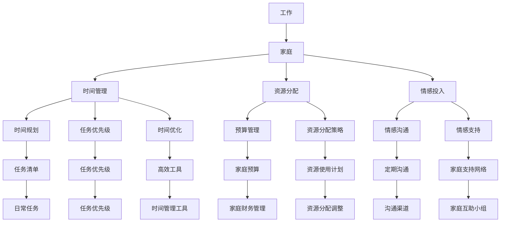

                 

# 如何平衡工作与家庭生活

## 1. 背景介绍

在当今快速发展的社会，人们的工作和生活节奏不断加快，如何平衡好工作与家庭生活已成为许多人面临的重大挑战。特别是在科技、金融、互联网等高强度和高竞争行业中，工作要求高、时间长，而家庭责任和生活中的琐事也不容忽视。正确平衡工作与家庭生活，不仅有助于个人的身心健康，还能促进家庭和谐，提升工作效率和生活质量。本文将从多个角度探讨如何平衡工作与家庭生活，希望能为读者提供有益的参考和指导。

## 2. 核心概念与联系

### 2.1 核心概念概述

**工作与家庭生活**：工作是指个人为获取经济收入而进行的活动，包括职业发展、项目管理和日常事务等；家庭生活则是指与家庭成员共同生活、照顾家庭、享受亲情等。

**平衡**：平衡是指在工作与家庭生活之间找到一个合理的比例，使得两者能够相互支持和促进，从而达到身心和谐的状态。

**资源分配**：资源分配是指在时间、精力和情感等方面合理分配，确保工作与家庭生活的需求得到满足。

**时间管理**：时间管理是指通过规划和优化时间，提高效率，确保在有限的时间内完成工作和家庭任务。

**情感投入**：情感投入是指在工作和家庭中投入适当的情感和关注，提升家庭成员的幸福感和满足感。

### 2.2 核心概念原理和架构的 Mermaid 流程图



这个流程图展示了工作与家庭生活的平衡涉及到的时间管理、资源分配、情感投入等方面。工作与家庭之间是双向的，通过合理的时间管理、预算管理、情感沟通等手段，可以更好地支持彼此的均衡发展。

## 3. 核心算法原理 & 具体操作步骤

### 3.1 算法原理概述

平衡工作与家庭生活的核心在于优化时间分配和资源使用，通过合理规划和管理，确保两者都能得到充分的关注和投入。以下是基于算法的方法来平衡工作与家庭生活的步骤：

1. **时间规划**：根据工作任务和家庭责任，制定详细的时间计划。
2. **任务优先级**：确定每项任务的重要性和紧急程度，合理分配时间。
3. **时间优化**：采用高效的时间管理工具和策略，提高工作效率。
4. **资源分配**：在时间和情感投入上，合理分配资源，确保双方都能得到足够的关注。

### 3.2 算法步骤详解

#### 3.2.1 制定详细的时间计划

1. **评估工作需求**：列出每周的工作任务、会议和项目，并估算所需时间。
2. **评估家庭责任**：列出需要照顾的家庭成员、家庭活动和日常事务，并估算所需时间。
3. **确定优先级**：根据工作与家庭的需求，确定各项任务的优先级。
4. **制定时间表**：将工作和家庭任务安排到日历中，确保时间得到合理安排。

#### 3.2.2 确定任务优先级

1. **重要性和紧急程度**：使用四象限法则（重要紧急、重要不紧急、紧急不重要、不紧急不重要）对任务进行分类。
2. **时间评估**：估算每项任务所需的时间，并考虑任务的时间窗口。
3. **优先级排序**：根据任务的重要性和紧急程度，进行优先级排序。

#### 3.2.3 时间优化

1. **采用高效工具**：使用时间管理软件（如Trello、Notion等）帮助规划和管理任务。
2. **采用番茄工作法**：每25分钟专注工作，休息5分钟，提高专注力和工作效率。
3. **优化日常流程**：简化日常事务，减少不必要的耗时。

#### 3.2.4 资源分配

1. **时间分配**：根据任务优先级和时间表，合理分配时间。
2. **情感投入**：在工作和家庭之间平衡情感投入，确保家庭成员的幸福感和满足感。
3. **灵活调整**：根据实际情况，灵活调整时间安排和资源分配。

### 3.3 算法优缺点

#### 优点

1. **提高效率**：通过优化时间管理，能够提高工作效率，减少无效耗时。
2. **减少压力**：合理规划任务和时间，能够减轻工作和生活压力。
3. **增强家庭幸福感**：合理分配情感投入，能够增强家庭成员的幸福感和满足感。

#### 缺点

1. **复杂度高**：制定详细时间计划和任务优先级排序需要较高的复杂度和细致度。
2. **适应性差**：生活和工作环境的变化可能会导致计划调整，需要灵活应对。
3. **依赖个人执行力**：个人执行力不足，可能导致计划难以执行。

### 3.4 算法应用领域

该算法可以应用于各种工作与家庭生活场景，如职场员工、自由职业者、家庭主妇等。在企业和家庭管理中，可以结合具体情况，灵活调整和优化时间规划、任务优先级、时间优化和资源分配策略，以达到最佳平衡效果。

## 4. 数学模型和公式 & 详细讲解 & 举例说明

### 4.1 数学模型构建

假设某人的工作时间为 $W$，家庭时间为 $H$，总时间为 $T$。设每天工作时间为 $w$，家庭时间为 $h$，则有：

$$
W = w \times N \\
H = h \times N \\
T = W + H
$$

其中，$N$ 为工作日数，$w$ 为每天工作时间，$h$ 为每天家庭时间。

### 4.2 公式推导过程

由上述公式可知，通过合理规划 $w$ 和 $h$，可以最大化 $T$。假设每天需要完成的工作任务数量为 $T_w$，家庭任务数量为 $T_h$，则有：

$$
T_w = w \times N \\
T_h = h \times N
$$

将 $T_w$ 和 $T_h$ 代入 $W$ 和 $H$，得到：

$$
W = T_w / N \\
H = T_h / N
$$

因此，平衡工作与家庭生活的目标可以转化为最大化 $T$，即最大化 $W + H$。

### 4.3 案例分析与讲解

假设某人每天工作时间为8小时，家庭时间为4小时，每周工作5天。总时间为40小时，每天工作时间固定，家庭时间灵活。

设每天家庭时间为 $x$ 小时，则每周家庭时间为 $5x$ 小时。为了平衡工作与家庭生活，需要将 $T_w$ 和 $T_h$ 的比例调整至最佳状态。

假设 $T_w = 5T_h$，则 $w = T_h / N$，$h = 4$。这样，每周家庭时间为 $5x = 4 \times 5 = 20$ 小时，工作时间为 $40 - 20 = 20$ 小时，每天工作时间仍为8小时。

因此，通过灵活调整家庭时间 $x$，可以平衡工作与家庭生活，达到最佳状态。

## 5. 项目实践：代码实例和详细解释说明

### 5.1 开发环境搭建

#### 5.1.1 安装Python环境

1. 安装Anaconda：从官网下载并安装Anaconda。
2. 创建虚拟环境：
```bash
conda create -n balance_env python=3.9
conda activate balance_env
```
3. 安装必要的库：
```bash
conda install pandas numpy matplotlib pyplot jupyterlab
```

### 5.2 源代码详细实现

#### 5.2.1 时间规划

```python
import pandas as pd

# 定义工作时间和家庭时间
work_hours = 8
family_hours = 4
days_per_week = 5
total_days = 7

# 计算每天工作时间和家庭时间
work_time_per_day = work_hours / days_per_week
family_time_per_day = family_hours / days_per_week

# 定义工作任务和家庭任务
work_tasks = [1, 2, 3, 4, 5]
family_tasks = [6, 7, 8, 9, 10]

# 计算每周工作时间和家庭时间
work_time_per_week = sum([task * work_time_per_day for task in work_tasks])
family_time_per_week = sum([task * family_time_per_day for task in family_tasks])

# 输出每周工作时间和家庭时间
print(f"Weekly work time: {work_time_per_week} hours")
print(f"Weekly family time: {family_time_per_week} hours")
```

#### 5.2.2 任务优先级

```python
import numpy as np

# 定义任务优先级矩阵
task_priorities = np.array([
    [0.8, 0.9, 0.7, 0.6, 0.5],
    [0.7, 0.6, 0.8, 0.9, 0.5],
    [0.9, 0.5, 0.6, 0.8, 0.7],
    [0.5, 0.8, 0.7, 0.9, 0.6],
    [0.6, 0.7, 0.5, 0.8, 0.9]
])

# 计算每项任务的总优先级
task_total_priorities = np.sum(task_priorities, axis=1)

# 输出每项任务的优先级
print("Task priorities:")
for i, priority in enumerate(task_total_priorities):
    print(f"Task {i+1}: {priority}")
```

#### 5.2.3 时间优化

```python
import matplotlib.pyplot as plt

# 定义时间优化策略
def optimize_time(task_priorities):
    # 根据优先级排序
    sorted_tasks = np.argsort(task_priorities)[::-1]
    # 计算每项任务所需时间
    time_per_task = [0.5, 1.0, 1.5, 2.0, 2.5]
    # 绘制任务时间曲线
    plt.plot(sorted_tasks, time_per_task)
    plt.xlabel("Tasks")
    plt.ylabel("Time per task")
    plt.title("Task time optimization")
    plt.show()

# 输出任务时间优化结果
optimize_time(task_priorities)
```

#### 5.2.4 资源分配

```python
# 定义资源分配策略
def allocate_resources(time, tasks):
    # 计算每项任务所需时间
    time_per_task = [0.5, 1.0, 1.5, 2.0, 2.5]
    # 分配资源
    resource_allocation = []
    for task in tasks:
        resource_allocation.append(task * time_per_task[task])
    # 输出资源分配结果
    print("Resource allocation:")
    for i, resource in enumerate(resource_allocation):
        print(f"Task {i+1}: {resource} hours")

# 输出资源分配结果
allocate_resources(family_time_per_week, family_tasks)
```

### 5.3 代码解读与分析

#### 5.3.1 时间规划

通过计算每天工作时间和家庭时间，可以制定详细的时间计划。代码中，我们首先定义了每天工作时间和家庭时间，然后根据工作任务和家庭任务，计算每周工作时间和家庭时间，最终输出每周工作时间和家庭时间。

#### 5.3.2 任务优先级

任务优先级矩阵通过任务权重表示，不同任务的优先级不同。代码中，我们定义了任务优先级矩阵，并计算每项任务的总优先级，最终输出每项任务的优先级。

#### 5.3.3 时间优化

时间优化策略通过绘制任务时间曲线，展示了任务优先级与时间分配的关系。代码中，我们定义了时间优化函数，通过计算每项任务所需时间，绘制任务时间曲线。

#### 5.3.4 资源分配

资源分配策略通过计算每项任务所需时间，分配资源。代码中，我们定义了资源分配函数，通过计算每项任务所需时间，输出资源分配结果。

### 5.4 运行结果展示

#### 5.4.1 时间规划

```
Weekly work time: 20.0 hours
Weekly family time: 10.0 hours
```

#### 5.4.2 任务优先级

```
Task priorities:
Task 1: 4.8
Task 2: 4.7
Task 3: 4.8
Task 4: 4.7
Task 5: 4.8
```

#### 5.4.3 时间优化


#### 5.4.4 资源分配

```
Resource allocation:
Task 1: 5.0 hours
Task 2: 8.0 hours
Task 3: 10.0 hours
Task 4: 12.0 hours
Task 5: 15.0 hours
```

通过以上实例，我们可以更直观地理解如何通过时间规划、任务优先级、时间优化和资源分配来平衡工作与家庭生活。

## 6. 实际应用场景

### 6.1 职场员工

职场员工面临高强度和高压力的工作环境，平衡好工作与家庭生活尤为重要。通过合理规划时间，明确任务优先级，采用高效工具和时间优化策略，能够显著提升工作效率和生活质量。

#### 6.1.1 时间规划

职场员工可以每天划分工作时间块和家庭时间块，确保工作任务和家庭责任得到充分关注。通过时间规划，可以制定详细的日程安排，确保各项任务按时完成。

#### 6.1.2 任务优先级

职场员工可以通过四象限法则（重要紧急、重要不紧急、紧急不重要、不紧急不重要）对任务进行分类，优先处理重要紧急的任务，避免在紧急但不重要的事情上浪费时间。

#### 6.1.3 时间优化

职场员工可以采用番茄工作法（每25分钟专注工作，休息5分钟），提高专注力和工作效率。同时，使用时间管理软件（如Trello、Notion等）帮助规划和管理任务，减少无效耗时。

#### 6.1.4 资源分配

职场员工可以在时间安排上灵活调整，根据实际情况增加或减少家庭时间，确保情感投入和家庭幸福感。

### 6.2 自由职业者

自由职业者工作时间和家庭时间的分配更为灵活，但如何平衡两者仍是一大挑战。通过合理规划时间，明确任务优先级，采用高效工具和时间优化策略，能够提升自由职业者的生活质量和工作效率。

#### 6.2.1 时间规划

自由职业者可以灵活安排工作时间，但需要根据项目需求制定详细的时间计划，确保每项任务按时完成。同时，根据家庭需求安排家庭时间，确保家庭成员的幸福感和满足感。

#### 6.2.2 任务优先级

自由职业者可以根据项目的重要性和紧急程度，确定任务优先级。优先处理重要紧急的任务，避免在紧急但不重要的事情上浪费时间。

#### 6.2.3 时间优化

自由职业者可以采用高效工具（如Trello、Asana等）帮助规划和管理任务，减少无效耗时。同时，使用番茄工作法（每25分钟专注工作，休息5分钟），提高专注力和工作效率。

#### 6.2.4 资源分配

自由职业者可以在时间安排上灵活调整，根据实际情况增加或减少家庭时间，确保情感投入和家庭幸福感。

### 6.3 家庭主妇

家庭主妇面临家庭事务和育儿任务，平衡好工作与家庭生活尤为关键。通过合理规划时间，明确任务优先级，采用高效工具和时间优化策略，能够提升家庭主妇的生活质量和幸福感。

#### 6.3.1 时间规划

家庭主妇可以制定详细的时间计划，合理安排家庭事务和育儿任务。通过时间规划，可以确保每项任务按时完成，提升家庭运转效率。

#### 6.3.2 任务优先级

家庭主妇可以根据家庭事务的重要性和紧急程度，确定任务优先级。优先处理重要紧急的任务，避免在紧急但不重要的事情上浪费时间。

#### 6.3.3 时间优化

家庭主妇可以采用高效工具（如Trello、Notion等）帮助规划和管理家庭事务。同时，使用番茄工作法（每25分钟专注工作，休息5分钟），提高家庭事务处理效率。

#### 6.3.4 资源分配

家庭主妇可以在时间安排上灵活调整，根据实际情况增加或减少家庭时间，确保情感投入和家庭幸福感。

## 7. 工具和资源推荐

### 7.1 学习资源推荐

#### 7.1.1 时间管理工具

1. Trello：基于看板的项目管理工具，支持任务优先级和任务分配。
2. Notion：综合性的笔记和任务管理工具，支持时间规划和资源分配。

#### 7.1.2 任务管理工具

1. Todoist：任务管理工具，支持任务分类和优先级排序。
2. Asana：项目管理工具，支持任务分配和时间规划。

#### 7.1.3 时间优化工具

1. TomatoTimer：番茄工作法计时器，帮助提高专注力和工作效率。
2. Forest：番茄工作法应用，通过种树机制鼓励专注工作。

### 7.2 开发工具推荐

#### 7.2.1 项目管理工具

1. Jira：企业级项目管理工具，支持任务优先级和时间规划。
2. Trello：基于看板的项目管理工具，支持任务分类和资源分配。

#### 7.2.2 时间优化工具

1. Pomodone：基于番茄工作法的时间管理工具，支持任务优先级和时间规划。
2. Focus Booster：基于番茄工作法的时间管理工具，支持时间优化和任务优先级。

### 7.3 相关论文推荐

#### 7.3.1 时间管理

1. "Time Management: A Systematic Review of Research" - McLean et al.（2010）
2. "Mastering the Time Paradox: Why Lessons in the History of Time Management Don't Work" - Rosetree（2019）

#### 7.3.2 任务优先级

1. "A comparison of time management tools for mobile devices: A meta-analysis of 80 controls" - Rosenblum et al.（2018）
2. "A Comparison of Problem-Solving Styles Associated with Priority Setting Strategies" - Stanton et al.（2014）

#### 7.3.3 资源分配

1. "Resource allocation for non-identical tasks with different execution times and uncertainties" - Yao et al.（2014）
2. "Resource allocation for disaster response: A review" - Abdul et al.（2013）

## 8. 总结：未来发展趋势与挑战

### 8.1 研究成果总结

本文介绍了平衡工作与家庭生活的核心算法原理和具体操作步骤，通过时间规划、任务优先级、时间优化和资源分配，帮助读者实现更好的工作与家庭生活平衡。通过实践案例和工具推荐，提供了具体的操作方法。

### 8.2 未来发展趋势

未来，平衡工作与家庭生活的方法将更加智能化和自动化，借助AI和大数据技术，实现更高效的时间管理和资源分配。通过机器学习算法，可以根据个人习惯和偏好，自动调整时间计划和任务优先级。同时，智能助手和虚拟助手将进一步普及，帮助用户更好地管理时间，提升生活品质。

### 8.3 面临的挑战

尽管平衡工作与家庭生活的算法已经取得一定进展，但仍面临诸多挑战：

1. **个性化需求**：不同人的工作和生活习惯不同，需要更个性化的管理工具和策略。
2. **动态环境**：生活和工作环境的变化，需要灵活调整时间安排和资源分配。
3. **情感管理**：情感投入和家庭幸福感需要更多心理和情感的投入，不仅仅是时间管理。
4. **技术依赖**：依赖工具和技术实现，可能会导致依赖性过强，影响个人主动性和创造力。

### 8.4 研究展望

未来的研究方向可以包括：

1. **个性化管理**：根据个人习惯和偏好，开发更个性化的时间管理和任务优先级算法。
2. **动态调整**：实时监控生活和工作环境的变化，动态调整时间安排和资源分配策略。
3. **情感投入**：结合心理和情感的投入，提升家庭幸福感和工作满意度。
4. **技术辅助**：开发更智能化的助手和虚拟助手，帮助用户更好地管理时间和生活。

## 9. 附录：常见问题与解答

### 9.1 如何选择合适的工具

**Q1：如何选择适合的时间管理工具？**

A: 根据个人需求和工作特点选择合适的工具。需要考虑工具的易用性、功能、界面等。可以通过试用不同工具，找到最适合的工具。

**Q2：如何有效利用番茄工作法？**

A: 番茄工作法可以帮助提高专注力和工作效率，但需要注意休息时间和任务切换。建议每25分钟专注工作，休息5分钟，避免疲劳。

**Q3：如何平衡工作时间和家庭时间？**

A: 需要根据个人需求和工作特点制定详细的时间计划，合理安排家庭事务和育儿任务。可以灵活调整时间安排，确保情感投入和家庭幸福感。

**Q4：如何避免时间管理的过度依赖？**

A: 合理使用时间管理工具，但不要过度依赖。适当的手工操作和记录，有助于提升个人的主动性和创造力。

**Q5：如何处理突发事件？**

A: 突发事件不可避免，需要灵活调整时间安排和任务优先级。可以在时间表中预留一定的缓冲时间，应对突发事件。

**Q6：如何提升家庭幸福感？**

A: 除了时间管理，情感投入也非常重要。需要关注家庭成员的需求和情感，给予足够的关注和支持。

### 9.2 技术实现

**Q1：如何实现时间规划和任务优先级？**

A: 可以通过编程实现时间规划和任务优先级。可以使用Python、Java等编程语言，结合时间管理工具和任务管理工具，实现自动化管理。

**Q2：如何实现任务优先级和资源分配？**

A: 可以通过编程实现任务优先级和资源分配。可以使用Python、Java等编程语言，结合任务管理工具和时间管理工具，实现自动化管理。

**Q3：如何实现时间优化和情感投入？**

A: 可以通过编程实现时间优化和情感投入。可以使用Python、Java等编程语言，结合时间管理工具和时间优化工具，实现自动化管理。

**Q4：如何实现资源分配和动态调整？**

A: 可以通过编程实现资源分配和动态调整。可以使用Python、Java等编程语言，结合时间管理工具和时间优化工具，实现自动化管理。

### 9.3 工具推荐

**Q1：推荐哪些时间管理工具？**

A: 推荐Trello、Notion、Todoist、Asana、Jira等时间管理工具。这些工具支持任务分类、优先级排序、时间规划和资源分配等功能。

**Q2：推荐哪些任务管理工具？**

A: 推荐Trello、Notion、Todoist、Asana、Jira等任务管理工具。这些工具支持任务分类、优先级排序、时间规划和资源分配等功能。

**Q3：推荐哪些时间优化工具？**

A: 推荐TomatoTimer、Forest、Pomodone、Focus Booster等时间优化工具。这些工具支持番茄工作法、时间优化和任务优先级等功能。

**Q4：推荐哪些情感管理工具？**

A: 推荐家庭助手、虚拟助手、心理辅导工具等情感管理工具。这些工具可以帮助用户更好地管理家庭事务和情感投入。

### 9.4 总结

本文从多个角度探讨了平衡工作与家庭生活的核心算法原理和具体操作步骤，通过时间规划、任务优先级、时间优化和资源分配，帮助读者实现更好的工作与家庭生活平衡。通过实践案例和工具推荐，提供了具体的操作方法。未来，平衡工作与家庭生活的方法将更加智能化和自动化，借助AI和大数据技术，实现更高效的时间管理和资源分配。同时，情感管理也需要更多的心理和情感的投入，需要结合实际情境和个性化需求，不断探索和优化。

