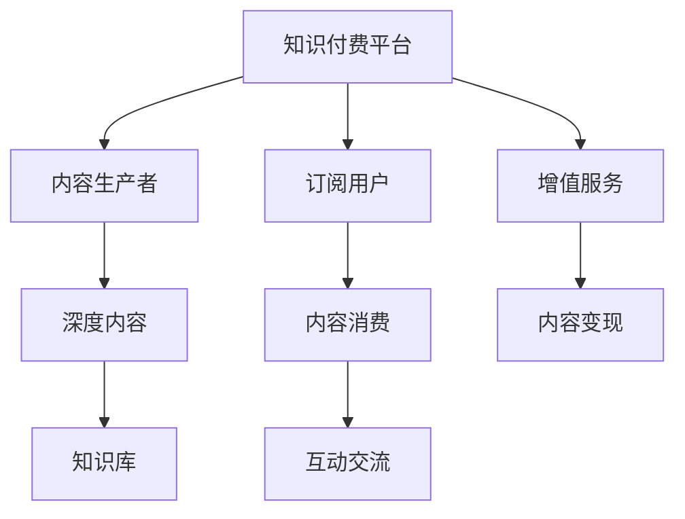

                 

# 如何打造个人知识付费商业帝国

## 1. 背景介绍

### 1.1 问题由来

在信息爆炸的互联网时代，人们对于高质量、有深度的内容需求不断增加，但高成本、低效率的学习方式限制了知识的获取和传播。知识付费作为一种新型商业模式应运而生，通过付费订阅或单次购买的方式，提供专家、学者、行业专家的知识和经验分享，满足用户对于知识深度和广度的需求。

### 1.2 问题核心关键点

知识付费的核心在于通过精选的专家和优质内容，帮助用户高效获取知识，提升职业素养和生活质量。随着知识付费市场的日益成熟，如何打造具有竞争力的个人知识付费商业帝国，成为从业者和创业者普遍关心的问题。

### 1.3 问题研究意义

知识付费商业模式的发展，对于推动知识传播、提升教育水平、促进产业升级具有重要意义：

1. **优化知识获取**：通过付费获取高价值内容，避免盲目学习、知识碎片化，提升学习效率和效果。
2. **激励内容生产**：提供经济回报，激励更多专业人士、学者、创作者提供有深度、有价值的知识内容。
3. **提升用户体验**：优质付费内容的提供，提升用户的学习体验和满意度。
4. **促进产业变革**：知识付费推动了教育、出版、媒体等传统行业的数字化转型，催生了新的增长点。
5. **赋能个人发展**：为个人成长提供助力，帮助职场人士提升技能、拓展视野、实现职业晋升。

## 2. 核心概念与联系

### 2.1 核心概念概述

为了更好地理解如何打造个人知识付费商业帝国，本节将介绍几个关键概念：

- **知识付费**：通过订阅或购买方式，获取专家、学者、行业专家提供的深度知识内容和经验分享，以提升学习效率和质量。
- **内容生产者**：提供知识付费内容的专业人士，包括学者、专家、行业领袖、创业者等。
- **知识平台**：作为内容平台，提供优质付费内容，并提供与用户互动交流的工具和机制。
- **用户订阅**：用户通过付费订阅特定专家或平台的知识内容，获得独家内容、答疑等增值服务。
- **会员体系**：根据订阅深度和频次，提供不同层级的会员服务，满足不同用户的需求。
- **内容变现**：通过广告、会员费、课程费等方式，实现知识内容的商业变现。

### 2.2 核心概念原理和架构的 Mermaid 流程图



此流程图展示了知识付费商业帝国的基本架构：

1. **知识付费平台**：作为信息中介，连接内容生产者和订阅用户，提供内容展示、订阅、交流等功能。
2. **内容生产者**：提供有价值、有深度的知识内容，形成平台的吸引力和竞争力。
3. **订阅用户**：通过付费获取知识内容，支持内容生产，享受优质服务。
4. **增值服务**：如社群交流、答疑服务、专属课程等，提升用户体验，增加粘性。
5. **内容变现**：通过各种商业模式的组合，实现知识内容的商业化运营。

## 3. 核心算法原理 & 具体操作步骤

### 3.1 算法原理概述

打造个人知识付费商业帝国，需要从内容生产、平台运营、用户互动等多个环节进行综合优化。以下是基于算法和数据驱动的方法论框架：

- **内容精准匹配**：通过用户画像分析、兴趣推荐算法，实现内容与用户需求的精准匹配。
- **运营策略优化**：通过数据分析、A/B测试等手段，不断优化平台运营策略，提升用户留存和转化率。
- **会员体系设计**：根据不同用户的支付能力和需求，设计合理会员体系，提高用户粘性和平台盈利能力。
- **内容变现模式**：通过多元化商业变现策略，实现知识内容的最大商业价值。

### 3.2 算法步骤详解

#### 3.2.1 内容精准匹配

1. **用户画像分析**：通过收集用户历史行为数据、付费记录、兴趣标签等，构建用户画像。
2. **内容标签化**：对平台内容进行标签化处理，形成内容库。
3. **推荐算法设计**：结合协同过滤、内容过滤、深度学习等算法，设计内容推荐系统，实现精准内容匹配。
4. **模型训练与优化**：利用历史数据训练推荐模型，不断优化模型性能，提升推荐效果。

#### 3.2.2 运营策略优化

1. **数据分析**：通过数据收集和分析，了解用户行为、平台流量、收入来源等关键指标。
2. **A/B测试**：对平台功能、运营策略进行A/B测试，评估效果并不断优化。
3. **用户反馈收集**：通过问卷调查、用户评价等方式，收集用户反馈，了解用户需求和痛点。
4. **策略迭代**：根据用户反馈和数据分析结果，不断迭代优化运营策略，提升用户体验和平台效率。

#### 3.2.3 会员体系设计

1. **会员分级**：根据订阅深度和频次，设计会员等级，如VIP、SVIP等，提供不同特权和优惠。
2. **定价策略**：结合用户价值、内容成本、市场竞争等，制定合理的会员定价策略。
3. **会员权益设计**：提供专享课程、专属社区、高级互动等权益，增强会员粘性和平台忠诚度。
4. **会员服务提升**：定期更新会员服务内容，提升用户体验和满意度，避免会员流失。

#### 3.2.4 内容变现模式

1. **付费订阅**：提供定期付费订阅服务，提供优质深度内容，满足用户长期学习需求。
2. **单次购买**：提供单次课程、专题讲座等形式的知识付费内容，满足用户特定学习需求。
3. **增值服务**：如社群交流、专属课程、个性化咨询等增值服务，增加平台收益。
4. **广告变现**：通过平台流量，引入品牌广告，实现广告变现。

### 3.3 算法优缺点

#### 3.3.1 算法优点

- **提升用户体验**：通过精准匹配和个性化推荐，提高用户满意度，增强用户粘性。
- **增加平台收益**：多元化商业变现模式，提升平台盈利能力。
- **优化运营效率**：通过数据分析和策略优化，提升平台运营效率。
- **增强内容生产动力**：通过会员体系和激励机制，提升内容生产者的积极性。

#### 3.3.2 算法缺点

- **数据隐私风险**：用户行为数据的收集和分析可能涉及隐私问题。
- **内容质量参差不齐**：平台内容的审核和筛选可能存在难度，影响用户体验。
- **运营成本高**：平台建设和运营需要大量资源投入，初期投资成本较高。
- **市场竞争激烈**：知识付费市场竞争激烈，需要不断创新和优化才能保持竞争力。

### 3.4 算法应用领域

知识付费平台的成功运营，已在多个领域得到应用：

- **教育培训**：提供专业课程、认证考试、职业培训等内容，满足职场人士的学习需求。
- **职业发展**：提供职场技巧、职业技能、人际关系等内容，帮助用户提升职业素养。
- **个人成长**：提供心理学、哲学、艺术等领域的内容，丰富用户生活，提升个人素养。
- **健康管理**：提供健康知识、饮食指导、心理辅导等内容，促进用户健康生活。

## 4. 数学模型和公式 & 详细讲解 & 举例说明

### 4.1 数学模型构建

假设知识付费平台拥有 $N$ 名用户，每名用户每天访问平台 $T$ 次，每次访问时长为 $t$ 分钟。平台共有 $M$ 名内容生产者，每名生产者每天发布 $P$ 篇内容。假设每篇内容的阅读时长为 $p$ 分钟，每篇内容的价值为 $v$ 元。

### 4.2 公式推导过程

根据以上假设，计算平台每天的有效访问时长为：

$$
T_{\text{总}} = N \times T \times t
$$

计算平台每天的内容发布量为：

$$
P_{\text{总}} = M \times P
$$

计算平台每天的总内容价值为：

$$
V_{\text{总}} = P_{\text{总}} \times p \times v
$$

### 4.3 案例分析与讲解

假设某知识付费平台拥有10万用户，用户每天访问3次，每次访问5分钟，每篇内容价值5元，每天发布1000篇内容，每篇内容阅读10分钟。

计算每天有效访问时长为：

$$
T_{\text{总}} = 100000 \times 3 \times 5 = 1500000 \text{分钟}
$$

每天总内容价值为：

$$
V_{\text{总}} = 1000 \times 10 \times 5 = 50000 \text{元}
$$

## 5. 项目实践：代码实例和详细解释说明

### 5.1 开发环境搭建

1. **服务器搭建**：选择高性能服务器，安装Apache或Nginx等Web服务器。
2. **数据库部署**：选择MySQL或PostgreSQL等关系型数据库，存储用户信息、内容信息、交易记录等。
3. **数据存储**：选择AWS S3或阿里云OSS等云存储，存储用户上传的文档、视频等内容。
4. **开发工具**：选择Python作为后端语言，Django或Flask作为Web框架，React或Vue.js作为前端框架。

### 5.2 源代码详细实现

以下是一个简化的知识付费平台后端代码实现，包含用户登录、内容订阅、支付等功能：

#### 5.2.1 用户登录模块

```python
from django.contrib.auth import authenticate, login
from django.shortcuts import render

def login_view(request):
    if request.method == 'POST':
        username = request.POST['username']
        password = request.POST['password']
        user = authenticate(request, username=username, password=password)
        if user is not None:
            login(request, user)
            return redirect('home')
        else:
            error_message = 'Invalid username or password.'
            return render(request, 'login.html', {'error_message': error_message})
    else:
        return render(request, 'login.html')
```

#### 5.2.2 内容订阅模块

```python
from django.contrib.auth.decorators import login_required
from django.shortcuts import render

@login_required
def subscribe_view(request, content_id):
    content = get_content(content_id)
    if request.method == 'POST':
        if request.POST['subscribe'] == 'subscribe':
            purchase(content)
        elif request.POST['subscribe'] == 'unsubscribe':
            unpurchase(content)
        return redirect('home')
    else:
        return render(request, 'subscribe.html', {'content': content})
```

#### 5.2.3 支付模块

```python
from django.shortcuts import render

def purchase(request, content_id):
    content = get_content(content_id)
    amount = calculate_cost(content)
    if request.method == 'POST':
        process_payment(amount)
        purchase_content(content_id)
        return redirect('home')
    else:
        return render(request, 'purchase.html', {'content': content, 'amount': amount})
```

### 5.3 代码解读与分析

- **用户登录模块**：通过Django自带的认证系统，实现用户登录功能。
- **内容订阅模块**：在用户登录后，提供内容订阅功能，包括订阅和取消订阅。
- **支付模块**：通过第三方支付接口，实现支付功能，并记录用户购买记录。

### 5.4 运行结果展示

在完成开发后，通过部署服务器，进行测试，验证功能的正确性和稳定性。

## 6. 实际应用场景

### 6.1 教育培训

在教育培训领域，知识付费平台可以为学习者提供专业认证课程、职业技能培训、K12教育资源等，满足不同学习阶段的需求。平台通过与知名教育机构合作，提供高质量课程，实现知识变现。

### 6.2 职业发展

职业发展领域，知识付费平台提供职场技巧、人际关系、职业规划等内容，帮助职场人士提升职业技能和职业素养，增强市场竞争力。通过与HR合作，推荐平台优质内容，提升企业员工培训效果。

### 6.3 个人成长

在个人成长领域，知识付费平台提供心理学、哲学、艺术、运动健康等内容，丰富用户生活，提升个人素养。通过社群交流和专家答疑，增强用户粘性。

### 6.4 健康管理

在健康管理领域，知识付费平台提供健康知识、饮食指导、心理辅导等内容，帮助用户建立健康生活方式。通过与医疗机构合作，提供医疗咨询服务，提升用户健康管理效果。

## 7. 工具和资源推荐

### 7.1 学习资源推荐

1. **Coursera、Udemy、edX**：提供大量在线课程和认证，涵盖各种学科和职业领域。
2. **Khan Academy**：提供免费、高质量的教育资源，适合各个年龄段的学习者。
3. **Bilibili、YouTube**：丰富的视频内容资源，涵盖教育、职业、生活等多个领域。
4. **Coursera**：提供付费订阅和单次购买模式，满足不同学习者的需求。
5. **Khan Academy**：提供免费视频课程和习题，适合自主学习者。

### 7.2 开发工具推荐

1. **Django**：Python的Web框架，提供丰富的ORM和模板引擎，适合快速开发。
2. **Flask**：轻量级Web框架，适合微服务架构和RESTful API开发。
3. **React**：前端框架，提供组件化开发，适合构建复杂的Web应用。
4. **Vue.js**：前端框架，提供单文件组件和状态管理，适合快速开发和维护。
5. **Node.js**：后端语言，提供丰富的NPM包和社区支持，适合构建微服务架构。

### 7.3 相关论文推荐

1. **《知识付费平台的用户行为分析与推荐系统优化》**：研究知识付费平台的用户行为和推荐算法优化，提升用户体验。
2. **《知识付费平台的运营策略设计与实施》**：分析知识付费平台的运营策略，提出运营优化方案。
3. **《会员体系设计与用户粘性提升策略》**：研究会员体系的合理设计，提升用户粘性和平台收益。
4. **《知识付费平台的内容变现策略研究》**：分析知识付费平台的多元化变现模式，提升平台盈利能力。

## 8. 总结：未来发展趋势与挑战

### 8.1 总结

本文从背景介绍、核心概念、核心算法原理、具体操作步骤等方面，系统阐述了如何打造个人知识付费商业帝国。通过内容精准匹配、运营策略优化、会员体系设计和内容变现模式的多维度策略，构建了一个完整的知识付费商业生态系统。

### 8.2 未来发展趋势

展望未来，知识付费行业将呈现以下几个发展趋势：

1. **个性化推荐系统**：通过深度学习和大数据技术，实现更精准的内容推荐，提升用户体验。
2. **AI驱动的内容生成**：利用自然语言生成技术，自动生成优质内容，降低内容生产成本。
3. **多模态融合**：结合视频、音频、图像等多模态数据，丰富知识付费内容形式，提升用户互动体验。
4. **元宇宙内容**：结合虚拟现实和增强现实技术，提供沉浸式学习体验，拓展知识付费内容形式。
5. **全球化运营**：通过国际化战略，拓展全球市场，提升知识付费平台的全球影响力。

### 8.3 面临的挑战

尽管知识付费市场前景广阔，但仍面临诸多挑战：

1. **内容质量保证**：确保平台内容的质量和准确性，避免误导用户。
2. **用户隐私保护**：保护用户隐私，避免数据泄露和滥用。
3. **市场竞争激烈**：面对激烈的市场竞争，需要不断创新和优化，保持竞争力。
4. **运营成本高**：平台建设和运营需要大量资源投入，需要高效的运营策略和成本控制。
5. **用户留存难题**：如何提高用户粘性，避免用户流失，需要持续优化平台功能和用户体验。

### 8.4 研究展望

面对知识付费市场的挑战，未来的研究应在以下几个方面寻求突破：

1. **内容质量控制**：通过专家审核和社区评估，确保内容质量和准确性，避免误导用户。
2. **隐私保护技术**：采用数据加密、隐私保护算法等技术，确保用户数据的安全和隐私保护。
3. **智能化运营**：利用AI和大数据分析，优化运营策略，提升平台运营效率和用户留存率。
4. **创新内容形式**：结合VR/AR等技术，丰富知识付费内容形式，提升用户体验。
5. **全球化战略**：通过国际化运营，拓展全球市场，提升平台的国际竞争力。

## 9. 附录：常见问题与解答

**Q1：知识付费平台如何确保内容质量？**

A: 通过专家审核、社区评估和用户反馈，确保内容的质量和准确性。平台可以建立专家评审委员会，对内容进行专业评审。同时，鼓励用户对内容进行评价和反馈，帮助平台优化内容质量。

**Q2：如何保护用户隐私？**

A: 采用数据加密、隐私保护算法等技术，确保用户数据的安全和隐私保护。平台应遵守相关法律法规，明确隐私保护策略，定期进行隐私保护技术更新和漏洞修复。

**Q3：如何应对激烈的市场竞争？**

A: 通过不断创新和优化，提供差异化的内容和优质的用户体验，提升平台竞争力。平台可以与知名机构合作，推出高质量内容，同时进行市场细分，满足不同用户需求。

**Q4：如何提高用户粘性？**

A: 提供专属课程、社群交流、专属答疑等增值服务，增强用户粘性。平台可以通过数据分析和用户反馈，不断优化用户体验，提升用户满意度。

**Q5：知识付费平台的盈利模式有哪些？**

A: 付费订阅、单次购买、增值服务、广告变现等。平台可以根据不同用户需求，设计合理的价格策略，实现多元化盈利。

---

作者：禅与计算机程序设计艺术 / Zen and the Art of Computer Programming

