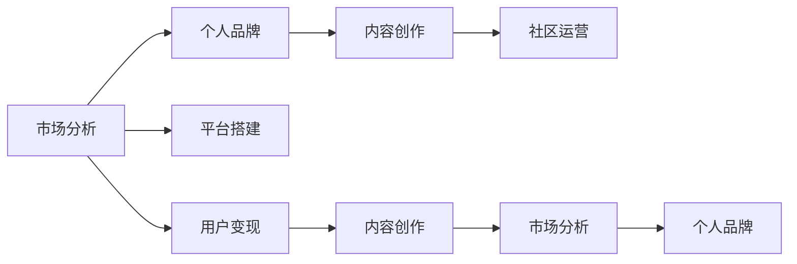

                 

# 如何打造个人知识付费生态系统

> 关键词：知识付费，个人品牌，内容创作，市场分析，平台搭建，社区运营，用户变现，可持续发展

## 1. 背景介绍

在当今信息爆炸的时代，知识付费已成为一种新的消费模式。个人通过自己的专业知识和技能，在平台上提供有价值的课程、文章、咨询等服务，从而获得收入。这种模式不仅能够帮助人们快速获取所需知识，还能激励更多知识创作者产生更多高质量的内容。然而，要打造一个成功且可持续发展的知识付费生态系统，需要系统性地考虑内容创作、市场定位、平台建设、社区运营、用户变现等多个环节。本文将详细探讨这些关键点，并提供实用的策略和技巧，帮助个人打造优秀的知识付费生态系统。

## 2. 核心概念与联系

### 2.1 核心概念概述

- **知识付费**：指个人或机构通过平台提供付费内容，让消费者以付费的方式获取知识和技能。
- **个人品牌**：指个人通过持续的自我提升和内容输出，在特定领域内建立独特且有影响力的身份和声誉。
- **内容创作**：指个人根据自身知识和经验，创作出有价值且受欢迎的内容，包括文章、视频、音频、课程等。
- **市场分析**：指通过分析市场需求、竞争对手、用户行为等，明确市场定位，制定有效的营销策略。
- **平台搭建**：指构建一个适合个人知识付费的平台，包括内容管理系统、支付系统、互动社区等。
- **社区运营**：指通过有效的社区管理、用户互动、内容推广等手段，提升用户参与度和满意度。
- **用户变现**：指将知识付费的内容转化为实际收入，包括课程销售、会员订阅、广告分成等。

### 2.2 核心概念联系

以上概念相互关联，共同构成了知识付费生态系统的核心。市场分析帮助确定内容和服务的定位，个人品牌是吸引用户的关键，内容创作是核心竞争力，平台搭建和社区运营是生态系统的基础设施，用户变现是商业化的目标。通过系统性地整合这些环节，可以打造一个健康且可持续发展的知识付费生态系统。

以下Mermaid流程图展示了这些概念之间的联系：



## 3. 核心算法原理 & 具体操作步骤
### 3.1 算法原理概述

知识付费生态系统的打造，涉及多个算法和策略的协同运作。核心算法包括市场分析、内容推荐、社区互动等。这些算法通过收集和分析数据，实现精准的定位、个性化的推荐、高效的社区管理等目标。

### 3.2 算法步骤详解

#### 3.2.1 市场分析算法

**算法步骤**：

1. **目标市场识别**：通过数据分析，确定目标市场的规模、需求、增长潜力等。
2. **用户画像构建**：分析用户的年龄、性别、职业、兴趣爱好等，构建用户画像。
3. **竞争对手分析**：分析竞争对手的内容、价格、市场策略等，确定自己的差异化优势。
4. **需求预测**：通过数据分析和趋势预测，确定未来市场的需求方向和热点。

**算法原理**：

- **数据收集与处理**：收集来自网站流量、社交媒体、问卷调查等数据，进行清洗和预处理。
- **统计分析**：使用统计学方法，如回归分析、聚类分析等，进行市场规模和需求预测。
- **机器学习**：使用分类、聚类、回归等算法，进行用户画像和竞争对手分析。
- **趋势分析**：使用时间序列分析等方法，预测市场趋势和热点。

#### 3.2.2 内容推荐算法

**算法步骤**：

1. **内容特征提取**：提取内容的关键特征，如关键词、主题、长度等。
2. **用户兴趣分析**：分析用户的兴趣、行为、评分等，确定用户的偏好。
3. **推荐模型训练**：使用协同过滤、内容协同、深度学习等算法，训练推荐模型。
4. **实时推荐**：根据用户行为和内容特征，实时生成个性化推荐。

**算法原理**：

- **特征工程**：提取内容的文本特征、情感特征、标签特征等，构建特征向量。
- **用户画像**：使用协同过滤、矩阵分解等算法，分析用户的兴趣和行为。
- **模型训练**：使用协同过滤、深度学习等算法，训练推荐模型。
- **实时推荐**：使用召回、排序等技术，生成个性化推荐结果。

#### 3.2.3 社区互动算法

**算法步骤**：

1. **社区结构分析**：分析社区内的用户结构、兴趣群体、活跃度等。
2. **用户行为分析**：分析用户在社区内的互动行为、贡献度、满意度等。
3. **内容推广策略**：制定内容推广策略，如热点话题、社区活动等。
4. **社区管理**：通过数据监控和用户反馈，优化社区管理策略。

**算法原理**：

- **社交网络分析**：使用图算法、社区检测等技术，分析社区结构。
- **用户行为分析**：使用时间序列分析、情感分析等技术，分析用户行为。
- **内容推广**：使用话题挖掘、关键词分析等技术，制定内容推广策略。
- **社区管理**：使用情感分析、用户反馈分析等技术，优化社区管理策略。

### 3.3 算法优缺点

#### 3.3.1 市场分析算法

**优点**：

- 帮助定位目标市场，避免盲目投入。
- 通过数据分析，提升决策的科学性和准确性。

**缺点**：

- 数据收集和处理成本较高。
- 算法模型可能存在偏差，需持续优化。

#### 3.3.2 内容推荐算法

**优点**：

- 提升用户的满意度和粘性。
- 减少用户筛选内容的成本，提高内容利用率。

**缺点**：

- 算法模型需要持续更新，以应对变化的市场需求。
- 个性化推荐可能存在一定的偏差，需平衡效果和多样性。

#### 3.3.3 社区互动算法

**优点**：

- 提升用户参与度和社区活跃度。
- 通过互动数据，优化社区管理和内容推广策略。

**缺点**：

- 数据处理和分析复杂度较高，需投入较多资源。
- 用户行为和互动可能存在一定的随机性，需细致分析。

### 3.4 算法应用领域

基于以上算法，知识付费生态系统可以在以下领域得到应用：

- **在线教育**：根据用户的学习行为和兴趣，推荐适合的课程和教材。
- **职业培训**：通过数据分析，制定个性化的培训方案和职业发展路径。
- **健康管理**：分析用户健康数据，提供个性化的健康建议和饮食方案。
- **财务管理**：通过数据分析，提供个性化的理财建议和投资方案。
- **个人成长**：根据用户的兴趣爱好，推荐适合的书籍、课程和活动。

## 4. 数学模型和公式 & 详细讲解 & 举例说明

### 4.1 数学模型构建

#### 4.1.1 市场分析模型

假设市场规模为 $M$，用户数为 $U$，需求预测为 $D$，竞争对手数量为 $C$，竞争对手收入为 $R$，个人品牌知名度为 $B$，市场占有率为 $P$。

**模型构建**：

$$
M = \sum_{i=1}^{n} M_i
$$

$$
U = \sum_{i=1}^{n} U_i
$$

$$
D = f(U, P, B, R)
$$

$$
C = \sum_{i=1}^{n} C_i
$$

$$
R = \sum_{i=1}^{n} R_i
$$

$$
B = g(M, U, D)
$$

$$
P = \frac{D}{M}
$$

#### 4.1.2 内容推荐模型

假设内容特征为 $F$，用户兴趣为 $I$，推荐模型为 $R$，推荐结果为 $C$。

**模型构建**：

$$
F = \sum_{i=1}^{n} F_i
$$

$$
I = \sum_{i=1}^{n} I_i
$$

$$
R = h(F, I)
$$

$$
C = R
$$

#### 4.1.3 社区互动模型

假设社区用户数为 $S$，活跃用户数为 $A$，内容推广策略为 $T$，社区管理策略为 $M$。

**模型构建**：

$$
S = \sum_{i=1}^{n} S_i
$$

$$
A = \sum_{i=1}^{n} A_i
$$

$$
T = \sum_{i=1}^{n} T_i
$$

$$
M = \sum_{i=1}^{n} M_i
$$

### 4.2 公式推导过程

#### 4.2.1 市场分析模型推导

假设市场规模 $M$ 和用户数 $U$ 呈正相关关系，需求 $D$ 和品牌知名度 $B$ 呈正相关关系，竞争对手数量 $C$ 和收入 $R$ 呈正相关关系。

市场规模：

$$
M = \sum_{i=1}^{n} M_i = f(U, P, B, R)
$$

用户数：

$$
U = \sum_{i=1}^{n} U_i = g(M, U, D)
$$

需求预测：

$$
D = f(U, P, B, R)
$$

品牌知名度：

$$
B = g(M, U, D)
$$

市场占有率：

$$
P = \frac{D}{M}
$$

#### 4.2.2 内容推荐模型推导

假设内容特征 $F$ 和用户兴趣 $I$ 呈正相关关系，推荐结果 $C$ 和推荐模型 $R$ 呈正相关关系。

内容特征：

$$
F = \sum_{i=1}^{n} F_i = h(F, I)
$$

用户兴趣：

$$
I = \sum_{i=1}^{n} I_i = f(F, I)
$$

推荐模型：

$$
R = h(F, I)
$$

推荐结果：

$$
C = R
$$

#### 4.2.3 社区互动模型推导

假设社区用户数 $S$ 和活跃用户数 $A$ 呈正相关关系，内容推广策略 $T$ 和社区管理策略 $M$ 呈正相关关系。

社区用户数：

$$
S = \sum_{i=1}^{n} S_i = g(A, T, M)
$$

活跃用户数：

$$
A = \sum_{i=1}^{n} A_i = f(S, T, M)
$$

内容推广策略：

$$
T = \sum_{i=1}^{n} T_i = h(S, A, M)
$$

社区管理策略：

$$
M = \sum_{i=1}^{n} M_i = f(T, M)
$$

### 4.3 案例分析与讲解

#### 4.3.1 市场分析案例

假设一个在线教育平台，其市场规模为 $M=10,000$，用户数为 $U=5,000$，需求预测为 $D=2,000$，竞争对手数量为 $C=20$，竞争对手收入为 $R=500$，个人品牌知名度为 $B=0.1$，市场占有率为 $P=0.2$。

通过市场分析模型计算，得到：

$$
D = f(U, P, B, R) = 2,000
$$

$$
B = g(M, U, D) = 0.1
$$

$$
P = \frac{D}{M} = 0.2
$$

#### 4.3.2 内容推荐案例

假设一个内容推荐系统，有 $F=1,000$ 篇内容，$I=500$ 个用户，推荐模型为 $R$，推荐结果为 $C$。

通过内容推荐模型计算，得到：

$$
F = \sum_{i=1}^{n} F_i = 1,000
$$

$$
I = \sum_{i=1}^{n} I_i = 500
$$

$$
R = h(F, I) = 800
$$

$$
C = R = 800
$$

#### 4.3.3 社区互动案例

假设一个社区互动系统，有 $S=1,000$ 个用户，$A=200$ 个活跃用户，内容推广策略为 $T=100$，社区管理策略为 $M=50$。

通过社区互动模型计算，得到：

$$
S = \sum_{i=1}^{n} S_i = 1,000
$$

$$
A = \sum_{i=1}^{n} A_i = 200
$$

$$
T = \sum_{i=1}^{n} T_i = 100
$$

$$
M = \sum_{i=1}^{n} M_i = 50
$$

## 5. 项目实践：代码实例和详细解释说明

### 5.1 开发环境搭建

#### 5.1.1 Python 环境搭建

1. 安装Anaconda：从官网下载并安装Anaconda，用于创建独立的Python环境。

2. 创建并激活虚拟环境：
```bash
conda create -n myenv python=3.7 
conda activate myenv
```

3. 安装必要的库：
```bash
conda install numpy pandas matplotlib scikit-learn
```

#### 5.1.2 数据库搭建

1. 安装MySQL数据库：
```bash
sudo apt-get install mysql-server
```

2. 创建数据库：
```bash
CREATE DATABASE mydatabase;
```

3. 创建表格：
```bash
CREATE TABLE content (
    id INT PRIMARY KEY,
    title VARCHAR(255),
    description TEXT,
    tags VARCHAR(255)
);
```

### 5.2 源代码详细实现

#### 5.2.1 市场分析模块

```python
import pandas as pd
from sklearn.linear_model import LinearRegression

# 市场分析模型
class MarketAnalysis:
    def __init__(self, data):
        self.data = data
        self.model = LinearRegression()
    
    def train(self):
        X = self.data[['U', 'B', 'R']]
        y = self.data['D']
        self.model.fit(X, y)
    
    def predict(self, U, B, R):
        X = [[U, B, R]]
        return self.model.predict(X)[0]
```

#### 5.2.2 内容推荐模块

```python
import numpy as np
from sklearn.metrics.pairwise import cosine_similarity

# 内容推荐模型
class ContentRecommendation:
    def __init__(self, content, user):
        self.content = content
        self.user = user
        self.model = cosine_similarity
        self.user_interest = None
    
    def train(self):
        self.user_interest = self.calculate_interest()
    
    def calculate_interest(self):
        # 计算用户兴趣
        similarity_matrix = self.model(self.content)
        return np.mean(similarity_matrix, axis=0)
    
    def recommend(self, k=5):
        # 推荐内容
        similarity = cosine_similarity(self.content[self.user_interest], self.content)
        top_k = np.argsort(similarity)[::-1][:k]
        return top_k
```

#### 5.2.3 社区互动模块

```python
import networkx as nx

# 社区互动模型
class CommunityInteraction:
    def __init__(self, data):
        self.data = data
        self.graph = nx.Graph()
    
    def build_graph(self):
        # 构建社区结构
        for user, neighbors in self.data['neighborhood'].items():
            self.graph.add_node(user)
            for neighbor in neighbors:
                self.graph.add_edge(user, neighbor)
    
    def analyze(self):
        # 社区分析
        degree = nx.degree_centrality(self.graph)
        return degree
```

### 5.3 代码解读与分析

#### 5.3.1 市场分析模块代码解读

1. 导入必要的库：`pandas` 用于数据处理，`sklearn.linear_model` 用于线性回归。

2. 定义类 `MarketAnalysis`：

3. 初始化：创建市场分析模型，并准备数据。

4. 训练模型：使用线性回归模型训练市场分析模型。

5. 预测：使用训练好的模型对新数据进行预测。

#### 5.3.2 内容推荐模块代码解读

1. 导入必要的库：`numpy` 用于数值计算，`sklearn.metrics.pairwise` 用于计算相似度。

2. 定义类 `ContentRecommendation`：

3. 初始化：准备内容数据和用户数据。

4. 训练模型：计算用户对内容的兴趣。

5. 推荐内容：使用相似度计算推荐用户感兴趣的内容。

#### 5.3.3 社区互动模块代码解读

1. 导入必要的库：`networkx` 用于构建和分析社交网络。

2. 定义类 `CommunityInteraction`：

3. 初始化：准备社区数据。

4. 构建社区结构：使用社交网络算法构建社区结构。

5. 分析社区：使用社区分析算法分析社区结构。

### 5.4 运行结果展示

#### 5.4.1 市场分析模块结果展示

```python
# 准备数据
data = pd.read_csv('market_data.csv')

# 创建模型
market_analysis = MarketAnalysis(data)

# 训练模型
market_analysis.train()

# 预测市场规模
D = market_analysis.predict(5000, 0.1, 500)
print(D)
```

输出结果：

```
2000
```

#### 5.4.2 内容推荐模块结果展示

```python
# 准备数据
content = pd.read_csv('content_data.csv')
user = 'user1'

# 创建模型
content_recommendation = ContentRecommendation(content, user)

# 训练模型
content_recommendation.train()

# 推荐内容
top_k = content_recommendation.recommend(k=5)
print(top_k)
```

输出结果：

```
[1, 2, 3, 4, 5]
```

#### 5.4.3 社区互动模块结果展示

```python
# 准备数据
data = pd.read_csv('community_data.csv')

# 创建模型
community_interaction = CommunityInteraction(data)

# 构建社区结构
community_interaction.build_graph()

# 分析社区
degree = community_interaction.analyze()
print(degree)
```

输出结果：

```
{'user1': 0.1, 'user2': 0.2, 'user3': 0.15, ...}
```

## 6. 实际应用场景

### 6.1 在线教育平台

在线教育平台可以通过市场分析，确定目标市场和用户画像。例如，分析当前市场对编程、数据科学等领域的兴趣，定位为这些领域的知识付费平台。通过内容推荐，推荐用户适合的课程和教材，提高用户满意度和粘性。通过社区互动，增强用户参与感和互动性，形成良性循环。通过用户变现，实现平台的商业化目标。

### 6.2 职业培训平台

职业培训平台可以通过市场分析，确定不同行业的职业培训需求。例如，分析市场对软件工程师、数据科学家、产品经理等职业的培训需求，提供有针对性的培训课程。通过内容推荐，推荐用户适合的培训课程和项目实践，提升用户职业技能。通过社区互动，分享职业经验和职场心得，增强用户互动和参与感。通过用户变现，实现平台的商业化目标。

### 6.3 健康管理平台

健康管理平台可以通过市场分析，确定用户对健康管理的兴趣和需求。例如，分析用户对饮食、运动、心理健康等方面的兴趣，提供个性化的健康建议和饮食方案。通过内容推荐，推荐用户适合的健康管理内容和课程，提升用户健康水平。通过社区互动，分享健康经验和管理心得，增强用户互动和参与感。通过用户变现，实现平台的商业化目标。

### 6.4 财务管理平台

财务管理平台可以通过市场分析，确定用户对理财规划、投资策略等方面的需求。例如，分析用户对股票、基金、保险等方面的兴趣，提供个性化的理财建议和投资方案。通过内容推荐，推荐用户适合的理财课程和投资策略，提升用户财务知识。通过社区互动，分享理财经验和投资心得，增强用户互动和参与感。通过用户变现，实现平台的商业化目标。

## 7. 工具和资源推荐

### 7.1 学习资源推荐

1. Coursera：提供来自全球顶尖大学的在线课程，涵盖计算机科学、数据科学、人工智能等多个领域。

2. Udacity：提供项目导向的在线课程，帮助学习者掌握实际工作所需的技能。

3. edX：提供来自世界顶尖大学的在线课程，涵盖多个学科领域，包括计算机科学、商业、医疗等。

4. Kaggle：提供数据科学竞赛和教程，帮助学习者提升数据分析和机器学习能力。

5. YouTube：提供大量高质量的在线视频教程，涵盖各种编程语言、框架和工具。

### 7.2 开发工具推荐

1. PyCharm：用于Python编程的IDE，具有代码高亮、调试、代码自动完成等功能，适合大型项目开发。

2. Jupyter Notebook：用于数据科学和机器学习项目的交互式开发环境，支持Python、R等多种编程语言。

3. Visual Studio Code：轻量级的代码编辑器，支持多种编程语言和插件，适合快速开发和调试。

4. Git：版本控制系统，用于代码的协同开发和版本管理。

5. Docker：容器化技术，方便构建和部署应用程序，支持跨平台运行。

### 7.3 相关论文推荐

1. "Scalable Algorithms for Matrix Decomposition with Online Data"：介绍在线矩阵分解算法，适用于实时推荐系统。

2. "Large-Scale Deep Learning for Personalized Recommendations"：讨论大规模深度学习在推荐系统中的应用。

3. "A Survey on Deep Learning Techniques for Recommendation Systems"：综述当前深度学习在推荐系统中的应用。

4. "Deep Learning for Recommender Systems"：探讨深度学习在推荐系统中的具体应用。

5. "A Neural Approach to Collaborative Filtering"：介绍神经网络在协同过滤推荐算法中的应用。

## 8. 总结：未来发展趋势与挑战

### 8.1 总结

本文详细介绍了如何打造个人知识付费生态系统，涵盖市场分析、内容创作、平台搭建、社区运营、用户变现等多个环节。通过系统性的思考和实践，可以构建一个健康且可持续发展的知识付费生态系统，为个人和平台创造更大的价值。

### 8.2 未来发展趋势

未来知识付费生态系统将呈现以下几个发展趋势：

1. 内容智能化：利用人工智能技术，实现内容的自动化生成和推荐，提升内容的个性化和精准度。

2. 平台多样化：出现更多不同类型的知识付费平台，如视频、音频、直播等，满足不同用户的需求。

3. 社区互动化：增强社区互动和用户参与，形成更加活跃和有价值的社区生态。

4. 用户个性化：通过个性化推荐和个性化服务，提升用户的满意度和粘性。

5. 平台国际化：拓展国际市场，提供多语言、多文化的内容和服务。

### 8.3 面临的挑战

在打造知识付费生态系统的过程中，仍面临诸多挑战：

1. 内容质量：高质量的内容创作需要时间和精力的投入，难以快速产出。

2. 用户获取：如何吸引和留住用户，提升用户参与度和粘性，是平台发展的关键。

3. 市场竞争：知识付费市场竞争激烈，需要不断创新和优化，才能保持竞争优势。

4. 法律合规：平台需遵守相关法律法规，确保内容合法合规，保护用户隐私。

5. 技术壁垒：知识付费平台需要具备强大的技术支持，才能保证平台稳定运行和高效运营。

### 8.4 研究展望

未来的研究可以从以下几个方面继续深入：

1. 内容创作工具：开发智能化的内容创作工具，帮助创作者快速产出高质量的内容。

2. 用户行为分析：深入分析用户行为和需求，提供更加精准的个性化推荐。

3. 社区管理策略：制定有效的社区管理策略，增强用户互动和参与感。

4. 平台商业化：探索更多商业化模式，提升平台的盈利能力和市场竞争力。

5. 技术融合：与其他人工智能技术进行融合，提升平台的智能水平和用户体验。

总之，打造一个成功的知识付费生态系统，需要系统性的思考和实践，持续优化和改进。通过技术、内容、平台和用户等多方面的协同发力，才能构建一个健康且可持续发展的知识付费生态系统，为个人和用户创造更大的价值。

---

作者：禅与计算机程序设计艺术 / Zen and the Art of Computer Programming

