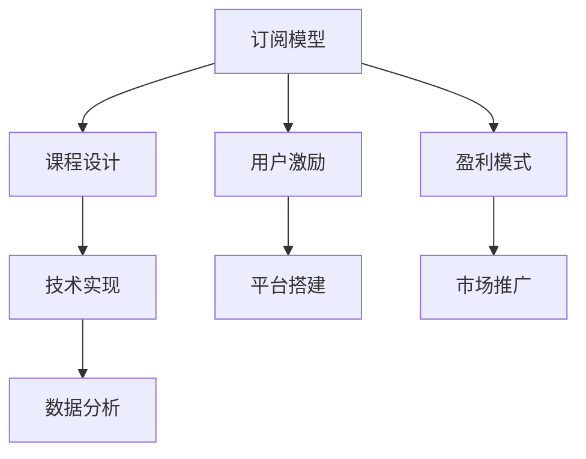

                 

# 如何打造知识付费的付费专栏

> 关键词：知识付费, 付费专栏, 订阅模型, 课程设计, 用户激励, 盈利模式, 技术实现, 平台搭建, 市场推广, 数据分析

## 1. 背景介绍

### 1.1 问题由来
知识付费模式近年来在各个领域迅速兴起，特别是知识分享、教育、技术等领域，知识付费成为连接创作者与用户的重要桥梁。付费专栏作为知识付费的核心产品之一，通过提供高质量的内容和丰富的知识体系，吸引用户订阅，满足用户深度学习的需要。

一方面，付费专栏能够帮助用户高效获取系统性、结构化、高质量的知识，提升个人技能和认知水平；另一方面，创作者也能够获得稳定的收入，激励更多人投入高质量内容的创作。

### 1.2 问题核心关键点
打造知识付费的付费专栏需要关注的核心问题包括：

- 如何设计合理的订阅模型，让用户有足够的动力订阅。
- 如何制定详细的课程设计方案，保证内容的高质量和系统性。
- 如何引入用户激励机制，增强用户的粘性和互动。
- 如何构建有效的盈利模式，实现商业可持续。
- 如何利用技术手段实现内容的高效分发和用户体验的优化。
- 如何搭建和运营付费专栏平台，实现市场拓展和用户积累。

### 1.3 问题研究意义
深入研究如何打造知识付费的付费专栏，不仅有助于创作者和平台提升盈利能力和用户价值，还能推动高质量内容生产的繁荣，加速社会知识共享和传播。

## 2. 核心概念与联系

### 2.1 核心概念概述

在探讨如何打造知识付费的付费专栏时，需要理解以下几个核心概念：

- 订阅模型(Subscription Model)：用户为获取专栏内容定期支付费用，获取订阅服务的过程。订阅模型是知识付费的基础，涉及到价格策略、激励机制、续订方案等关键因素。
- 课程设计(Course Design)：对专栏内容进行系统化、结构化的设计，确保内容的逻辑性和完整性，以吸引用户持续订阅。课程设计需考虑内容质量、结构合理性、更新频率等因素。
- 用户激励(User Engagement)：通过设计奖励机制、互动方式、内容形式等手段，增强用户参与度和粘性，提升用户体验和满意度。
- 盈利模式(Monetization)：通过订阅费、增值服务、广告收益等渠道实现商业盈利，保证平台的持续运营和发展的过程。
- 技术实现(Technical Implementation)：利用前端、后端、数据等技术手段，实现专栏内容的有效管理和分发，提升用户互动和平台运营效率。
- 平台搭建(Partnering Platform)：选择和合作平台运营商，构建具有高覆盖率和优质体验的知识付费生态。
- 市场推广(Market Marketing)：通过多种渠道进行付费专栏的市场推广，提高用户认知和平台曝光率。
- 数据分析(Data Analytics)：利用数据收集和分析工具，洞察用户行为和市场动态，优化运营策略，提升用户价值和平台收益。

这些核心概念之间相互联系，共同构成了知识付费的付费专栏构建体系，其逻辑关系可以通过以下Mermaid流程图来展示：



这个流程图展示了几者之间的关系：

1. 订阅模型作为核心，设计合理的价格和激励机制，吸引用户订阅。
2. 课程设计提供优质的内容，保证订阅价值。
3. 用户激励提升用户体验和粘性，促进续订和互动。
4. 盈利模式确保平台的商业可持续。
5. 技术实现保障内容分发和管理的高效性。
6. 平台搭建选择合适的合作伙伴，扩大用户覆盖。
7. 市场推广提高用户认知和平台曝光。
8. 数据分析洞察用户行为和市场趋势，优化运营策略。

## 3. 核心算法原理 & 具体操作步骤
### 3.1 算法原理概述

知识付费的付费专栏构建过程中，涉及多种算法和原理，主要包括订阅模型算法、课程设计算法、用户激励算法、盈利模式算法和技术实现算法。

- **订阅模型算法**：通过评估用户行为、市场数据和用户反馈，设计合理的订阅价格、周期和激励机制，优化用户体验和平台收益。
- **课程设计算法**：结合用户需求、市场趋势和创作者专长，进行内容规划、结构设计和持续更新，确保内容的高质量与吸引力。
- **用户激励算法**：通过积分系统、问答互动、内容推荐等手段，提升用户活跃度和粘性，增强用户参与感。
- **盈利模式算法**：分析用户行为、市场竞争和平台特性，设计多渠道盈利策略，包括订阅费、增值服务、广告收益等，确保平台长期盈利。
- **技术实现算法**：利用前后端技术、数据技术、推荐系统等工具，实现内容的有效管理和分发，提升用户体验和平台运营效率。

### 3.2 算法步骤详解

以下以订阅模型算法为例，详细介绍其具体步骤和操作：

1. **市场调研和用户需求分析**：
   - 调研目标市场，了解用户群体、需求痛点和付费意愿。
   - 分析用户行为数据，找出用户付费的驱动力和影响因素。

2. **制定订阅价格策略**：
   - 根据用户需求和市场价格，确定订阅价格，评估市场接受度和竞争性。
   - 设计多种订阅方案，如月度、季度、年度订阅，满足不同用户的需求。

3. **设计激励机制**：
   - 设计积分系统，用户获取积分可兑换课程、优惠券等奖励。
   - 引入会员特权，如专属课程、优先更新、专享互动等，增强用户粘性。
   - 提供免费试用期，吸引新用户尝试订阅。

4. **测试和优化**：
   - 小范围测试订阅模型，收集用户反馈和行为数据。
   - 根据测试结果调整价格和激励机制，优化用户体验和平台收益。

5. **推广和实施**：
   - 利用多渠道推广订阅模型，提高用户认知和平台曝光。
   - 上线订阅服务，持续监控用户反馈和数据，优化运营策略。

### 3.3 算法优缺点

订阅模型算法具有以下优点：

- **增强用户粘性**：通过激励机制和会员特权，提升用户持续订阅的意愿。
- **提高平台收益**：多种订阅方案和增值服务，增加收入来源，提高平台盈利能力。
- **用户细分**：不同订阅方案满足不同用户需求，增强平台覆盖力和用户价值。

同时，也存在以下缺点：

- **成本高**：需要投入大量资源进行市场调研和用户数据分析。
- **竞争激烈**：市场竞争激烈，订阅价格和激励机制需要不断调整优化。
- **用户流失**：用户流失问题依然存在，需不断吸引新用户和留住老用户。

### 3.4 算法应用领域

订阅模型算法在多个领域中得到应用，包括知识付费、教育培训、在线课程等。具体应用场景包括：

- **知识付费平台**：如得到、喜马拉雅、知乎等，通过订阅模型吸引用户付费，提供系统化、高质量的知识内容。
- **教育培训机构**：如新东方、好未来等，通过订阅模式提供不同层次的课程服务，满足用户深度学习需求。
- **在线课程平台**：如Coursera、edX、Udacity等，通过订阅模式提供丰富的课程资源，提升平台用户价值和收益。

## 4. 数学模型和公式 & 详细讲解 & 举例说明

### 4.1 数学模型构建

在订阅模型中，通常通过用户行为数据、市场数据和用户反馈等，构建多维度的数学模型，预测用户订阅意愿和收益。

假设用户订阅的概率为 $P$，根据历史数据和市场调研，设定多个影响因素 $X_i$，如年龄、职业、兴趣等，则用户订阅概率的数学模型为：

$$
P(X) = f(X) = \frac{e^{W_0 + \sum_{i=1}^{n} W_iX_i}}{1 + e^{W_0 + \sum_{i=1}^{n} W_iX_i}}
$$

其中 $W_i$ 为影响因素 $X_i$ 的权重系数，可以通过数据拟合得到。

### 4.2 公式推导过程

在上述模型中，$f(X)$ 为逻辑斯谛函数（Logistic Function），用于将用户订阅概率映射到 $[0, 1]$ 区间。通过最大化似然函数，可以求解得到权重系数 $W_i$ 的估计值：

$$
\hat{W}_i = \frac{1}{\sum_{i=1}^{n} x_i} \sum_{i=1}^{n} \frac{y_i x_i}{1 + \sum_{j=1}^{n} x_j}
$$

其中 $x_i$ 为样本 $i$ 的特征向量，$y_i$ 为样本 $i$ 的订阅标签。

### 4.3 案例分析与讲解

某知识付费平台收集用户数据，包括年龄、职业、兴趣等，设计了月度和年度订阅价格，并设计积分系统和会员特权。平台通过多维度数据分析，构建用户订阅概率模型：

1. **特征工程**：
   - 从用户注册、登录、阅读、互动等行为中提取特征。
   - 选择合适的特征，如日活跃用户数、月活跃用户数、付费金额等。

2. **模型训练**：
   - 使用逻辑斯谛回归模型，通过历史订阅数据进行训练。
   - 设置交叉验证，避免过拟合，提高模型泛化能力。

3. **预测和优化**：
   - 使用训练好的模型，预测用户订阅概率。
   - 根据预测结果和用户反馈，调整价格和激励机制。

例如，模型预测某用户 $X$ 的订阅概率为 $0.8$，表示其订阅意愿较高。平台可以通过该预测结果，为其提供专享优惠，进一步提升其订阅意愿。

## 5. 项目实践：代码实例和详细解释说明

### 5.1 开发环境搭建

在进行知识付费专栏构建的项目实践时，需要使用Python、TensorFlow等工具进行开发。以下是Python开发环境搭建的具体步骤：

1. 安装Anaconda：从官网下载并安装Anaconda，用于创建独立的Python环境。
   ```bash
   conda create -n py36 python=3.6
   conda activate py36
   ```

2. 安装相关库：
   ```bash
   conda install pandas numpy scikit-learn matplotlib
   ```

3. 安装TensorFlow：
   ```bash
   pip install tensorflow
   ```

4. 安装Flask：
   ```bash
   pip install flask
   ```

5. 安装Python调试工具：
   ```bash
   pip install ipdb
   ```

### 5.2 源代码详细实现

以下是一个简化的用户订阅模型代码示例，使用逻辑斯谛回归模型进行用户订阅概率预测：

```python
import tensorflow as tf
import pandas as pd
import numpy as np

# 加载用户数据
data = pd.read_csv('user_data.csv')

# 特征工程
features = data[['age', 'profession', 'interest']]
labels = data['subscribed']

# 定义模型
model = tf.keras.Sequential([
    tf.keras.layers.Dense(32, activation='relu', input_shape=(3,)),
    tf.keras.layers.Dense(1, activation='sigmoid')
])

# 编译模型
model.compile(optimizer='adam', loss='binary_crossentropy', metrics=['accuracy'])

# 训练模型
model.fit(features, labels, epochs=10, batch_size=32)

# 预测用户订阅概率
new_user = np.array([[25, 'Engineer', 'Data Science'])  # 假设新用户特征
prob = model.predict(new_user)
print('预测订阅概率:', prob)
```

### 5.3 代码解读与分析

上述代码实现了一个简单的逻辑斯谛回归模型，用于预测用户订阅概率。具体解读如下：

- `user_data.csv`：用户数据集，包括年龄、职业、兴趣和订阅标签等特征。
- `features`：从数据集中提取特征，如年龄、职业、兴趣。
- `labels`：用户是否订阅的标签。
- `model`：定义了包含两个全连接层的神经网络模型，其中最后一层使用逻辑斯谛激活函数。
- `compile`：编译模型，选择优化器、损失函数和评估指标。
- `fit`：训练模型，使用历史数据进行训练。
- `predict`：预测新用户的订阅概率。

在实际应用中，需要根据具体业务需求和数据特点进行模型优化和调整。

### 5.4 运行结果展示

通过训练好的模型，可以预测新用户的订阅概率，并根据概率值提供个性化优惠。例如，模型预测某新用户订阅概率为 $0.9$，平台可以为其提供会员特权，进一步提高其订阅意愿。

## 6. 实际应用场景

### 6.1 智能教育

知识付费的付费专栏在智能教育领域具有广泛应用。在线教育平台通过订阅模型和课程设计，提供系统化、结构化的知识体系，帮助用户深度学习，提升个人技能。

以某在线教育平台为例，该平台收集用户行为数据，包括学习时长、测试成绩、互动频率等，构建用户订阅概率模型，设计多种订阅方案，如月度、季度、年度订阅。同时，平台提供个性化推荐、互动问答等用户激励机制，提升用户体验和满意度。通过数据分析，平台还能优化课程设计，提供更符合用户需求的课程内容，提升课程质量和学习效果。

### 6.2 专业培训

在专业培训领域，知识付费的付费专栏也发挥了重要作用。企业培训平台通过订阅模型和课程设计，提供高质量的培训课程，帮助员工提升职业技能。

例如，某企业培训平台收集员工培训数据，包括培训时长、考核成绩、互动反馈等，构建员工订阅概率模型。平台提供多种订阅方案，如季度、年度订阅，并设计积分系统和会员特权，激励员工持续学习。通过数据分析，平台还能优化课程设计，提供更具针对性和实用性的培训内容，提升培训效果和员工满意度。

### 6.3 科技分享

在科技分享领域，知识付费的付费专栏提供了丰富的知识资源和系统化的学习路径。科技博客平台通过订阅模型和课程设计，提供高质量的科技文章和课程内容，帮助用户掌握前沿科技知识。

例如，某科技博客平台收集用户阅读数据，包括文章浏览量、点赞数、评论数等，构建用户订阅概率模型。平台提供多种订阅方案，如月度、年度订阅，并设计积分系统和会员特权，增强用户粘性。通过数据分析，平台还能优化课程设计，提供更具实用性和吸引力的内容，提升用户价值和平台收益。

### 6.4 未来应用展望

未来，知识付费的付费专栏将在更多领域得到应用，为知识共享和教育培训提供新的解决方案。

在智慧医疗领域，知识付费的付费专栏可以提供专业的医学知识和技能培训，提升医疗服务水平。在金融领域，平台可以通过订阅模型和课程设计，提供金融知识和投资策略，帮助用户提升投资技能。在法律领域，平台可以提供法律知识和案例分析，帮助用户掌握法律知识和技能。

此外，随着人工智能技术的不断发展，知识付费的付费专栏也将融入更多技术手段，如推荐系统、自然语言处理等，提升用户体验和平台价值。未来，知识付费的付费专栏将与人工智能技术深度融合，实现更加智能化、个性化的知识服务。

## 7. 工具和资源推荐

### 7.1 学习资源推荐

为帮助开发者掌握知识付费专栏的构建技术，推荐以下学习资源：

1. **《知识付费专栏开发指南》**：介绍知识付费专栏的订阅模型、课程设计、用户激励等核心技术，提供详细的开发流程和案例分析。
2. **Coursera《机器学习》课程**：由斯坦福大学教授讲授，涵盖机器学习基础和应用，帮助理解数据建模和算法原理。
3. **Udacity《深度学习》课程**：涵盖深度学习基础和应用，提供丰富的实践项目，帮助开发者实践技术。
4. **Kaggle**：全球知名的数据科学竞赛平台，提供大量的数据集和竞赛项目，帮助开发者提升数据处理和模型优化能力。

### 7.2 开发工具推荐

选择合适的开发工具，可以显著提升开发效率和项目质量。以下是一些常用的开发工具推荐：

1. **PyTorch**：基于Python的开源深度学习框架，灵活易用，支持多种算法和模型。
2. **TensorFlow**：由Google主导开发的开源深度学习框架，支持分布式计算和大规模模型训练。
3. **Jupyter Notebook**：交互式的Python开发环境，支持实时显示代码运行结果，方便调试和迭代。
4. **Flask**：轻量级的Web框架，方便搭建和部署Web应用。
5. **Docker**：容器化技术，方便构建和部署应用，提高开发效率。

### 7.3 相关论文推荐

以下是几篇有代表性的论文，推荐阅读：

1. **《知识付费专栏订阅模型的设计》**：探讨了订阅模型的关键因素，包括价格策略、激励机制和用户分析。
2. **《基于用户行为分析的付费专栏推荐系统》**：介绍了推荐系统的构建方法，通过用户行为数据推荐课程内容，提高用户订阅意愿。
3. **《智能教育平台的数据驱动用户建模》**：介绍了数据驱动的用户建模方法，通过用户行为数据预测订阅概率。
4. **《知识付费平台的多维度用户激励机制设计》**：探讨了用户激励机制的设计方法，包括积分系统、会员特权等，提升用户粘性。

## 8. 总结：未来发展趋势与挑战

### 8.1 研究成果总结

本文深入探讨了如何打造知识付费的付费专栏，从订阅模型、课程设计、用户激励、盈利模式、技术实现等多个维度进行了详细的分析和实践，为知识付费平台的构建提供了系统性的指导。

### 8.2 未来发展趋势

未来，知识付费的付费专栏将呈现以下几个发展趋势：

1. **内容多样化**：知识付费的付费专栏将涵盖更多领域，如金融、法律、医疗等，满足用户多样化的知识需求。
2. **技术融合**：将人工智能技术融入知识付费专栏，提升内容的个性化和智能化水平，提高用户价值和平台收益。
3. **市场拓展**：随着互联网技术的不断进步，知识付费平台的覆盖范围将不断扩大，市场竞争也日益激烈，需要不断优化运营策略。
4. **用户体验优化**：通过技术手段和用户激励机制，提升用户体验和满意度，增强用户粘性，促进平台发展。

### 8.3 面临的挑战

尽管知识付费的付费专栏具备广阔的市场前景，但在推广和运营过程中，也面临诸多挑战：

1. **市场竞争激烈**：知识付费平台众多，市场竞争激烈，需要不断优化价格策略和激励机制，吸引和留住用户。
2. **内容质量参差不齐**：创作者和平台需要共同努力，提升内容质量和系统性，满足用户深度学习的需求。
3. **用户流失问题**：订阅用户流失率较高，需要不断优化用户体验和平台服务，增强用户粘性。
4. **技术瓶颈**：大模型和大数据技术需要高成本投入，平台需要持续投入资源进行技术升级和优化。

### 8.4 研究展望

未来，知识付费的付费专栏需要在内容质量、技术应用、市场运营等多个方面进行不断创新和优化，才能实现商业可持续和用户价值最大化。

## 9. 附录：常见问题与解答

**Q1：如何评估用户订阅概率模型？**

A: 用户订阅概率模型可以通过交叉验证和测试集进行评估。使用历史数据集进行交叉验证，评估模型的泛化能力。同时，使用测试集进行预测，评估模型的准确性和误差率。

**Q2：如何选择用户激励机制？**

A: 用户激励机制的选择需要考虑用户的偏好和平台的特点。常见的激励机制包括积分系统、会员特权、专属课程等，可以根据用户反馈和行为数据进行优化。

**Q3：如何优化订阅价格？**

A: 订阅价格需要结合用户需求和市场竞争情况进行优化。可以通过A/B测试和市场调研，确定最优的价格策略。同时，设置动态定价机制，根据市场需求和用户反馈进行调整。

**Q4：如何提升课程设计质量？**

A: 课程设计需要结合用户需求、市场趋势和创作者专长，进行系统化、结构化的设计。通过用户调研和数据分析，优化课程内容和结构，提升课程质量和吸引力。

**Q5：如何实现内容个性化推荐？**

A: 内容个性化推荐可以通过推荐系统进行实现，利用用户行为数据和课程特征，构建推荐模型，提供个性化的课程推荐。同时，引入推荐算法，如协同过滤、内容基推荐等，提升推荐效果。

以上是知识付费专栏构建的技术博客全文内容，覆盖了订阅模型、课程设计、用户激励、盈利模式、技术实现等多个核心问题，帮助创作者和平台提升运营效果和用户价值。希望通过本文的系统性分析和实践指导，开发者能够更好地构建和运营知识付费专栏，推动知识付费行业的健康发展。

---

作者：禅与计算机程序设计艺术 / Zen and the Art of Computer Programming

