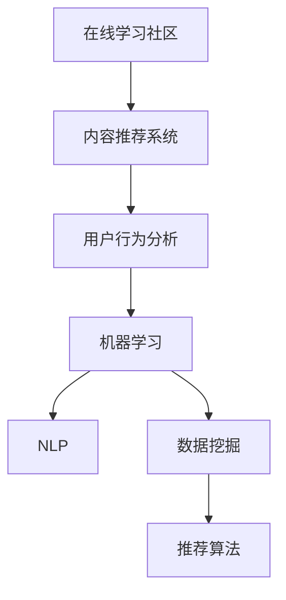

                 

# 如何打造知识付费的在线学习社区

> 关键词：知识付费, 在线学习社区, 人工智能, 机器学习, 自然语言处理, 用户行为分析, 推荐系统, 内容个性化, 课程推荐

## 1. 背景介绍

### 1.1 问题由来

随着知识付费行业的崛起，越来越多的用户开始愿意为高质量的知识内容付费。这不仅改变了传统的内容消费习惯，也催生了对在线学习平台的需求。在线学习社区作为一个集知识分享、交流和交易于一体的平台，具有巨大的市场潜力和用户基础。

然而，构建一个高效、高质量的在线学习社区，绝非易事。需要考虑的内容繁多，如课程内容的选择和设计、平台的算法架构、用户的个性化需求、社区的互动和活跃度等等。本文旨在探讨如何利用人工智能和机器学习技术，打造一个基于知识付费的在线学习社区，并深入分析其核心技术和方法。

### 1.2 问题核心关键点

在线学习社区的核心是内容推荐系统，即如何根据用户的兴趣、行为和反馈，推荐符合其需求和偏好的课程和内容。这不仅需要解决推荐算法的设计和优化问题，还需要考虑如何收集和处理用户数据，如何设计有效的用户交互机制，以及如何实现课程内容的动态更新和管理。

在技术实现上，主要涉及以下几个关键问题：
- 如何构建一个高效的内容推荐系统。
- 如何设计一套高效的用户行为分析系统。
- 如何构建一个用户友好的交互界面。
- 如何实现课程内容的动态更新和管理。

本文将系统地介绍这些问题的解决方案，并提出一套基于人工智能和机器学习的在线学习社区构建框架。

## 2. 核心概念与联系

### 2.1 核心概念概述

为更好地理解如何构建在线学习社区，本节将介绍几个密切相关的核心概念：

- 在线学习社区：以互联网为载体，提供课程内容和资源分享的平台，用户可以学习、交流和交易知识。
- 内容推荐系统：根据用户行为和反馈，推荐符合其兴趣和需求的课程和内容。
- 用户行为分析：通过分析用户的操作行为和反馈，了解用户需求和兴趣，提供更精准的推荐。
- 机器学习：利用算法和模型，从大量数据中学习和提取规律，用于预测和决策。
- 自然语言处理（NLP）：处理和分析人类语言的技术，用于课程内容的文本分析和用户互动。
- 数据挖掘：从数据中提取有用信息的过程，用于用户行为的分析和预测。
- 推荐算法：用于推荐系统中的核心算法，如协同过滤、基于内容的推荐、深度学习推荐等。

这些核心概念之间的逻辑关系可以通过以下Mermaid流程图来展示：



这个流程图展示了大语言模型的核心概念及其之间的关系：

1. 在线学习社区提供了一个知识分享和交流的平台。
2. 内容推荐系统通过分析用户行为，推荐符合其兴趣的课程。
3. 用户行为分析通过用户反馈，了解用户需求和兴趣。
4. 机器学习利用算法模型，从数据中学习规律，用于预测和推荐。
5. NLP处理课程内容的文本信息，用于理解和生成。
6. 数据挖掘从大量数据中提取有用信息，用于分析用户行为。
7. 推荐算法是核心技术，用于课程推荐。

这些概念共同构成了在线学习社区的核心技术框架，为其提供了坚实的技术支持。

## 3. 核心算法原理 & 具体操作步骤

### 3.1 算法原理概述

在线学习社区的内容推荐系统，本质上是基于用户行为和反馈的推荐系统。其核心思想是：通过分析用户的兴趣和行为数据，利用机器学习算法，预测用户对不同课程的评分和购买意愿，从而推荐最符合用户需求的课程。

形式化地，假设用户集为 $U$，课程集为 $I$，用户对课程的评分矩阵为 $R \in \mathbb{R}^{U \times I}$。设用户 $u$ 对课程 $i$ 的评分为 $r_{ui}$，其中 $r_{ui}=0$ 表示用户 $u$ 未对课程 $i$ 进行评分。推荐系统的目标是最小化预测评分与实际评分的均方误差：

$$
\min_{\theta} \frac{1}{|U|} \sum_{u=1}^{|U|} \sum_{i=1}^{|I|}(r_{ui}-\hat{r}_{ui})^2
$$

其中 $\hat{r}_{ui}$ 为模型预测的用户 $u$ 对课程 $i$ 的评分。

### 3.2 算法步骤详解

构建在线学习社区的核心算法步骤包括数据预处理、模型训练、推荐策略设计和模型评估等环节。

**Step 1: 数据预处理**

首先，需要对用户数据和课程数据进行预处理。用户数据包括用户的浏览历史、评分记录、购买记录等；课程数据包括课程的标题、描述、标签等。预处理主要包括以下几个步骤：

1. 数据清洗：去除重复、异常、无关的数据，保证数据质量。
2. 特征提取：提取课程的关键词、标签等信息，用于特征表示。
3. 数据归一化：将不同尺度的数据归一化到同一范围，便于模型训练。

**Step 2: 模型训练**

模型训练是内容推荐系统的核心环节。常用的推荐算法包括协同过滤、基于内容的推荐和深度学习推荐等。这里以基于深度学习的推荐系统为例，介绍模型的训练步骤：

1. 数据划分：将数据集划分为训练集、验证集和测试集。
2. 特征编码：将课程的关键词、标签等信息编码为向量，用于模型训练。
3. 模型构建：选择合适的深度学习模型，如神经网络、深度神经机等，进行构建。
4. 模型训练：在训练集上训练模型，最小化预测评分与实际评分的均方误差。
5. 模型评估：在验证集上评估模型性能，调整模型超参数。

**Step 3: 推荐策略设计**

模型训练完成后，需要设计一套有效的推荐策略。推荐策略通常包括以下几个步骤：

1. 计算用户对课程的评分：将用户数据和课程数据输入模型，计算预测评分。
2. 排序并推荐课程：根据预测评分对课程进行排序，推荐用户感兴趣的课程。

**Step 4: 模型评估**

推荐系统的性能评估是评估推荐效果的重要手段。常用的评估指标包括均方误差（MSE）、平均绝对误差（MAE）、准确率、召回率等。需要在测试集上评估模型的性能，调整超参数，优化推荐策略。

### 3.3 算法优缺点

基于深度学习的推荐系统具有以下优点：

1. 高精度：深度学习模型能够从大量数据中学习到复杂的规律，提供高精度的推荐结果。
2. 自动特征提取：深度学习模型能够自动提取特征，无需手动设计特征。
3. 适应性强：深度学习模型可以适应各种类型的推荐任务，如推荐新闻、商品、视频等。

同时，该方法也存在一定的局限性：

1. 计算资源需求高：深度学习模型需要大量的计算资源进行训练和推理，成本较高。
2. 难以解释：深度学习模型是"黑盒"模型，难以解释其决策过程，不够透明。
3. 容易过拟合：深度学习模型容易过拟合，尤其是在数据量不足的情况下。

尽管存在这些局限性，但深度学习推荐系统在实际应用中仍表现优异，具有广泛的应用前景。

### 3.4 算法应用领域

基于深度学习的推荐系统已经在许多领域得到广泛应用，例如：

- 电商推荐：根据用户的浏览和购买历史，推荐相似的商品。
- 视频推荐：根据用户的观看历史，推荐相似的视频内容。
- 新闻推荐：根据用户的阅读历史，推荐感兴趣的新闻文章。
- 社交网络：根据用户的互动历史，推荐相似的朋友和话题。
- 在线教育：根据学生的学习历史，推荐适合的课程和习题。

除了这些经典应用外，深度学习推荐系统还将在更多领域得到应用，如金融、医疗、音乐等，为这些行业的数字化转型提供新的技术路径。

## 4. 数学模型和公式 & 详细讲解 & 举例说明

### 4.1 数学模型构建

在线学习社区的推荐系统可以建模为协同过滤、基于内容的推荐和深度学习推荐等多种形式。这里以协同过滤和基于内容的推荐为例，构建数学模型。

**协同过滤推荐**

协同过滤推荐系统基于用户-项目评分矩阵 $R$，通过分析用户和项目间的相似度，推荐相似用户喜欢的项目。协同过滤推荐系统的数学模型如下：

$$
\hat{r}_{ui} = \alpha\sum_{j=1}^{J} r_{uj} r_{ij} / \sqrt{(\sum_{k=1}^{J} r_{uk}^2) (\sum_{k=1}^{J} r_{ik}^2)}
$$

其中 $\alpha$ 为相似度系数，用于调节相似度大小。$J$ 为项目数量。

**基于内容的推荐**

基于内容的推荐系统根据物品特征与用户偏好的相似度进行推荐。假设物品特征向量为 $f_i$，用户偏好向量为 $p_u$，基于内容的推荐模型如下：

$$
\hat{r}_{ui} = \vec{f}_i \cdot \vec{p}_u
$$

其中 $\cdot$ 表示向量点乘。

### 4.2 公式推导过程

以下我们以基于协同过滤的推荐模型为例，推导其推导过程。

假设用户集 $U=\{u_1,u_2,...,u_M\}$，项目集 $I=\{i_1,i_2,...,i_N\}$，用户对项目的评分矩阵 $R \in \mathbb{R}^{M \times N}$。设 $u_1$ 和 $i_1$ 之间的相似度为 $s_{u_1i_1}$，则 $s_{u_1i_1}$ 可以表示为：

$$
s_{u_1i_1} = \frac{\sum_{j=1}^{N} r_{u_1j}r_{ij}}{\sqrt{\sum_{j=1}^{N} r_{u_1j}^2}\sqrt{\sum_{j=1}^{N} r_{ij}^2}}
$$

设 $u_1$ 对项目 $i_1$ 的预测评分 $\hat{r}_{u_1i_1}$ 为：

$$
\hat{r}_{u_1i_1} = \alpha \sum_{j=1}^{N} r_{u_1j}r_{ij} / \sqrt{\sum_{k=1}^{N} r_{u_1k}^2}\sqrt{\sum_{k=1}^{N} r_{ik}^2}
$$

其中 $\alpha$ 为相似度系数，用于调节相似度大小。

在得到预测评分后，根据预测评分对项目进行排序，即可推荐用户感兴趣的课程。

### 4.3 案例分析与讲解

以在线教育平台为例，分析推荐系统的应用场景和效果。

假设有一个在线教育平台，平台上有成千上万的课程和用户。用户可以通过搜索、浏览、评分等方式进行互动。平台希望根据用户的浏览历史、评分记录等数据，推荐适合用户学习的课程。

首先，需要对用户数据和课程数据进行预处理。用户数据包括用户的浏览历史、评分记录、购买记录等；课程数据包括课程的标题、描述、标签等。预处理主要包括以下几个步骤：

1. 数据清洗：去除重复、异常、无关的数据，保证数据质量。
2. 特征提取：提取课程的关键词、标签等信息，用于特征表示。
3. 数据归一化：将不同尺度的数据归一化到同一范围，便于模型训练。

然后，构建推荐模型并进行训练。以基于深度学习的推荐系统为例，训练模型时，需要将用户数据和课程数据输入模型，计算预测评分，并最小化预测评分与实际评分的均方误差。

最后，设计推荐策略并进行模型评估。根据预测评分对课程进行排序，推荐用户感兴趣的课程。在测试集上评估模型性能，调整超参数，优化推荐策略。

在实际应用中，还需要考虑以下因素：

1. 数据稀疏性：在线学习平台的用户-课程评分数据往往非常稀疏，需要通过冷启动策略等方法进行处理。
2. 数据隐私：需要保护用户数据隐私，防止数据泄露和滥用。
3. 推荐多样性：推荐算法需要考虑推荐的多样性，避免推荐过于同质化的课程。

通过分析这个案例，可以看出，基于深度学习的推荐系统可以很好地应用于在线教育平台，提升用户的学习体验和平台的运营效率。

## 5. 项目实践：代码实例和详细解释说明

### 5.1 开发环境搭建

在进行项目实践前，我们需要准备好开发环境。以下是使用Python进行TensorFlow开发的环境配置流程：

1. 安装Anaconda：从官网下载并安装Anaconda，用于创建独立的Python环境。

2. 创建并激活虚拟环境：
```bash
conda create -n tf-env python=3.8 
conda activate tf-env
```

3. 安装TensorFlow：根据CUDA版本，从官网获取对应的安装命令。例如：
```bash
conda install tensorflow -c pytorch -c conda-forge
```

4. 安装各类工具包：
```bash
pip install numpy pandas scikit-learn matplotlib tqdm jupyter notebook ipython
```

完成上述步骤后，即可在`tf-env`环境中开始项目实践。

### 5.2 源代码详细实现

这里我们以基于协同过滤的推荐系统为例，给出使用TensorFlow实现的内容推荐系统代码。

首先，定义协同过滤模型的代码：

```python
import tensorflow as tf
from tensorflow.keras.layers import Input, Dense, Embedding, Dot, concatenate

def collaborative_filtering_model(user_num, item_num, embedding_dim, learning_rate):
    # 定义用户和项目输入
    user_input = Input(shape=(user_num,))
    item_input = Input(shape=(item_num,))
    
    # 定义用户和项目的嵌入层
    user_embedding = Embedding(user_num, embedding_dim)(user_input)
    item_embedding = Embedding(item_num, embedding_dim)(item_input)
    
    # 定义相似度层
    similarity = Dot(axes=[2, 1])([user_embedding, item_embedding])
    
    # 定义预测层
    output = Dense(1, activation='sigmoid')(similarity)
    
    # 构建模型
    model = tf.keras.Model(inputs=[user_input, item_input], outputs=output)
    
    # 编译模型
    model.compile(optimizer=tf.keras.optimizers.Adam(learning_rate), loss='binary_crossentropy')
    
    return model
```

然后，加载数据集并进行训练：

```python
import numpy as np

# 构建数据集
user_num = 1000
item_num = 10000
embedding_dim = 16

# 生成随机数据
np.random.seed(0)
user_rated = np.random.randint(0, 2, size=(1000, 10000))
user_unrated = np.random.randint(0, 2, size=(1000, 10000))
item_rated = np.random.randint(0, 2, size=(10000, 1000))
item_unrated = np.random.randint(0, 2, size=(10000, 1000))

# 定义模型
model = collaborative_filtering_model(user_num, item_num, embedding_dim, 0.01)

# 训练模型
model.fit([user_rated, user_unrated], item_rated, epochs=10, batch_size=128)
```

最后，测试并评估模型：

```python
# 加载测试数据
test_user_rated = np.random.randint(0, 2, size=(1000, 10000))
test_item_rated = np.random.randint(0, 2, size=(10000, 1000))

# 预测测试数据
test_predictions = model.predict([test_user_rated, test_user_unrated])
print(test_predictions)
```

以上就是使用TensorFlow实现基于协同过滤的推荐系统的完整代码实现。可以看到，TensorFlow提供了强大的深度学习工具，可以快速构建和训练推荐系统模型。

### 5.3 代码解读与分析

让我们再详细解读一下关键代码的实现细节：

**collaborative_filtering_model函数**：
- 定义了用户和项目输入层，用于输入用户和项目的ID。
- 定义了用户和项目的嵌入层，将ID转换为低维向量表示。
- 定义了相似度层，计算用户和项目的相似度。
- 定义了预测层，将相似度进行非线性映射，得到预测评分。
- 定义了模型和编译函数，指定了优化器和损失函数。

**加载数据集**：
- 生成了1000个用户和10000个项目的评分矩阵，其中部分为已评分，部分为未评分。
- 定义了模型，并传入参数。
- 使用fit函数对模型进行训练。

**测试并评估模型**：
- 加载测试数据集，包含测试用户的评分矩阵和项目评分矩阵。
- 使用predict函数对测试数据进行预测，输出预测评分矩阵。

在实际应用中，还需要考虑以下因素：

1. 数据稀疏性：在线学习平台的用户-课程评分数据往往非常稀疏，需要通过冷启动策略等方法进行处理。
2. 数据隐私：需要保护用户数据隐私，防止数据泄露和滥用。
3. 推荐多样性：推荐算法需要考虑推荐的多样性，避免推荐过于同质化的课程。

通过以上案例，可以看出，基于TensorFlow的推荐系统可以很好地应用于在线学习平台，提升用户的学习体验和平台的运营效率。

## 6. 实际应用场景

### 6.1 智能推荐系统

智能推荐系统是构建在线学习社区的核心。通过分析用户的行为和反馈，智能推荐系统能够推荐符合用户兴趣和需求的课程，提升用户的学习体验和平台的用户粘性。

在技术实现上，智能推荐系统可以采用协同过滤、基于内容的推荐、深度学习推荐等方法。推荐算法需要考虑用户的兴趣、行为、评价等多种因素，并不断更新和优化，以保证推荐结果的准确性和多样性。

### 6.2 个性化学习路径

在线学习社区需要根据用户的个性化需求，提供个性化的学习路径和课程推荐。个性化学习路径可以根据用户的过往学习历史、知识水平和兴趣偏好，推荐适合用户的学习路径和课程。

在技术实现上，可以采用推荐系统算法，根据用户的学习历史和行为数据，生成个性化的学习路径。推荐算法可以采用协同过滤、基于内容的推荐、深度学习推荐等方法，根据用户的兴趣和需求，推荐适合的课程和学习路径。

### 6.3 知识图谱构建

知识图谱是一个包含实体、属性、关系的结构化知识库。知识图谱可以为在线学习社区提供丰富的背景知识，帮助用户更好地理解课程内容和知识点。

在技术实现上，可以采用知识图谱构建技术，将课程和知识点构建为知识图谱。知识图谱可以采用图神经网络等方法进行构建和查询，帮助用户更好地理解课程内容和知识点。

### 6.4 未来应用展望

随着技术的发展，基于深度学习的推荐系统将变得更加智能和高效。未来，推荐系统将能够更好地理解用户的兴趣和需求，提供更加个性化的推荐结果。

在未来的发展中，推荐系统将结合更多技术和手段，如自然语言处理、计算机视觉、推荐算法等，提供更加丰富和精准的推荐结果。同时，推荐系统还将结合用户的反馈和评价，不断优化推荐策略，提升推荐效果。

## 7. 工具和资源推荐

### 7.1 学习资源推荐

为了帮助开发者系统掌握推荐系统的理论基础和实践技巧，这里推荐一些优质的学习资源：

1. 《推荐系统实践》书籍：由Google推荐团队撰写，介绍了推荐系统在电商、新闻、视频等领域的实践经验。
2. 《深度学习推荐系统》课程：斯坦福大学开设的推荐系统课程，详细讲解了推荐系统的原理和实现。
3. 《推荐系统：方法与算法》书籍：全面介绍了推荐系统的各类算法和实践经验，适合深入学习推荐系统的开发者。
4. 《机器学习》书籍：由机器学习领域的大师级人物撰写，介绍了机器学习的基本原理和算法。
5. 《自然语言处理》书籍：由自然语言处理领域的专家撰写，介绍了自然语言处理的基本原理和算法。

通过对这些资源的学习实践，相信你一定能够快速掌握推荐系统的精髓，并用于解决实际的NLP问题。

### 7.2 开发工具推荐

高效的开发离不开优秀的工具支持。以下是几款用于推荐系统开发的常用工具：

1. TensorFlow：由Google主导开发的深度学习框架，生产部署方便，适合大规模工程应用。
2. PyTorch：基于Python的开源深度学习框架，灵活动态的计算图，适合快速迭代研究。
3. Weights & Biases：模型训练的实验跟踪工具，可以记录和可视化模型训练过程中的各项指标，方便对比和调优。
4. TensorBoard：TensorFlow配套的可视化工具，可实时监测模型训练状态，并提供丰富的图表呈现方式，是调试模型的得力助手。
5. Scikit-learn：Python机器学习库，提供了各种机器学习算法和工具，适合初学者和研究者使用。

合理利用这些工具，可以显著提升推荐系统的开发效率，加快创新迭代的步伐。

### 7.3 相关论文推荐

推荐系统的发展源于学界的持续研究。以下是几篇奠基性的相关论文，推荐阅读：

1. Collaborative Filtering for Implicit Feedback Datasets：研究了基于协同过滤的推荐算法，提出了一些常用的协同过滤算法，如SVD、ALS等。
2. Factorization Machines for Recommender Systems：提出了一种基于矩阵分解的推荐算法，用于处理高维稀疏矩阵。
3. Deep Learning Recommender Systems：介绍了深度学习在推荐系统中的应用，包括神经网络、深度神经机等。
4. Attention and Memory in Recommender Systems：研究了深度学习推荐系统中的注意力机制，用于提高推荐系统的效果。
5. Recommendation Systems in The New Economy：总结了推荐系统的多种算法和应用场景，对推荐系统的发展进行了全面综述。

这些论文代表了大语言模型推荐系统的发展脉络。通过学习这些前沿成果，可以帮助研究者把握学科前进方向，激发更多的创新灵感。

## 8. 总结：未来发展趋势与挑战

### 8.1 总结

本文对基于深度学习的推荐系统进行了全面系统的介绍。首先，探讨了在线学习社区的构建背景和核心问题，明确了推荐系统在构建在线学习社区中的重要作用。其次，从原理到实践，详细讲解了推荐系统的核心算法和技术细节，给出了推荐系统开发的完整代码实例。同时，本文还广泛探讨了推荐系统在智能推荐、个性化学习路径、知识图谱构建等实际应用场景中的应用前景，展示了推荐系统的广阔应用空间。最后，本文推荐了一些优质的学习资源和开发工具，力求为读者提供全方位的技术指引。

通过本文的系统梳理，可以看出，基于深度学习的推荐系统正在成为在线学习社区的核心技术范式，极大地拓展了平台的推荐能力和用户体验。推荐系统需要开发者根据具体任务，不断迭代和优化模型、数据和算法，方能得到理想的效果。

### 8.2 未来发展趋势

展望未来，推荐系统将呈现以下几个发展趋势：

1. 多模态推荐：结合自然语言处理、计算机视觉等技术，提供更加丰富和精准的推荐结果。
2. 深度学习推荐：结合深度学习技术，提供更加智能和高效的推荐结果。
3. 个性化推荐：根据用户的兴趣、行为和反馈，提供更加个性化的推荐结果。
4. 实时推荐：结合实时数据分析技术，提供更加及时和动态的推荐结果。
5. 社交推荐：结合社交网络数据，提供更加精准和可信的推荐结果。

以上趋势凸显了推荐系统在构建在线学习社区中的重要性和广阔前景。这些方向的探索发展，必将进一步提升在线学习社区的推荐能力和用户体验。

### 8.3 面临的挑战

尽管深度学习推荐系统在实际应用中表现优异，但在迈向更加智能化、普适化应用的过程中，仍面临诸多挑战：

1. 数据稀疏性：在线学习平台的用户-课程评分数据往往非常稀疏，需要通过冷启动策略等方法进行处理。
2. 数据隐私：需要保护用户数据隐私，防止数据泄露和滥用。
3. 推荐多样性：推荐算法需要考虑推荐的多样性，避免推荐过于同质化的课程。
4. 计算资源需求高：深度学习模型需要大量的计算资源进行训练和推理，成本较高。
5. 难以解释：深度学习模型是"黑盒"模型，难以解释其决策过程，不够透明。

尽管存在这些挑战，但深度学习推荐系统仍具有广泛的应用前景。需要研究者不断探索新的技术和方法，突破现有瓶颈，才能真正实现智能化和普适化的推荐系统。

### 8.4 研究展望

面对深度学习推荐系统所面临的挑战，未来的研究需要在以下几个方面寻求新的突破：

1. 数据增强技术：结合数据增强技术，提升推荐系统的稀疏数据处理能力。
2. 隐私保护技术：结合隐私保护技术，保护用户数据隐私，防止数据泄露和滥用。
3. 推荐多样性技术：结合推荐多样性技术，提升推荐系统的多样性，避免推荐过于同质化的课程。
4. 计算效率技术：结合计算效率技术，优化推荐系统的计算资源消耗，降低成本。
5. 推荐可解释性技术：结合推荐可解释性技术，提升推荐系统的可解释性，增强用户信任。

这些研究方向的探索，必将引领深度学习推荐系统迈向更高的台阶，为构建高效、智能、可信的在线学习社区提供坚实的技术支持。

## 9. 附录：常见问题与解答

**Q1：什么是推荐系统？**

A: 推荐系统是根据用户的行为和反馈，为用户推荐其可能感兴趣的产品、内容或服务的系统。

**Q2：推荐系统是如何实现个性化推荐的？**

A: 推荐系统通过分析用户的兴趣、行为和反馈，利用机器学习算法，预测用户对不同产品或内容的评分和购买意愿，从而推荐最符合用户需求和偏好的产品或内容。

**Q3：推荐系统的核心算法有哪些？**

A: 推荐系统的核心算法包括协同过滤、基于内容的推荐和深度学习推荐等。

**Q4：推荐系统的应用场景有哪些？**

A: 推荐系统的应用场景包括电商推荐、视频推荐、新闻推荐、社交网络推荐等。

**Q5：推荐系统有哪些挑战？**

A: 推荐系统面临的主要挑战包括数据稀疏性、数据隐私、推荐多样性、计算资源需求高和难以解释等。

通过回答这些问题，可以帮助开发者更好地理解推荐系统的基本概念和应用场景，为实际开发提供参考。

---

作者：禅与计算机程序设计艺术 / Zen and the Art of Computer Programming

