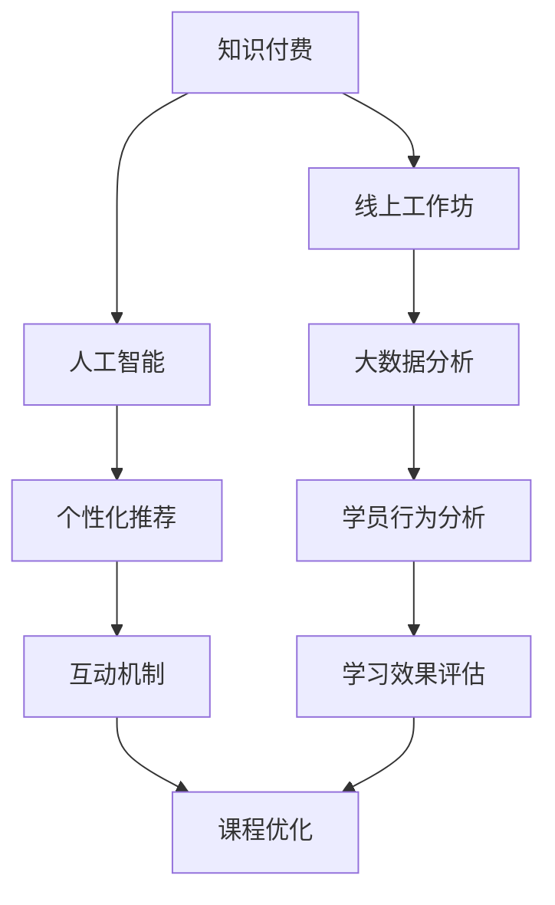

                 

# 如何打造知识付费的线上工作坊

> 关键词：知识付费, 线上工作坊, 技术博客, 人工智能, 数据驱动

## 1. 背景介绍

随着互联网和信息技术的飞速发展，知识付费成为一种新的趋势。越来越多的人愿意为获取有价值、高品质的知识内容付费。线上工作坊以其互动性强、内容丰富、覆盖面广等特点，成为知识付费领域的一个热门形式。通过线上工作坊，用户可以与讲师实时互动，参与学习，获取专业知识，实现个人能力的提升。

线上工作坊的成功打造，不仅需要高质量的内容和优秀的讲师，更需要先进的技术支持。本文将从技术角度出发，详细讲解如何利用人工智能和大数据分析技术，打造高效、实用的知识付费线上工作坊。

## 2. 核心概念与联系

### 2.1 核心概念概述

为更好地理解线上工作坊的构建，本节将介绍几个关键概念：

- 知识付费（Knowledge Paywall）：指用户需要付费才能获取到有价值的内容和知识。线上工作坊作为一种知识付费形式，为用户提供深度互动的学习体验，从而提升其价值。

- 线上工作坊（Online Workshop）：指通过网络平台，组织讲师和学员进行实时互动，共同参与学习讨论的一种在线培训形式。常见的形式包括视频直播、互动讨论、作业提交等。

- 人工智能（AI）：指模拟人类智能过程的计算系统，包括机器学习、深度学习、自然语言处理等技术。AI技术在知识付费领域，可以帮助推荐个性化内容，自动化处理学员作业，提高讲师和学员的互动效率。

- 大数据分析（Big Data Analytics）：指利用先进的技术手段，对大量数据进行收集、存储、处理和分析，以提取有用信息和知识的过程。在大数据分析的支持下，线上工作坊可以更精准地推送个性化内容，提升用户满意度和留存率。

- 实时互动（Real-time Interaction）：指讲师和学员之间可以实时进行文字、语音、视频等形式的互动，提高学习效率和效果。

这些核心概念之间的逻辑关系可以通过以下Mermaid流程图来展示：



这个流程图展示了几者之间的关系：

1. 知识付费是线上工作坊的业务背景。
2. 人工智能和大数据分析为线上工作坊提供了技术支撑。
3. 个性化推荐和实时互动是线上工作坊的核心功能。
4. 学员行为分析和课程优化是线上工作坊质量提升的关键环节。

## 3. 核心算法原理 & 具体操作步骤
### 3.1 算法原理概述

打造知识付费的线上工作坊，核心在于通过人工智能和大数据分析技术，提升用户的学习体验和课程质量。其核心思想是：利用人工智能对学员数据进行分析，个性化推荐学习内容和互动方式，利用大数据分析对学员行为进行跟踪和评估，不断优化课程设计和互动机制。

具体而言，核心算法原理包括以下几个方面：

- 个性化推荐算法：基于学员的学习历史、兴趣偏好等数据，利用协同过滤、深度学习等技术，推荐个性化的课程和学习内容。
- 实时互动算法：通过NLP技术实现文本、语音、视频等多种形式的实时互动，提高学习效率和体验。
- 学员行为分析算法：利用机器学习、时间序列分析等技术，对学员的学习行为进行建模和预测，评估学习效果，指导课程优化。
- 课程优化算法：基于学员行为分析结果，对课程设计、讲师讲授、互动机制等进行优化，提升课程质量和学员满意度。

### 3.2 算法步骤详解

线上工作坊的构建一般包括以下几个关键步骤：

**Step 1: 用户画像建模**
- 收集用户的基本信息、学习历史、兴趣偏好等数据，构建用户画像。
- 利用深度学习模型，如LightGBM、XGBoost等，对用户画像进行建模和预测，生成用户标签。

**Step 2: 个性化内容推荐**
- 根据用户画像和用户标签，利用协同过滤、基于矩阵分解的推荐算法，推荐个性化的课程和学习内容。
- 使用深度学习模型，如BERT、Transformer等，对课程内容和学员评论进行语义分析，生成相似度矩阵。

**Step 3: 实时互动设计**
- 通过WebRTC、WSS等技术，实现讲师和学员之间的实时互动。
- 利用NLP技术，如自然语言处理、语音识别等，实现文字、语音、视频等多种形式的互动。

**Step 4: 学员行为分析**
- 利用机器学习模型，对学员的点击、浏览、答题等行为进行建模和预测，生成行为数据。
- 利用时间序列分析、关联规则挖掘等技术，对行为数据进行分析和可视化，生成行为报告。

**Step 5: 课程优化迭代**
- 根据学员行为报告，识别出学员的常见问题、知识盲点和兴趣点。
- 根据学员反馈，对课程设计、讲师讲授、互动机制等进行优化。

**Step 6: 实验与迭代**
- 在实际应用中，不断收集学员反馈数据，进行A/B测试和机器学习模型调参。
- 根据测试结果和优化建议，持续迭代和优化线上工作坊的各个环节，提升用户体验和课程质量。

### 3.3 算法优缺点

线上工作坊的构建采用人工智能和大数据分析技术，具有以下优点：

1. 个性化推荐：通过算法精准推荐课程内容，提高学员学习效率和满意度。
2. 实时互动：通过实时互动技术，提高学习参与度和互动效果。
3. 行为分析：通过行为分析技术，生成行为报告，指导课程优化和改进。
4. 迭代优化：通过不断实验和迭代，提升线上工作坊的总体质量和用户满意度。

同时，该方法也存在一定的局限性：

1. 数据依赖：个性化推荐和行为分析依赖于大量学员数据的收集和分析，数据隐私和安全问题需重点关注。
2. 算法复杂：算法模型调参复杂，需要投入大量时间和精力。
3. 模型公平：避免算法中的潜在偏见和歧视，需设计公平性和鲁棒性较强的模型。
4. 动态变化：用户兴趣和需求会随着时间变化，课程和互动机制需要动态调整。

尽管存在这些局限性，但就目前而言，人工智能和大数据分析技术仍是在线工作坊构建的主要方法。未来相关研究的重点在于如何进一步提高推荐和互动的精度和效率，保护用户隐私，优化课程设计等。

### 3.4 算法应用领域

线上工作坊的构建方法，已经在多个领域得到广泛应用，如教育、医疗、金融、企业培训等。

在教育领域，线上工作坊可以帮助学校和培训机构进行个性化教学，提升教学效果和学生满意度。在医疗领域，可以通过线上工作坊进行远程培训和医疗咨询，提高医生和护士的专业技能。在金融领域，可以通过线上工作坊进行投资理财培训，帮助用户掌握投资知识，提升理财能力。在企业培训领域，线上工作坊可以提供员工技能培训，帮助企业培养高素质人才。

除了上述这些领域外，线上工作坊还被创新性地应用到更多场景中，如编程入门、编程进阶、数据科学、人工智能等，为知识付费和技能提升提供了新的解决方案。随着技术的不断进步，相信在线工作坊在更多领域的应用场景将不断拓展，为各类用户提供更丰富、更实用的学习内容和服务。

## 4. 数学模型和公式 & 详细讲解 & 举例说明

### 4.1 数学模型构建

本节将使用数学语言对线上工作坊的构建进行更加严格的刻画。

记学员的用户画像为 $P$，课程内容为 $C$，行为数据为 $B$。假设线上工作坊的推荐目标是最小化学员未完成课程的概率 $P_{miss}$，即：

$$
\mathop{\min}_{\theta} \mathbb{E}_{P, C} P_{miss}(\theta)
$$

其中 $\theta$ 表示模型参数，包括个性化推荐算法、实时互动算法、学员行为分析算法和课程优化算法等。

在实际应用中，我们通常使用基于梯度的优化算法（如SGD、Adam等）来近似求解上述最优化问题。设 $\eta$ 为学习率，$\lambda$ 为正则化系数，则模型参数的更新公式为：

$$
\theta \leftarrow \theta - \eta \nabla_{\theta}\mathcal{L}(\theta) - \eta\lambda\theta
$$

其中 $\nabla_{\theta}\mathcal{L}(\theta)$ 为损失函数对参数 $\theta$ 的梯度，可通过反向传播算法高效计算。

### 4.2 公式推导过程

以下我们以个性化推荐算法为例，推导协同过滤算法中的用户-物品评分矩阵 $\mathbf{R}$ 的推导公式。

设 $U$ 为用户集合，$I$ 为物品集合，$R_{ui}$ 表示用户 $u$ 对物品 $i$ 的评分，则用户-物品评分矩阵为 $\mathbf{R} \in \mathbb{R}^{U \times I}$。协同过滤算法的目标是预测用户对未评分物品的评分，常见方法包括基于矩阵分解的算法和基于模型的算法。

基于矩阵分解的协同过滤算法，假设评分矩阵 $\mathbf{R}$ 可以分解为用户特征矩阵 $\mathbf{U} \in \mathbb{R}^{U \times F}$ 和物品特征矩阵 $\mathbf{V} \in \mathbb{R}^{I \times F}$ 的乘积：

$$
\mathbf{R} \approx \mathbf{U} \mathbf{V}^T
$$

其中 $F$ 表示特征维度。通过矩阵分解，我们可以对用户和物品进行特征表示，利用 $\mathbf{U}$ 和 $\mathbf{V}$ 对 $\mathbf{R}$ 进行预测，生成预测评分矩阵 $\mathbf{\hat{R}}$。

具体的推导过程如下：

- 将 $\mathbf{R}$ 对用户 $u$ 进行分解，得到 $\mathbf{r_u} = [r_{u1}, r_{u2}, ..., r_{ui}]^T$。
- 将 $\mathbf{R}$ 对物品 $i$ 进行分解，得到 $\mathbf{r_i} = [r_{i1}, r_{i2}, ..., r_{in}]^T$。
- 对 $\mathbf{r_u}$ 和 $\mathbf{r_i}$ 进行特征提取，得到 $\mathbf{u} = [u_1, u_2, ..., u_F]^T$ 和 $\mathbf{v} = [v_1, v_2, ..., v_F]^T$。
- 利用矩阵乘法计算预测评分 $\hat{r}_{ui} = \mathbf{u}^T \mathbf{v}$。

通过上述推导，我们得到了基于矩阵分解的协同过滤算法的基本框架。在实际应用中，可以通过不同的模型优化方法，如SGD、FTRL等，对算法进行优化和调整。

## 5. 项目实践：代码实例和详细解释说明
### 5.1 开发环境搭建

在进行线上工作坊构建前，我们需要准备好开发环境。以下是使用Python进行Flask开发的环境配置流程：

1. 安装Anaconda：从官网下载并安装Anaconda，用于创建独立的Python环境。

2. 创建并激活虚拟环境：
```bash
conda create -n workshop-env python=3.8 
conda activate workshop-env
```

3. 安装Flask：
```bash
pip install flask
```

4. 安装相关库：
```bash
pip install pandas numpy scipy scikit-learn matplotlib tqdm jupyter notebook ipython
```

完成上述步骤后，即可在`workshop-env`环境中开始构建工作坊。

### 5.2 源代码详细实现

下面我们以构建一个简单的在线课程推荐系统为例，给出使用Flask框架的代码实现。

首先，定义课程推荐模型：

```python
from sklearn.neighbors import NearestNeighbors

class CourseRecommendation:
    def __init__(self, course_data):
        self.course_data = course_data
        self.model = NearestNeighbors(n_neighbors=5, algorithm='brute')
        self.model.fit(course_data)
    
    def recommend(self, user, n=5):
        distances, indices = self.model.kneighbors([user], n=n, return_distance=True)
        recommendations = self.course_data[indices[0]]
        return recommendations
```

然后，定义用户画像和行为数据处理函数：

```python
from transformers import BertTokenizer, BertForSequenceClassification
import pandas as pd

class UserProfile:
    def __init__(self, user_id, courses):
        self.user_id = user_id
        self.courses = courses
    
    def save(self, filename):
        df = pd.DataFrame(self.courses, columns=['course_id'])
        df.to_csv(filename, index=False)
        
class BehaviorData:
    def __init__(self, user_id, courses):
        self.user_id = user_id
        self.courses = courses
    
    def save(self, filename):
        df = pd.DataFrame(self.courses, columns=['course_id', 'time'])
        df.to_csv(filename, index=False)
```

接着，定义工作坊API：

```python
from flask import Flask, jsonify, request
from transformers import BertTokenizer, BertForSequenceClassification
import pandas as pd
import numpy as np

app = Flask(__name__)

@app.route('/recommend', methods=['POST'])
def recommend_course():
    user_id = request.json['user_id']
    courses = pd.read_csv(f'data/{user_id}_courses.csv')
    user_profile = UserProfile(user_id, courses)
    user_profile.save('data/user_profiles.csv')
    
    recommendations = CourseRecommendation(user_profile.courses).recommend(user_id)
    return jsonify(recommendations)

if __name__ == '__main__':
    app.run(debug=True)
```

最后，启动Flask服务：

```bash
python workshop.py
```

运行后，可以通过访问 `http://localhost:5000/recommend` 来获取个性化课程推荐。

### 5.3 代码解读与分析

让我们再详细解读一下关键代码的实现细节：

**CourseRecommendation类**：
- `__init__`方法：初始化课程数据，建立KNN模型。
- `recommend`方法：根据用户画像，使用KNN算法推荐课程。

**UserProfile和BehaviorData类**：
- `__init__`方法：初始化用户信息和行为数据。
- `save`方法：将用户信息和行为数据保存到CSV文件中。

**Flask服务**：
- `__init__`方法：创建Flask应用。
- `/recommend`路由：处理API请求，调用推荐算法生成推荐结果。

这个代码示例展示了如何使用Flask框架构建一个简单的在线课程推荐系统。开发者可以基于此代码，进一步扩展功能，如用户登录、行为分析、实时互动等。

## 6. 实际应用场景

线上工作坊的构建方法，已经在多个领域得到广泛应用，如教育、医疗、金融、企业培训等。

在教育领域，线上工作坊可以帮助学校和培训机构进行个性化教学，提升教学效果和学生满意度。在医疗领域，可以通过线上工作坊进行远程培训和医疗咨询，提高医生和护士的专业技能。在金融领域，可以通过线上工作坊进行投资理财培训，帮助用户掌握投资知识，提升理财能力。在企业培训领域，线上工作坊可以提供员工技能培训，帮助企业培养高素质人才。

除了上述这些领域外，线上工作坊还被创新性地应用到更多场景中，如编程入门、编程进阶、数据科学、人工智能等，为知识付费和技能提升提供了新的解决方案。随着技术的不断进步，相信在线工作坊在更多领域的应用场景将不断拓展，为各类用户提供更丰富、更实用的学习内容和服务。

## 7. 工具和资源推荐

### 7.1 学习资源推荐

为了帮助开发者系统掌握线上工作坊的技术基础和实践技巧，这里推荐一些优质的学习资源：

1. 《深度学习与机器学习实战》系列博文：由深度学习领域专家撰写，深入浅出地介绍了深度学习、机器学习、NLP等前沿技术。

2. TensorFlow官方文档：Google开发的深度学习框架，提供详尽的API文档和示例代码，是学习深度学习的必备资料。

3. PyTorch官方文档：Facebook开发的深度学习框架，具有灵活的计算图和高效的推理能力，是深度学习领域的主流框架。

4. HuggingFace官方文档：自然语言处理工具库，集成了大量预训练语言模型，支持Python和TensorFlow，是构建自然语言处理应用的首选工具。

5. CS224N《深度学习自然语言处理》课程：斯坦福大学开设的NLP明星课程，提供Lecture视频和配套作业，帮助读者深入理解NLP技术。

6. Coursera深度学习系列课程：Coursera提供的一系列深度学习课程，涵盖从基础到高级的多个层次，适合不同背景的读者。

通过对这些资源的学习实践，相信你一定能够快速掌握线上工作坊的技术基础，并用于解决实际的业务问题。

### 7.2 开发工具推荐

高效的开发离不开优秀的工具支持。以下是几款用于线上工作坊开发的常用工具：

1. Flask：轻量级的Python Web框架，易于使用，适合快速开发Web应用。

2. TensorFlow：由Google主导开发的深度学习框架，生产部署方便，适合大规模工程应用。

3. PyTorch：Facebook开发的深度学习框架，灵活度较高，适合科研和快速迭代开发。

4. Scikit-learn：机器学习库，提供大量常用的机器学习算法和工具，适合数据建模和特征工程。

5. Pandas：数据处理库，提供高效的数据读写、处理和分析功能，适合数据预处理和探索。

6. Scrapy：网络爬虫框架，提供便捷的网页抓取和数据解析功能，适合构建数据爬虫和数据预处理。

合理利用这些工具，可以显著提升线上工作坊的开发效率，加快创新迭代的步伐。

### 7.3 相关论文推荐

线上工作坊的构建源于学界的持续研究。以下是几篇奠基性的相关论文，推荐阅读：

1. "A Survey of Recommender Systems"：对推荐系统进行了全面综述，介绍了协同过滤、基于内容的推荐等常见算法。

2. "Deep Learning for Recommender Systems"：介绍了深度学习在推荐系统中的应用，如基于矩阵分解的推荐算法。

3. "Natural Language Processing for Recommendation Systems"：介绍了自然语言处理在推荐系统中的应用，如基于序列模型的推荐算法。

4. "Interactive Multi-Armed Bandit for Recommendation"：介绍了多臂土匪问题在推荐系统中的应用，如基于交互式学习的推荐算法。

5. "Machine Learning for Empirical Design of Experiments"：介绍了机器学习在A/B测试中的应用，如通过机器学习模型评估推荐算法的效果。

这些论文代表了大数据推荐系统的发展脉络。通过学习这些前沿成果，可以帮助研究者把握学科前进方向，激发更多的创新灵感。

## 8. 总结：未来发展趋势与挑战

### 8.1 总结

本文对线上工作坊的构建方法进行了全面系统的介绍。首先阐述了线上工作坊在知识付费领域的应用背景和意义，明确了个性化推荐、实时互动、行为分析、课程优化等核心功能。其次，从原理到实践，详细讲解了机器学习和大数据分析在构建线上工作坊中的作用，给出了完整的代码实现示例。同时，本文还广泛探讨了线上工作坊在多个领域的应用前景，展示了其在教育、医疗、金融等行业的广泛应用。最后，本文精选了线上工作坊的技术资源，力求为读者提供全方位的技术指引。

通过本文的系统梳理，可以看到，线上工作坊的构建方法正在成为知识付费领域的重要范式，极大地提升了用户的学习体验和课程质量。未来，伴随人工智能和大数据分析技术的持续演进，线上工作坊必将在更多领域发挥更大的作用，为各类用户提供更丰富、更实用的学习内容和服务。

### 8.2 未来发展趋势

展望未来，线上工作坊的构建技术将呈现以下几个发展趋势：

1. 个性化推荐算法：随着数据量的增加和算法的进步，个性化推荐算法将更加精准和高效，提升用户的学习效率和满意度。

2. 实时互动技术：通过NLP技术、WebRTC等手段，实时互动将更加流畅和自然，增强用户的学习体验。

3. 行为分析模型：通过机器学习、时间序列分析等技术，行为分析将更加全面和深入，帮助优化课程设计和提高学习效果。

4. 课程优化策略：通过A/B测试、用户反馈等手段，课程优化将更加灵活和及时，提升课程质量和用户留存率。

5. 多模态学习：通过整合文本、图像、视频等多模态数据，提升线上工作坊的学习效果和应用场景。

以上趋势凸显了线上工作坊构建技术的广阔前景。这些方向的探索发展，必将进一步提升线上工作坊的性能和应用范围，为知识付费领域带来新的突破。

### 8.3 面临的挑战

尽管线上工作坊构建技术已经取得了显著成果，但在迈向更加智能化、普适化应用的过程中，它仍面临诸多挑战：

1. 数据隐私：学员数据和个人隐私保护是一个重要问题，需要采用加密、匿名化等手段保护用户数据。

2. 算法鲁棒性：推荐算法和行为分析模型需要具备较高的鲁棒性，避免因数据异常而产生误导性结果。

3. 模型可解释性：线上工作坊的算法模型需要具备较好的可解释性，以便用户理解和信任模型的决策过程。

4. 资源消耗：线上工作坊的部署和运行需要消耗大量计算资源，如何优化资源使用，提升系统效率，是一个重要问题。

5. 实时响应：在线课程推荐和互动需要快速响应，如何优化算法和系统架构，提升实时响应能力，是一个重要挑战。

6. 用户留存：提高学员的参与度和留存率是一个重要问题，需要通过课程优化、互动设计等手段，提升用户的学习体验和满意度。

7. 课程质量：课程内容需要不断更新和优化，如何通过推荐算法和行为分析，提升课程质量和用户满意度，是一个重要方向。

以上挑战凸显了线上工作坊构建技术在实际应用中的复杂性。需要开发者从数据、算法、工程、业务等多个维度协同发力，才能真正实现线上工作坊的高效运行和用户满意度提升。

### 8.4 研究展望

面对线上工作坊构建技术所面临的挑战，未来的研究需要在以下几个方面寻求新的突破：

1. 数据隐私保护：研究如何采用加密、匿名化等手段，保护用户数据隐私。

2. 鲁棒性优化：研究如何提高推荐算法和行为分析模型的鲁棒性，避免数据异常产生误导性结果。

3. 模型可解释性：研究如何提升线上工作坊的算法模型可解释性，增强用户理解和信任。

4. 资源优化：研究如何优化线上工作坊的计算资源使用，提升系统效率和响应速度。

5. 实时优化：研究如何通过算法优化和系统架构设计，提升线上工作坊的实时响应能力。

6. 用户留存策略：研究如何通过课程优化、互动设计等手段，提高学员的参与度和留存率。

7. 课程质量提升：研究如何通过推荐算法和行为分析，提升课程内容和质量。

这些研究方向的探索，必将引领线上工作坊构建技术迈向更高的台阶，为知识付费领域带来新的突破。面向未来，线上工作坊构建技术需要与其他人工智能技术进行更深入的融合，如自然语言处理、知识图谱、强化学习等，多路径协同发力，共同推动知识付费领域的进步。

## 9. 附录：常见问题与解答

**Q1：如何优化线上工作坊的个性化推荐算法？**

A: 优化线上工作坊的个性化推荐算法，可以从以下几个方面入手：

1. 数据清洗和预处理：对用户画像和行为数据进行清洗和预处理，去除噪声和缺失值，提高数据质量。

2. 特征工程：设计更有效的特征提取方法，利用NLP、图像处理等技术，提取更加丰富的特征信息。

3. 模型优化：尝试不同的推荐算法，如协同过滤、基于深度学习的推荐算法等，并不断调参优化。

4. 实时更新：根据用户行为实时更新推荐模型，提升推荐结果的时效性。

5. 多模态融合：整合文本、图像、视频等多模态数据，提升推荐算法的表现力。

6. 模型融合：采用模型融合技术，如Boosting、Stacking等，提高推荐结果的准确性和鲁棒性。

**Q2：如何实现线上工作坊的实时互动功能？**

A: 实现线上工作坊的实时互动功能，可以从以下几个方面入手：

1. 选择合适的技术栈：使用WebRTC、WSS等技术，实现实时音视频传输和文字聊天。

2. 设计互动界面：设计简洁易用的互动界面，支持文本、语音、视频等多种形式的互动。

3. 集成第三方服务：集成第三方服务，如语音识别、文本生成等，提升互动效果。

4. 优化实时处理：采用异步处理、缓存技术等手段，优化实时处理的性能。

5. 数据存储和回放：对互动数据进行存储和回放，方便后续分析和改进。

6. 安全性设计：采用加密、权限控制等手段，确保互动数据的安全性。

**Q3：如何保护线上工作坊用户数据隐私？**

A: 保护线上工作坊用户数据隐私，可以从以下几个方面入手：

1. 数据匿名化：对用户数据进行匿名化处理，去除敏感信息，保护用户隐私。

2. 数据加密：对用户数据进行加密处理，确保数据传输和存储的安全性。

3. 访问控制：采用权限控制和访问审计等手段，限制对用户数据的访问权限。

4. 数据存储安全：采用安全的数据存储方式，如分布式存储、备份等，确保数据的安全性和可靠性。

5. 数据监控：实时监控用户数据的访问和使用情况，及时发现和处理异常情况。

**Q4：如何提高线上工作坊的实时响应能力？**

A: 提高线上工作坊的实时响应能力，可以从以下几个方面入手：

1. 优化算法：优化推荐算法和互动算法，提升算法的实时处理能力。

2. 缓存机制：采用缓存机制，减少实时处理的计算量，提升响应速度。

3. 负载均衡：采用负载均衡技术，分散请求处理，提升系统的并发处理能力。

4. 异步处理：采用异步处理机制，分离计算和响应，提升系统的响应速度。

5. 实时监控：实时监控系统状态和性能指标，及时发现和处理异常情况。

**Q5：如何提高线上工作坊的用户留存率？**

A: 提高线上工作坊的用户留存率，可以从以下几个方面入手：

1. 课程质量：提供高质量的课程内容，提升用户的满意度和参与度。

2. 互动设计：设计良好的互动机制，增强用户的学习体验和参与感。

3. 个性化推荐：根据用户行为进行个性化推荐，提升用户的学习效率和满意度。

4. 用户反馈：及时收集用户反馈，进行课程优化和改进。

5. 激励机制：采用奖励机制、排行榜等手段，激励用户积极参与。

6. 多渠道推广：通过多渠道推广，吸引更多用户参与学习。

**Q6：如何设计线上工作坊的行为分析模型？**

A: 设计线上工作坊的行为分析模型，可以从以下几个方面入手：

1. 行为数据收集：全面收集用户的行为数据，如点击、浏览、答题等行为。

2. 数据预处理：对行为数据进行清洗和预处理，去除噪声和缺失值，提高数据质量。

3. 行为建模：设计合适的行为模型，如关联规则挖掘、时间序列分析等，提取行为特征。

4. 模型优化：采用机器学习算法，如决策树、随机森林、深度学习等，对行为数据进行建模和预测。

5. 模型评估：采用交叉验证、A/B测试等手段，评估行为模型的效果和可靠性。

6. 实时分析：对行为数据进行实时分析和处理，生成行为报告，指导课程优化和改进。

以上是关于线上工作坊构建的完整技术指南。通过系统学习，相信你一定能够掌握线上工作坊的构建方法，并用于解决实际的业务问题。

