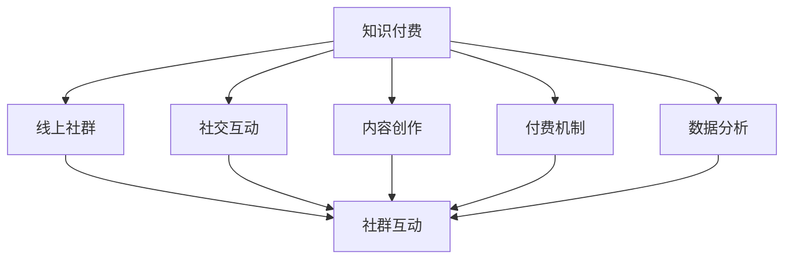
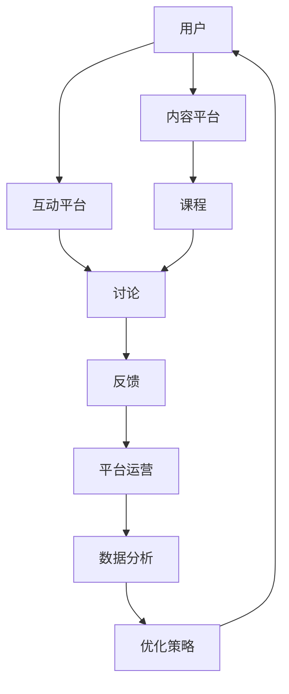

                 

# 如何打造知识付费的线上社群

在当今数字化、信息化的时代背景下，知识付费正成为一种日益兴起的学习方式，为人们提供了一种高效、便捷的学习途径。而线上社群作为知识付费的重要组成部分，其成功运营不仅需要先进的互联网技术作为支撑，还需要深入理解其核心概念和关键原理。本文将系统介绍打造知识付费线上社群的各个方面，涵盖核心概念、技术实现、实际应用及未来发展趋势。

## 1. 背景介绍

### 1.1 问题由来

知识付费线上社群的出现，是信息技术快速发展的产物。得益于互联网的普及，人们获取知识的途径越来越多元化，不再局限于传统的线下书籍和课堂。知识付费线上社群利用互联网技术，打破了地域和时间的限制，让学习变得更加灵活和方便。

近年来，知识付费市场规模快速增长，线上社群因其独特的社交互动性和知识分享特性，受到广大用户的青睐。社群成员可以在这里自由交流、互相学习，同时通过付费机制保证内容的质量和专业性。然而，如何有效运营这些社群，使其真正成为知识的传播者和学习的催化剂，成为了亟待解决的问题。

### 1.2 问题核心关键点

打造知识付费线上社群的核心关键点主要包括：

- **用户需求**：准确把握社群成员的学习需求，提供有针对性的知识内容和交流平台。
- **社群互动**：建立有效的社群互动机制，激发成员的学习兴趣和参与积极性。
- **付费模式**：探索合理的付费机制，保障内容质量和知识分享的可持续性。
- **技术支撑**：利用先进的技术手段，提升社群运营的效率和用户体验。

## 2. 核心概念与联系

### 2.1 核心概念概述

以下是打造知识付费线上社群所需掌握的核心概念：

- **知识付费**：用户为获取特定知识内容而支付费用的模式，旨在提升学习效率和专业性。
- **线上社群**：通过互联网平台构建的虚拟社区，成员可以在这里交流、分享和获取知识。
- **社交互动**：社群成员之间的交流互动，包括讨论、答疑、反馈等，是知识传播和知识共享的基础。
- **内容创作**：社群内知识内容的创作和发布，包括课程、文章、视频等形式。
- **付费机制**：通过订阅、单次付费、免费内容加付费内容等方式，保障内容质量和社群可持续运营。
- **数据分析**：利用数据分析技术，了解社群成员的行为和需求，优化社群运营策略。

这些核心概念之间的关系可以通过以下Mermaid流程图来展示：



### 2.2 核心概念原理和架构的 Mermaid 流程图

以下是一个简单的Mermaid流程图，展示了知识付费线上社群的核心概念及其之间的联系：



## 3. 核心算法原理 & 具体操作步骤

### 3.1 算法原理概述

打造知识付费线上社群的核心算法原理主要包括以下几个方面：

- **内容推荐算法**：通过分析用户的历史行为和偏好，推荐个性化知识内容，提升用户体验和学习效率。
- **互动管理算法**：通过智能算法管理社群成员之间的交流互动，避免垃圾信息和无效讨论，维护社群秩序和活跃度。
- **数据分析算法**：通过数据挖掘和分析技术，了解社群成员的参与情况和学习效果，优化社群运营策略。
- **个性化设置**：根据用户行为和偏好，提供定制化的学习路径和知识内容。

### 3.2 算法步骤详解

打造知识付费线上社群的算法步骤主要包括以下几个关键环节：

1. **数据采集**：收集社群成员的行为数据、反馈信息等，构建用户画像和社群特征。
2. **内容推荐**：根据用户画像和社群特征，使用机器学习算法推荐个性化知识内容。
3. **互动管理**：使用自然语言处理（NLP）等技术，自动识别和过滤垃圾信息，管理社群互动。
4. **数据分析**：使用数据挖掘和机器学习算法，分析社群成员的学习效果和参与情况，生成报告和优化策略。
5. **个性化设置**：根据用户行为和反馈，动态调整个性化推荐和社群互动策略，提升用户体验。

### 3.3 算法优缺点

知识付费线上社群的核心算法主要优点包括：

- **个性化推荐**：通过算法推荐个性化知识内容，提高用户的学习效率和满意度。
- **高效互动管理**：通过智能算法管理社群互动，维护社群秩序，提升社群活跃度。
- **数据分析辅助**：通过数据分析了解用户需求，优化社群运营策略，提升社群运营效率。

同时，也存在一些缺点：

- **算法复杂度高**：个性化推荐和互动管理算法需要处理大量数据，计算复杂度较高。
- **数据隐私问题**：大量用户数据处理涉及隐私问题，需要严格的隐私保护措施。
- **推荐准确性**：算法推荐的准确性直接影响用户的学习效果和满意度，需要持续优化。

### 3.4 算法应用领域

知识付费线上社群的核心算法可以应用于以下领域：

- **在线教育平台**：根据用户学习行为，推荐个性化课程和学习资料。
- **职业培训社群**：通过算法推荐专业技能培训课程，提升成员职业技能。
- **兴趣学习社群**：根据成员兴趣，推荐相关知识内容，促进深度学习和交流。
- **企业知识管理**：通过算法管理企业内部知识共享，提升员工知识水平和工作效率。

## 4. 数学模型和公式 & 详细讲解

### 4.1 数学模型构建

知识付费线上社群的数学模型主要包括以下几个部分：

- **用户行为模型**：描述用户行为和偏好的数学模型，如协同过滤模型、基于内容的推荐算法等。
- **内容质量模型**：评估知识内容质量和相关性的数学模型，如文本相似度算法、情感分析算法等。
- **互动管理模型**：管理社群成员互动的数学模型，如垃圾信息识别算法、情感分析算法等。
- **数据分析模型**：分析社群成员学习效果的数学模型，如聚类算法、分类算法等。

### 4.2 公式推导过程

以协同过滤算法为例，其公式推导过程如下：

$$
\text{推荐项} = \text{用户对物品的评分} = \text{用户对物品的期望评分} + \text{噪声项}
$$

其中，

$$
\text{期望评分} = \text{用户历史评分均值} + \text{用户对物品的预测评分}
$$

$$
\text{预测评分} = \frac{\Sigma (\text{物品i的历史评分}\text{*}\text{物品i的用户历史评分均值})}{\Sigma (\text{物品i的历史评分}^2)}
$$

通过上述公式，协同过滤算法能够根据用户历史行为，预测其对新物品的评分，推荐个性化知识内容。

### 4.3 案例分析与讲解

以下是一个简单的案例分析：

假设有一个在线教育平台，其知识付费社群中有大量用户学习编程课程。平台收集用户的学习行为数据，包括课程观看时长、评分、评论等。通过协同过滤算法，平台可以为用户推荐个性化的编程课程，提升学习效率。具体步骤如下：

1. 收集用户行为数据：包括课程观看时长、评分、评论等。
2. 构建用户画像：根据用户历史行为，生成用户兴趣画像。
3. 计算物品相似度：使用余弦相似度算法计算不同课程之间的相似度。
4. 预测用户评分：根据用户画像和物品相似度，预测用户对新课程的评分。
5. 推荐课程：根据预测评分，推荐个性化编程课程。

## 5. 项目实践：代码实例和详细解释说明

### 5.1 开发环境搭建

打造知识付费线上社群需要搭建一个全面的开发环境，包括以下几个步骤：

1. **服务器搭建**：选择适合的云服务器，配置操作系统、数据库等基础环境。
2. **开发环境配置**：安装Python、Django等开发工具，配置虚拟环境。
3. **数据库搭建**：安装MySQL、MongoDB等数据库，配置数据库连接。
4. **技术栈选择**：选择合适的技术栈，如Django、Flask等Web框架，TensorFlow、PyTorch等机器学习框架。

### 5.2 源代码详细实现

以下是一个简单的知识付费线上社群的实现代码：

```python
# Django应用配置
# settings.py
DATABASES = {
    'default': {
        'ENGINE': 'django.db.backends.mysql',
        'NAME': 'testdb',
        'USER': 'root',
        'PASSWORD': 'password',
        'HOST': 'localhost',
        'PORT': '3306',
    }
}
```

```python
# Django视图
# views.py
from django.shortcuts import render
from django.http import HttpResponse

def home(request):
    return render(request, 'home.html')
```

### 5.3 代码解读与分析

以上代码展示了Django应用的配置和视图实现。具体解释如下：

- `settings.py`：用于配置Django应用的基本信息，如数据库连接、静态文件路径等。
- `views.py`：定义了应用的基本视图函数，如首页视图函数`home`。
- `home.html`：用于渲染首页的HTML模板文件。

### 5.4 运行结果展示

运行上述代码后，用户访问应用首页，即可看到渲染后的HTML页面。

## 6. 实际应用场景

### 6.1 企业内部培训

知识付费线上社群在企业内部培训中具有广泛的应用前景。企业可以通过社群平台，组织员工参与专业技能培训，提升员工技能水平，同时增强企业凝聚力。

具体应用场景包括：

- **课程推荐**：根据员工的学习历史和行为数据，推荐个性化培训课程。
- **知识共享**：建立企业内部知识库，员工可以在社群中分享自己的知识经验和技能，形成知识传播和共享的良性循环。
- **绩效管理**：通过社群平台，对员工的学习效果进行评估和反馈，提升培训效果。

### 6.2 在线教育平台

在线教育平台是知识付费线上社群的主要应用场景之一。平台可以组织各类线上课程和讲座，吸引用户付费参与学习。

具体应用场景包括：

- **课程发布**：平台发布各类课程和讲座，供用户选择学习。
- **互动交流**：用户可以在社群中讨论学习内容，互相解答问题，增强学习效果。
- **付费机制**：平台通过订阅、单次付费等方式，保障内容质量和知识分享的可持续性。

### 6.3 兴趣学习社群

兴趣学习社群是知识付费线上社群的重要组成部分。社群成员基于共同的兴趣，组织学习和交流活动，提升个人知识水平。

具体应用场景包括：

- **话题讨论**：社群成员围绕某个话题进行深入讨论，分享观点和经验。
- **知识分享**：成员可以在社群中分享自己掌握的知识和技能，形成知识共享的生态。
- **资源分享**：社群提供各类学习资源，如课程、论文、书籍等，供成员下载和参考。

## 7. 工具和资源推荐

### 7.1 学习资源推荐

打造知识付费线上社群需要掌握大量的技术知识，以下是推荐的几个学习资源：

1. **《Python Web开发实战》**：深入介绍Django、Flask等Web框架的使用方法和最佳实践。
2. **《机器学习实战》**：详细讲解机器学习算法和模型，包括协同过滤、文本分析等。
3. **《数据分析实战》**：介绍数据挖掘和分析技术的实际应用，如聚类、分类等。
4. **Coursera、edX等在线课程平台**：提供丰富的Web开发、机器学习、数据分析等相关课程。

### 7.2 开发工具推荐

打造知识付费线上社群需要掌握多个开发工具，以下是推荐的几个工具：

1. **Django**：流行的Web框架，提供强大的开发环境和社区支持。
2. **Flask**：轻量级的Web框架，适合快速开发小型应用。
3. **TensorFlow**：广泛使用的机器学习框架，提供强大的计算能力和丰富的API。
4. **PyTorch**：流行的深度学习框架，支持动态图计算和丰富的算法库。
5. **Jupyter Notebook**：强大的数据分析和机器学习开发环境，支持代码单元格、图表展示等。

### 7.3 相关论文推荐

打造知识付费线上社群需要掌握大量的学术知识，以下是推荐的几个相关论文：

1. **《协同过滤推荐系统研究综述》**：介绍协同过滤推荐算法的原理和应用，是知识付费领域的重要参考文献。
2. **《深度学习在知识推荐中的应用》**：介绍深度学习在知识推荐中的具体应用，包括文本分类、情感分析等。
3. **《知识图谱与推荐系统结合的研究》**：介绍知识图谱在推荐系统中的应用，提升知识推荐的准确性和效果。

## 8. 总结：未来发展趋势与挑战

### 8.1 研究成果总结

打造知识付费线上社群的核心算法和技术实现已经取得一定的成果，主要包括以下几个方面：

- **个性化推荐算法**：通过协同过滤、基于内容的推荐等算法，提升个性化知识推荐的效果。
- **互动管理算法**：使用自然语言处理等技术，自动识别和过滤垃圾信息，管理社群互动。
- **数据分析算法**：利用数据挖掘和机器学习算法，分析社群成员的学习效果和参与情况，优化社群运营策略。

### 8.2 未来发展趋势

未来知识付费线上社群的发展趋势主要包括以下几个方向：

1. **智能化推荐**：通过更先进的机器学习和深度学习算法，提升推荐算法的效果和智能化程度。
2. **互动社交化**：进一步强化社群成员之间的互动和社交化，提升社群的活跃度和粘性。
3. **内容多样化**：引入更多元化的内容形式，如视频、直播等，提升用户体验。
4. **社区化建设**：构建更多具有社区化特点的知识付费社群，提升社群成员的归属感和参与度。

### 8.3 面临的挑战

打造知识付费线上社群面临的挑战主要包括以下几个方面：

1. **用户需求变化**：随着用户需求的不断变化，需要不断优化个性化推荐算法，满足用户新的学习需求。
2. **数据隐私问题**：大量用户数据的处理涉及隐私问题，需要严格的隐私保护措施。
3. **内容质量控制**：如何保证内容的质量和准确性，避免误导用户，是知识付费线上社群需要重点关注的问题。
4. **运营成本高**：知识付费线上社群的运营需要大量的技术投入和资金支持，如何实现商业可持续性是一个挑战。

### 8.4 研究展望

未来知识付费线上社群的研究展望主要包括以下几个方向：

1. **个性化推荐算法**：进一步提升个性化推荐算法的准确性和智能化程度，提升用户的学习效果和满意度。
2. **社交化互动**：构建更加活跃、互动性强的社群，提升用户的学习参与度和社群粘性。
3. **跨平台融合**：将知识付费线上社群与其他社交平台融合，扩大知识传播和共享的范围。
4. **商业可持续性**：探索更加可持续的商业模式，保障知识付费线上社群的长期发展。

## 9. 附录：常见问题与解答

**Q1：知识付费线上社群如何保持高活跃度？**

A: 知识付费线上社群的高活跃度主要取决于以下几个因素：

- **优质内容**：提供高质量、有价值的知识内容，吸引用户持续参与。
- **互动机制**：建立有效的互动机制，如讨论、答疑、反馈等，提升用户参与度。
- **社区文化**：营造积极的社区文化，鼓励用户积极分享和互动。
- **技术支持**：利用先进的技术手段，提升社群运营效率和用户体验。

**Q2：如何保证知识付费线上社群的内容质量？**

A: 保证知识付费线上社群的内容质量主要需要以下几个方面的措施：

- **内容审核机制**：建立严格的内容审核机制，避免低质量内容的发布。
- **用户反馈机制**：通过用户反馈机制，了解用户对内容的需求和建议，及时调整内容策略。
- **专业团队**：聘请专业的内容创作者和编辑团队，提升内容的质量和专业性。
- **数据驱动**：利用数据分析技术，了解用户的学习效果和需求，优化内容策略。

**Q3：知识付费线上社群如何实现商业可持续性？**

A: 知识付费线上社群的商业可持续性主要取决于以下几个因素：

- **付费模式**：选择合适的付费模式，如订阅、单次付费、免费内容加付费内容等，保障内容质量和知识分享的可持续性。
- **用户黏性**：通过优质的内容和互动机制，提升用户黏性，增加付费意愿。
- **增值服务**：提供各类增值服务，如会员特权、一对一辅导等，提升用户体验和付费意愿。
- **市场推广**：通过有效的市场推广和营销手段，扩大社群影响力，吸引更多用户加入。

通过不断优化和创新，知识付费线上社群可以实现商业可持续性，为更多用户提供优质知识和服务的平台。

