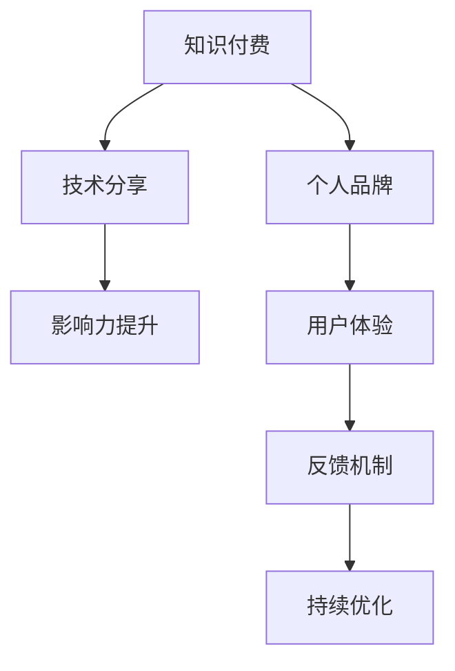

                 

# 如何打造高影响力的程序员知识付费个人品牌

> 关键词：知识付费, 个人品牌, 程序员, 技术分享, 影响力构建

## 1. 背景介绍

在知识付费的时代背景下，程序员作为技术领域的知识生产者和传播者，如何在职业发展过程中构建起高影响力的个人品牌，成为一个亟需关注的话题。本文将详细阐述如何通过知识付费的形式，打造个人品牌，实现技术和商业价值的双重增长。

## 2. 核心概念与联系

### 2.1 核心概念概述

构建高影响力的程序员知识付费个人品牌涉及多个核心概念，包括但不限于知识付费、个人品牌构建、技术分享、影响力提升等。

- **知识付费**：指通过付费形式获取有价值知识的过程，这种形式能够更好地激发知识提供者的创造力和分享热情。

- **个人品牌**：指通过特定行为和内容塑造自己在行业内的独特形象，从而获得市场认知和用户信任。

- **技术分享**：指技术工作者将自己的知识、经验和技术通过各种形式分享给社会，以促进技术和知识的传播。

- **影响力提升**：指通过一系列有效的策略和技巧，提升自己的行业影响力，从而吸引更多的关注和合作机会。

### 2.2 核心概念原理和架构的 Mermaid 流程图(Mermaid 流程节点中不要有括号、逗号等特殊字符)



该流程图展示了知识付费、个人品牌、技术分享、影响力提升之间的关系。通过技术分享积累用户信任，用户反馈促使持续优化，最终提升个人品牌影响力，形成良性循环。

## 3. 核心算法原理 & 具体操作步骤

### 3.1 算法原理概述

打造高影响力的程序员知识付费个人品牌，其核心算法原理可概括为以下几个步骤：

1. **内容生产**：持续生产高质量、有深度的技术内容，建立自己在领域内的权威性。
2. **平台选择**：选择合适的知识付费平台，如CSDN、掘金、知乎等，以及视频平台如B站、YouTube等，进行内容发布和传播。
3. **用户互动**：与用户建立互动，通过评论、私信、社区讨论等方式，及时获取反馈并做出回应。
4. **品牌建设**：通过个人博客、社交媒体、个人网站等渠道，打造和维护个人品牌形象。
5. **商业变现**：利用积累的影响力，开展商业变现活动，如广告、付费咨询、技术培训等。

### 3.2 算法步骤详解

以下是详细的算法步骤，每个步骤将进行详细说明：

#### 3.2.1 内容生产

- **选题策划**：根据市场需求和个人专长，策划有深度和实用价值的内容。可以通过技术博客、视频讲解、技术分享会等多种形式呈现。
- **内容制作**：制作内容时注重质量，确保内容逻辑清晰、语言通俗易懂。可以借助思维导图、示例代码等辅助工具提升内容可读性。
- **内容发布**：选择合适的时间发布内容，利用平台推荐算法和社交媒体扩大传播。

#### 3.2.2 平台选择

- **平台特性**：评估各平台的用户群体、内容风格、推荐算法等特点，选择最适合自己的平台。
- **用户画像**：深入了解目标用户群体的需求和兴趣，提供精准的技术内容。
- **平台维护**：在平台上保持活跃，定期更新内容，参与社区讨论，建立稳定的人脉网络。

#### 3.2.3 用户互动

- **及时回复**：在用户评论和私信中积极互动，及时回答问题，建立良好的沟通渠道。
- **用户反馈**：收集用户反馈，了解内容接受程度和改进方向，进行内容优化。
- **社区参与**：积极参与社区讨论和活动，提升个人影响力。

#### 3.2.4 品牌建设

- **个人博客**：建立个人博客，记录技术心得，分享工作和生活，形成稳定的内容输出。
- **社交媒体**：在微博、微信公众号等社交媒体上发布技术文章、分享生活动态，建立个人品牌形象。
- **个人网站**：制作个人网站，展示技术项目、个人简介、联系方式等，提升专业形象。

#### 3.2.5 商业变现

- **广告合作**：与企业和技术公司合作，通过广告推广变现。
- **付费咨询**：通过技术博客、视频平台等提供付费咨询服务。
- **技术培训**：组织或参与技术培训，传授技术知识和经验，获取培训费用。

### 3.3 算法优缺点

**优点**：

- 快速积累专业技能，提升个人品牌价值。
- 通过知识付费获取经济收益，激励持续学习和分享。
- 借助平台流量和用户网络，扩大影响力。

**缺点**：

- 内容创作需要时间和精力投入，初期回报可能较低。
- 需平衡好商业和公益，避免过度商业化影响用户体验。
- 内容竞争激烈，需不断创新和提升内容质量。

### 3.4 算法应用领域

知识付费个人品牌构建广泛应用于软件开发、人工智能、大数据、区块链等多个技术领域。在实践中，不仅限于技术分享，还可以涵盖项目管理、职业发展、创业指导等多个方面。

## 4. 数学模型和公式 & 详细讲解 & 举例说明

### 4.1 数学模型构建

假设程序员的技术影响力可以用一个数学模型表示，该模型包含用户数量 $U$、互动次数 $I$、内容质量 $C$ 和商业价值 $V$ 四个维度。模型的目标函数为：

$$ f(U, I, C, V) = \max \left\{ U \times I \times C \times V \right\} $$

其中，$U$ 表示用户数量，$I$ 表示与用户的互动次数，$C$ 表示内容质量，$V$ 表示商业价值。

### 4.2 公式推导过程

根据上述目标函数，我们可以推导出以下优化策略：

1. **提升用户数量**：通过多种渠道推广内容，扩大受众基础。
2. **增加互动次数**：在平台上保持活跃，积极回复用户评论和私信。
3. **提高内容质量**：通过精心的选题策划和内容制作，确保内容有深度、有价值。
4. **增强商业价值**：与企业合作，开展商业变现活动。

### 4.3 案例分析与讲解

以某知名技术博主为例，他通过在知乎、掘金等平台分享深度技术文章，积极参与社区讨论，建立起了自己的品牌形象。通过技术博客、视频讲解等形式，不断积累用户和读者，最终实现商业变现，开设了技术培训课程。

## 5. 项目实践：代码实例和详细解释说明

### 5.1 开发环境搭建

- **编程语言**：Python
- **开发框架**：Flask、Django
- **内容管理**：Markdown、LaTeX
- **协作工具**：GitHub、GitLab

### 5.2 源代码详细实现

以下是一个简单的个人博客系统实现示例：

```python
from flask import Flask, render_template, request
from markdown import markdown

app = Flask(__name__)

@app.route('/')
def index():
    return render_template('index.html')

@app.route('/post/<id>', methods=['GET', 'POST'])
def post(id):
    post = get_post(id)
    if request.method == 'POST':
        update_post(id, request.form['title'], request.form['content'])
    return render_template('post.html', post=post)

def get_post(id):
    # 从数据库或文件系统获取指定id的博客文章
    pass

def update_post(id, title, content):
    # 更新指定id的博客文章
    pass

if __name__ == '__main__':
    app.run(debug=True)
```

### 5.3 代码解读与分析

上述代码实现了一个简单的个人博客系统，其中：

- `index`函数：渲染主页，展示所有博客文章列表。
- `post`函数：渲染指定id的博客文章页面，并提供编辑和更新功能。
- `get_post`函数：从数据库或文件系统获取指定id的博客文章。
- `update_post`函数：更新指定id的博客文章。

### 5.4 运行结果展示

运行上述代码，访问`http://localhost:5000`，即可浏览个人博客文章。用户可以阅读和评论文章，并通过表单提交修改建议。

## 6. 实际应用场景

### 6.1 在线教育

通过知识付费平台，程序员可以创建在线教育课程，分享技术知识和经验。这种形式不仅能够获得经济收益，还能积累行业影响力。例如，某知名技术专家在Coursera和Udemy上开设了Python、Java等编程语言课程，受到广泛欢迎。

### 6.2 技术培训

大型企业和技术公司可以邀请知名技术博主进行技术培训，传授先进技术和经验，提升员工技能水平。这种形式能够帮助企业留住人才，提高团队技术水平。例如，某知名博主为企业提供为期3个月的编程训练营，深受企业欢迎。

### 6.3 技术咨询

程序员可以通过技术博客、视频平台等提供付费咨询服务，帮助企业解决技术难题。这种形式能够直接对接企业需求，提升个人影响力。例如，某知名博主开设了技术咨询公司，为企业提供云计算、大数据等技术支持。

## 7. 工具和资源推荐

### 7.1 学习资源推荐

- **《技术写作：如何打造个人品牌》**：这本书详细介绍了如何通过写作打造个人品牌，适用于技术人员和知识工作者。
- **《程序员的商业修养》**：这本书帮助程序员了解商业知识和技能，提升自身商业价值。
- **《技术人的影响力》**：这本书从多个角度探讨了技术人对社会的影响，为技术工作者提供参考。
- **《知识付费营销》**：这本书提供了知识付费市场分析和营销策略，帮助程序员打造个人品牌。

### 7.2 开发工具推荐

- **GitHub/GitLab**：代码管理和协作工具，支持版本控制和协作开发。
- **Flask/Django**：轻量级和全功能的Web框架，便于构建个人博客和知识付费平台。
- **Markdown/LaTeX**：文本编辑工具，支持复杂排版和格式处理，适用于技术博客和文档编写。
- **YouTube/B站**：视频分享平台，适合发布技术讲解视频，扩大影响范围。

### 7.3 相关论文推荐

- **《打造知识付费时代的个人品牌》**：论文详细探讨了知识付费对个人品牌构建的影响，提供了多角度分析。
- **《技术共享与品牌建设》**：论文研究了技术共享对个人品牌的影响，提供了可行的策略和方法。
- **《程序员的商业价值提升》**：论文探讨了程序员如何通过知识付费提升商业价值，提供了具体案例和策略。

## 8. 总结：未来发展趋势与挑战

### 8.1 研究成果总结

通过知识付费打造高影响力的程序员个人品牌，已成为技术领域的一种趋势。本文从内容生产、平台选择、用户互动、品牌建设、商业变现等多个方面，详细阐述了技术工作者如何构建个人品牌，并实现技术和商业价值的双重增长。

### 8.2 未来发展趋势

1. **内容多样化**：未来将涌现更多形式的内容，如技术博客、视频讲解、在线课程等。
2. **平台多元化**：知识付费平台将更加丰富，除了传统的博客和视频平台，还将涵盖社交媒体、直播平台等。
3. **技术跨界融合**：技术工作者将更多地参与到跨界领域，如人工智能、区块链、大数据等。
4. **商业变现多样化**：除了广告和培训，还将出现更多形式的商业变现方式，如技术咨询、知识付费等。

### 8.3 面临的挑战

1. **内容质量**：如何保证内容的质量和深度，避免平庸和重复，是技术工作者面临的重要挑战。
2. **平台竞争**：知识付费平台众多，如何脱颖而出，吸引更多用户，是一个难题。
3. **用户互动**：如何建立与用户的良好互动，及时获取反馈并持续优化内容，是一个需要不断探索的问题。
4. **商业变现**：如何在保证内容质量和用户体验的前提下，实现商业变现，是一个需要平衡的问题。

### 8.4 研究展望

未来，如何通过知识付费打造个人品牌，将成为技术工作者必须关注的话题。本文仅提供了一些基本策略和思路，更多的创新和实践，还需技术工作者不断探索和实践。希望通过本文的讨论，能够为技术工作者提供一些启发和参考。

## 9. 附录：常见问题与解答

### 9.1 如何选择合适的知识付费平台？

选择合适的知识付费平台需要考虑以下几个因素：

1. **用户群体**：平台的用户群体是否与自己内容的受众相匹配。
2. **平台特点**：平台的内容分发机制、付费模式、用户反馈机制等特点是否符合需求。
3. **平台流量**：平台的流量和曝光度，是否有助于内容传播。

### 9.2 如何提升内容质量？

提升内容质量可以从以下几个方面入手：

1. **选题策划**：根据市场需求和个人专长，策划有深度和实用价值的内容。
2. **内容制作**：注重内容逻辑清晰、语言通俗易懂，使用示例代码、思维导图等辅助工具提升可读性。
3. **内容更新**：定期更新内容，保持平台活跃度。

### 9.3 如何建立用户互动？

建立用户互动可以从以下几个方面入手：

1. **积极回复**：在用户评论和私信中积极互动，及时回答问题，建立良好的沟通渠道。
2. **用户反馈**：收集用户反馈，了解内容接受程度和改进方向，进行内容优化。
3. **社区参与**：积极参与社区讨论和活动，提升个人影响力。

### 9.4 如何商业变现？

商业变现可以从以下几个方面入手：

1. **广告合作**：与企业和技术公司合作，通过广告推广变现。
2. **付费咨询**：通过技术博客、视频平台等提供付费咨询服务。
3. **技术培训**：组织或参与技术培训，传授技术知识和经验，获取培训费用。

---

作者：禅与计算机程序设计艺术 / Zen and the Art of Computer Programming

