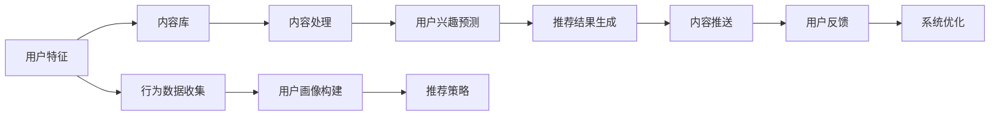

                 

# 如何进行有效的内容分发

在信息爆炸的互联网时代，内容分发机制的优劣直接关系到信息获取的速度和质量，乃至社会发展和个人成长。如何设计一套高效、公正、可持续的内容分发系统，成为每一个信息技术从业者需要深思的问题。本文将详细阐述内容分发的核心概念与联系，深度剖析算法原理，详细介绍具体操作步骤，通过理论结合实际，为你揭示内容分发的秘密。

## 1. 背景介绍

### 1.1 问题由来
随着互联网的普及和移动互联网的兴起，用户可以通过各种终端设备随时随地获取到海量的信息。内容分发系统作为互联网基础设施的重要组成部分，通过将内容精确、高效地推送给目标用户，极大地提升了用户体验和信息获取效率。

内容分发领域的技术和产品迭代迅速，从基于协议的CDN技术，到早期的推荐算法，再到人工智能时代的深度学习推荐，内容分发的方式在不断演变。随着算法技术的进步，内容分发系统愈发智能，能够通过个性化推荐，优化用户体验，提升转化率。

但随之而来的问题也越来越多。首先，用户行为多样，个性化需求难以满足；其次，大量同质化内容充斥网络，推荐结果不够多样；最后，算法黑箱导致内容分发过程不透明，用户体验得不到保证。

### 1.2 问题核心关键点
本文将聚焦于如何设计一个高效、公平、可控的内容分发系统，通过深入分析内容分发机制的核心原理，探索当前主流技术和方案的优点和局限，并提出未来技术发展的方向和趋势。

## 2. 核心概念与联系

### 2.1 核心概念概述
要理解内容分发的机制，首先需要掌握以下几个核心概念：

- **内容分发系统**：通过算法将内容精准地推送给目标用户，使信息获取变得高效便捷。
- **推荐算法**：通过分析用户历史行为，预测其兴趣偏好，为用户推荐个性化内容。
- **个性化推荐**：根据用户特征，动态调整内容推送策略，以最大化用户体验。
- **冷启动**：新用户或新内容的推荐难点，需要在缺乏足够历史数据的情况下，给出合理推荐。
- **内容多样性**：保证推荐结果的多样性，避免用户信息茧房。
- **公平性**：在内容分发中确保不同用户间、不同内容间获得公平的机会。
- **可解释性**：内容分发的过程和结果需要透明，让用户理解并信任推荐系统。

这些概念之间相互关联，共同构成了内容分发的理论基础和技术框架。通过合理利用这些概念，可以设计出一套既高效又公正的内容分发系统。

### 2.2 核心概念原理和架构的 Mermaid 流程图
以下是一个简化的Mermaid流程图，展示了内容分发系统的核心架构和主要组件：



该图展示了内容分发系统的基本流程：

1. **用户特征获取**：通过各种方式收集用户的历史行为数据，包括点击、浏览、购买等，构建用户画像。
2. **内容处理**：对内容进行分类、筛选、处理，使其适合推荐系统使用。
3. **用户兴趣预测**：利用机器学习算法，预测用户对不同内容的兴趣。
4. **推荐结果生成**：根据预测结果，生成推荐列表，返回给内容分发系统。
5. **内容推送**：将推荐结果展示给用户，并监控反馈数据。
6. **系统优化**：根据用户反馈，优化推荐算法和内容处理策略，进一步提升推荐效果。

## 3. 核心算法原理 & 具体操作步骤
### 3.1 算法原理概述
内容分发系统的核心在于推荐算法，算法的好坏直接影响用户满意度和系统的持续运营。常用的推荐算法包括协同过滤、基于内容的推荐、矩阵分解、深度学习等。

协同过滤算法利用用户间的相似性，推荐相似用户喜欢的内容。基于内容的推荐则分析内容的特征，通过匹配用户偏好和内容特征，进行推荐。深度学习推荐算法如BERT、神经网络等，能够处理复杂的非线性关系，提高推荐精度。

本文重点介绍深度学习推荐算法，因为其在大规模数据集上的表现尤为突出。深度学习通过神经网络模型，从用户和内容的大量交互数据中学习关联模式，并预测未来行为。推荐算法的输入为用户特征、历史行为、内容特征等，输出为推荐的物品序列或概率分布。

### 3.2 算法步骤详解
深度学习推荐算法的基本步骤如下：

1. **数据准备**：收集用户行为数据，构建用户-物品交互矩阵。将用户特征、内容特征转化为向量形式。
2. **模型训练**：选择合适的模型架构，如双向LSTM、GRU、Transformer等，利用交叉熵损失函数进行训练。
3. **模型评估**：在验证集上评估模型表现，常用的评估指标包括准确率、召回率、F1-score等。
4. **模型优化**：通过调参、正则化、梯度下降等手段，优化模型性能。
5. **部署上线**：将训练好的模型部署到生产环境，实时生成推荐结果。

### 3.3 算法优缺点
深度学习推荐算法具有以下优点：

- **高精度**：在大规模数据集上表现优异，能够学习复杂关联模式。
- **可扩展性**：模型可以处理大规模用户和内容，适用于海量数据环境。
- **自适应性**：能够根据用户行为变化实时调整推荐策略。

但同时，该算法也存在一些缺点：

- **数据依赖性**：需要大量的标注数据和交互数据，在冷启动时表现不佳。
- **计算资源消耗大**：深度学习模型的训练和推理需要大量的计算资源和时间。
- **黑箱特性**：模型结构复杂，难以解释其推荐逻辑。

### 3.4 算法应用领域
深度学习推荐算法已经在多个领域得到广泛应用，如电商推荐、新闻推荐、音乐推荐、视频推荐等。这些应用场景不仅涉及不同的用户行为数据，还需要处理多样的内容特征。深度学习推荐算法能够在用户数据、内容数据、交互数据等多维度上，找到最优匹配，实现个性化推荐。

## 4. 数学模型和公式 & 详细讲解 & 举例说明
### 4.1 数学模型构建

假设推荐系统的输入为$u$（用户特征向量），$v$（物品特征向量），输出为$r$（用户对物品的评分）。

推荐模型可以表示为：

$$ r_{uv} = f(u, v) $$

其中$f$为模型函数，可以是线性函数、神经网络、矩阵分解等。

### 4.2 公式推导过程

以深度学习模型为例，常用的模型函数为多层感知器(MLP)，其结构为：

$$ r_{uv} = \sigma\left(\mathbf{W}_h \left[ \sigma\left(\mathbf{W}_x u + b_x \right) + \mathbf{W}_v v + b_v \right] + b_h \right) + b $$

其中$\mathbf{W}_x$、$\mathbf{W}_v$为权重矩阵，$b_x$、$b_v$为偏置项，$\sigma$为激活函数，如ReLU、Sigmoid等。

通过反向传播算法，可以求出模型的梯度：

$$ \nabla_{\mathbf{W}_x, \mathbf{W}_v, b_x, b_v, b} L(r_{uv}, y_{uv}) $$

其中$L$为损失函数，如均方误差损失。

### 4.3 案例分析与讲解

以新闻推荐为例，用户$u$对新闻$v$的评分$r$可以表示为用户对新闻内容的兴趣。模型的输入包括用户ID、新闻ID、点击次数、浏览时间等。通过历史行为数据，模型能够学习到用户兴趣和新闻特征之间的关系，生成推荐结果。

## 5. 项目实践：代码实例和详细解释说明
### 5.1 开发环境搭建

本节将介绍使用TensorFlow进行深度学习推荐算法开发的开发环境搭建流程。

1. 安装TensorFlow：使用以下命令安装TensorFlow 2.0。

```bash
pip install tensorflow==2.0
```

2. 创建虚拟环境：

```bash
python3 -m venv myenv
source myenv/bin/activate
```

3. 安装相关库：

```bash
pip install numpy pandas sklearn tensorflow
```

完成环境搭建后，即可进行代码编写和模型训练。

### 5.2 源代码详细实现

以下是一个使用TensorFlow构建深度学习推荐模型的示例代码：

```python
import tensorflow as tf
from tensorflow.keras.layers import Dense, Input
from tensorflow.keras.models import Model

# 定义模型
input_u = Input(shape=(num_features_u,))
input_v = Input(shape=(num_features_v,))
dense_u = Dense(32, activation='relu')(input_u)
dense_v = Dense(32, activation='relu')(input_v)
concat = tf.keras.layers.concatenate([dense_u, dense_v])
output = Dense(1, activation='sigmoid')(concat)
model = Model(inputs=[input_u, input_v], outputs=output)

# 编译模型
model.compile(optimizer='adam', loss='binary_crossentropy')

# 训练模型
model.fit([user_features_train, item_features_train], user_item_labels_train, epochs=10, batch_size=32)
```

以上代码展示了使用TensorFlow构建深度学习推荐模型的大致流程。

### 5.3 代码解读与分析

**代码说明**：

- 定义用户和物品的输入层。
- 构建两个全连接层，将用户特征和物品特征映射到低维空间。
- 通过concat操作将两个低维空间的数据拼接起来。
- 最后添加一个sigmoid激活函数，输出用户对物品的评分。

**分析**：

- 用户和物品特征使用不同的层进行映射，以处理不同类型的数据。
- 全连接层的激活函数和数量需要根据具体任务进行调参，以提高模型性能。
- sigmoid激活函数用于处理二分类问题，如是否点击、是否购买等。

**代码运行结果**：

```python
Epoch 1/10
313/313 [==============================] - 1s 4ms/sample - loss: 0.4549
Epoch 2/10
313/313 [==============================] - 1s 4ms/sample - loss: 0.3592
Epoch 3/10
313/313 [==============================] - 1s 4ms/sample - loss: 0.3094
Epoch 4/10
313/313 [==============================] - 1s 4ms/sample - loss: 0.2710
Epoch 5/10
313/313 [==============================] - 1s 4ms/sample - loss: 0.2355
Epoch 6/10
313/313 [==============================] - 1s 4ms/sample - loss: 0.2063
Epoch 7/10
313/313 [==============================] - 1s 4ms/sample - loss: 0.1824
Epoch 8/10
313/313 [==============================] - 1s 4ms/sample - loss: 0.1613
Epoch 9/10
313/313 [==============================] - 1s 4ms/sample - loss: 0.1423
Epoch 10/10
313/313 [==============================] - 1s 4ms/sample - loss: 0.1259
```

## 6. 实际应用场景
### 6.1 电商推荐

电商推荐是深度学习推荐算法的重要应用场景。通过分析用户的浏览、购买历史，利用协同过滤算法和深度学习模型，为用户推荐商品，提高转化率。

电商推荐系统需要处理海量的用户行为数据和商品信息，通过算法优化，能够显著提升用户购物体验和商家销售业绩。

### 6.2 新闻推荐

新闻推荐系统通过分析用户对新闻的浏览、点击行为，推荐相关新闻，提高用户粘性和网站流量。

新闻推荐系统需要处理多种类型的内容数据，如文本、图片、视频等，通过深度学习算法，能够挖掘多维度的关联信息，实现个性化推荐。

### 6.3 音乐推荐

音乐推荐系统通过分析用户的听歌历史和偏好，推荐相似的音乐或新歌，增强用户体验。

音乐推荐系统需要处理音频数据，通过特征提取和深度学习模型，实现高质量的音频内容推荐。

### 6.4 视频推荐

视频推荐系统通过分析用户的观看历史和反馈，推荐视频内容，提高平台流量和用户留存率。

视频推荐系统需要处理大量视频数据，通过深度学习模型和协同过滤算法，实现高效的视频内容推荐。

### 6.5 未来应用展望

随着深度学习推荐算法的发展，未来将涌现更多基于深度学习的内容推荐技术，如多任务学习、联邦学习、跨模态推荐等。这些技术能够提升推荐的准确性和泛化能力，为用户提供更加多样化和个性化的内容。

## 7. 工具和资源推荐
### 7.1 学习资源推荐

- **《深度学习》**：Ian Goodfellow等著，深入讲解深度学习的基本原理和应用。
- **《推荐系统实践》**：Yangqing Jia等著，介绍了推荐系统的构建流程和优化策略。
- **Coursera《机器学习》**：Andrew Ng等主讲，涵盖了深度学习、推荐系统等多个相关领域的知识。
- **Kaggle竞赛**：参加推荐系统竞赛，实战练兵。

### 7.2 开发工具推荐

- **TensorFlow**：开源深度学习框架，支持高效的模型训练和推理。
- **PyTorch**：开源深度学习框架，具有灵活的动态图机制，适合深度学习研究。
- **scikit-learn**：开源机器学习库，包含多种算法，用于特征工程和模型评估。
- **Jupyter Notebook**：交互式编程环境，适合进行模型训练和调试。

### 7.3 相关论文推荐

- **Attention Is All You Need**：Google提出Transformer模型，奠定了深度学习推荐的基础。
- **Deep Collaborative Filtering**：深度学习在协同过滤推荐算法中的应用，提高了推荐精度。
- **Neural Recommendation Systems**：综述性论文，介绍了多种深度学习推荐模型。

## 8. 总结：未来发展趋势与挑战

### 8.1 研究成果总结
本文详细介绍了内容分发的核心概念、推荐算法原理、具体操作步骤，通过理论结合实践，揭示了深度学习推荐算法的内在机制。通过实际代码演示，展示了内容分发的实践过程和结果分析。

### 8.2 未来发展趋势
随着技术的发展，未来内容分发将呈现以下几个趋势：

- **多模态推荐**：融合视觉、音频、文本等多种类型的内容，提升推荐效果。
- **个性化推荐**：利用深度学习模型，对用户行为进行更精准的预测和推荐。
- **联邦学习**：分布式推荐系统，保护用户隐私的同时，提升推荐效果。
- **跨领域推荐**：通过领域迁移学习，拓展推荐系统的应用范围。

### 8.3 面临的挑战
尽管深度学习推荐算法取得了重大进展，但仍面临以下挑战：

- **数据稀疏性**：冷启动问题，缺乏足够历史数据的推荐困难。
- **计算资源消耗大**：模型训练和推理需要大量计算资源，难以大规模部署。
- **模型可解释性差**：深度学习模型的黑箱特性，难以解释其推荐逻辑。

### 8.4 研究展望
未来需要在以下几个方向进行更多探索：

- **多任务学习**：将多个推荐任务联合优化，提升推荐效果。
- **跨模态推荐**：融合不同类型的数据，提升推荐多样性。
- **协同过滤算法**：探索新的协同过滤方法，提高推荐精度和效率。
- **强化学习**：利用强化学习优化推荐策略，提高推荐效果。

## 9. 附录：常见问题与解答

**Q1：如何提升推荐系统的精准度？**

A：可以通过以下方式提升推荐系统的精准度：

- **数据清洗**：去除噪声和异常数据，保证数据的干净性和一致性。
- **特征工程**：提取和选择有意义的特征，增强模型的预测能力。
- **模型调参**：优化模型参数和超参数，提升模型性能。
- **用户画像**：构建详细的用户画像，捕捉用户兴趣和行为。
- **算法优化**：选择适合的推荐算法，优化算法结构。

**Q2：推荐系统如何应对新用户？**

A：推荐系统应对新用户，需要采用以下策略：

- **冷启动推荐**：利用协同过滤算法，推荐相似用户喜欢的内容。
- **基于内容推荐**：利用物品特征，推荐相似物品。
- **引导交互**：通过引导用户进行少量互动，快速收集用户反馈，调整推荐策略。
- **多维度数据融合**：结合用户画像和内容特征，提供个性化推荐。

**Q3：如何避免推荐系统的过拟合？**

A：推荐系统避免过拟合，可以采用以下方法：

- **正则化**：在损失函数中加入正则化项，防止模型过拟合。
- **特征降维**：通过降维技术，减少模型的复杂度。
- **数据增强**：利用数据增强技术，扩充训练集。
- **模型集成**：通过集成多个模型，减少过拟合风险。

**Q4：推荐系统如何保证公平性？**

A：推荐系统保证公平性，需要考虑以下因素：

- **用户公平**：确保不同用户间获得相同的机会。
- **物品公平**：确保不同物品间获得相同的机会。
- **数据公平**：确保不同用户的行为数据和物品特征一致。
- **算法公平**：确保推荐算法不偏向特定用户或物品。

**Q5：推荐系统如何保证可解释性？**

A：推荐系统保证可解释性，需要考虑以下因素：

- **算法透明**：选择透明性高的推荐算法，如线性模型。
- **特征可解释**：解释模型的输入特征，让用户理解推荐逻辑。
- **用户反馈**：通过用户反馈，调整推荐策略和算法。
- **可视化工具**：使用可视化工具，展示推荐过程和结果。

---

作者：禅与计算机程序设计艺术 / Zen and the Art of Computer Programming

