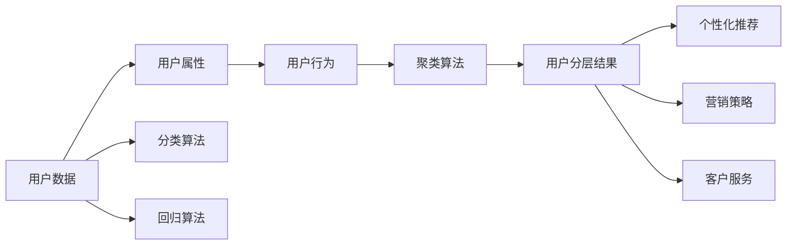

                 

# 如何进行有效的用户分层

在数字化的商业环境中，用户分层（User Segmentation）是一项关键的工作，它有助于企业理解用户行为，优化产品设计，个性化营销策略，提高运营效率。本文将深入探讨用户分层的核心概念、算法原理及实际操作步骤，分析其优缺点和应用领域，并提供一些案例和数学模型，最终给出项目实践和实际应用场景的详细说明。

## 1. 背景介绍

### 1.1 问题由来
随着互联网技术的快速发展，数据驱动的决策方式变得越来越普遍。企业需要依赖大量的用户数据来理解用户行为，预测未来趋势，指导产品设计和营销策略。然而，用户数据往往是海量且复杂，如何从繁杂的数据中提取出有价值的信息，进行有效的用户分层，是现代企业亟待解决的问题。

用户分层的基本思路是将用户按照一定的规则分成若干群体，每个群体具有相同或相似的特征。通过对用户分层的深入理解，企业可以更精准地把握用户需求，制定个性化策略，提升用户体验和运营效率。

### 1.2 问题核心关键点
用户分层过程中，核心关键点主要包括：
- 如何定义用户分层的维度（如地理、人口统计、行为、心理等）。
- 如何选择合适的算法进行用户分组（如聚类、分类、回归等）。
- 如何评估分层的有效性（如稳定性和覆盖率等）。
- 如何应用分层结果（如用户画像、个性化推荐、营销策略等）。

本文档将重点介绍聚类算法在用户分层中的应用，并结合分类和回归等方法，为读者提供一个全面深入的视角。

### 1.3 问题研究意义
用户分层在企业运营中具有重要的意义：

1. **用户画像构建**：分层可以帮助企业构建精细化的用户画像，更好地理解用户需求，指导产品迭代和优化。
2. **个性化营销**：通过用户分层，企业可以制定更加精准的个性化营销策略，提升用户满意度和转化率。
3. **运营效率提升**：对不同用户群体进行针对性管理和优化，可以提升运营效率，降低运营成本。
4. **竞争力增强**：通过对用户行为和需求的深入理解，企业可以更好地满足市场需要，增强市场竞争力。

本文将通过详细讲解用户分层的核心概念和算法原理，为读者提供实用的技术指导，帮助企业更好地应用用户分层技术，推动业务发展。

## 2. 核心概念与联系

### 2.1 核心概念概述

用户分层主要涉及以下几个关键概念：

- **用户数据**：用户行为数据、人口统计信息、消费记录等。
- **用户属性**：用户的基础特征，如年龄、性别、职业等。
- **用户行为**：用户的操作行为、购买行为、访问记录等。
- **用户分层**：将用户按照一定的规则分成若干群体，每个群体具有相同或相似的特征。
- **聚类算法**：通过相似性度量，将相似的用户分到同一组中。
- **分类算法**：通过标签预测，将用户分为不同的类别。
- **回归算法**：通过预测连续数值，对用户进行分层。

这些概念之间存在密切联系，共同构成了用户分层的理论基础和实践工具。用户属性和行为数据是进行分层的原始数据来源，聚类、分类、回归等算法则是进行分层的工具和技术手段，最终用户分层结果将应用于企业运营的不同环节，如产品推荐、营销策略、客户服务等。

### 2.2 核心概念原理和架构的 Mermaid 流程图



这个流程图展示了用户分层的基本流程和架构，从用户数据出发，通过用户属性和行为分析，选择适当的算法进行用户分层，最终形成分层结果，并应用于产品推荐、营销策略、客户服务等多个环节。

## 3. 核心算法原理 & 具体操作步骤

### 3.1 算法原理概述

用户分层的核心算法包括聚类算法、分类算法和回归算法。这里我们将重点介绍聚类算法的基本原理，并通过分类算法和回归算法扩展用户分层的维度。

**聚类算法**：
聚类算法是一种无监督学习方法，通过相似性度量，将相似的用户分到同一组中。常用的聚类算法包括K-means、层次聚类、DBSCAN等。

**分类算法**：
分类算法是一种监督学习方法，通过已有的标签数据，预测新样本的标签。常用的分类算法包括决策树、随机森林、支持向量机等。

**回归算法**：
回归算法是一种预测连续数值的方法，通过已有的标签数据，预测新样本的连续数值。常用的回归算法包括线性回归、多项式回归、神经网络回归等。

### 3.2 算法步骤详解

#### 聚类算法

**Step 1: 数据预处理**
- 清洗用户数据，去除噪声和异常值。
- 标准化用户数据，保证不同特征在同一尺度上。
- 将用户数据分成特征和标签两部分。

**Step 2: 选择聚类算法**
- 根据数据特点和业务需求选择合适的聚类算法。

**Step 3: 计算相似度**
- 计算不同用户之间的相似度，常用的相似度度量方法包括欧式距离、余弦相似度等。

**Step 4: 进行聚类**
- 根据相似度度量，将相似的用户分为同一组。

**Step 5: 评估聚类效果**
- 使用评价指标如轮廓系数、Silhouette指数等评估聚类效果。

#### 分类算法

**Step 1: 数据预处理**
- 清洗用户数据，去除噪声和异常值。
- 标准化用户数据，保证不同特征在同一尺度上。
- 将用户数据分成特征和标签两部分。

**Step 2: 选择分类算法**
- 根据数据特点和业务需求选择合适的分类算法。

**Step 3: 训练分类模型**
- 使用已有的标签数据训练分类模型。

**Step 4: 预测新样本标签**
- 使用训练好的分类模型对新样本进行预测。

**Step 5: 评估分类效果**
- 使用评价指标如准确率、召回率、F1值等评估分类效果。

#### 回归算法

**Step 1: 数据预处理**
- 清洗用户数据，去除噪声和异常值。
- 标准化用户数据，保证不同特征在同一尺度上。
- 将用户数据分成特征和标签两部分。

**Step 2: 选择回归算法**
- 根据数据特点和业务需求选择合适的回归算法。

**Step 3: 训练回归模型**
- 使用已有的标签数据训练回归模型。

**Step 4: 预测新样本连续数值**
- 使用训练好的回归模型对新样本进行预测。

**Step 5: 评估回归效果**
- 使用评价指标如均方误差、均方根误差等评估回归效果。

### 3.3 算法优缺点

**聚类算法的优缺点**：
- 优点：无需标签数据，适用于大数据量；能够发现数据内部的模式；可以应用于分类和回归任务。
- 缺点：对噪声和异常值敏感；需要选择合适的参数；结果难以解释。

**分类算法的优缺点**：
- 优点：有监督学习，准确率较高；能够解释分类过程；适用于有标签数据。
- 缺点：需要大量标签数据；对数据分布假设敏感；容易出现过拟合。

**回归算法的优缺点**：
- 优点：能够预测连续数值；适用于有标签数据；可以应用于很多实际问题。
- 缺点：模型复杂度高；容易出现过拟合；结果难以解释。

### 3.4 算法应用领域

用户分层可以应用于多个领域，包括但不限于：

- **电子商务**：通过用户分层，个性化推荐商品，提升用户购买转化率。
- **金融服务**：对用户行为进行分层，进行精准营销，提升用户粘性。
- **电信运营商**：通过用户分层，优化产品设计，提升用户体验。
- **媒体平台**：对用户行为进行分层，优化内容推荐，提高用户留存率。

以上仅为几个典型应用领域，实际上，用户分层在各行各业都有广泛的应用，能够为企业带来显著的运营效益。

## 4. 数学模型和公式 & 详细讲解 & 举例说明

### 4.1 数学模型构建

用户分层的数学模型主要包括以下几个部分：

- **用户数据**：表示为 $X = \{x_1, x_2, ..., x_n\}$，其中每个用户 $x_i$ 包含 $d$ 个特征 $x_{i1}, x_{i2}, ..., x_{id}$。
- **用户标签**：表示为 $Y = \{y_1, y_2, ..., y_n\}$，其中每个用户 $y_i$ 的标签为 $y_i \in \{1, 2, ..., K\}$，其中 $K$ 表示用户分层的类别数。
- **相似度矩阵**：表示为 $S = \{s_{ij}\}$，其中 $s_{ij} = f(x_i, x_j)$ 表示用户 $x_i$ 和用户 $x_j$ 之间的相似度。
- **聚类中心**：表示为 $\mu = \{\mu_1, \mu_2, ..., \mu_K\}$，其中 $\mu_k$ 表示第 $k$ 个聚类中心。

### 4.2 公式推导过程

**K-means算法**：
K-means算法是一种经典的聚类算法，其数学模型如下：

- 目标函数：最小化每个用户与其所属聚类中心的距离。
$$
\min_{\mu} \sum_{i=1}^{n} \sum_{k=1}^{K} \left\| x_i - \mu_k \right\|^2
$$

- 聚类中心更新：每个聚类中心的均值更新为该聚类内所有用户的平均值。
$$
\mu_k = \frac{1}{\left|C_k\right|} \sum_{x_i \in C_k} x_i
$$

**决策树算法**：
决策树算法的数学模型如下：

- 目标函数：最小化损失函数 $L$。
$$
\min_{T} L(T) = \sum_{i=1}^{n} L(Y_i, T)
$$

- 损失函数 $L$：对于分类任务，常用的损失函数为交叉熵损失。
$$
L(y_i, T) = -y_i \log T(x_i) - (1-y_i) \log (1-T(x_i))
$$

- 决策树构建：通过选择最优特征和最优分裂点，构建决策树。

**线性回归算法**：
线性回归算法的数学模型如下：

- 目标函数：最小化均方误差。
$$
\min_{\theta} \frac{1}{2n} \sum_{i=1}^{n} (y_i - \theta^T x_i)^2
$$

- 线性回归模型：表示为 $y = \theta^T x$，其中 $\theta$ 为模型参数。

### 4.3 案例分析与讲解

**案例1: 电子商务用户分层**
假设某电商网站有 $n$ 个用户，每个用户有 $d$ 个特征，如年龄、性别、消费金额等。通过聚类算法将用户分为 $K$ 个群体，每个群体具有相似的用户特征。基于聚类结果，可以对不同群体进行个性化推荐，提升用户购买转化率。

**案例2: 金融用户分层**
假设某银行有 $n$ 个客户，每个客户有 $d$ 个特征，如年龄、收入、存款金额等。通过分类算法将客户分为 $K$ 个群体，每个群体具有相似的风险水平。基于分类结果，可以制定差异化的营销策略，提升客户满意度和粘性。

**案例3: 媒体用户分层**
假设某视频平台有 $n$ 个用户，每个用户有 $d$ 个特征，如观看时长、观看频率、观看内容等。通过回归算法将用户分为 $K$ 个群体，每个群体具有相似的观看习惯。基于回归结果，可以优化内容推荐，提高用户留存率。

## 5. 项目实践：代码实例和详细解释说明

### 5.1 开发环境搭建

本节将介绍如何进行用户分层的代码实践，需要搭建一个Python开发环境，并安装必要的库包。

**Step 1: 安装Python和库包**
```
# 安装Python
sudo apt-get install python3
sudo apt-get install python3-pip

# 安装必要的库包
pip install numpy pandas scikit-learn
```

**Step 2: 准备数据集**
- 数据集包含用户基本信息和行为数据，可以使用公共数据集，如Kaggle、UCI等。
- 数据集需要进行预处理，去除噪声和异常值，标准化数据。

### 5.2 源代码详细实现

**Step 1: 数据加载和预处理**
```python
import pandas as pd

# 加载数据集
data = pd.read_csv('user_data.csv')

# 清洗数据，去除噪声和异常值
data = data.dropna()

# 标准化数据
from sklearn.preprocessing import StandardScaler
scaler = StandardScaler()
data = pd.DataFrame(scaler.fit_transform(data), columns=data.columns)
```

**Step 2: 聚类算法实现**
```python
from sklearn.cluster import KMeans

# 选择聚类算法
kmeans = KMeans(n_clusters=3)

# 训练聚类模型
kmeans.fit(data)

# 预测用户所属聚类
data['cluster'] = kmeans.labels_
```

**Step 3: 分类算法实现**
```python
from sklearn.tree import DecisionTreeClassifier

# 选择分类算法
clf = DecisionTreeClassifier()

# 训练分类模型
clf.fit(X_train, y_train)

# 预测用户所属分类
y_pred = clf.predict(X_test)
```

**Step 4: 回归算法实现**
```python
from sklearn.linear_model import LinearRegression

# 选择回归算法
lr = LinearRegression()

# 训练回归模型
lr.fit(X_train, y_train)

# 预测用户连续数值
y_pred = lr.predict(X_test)
```

### 5.3 代码解读与分析

**代码解读**：
- 数据加载和预处理：使用pandas加载数据，并进行清洗和标准化。
- 聚类算法实现：使用sklearn库中的KMeans算法进行聚类。
- 分类算法实现：使用sklearn库中的DecisionTreeClassifier算法进行分类。
- 回归算法实现：使用sklearn库中的LinearRegression算法进行回归。

**分析**：
- 聚类算法：K-means算法简单易用，适用于大数据量，但结果可能受到初始化点和参数的影响。
- 分类算法：决策树算法易于解释，适用于有标签数据，但容易过拟合。
- 回归算法：线性回归算法简单易用，适用于有标签数据，但模型复杂度较低，可能不够精确。

### 5.4 运行结果展示

**运行结果**：
- 聚类算法：将用户分为 $K$ 个群体，每个群体的用户特征相似。
- 分类算法：将用户分为 $K$ 个群体，每个群体的标签相似。
- 回归算法：将用户分为 $K$ 个群体，每个群体的连续数值相似。

## 6. 实际应用场景

### 6.1 智能推荐系统

在智能推荐系统中，用户分层可以通过聚类和分类算法对用户进行划分，根据不同群体进行个性化推荐，提升用户满意度和转化率。

**应用场景**：
- 电子商务：推荐个性化商品。
- 媒体平台：推荐个性化内容。
- 视频平台：推荐个性化视频。

**实现步骤**：
1. 收集用户行为数据和基本信息。
2. 使用聚类算法或分类算法对用户进行分层。
3. 根据分层结果，对不同群体进行个性化推荐。
4. 评估推荐效果，优化模型。

### 6.2 用户画像构建

用户画像是对用户特征的全面描述，有助于企业理解用户需求，优化产品设计和营销策略。用户分层可以通过聚类和分类算法构建用户画像。

**应用场景**：
- 电子商务：构建用户画像，优化产品设计。
- 金融服务：构建用户画像，制定个性化营销策略。
- 媒体平台：构建用户画像，优化内容推荐。

**实现步骤**：
1. 收集用户行为数据和基本信息。
2. 使用聚类算法或分类算法对用户进行分层。
3. 根据分层结果，构建用户画像。
4. 评估用户画像效果，优化模型。

### 6.3 个性化营销

个性化营销通过用户分层，制定针对性的营销策略，提升用户满意度和转化率。用户分层可以通过分类算法实现。

**应用场景**：
- 电子商务：个性化推荐商品。
- 金融服务：个性化推荐金融产品。
- 电信运营商：个性化推荐服务。

**实现步骤**：
1. 收集用户行为数据和基本信息。
2. 使用分类算法对用户进行分层。
3. 根据分层结果，制定个性化营销策略。
4. 评估营销效果，优化策略。

### 6.4 未来应用展望

未来，用户分层技术将进一步扩展应用领域，提升企业运营效率和市场竞争力。以下将列举一些未来可能的应用场景：

- **智慧城市**：对市民行为数据进行分层，优化城市管理和服务。
- **医疗健康**：对患者数据进行分层，制定个性化诊疗方案。
- **智能制造**：对设备使用数据进行分层，优化设备维护和生产调度。
- **智能家居**：对用户行为数据进行分层，优化智能家居体验。

## 7. 工具和资源推荐

### 7.1 学习资源推荐

为了帮助开发者系统掌握用户分层的理论基础和实践技巧，以下是一些优质的学习资源：

1. **《Python数据科学手册》**：一本全面的Python数据科学入门书籍，涵盖数据预处理、机器学习、深度学习等多个方面。
2. **Coursera《机器学习》课程**：由斯坦福大学教授Andrew Ng主讲，涵盖机器学习的基本概念和算法。
3. **Kaggle**：一个开源数据科学竞赛平台，可以获取丰富的数据集和竞赛项目，提升实战能力。
4. **scikit-learn官方文档**：scikit-learn库的官方文档，提供详细的算法介绍和使用方法。
5. **TensorFlow官方文档**：TensorFlow库的官方文档，提供深度学习算法的详细实现。

### 7.2 开发工具推荐

用户分层涉及的数据处理、算法训练、模型部署等多个环节，需要选择合适的开发工具。以下是一些常用的开发工具：

1. **Jupyter Notebook**：一个交互式的开发环境，支持Python、R等语言，便于实验和调试。
2. **PyCharm**：一个功能强大的Python IDE，支持代码编辑、调试、测试等多个功能。
3. **TensorBoard**：一个TensorFlow配套的可视化工具，支持模型训练和推理过程的可视化。
4. **scikit-learn**：一个Python机器学习库，提供丰富的算法实现和评估工具。
5. **Keras**：一个高级神经网络库，支持深度学习模型的快速搭建和训练。

### 7.3 相关论文推荐

以下是一些用户分层领域的前沿论文，推荐阅读：

1. **K-means算法**：Elkan, C. (2003). 《K-means++: the advantages of careful seeding》
2. **决策树算法**：Breiman, L. (2001). 《Random Forests》
3. **线性回归算法**：Wang, J., & Liu, X. (2007). 《A review of linear regression techniques》

## 8. 总结：未来发展趋势与挑战

### 8.1 研究成果总结

本文系统介绍了用户分层的核心概念、算法原理及实际操作步骤，提供了详细的数学模型和案例分析，为读者提供了全面的理论基础和实践指导。

### 8.2 未来发展趋势

未来，用户分层技术将进一步发展和演进，主要趋势如下：

1. **大数据分析**：随着大数据技术的不断发展，用户分层的维度将更加多样，能够处理更加复杂的数据。
2. **深度学习应用**：深度学习算法在用户分层中的应用将越来越广泛，能够处理更加复杂的非线性关系。
3. **实时处理**：实时数据处理技术的发展，使得用户分层能够实时更新，满足业务需求。
4. **跨领域应用**：用户分层将应用于更多领域，如医疗、制造、城市管理等，带来更多的应用价值。

### 8.3 面临的挑战

用户分层技术在不断发展和演进的过程中，也面临一些挑战：

1. **数据隐私问题**：用户分层涉及大量个人数据，如何保护用户隐私和数据安全是一个重要问题。
2. **算法复杂度**：用户分层的算法复杂度较高，如何在大规模数据上高效运行是一个挑战。
3. **业务需求多样化**：不同业务对用户分层的目标和需求不同，如何设计通用的用户分层模型是一个挑战。
4. **模型解释性**：用户分层的模型复杂度较高，如何提高模型的可解释性是一个重要问题。

### 8.4 研究展望

未来，用户分层技术需要在以下方面进行更多研究：

1. **隐私保护技术**：开发隐私保护算法，保护用户数据安全。
2. **高效计算技术**：开发高效的算法和数据结构，提升用户分层的运行效率。
3. **通用模型设计**：设计通用的用户分层模型，满足不同业务需求。
4. **模型可解释性**：开发可解释性强的模型，提升模型的可理解性和可信度。

## 9. 附录：常见问题与解答

**Q1: 用户分层需要多少数据？**

A: 用户分层所需的数据量因业务需求而异。一般来说，数据量越大，分层结果越准确。但对于小规模数据，也可以通过降维和特征选择等方法进行处理。

**Q2: 用户分层的目标是什么？**

A: 用户分层的目标是通过相似性度量，将用户分为若干群体，每个群体具有相同或相似的特征。

**Q3: 用户分层是否需要标签数据？**

A: 用户分层通常是无监督学习，无需标签数据。但有时也使用有监督学习，如分类和回归任务。

**Q4: 用户分层对业务运营有什么作用？**

A: 用户分层可以通过精细化用户画像，提升个性化推荐、营销策略、产品设计等运营效率，提高用户满意度和转化率。

**Q5: 用户分层是否需要实时更新？**

A: 用户分层可以实时更新，但需要高效的算法和计算资源支持。对于需要实时响应的业务，可以通过流式处理等技术进行实时更新。

---

作者：禅与计算机程序设计艺术 / Zen and the Art of Computer Programming

