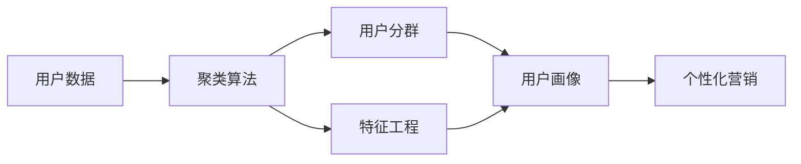

                 

# 如何进行有效的用户分群管理

> 关键词：用户分群管理, 数据分析, 聚类算法, 特征工程, 用户画像, 个性化营销

## 1. 背景介绍

在数字化时代，用户数据成为企业最宝贵的资产之一。如何高效管理和利用这些用户数据，成为提升企业竞争力的关键。用户分群管理，是指通过数据分析和机器学习技术，将用户按一定规则进行分组，实现精准的用户画像和个性化营销，提升用户转化率和忠诚度。本文将系统介绍用户分群管理的核心概念、算法原理和具体操作步骤，并结合实际案例进行详细讲解。

## 2. 核心概念与联系

### 2.1 核心概念概述

在进行用户分群管理时，我们需要了解以下核心概念：

- **用户分群（User Segmentation）**：指将用户按照一定的规则进行分组，使其具有一定的相似性，便于进行针对性的分析和营销。
- **用户画像（User Profile）**：指对用户的基本信息和行为数据进行收集和分析，构建出用户多维度的描述，用于精细化的用户分析和营销。
- **聚类算法（Clustering Algorithm）**：一种无监督学习算法，通过相似性度量将用户分成不同的组，常见的聚类算法包括K-means、层次聚类、DBSCAN等。
- **特征工程（Feature Engineering）**：指通过数据预处理、特征提取、特征选择等方法，构建高质量的输入数据，提升模型的预测效果。

这些核心概念构成了用户分群管理的框架，通过聚类算法进行用户分群，再结合特征工程对用户进行刻画，最终构建出用户画像，用于个性化的营销和分析。

### 2.2 核心概念原理和架构的 Mermaid 流程图



上述流程图展示了用户分群管理的整体架构：用户数据通过聚类算法分组，特征工程提升输入数据质量，最终构建出用户画像，用于个性化营销。

## 3. 核心算法原理 & 具体操作步骤

### 3.1 算法原理概述

用户分群管理的核心在于聚类算法。聚类算法通过度量用户之间的相似性，将相似的用户划分到同一组中。常见的聚类算法包括K-means、层次聚类、DBSCAN等。以下以K-means算法为例进行详细讲解。

K-means算法的基本思路是将数据点划分为K个不同的组，使得每个组内的数据点之间的相似度最大化，组间相似度最小化。K-means算法的核心是计算数据点与聚类中心的距离，并将数据点归为距离最近的聚类中心。算法的步骤如下：

1. 随机选择K个初始聚类中心。
2. 计算每个数据点与每个聚类中心的距离，并将数据点归为距离最近的聚类中心。
3. 计算每个聚类的中心点，并更新聚类中心。
4. 重复步骤2和3，直到聚类中心不再变化或达到预设的迭代次数。

### 3.2 算法步骤详解

以下以K-means算法为例，详细介绍用户分群管理的具体操作步骤：

1. **数据准备**：收集用户的各类数据，如基本信息、行为数据、交易数据等。并对数据进行清洗和预处理，去除缺失值、异常值等。

2. **特征选择**：根据业务需求和分析目的，选择合适的特征用于用户分群。常见的特征包括年龄、性别、职业、消费金额、访问频次等。

3. **聚类建模**：使用K-means算法对用户数据进行聚类。选择合适的K值，根据数据特性和业务需求进行迭代优化。

4. **用户分群**：根据聚类结果将用户划分为不同的群体，每个群体具有一定的相似性。

5. **用户画像**：对每个群体进行进一步分析，提取群体特征和行为模式，构建用户画像。

6. **个性化营销**：根据用户画像，进行个性化推荐、广告投放、活动促销等营销操作。

### 3.3 算法优缺点

K-means算法具有以下优点：

- 算法简单，易于实现。
- 可以处理大规模数据集，具有较高的计算效率。
- 能够发现数据的局部结构，适用于高维数据。

同时，K-means算法也存在以下缺点：

- 需要预先指定聚类数目K，对K的选择敏感。
- 对噪声和异常值较为敏感，可能导致聚类结果不准确。
- 对初始聚类中心的选择敏感，不同的初始点可能导致不同的聚类结果。

### 3.4 算法应用领域

用户分群管理在多个领域中具有广泛的应用，包括但不限于：

- **电子商务**：通过对用户行为和购买记录进行分群，提升个性化推荐和广告投放的精准度。
- **金融服务**：根据用户的财务状况和行为特征进行分群，提供个性化的理财和贷款服务。
- **健康医疗**：通过分析患者的医疗记录和生活习惯，进行疾病预测和健康管理。
- **媒体娱乐**：根据用户的观看记录和兴趣，进行内容推荐和广告投放。
- **智能交通**：通过分析用户的位置和出行行为，提供个性化的路线规划和出行建议。

这些应用领域展示了用户分群管理在提升用户体验和业务价值方面的巨大潜力。

## 4. 数学模型和公式 & 详细讲解 & 举例说明

### 4.1 数学模型构建

K-means算法通过计算数据点与聚类中心的距离进行聚类。假设用户数据集为 $D=\{x_1,x_2,...,x_n\}$，聚类数目为 $K$，初始聚类中心为 $\mu_1,\mu_2,...,\mu_K$。

K-means的目标是最小化每个数据点与其所属聚类中心的距离之和，即：

$$
\min_{\mu_1,...,\mu_K} \sum_{i=1}^n \min_{k=1,...,K} ||x_i - \mu_k||^2
$$

其中 $||...||$ 表示欧式距离。

### 4.2 公式推导过程

K-means算法的核心在于计算每个数据点与聚类中心的距离，并将数据点归为距离最近的聚类中心。公式推导过程如下：

1. **计算距离**：计算每个数据点 $x_i$ 到每个聚类中心 $\mu_k$ 的距离，得到距离矩阵 $D$。
2. **分配数据点**：将每个数据点 $x_i$ 归为距离最近的聚类中心，更新聚类分配矩阵 $Z$。
3. **更新聚类中心**：计算每个聚类的中心点，更新聚类中心 $\mu_k$。
4. **迭代优化**：重复计算距离、分配数据点和更新聚类中心的过程，直到聚类中心不再变化或达到预设的迭代次数。

### 4.3 案例分析与讲解

假设我们有一个电商平台的用户数据集，包含用户的基本信息、购买记录和行为数据。我们选择用户年龄、消费金额和购买频率作为聚类特征。

1. **数据准备**：对用户数据进行清洗和预处理，去除缺失值和异常值。

2. **特征选择**：选择用户年龄、消费金额和购买频率作为聚类特征。

3. **聚类建模**：使用K-means算法对用户数据进行聚类，选择合适的K值（如4），进行迭代优化。

4. **用户分群**：根据聚类结果将用户划分为四个群体，每个群体具有一定的相似性。

5. **用户画像**：对每个群体进行进一步分析，提取群体特征和行为模式，构建用户画像。

6. **个性化营销**：根据用户画像，进行个性化推荐、广告投放、活动促销等营销操作。

## 5. 项目实践：代码实例和详细解释说明

### 5.1 开发环境搭建

在进行用户分群管理实践时，我们需要准备好Python开发环境。以下是Python开发环境的搭建步骤：

1. 安装Python：从官网下载并安装Python，选择合适的版本，如3.8或3.9。
2. 安装必要的依赖包：使用pip安装必要的依赖包，如numpy、pandas、scikit-learn等。

### 5.2 源代码详细实现

以下是一个使用K-means算法进行用户分群的Python代码实现。

```python
import numpy as np
from sklearn.cluster import KMeans

# 用户数据集
data = np.array([[18, 500, 3], [25, 1000, 5], [30, 700, 4], [35, 900, 2], [40, 800, 1]])

# 特征选择
features = data[:, 0:2]

# 聚类建模
kmeans = KMeans(n_clusters=2)
kmeans.fit(features)

# 用户分群
labels = kmeans.labels_
data_with_labels = np.hstack((features, labels[:, np.newaxis]))

# 用户画像
for i in range(len(data_with_labels)):
    if labels[i] == 0:
        print(f"User {i+1} belongs to Cluster 0")
        # 提取Cluster 0的特征和行为模式
    else:
        print(f"User {i+1} belongs to Cluster 1")
        # 提取Cluster 1的特征和行为模式
```

### 5.3 代码解读与分析

以上代码实现了使用K-means算法进行用户分群的过程。

1. **数据准备**：定义用户数据集 `data`，包括用户年龄、消费金额和购买频率。
2. **特征选择**：选择用户年龄和消费金额作为聚类特征，构建特征矩阵 `features`。
3. **聚类建模**：使用K-means算法进行聚类建模，设置聚类数目为2。
4. **用户分群**：计算每个数据点与聚类中心的距离，并将数据点归为距离最近的聚类中心，得到聚类分配矩阵 `labels`。
5. **用户画像**：根据聚类分配矩阵，对每个用户进行分类，并提取每个群体的特征和行为模式。
6. **个性化营销**：根据用户画像，进行个性化推荐、广告投放等营销操作。

## 6. 实际应用场景

### 6.1 电子商务

电子商务平台可以通过用户分群管理，提升个性化推荐和广告投放的精准度。例如，对用户进行年龄、消费金额和购买频率等特征聚类，针对不同群体的用户进行个性化推荐，提升用户转化率和忠诚度。

### 6.2 金融服务

金融服务行业可以通过用户分群管理，提供个性化的理财和贷款服务。例如，对用户的财务状况和行为特征进行聚类，根据不同群体的用户需求，提供相应的理财方案和贷款产品。

### 6.3 健康医疗

健康医疗领域可以通过用户分群管理，进行疾病预测和健康管理。例如，分析患者的医疗记录和生活习惯，将患者分为不同的健康风险群体，提供个性化的健康管理建议。

### 6.4 未来应用展望

未来，用户分群管理将会在更多的领域中得到应用。以下是几个可能的应用场景：

- **智能交通**：通过分析用户的位置和出行行为，进行个性化的路线规划和出行建议。
- **媒体娱乐**：根据用户的观看记录和兴趣，进行内容推荐和广告投放。
- **智能制造**：通过分析用户的设备使用情况和维护记录，提供个性化的设备维护建议和预测性维护服务。
- **智慧能源**：通过分析用户的用电行为和设备状态，提供个性化的用电管理和节能建议。

## 7. 工具和资源推荐

### 7.1 学习资源推荐

为了帮助开发者系统掌握用户分群管理的理论和实践，以下是一些优质的学习资源：

1. 《Python机器学习》：通过系统的讲解，帮助开发者掌握数据预处理、特征工程、聚类算法等关键技术。
2. 《Data Science for Business》：介绍了数据科学在商业决策中的应用，包括用户分群管理的实际案例。
3. Coursera上的机器学习课程：提供了丰富的课程资源，涵盖机器学习、数据科学、大数据等多个领域。
4. Kaggle：提供丰富的数据集和竞赛项目，帮助开发者实践和提升自己的技能。
5. 《Hands-On Machine Learning with Scikit-Learn, Keras, and TensorFlow》：通过实际案例，帮助开发者掌握机器学习模型的构建和优化。

### 7.2 开发工具推荐

在进行用户分群管理实践时，需要使用一些开发工具。以下是几款常用的工具：

1. Python：Python是数据科学和机器学习领域的主流语言，具有丰富的数据处理和分析库。
2. Jupyter Notebook：提供交互式的数据分析和代码编写环境，便于开发者进行快速迭代和验证。
3. Scikit-Learn：提供了丰富的机器学习算法和数据预处理工具，支持K-means等聚类算法的实现。
4. Pandas：提供了高效的数据处理和分析工具，支持数据清洗和特征工程。
5. Numpy：提供了高效的数值计算工具，支持矩阵运算和数组操作。

### 7.3 相关论文推荐

以下是几篇与用户分群管理相关的经典论文，推荐阅读：

1. "K-means: algorithms for clustering multidimensional data"：K-means算法的经典论文，介绍了K-means算法的原理和实现。
2. "A Review of Clustering Techniques for Data Mining: Algorithms, Recent Advances and Applications"：综述了多种聚类算法，包括K-means、层次聚类、DBSCAN等。
3. "Customer Segmentation: An Empirical Comparison"：比较了多种聚类算法在客户分群管理中的应用效果。
4. "Data Mining Clustering Algorithms: A Survey"：综述了数据挖掘中的聚类算法，提供了丰富的算法实现和应用案例。

## 8. 总结：未来发展趋势与挑战

### 8.1 研究成果总结

本文系统介绍了用户分群管理的核心概念、算法原理和操作步骤，并通过实际案例进行了详细讲解。通过本文的学习，开发者可以掌握用户分群管理的理论基础和实践技巧，提升企业的用户运营和营销能力。

### 8.2 未来发展趋势

未来，用户分群管理将呈现以下几个发展趋势：

1. **自动化和智能化**：自动化用户分群管理工具将逐渐普及，智能化推荐系统将更加精准和高效。
2. **跨领域应用**：用户分群管理将扩展到更多领域，如智慧城市、智能制造、智慧能源等。
3. **多模态数据融合**：用户分群管理将结合多种数据模态，如文本、图像、音频等，提升分群结果的准确性和丰富性。
4. **实时数据处理**：用户分群管理将具备实时处理能力，能够快速响应用户的动态变化和行为。
5. **隐私保护**：用户分群管理将注重隐私保护，通过数据匿名化和差分隐私等技术，保障用户数据的安全性。

### 8.3 面临的挑战

尽管用户分群管理在提升业务价值方面具有巨大的潜力，但依然面临一些挑战：

1. **数据质量**：用户数据的缺失、噪声和异常值等问题，可能影响分群结果的准确性。
2. **算法选择**：选择合适的聚类算法和参数设置，需要丰富的经验和科学的方法。
3. **隐私保护**：用户分群管理需要处理大量的用户数据，如何保护用户隐私和数据安全，是一个重要问题。
4. **业务融合**：将用户分群管理与业务流程和营销策略进行有效融合，需要深入理解业务需求。
5. **技术更新**：随着技术的发展，用户分群管理的算法和工具也需要不断更新和优化。

### 8.4 研究展望

未来，用户分群管理的研究可以从以下几个方面进行探索：

1. **深度学习的应用**：引入深度学习技术，提升聚类算法的准确性和泛化能力。
2. **模型解释性**：开发更具有解释性的聚类算法，增强分群结果的可解释性。
3. **多任务学习**：将用户分群管理与推荐系统、情感分析等任务结合，提升整体性能。
4. **强化学习**：结合强化学习技术，优化用户分群管理的算法和策略。
5. **隐私保护**：研究隐私保护技术，提升用户分群管理的数据安全和隐私保护水平。

总之，用户分群管理作为数据分析和机器学习的重要应用，将在未来的商业决策和智能系统中扮演越来越重要的角色。通过不断优化算法和技术，提升数据质量和应用效果，用户分群管理必将在更多的领域中发挥重要作用。

## 9. 附录：常见问题与解答

**Q1：用户分群管理是否适用于所有业务场景？**

A: 用户分群管理适用于具有较大用户基数的业务场景，如电子商务、金融服务、健康医疗等。对于用户数量较少的小型企业，可能需要考虑其他用户画像构建方法。

**Q2：聚类算法的选择对分群结果有影响吗？**

A: 聚类算法的选择对分群结果有重要影响。不同的聚类算法具有不同的特点和优缺点，需要根据业务需求和数据特性进行选择。常见的聚类算法包括K-means、层次聚类、DBSCAN等，每种算法都有其适用的场景和限制。

**Q3：用户分群管理需要处理大量数据，如何提升计算效率？**

A: 为了提升计算效率，可以使用分布式计算和并行处理技术，如Spark、Hadoop等。同时，可以考虑对数据进行采样和降维，减少计算量和存储空间。

**Q4：用户分群管理如何保护用户隐私？**

A: 用户分群管理需要处理大量的用户数据，如何保护用户隐私和数据安全是一个重要问题。可以通过数据匿名化、差分隐私等技术，保护用户数据隐私。同时，需要对数据访问和使用进行严格的权限控制和管理。

**Q5：用户分群管理的应用效果如何评估？**

A: 用户分群管理的应用效果可以通过多个指标进行评估，如用户转化率、留存率、广告点击率等。同时，可以结合业务需求和目标，设定特定的评估指标，进行全面评估和优化。

通过本文的学习，相信读者可以系统掌握用户分群管理的核心概念、算法原理和操作步骤，并在实际项目中灵活应用，提升企业的用户运营和营销能力。

