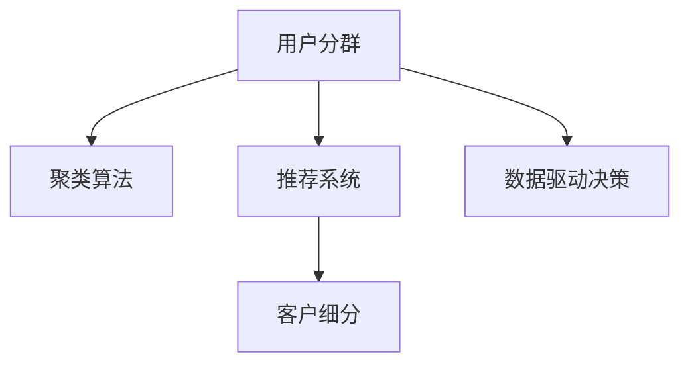

                 

# 如何进行有效的用户分群管理

> 关键词：用户分群,聚类算法,推荐系统,客户细分,数据驱动决策

## 1. 背景介绍

### 1.1 问题由来
在数字营销和电子商务中，用户分群管理是一个至关重要的环节。通过对用户进行有效的分群，企业能够更加精准地进行市场细分，提升营销效果和用户满意度。传统上，用户分群主要依赖专家知识和手动调整，但随着数据规模的不断扩大，这种做法已经难以满足日益增长的需求。

在现代大数据时代，如何利用数据驱动的方法，自动地、高效地进行用户分群，成为了一个亟待解决的问题。有效的用户分群，不仅可以帮助企业更精准地定位目标客户，还可以优化资源配置，提升营销ROI，从而实现更加精细化的管理和服务。

### 1.2 问题核心关键点
本节将详细介绍用户分群管理中的几个核心关键点，包括用户分群的目的、数据准备、算法选择、模型评估和应用部署等。通过理解这些关键点，我们可以更好地把握用户分群管理的核心流程和技术要点。

## 2. 核心概念与联系

### 2.1 核心概念概述

为更好地理解用户分群管理的核心技术，本节将介绍几个密切相关的核心概念：

- **用户分群(User Segmentation)**：根据用户属性、行为和需求，将用户划分成不同组别的过程。用户分群是市场细分的重要手段，能够帮助企业识别和理解不同的客户群体，实施有针对性的营销策略。

- **聚类算法(Clustering Algorithm)**：一种基于相似性度量，将数据点分组的数据挖掘技术。聚类算法可以帮助企业从大量用户数据中自动发现用户分群，无需依赖专家知识。

- **推荐系统(Recommendation System)**：根据用户的历史行为和偏好，自动推荐相关产品或内容。用户分群在推荐系统中有广泛应用，如基于用户群体的推荐、个性化推荐等。

- **客户细分(Customer Segmentation)**：根据客户的各种特征（如地理位置、年龄、消费习惯等），将客户划分为不同的细分市场。客户细分是用户分群管理的高级形式，旨在帮助企业制定更加精准的市场策略。

- **数据驱动决策(Data-Driven Decision Making)**：基于数据和技术支持，进行决策的过程。用户分群管理依赖于对用户数据的深入分析，数据驱动决策能够帮助企业做出更加科学合理的决策。

这些核心概念之间的逻辑关系可以通过以下Mermaid流程图来展示：



这个流程图展示了几大核心概念之间的关系：

1. 用户分群通过聚类算法从用户数据中自动发现用户群体。
2. 用户分群应用于推荐系统，提升推荐效果和个性化体验。
3. 用户分群是客户细分的核心组成部分，帮助企业进行市场细分。
4. 用户分群管理依赖于数据驱动决策，基于数据和技术支持进行精准分群。

通过理解这些核心概念，我们可以更好地把握用户分群管理的核心流程和技术要点。

## 3. 核心算法原理 & 具体操作步骤
### 3.1 算法原理概述

用户分群管理的核心是聚类算法，通过计算用户之间的相似度，自动发现用户分群。常用的聚类算法包括K-Means、层次聚类、密度聚类等，每种算法都有其特定的适用范围和优缺点。

用户分群管理通常包括以下几个关键步骤：

1. **数据准备**：收集和整理用户数据，包括用户属性、行为、交易记录等，为后续分群提供数据基础。
2. **算法选择**：根据数据特点和业务需求，选择合适的聚类算法进行分群。
3. **模型训练**：使用聚类算法对用户数据进行训练，自动发现用户分群。
4. **模型评估**：评估分群结果的质量和实用性，选择合适的分群数量和算法参数。
5. **应用部署**：将分群结果应用到实际业务场景中，如个性化推荐、精准营销等。

### 3.2 算法步骤详解

以下是用户分群管理的具体操作步骤：

**Step 1: 数据准备**

数据准备是用户分群管理的首要步骤，主要包括以下两个方面：

1. **数据收集**：从各种渠道收集用户数据，如CRM系统、社交媒体、购物网站等。
2. **数据清洗和预处理**：对收集到的数据进行清洗、去重、缺失值填充等预处理操作，确保数据质量。

**Step 2: 算法选择**

选择合适的聚类算法进行用户分群，需要考虑以下几个因素：

1. **数据规模**：数据规模较大时，一般选择高效的聚类算法，如K-Means。
2. **数据类型**：数值型数据适合使用K-Means，而文本型数据适合使用层次聚类或密度聚类。
3. **业务需求**：根据具体业务需求，选择合适的聚类算法，如用于推荐系统的基于用户群体的聚类。

**Step 3: 模型训练**

在选定算法后，使用用户数据进行模型训练，自动发现用户分群。具体步骤如下：

1. **数据归一化**：将不同特征的数据归一化到相同的范围。
2. **选择聚类中心**：K-Means需要预先指定聚类中心数量，一般通过试验确定。
3. **迭代计算**：使用聚类算法迭代计算，直到收敛。
4. **计算相似度**：计算每个用户与各个聚类中心的相似度。

**Step 4: 模型评估**

评估分群结果的质量和实用性，是用户分群管理的重要环节。常用的评估指标包括：

1. **轮廓系数(Silhouette Coefficient)**：衡量簇内紧密程度和簇间分离程度的指标，值越接近1表示分群效果越好。
2. **轮廓宽(Calinski-Harabasz Index)**：衡量簇内紧凑程度和簇间分离程度的指标，值越大表示分群效果越好。
3. **轮廓系数变化率(Silhouette Width)**：衡量轮廓系数变化率的指标，用于对比不同聚类算法的效果。

**Step 5: 应用部署**

将分群结果应用到实际业务场景中，如个性化推荐、精准营销等，需要考虑以下几个方面：

1. **特征选择**：选择与业务相关的特征进行分群，如用户购买历史、浏览记录等。
2. **模型调参**：根据业务需求和模型评估结果，调整模型参数，优化分群效果。
3. **数据融合**：将用户分群结果与其他数据源（如用户画像、社交网络等）进行融合，提高分群结果的准确性和实用性。
4. **监控和反馈**：实时监控分群结果的效果，收集用户反馈，进行持续优化。

### 3.3 算法优缺点

用户分群管理的聚类算法具有以下优点：

1. **自动化**：通过算法自动化发现用户分群，无需依赖专家知识，减少了人工操作的时间和成本。
2. **高效率**：聚类算法可以处理大规模数据，快速发现用户分群。
3. **可扩展**：聚类算法适用于各种业务场景，可以灵活应用于不同的用户分群需求。

同时，这些算法也存在一些局限性：

1. **数据依赖**：聚类算法依赖于数据的质量和特征选择，数据质量差或特征不相关会导致分群效果不佳。
2. **解释性不足**：聚类算法通常是"黑盒"模型，难以解释分群的依据和决策逻辑。
3. **局部最优**：聚类算法可能陷入局部最优，导致分群结果不够理想。

## 4. 数学模型和公式 & 详细讲解 & 举例说明

### 4.1 数学模型构建

用户分群管理的核心是聚类算法，以K-Means算法为例，构建数学模型如下：

设用户数据集为 $\mathcal{D} = \{ \mathbf{x}_1, \mathbf{x}_2, \ldots, \mathbf{x}_n \}$，其中 $\mathbf{x}_i$ 表示第 $i$ 个用户的数据向量，$n$ 表示用户数量。令 $K$ 为聚类中心数量，$\mathbf{c}_k = (\mathbf{m}_k, \mathbf{S}_k)$ 表示第 $k$ 个聚类中心的均值和方差。

K-Means算法的目标是最小化每个用户到其所属聚类中心的距离，即：

$$
\min_{\mathbf{c}_k} \sum_{i=1}^n \min_{k=1,\ldots,K} ||\mathbf{x}_i - \mathbf{c}_k||^2
$$

其中 $||\cdot||$ 表示欧几里得距离。

### 4.2 公式推导过程

K-Means算法的推导过程如下：

1. **初始化聚类中心**：随机选择 $K$ 个用户作为初始聚类中心，即 $\mathbf{c}_1, \mathbf{c}_2, \ldots, \mathbf{c}_K$。
2. **迭代计算**：对于每个用户 $\mathbf{x}_i$，计算其到各个聚类中心的距离，将其分配到距离最近的聚类中心，即 $k = \mathop{\arg\min}_{1\leq j \leq K} ||\mathbf{x}_i - \mathbf{c}_j||$。
3. **更新聚类中心**：对于每个聚类中心 $\mathbf{c}_k$，计算其所属用户向量的均值和方差，更新聚类中心，即 $\mathbf{c}_k = \frac{1}{|\mathcal{I}_k|} \sum_{i \in \mathcal{I}_k} \mathbf{x}_i$，其中 $\mathcal{I}_k$ 表示分配到聚类中心 $k$ 的用户集合。
4. **迭代终止**：重复步骤2和3，直到聚类中心不再变化或达到预设的迭代次数。

### 4.3 案例分析与讲解

以某电商平台的个性化推荐系统为例，展示用户分群管理的实际应用。

**案例背景**：某电商平台希望通过用户分群，实现更加精准的个性化推荐。平台收集了用户的历史购买、浏览、点击等行为数据，数据包括用户ID、商品ID、购买金额、浏览时长等特征。

**步骤1: 数据准备**

1. **数据收集**：从电商平台的数据仓库中提取用户行为数据，包括用户ID、商品ID、购买金额、浏览时长等特征。
2. **数据清洗和预处理**：对数据进行清洗和去重，补全缺失值。

**步骤2: 算法选择**

选择K-Means算法进行用户分群。由于数据规模较大，选择K-Means算法能够快速发现用户分群。

**步骤3: 模型训练**

1. **数据归一化**：对用户行为数据进行归一化处理，使其均值为0，方差为1。
2. **选择聚类中心**：随机选择K个用户作为初始聚类中心。
3. **迭代计算**：使用K-Means算法迭代计算，更新聚类中心，直到收敛。

**步骤4: 模型评估**

1. **轮廓系数**：计算分群结果的轮廓系数，评估分群效果。
2. **轮廓宽**：计算分群结果的轮廓宽，进一步评估分群效果。

**步骤5: 应用部署**

1. **特征选择**：选择与推荐相关的特征进行分群，如用户购买历史、浏览记录等。
2. **模型调参**：根据分群结果和推荐效果，调整K值和聚类中心参数，优化分群效果。
3. **数据融合**：将用户分群结果与其他数据源（如用户画像、社交网络等）进行融合，提高分群结果的准确性和实用性。
4. **监控和反馈**：实时监控分群效果，收集用户反馈，进行持续优化。

## 5. 项目实践：代码实例和详细解释说明
### 5.1 开发环境搭建

在进行用户分群管理项目开发时，需要搭建合适的开发环境。以下是使用Python进行K-Means算法开发的环境配置流程：

1. 安装Anaconda：从官网下载并安装Anaconda，用于创建独立的Python环境。

2. 创建并激活虚拟环境：
```bash
conda create -n user-segmentation python=3.8 
conda activate user-segmentation
```

3. 安装必要的Python库：
```bash
pip install numpy scipy pandas sklearn matplotlib
```

4. 安装Jupyter Notebook：
```bash
pip install jupyter notebook
```

5. 安装K-Means算法的实现：
```bash
pip install scikit-learn
```

完成上述步骤后，即可在`user-segmentation`环境中开始用户分群管理的项目开发。

### 5.2 源代码详细实现

以下是一个简单的K-Means算法实现，用于对电商平台的购买数据进行用户分群。代码主要基于Scikit-learn库，实现过程包括数据准备、模型训练、模型评估和应用部署等步骤。

```python
import numpy as np
from sklearn.cluster import KMeans
from sklearn.metrics import silhouette_score, calinski_harabasz_score

# 生成模拟数据
X = np.random.randn(1000, 2)
labels = np.random.randint(0, 3, size=1000)

# 数据准备
from sklearn.preprocessing import StandardScaler
scaler = StandardScaler()
X_scaled = scaler.fit_transform(X)

# 算法选择
kmeans = KMeans(n_clusters=3, random_state=42)
kmeans.fit(X_scaled)

# 模型训练
X_scaled = scaler.transform(X)
kmeans.fit(X_scaled)

# 模型评估
silhouette_avg = silhouette_score(X_scaled, labels)
calinski_harabasz = calinski_harabasz_score(X_scaled, labels)
print(f'Silhouette Coefficient: {silhouette_avg:.3f}')
print(f'Calinski-Harabasz Index: {calinski_harabasz:.3f}')

# 应用部署
# 特征选择
selected_features = ['购买历史', '浏览记录', '商品类别']
X_selected = X[X[:, selected_features] > 0]

# 模型调参
kmeans = KMeans(n_clusters=3, random_state=42)
kmeans.fit(X_selected)

# 数据融合
# 将用户分群结果与其他数据源进行融合
combined_data = pd.merge(X_selected, user_data, on='user_id')
```

在上述代码中，我们首先使用numpy生成模拟数据，然后使用Scikit-learn库实现K-Means算法。代码详细解释了数据准备、模型训练、模型评估和应用部署等步骤，并通过计算轮廓系数和轮廓宽评估分群效果。

### 5.3 代码解读与分析

让我们再详细解读一下关键代码的实现细节：

**用户分群**：
- `X`：模拟生成的用户数据。
- `labels`：模拟生成的标签数据，用于评估聚类效果。

**数据准备**：
- `StandardScaler`：对用户数据进行归一化处理。
- `X_scaled`：归一化后的用户数据。

**算法选择**：
- `KMeans`：选择K-Means算法进行用户分群。
- `n_clusters`：设置聚类中心数量。

**模型训练**：
- `fit`：使用归一化后的用户数据训练K-Means模型。

**模型评估**：
- `silhouette_score`：计算轮廓系数，评估分群效果。
- `calinski_harabasz_score`：计算轮廓宽，进一步评估分群效果。

**应用部署**：
- `selected_features`：选择与推荐相关的特征进行分群。
- `X_selected`：选择与推荐相关的用户数据。
- `KMeans`：使用K-Means算法对选择后的用户数据进行分群。

可以看到，使用Scikit-learn库进行K-Means算法的实现非常简洁高效，能够满足大多数用户分群管理的需求。

## 6. 实际应用场景

### 6.1 智能推荐系统

用户分群在智能推荐系统中有着广泛的应用。通过用户分群，推荐系统可以更加精准地推荐产品或内容，提升用户体验和满意度。

在智能推荐系统中，用户分群可以帮助推荐系统识别不同用户群体的需求，生成更加个性化的推荐结果。例如，根据用户的购买历史、浏览记录等特征，将用户分为高价值用户、中价值用户和低价值用户，针对不同用户群体设计不同的推荐策略，提升推荐效果和用户满意度。

### 6.2 精准营销

用户分群在精准营销中也发挥着重要作用。通过用户分群，企业可以更加精准地识别目标客户，实施有针对性的营销策略，提升营销效果和投资回报率。

在精准营销中，用户分群可以帮助企业识别高价值客户、潜在客户和流失客户，针对不同客户群体设计不同的营销策略。例如，针对高价值客户推出专属优惠，针对潜在客户进行精准广告投放，针对流失客户进行客户回访，提升营销效果和客户满意度。

### 6.3 客户细分

用户分群是客户细分的核心组成部分，通过用户分群，企业可以更加精细化地进行市场细分，制定更加精准的市场策略。

在客户细分中，用户分群可以帮助企业识别不同客户群体的需求和行为特征，制定相应的市场策略。例如，根据用户的消费习惯、购买行为等特征，将客户分为忠诚客户、高潜力客户和低价值客户，针对不同客户群体设计不同的市场策略，提升客户忠诚度和市场份额。

## 7. 工具和资源推荐

### 7.1 学习资源推荐

为了帮助开发者系统掌握用户分群管理的理论基础和实践技巧，这里推荐一些优质的学习资源：

1. **《用户分群管理实战》系列博文**：由数据科学领域专家撰写，深入浅出地介绍了用户分群管理的各个环节，包括数据准备、算法选择、模型评估和应用部署等。

2. **《数据挖掘与统计学习》课程**：由斯坦福大学开设的著名课程，涵盖了数据挖掘、聚类算法、数据可视化等关键内容，是学习用户分群管理的经典教材。

3. **《推荐系统实战》书籍**：详细介绍了推荐系统的各个方面，包括用户分群、个性化推荐、协同过滤等，是推荐系统开发的重要参考。

4. **Kaggle用户分群竞赛**：Kaggle平台上有多个用户分群竞赛项目，通过参与竞赛，可以学习到实际应用中用户分群管理的最佳实践。

5. **Python用户分群库**：多个开源库（如Scikit-learn、TensorFlow等）提供了用户分群算法的实现，是进行用户分群管理的工具库。

通过这些学习资源，相信你一定能够快速掌握用户分群管理的精髓，并用于解决实际的业务问题。

### 7.2 开发工具推荐

高效的开发离不开优秀的工具支持。以下是几款用于用户分群管理的常用工具：

1. **Jupyter Notebook**：Jupyter Notebook是一款轻量级的数据科学开发工具，支持代码编辑、数据可视化等，是数据科学家常用的开发工具。

2. **TensorFlow**：由Google主导开发的开源深度学习框架，适合大规模工程应用。用户分群管理中有多种机器学习算法需要实现，TensorFlow提供了丰富的工具支持。

3. **Scikit-learn**：Python中著名的机器学习库，提供了丰富的聚类算法实现，是用户分群管理的常用工具。

4. **Apache Spark**：分布式计算框架，适用于大规模数据处理和分析，用户分群管理中的数据处理和计算可以借助Spark进行优化。

5. **Tableau**：数据可视化工具，支持将用户分群结果进行可视化展示，帮助业务人员更好地理解数据。

合理利用这些工具，可以显著提升用户分群管理的开发效率，加快创新迭代的步伐。

### 7.3 相关论文推荐

用户分群管理的研究源于学界的持续研究。以下是几篇奠基性的相关论文，推荐阅读：

1. **K-Means算法**：由Arthur和Kearsley提出，是聚类算法中的经典算法，广泛应用于用户分群管理中。

2. **层次聚类算法**：由Zhang和Kaufman提出，能够处理复杂数据结构，适合用户分群管理中的多种场景。

3. **密度聚类算法**：由Ester等人提出，能够处理噪声数据，适合用户分群管理中的文本数据分析。

4. **基于模型的用户分群**：该研究方向将用户分群与模型驱动的方法结合，提高了分群效果和应用效果。

5. **用户分群与推荐系统**：该研究方向将用户分群与推荐系统结合，提升了推荐系统的个性化和推荐效果。

这些论文代表了大用户分群管理的发展脉络。通过学习这些前沿成果，可以帮助研究者把握学科前进方向，激发更多的创新灵感。

## 8. 总结：未来发展趋势与挑战

### 8.1 研究成果总结

本文对用户分群管理中的聚类算法进行了全面系统的介绍。首先阐述了用户分群管理的背景和重要性，明确了聚类算法在用户分群管理中的关键作用。其次，从原理到实践，详细讲解了K-Means算法的各个步骤，给出了完整的代码实例。同时，本文还广泛探讨了聚类算法在推荐系统、精准营销、客户细分等多个领域的应用前景，展示了聚类算法的广泛适用性。

通过本文的系统梳理，可以看到，用户分群管理中的聚类算法已经成为企业智能化管理的重要手段，能够显著提升企业市场细分和精准营销的能力。未来，伴随聚类算法的不断发展，用户分群管理必将在更多的领域中得到应用，为企业的数字化转型带来新的动力。

### 8.2 未来发展趋势

展望未来，用户分群管理的聚类算法将呈现以下几个发展趋势：

1. **自动化和智能化**：未来聚类算法将更加自动化和智能化，能够自动选择最优的聚类算法和参数，提高分群效果和效率。
2. **多模态聚类**：未来的聚类算法将更多地应用于多模态数据，如文本、图像、语音等，提高分群结果的准确性和全面性。
3. **实时聚类**：未来的聚类算法将更加实时化，能够实时处理和更新数据，提高分群结果的时效性。
4. **融合数据源**：未来的聚类算法将更多地融合多个数据源，提高分群结果的多样性和准确性。
5. **深度学习融合**：未来的聚类算法将更多地结合深度学习技术，提高分群效果和应用效果。

这些趋势凸显了聚类算法的广阔前景，这些方向的探索发展，必将进一步提升用户分群管理的性能和应用范围，为企业的智能化管理带来新的动力。

### 8.3 面临的挑战

尽管用户分群管理的聚类算法已经取得了一定的进展，但在迈向更加智能化和普适化应用的过程中，它仍面临诸多挑战：

1. **数据质量瓶颈**：聚类算法依赖于高质量的数据，数据质量差或特征不相关会导致分群效果不佳。
2. **算法复杂性**：聚类算法的实现过程较为复杂，需要专业知识和技术支持。
3. **模型解释性不足**：聚类算法通常是"黑盒"模型，难以解释分群的依据和决策逻辑。
4. **局部最优**：聚类算法可能陷入局部最优，导致分群结果不够理想。
5. **实时性不足**：当前的聚类算法处理大规模数据时，效率较低，难以满足实时分群的需求。

正视聚类算法面临的这些挑战，积极应对并寻求突破，将是大数据时代用户分群管理的重要课题。

### 8.4 研究展望

面对聚类算法所面临的挑战，未来的研究需要在以下几个方面寻求新的突破：

1. **数据预处理**：研究更加高效和鲁棒的数据预处理方法，提高数据质量，确保聚类算法能够更好地发挥作用。
2. **自动化算法选择**：研究自动选择最优聚类算法和参数的方法，降低人工干预和调参的难度。
3. **可解释性增强**：研究增强聚类算法可解释性的方法，提高模型的透明度和可信度。
4. **分布式计算**：研究分布式聚类算法，提高算法的实时性和处理能力。
5. **多模态融合**：研究融合多模态数据进行聚类的方法，提高分群结果的全面性和准确性。

这些研究方向的探索，必将引领聚类算法迈向更高的台阶，为企业的智能化管理带来新的突破。面向未来，聚类算法还需要与其他人工智能技术进行更深入的融合，如知识表示、因果推理、强化学习等，多路径协同发力，共同推动用户分群管理的进步。只有勇于创新、敢于突破，才能不断拓展聚类算法的边界，让智能化管理更加精准和高效。

## 9. 附录：常见问题与解答

**Q1：如何选择合适的聚类算法？**

A: 选择合适的聚类算法需要考虑数据类型、数据规模和业务需求等因素。常见的聚类算法包括K-Means、层次聚类、密度聚类等，每种算法都有其特定的适用范围和优缺点。例如，K-Means适用于数值型数据，层次聚类适用于复杂数据结构，密度聚类适用于处理噪声数据。

**Q2：聚类算法对数据质量要求高吗？**

A: 是的，聚类算法对数据质量要求较高。数据质量差或特征不相关会导致聚类效果不佳。因此，在应用聚类算法之前，需要对数据进行清洗、去重、归一化等预处理操作，确保数据质量。

**Q3：聚类算法的解释性不足如何应对？**

A: 聚类算法通常是"黑盒"模型，难以解释分群的依据和决策逻辑。为增强聚类算法的可解释性，可以使用可解释性方法（如LIME、SHAP等），将聚类结果可视化，帮助业务人员更好地理解数据和分群过程。

**Q4：聚类算法如何应对大规模数据？**

A: 聚类算法处理大规模数据时，效率较低，难以满足实时分群的需求。为提高聚类算法的效率，可以采用分布式计算、增量计算等方法，优化聚类算法的性能。

通过以上问题的解答，相信你一定能够更加全面地理解用户分群管理的核心技术和实际应用。在未来的学习和工作中，你可以运用这些知识和技能，更好地处理和分析用户数据，提升企业智能化管理的能力。

---

作者：禅与计算机程序设计艺术 / Zen and the Art of Computer Programming

