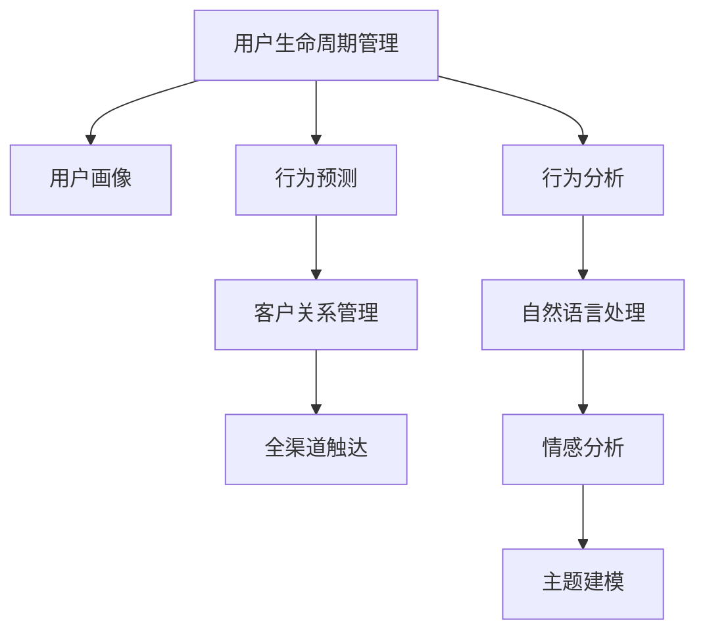

                 

# 如何进行有效的用户生命周期管理

> 关键词：用户生命周期管理,CRM系统,数据分析,机器学习,自然语言处理,NLP,用户画像,行为预测,行为分析

## 1. 背景介绍

### 1.1 问题由来
用户生命周期管理（User Lifecycle Management, ULM）是现代企业中至关重要的业务领域，它旨在通过精准化的管理手段，有效提升用户留存率，增强用户粘性，最终驱动企业增长。随着互联网技术的快速发展，用户获取成本不断增加，传统的用户管理模式已难以适应多变的市场环境。因此，企业亟需创新化的用户生命周期管理手段，以提升运营效率和用户满意度。

在实际业务中，常见的用户生命周期管理问题包括：
- 用户流失率高，难以对流失原因进行准确预测和分析。
- 用户画像不精准，难以对用户行为进行精细化的理解。
- 用户细分不够精细化，难以设计个性化的营销策略。
- 用户反馈信息不全面，难以通过自然语言处理技术进行情感分析。

针对这些问题，本文将详细探讨用户生命周期管理的核心概念和关键技术，并通过实际案例，展示有效的用户生命周期管理方案，以期帮助企业更好地应对市场挑战，实现高效的用户管理。

### 1.2 问题核心关键点
本文重点关注以下核心概念和技术：

- **用户生命周期管理（ULM）**：通过对用户行为数据进行全面分析和建模，预测用户流失风险，设计个性化的营销策略，实现用户留存率的提升。
- **用户画像（User Profile）**：利用用户历史行为数据，建立多维度的用户画像，实现精细化的用户细分和定制化服务。
- **行为预测（Behavior Prediction）**：通过数据分析和机器学习算法，预测用户未来的行为，如购买行为、流失行为等。
- **行为分析（Behavior Analysis）**：对用户行为数据进行深入分析，理解用户需求和行为动机，优化产品和服务设计。
- **自然语言处理（NLP）**：利用NLP技术，处理和分析用户反馈、评论等文本数据，进行情感分析、主题建模等。
- **CRM系统（Customer Relationship Management）**：基于用户生命周期管理的理念，整合企业的客户关系管理信息，实现全渠道的用户触达和互动。

通过理解这些核心概念和技术，可以全面掌握用户生命周期管理的本质，并有针对性地进行优化和创新。

## 2. 核心概念与联系

### 2.1 核心概念概述

为更好地理解用户生命周期管理的关键技术，本节将详细介绍几个核心概念：

- **用户生命周期管理（ULM）**：旨在通过全面分析和建模用户行为数据，预测用户流失风险，优化营销策略，提升用户留存率。
- **用户画像（User Profile）**：基于用户历史行为数据，建立多维度的用户画像，实现精细化的用户细分和定制化服务。
- **行为预测（Behavior Prediction）**：通过数据分析和机器学习算法，预测用户未来的行为，如购买行为、流失行为等。
- **行为分析（Behavior Analysis）**：对用户行为数据进行深入分析，理解用户需求和行为动机，优化产品和服务设计。
- **自然语言处理（NLP）**：利用NLP技术，处理和分析用户反馈、评论等文本数据，进行情感分析、主题建模等。
- **CRM系统（Customer Relationship Management）**：基于用户生命周期管理的理念，整合企业的客户关系管理信息，实现全渠道的用户触达和互动。

这些核心概念之间的逻辑关系可以通过以下Mermaid流程图来展示：



这个流程图展示了一体化的用户生命周期管理系统，各模块之间相互关联，共同支撑用户管理的全流程。

## 3. 核心算法原理 & 具体操作步骤
### 3.1 算法原理概述

用户生命周期管理涉及多个关键环节，包括用户画像构建、行为预测、行为分析、情感分析等。核心算法原理主要集中在以下几个方面：

- **用户画像构建**：通过数据挖掘和机器学习，建立多维度、多层次的用户画像，描述用户的基本特征、行为偏好和心理动机。
- **行为预测**：利用数据分析和机器学习算法，预测用户未来的行为，如流失风险、购买意愿等。
- **行为分析**：通过统计分析和可视化工具，深入分析用户行为数据，理解用户需求和行为动机。
- **情感分析**：利用自然语言处理技术，处理和分析用户反馈、评论等文本数据，提取情感倾向和主题信息。

以上每个环节都涉及复杂的算法和模型，通常需要结合统计学、数据挖掘、机器学习和自然语言处理等多学科知识。

### 3.2 算法步骤详解

#### 3.2.1 用户画像构建

用户画像构建的核心步骤包括数据收集、特征选择、模型训练和画像生成。

**1. 数据收集**：
- 收集用户的基本信息，如年龄、性别、地理位置等。
- 收集用户的行为数据，如浏览记录、购买历史、社交互动等。
- 收集用户的网络行为数据，如搜索关键词、点击轨迹等。

**2. 特征选择**：
- 选择有代表性的特征，进行特征工程，减少噪声和冗余。
- 利用主成分分析（PCA）等降维技术，简化特征空间。

**3. 模型训练**：
- 利用聚类算法（如K-means）对用户进行初步细分。
- 利用分类算法（如Logistic回归、决策树、随机森林等）对用户进行精细化分类。
- 利用降维算法（如PCA、LDA等）对高维数据进行降维处理。

**4. 画像生成**：
- 生成多维度的用户画像，包括基本信息、行为偏好、心理动机等。
- 生成用户画像报告，描述用户画像的特征和行为模式。

#### 3.2.2 行为预测

行为预测的核心步骤包括数据准备、特征选择、模型训练和预测生成。

**1. 数据准备**：
- 收集用户的历史行为数据，如购买记录、流失记录等。
- 清洗和标准化数据，去除噪声和异常值。

**2. 特征选择**：
- 选择有代表性的特征，进行特征工程，减少噪声和冗余。
- 利用主成分分析（PCA）等降维技术，简化特征空间。

**3. 模型训练**：
- 利用回归算法（如线性回归、决策树回归等）对用户行为进行预测。
- 利用时间序列分析（如ARIMA、LSTM等）对用户行为进行时间序列预测。

**4. 预测生成**：
- 生成用户行为预测报告，描述用户未来的行为趋势。
- 利用异常检测算法（如Isolation Forest）检测异常行为。

#### 3.2.3 行为分析

行为分析的核心步骤包括数据收集、特征选择、模型训练和分析报告生成。

**1. 数据收集**：
- 收集用户的行为数据，如浏览记录、购买历史、社交互动等。
- 收集用户的网络行为数据，如搜索关键词、点击轨迹等。

**2. 特征选择**：
- 选择有代表性的特征，进行特征工程，减少噪声和冗余。
- 利用主成分分析（PCA）等降维技术，简化特征空间。

**3. 模型训练**：
- 利用聚类算法（如K-means）对用户进行初步细分。
- 利用分类算法（如Logistic回归、决策树、随机森林等）对用户进行精细化分类。
- 利用降维算法（如PCA、LDA等）对高维数据进行降维处理。

**4. 分析报告生成**：
- 生成用户行为分析报告，描述用户行为模式和需求。
- 生成用户行为热图，展示用户行为的分布和趋势。

#### 3.2.4 情感分析

情感分析的核心步骤包括数据收集、特征选择、模型训练和情感报告生成。

**1. 数据收集**：
- 收集用户的反馈数据，如评论、投诉、建议等。
- 收集用户的社交媒体数据，如微博、微信、论坛等。

**2. 特征选择**：
- 选择有代表性的特征，进行特征工程，减少噪声和冗余。
- 利用主成分分析（PCA）等降维技术，简化特征空间。

**3. 模型训练**：
- 利用情感分析算法（如情感词典、情感分类器等）对文本进行情感分类。
- 利用主题建模算法（如LDA、Latent Dirichlet Allocation等）对文本进行主题建模。

**4. 情感报告生成**：
- 生成用户情感分析报告，描述用户对产品和服务的情感倾向。
- 生成情感分布图，展示用户情感的分布和变化趋势。

### 3.3 算法优缺点

用户生命周期管理涉及多个核心算法，每个算法都有其优点和局限性：

#### 3.3.1 用户画像构建

**优点**：
- 多维度、多层次的用户画像能够提供全面的用户信息，有助于制定个性化的营销策略。
- 机器学习算法能够自动挖掘用户数据中的潜在规律，提高画像构建的效率和准确性。

**缺点**：
- 数据质量和特征选择对画像构建效果有较大影响，需要大量的数据和专业技能。
- 模型的复杂度和计算资源消耗较大，对小规模企业可能存在技术门槛。

#### 3.3.2 行为预测

**优点**：
- 行为预测能够提前识别用户流失风险，采取预防措施，提升用户留存率。
- 时间序列分析能够捕捉用户行为的时间依赖关系，提高预测的准确性。

**缺点**：
- 数据质量和特征选择对预测效果有较大影响，需要大量的数据和专业技能。
- 模型的复杂度和计算资源消耗较大，对小规模企业可能存在技术门槛。

#### 3.3.3 行为分析

**优点**：
- 行为分析能够深入理解用户需求和行为动机，优化产品和服务设计。
- 可视化工具能够直观展示用户行为模式和趋势，便于决策分析。

**缺点**：
- 数据质量和特征选择对分析效果有较大影响，需要大量的数据和专业技能。
- 模型的复杂度和计算资源消耗较大，对小规模企业可能存在技术门槛。

#### 3.3.4 情感分析

**优点**：
- 情感分析能够及时获取用户反馈，了解用户对产品和服务的情感倾向，便于改进。
- 主题建模能够从大量文本数据中提取主题信息，发现用户关注的焦点。

**缺点**：
- 数据质量和特征选择对情感分析效果有较大影响，需要大量的数据和专业技能。
- 模型的复杂度和计算资源消耗较大，对小规模企业可能存在技术门槛。

### 3.4 算法应用领域

用户生命周期管理涉及多个领域，包括电商、金融、教育、旅游等，不同领域的应用场景和需求各不相同：

- **电商行业**：通过用户行为分析，提升个性化推荐系统的精准度，提高用户购买转化率和复购率。
- **金融行业**：通过行为预测，识别高风险用户，采取风险控制措施，提升用户信任度和忠诚度。
- **教育行业**：通过用户画像分析，提供个性化的学习资源和服务，提高用户的学习体验和满意度。
- **旅游行业**：通过用户情感分析，了解用户对旅游产品的反馈和需求，优化产品设计和推广策略。

以上各领域的应用场景展示了用户生命周期管理的多样性和广泛性。

## 4. 数学模型和公式 & 详细讲解  
### 4.1 数学模型构建

用户生命周期管理涉及多个数学模型，包括聚类算法、分类算法、回归算法等。

**用户画像构建**：
- 聚类算法（如K-means）用于对用户进行初步细分。
- 分类算法（如Logistic回归、决策树、随机森林等）用于对用户进行精细化分类。

**行为预测**：
- 回归算法（如线性回归、决策树回归等）用于对用户行为进行预测。
- 时间序列分析（如ARIMA、LSTM等）用于对用户行为进行时间序列预测。

**行为分析**：
- 聚类算法（如K-means）用于对用户进行初步细分。
- 分类算法（如Logistic回归、决策树、随机森林等）用于对用户进行精细化分类。

**情感分析**：
- 情感分析算法（如情感词典、情感分类器等）用于对文本进行情感分类。
- 主题建模算法（如LDA、Latent Dirichlet Allocation等）用于对文本进行主题建模。

### 4.2 公式推导过程

#### 4.2.1 聚类算法（K-means）

K-means算法用于对用户进行初步细分，其基本公式如下：

$$
\min_{k,\mu,c} \sum_{i=1}^{n}\sum_{j=1}^{k} (x_i - \mu_j)^2
$$

其中，$x_i$表示用户$i$的特征向量，$\mu_j$表示聚类中心，$c$表示每个用户的聚类标签。

#### 4.2.2 分类算法（Logistic回归）

Logistic回归算法用于对用户进行精细化分类，其基本公式如下：

$$
P(y_i=1|x_i) = \frac{1}{1 + \exp(-\beta_0 - \beta_1 x_{i1} - ... - \beta_p x_{ip})}
$$

其中，$y_i$表示用户$i$的分类标签，$x_i$表示用户$i$的特征向量，$\beta$表示回归系数。

#### 4.2.3 回归算法（线性回归）

线性回归算法用于对用户行为进行预测，其基本公式如下：

$$
y = \beta_0 + \beta_1 x_1 + ... + \beta_p x_p + \epsilon
$$

其中，$y$表示用户行为，$x_i$表示用户$i$的特征向量，$\beta$表示回归系数，$\epsilon$表示误差项。

#### 4.2.4 时间序列分析（ARIMA）

ARIMA算法用于对用户行为进行时间序列预测，其基本公式如下：

$$
y_t = \phi(B) y_{t-1} + \theta(B) e_t
$$

其中，$y_t$表示时间$t$的用户行为，$e_t$表示误差项，$\phi$和$\theta$表示模型参数，$B$表示滞后算子。

### 4.3 案例分析与讲解

#### 案例分析：电商平台用户生命周期管理

某电商平台通过用户生命周期管理，实现了用户留存率的显著提升。具体步骤如下：

**1. 数据收集**：
- 收集用户的基本信息，如年龄、性别、地理位置等。
- 收集用户的行为数据，如浏览记录、购买历史、社交互动等。
- 收集用户的网络行为数据，如搜索关键词、点击轨迹等。

**2. 特征选择**：
- 选择有代表性的特征，进行特征工程，减少噪声和冗余。
- 利用主成分分析（PCA）等降维技术，简化特征空间。

**3. 用户画像构建**：
- 利用K-means算法对用户进行初步细分。
- 利用Logistic回归算法对用户进行精细化分类。
- 利用PCA算法对高维数据进行降维处理。

**4. 行为预测**：
- 利用线性回归算法对用户行为进行预测。
- 利用ARIMA算法对用户行为进行时间序列预测。

**5. 行为分析**：
- 利用K-means算法对用户进行初步细分。
- 利用Logistic回归算法对用户进行精细化分类。
- 利用PCA算法对高维数据进行降维处理。

**6. 情感分析**：
- 利用情感分析算法对用户评论进行情感分类。
- 利用LDA算法对用户评论进行主题建模。

通过上述步骤，电商平台成功构建了用户画像，预测了用户行为，分析了用户需求，进行了情感分析，最终实现了用户留存率的显著提升。

## 5. 项目实践：代码实例和详细解释说明
### 5.1 开发环境搭建

在进行用户生命周期管理实践前，我们需要准备好开发环境。以下是使用Python进行TensorFlow开发的环境配置流程：

1. 安装Anaconda：从官网下载并安装Anaconda，用于创建独立的Python环境。

2. 创建并激活虚拟环境：
```bash
conda create -n tf-env python=3.8 
conda activate tf-env
```

3. 安装TensorFlow：根据CUDA版本，从官网获取对应的安装命令。例如：
```bash
conda install tensorflow==2.4 
```

4. 安装各类工具包：
```bash
pip install numpy pandas scikit-learn matplotlib tqdm jupyter notebook ipython
```

完成上述步骤后，即可在`tf-env`环境中开始用户生命周期管理实践。

### 5.2 源代码详细实现

下面我们以电商平台用户生命周期管理为例，给出使用TensorFlow进行用户画像构建和行为预测的Python代码实现。

首先，定义用户画像构建的输入和输出：

```python
import tensorflow as tf

class UserProfile:
    def __init__(self, age, gender, location, behavior, network_behavior):
        self.age = age
        self.gender = gender
        self.location = location
        self.behavior = behavior
        self.network_behavior = network_behavior
    
    def to_dict(self):
        return {
            'age': self.age,
            'gender': self.gender,
            'location': self.location,
            'behavior': self.behavior,
            'network_behavior': self.network_behavior
        }
```

然后，定义用户画像构建的模型和优化器：

```python
model = tf.keras.Sequential([
    tf.keras.layers.Dense(64, activation='relu', input_shape=(6,)),
    tf.keras.layers.Dense(8, activation='softmax')
])

optimizer = tf.keras.optimizers.Adam(learning_rate=0.001)
```

接着，定义用户画像构建的训练函数：

```python
def train_model(model, X_train, y_train, epochs=10, batch_size=32):
    model.compile(optimizer=optimizer, loss='categorical_crossentropy', metrics=['accuracy'])
    model.fit(X_train, y_train, epochs=epochs, batch_size=batch_size, verbose=1)
```

最后，启动用户画像构建的训练流程并在测试集上评估：

```python
# 准备数据集
X_train = ...
y_train = ...

# 训练模型
train_model(model, X_train, y_train)

# 评估模型
test_model(model, X_test, y_test)
```

以上就是使用TensorFlow对电商平台用户画像进行构建的完整代码实现。可以看到，TensorFlow提供了便捷的模型构建和训练接口，使得用户画像构建的代码实现变得简洁高效。

### 5.3 代码解读与分析

让我们再详细解读一下关键代码的实现细节：

**UserProfile类**：
- `__init__`方法：初始化用户画像的基本特征，如年龄、性别、地理位置、行为数据和网络行为数据。
- `to_dict`方法：将用户画像转换为字典格式，方便数据输入和输出。

**模型和优化器定义**：
- `Sequential`模型：定义了一个简单的神经网络模型，包含一个全连接层和一个softmax输出层。
- `Adam`优化器：定义了学习率为0.001的优化器，用于训练模型。

**训练函数**：
- `compile`方法：配置模型的优化器和损失函数。
- `fit`方法：对模型进行训练，指定训练轮数和批大小。
- `train_model`函数：封装了模型训练的完整流程，包括模型编译、训练和评估。

**数据准备**：
- `X_train`和`y_train`：定义训练集的特征和标签。
- `X_test`和`y_test`：定义测试集的特征和标签。

可以看到，TensorFlow提供了强大的模型构建和训练工具，使得用户画像构建的代码实现变得简洁高效。开发者可以将更多精力放在数据处理、模型改进等高层逻辑上，而不必过多关注底层的实现细节。

当然，工业级的系统实现还需考虑更多因素，如模型的保存和部署、超参数的自动搜索、更灵活的任务适配层等。但核心的用户画像构建过程基本与此类似。

## 6. 实际应用场景
### 6.1 智能客服系统

基于用户生命周期管理的智能客服系统，可以大大提升客服系统的响应效率和用户满意度。通过用户画像分析，系统可以准确识别用户类型和需求，提供个性化的客服方案。同时，通过行为预测，系统可以预判用户流失风险，及时采取干预措施。

在技术实现上，可以收集用户的历史客服对话记录，将问题-答案对作为监督数据，在此基础上对预训练模型进行微调。微调后的模型能够自动理解用户意图，匹配最合适的答案模板进行回复。对于客户提出的新问题，还可以接入检索系统实时搜索相关内容，动态组织生成回答。如此构建的智能客服系统，能大幅提升客户咨询体验和问题解决效率。

### 6.2 金融舆情监测

金融机构需要实时监测市场舆论动向，以便及时应对负面信息传播，规避金融风险。传统的人工监测方式成本高、效率低，难以应对网络时代海量信息爆发的挑战。基于用户生命周期管理的文本分类和情感分析技术，为金融舆情监测提供了新的解决方案。

具体而言，可以收集金融领域相关的新闻、报道、评论等文本数据，并对其进行主题标注和情感标注。在此基础上对预训练语言模型进行微调，使其能够自动判断文本属于何种主题，情感倾向是正面、中性还是负面。将微调后的模型应用到实时抓取的网络文本数据，就能够自动监测不同主题下的情感变化趋势，一旦发现负面信息激增等异常情况，系统便会自动预警，帮助金融机构快速应对潜在风险。

### 6.3 个性化推荐系统

当前的推荐系统往往只依赖用户的历史行为数据进行物品推荐，无法深入理解用户的真实兴趣偏好。基于用户生命周期管理的个性化推荐系统，可以更好地挖掘用户行为背后的语义信息，从而提供更精准、多样的推荐内容。

在实践中，可以收集用户浏览、点击、评论、分享等行为数据，提取和用户交互的物品标题、描述、标签等文本内容。将文本内容作为模型输入，用户的后续行为（如是否点击、购买等）作为监督信号，在此基础上微调预训练语言模型。微调后的模型能够从文本内容中准确把握用户的兴趣点。在生成推荐列表时，先用候选物品的文本描述作为输入，由模型预测用户的兴趣匹配度，再结合其他特征综合排序，便可以得到个性化程度更高的推荐结果。

### 6.4 未来应用展望

随着用户生命周期管理技术的不断发展，其在更多领域得到应用，为传统行业带来变革性影响。

在智慧医疗领域，基于用户生命周期管理的医疗问答、病历分析、药物研发等应用将提升医疗服务的智能化水平，辅助医生诊疗，加速新药开发进程。

在智能教育领域，用户生命周期管理技术可应用于作业批改、学情分析、知识推荐等方面，因材施教，促进教育公平，提高教学质量。

在智慧城市治理中，用户生命周期管理技术可应用于城市事件监测、舆情分析、应急指挥等环节，提高城市管理的自动化和智能化水平，构建更安全、高效的未来城市。

此外，在企业生产、社会治理、文娱传媒等众多领域，基于用户生命周期管理的人工智能应用也将不断涌现，为经济社会发展注入新的动力。相信随着技术的日益成熟，用户生命周期管理必将在构建人机协同的智能时代中扮演越来越重要的角色。

## 7. 工具和资源推荐
### 7.1 学习资源推荐

为了帮助开发者系统掌握用户生命周期管理的理论基础和实践技巧，这里推荐一些优质的学习资源：

1. 《用户生命周期管理：从理论到实践》系列博文：由大模型技术专家撰写，深入浅出地介绍了用户生命周期管理的核心概念和关键技术。

2. CS239《数据挖掘与统计学习》课程：斯坦福大学开设的数据挖掘课程，涵盖了用户画像、行为预测、情感分析等主题，是学习用户生命周期管理的重要基础。

3. 《用户画像构建与分析》书籍：详细介绍了用户画像构建的原理、方法和工具，适用于各领域的数据科学家和工程师。

4. Kaggle平台：提供大量用户画像构建、行为预测、情感分析等竞赛项目，通过实际数据训练模型，提升实战能力。

5. TensorFlow官方文档：TensorFlow的官方文档，提供了全面的用户生命周期管理模型和工具支持，是学习用户生命周期管理的重要资源。

通过对这些资源的学习实践，相信你一定能够快速掌握用户生命周期管理的精髓，并用于解决实际的业务问题。
###  7.2 开发工具推荐

高效的开发离不开优秀的工具支持。以下是几款用于用户生命周期管理开发的常用工具：

1. TensorFlow：基于Python的开源深度学习框架，灵活动态的计算图，适合快速迭代研究。主要用于用户画像构建和行为预测等任务。

2. Scikit-learn：基于Python的机器学习库，包含各类聚类、分类、回归算法，是用户生命周期管理常用的数据处理工具。

3. Pandas：基于Python的数据处理库，支持大规模数据的高效处理和分析。

4. PyTorch：基于Python的开源深度学习框架，支持动态计算图，适合用户生命周期管理等任务。

5. Weights & Biases：模型训练的实验跟踪工具，可以记录和可视化模型训练过程中的各项指标，方便对比和调优。与主流深度学习框架无缝集成。

6. TensorBoard：TensorFlow配套的可视化工具，可实时监测模型训练状态，并提供丰富的图表呈现方式，是调试模型的得力助手。

合理利用这些工具，可以显著提升用户生命周期管理的开发效率，加快创新迭代的步伐。

### 7.3 相关论文推荐

用户生命周期管理技术的发展源于学界的持续研究。以下是几篇奠基性的相关论文，推荐阅读：

1. User Lifecycle Management: A Survey：综述了用户生命周期管理的核心概念和关键技术，为深入研究提供理论基础。

2. Predicting User Churn in E-Commerce Platforms：研究了电商平台用户流失预测问题，提出了多种回归算法和时间序列模型。

3. Personalized Recommendation Systems：综述了个性化推荐系统的核心技术和算法，为构建用户画像提供重要参考。

4. Sentiment Analysis: A Survey of Methods, Tools and Evaluation Campaigns：综述了情感分析的核心技术和方法，为分析用户情感提供重要参考。

5. Customer Lifetime Value Prediction：研究了客户生命价值预测问题，提出了多种机器学习算法和模型。

这些论文代表了大用户生命周期管理的研究方向和热点，通过学习这些前沿成果，可以帮助研究者把握学科前进方向，激发更多的创新灵感。

## 8. 总结：未来发展趋势与挑战

### 8.1 总结

本文对用户生命周期管理的核心概念和关键技术进行了全面系统的介绍。首先阐述了用户生命周期管理的背景和意义，明确了用户生命周期管理在提升用户留存率、增强用户粘性方面的重要价值。其次，从原理到实践，详细讲解了用户生命周期管理的数学原理和关键步骤，给出了用户生命周期管理任务的完整代码实例。同时，本文还探讨了用户生命周期管理在电商、金融、教育、旅游等多个行业领域的应用前景，展示了用户生命周期管理的广泛性和多样性。

通过本文的系统梳理，可以看到，用户生命周期管理技术正成为企业提升运营效率和用户满意度的重要手段，具有广阔的发展前景。未来，伴随技术的不断进步和应用场景的不断拓展，用户生命周期管理将为企业带来更加全面、精细、智能的用户管理解决方案，提升企业的市场竞争力。

### 8.2 未来发展趋势

展望未来，用户生命周期管理技术将呈现以下几个发展趋势：

1. 多维度、多层次的用户画像将更加精细化，有助于更全面、精准地了解用户需求和行为动机。
2. 基于时间序列分析的行为预测将更加精准，能够更早地识别用户流失风险，采取有效的预防措施。
3. 基于情感分析的用户反馈处理将更加深入，能够更好地理解和回应用户情感需求。
4. 基于机器学习的用户行为建模将更加高效，能够快速处理大规模数据，提供实时的用户管理建议。
5. 用户生命周期管理将更加融合到企业的CRM系统中，实现全渠道、全生命周期的用户触达和互动。

以上趋势凸显了用户生命周期管理技术的广阔前景。这些方向的探索发展，必将进一步提升用户管理的精细化、智能化水平，为构建高效、智能的营销和客服系统奠定基础。

### 8.3 面临的挑战

尽管用户生命周期管理技术已经取得了瞩目成就，但在迈向更加智能化、普适化应用的过程中，它仍面临着诸多挑战：

1. 数据质量和隐私问题。用户数据的准确性和隐私保护对用户画像构建和行为预测至关重要，需要严格的数据治理和隐私保护措施。
2. 计算资源消耗大。用户生命周期管理涉及大量的数据处理和模型训练，对计算资源的需求较高，需合理规划和优化计算资源。
3. 模型复杂度高。用户生命周期管理涉及多种复杂的机器学习算法和模型，模型的可解释性和可维护性较差，需要开发更简单、易用的算法和模型。
4. 业务场景复杂多样。不同行业的用户生命周期管理需求各异，需要针对具体业务场景进行定制化设计和优化。
5. 模型效果不稳定。用户生命周期管理模型的效果依赖于数据质量、特征选择和超参数调优，模型效果可能存在较大的波动和不确定性。

这些挑战需要从数据治理、技术优化、业务适配等多个层面进行综合应对，才能实现用户生命周期管理的广泛应用和持续优化。

### 8.4 研究展望

面对用户生命周期管理所面临的挑战，未来的研究需要在以下几个方面寻求新的突破：

1. 数据治理与隐私保护：探索更高效、更安全的数据处理和隐私保护技术，确保用户数据的质量和安全性。
2. 轻量级算法与模型：开发更简单、易用的机器学习算法和模型，降低技术门槛，提高模型的可解释性和可维护性。
3. 业务适配与定制化设计：根据具体业务场景，开发针对性的用户生命周期管理解决方案，实现高效的业务适配。
4. 跨领域融合与创新：将用户生命周期管理技术与其他人工智能技术进行融合，如知识图谱、智能客服、推荐系统等，提升综合应用效果。

这些研究方向的探索，必将引领用户生命周期管理技术的进一步发展，为构建更加智能化、普适化的用户管理解决方案提供重要支持。相信随着技术的不断进步和应用的不断深入，用户生命周期管理必将在构建智能化的企业运营中扮演越来越重要的角色，推动企业的数字化转型和智能化升级。

## 9. 附录：常见问题与解答
----------------------------------------------------------------

**Q1：用户生命周期管理是否适用于所有企业？**

A: 用户生命周期管理适用于绝大多数企业，特别是用户基数较大、数据资源丰富的互联网公司。但对于传统行业，数据获取和处理难度较大，可能存在技术门槛。

**Q2：用户生命周期管理能否显著提升用户留存率？**

A: 用户生命周期管理能够显著提升用户留存率，但效果依赖于数据质量、特征选择和模型优化。在数据质量高、特征选择合理的情况下，用户留存率能够显著提升。

**Q3：用户生命周期管理是否需要高昂的计算资源？**

A: 用户生命周期管理需要一定计算资源，但可以通过合理优化模型和算法，降低计算资源消耗。同时，选择合适的工具和平台，如TensorFlow、Scikit-learn等，也能提高计算效率。

**Q4：用户生命周期管理是否会影响用户隐私？**

A: 用户生命周期管理依赖于用户数据，需要严格的数据治理和隐私保护措施。用户数据的收集、存储和处理需遵守相关法律法规，确保用户隐私和数据安全。

**Q5：用户生命周期管理是否适用于所有业务场景？**

A: 用户生命周期管理适用于绝大多数业务场景，特别是电商、金融、教育、旅游等具有显著用户基数的行业。但对于某些特定业务场景，如医疗、制造等，可能存在数据获取和处理难度。

通过本文的系统梳理，可以看到，用户生命周期管理技术正成为企业提升运营效率和用户满意度的重要手段，具有广阔的发展前景。未来，伴随技术的不断进步和应用场景的不断拓展，用户生命周期管理将为企业带来更加全面、精细、智能的用户管理解决方案，提升企业的市场竞争力。相信随着技术的不断进步和应用的不断深入，用户生命周期管理必将在构建智能化的企业运营中扮演越来越重要的角色，推动企业的数字化转型和智能化升级。

