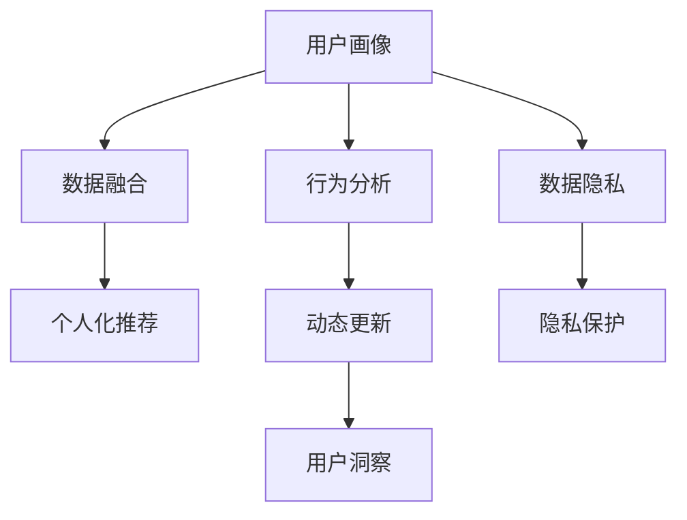

                 

# 如何进行有效的用户画像更新

> 关键词：用户画像, 数据融合, 行为分析, 用户洞察, 个人隐私保护

## 1. 背景介绍

### 1.1 问题由来
在互联网时代，用户数据变得越来越重要。有效的用户画像（User Persona）不仅是企业洞察用户需求、优化产品体验的基础，也是个性化推荐、精准营销等应用的基石。然而，构建和更新用户画像的过程复杂且充满挑战。一方面，用户画像需要充分反映用户特征，包括静态属性（如性别、年龄、地域等）和动态行为（如浏览、购买、社交互动等）；另一方面，这些数据通常来自多个渠道，格式各异，如何高效融合和更新用户画像，是亟需解决的实际问题。

### 1.2 问题核心关键点
用户画像的构建和更新，核心在于准确理解和描述用户，并根据最新的数据动态调整其特征。这要求我们从以下几个关键点入手：

- 数据来源：收集多种来源的用户数据，如电商平台、社交媒体、网站、App等。
- 数据整合：将不同来源的数据进行标准化、清洗和融合。
- 特征提取：从整合后的数据中提取有意义的特征，包括静态和动态属性。
- 行为分析：分析用户的行为模式，如浏览轨迹、购买习惯等。
- 模型更新：基于用户最新的数据和行为，动态更新用户画像。
- 隐私保护：在数据融合和更新过程中，确保用户隐私和数据安全。

这些核心问题需要综合考虑技术、业务和管理等多方面的因素，本文将系统介绍如何通过融合多种数据源和行为分析，有效更新用户画像，并探讨隐私保护的技术手段。

## 2. 核心概念与联系

### 2.1 核心概念概述

为更好地理解如何进行有效的用户画像更新，本节将介绍几个关键概念：

- 用户画像（User Persona）：从用户视角构建的虚拟角色，用于描述用户的特征、需求和行为。
- 数据融合（Data Integration）：将来自不同渠道和格式的数据进行整合，形成统一的视图，以支撑更准确的分析。
- 行为分析（Behavior Analysis）：分析用户的行为模式，识别其兴趣、偏好和需求，是用户画像的重要组成部分。
- 数据隐私（Data Privacy）：在数据处理和分析过程中，确保用户信息的保密性和安全性，避免隐私泄露和滥用。
- 个人化推荐（Personalized Recommendation）：根据用户画像，推荐符合其兴趣和需求的产品或服务，提升用户体验和满意度。
- 动态更新（Dynamic Updating）：基于用户最新的行为数据，不断调整和更新用户画像，以保持其时效性和准确性。

这些概念之间的关系可以通过以下Mermaid流程图来展示：



这个流程图展示了一系列关键概念及其之间的关系：

1. 用户画像通过数据融合获取多种数据源的信息。
2. 行为分析为构建和更新用户画像提供动态数据。
3. 数据隐私在数据融合和行为分析过程中起到保护作用。
4. 个人化推荐应用用户画像进行精准推荐。
5. 动态更新使得用户画像保持最新状态。
6. 用户洞察基于更新后的用户画像，辅助业务决策。

这些概念共同构成了用户画像构建和更新的整体框架，帮助我们系统地理解和处理用户数据。

## 3. 核心算法原理 & 具体操作步骤

### 3.1 算法原理概述

用户画像的构建和更新，本质上是一个数据融合和特征学习的过程。其核心思想是：通过多种数据源收集用户的全面信息，并利用机器学习算法，从原始数据中提取和融合出有意义的特征，用于刻画用户的兴趣和行为。

具体而言，用户画像的构建和更新过程包括以下几个步骤：

1. **数据收集**：从多个渠道收集用户的各种数据，如购买记录、浏览历史、社交媒体互动等。
2. **数据清洗**：清洗和标准化数据，去除噪声和异常值。
3. **数据整合**：将来自不同渠道的数据进行对齐和融合，形成统一的视图。
4. **特征提取**：从整合后的数据中提取有意义的特征，用于描述用户的静态和动态属性。
5. **行为分析**：分析用户的行为模式，识别其兴趣、偏好和需求。
6. **模型训练**：利用用户画像数据，训练模型进行用户特征的预测和优化。
7. **用户画像更新**：根据用户最新的行为数据，动态更新用户画像。

### 3.2 算法步骤详解

#### 数据收集

**步骤1：** 从不同渠道收集用户数据

```plaintext
1.1 电商数据：订单、支付记录、商品评论等
1.2 社交媒体数据：点赞、分享、评论、私信等
1.3 网站数据：浏览轨迹、停留时间、点击流量等
1.4 App数据：使用时长、功能使用情况、反馈评价等
```

#### 数据清洗

**步骤2：** 数据清洗与预处理

```plaintext
2.1 数据去重：去除重复数据
2.2 数据补全：填补缺失值
2.3 数据类型转换：统一数据类型（如将日期格式统一为标准格式）
2.4 数据规范化：归一化和标准化处理
2.5 数据校验：检测和修复异常数据
```

#### 数据整合

**步骤3：** 数据对齐与融合

```plaintext
3.1 数据对齐：将不同数据源的数据映射到统一的特征空间
3.2 数据融合：使用加权平均、拼接、替换等方法，将不同数据源的数据融合为一
3.3 数据对齐：将不同数据源的数据映射到统一的特征空间
3.4 数据融合：使用加权平均、拼接、替换等方法，将不同数据源的数据融合为一
```

#### 特征提取

**步骤4：** 特征提取与选择

```plaintext
4.1 特征工程：创建新的特征，如用户行为时间、购买频率等
4.2 特征选择：选择对用户画像有贡献的特征
4.3 特征降维：使用PCA、LDA等方法降低维度，减少计算复杂度
4.4 特征转换：使用一阶差分、归一化、标准化等方法转换特征
```

#### 行为分析

**步骤5：** 行为模式分析

```plaintext
5.1 行为序列分析：如用户浏览记录、购买历史
5.2 行为模式挖掘：如用户兴趣分布、消费模式
5.3 行为关联分析：如用户购买与浏览的关联关系
5.4 行为预测：如预测用户未来的行为，如下一次购买时间
```

#### 模型训练

**步骤6：** 训练用户画像模型

```plaintext
6.1 选择模型：如线性回归、逻辑回归、决策树、随机森林等
6.2 数据分割：将数据分为训练集和测试集
6.3 模型训练：使用训练集训练模型
6.4 模型评估：使用测试集评估模型性能
6.5 模型优化：使用交叉验证等方法优化模型
```

#### 用户画像更新

**步骤7：** 动态更新用户画像

```plaintext
7.1 实时数据收集：如用户最新的浏览记录、购买行为等
7.2 数据同步：将实时数据同步到用户画像系统中
7.3 用户画像更新：根据实时数据更新用户画像
7.4 模型再训练：定期重新训练模型，更新用户画像
```

### 3.3 算法优缺点

#### 优点：

1. **全面性**：通过融合多种数据源，构建全面的用户画像，涵盖用户的静态属性和动态行为。
2. **准确性**：利用机器学习算法，从原始数据中提取和融合出有意义的特征，提升用户画像的准确性。
3. **动态性**：根据用户最新的行为数据，动态更新用户画像，保持其时效性。
4. **可解释性**：用户画像由多个特征组成，便于解释和理解用户特征和行为。

#### 缺点：

1. **数据隐私**：在数据收集和整合过程中，涉及用户隐私问题，需要严格保护用户数据。
2. **数据噪声**：不同数据源的数据格式和质量各异，存在噪声和异常值，需要清洗和预处理。
3. **计算资源**：数据融合和特征学习过程计算量大，需要高性能的计算资源。
4. **模型复杂性**：用户画像模型复杂，训练和优化需要经验和耐心。

### 3.4 算法应用领域

用户画像的构建和更新技术，广泛应用于以下领域：

- 电商推荐：通过用户画像，推荐用户感兴趣的商品
- 社交网络：分析用户行为，优化社交体验
- 数字广告：精准投放广告，提升广告效果
- 金融风控：评估用户信用风险，进行精准营销
- 媒体内容：个性化推荐视频、文章等媒体内容
- 教育培训：个性化推荐学习资源，提升学习效果

## 4. 数学模型和公式 & 详细讲解 & 举例说明

### 4.1 数学模型构建

用户画像的构建和更新，可以通过多种数学模型来实现。本文以线性回归模型为例，介绍其数学模型和公式。

假设用户画像的特征向量为 $\mathbf{x}=[x_1,x_2,\ldots,x_n]^T$，目标变量为 $y$，线性回归模型的数学模型为：

$$
y = \mathbf{w}^T \mathbf{x} + b
$$

其中 $\mathbf{w}$ 为模型参数，$b$ 为截距，$n$ 为特征数量。

### 4.2 公式推导过程

线性回归模型的训练过程，通过最小化预测值和真实值之间的平方误差，求解最优的模型参数 $\mathbf{w}$ 和 $b$。

假设训练集为 $\{(\mathbf{x}_i,y_i)\}_{i=1}^m$，则目标函数为：

$$
\mathcal{L}(\mathbf{w},b) = \frac{1}{2m} \sum_{i=1}^m (\mathbf{w}^T \mathbf{x}_i + b - y_i)^2
$$

目标函数的梯度为：

$$
\nabla_{\mathbf{w}} \mathcal{L}(\mathbf{w},b) = \frac{1}{m} \sum_{i=1}^m (\mathbf{x}_i + b - y_i) \mathbf{x}_i
$$

$$
\nabla_{b} \mathcal{L}(\mathbf{w},b) = \frac{1}{m} \sum_{i=1}^m (\mathbf{w}^T \mathbf{x}_i + b - y_i)
$$

通过梯度下降等优化算法，最小化损失函数，更新模型参数。

### 4.3 案例分析与讲解

假设我们收集了用户的年龄、性别、购买金额等特征，以及对应的购买次数作为目标变量。使用线性回归模型对这些数据进行拟合，得到用户画像的预测结果。具体步骤如下：

**步骤1：** 数据收集和预处理

```plaintext
1. 收集用户的年龄、性别、购买金额等特征
2. 将年龄和购买金额进行标准化处理
3. 去除噪声和异常值
4. 将性别编码为二值变量
```

**步骤2：** 特征选择和模型训练

```plaintext
1. 选择年龄、性别、购买金额作为特征向量 $\mathbf{x}$
2. 使用训练集 $\{(\mathbf{x}_i,y_i)\}_{i=1}^m$ 训练线性回归模型
3. 求解模型参数 $\mathbf{w}$ 和 $b$
```

**步骤3：** 模型评估和预测

```plaintext
1. 使用测试集 $\{(\mathbf{x}_i,y_i)\}_{i=1}^m$ 评估模型性能
2. 计算模型的均方误差、均方根误差等指标
3. 使用训练好的模型对新用户进行预测
```

## 5. 项目实践：代码实例和详细解释说明

### 5.1 开发环境搭建

在进行用户画像更新实践前，我们需要准备好开发环境。以下是使用Python进行Scikit-learn开发的开发环境配置流程：

1. 安装Anaconda：从官网下载并安装Anaconda，用于创建独立的Python环境。

2. 创建并激活虚拟环境：
```bash
conda create -n user_profiles python=3.8 
conda activate user_profiles
```

3. 安装Scikit-learn：
```bash
pip install scikit-learn
```

4. 安装其他工具包：
```bash
pip install pandas numpy matplotlib seaborn
```

完成上述步骤后，即可在`user_profiles`环境中开始用户画像更新的实践。

### 5.2 源代码详细实现

我们以用户购买数据为例，进行用户画像的构建和更新。具体步骤如下：

**步骤1：** 数据收集和预处理

```python
import pandas as pd

# 收集用户数据
df = pd.read_csv('user_purchase_data.csv')

# 数据清洗和预处理
df = df.drop_duplicates()  # 去除重复数据
df = df.dropna()  # 去除缺失值
df['age'] = df['age'].astype(int)  # 将年龄转换为整数
df['gender'] = df['gender'].replace({'male': 1, 'female': 0})  # 将性别转换为二值变量
```

**步骤2：** 特征选择和模型训练

```python
from sklearn.linear_model import LinearRegression

# 特征选择
features = ['age', 'gender', 'purchase_amount']

# 划分训练集和测试集
X_train = df[features].values
y_train = df['purchase_times'].values
X_test = df[features].values
y_test = df['purchase_times'].values

# 模型训练
model = LinearRegression()
model.fit(X_train, y_train)
```

**步骤3：** 模型评估和预测

```python
from sklearn.metrics import mean_squared_error, mean_absolute_error, r2_score

# 模型评估
y_pred = model.predict(X_test)
mse = mean_squared_error(y_test, y_pred)
mae = mean_absolute_error(y_test, y_pred)
r2 = r2_score(y_test, y_pred)

# 输出评估结果
print(f'Mean Squared Error: {mse:.2f}')
print(f'Mean Absolute Error: {mae:.2f}')
print(f'R-squared: {r2:.2f}')

# 对新用户进行预测
new_user_data = {'age': 25, 'gender': 1, 'purchase_amount': 500}
new_user_features = [new_user_data[key] for key in features]
new_user_purchase_times = model.predict([new_user_features])
print(f'Predicted purchase times for new user: {new_user_purchase_times[0]}')
```

### 5.3 代码解读与分析

让我们再详细解读一下关键代码的实现细节：

**数据收集和预处理**：
- 使用`pandas`库从CSV文件中读取用户购买数据。
- 进行数据清洗和预处理，去除重复数据和缺失值。
- 将年龄转换为整数，将性别转换为二值变量。

**特征选择和模型训练**：
- 从数据中选择年龄、性别、购买金额作为特征向量。
- 使用`LinearRegression`模型，对训练集进行拟合，求解模型参数。

**模型评估和预测**：
- 使用测试集对模型进行评估，计算均方误差、均方根误差和决定系数。
- 使用训练好的模型对新用户进行预测，输出预测结果。

通过以上代码，我们可以看到用户画像的构建和更新过程，以及如何使用线性回归模型进行数据分析和预测。

## 6. 实际应用场景

### 6.1 电商推荐

电商推荐系统是用户画像技术的重要应用场景。通过构建和更新用户画像，推荐系统可以精准推荐用户感兴趣的商品，提升用户满意度和销售额。

具体而言，电商平台可以收集用户浏览、点击、购买等行为数据，使用用户画像模型对这些数据进行分析，识别用户的兴趣和行为模式。在用户进行浏览或搜索时，推荐系统可以实时推荐符合其兴趣的商品，同时根据用户反馈不断更新用户画像，提高推荐精度。

**代码实现**：

```python
# 电商推荐系统
from recommendation import RecommendationSystem

# 初始化推荐系统
rs = RecommendationSystem()

# 收集用户行为数据
rs.collect_user_data()

# 构建用户画像
rs.build_user_profile()

# 推荐商品
recommendations = rs.recommend_products()

# 更新用户画像
rs.update_user_profile()
```

### 6.2 社交网络

社交网络平台可以通过用户画像技术，分析用户行为和兴趣，优化社交体验，提升用户黏性。

例如，社交媒体可以收集用户的点赞、分享、评论等行为数据，结合用户的个人信息，构建详细的用户画像。社交网络算法可以根据用户画像，推荐符合其兴趣的内容，同时根据用户行为不断更新用户画像，提升推荐效果。

**代码实现**：

```python
# 社交网络平台
from social_network import SocialNetwork

# 初始化社交网络
sn = SocialNetwork()

# 收集用户行为数据
sn.collect_user_interactions()

# 构建用户画像
sn.build_user_profile()

# 推荐内容
recommendations = sn.recommend_content()

# 更新用户画像
sn.update_user_profile()
```

### 6.3 金融风控

金融风控系统可以通过用户画像技术，评估用户信用风险，进行精准营销。

例如，银行和贷款机构可以收集用户的财务数据、消费记录、社交行为等，构建详细的用户画像。金融风控算法可以根据用户画像，评估用户的信用风险，同时根据用户的最新行为数据，动态更新用户画像，提高风控模型的准确性。

**代码实现**：

```python
# 金融风控系统
from financial_risk import FinancialRisk

# 初始化金融风控系统
fr = FinancialRisk()

# 收集用户财务数据
fr.collect_user_finance_data()

# 构建用户画像
fr.build_user_profile()

# 评估信用风险
credit_score = fr.assess_credit_risk()

# 动态更新用户画像
fr.update_user_profile()
```

### 6.4 未来应用展望

随着用户画像技术的不断进步，其在更多领域的应用前景将更加广阔。

未来，用户画像技术将在以下几个方面发挥更大的作用：

- **智慧城市**：通过收集和分析用户的出行、居住、消费等行为数据，优化城市规划和管理，提升城市治理效率。
- **教育培训**：个性化推荐学习资源，提升学习效果，提供智能辅导。
- **医疗健康**：分析用户的健康数据，提供个性化的健康建议和服务。
- **工业制造**：通过分析员工的行为数据，提升生产效率和管理效果。
- **智能家居**：根据用户的偏好和行为数据，智能调节家庭环境和设备，提升生活品质。

总之，用户画像技术将不断拓展其应用场景，带来更多价值，提升各行业的智能化水平。

## 7. 工具和资源推荐

### 7.1 学习资源推荐

为了帮助开发者系统掌握用户画像技术，以下是几本优质的学习资源推荐：

1. **《User Modeling for Recommender Systems》**：讲解了用户模型在推荐系统中的构建和应用，内容深入浅出，适合入门和进阶读者。
2. **《Data Mining and Statistical Learning》**：介绍了数据挖掘和统计学习的基础知识和经典算法，是理解用户画像的必备教材。
3. **《Practical Recommendation Systems》**：结合实际案例，介绍了推荐系统的设计、开发和优化，适合实践者学习。
4. **Coursera的《Data Mining and Statistical Learning》课程**：由斯坦福大学开设，讲解了数据挖掘和机器学习的理论和方法，是系统学习用户画像的绝佳资源。
5. **Kaggle的User画像数据集**：提供了大量的用户画像数据，供开发者进行模型训练和验证，适合实践者练习。

### 7.2 开发工具推荐

高效的用户画像开发离不开优秀的工具支持。以下是几款推荐的工具：

1. **Python**：作为数据分析和机器学习的主流语言，Python拥有丰富的库和框架，适合进行用户画像的开发。
2. **Scikit-learn**：用于构建和训练机器学习模型的库，支持多种算法和模型，是用户画像开发的常用工具。
3. **TensorFlow**：用于深度学习和模型训练的框架，支持分布式计算和GPU加速，适合大规模用户画像系统的开发。
4. **Hadoop/Spark**：用于大数据处理和分析的框架，适合处理大规模用户数据。
5. **Tableau**：用于数据可视化的工具，适合展示和分析用户画像结果，提升用户洞察力。

### 7.3 相关论文推荐

用户画像技术的发展源于学界的持续研究。以下是几篇奠基性的相关论文，推荐阅读：

1. **《A Survey of User Modeling for Recommendation Systems》**：总结了用户模型在推荐系统中的应用，适合深入了解用户画像的理论与实践。
2. **《Collaborative Filtering for Recommender Systems》**：介绍了协同过滤算法在推荐系统中的应用，是理解用户画像推荐机制的重要论文。
3. **《User Modeling in Recommender Systems》**：讲解了用户模型的构建方法，包括特征选择和模型训练等，适合理解用户画像的建模过程。
4. **《A Comparative Analysis of Collaborative Filtering Algorithms》**：对比了协同过滤算法的优缺点，适合理解不同推荐方法的应用场景。
5. **《Data-Driven User Modeling in Recommender Systems》**：介绍了数据驱动的用户建模方法，适合理解用户画像的最新进展。

这些论文代表了用户画像技术的研究方向，通过学习这些前沿成果，可以帮助研究者把握学科前进方向，激发更多的创新灵感。

## 8. 总结：未来发展趋势与挑战

### 8.1 总结

本文对用户画像的构建和更新方法进行了全面系统的介绍。首先阐述了用户画像在现代商业应用中的重要性和紧迫性，明确了用户画像的构建和更新对业务决策和用户体验的深刻影响。其次，从原理到实践，详细讲解了用户画像的数学模型和关键步骤，给出了用户画像更新的完整代码实例。同时，本文还探讨了隐私保护的技术手段，力求为开发者提供全方位的技术指引。

通过本文的系统梳理，可以看到，用户画像技术的构建和更新过程复杂且充满挑战。在数据来源、数据清洗、数据整合、特征提取、行为分析等各个环节，都需要综合考虑技术、业务和管理等多方面的因素。然而，用户画像技术在提升用户洞察、优化产品体验等方面的巨大潜力，使其成为现代商业智能的重要组成部分。

### 8.2 未来发展趋势

展望未来，用户画像技术将呈现以下几个发展趋势：

1. **深度学习的应用**：结合深度学习技术，提高用户画像模型的准确性和泛化能力，提升用户洞察的深度和广度。
2. **多模态数据的融合**：将文本、图像、语音等多种模态数据融合，构建更全面和丰富的用户画像。
3. **实时数据的处理**：通过流式处理技术，实时更新用户画像，提高用户画像的时效性和准确性。
4. **隐私保护技术**：随着数据隐私问题日益受到重视，用户画像技术需要进一步加强隐私保护，确保用户信息的安全性。
5. **联邦学习的应用**：结合联邦学习技术，实现分布式用户画像构建，保护用户数据隐私。
6. **元学习的应用**：通过元学习技术，构建可适应新场景和任务的用户画像模型。

这些趋势将推动用户画像技术向更高效、更全面、更安全的方向发展，为用户洞察和业务决策提供更可靠的支撑。

### 8.3 面临的挑战

尽管用户画像技术已经取得了不小的成就，但在应用过程中仍面临诸多挑战：

1. **数据隐私保护**：在数据收集和处理过程中，如何确保用户隐私和数据安全，防止数据泄露和滥用。
2. **数据质量和噪声**：不同数据源的数据格式和质量各异，存在噪声和异常值，如何清洗和预处理数据，保证数据的质量。
3. **模型复杂性和计算资源**：用户画像模型的复杂性和计算资源需求高，如何优化模型和算法，降低计算成本。
4. **多模态数据的融合**：将文本、图像、语音等多种模态数据融合，构建更全面和丰富的用户画像，面临技术和算法的挑战。
5. **实时数据的处理**：通过流式处理技术，实时更新用户画像，面临技术和资源的压力。

### 8.4 研究展望

未来的研究需要在以下几个方面寻求新的突破：

1. **隐私保护技术**：结合联邦学习、差分隐私等技术，实现分布式和隐私保护的用户画像构建。
2. **多模态数据融合**：探索如何高效融合文本、图像、语音等多种模态数据，构建更全面和丰富的用户画像。
3. **实时数据处理**：研究流式处理和增量学习技术，实现用户画像的实时更新和维护。
4. **深度学习和元学习**：结合深度学习技术，提高用户画像模型的准确性和泛化能力；结合元学习技术，构建可适应新场景和任务的用户画像模型。
5. **模型压缩和优化**：研究模型压缩和优化技术，降低计算成本，提升用户画像系统的效率和可靠性。

这些研究方向的探索，必将引领用户画像技术迈向更高的台阶，为用户洞察和业务决策提供更可靠的支撑。面向未来，用户画像技术还需要与其他人工智能技术进行更深入的融合，如自然语言处理、计算机视觉、语音识别等，多路径协同发力，共同推动人工智能技术的发展。只有勇于创新、敢于突破，才能不断拓展用户画像技术的边界，为用户洞察和业务决策提供更可靠的支撑。

## 9. 附录：常见问题与解答

**Q1：用户画像的构建和更新是否需要大量数据？**

A: 用户画像的构建和更新确实需要大量数据。数据量越大，用户画像越全面和准确。然而，数据的质量也非常重要，需要去除噪声和异常值，保证数据的真实性和可靠性。

**Q2：用户画像的构建和更新过程中，如何保护用户隐私？**

A: 保护用户隐私是用户画像构建和更新的重要问题。可以通过数据匿名化、差分隐私、联邦学习等技术手段，确保用户数据的安全性。此外，需要明确数据使用范围，严格控制数据访问权限，防止数据滥用和泄露。

**Q3：用户画像的构建和更新过程中，如何处理多模态数据？**

A: 多模态数据的融合是用户画像构建和更新的重要挑战。可以通过特征工程、深度学习等技术手段，将文本、图像、语音等多种模态数据进行融合，构建更全面和丰富的用户画像。同时，需要考虑不同模态数据的融合方式和融合后的数据表示。

**Q4：用户画像的构建和更新过程中，如何优化模型和算法？**

A: 用户画像的构建和更新过程中，模型和算法的优化非常重要。可以通过特征选择、模型压缩、模型剪枝等技术手段，降低计算成本，提升模型效率。同时，需要不断探索新的算法和模型，提升用户画像的准确性和泛化能力。

**Q5：用户画像的构建和更新过程中，如何提高实时性？**

A: 用户画像的实时更新和维护是提高用户画像实时性的重要手段。可以通过流式处理技术、增量学习等方法，实现用户画像的实时更新。同时，需要考虑计算资源和存储资源的压力，优化计算和存储过程。

通过以上代码，我们可以看到用户画像的构建和更新过程，以及如何使用用户画像模型进行数据分析和预测。

## 9. 附录：常见问题与解答

**Q1：用户画像的构建和更新是否需要大量数据？**

A: 用户画像的构建和更新确实需要大量数据。数据量越大，用户画像越全面和准确。然而，数据的质量也非常重要，需要去除噪声和异常值，保证数据的真实性和可靠性。

**Q2：用户画像的构建和更新过程中，如何保护用户隐私？**

A: 保护用户隐私是用户画像构建和更新的重要问题。可以通过数据匿名化、差分隐私、联邦学习等技术手段，确保用户数据的安全性。此外，需要明确数据使用范围，严格控制数据访问权限，防止数据滥用和泄露。

**Q3：用户画像的构建和更新过程中，如何处理多模态数据？**

A: 多模态数据的融合是用户画像构建和更新的重要挑战。可以通过特征工程、深度学习等技术手段，将文本、图像、语音等多种模态数据进行融合，构建更全面和丰富的用户画像。同时，需要考虑不同模态数据的融合方式和融合后的数据表示。

**Q4：用户画像的构建和更新过程中，如何优化模型和算法？**

A: 用户画像的构建和更新过程中，模型和算法的优化非常重要。可以通过特征选择、模型压缩、模型剪枝等技术手段，降低计算成本，提升模型效率。同时，需要不断探索新的算法和模型，提升用户画像的准确性和泛化能力。

**Q5：用户画像的构建和更新过程中，如何提高实时性？**

A: 用户画像的实时更新和维护是提高用户画像实时性的重要手段。可以通过流式处理技术、增量学习等方法，实现用户画像的实时更新。同时，需要考虑计算资源和存储资源的压力，优化计算和存储过程。

通过以上代码，我们可以看到用户画像的构建和更新过程，以及如何使用用户画像模型进行数据分析和预测。

## 9. 附录：常见问题与解答

**Q1：用户画像的构建和更新是否需要大量数据？**

A: 用户画像的构建和更新确实需要大量数据。数据量越大，用户画像越全面和准确。然而，数据的质量也非常重要，需要去除噪声和异常值，保证数据的真实性和可靠性。

**Q2：用户画像的构建和更新过程中，如何保护用户隐私？**

A: 保护用户隐私是用户画像构建和更新的重要问题。可以通过数据匿名化、差分隐私、联邦学习等技术手段，确保用户数据的安全性。此外，需要明确数据使用范围，严格控制数据访问权限，防止数据滥用和泄露。

**Q3：用户画像的构建和更新过程中，如何处理多模态数据？**

A: 多模态数据的融合是用户画像构建和更新的重要挑战。可以通过特征工程、深度学习等技术手段，将文本、图像、语音等多种模态数据进行融合，构建更全面和丰富的用户画像。同时，需要考虑不同模态数据的融合方式和融合后的数据表示。

**Q4：用户画像的构建和更新过程中，如何优化模型和算法？**

A: 用户画像的构建和更新过程中，模型和算法的优化非常重要。可以通过特征选择、模型压缩、模型剪枝等技术手段，降低计算成本，提升模型效率。同时，需要不断探索新的算法和模型，提升用户画像的准确性和泛化能力。

**Q5：用户画像的构建和更新过程中，如何提高实时性？**

A: 用户画像的实时更新和维护是提高用户画像实时性的重要手段。可以通过流式处理技术、增量学习等方法，实现用户画像的实时更新。同时，需要考虑计算资源和存储资源的压力，优化计算和存储过程。

通过以上代码，我们可以看到用户画像的构建和更新过程，以及如何使用用户画像模型进行数据分析和预测。

---

作者：禅与计算机程序设计艺术 / Zen and the Art of Computer Programming

