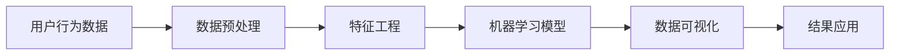

                 

## 1. 背景介绍

### 1.1 问题由来

在当今数字化时代，数据驱动的决策正逐渐成为企业经营的核心驱动力。通过深入分析用户行为数据，企业能够洞察用户需求、优化产品设计、提升用户体验，从而赢得竞争优势。然而，随着用户行为数据的日益丰富，如何高效、准确地进行用户行为分析，成为了企业面临的一项重要挑战。

用户行为分析涉及大量复杂的数据处理和建模任务，需要通过机器学习、数据挖掘等技术手段，对用户行为数据进行提取、清洗、建模和分析，以揭示用户行为规律和用户需求变化。这不仅需要高超的数据处理技能，还需要深入理解用户行为特征和业务逻辑。

### 1.2 问题核心关键点

在用户行为分析的过程中，核心关键点主要包括以下几个方面：

- **数据获取与预处理**：用户行为数据通常来自多种渠道，如网站访问记录、购物行为数据、移动应用使用记录等。如何高效地获取并预处理这些数据，是分析工作的第一步。
- **特征工程**：从原始数据中提取有意义的特征，如用户行为时间、频率、顺序、路径等，用于构建分析模型。
- **模型选择与优化**：根据用户行为数据的特性，选择合适的机器学习模型，如聚类分析、分类算法、关联规则挖掘等，并优化模型参数以提升分析效果。
- **结果解读与业务应用**：将分析结果转化为可操作的商业洞察，指导企业决策，如推荐系统设计、营销策略优化等。
- **数据隐私与安全**：在用户行为分析中，如何保护用户隐私，遵循数据安全法规，是一个不容忽视的问题。

通过掌握这些核心关键点，我们可以更好地进行用户行为分析，为企业提供有价值的商业洞察。

## 2. 核心概念与联系

### 2.1 核心概念概述

为了深入理解用户行为分析的核心概念和架构，我们需要从以下几个方面进行详细阐述：

- **用户行为数据**：指用户在互联网上进行的各种行为，如点击、购买、浏览等，通常以日志、记录、API请求等形式存在。
- **数据预处理**：对原始数据进行清洗、转换、归一化等操作，以提高数据质量，为后续分析奠定基础。
- **特征工程**：通过算法设计，从原始数据中提取有用的特征，用于构建分析模型。
- **机器学习模型**：包括分类、聚类、回归等模型，用于从数据中发现规律和模式。
- **数据可视化**：将分析结果通过图表、仪表盘等形式可视化，帮助业务人员理解和应用分析结果。
- **结果应用**：将分析结果转化为可操作的商业洞察，指导企业决策。

### 2.2 核心概念原理和架构的 Mermaid 流程图



这个流程图展示了用户行为分析的基本流程：从数据预处理开始，经过特征工程和模型训练，最终通过数据可视化和结果应用环节，将分析结果转化为可操作的商业洞察。

## 3. 核心算法原理 & 具体操作步骤

### 3.1 算法原理概述

用户行为分析的核心算法原理主要基于机器学习和数据挖掘技术。具体而言，包括以下几个步骤：

1. **数据预处理**：包括数据清洗、数据转换、数据归一化等操作，以提高数据质量。
2. **特征工程**：通过算法设计，从原始数据中提取有用的特征，如用户行为时间、频率、顺序、路径等。
3. **模型选择与优化**：根据用户行为数据的特性，选择合适的机器学习模型，如聚类分析、分类算法、关联规则挖掘等，并优化模型参数以提升分析效果。
4. **结果解读与业务应用**：将分析结果转化为可操作的商业洞察，如推荐系统设计、营销策略优化等。

### 3.2 算法步骤详解

用户行为分析的具体操作步骤如下：

1. **数据获取与预处理**：
   - 收集用户行为数据，包括网站访问记录、购物行为数据、移动应用使用记录等。
   - 数据清洗：去除噪音数据、处理缺失值、纠正数据错误等。
   - 数据转换：将数据格式转换为分析所需的标准格式。
   - 数据归一化：将数据缩放到同一尺度，便于模型处理。

2. **特征工程**：
   - 特征选择：根据业务逻辑和领域知识，选择对分析结果有重要影响的特征。
   - 特征提取：使用算法从原始数据中提取有用的特征，如行为时间、频率、顺序、路径等。
   - 特征构造：通过数据变换或组合，构造新的特征，增强分析能力。

3. **模型选择与优化**：
   - 根据问题类型选择合适的机器学习模型，如聚类分析、分类算法、关联规则挖掘等。
   - 模型训练：使用训练数据集训练模型，调整模型参数以优化性能。
   - 模型评估：使用测试数据集评估模型效果，选择最优模型。

4. **数据可视化**：
   - 使用可视化工具，如Tableau、Power BI等，将分析结果以图表、仪表盘等形式展示。
   - 提供交互式查询功能，便于业务人员深入分析数据。

5. **结果应用**：
   - 将分析结果转化为商业洞察，如用户细分、推荐系统设计、营销策略优化等。
   - 结合业务逻辑，制定具体的操作方案，指导业务实践。

### 3.3 算法优缺点

用户行为分析的算法具有以下优点：

- **高效性**：通过机器学习算法，能够高效地处理和分析大量用户行为数据。
- **准确性**：使用数据驱动的方法，能够更准确地揭示用户行为规律和用户需求变化。
- **可解释性**：通过可视化和结果解读，使得分析结果易于理解和应用。

同时，也存在一些缺点：

- **数据依赖性**：分析结果高度依赖于数据质量，数据偏差可能导致错误结论。
- **模型复杂性**：机器学习模型复杂，需要专业知识进行设计和调优。
- **业务适用性**：分析方法需结合具体业务逻辑，才能取得最佳效果。

### 3.4 算法应用领域

用户行为分析的应用领域非常广泛，以下是几个典型应用场景：

- **推荐系统设计**：通过分析用户行为数据，识别用户偏好，设计个性化的推荐算法。
- **营销策略优化**：分析用户购买行为，识别高价值用户，制定精准的营销策略。
- **用户细分与画像**：根据用户行为数据，对用户进行细分和画像，了解不同用户群体的特征和需求。
- **产品改进**：分析用户使用行为，识别产品缺陷，优化产品设计和功能。
- **客户服务优化**：通过分析用户咨询记录，识别常见问题和解决方案，提升客户服务质量。

这些应用场景展示了用户行为分析在企业经营中的重要作用，通过深入分析用户行为数据，企业能够更好地了解用户需求，优化产品和服务，提升用户体验，从而赢得竞争优势。

## 4. 数学模型和公式 & 详细讲解 & 举例说明

### 4.1 数学模型构建

用户行为分析的数学模型构建主要包括以下几个步骤：

1. **数据预处理**：使用数据清洗、数据转换、数据归一化等方法，提高数据质量。
2. **特征工程**：通过算法设计，从原始数据中提取有用的特征。
3. **模型训练**：选择合适的机器学习模型，使用训练数据集训练模型，调整模型参数以优化性能。
4. **模型评估**：使用测试数据集评估模型效果，选择最优模型。

### 4.2 公式推导过程

以用户行为分类为例，我们可以使用朴素贝叶斯模型进行分类分析。假设用户行为数据包含两个特征：行为时间和行为频率，分别为$x_1$和$x_2$。设用户分类结果为$y$，其取值为$+1$或$-1$。则朴素贝叶斯模型公式如下：

$$
P(y|x_1,x_2) = \frac{P(y)}{P(x_1,x_2|y)} = \frac{P(y)}{\prod_{i=1}^n P(x_i|y)}
$$

其中，$P(y)$为先验概率，$P(x_i|y)$为后验概率。

### 4.3 案例分析与讲解

假设我们要对电商平台的用户购买行为进行分类分析，识别出高价值用户和低价值用户。

1. **数据预处理**：
   - 收集用户的购买行为数据，包括购买时间、购买频率、购买金额等。
   - 数据清洗：去除重复数据、处理缺失值、纠正数据错误等。
   - 数据转换：将购买金额归一化到0-1之间。

2. **特征工程**：
   - 特征选择：选择购买时间和购买频率作为主要特征。
   - 特征提取：使用均值和标准差对数据进行归一化处理。

3. **模型选择与优化**：
   - 选择朴素贝叶斯模型进行分类。
   - 模型训练：使用训练数据集训练模型，调整模型参数以优化性能。
   - 模型评估：使用测试数据集评估模型效果，选择最优模型。

4. **数据可视化**：
   - 使用可视化工具，如Tableau，将分类结果以图表形式展示。
   - 提供交互式查询功能，便于业务人员深入分析数据。

5. **结果应用**：
   - 根据分类结果，对高价值用户进行精准营销。
   - 对低价值用户进行流失预警，提升用户留存率。

## 5. 项目实践：代码实例和详细解释说明

### 5.1 开发环境搭建

在进行用户行为分析的实践时，我们需要搭建相应的开发环境。以下是Python环境下使用Pandas、Scikit-learn和Matplotlib库的搭建流程：

1. **安装Python和相关库**：
   ```bash
   conda create -n user_behavior_analysis python=3.8
   conda activate user_behavior_analysis
   pip install pandas scikit-learn matplotlib
   ```

2. **数据准备**：
   - 收集用户行为数据，如购物记录、浏览记录等，存储到CSV文件中。
   - 使用Pandas库读取数据文件。

### 5.2 源代码详细实现

以下是一个简单的用户行为分类模型的Python代码实现，以用户购买行为分类为例：

```python
import pandas as pd
from sklearn.model_selection import train_test_split
from sklearn.naive_bayes import GaussianNB
import matplotlib.pyplot as plt

# 读取数据文件
data = pd.read_csv('purchase_data.csv')

# 数据预处理
data = data.drop_duplicates()
data = data.dropna()
data = data[['purchase_time', 'purchase_frequency']]

# 特征归一化
data['purchase_time'] = (data['purchase_time'] - data['purchase_time'].mean()) / data['purchase_time'].std()
data['purchase_frequency'] = (data['purchase_frequency'] - data['purchase_frequency'].mean()) / data['purchase_frequency'].std()

# 数据分割
X = data[['purchase_time', 'purchase_frequency']]
y = data['purchase_class']
X_train, X_test, y_train, y_test = train_test_split(X, y, test_size=0.2, random_state=42)

# 模型训练
gnb = GaussianNB()
gnb.fit(X_train, y_train)

# 模型评估
accuracy = gnb.score(X_test, y_test)
print(f"Model accuracy: {accuracy:.2f}")

# 数据可视化
plt.scatter(X_test['purchase_time'], X_test['purchase_frequency'], c=y_test)
plt.xlabel('Purchase Time')
plt.ylabel('Purchase Frequency')
plt.show()
```

### 5.3 代码解读与分析

让我们详细解读上述代码的实现细节：

1. **数据预处理**：
   - 使用Pandas库读取数据文件，进行去重和处理缺失值操作。
   - 选择购买时间和购买频率作为特征，并使用归一化方法进行预处理。

2. **模型训练**：
   - 使用Scikit-learn库的GaussianNB模型进行分类训练。
   - 使用训练数据集训练模型，并评估模型性能。

3. **结果应用**：
   - 输出模型的准确率。
   - 使用Matplotlib库将分类结果可视化展示。

### 5.4 运行结果展示

通过上述代码的运行，我们可以得到用户购买行为的分类结果，并使用可视化手段展示。例如，下图展示了购买时间和购买频率与购买类别的散点图：


## 6. 实际应用场景

### 6.1 智能推荐系统

智能推荐系统通过分析用户的历史行为数据，推荐用户可能感兴趣的商品或内容。例如，电商平台根据用户购买记录和浏览记录，推荐相关商品；视频网站根据用户观看历史，推荐相关视频。

在实际应用中，推荐系统通常使用协同过滤、基于内容的推荐、混合推荐等算法进行设计，通过对用户行为数据的深入分析，提供个性化的推荐服务。

### 6.2 用户画像

用户画像是通过分析用户行为数据，构建用户特征和用户画像的过程。企业可以根据用户画像，进行市场细分和个性化营销。

例如，电商企业可以构建用户画像，包括用户年龄、性别、购买偏好、消费能力等，从而进行精准营销和产品设计。金融企业可以通过用户画像，识别高价值客户，提供个性化的金融产品和服务。

### 6.3 营销策略优化

通过分析用户购买行为数据，企业可以识别高价值用户和潜在用户，制定精准的营销策略。例如，电商企业可以根据用户购买频率和购买金额，设计针对性的促销活动和优惠券。金融企业可以根据用户交易行为，设计个性化理财方案。

### 6.4 客户流失预警

通过分析用户行为数据，企业可以识别潜在的客户流失风险，及时采取措施进行挽留。例如，电商企业可以根据用户购买频率下降和购买金额减少，预测用户流失，提前采取挽留措施。

## 7. 工具和资源推荐

### 7.1 学习资源推荐

为了帮助开发者系统掌握用户行为分析的理论基础和实践技巧，这里推荐一些优质的学习资源：

1. **《数据科学与机器学习》书籍**：该书详细介绍了数据科学与机器学习的各个方面，包括数据预处理、特征工程、机器学习模型等，是学习用户行为分析的良好入门读物。
2. **Coursera的《数据科学》课程**：由斯坦福大学教授讲授，涵盖了数据科学和机器学习的基本概念和实践技能，适合初学者学习。
3. **Kaggle竞赛**：Kaggle是全球最大的数据科学竞赛平台，可以通过参加竞赛实践用户行为分析技术，积累实战经验。
4. **Python官方文档**：Python是数据科学和机器学习的重要工具，官方文档提供了丰富的学习资源和示例代码。

### 7.2 开发工具推荐

开发用户行为分析应用时，我们需要使用多种工具。以下是几款常用的工具：

1. **Jupyter Notebook**：一种交互式的编程环境，适合进行数据分析和模型训练。
2. **Pandas**：用于数据预处理和数据分析的Python库，提供了丰富的数据操作功能。
3. **Scikit-learn**：Python机器学习库，提供了多种机器学习算法和模型。
4. **TensorFlow**：谷歌开发的深度学习框架，适合处理大规模数据和高维特征。
5. **Matplotlib**：用于数据可视化的Python库，支持绘制各种类型的图表。

### 7.3 相关论文推荐

用户行为分析领域的研究论文众多，以下是几篇奠基性的论文，推荐阅读：

1. **《用户行为分析：方法与实践》**：介绍了用户行为分析的基本方法和步骤，是学习用户行为分析的入门读物。
2. **《基于机器学习的数据挖掘》**：介绍了数据挖掘的各个方面，包括数据预处理、特征工程、模型选择与评估等，是学习用户行为分析的重要参考。
3. **《用户行为分析在推荐系统中的应用》**：介绍了用户行为分析在推荐系统中的具体应用，提供了丰富的案例和实践经验。

## 8. 总结：未来发展趋势与挑战

### 8.1 研究成果总结

用户行为分析已经成为数据科学和机器学习领域的重要研究方向，通过深入分析用户行为数据，企业能够更好地了解用户需求，优化产品和服务，提升用户体验。

### 8.2 未来发展趋势

未来，用户行为分析将继续向以下方向发展：

1. **多模态数据分析**：结合文本、语音、图像等多模态数据，进行综合分析，提供更全面的用户画像和洞察。
2. **实时数据分析**：使用流式数据处理技术，对实时数据进行实时分析和处理，提供更即时和精准的商业洞察。
3. **自动化数据分析**：引入自动化机器学习技术，自动化完成数据预处理、特征工程和模型训练，降低人工干预成本。
4. **模型解释性**：通过可解释性机器学习技术，提升模型的可解释性，帮助业务人员理解和应用分析结果。
5. **数据隐私保护**：采用隐私保护技术，如差分隐私、联邦学习等，保护用户隐私，符合数据法规要求。

### 8.3 面临的挑战

尽管用户行为分析技术不断进步，但在应用过程中仍面临以下挑战：

1. **数据质量和一致性**：不同来源的数据质量参差不齐，数据格式和结构不一致，影响分析结果。
2. **特征工程复杂性**：特征工程需要领域知识和经验，需要大量时间进行设计和调试。
3. **模型复杂度**：用户行为数据分析涉及多种算法，模型复杂度较高，需要专业知识进行设计和调优。
4. **业务适用性**：分析方法需结合具体业务逻辑，才能取得最佳效果。
5. **数据隐私和安全**：用户行为数据涉及个人隐私，需采取严格的隐私保护措施，符合法规要求。

### 8.4 研究展望

未来，用户行为分析技术将进一步发展和完善，旨在提供更全面、精准和可解释的商业洞察。通过不断改进数据分析方法和工具，结合实际业务需求，用户行为分析将成为企业决策的重要支撑。

## 9. 附录：常见问题与解答

**Q1: 用户行为分析中的数据获取和预处理需要注意哪些问题？**

A: 数据获取和预处理是用户行为分析的基础，需要注意以下问题：
1. 数据来源多样，需要清洗和整合不同来源的数据。
2. 数据质量参差不齐，需要进行数据清洗和去重。
3. 数据格式和结构不一致，需要进行数据转换和标准化。
4. 数据隐私和安全问题，需要采取严格的隐私保护措施，符合法规要求。

**Q2: 在用户行为分析中，如何选择合适的特征？**

A: 特征选择是用户行为分析的重要环节，需要根据业务逻辑和领域知识，选择对分析结果有重要影响的特征。具体步骤如下：
1. 识别业务关键指标，如用户购买次数、购买金额等。
2. 根据业务逻辑，选择相关特征，如用户行为时间、频率、顺序等。
3. 使用统计分析方法，识别特征对目标变量的影响。
4. 结合领域知识和业务经验，选择最优特征。

**Q3: 在用户行为分析中，如何选择和优化机器学习模型？**

A: 机器学习模型是用户行为分析的核心工具，需要根据问题类型和数据特性，选择合适的模型并优化模型参数。具体步骤如下：
1. 根据问题类型，选择适当的机器学习模型，如聚类分析、分类算法、关联规则挖掘等。
2. 使用训练数据集训练模型，调整模型参数以优化性能。
3. 使用测试数据集评估模型效果，选择最优模型。

**Q4: 用户行为分析的结果如何应用于业务实践？**

A: 用户行为分析的结果需要转化为可操作的商业洞察，指导业务实践。具体步骤如下：
1. 识别分析结果中的关键发现，如用户细分、推荐策略等。
2. 结合业务逻辑，设计具体的业务方案，如推荐系统设计、营销策略优化等。
3. 在实际应用中测试和验证方案效果，根据反馈进行调整和优化。

**Q5: 如何在用户行为分析中保障数据隐私和安全？**

A: 用户行为数据涉及个人隐私，需要采取严格的隐私保护措施，符合法规要求。具体步骤如下：
1. 数据匿名化处理，去除个人标识信息。
2. 采用隐私保护技术，如差分隐私、联邦学习等，保护用户隐私。
3. 严格遵守数据法规，如GDPR、CCPA等，保护用户权益。

---

作者：禅与计算机程序设计艺术 / Zen and the Art of Computer Programming

