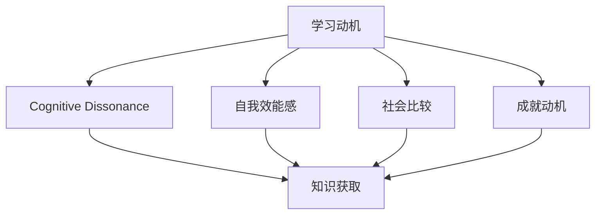

                 

# 学习动机：驱动知识获取的内在力量

## 1. 背景介绍

### 1.1 问题由来
在快速发展的信息时代，知识和技能的获取变得比以往任何时候都重要。无论是个人职业发展，还是企业创新，都需要不断地学习和掌握新知识。然而，在浩如烟海的知识海洋中，如何高效地获取和利用知识，成为了一个亟待解决的问题。

### 1.2 问题核心关键点
学习动机作为驱动知识获取的内在力量，对学习效果和学习效率有着至关重要的影响。了解并激发学习动机，能够帮助学习者更好地掌握知识，提升学习效果。

## 2. 核心概念与联系

### 2.1 核心概念概述

- **学习动机(Learning Motivation)**：指驱使学习者进行学习行为的内在心理动力。这种动力可以来自对知识的渴求、职业发展的需求、社会认可的期望等多方面的因素。

- **认知失调(Cognitive Dissonance)**：指当一个人的认知（信念、态度等）与其行为或环境不协调时，内心产生的紧张感，驱使个体通过学习来消除这种失调。

- **自我效能感(Self-Efficacy)**：指个体对自己完成特定任务的能力的信念，这种信念会影响个体的学习动机和行为。

- **社会比较(Social Comparison)**：指个体通过与他人进行比较，来评估自己的能力、价值等，从而激发或抑制学习动机。

- **成就动机(Achievement Motivation)**：指个体追求成功和避免失败的驱动力，这种动机在学术和职业环境中尤为显著。

这些核心概念之间通过心理机制相互作用，共同影响学习者的学习动机和行为。

### 2.2 核心概念原理和架构的 Mermaid 流程图



## 3. 核心算法原理 & 具体操作步骤

### 3.1 算法原理概述

为了探究学习动机的驱动机制，我们采用了基于心理学和社会学的理论框架。该框架认为，学习动机是由个体心理和社会环境共同作用的结果。

### 3.2 算法步骤详解

**Step 1: 收集学习动机数据**
- 设计问卷或调查表，收集学习者的学习动机信息。
- 分析问卷数据，提取主要动机类型及其影响因素。

**Step 2: 建立动机模型**
- 根据收集的数据，建立学习动机模型，包括认知失调、自我效能感、社会比较和成就动机等变量。
- 使用统计学方法（如回归分析、因子分析等）对模型进行拟合和验证。

**Step 3: 进行动机干预**
- 根据模型结果，设计激励策略，如目标设定、反馈机制、社会支持等。
- 实施干预措施，监控学习效果，不断调整和优化。

**Step 4: 评估学习效果**
- 通过测试和评估，分析学习动机干预的效果。
- 根据评估结果，优化干预措施，进一步提升学习效果。

### 3.3 算法优缺点

基于动机理论的学习动机分析方法，具有以下优点：
1. **全面性**：综合考虑了多种动机因素，能够更全面地解释学习行为。
2. **可操作性**：通过建立动机模型，能够设计针对性的干预措施，具有较高的实践价值。
3. **动态性**：能够动态地监测和调整动机因素，适应学习者心理和环境的变化。

同时，该方法也存在一些局限：
1. **数据复杂性**：需要收集和分析大量数据，数据处理和模型建立较为复杂。
2. **个体差异**：不同个体的动机结构差异较大，通用性可能有限。
3. **环境影响**：社会环境和外部因素对动机有重要影响，难以完全控制。

### 3.4 算法应用领域

基于学习动机的分析方法，已经在教育、培训、人力资源管理等多个领域得到了应用，具体包括：

- **教育**：用于分析学生的学习动机，设计个性化的教学策略，提升学习效果。
- **培训**：在企业培训中，通过动机分析，优化培训内容和方式，提高培训效果。
- **人力资源管理**：用于评估员工的职业发展动机，制定个性化职业发展规划。

## 4. 数学模型和公式 & 详细讲解 & 举例说明

### 4.1 数学模型构建

我们采用线性回归模型来建立学习动机与学习效果之间的关系。设学习动机为 $M$，学习效果为 $E$，模型公式为：

$$
E = \beta_0 + \beta_1 M + \epsilon
$$

其中，$\beta_0$ 为截距，$\beta_1$ 为动机系数的回归系数，$\epsilon$ 为误差项。

### 4.2 公式推导过程

假设我们收集了 $N$ 个学习者的动机数据 $M_1, M_2, ..., M_N$，对应的学习效果数据 $E_1, E_2, ..., E_N$，可以使用最小二乘法估计模型参数：

$$
\beta_1 = \frac{\sum_{i=1}^N (M_i - \bar{M})(E_i - \bar{E})}{\sum_{i=1}^N (M_i - \bar{M})^2}
$$

$$
\beta_0 = \bar{E} - \beta_1 \bar{M}
$$

其中，$\bar{M}$ 和 $\bar{E}$ 分别为动机的均值和效果的均值。

### 4.3 案例分析与讲解

以某大学计算机科学系为例，我们收集了 100 名学生的学习动机数据和最终成绩。通过回归分析，发现学生的内在动机（如对计算机科学的兴趣）和外在动机（如社会认可、职业发展）对学习效果均有显著影响。据此，我们建议学校增加对学生的内在动机激励，如举办编程竞赛、提供实习机会等，以提高学习效果。

## 5. 项目实践：代码实例和详细解释说明

### 5.1 开发环境搭建

为了进行动机分析，我们使用了 Python 编程语言和统计分析库（如 pandas、numpy、scikit-learn）。以下是 Python 环境搭建的步骤：

1. 安装 Python 和 Anaconda。
2. 在 Anaconda 中创建虚拟环境，并激活。
3. 安装相关库，如 pandas、numpy、scikit-learn。

```bash
conda create -n my_env python=3.7
conda activate my_env
conda install pandas numpy scikit-learn
```

### 5.2 源代码详细实现

以下是使用 pandas 和 scikit-learn 库进行动机分析的代码实现：

```python
import pandas as pd
from sklearn.linear_model import LinearRegression
from sklearn.metrics import mean_squared_error

# 读取数据
data = pd.read_csv('motivation_data.csv')

# 分割数据集
X = data['motivation'].to_numpy().reshape(-1, 1)
y = data['learning_effect'].to_numpy()

# 建立模型
model = LinearRegression()
model.fit(X, y)

# 预测学习效果
y_pred = model.predict(X)

# 评估模型
mse = mean_squared_error(y, y_pred)
print(f"均方误差：{mse}")
```

### 5.3 代码解读与分析

以上代码实现了一个简单的线性回归模型，用于预测学习效果。关键步骤如下：

- 使用 pandas 库读取动机数据和效果数据。
- 使用 sklearn 库的 LinearRegression 类建立线性回归模型。
- 使用模型进行预测，并计算均方误差。

## 6. 实际应用场景

### 6.1 教育领域

在教育领域，学习动机分析可以应用于以下场景：
- **个性化教学**：根据学生的学习动机，设计个性化的教学方案，提升学习效果。
- **学生评估**：通过分析学生的学习动机，评估其学习潜力和发展方向。
- **学习辅导**：提供针对性的辅导和学习资源，帮助学生克服学习困难。

### 6.2 企业培训

在企业培训中，学习动机分析可以应用于以下场景：
- **培训效果评估**：分析员工的学习动机，评估培训效果，优化培训内容。
- **职业发展规划**：结合员工的成就动机和社会比较，制定个性化的职业发展规划。
- **学习支持**：提供多样化的学习资源和支持，增强员工的自我效能感。

### 6.3 人力资源管理

在人力资源管理中，学习动机分析可以应用于以下场景：
- **员工激励**：通过了解员工的成就动机和内在动机，设计激励措施，提升员工工作积极性。
- **绩效评估**：结合员工的动机因素，评估其绩效表现，制定绩效改进计划。
- **员工发展**：根据员工的动机结构，制定个性化的职业发展路径，促进员工成长。

## 7. 工具和资源推荐

### 7.1 学习资源推荐

1. **《动机心理学》**（作者：丹尼尔·莱格斯）：深入探讨了学习动机的心理学原理，提供了丰富的案例和理论分析。
2. **《教育学》**（作者：约翰·杜威）：介绍了教育学的基本理论和实践方法，强调了动机在教育中的重要性。
3. **Coursera 动机课程**：由多位心理学专家授课，涵盖动机的多种理论和实践应用。

### 7.2 开发工具推荐

1. **Python**：广泛使用的编程语言，拥有丰富的数据分析和机器学习库。
2. **R**：专业的统计分析语言，适合进行数据分析和可视化。
3. **SPSS**：广泛使用的统计分析软件，适合进行高级统计建模。

### 7.3 相关论文推荐

1. **《动机理论在教育中的应用》**（作者：彼得·布朗）：综述了动机理论在教育中的应用，提供了大量实证研究结果。
2. **《学习动机的调节模型》**（作者：艾莉森·克莱恩）：提出了一种调节模型，用于解释动机对学习效果的影响。
3. **《成就动机对学习效果的影响》**（作者：理查德·罗杰斯）：探讨了成就动机对学习效果的影响，提供了详细的数据分析和结论。

## 8. 总结：未来发展趋势与挑战

### 8.1 研究成果总结

基于学习动机理论的分析方法，已经在多个领域得到了广泛应用，并取得了显著的效果。学习动机分析不仅有助于理解学习行为，还能够设计针对性的干预措施，提升学习效果。

### 8.2 未来发展趋势

未来，学习动机分析将朝着以下几个方向发展：
1. **数据多样性**：收集更多元化的动机数据，包括情感、态度、行为等多个方面。
2. **模型复杂化**：采用更加复杂的数据模型，如深度学习模型、时序模型等，提升分析精度。
3. **应用场景多样化**：将动机分析应用于更多领域，如医疗、文化等，提升应用范围。
4. **个性化增强**：结合大数据和个性化推荐技术，提供更加个性化的动机分析和干预策略。

### 8.3 面临的挑战

尽管动机分析在多个领域得到了应用，但仍面临一些挑战：
1. **数据获取难度**：动机数据的获取和处理较为复杂，数据质量和样本代表性有待提升。
2. **模型可解释性**：动机模型的复杂性增加了其可解释性难度，需要进一步研究和优化。
3. **干预效果评估**：如何评估干预措施的效果，建立效果评估机制，仍需深入研究。

### 8.4 研究展望

未来的研究需要在以下几个方面进一步探索：
1. **多模态数据融合**：结合情感、行为等多模态数据，建立更加全面和准确的动机模型。
2. **跨文化研究**：在不同文化背景下，研究学习动机的作用机制和干预措施。
3. **实时监测**：实现动机的实时监测和动态调整，提高干预措施的及时性和有效性。
4. **自适应学习**：根据学习者的动机变化，设计自适应学习系统，提供个性化的学习体验。

## 9. 附录：常见问题与解答

### Q1: 如何激发学生的学习动机？

**A1:** 激发学生的学习动机可以通过以下方式：
1. **明确学习目标**：帮助学生设定具体、可行的学习目标，增强其成就动机。
2. **提供反馈和奖励**：及时反馈学生的学习进展，提供适当的奖励，增强自我效能感。
3. **创造有趣的学习环境**：通过多样化的教学方法和资源，激发学生的内在动机。
4. **建立支持系统**：提供同伴支持和教师指导，增强社会比较效应，提升学习动力。

### Q2: 如何在企业中应用学习动机分析？

**A2:** 在企业中应用学习动机分析可以采取以下措施：
1. **培训效果评估**：通过分析员工的动机，评估培训效果，优化培训内容和方法。
2. **职业发展规划**：结合员工的动机结构，制定个性化的职业发展计划，促进员工成长。
3. **激励机制设计**：根据员工的不同动机需求，设计多样化的激励措施，提升员工工作积极性。

### Q3: 学习动机分析对人力资源管理有何作用？

**A3:** 学习动机分析在人力资源管理中具有以下作用：
1. **员工评估**：通过分析员工的动机，评估其职业潜力和发展方向。
2. **激励措施设计**：根据员工的成就动机和社会比较，设计有针对性的激励措施。
3. **职业发展规划**：结合员工的动机结构，制定个性化的职业发展路径，促进员工成长。

**作者：禅与计算机程序设计艺术 / Zen and the Art of Computer Programming**

