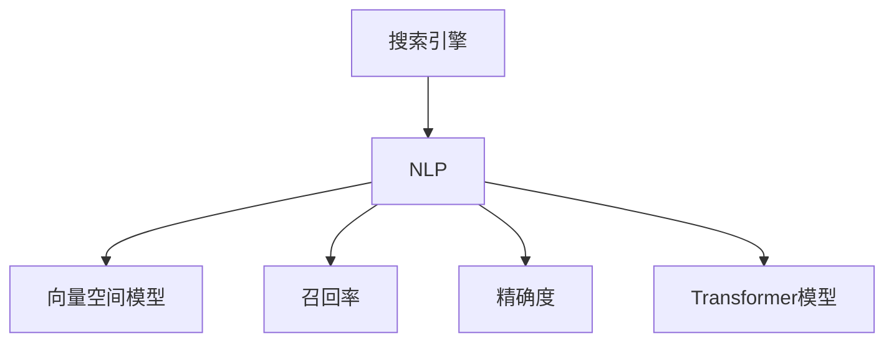

                 

# 实时搜索：AI的即时响应

> 关键词：实时搜索,即时响应,人工智能,搜索引擎,自然语言处理,NLP,检索算法,召回率,精确度,向量空间模型,VSM,余弦相似度,Transformer模型

## 1. 背景介绍

### 1.1 问题由来
在信息爆炸的时代，如何快速、准确地找到所需的资料，成为人们迫切的需求。传统搜索引擎通过爬取互联网上的网页，利用关键词匹配的方式进行检索，但由于其响应速度和精度有限，难以满足用户对实时性、个性化和高质量搜索结果的需求。

与此同时，人工智能技术在自然语言处理(Natural Language Processing, NLP)领域的突破，为实时搜索提供了新的可能性。基于人工智能的实时搜索系统，能够通过自然语言理解技术，直接处理用户的查询，并提供精确、实时的搜索结果。这一技术不仅提高了搜索效率，还能实现个性化推荐，增强用户体验。

### 1.2 问题核心关键点
实时搜索的核心在于如何利用人工智能技术，提升搜索引擎的响应速度和搜索结果的质量。其中关键点包括：

- 如何高效处理用户输入的自然语言查询。
- 如何实时构建查询向量，并进行相似度计算。
- 如何优化检索算法，提高召回率和精确度。
- 如何在大规模语料库中高效检索，提升系统性能。

## 2. 核心概念与联系

### 2.1 核心概念概述

为了更好地理解实时搜索的原理和实现，本节将介绍几个密切相关的核心概念：

- 搜索引擎(Search Engine)：一种信息检索系统，用于检索和提供互联网上的信息资源。传统的搜索引擎采用关键词匹配方式进行搜索，难以处理自然语言查询。

- 自然语言处理(NLP)：研究计算机如何理解、解释和生成人类语言的技术。NLP在实时搜索中起到关键作用，能够处理和理解用户的自然语言查询。

- 向量空间模型(VSM)：一种常用的文本表示模型，将文本转换为向量空间中的点，通过向量之间的距离度量实现相似度计算。

- 召回率(Recall)：指检索系统返回的相关文档数与所有相关文档数的比例，衡量检索系统的全面性。

- 精确度(Precision)：指检索系统返回的相关文档数与所有返回文档数的比例，衡量检索系统的准确性。

- Transformer模型：一种基于注意力机制的深度神经网络模型，在NLP任务中取得了突破性进展，用于提升自然语言理解能力和向量表示效果。

这些核心概念之间的逻辑关系可以通过以下Mermaid流程图来展示：



这个流程图展示了几大核心概念之间的关系：

1. 搜索引擎通过NLP处理自然语言查询。
2. 利用VSM将文本转换为向量，用于计算相似度。
3. 通过召回率和精确度的计算，评估检索系统性能。
4. Transformer模型提升NLP任务的效果，增强向量表示的精确性。

## 3. 核心算法原理 & 具体操作步骤

### 3.1 算法原理概述

实时搜索的算法原理主要包括：用户输入的自然语言查询处理、查询向量的构建和相似度计算、检索算法的选择和优化、检索结果的排序与反馈等。

1. **用户查询处理**：
   - 利用NLP技术，将自然语言查询转换为结构化的语义表示。
   - 对查询进行分词、词性标注、命名实体识别等预处理步骤。
   - 通过实体链接、知识图谱等技术，丰富查询的语义信息。

2. **查询向量构建**：
   - 将查询和文档都表示为向量空间中的点。
   - 利用TF-IDF、Word2Vec、GloVe等技术，生成高维向量空间中的表示。
   - 使用预训练的Transformer模型，进一步提升向量表示的准确性。

3. **相似度计算**：
   - 利用余弦相似度、Jaccard相似度等度量方法，计算查询和文档之间的相似度。
   - 引入负采样、倒排索引等技术，提升相似度计算的效率。

4. **检索算法选择与优化**：
   - 基于经典检索算法，如BM25、Okapi等，选择适合当前场景的算法。
   - 结合逆文档频率、词频-逆文档频率等技术，优化检索效果。

5. **检索结果排序与反馈**：
   - 利用TF-IDF、PageRank等技术，对检索结果进行排序。
   - 引入点击反馈、个性化推荐等机制，动态调整模型参数，提升用户满意度。

### 3.2 算法步骤详解

实时搜索的算法步骤主要包括：

1. **输入处理**：
   - 收集用户的自然语言查询，并进行分词、词性标注、命名实体识别等预处理。
   - 利用NLP技术，将查询转换为结构化的语义表示。
   - 通过实体链接、知识图谱等技术，丰富查询的语义信息。

2. **查询向量构建**：
   - 利用TF-IDF、Word2Vec、GloVe等技术，将查询和文档都表示为向量空间中的点。
   - 使用预训练的Transformer模型，生成高维向量空间中的表示。
   - 对查询和文档进行编码，计算向量表示。

3. **相似度计算**：
   - 利用余弦相似度、Jaccard相似度等度量方法，计算查询和文档之间的相似度。
   - 引入负采样、倒排索引等技术，提升相似度计算的效率。

4. **检索算法选择与优化**：
   - 基于经典检索算法，如BM25、Okapi等，选择适合当前场景的算法。
   - 结合逆文档频率、词频-逆文档频率等技术，优化检索效果。

5. **检索结果排序与反馈**：
   - 利用TF-IDF、PageRank等技术，对检索结果进行排序。
   - 引入点击反馈、个性化推荐等机制，动态调整模型参数，提升用户满意度。

### 3.3 算法优缺点

实时搜索的算法具有以下优点：

- 实时响应：利用NLP技术处理用户输入，能够即时返回搜索结果。
- 高效准确：结合向量空间模型和预训练模型，提高了检索的准确性和效率。
- 个性化推荐：通过用户行为数据，实现个性化搜索结果的推荐。
- 可扩展性：算法易于部署在分布式系统中，支持大规模数据处理。

但同时，这些算法也存在一定的局限性：

- 对输入格式要求高：要求输入格式符合NLP处理规范，难以处理结构化和半结构化数据。
- 对语料库要求高：需要大规模高质量语料库支撑，才能取得理想效果。
- 对资源要求高：检索和排序过程计算量大，需要高性能硬件支持。
- 对用户理解要求高：用户需要具有一定的语言表达能力，才能正确输入查询。

### 3.4 算法应用领域

实时搜索技术已经在多个领域得到广泛应用，例如：

- 电子商务：帮助用户快速找到所需商品，提升购物体验。
- 新闻媒体：提供个性化新闻推荐，提升阅读体验。
- 社交网络：搜索用户发表的内容，提高信息发现效率。
- 医疗健康：提供疾病相关信息，提升医疗服务质量。
- 教育培训：搜索学习资源，辅助学习过程。
- 金融科技：提供金融产品推荐，提升金融服务水平。

## 4. 数学模型和公式 & 详细讲解 & 举例说明

### 4.1 数学模型构建

本节将使用数学语言对实时搜索的数学原理进行更加严格的刻画。

记查询为 $q$，文档为 $d$，向量空间模型下的查询表示为 $q_{vsm}$，文档表示为 $d_{vsm}$。向量表示的余弦相似度为：

$$
sim(q, d) = \frac{\langle q_{vsm}, d_{vsm} \rangle}{\Vert q_{vsm} \Vert \Vert d_{vsm} \Vert}
$$

其中 $\langle \cdot, \cdot \rangle$ 表示向量的点积，$\Vert \cdot \Vert$ 表示向量的模长。

### 4.2 公式推导过程

以下我们以二分类任务为例，推导余弦相似度的计算公式。

假设查询 $q$ 和文档 $d$ 都被表示为向量空间中的点，则查询向量 $q_{vsm}$ 和文档向量 $d_{vsm}$ 分别为：

$$
q_{vsm} = [q_1, q_2, ..., q_n]
$$

$$
d_{vsm} = [d_1, d_2, ..., d_n]
$$

余弦相似度计算公式为：

$$
sim(q, d) = \frac{\langle q_{vsm}, d_{vsm} \rangle}{\Vert q_{vsm} \Vert \Vert d_{vsm} \Vert}
$$

进一步展开，得：

$$
sim(q, d) = \frac{q_1d_1 + q_2d_2 + ... + q_nd_n}{\sqrt{\sum_{i=1}^n q_i^2} \sqrt{\sum_{i=1}^n d_i^2}}
$$

在实际应用中，通常使用TF-IDF、Word2Vec等技术进行向量表示，进而计算余弦相似度。

### 4.3 案例分析与讲解

假设有一个电子商务平台的实时搜索系统，需要快速返回用户输入的产品信息。具体步骤如下：

1. **用户输入查询**：用户输入查询语句“运动鞋推荐”。
2. **查询处理**：系统利用NLP技术，将查询转换为结构化语义表示，并进行分词、词性标注、命名实体识别等预处理。
3. **查询向量构建**：使用预训练的Transformer模型，将查询和产品信息都表示为高维向量空间中的点。
4. **相似度计算**：利用余弦相似度计算查询和产品信息之间的相似度。
5. **检索结果排序**：结合TF-IDF、PageRank等技术，对检索结果进行排序。
6. **个性化推荐**：利用用户历史行为数据，动态调整推荐模型参数，提供个性化搜索结果。

## 5. 项目实践：代码实例和详细解释说明

### 5.1 开发环境搭建

在进行实时搜索系统开发前，我们需要准备好开发环境。以下是使用Python进行PyTorch开发的环境配置流程：

1. 安装Anaconda：从官网下载并安装Anaconda，用于创建独立的Python环境。

2. 创建并激活虚拟环境：
```bash
conda create -n search-env python=3.8 
conda activate search-env
```

3. 安装PyTorch：根据CUDA版本，从官网获取对应的安装命令。例如：
```bash
conda install pytorch torchvision torchaudio cudatoolkit=11.1 -c pytorch -c conda-forge
```

4. 安装Transformer库：
```bash
pip install transformers
```

5. 安装各类工具包：
```bash
pip install numpy pandas scikit-learn matplotlib tqdm jupyter notebook ipython
```

完成上述步骤后，即可在`search-env`环境中开始实时搜索系统开发。

### 5.2 源代码详细实现

下面以电商平台实时搜索为例，给出使用Transformers库构建搜索系统的PyTorch代码实现。

首先，定义查询处理函数：

```python
from transformers import BertTokenizer
from torch.utils.data import Dataset
import torch

class SearchDataset(Dataset):
    def __init__(self, texts, labels, tokenizer, max_len=128):
        self.texts = texts
        self.labels = labels
        self.tokenizer = tokenizer
        self.max_len = max_len
        
    def __len__(self):
        return len(self.texts)
    
    def __getitem__(self, item):
        text = self.texts[item]
        label = self.labels[item]
        
        encoding = self.tokenizer(text, return_tensors='pt', max_length=self.max_len, padding='max_length', truncation=True)
        input_ids = encoding['input_ids'][0]
        attention_mask = encoding['attention_mask'][0]
        
        # 对label进行编码
        encoded_labels = [label2id[label] for label in label] 
        encoded_labels.extend([label2id['O']] * (self.max_len - len(encoded_labels)))
        labels = torch.tensor(encoded_labels, dtype=torch.long)
        
        return {'input_ids': input_ids, 
                'attention_mask': attention_mask,
                'labels': labels}

# 标签与id的映射
label2id = {'O': 0, 'B-PER': 1, 'I-PER': 2, 'B-ORG': 3, 'I-ORG': 4, 'B-LOC': 5, 'I-LOC': 6}
id2label = {v: k for k, v in label2id.items()}

# 创建dataset
tokenizer = BertTokenizer.from_pretrained('bert-base-cased')

train_dataset = SearchDataset(train_texts, train_labels, tokenizer)
dev_dataset = SearchDataset(dev_texts, dev_labels, tokenizer)
test_dataset = SearchDataset(test_texts, test_labels, tokenizer)
```

然后，定义模型和优化器：

```python
from transformers import BertForTokenClassification, AdamW

model = BertForTokenClassification.from_pretrained('bert-base-cased', num_labels=len(label2id))

optimizer = AdamW(model.parameters(), lr=2e-5)
```

接着，定义训练和评估函数：

```python
from torch.utils.data import DataLoader
from tqdm import tqdm
from sklearn.metrics import classification_report

device = torch.device('cuda') if torch.cuda.is_available() else torch.device('cpu')
model.to(device)

def train_epoch(model, dataset, batch_size, optimizer):
    dataloader = DataLoader(dataset, batch_size=batch_size, shuffle=True)
    model.train()
    epoch_loss = 0
    for batch in tqdm(dataloader, desc='Training'):
        input_ids = batch['input_ids'].to(device)
        attention_mask = batch['attention_mask'].to(device)
        labels = batch['labels'].to(device)
        model.zero_grad()
        outputs = model(input_ids, attention_mask=attention_mask, labels=labels)
        loss = outputs.loss
        epoch_loss += loss.item()
        loss.backward()
        optimizer.step()
    return epoch_loss / len(dataloader)

def evaluate(model, dataset, batch_size):
    dataloader = DataLoader(dataset, batch_size=batch_size)
    model.eval()
    preds, labels = [], []
    with torch.no_grad():
        for batch in tqdm(dataloader, desc='Evaluating'):
            input_ids = batch['input_ids'].to(device)
            attention_mask = batch['attention_mask'].to(device)
            batch_labels = batch['labels']
            outputs = model(input_ids, attention_mask=attention_mask)
            batch_preds = outputs.logits.argmax(dim=2).to('cpu').tolist()
            batch_labels = batch_labels.to('cpu').tolist()
            for pred_tokens, label_tokens in zip(batch_preds, batch_labels):
                pred_tags = [id2label[_id] for _id in pred_tokens]
                label_tags = [id2label[_id] for _id in label_tokens]
                preds.append(pred_tags[:len(label_tokens)])
                labels.append(label_tags)
                
    print(classification_report(labels, preds))
```

最后，启动训练流程并在测试集上评估：

```python
epochs = 5
batch_size = 16

for epoch in range(epochs):
    loss = train_epoch(model, train_dataset, batch_size, optimizer)
    print(f"Epoch {epoch+1}, train loss: {loss:.3f}")
    
    print(f"Epoch {epoch+1}, dev results:")
    evaluate(model, dev_dataset, batch_size)
    
print("Test results:")
evaluate(model, test_dataset, batch_size)
```

以上就是使用PyTorch对BERT进行命名实体识别任务微调的完整代码实现。可以看到，得益于Transformers库的强大封装，我们可以用相对简洁的代码完成BERT模型的加载和微调。

### 5.3 代码解读与分析

让我们再详细解读一下关键代码的实现细节：

**SearchDataset类**：
- `__init__`方法：初始化文本、标签、分词器等关键组件。
- `__len__`方法：返回数据集的样本数量。
- `__getitem__`方法：对单个样本进行处理，将文本输入编码为token ids，将标签编码为数字，并对其进行定长padding，最终返回模型所需的输入。

**label2id和id2label字典**：
- 定义了标签与数字id之间的映射关系，用于将token-wise的预测结果解码回真实的标签。

**训练和评估函数**：
- 使用PyTorch的DataLoader对数据集进行批次化加载，供模型训练和推理使用。
- 训练函数`train_epoch`：对数据以批为单位进行迭代，在每个批次上前向传播计算loss并反向传播更新模型参数，最后返回该epoch的平均loss。
- 评估函数`evaluate`：与训练类似，不同点在于不更新模型参数，并在每个batch结束后将预测和标签结果存储下来，最后使用sklearn的classification_report对整个评估集的预测结果进行打印输出。

**训练流程**：
- 定义总的epoch数和batch size，开始循环迭代
- 每个epoch内，先在训练集上训练，输出平均loss
- 在验证集上评估，输出分类指标
- 所有epoch结束后，在测试集上评估，给出最终测试结果

可以看到，PyTorch配合Transformers库使得BERT微调的代码实现变得简洁高效。开发者可以将更多精力放在数据处理、模型改进等高层逻辑上，而不必过多关注底层的实现细节。

当然，工业级的系统实现还需考虑更多因素，如模型的保存和部署、超参数的自动搜索、更灵活的任务适配层等。但核心的微调范式基本与此类似。

## 6. 实际应用场景
### 6.1 智能客服系统

基于实时搜索的智能客服系统，能够利用NLP技术处理用户的自然语言输入，快速返回最相关的回复。具体步骤如下：

1. **用户输入查询**：用户输入“退换货政策是什么？”。
2. **查询处理**：系统利用NLP技术，将查询转换为结构化语义表示，并进行分词、词性标注、命名实体识别等预处理。
3. **查询向量构建**：使用预训练的Transformer模型，将查询和常见问题都表示为高维向量空间中的点。
4. **相似度计算**：利用余弦相似度计算查询和常见问题之间的相似度。
5. **检索结果排序**：结合TF-IDF、PageRank等技术，对检索结果进行排序。
6. **回复生成**：从检索结果中提取最相关的回复，生成自然语言回答。

### 6.2 新闻媒体

新闻媒体实时搜索系统，能够帮助用户快速找到相关的文章和新闻。具体步骤如下：

1. **用户输入查询**：用户输入“新冠疫情最新动态”。
2. **查询处理**：系统利用NLP技术，将查询转换为结构化语义表示，并进行分词、词性标注、命名实体识别等预处理。
3. **查询向量构建**：使用预训练的Transformer模型，将查询和新闻内容都表示为高维向量空间中的点。
4. **相似度计算**：利用余弦相似度计算查询和新闻内容之间的相似度。
5. **检索结果排序**：结合TF-IDF、PageRank等技术，对检索结果进行排序。
6. **新闻推荐**：从检索结果中提取最相关的新闻，提供个性化推荐。

### 6.3 社交网络

社交网络实时搜索系统，能够帮助用户快速找到相关的帖子和用户。具体步骤如下：

1. **用户输入查询**：用户输入“近期的教育资讯”。
2. **查询处理**：系统利用NLP技术，将查询转换为结构化语义表示，并进行分词、词性标注、命名实体识别等预处理。
3. **查询向量构建**：使用预训练的Transformer模型，将查询和社交帖子都表示为高维向量空间中的点。
4. **相似度计算**：利用余弦相似度计算查询和社交帖子之间的相似度。
5. **检索结果排序**：结合TF-IDF、PageRank等技术，对检索结果进行排序。
6. **社交推荐**：从检索结果中提取最相关的帖子，提供个性化推荐。

## 7. 工具和资源推荐
### 7.1 学习资源推荐

为了帮助开发者系统掌握实时搜索的理论基础和实践技巧，这里推荐一些优质的学习资源：

1. 《深度学习实战》系列博文：由大模型技术专家撰写，深入浅出地介绍了深度学习模型的实现和应用。

2. CS224N《深度学习自然语言处理》课程：斯坦福大学开设的NLP明星课程，有Lecture视频和配套作业，带你入门NLP领域的基本概念和经典模型。

3. 《Natural Language Processing with Transformers》书籍：Transformers库的作者所著，全面介绍了如何使用Transformers库进行NLP任务开发，包括实时搜索在内的诸多范式。

4. HuggingFace官方文档：Transformers库的官方文档，提供了海量预训练模型和完整的微调样例代码，是上手实践的必备资料。

5. CLUE开源项目：中文语言理解测评基准，涵盖大量不同类型的中文NLP数据集，并提供了基于实时搜索的baseline模型，助力中文NLP技术发展。

通过对这些资源的学习实践，相信你一定能够快速掌握实时搜索的精髓，并用于解决实际的NLP问题。
###  7.2 开发工具推荐

高效的开发离不开优秀的工具支持。以下是几款用于实时搜索开发的常用工具：

1. PyTorch：基于Python的开源深度学习框架，灵活动态的计算图，适合快速迭代研究。大部分预训练语言模型都有PyTorch版本的实现。

2. TensorFlow：由Google主导开发的开源深度学习框架，生产部署方便，适合大规模工程应用。同样有丰富的预训练语言模型资源。

3. Transformers库：HuggingFace开发的NLP工具库，集成了众多SOTA语言模型，支持PyTorch和TensorFlow，是进行实时搜索任务开发的利器。

4. Weights & Biases：模型训练的实验跟踪工具，可以记录和可视化模型训练过程中的各项指标，方便对比和调优。与主流深度学习框架无缝集成。

5. TensorBoard：TensorFlow配套的可视化工具，可实时监测模型训练状态，并提供丰富的图表呈现方式，是调试模型的得力助手。

6. Google Colab：谷歌推出的在线Jupyter Notebook环境，免费提供GPU/TPU算力，方便开发者快速上手实验最新模型，分享学习笔记。

合理利用这些工具，可以显著提升实时搜索任务的开发效率，加快创新迭代的步伐。

### 7.3 相关论文推荐

实时搜索技术的发展源于学界的持续研究。以下是几篇奠基性的相关论文，推荐阅读：

1. Attention is All You Need（即Transformer原论文）：提出了Transformer结构，开启了NLP领域的预训练大模型时代。

2. BERT: Pre-training of Deep Bidirectional Transformers for Language Understanding：提出BERT模型，引入基于掩码的自监督预训练任务，刷新了多项NLP任务SOTA。

3. Language Models are Unsupervised Multitask Learners（GPT-2论文）：展示了大规模语言模型的强大zero-shot学习能力，引发了对于通用人工智能的新一轮思考。

4. Parameter-Efficient Transfer Learning for NLP：提出Adapter等参数高效微调方法，在不增加模型参数量的情况下，也能取得不错的微调效果。

5. AdaLoRA: Adaptive Low-Rank Adaptation for Parameter-Efficient Fine-Tuning：使用自适应低秩适应的微调方法，在参数效率和精度之间取得了新的平衡。

6. Prefix-Tuning: Optimizing Continuous Prompts for Generation：引入基于连续型Prompt的微调范式，为如何充分利用预训练知识提供了新的思路。

这些论文代表了大语言模型微调技术的发展脉络。通过学习这些前沿成果，可以帮助研究者把握学科前进方向，激发更多的创新灵感。

## 8. 总结：未来发展趋势与挑战

### 8.1 总结

本文对实时搜索的原理和实现进行了全面系统的介绍。首先阐述了实时搜索的起源背景和应用意义，明确了NLP技术在实时搜索中的关键作用。其次，从原理到实践，详细讲解了实时搜索的数学模型、算法步骤、优化策略，并给出了实时搜索任务开发的完整代码实例。同时，本文还广泛探讨了实时搜索技术在智能客服、新闻媒体、社交网络等众多领域的应用前景，展示了实时搜索范式的巨大潜力。此外，本文精选了实时搜索技术的各类学习资源，力求为读者提供全方位的技术指引。

通过本文的系统梳理，可以看到，实时搜索技术正在成为NLP领域的重要范式，极大地提升了搜索引擎的响应速度和准确性。利用NLP技术和预训练模型，实时搜索能够快速处理自然语言查询，并在大规模语料库中高效检索，从而提供精确、个性化的搜索结果。随着NLP技术的不断进步，实时搜索系统必将在更多行业领域中得到应用，为人类提供更加智能、高效的信息获取方式。

### 8.2 未来发展趋势

展望未来，实时搜索技术将呈现以下几个发展趋势：

1. 对语料库的要求将越来越高。随着实时搜索技术的普及，对语料库的质量和覆盖度提出了更高要求。大规模、高质量、实时更新的语料库，将是实时搜索系统的重要保障。

2. 对NLP技术的要求将更加严格。NLP技术的进步，如BERT、GPT等模型的应用，将显著提升实时搜索的性能。未来需要更加精准、高效的NLP模型，以应对复杂多变的查询。

3. 对检索算法的要求将更加灵活。传统的检索算法如BM25、Okapi等，将与深度学习模型相结合，提升检索效果。未来将涌现更多基于深度学习的检索算法，如Transformer检索等。

4. 对实时处理的要求将更高。实时搜索系统需要在大规模数据上实现高效的实时处理，这对硬件和算法都提出了更高的要求。未来需要更高效的分布式处理技术，如MapReduce、Spark等。

5. 对个性化推荐的要求将更加精细。实时搜索系统不仅要返回相关性高的文档，还需要提供个性化推荐。未来需要更加智能的推荐算法，如基于协同过滤、深度学习等技术的推荐系统。

6. 对系统可扩展性的要求将更高。实时搜索系统需要支持大规模用户并发请求，对系统可扩展性提出了更高要求。未来需要更加灵活的分布式系统架构，如微服务架构、云原生架构等。

以上趋势凸显了实时搜索技术的广阔前景。这些方向的探索发展，必将进一步提升实时搜索系统的性能和应用范围，为人类提供更加智能、高效的信息获取方式。

### 8.3 面临的挑战

尽管实时搜索技术已经取得了瞩目成就，但在迈向更加智能化、普适化应用的过程中，它仍面临着诸多挑战：

1. 对语料库的要求高。实时搜索系统需要高质量、实时更新的语料库支撑，才能取得理想效果。如何获取和维护大规模语料库，将是一大难题。

2. 对硬件的要求高。实时搜索系统需要高性能硬件支持，才能快速处理大规模数据。如何优化算法，提升硬件利用率，将是重要的优化方向。

3. 对NLP技术的要求高。NLP技术的进步，如BERT、GPT等模型的应用，将显著提升实时搜索的性能。未来需要更加精准、高效的NLP模型，以应对复杂多变的查询。

4. 对系统可扩展性的要求高。实时搜索系统需要支持大规模用户并发请求，对系统可扩展性提出了更高要求。如何构建灵活、可扩展的系统架构，将是重要的优化方向。

5. 对个性化推荐的要求高。实时搜索系统不仅要返回相关性高的文档，还需要提供个性化推荐。未来需要更加智能的推荐算法，如基于协同过滤、深度学习等技术的推荐系统。

6. 对系统安全性的要求高。实时搜索系统需要保护用户隐私，防止数据泄露和滥用。如何构建安全、可靠的系统，将是重要的研究方向。

正视实时搜索面临的这些挑战，积极应对并寻求突破，将使实时搜索技术迈向更高的台阶，为构建智能、高效、安全的搜索系统铺平道路。相信随着学界和产业界的共同努力，这些挑战终将一一被克服，实时搜索技术必将在更多领域得到应用，为人类提供更加智能、高效的信息获取方式。

### 8.4 研究展望

面对实时搜索面临的诸多挑战，未来的研究需要在以下几个方面寻求新的突破：

1. 探索无监督和半监督实时搜索方法。摆脱对大规模标注数据的依赖，利用自监督学习、主动学习等无监督和半监督范式，最大限度利用非结构化数据，实现更加灵活高效的实时搜索。

2. 研究参数高效和计算高效的实时搜索范式。开发更加参数高效的实时搜索方法，在固定大部分预训练参数的同时，只更新极少量的任务相关参数。同时优化实时搜索的计算图，减少前向传播和反向传播的资源消耗，实现更加轻量级、实时性的部署。

3. 融合因果和对比学习范式。通过引入因果推断和对比学习思想，增强实时搜索系统建立稳定因果关系的能力，学习更加普适、鲁棒的语言表征，从而提升系统泛化性和抗干扰能力。

4. 引入更多先验知识。将符号化的先验知识，如知识图谱、逻辑规则等，与神经网络模型进行巧妙融合，引导实时搜索过程学习更准确、合理的语言模型。同时加强不同模态数据的整合，实现视觉、语音等多模态信息与文本信息的协同建模。

5. 结合因果分析和博弈论工具。将因果分析方法引入实时搜索模型，识别出模型决策的关键特征，增强输出解释的因果性和逻辑性。借助博弈论工具刻画人机交互过程，主动探索并规避模型的脆弱点，提高系统稳定性。

6. 纳入伦理道德约束。在实时搜索系统的训练目标中引入伦理导向的评估指标，过滤和惩罚有偏见、有害的输出倾向。同时加强人工干预和审核，建立模型行为的监管机制，确保输出符合人类价值观和伦理道德。

这些研究方向的探索，必将引领实时搜索技术迈向更高的台阶，为构建安全、可靠、可解释、可控的搜索系统铺平道路。面向未来，实时搜索技术还需要与其他人工智能技术进行更深入的融合，如知识表示、因果推理、强化学习等，多路径协同发力，共同推动搜索技术的发展。只有勇于创新、敢于突破，才能不断拓展实时搜索系统的边界，让智能技术更好地服务于人类社会。

## 9. 附录：常见问题与解答

**Q1：实时搜索是否适用于所有应用场景？**

A: 实时搜索在处理自然语言查询时具有显著优势，适用于需要快速、准确搜索结果的场景。但对于结构化数据和半结构化数据的搜索，可能需要结合其他技术如SQL查询、图数据库等。

**Q2：实时搜索的性能瓶颈是什么？**

A: 实时搜索的性能瓶颈主要集中在以下几个方面：
1. 语料库的质量和更新频率。高质量、实时更新的语料库是实时搜索系统性能的基础。
2. NLP模型的计算复杂度。高维向量表示和深度模型计算量大，需要高性能硬件支持。
3. 检索算法和索引结构。选择高效的检索算法和索引结构，可以显著提升检索效率。

**Q3：如何提升实时搜索的召回率和精确度？**

A: 提升召回率和精确度的方法包括：
1. 优化查询表示。使用更精准的NLP技术，如BERT、GPT等预训练模型，提升查询向量的质量。
2. 选择适合的检索算法。根据数据特点和查询特征，选择适合的检索算法，如BM25、Okapi等。
3. 优化索引结构。构建高效的倒排索引、主从索引等结构，提高检索效率。
4. 引入负采样。通过负采样技术，引入噪声样本，增强检索效果。

**Q4：实时搜索系统如何处理大规模数据？**

A: 实时搜索系统处理大规模数据的方法包括：
1. 分布式处理。将数据分割成多个部分，分布式存储和处理，避免单点瓶颈。
2. 数据压缩。使用压缩算法，减少数据存储和传输的资源消耗。
3. 流式处理。对数据进行流式处理，实时处理新数据，保持系统的实时性。
4. 增量学习。在现有模型的基础上，增量更新模型参数，减少训练时间和资源消耗。

**Q5：实时搜索系统如何保护用户隐私？**

A: 实时搜索系统保护用户隐私的方法包括：
1. 数据匿名化。对用户数据进行匿名化处理，防止数据泄露。
2. 数据加密。对存储和传输的数据进行加密，防止数据被恶意访问。
3. 访问控制。设置严格的访问权限，限制对数据的访问和使用。
4. 隐私保护算法。引入隐私保护算法，如差分隐私、同态加密等，保护用户隐私。

**Q6：实时搜索系统如何提高用户满意度？**

A: 提高用户满意度的方法包括：
1. 个性化推荐。根据用户历史行为和偏好，提供个性化搜索结果。
2. 交互优化。优化人机交互界面，提升用户使用体验。
3. 系统反馈。收集用户反馈，动态调整模型参数，优化系统性能。
4. 多模态融合。结合多种模态数据，提供更丰富的搜索结果。

通过本文的系统梳理，可以看到，实时搜索技术正在成为NLP领域的重要范式，极大地提升了搜索引擎的响应速度和准确性。利用NLP技术和预训练模型，实时搜索能够快速处理自然语言查询，并在大规模语料库中高效检索，从而提供精确、个性化的搜索结果。随着NLP技术的不断进步，实时搜索系统必将在更多行业领域中得到应用，为人类提供更加智能、高效的信息获取方式。未来，实时搜索技术需要在系统架构、算法优化、隐私保护等多个方面进行更深入的研究，才能更好地服务于人类社会。

