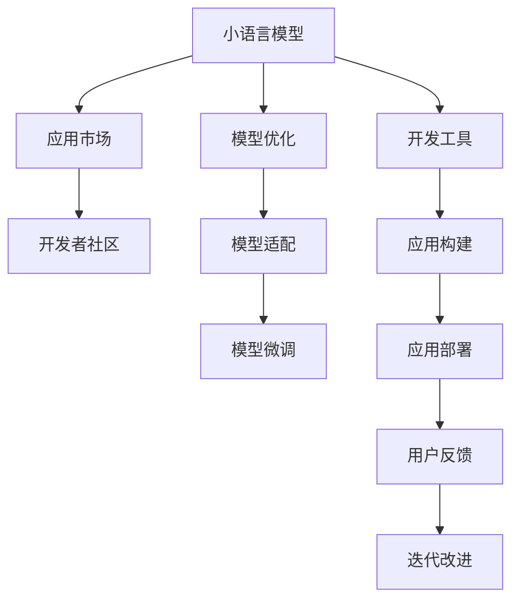

                 

# 小语言模型的应用开发生态:开发工具和应用市场

> 关键词：小语言模型, 开发工具, 应用市场, 生态系统, 机器学习, 自然语言处理(NLP)

## 1. 背景介绍

### 1.1 问题由来
随着人工智能技术的迅猛发展，小语言模型（Small Language Models, SLMs）在自然语言处理（Natural Language Processing, NLP）等领域展示了巨大的潜力。这些小模型通常具有较少的参数量（百万级别），但依然能够具备较强的语言理解和生成能力。然而，小模型往往在规模和功能上不及大模型（如BERT、GPT等），因此在应用开发和市场推广上存在一定的局限性。

为了克服这些局限性，开发工具和应用市场逐渐形成了围绕小语言模型的生态系统，帮助开发者更高效地利用这些小模型进行NLP任务的开发和部署。

### 1.2 问题核心关键点
小语言模型生态系统包括多个方面，从开发工具到应用市场，每个环节都对小模型的应用开发和推广起着至关重要的作用。

- **开发工具**：包括编译器、解释器、库函数等，帮助开发者快速构建基于小语言模型的应用。
- **应用市场**：如GitHub、Kaggle等平台，提供小模型和相关资源，促进开发者之间的交流与合作。
- **开发者社区**：通过论坛、博客、研讨会等形式，分享知识、交流经验，形成良性互动。

这些关键点共同构成了小语言模型的应用开发生态系统，使得小模型能够被更广泛地应用和推广。

### 1.3 问题研究意义
研究小语言模型的应用开发生态系统，对于推动小模型在NLP领域的应用，提升模型开发效率，加速NLP技术的产业化进程，具有重要意义：

1. 降低应用开发成本。利用小模型可以快速构建高性能NLP应用，减少从头开发所需的数据、计算和人力等成本投入。
2. 提升模型效果。小模型通过微调或适配，能够快速适应特定任务，在应用场景中取得更好的表现。
3. 加速开发进度。通过小模型的应用开发工具和市场，开发者可以快速构建和部署NLP应用，缩短开发周期。
4. 赋能产业升级。小模型技术容易被各行各业所采用，为传统行业数字化转型升级提供新的技术路径。

## 2. 核心概念与联系

### 2.1 核心概念概述

为了更好地理解小语言模型的应用开发生态系统，本节将介绍几个核心概念：

- **小语言模型（SLMs）**：指具有百万级参数量，能够进行基本语言理解和生成的小型神经网络模型，如RoBERTa、AlBERT等。
- **开发工具**：包括IDE、编译器、库函数等，帮助开发者快速构建基于小语言模型的应用。
- **应用市场**：如GitHub、Kaggle等平台，提供小模型和相关资源，促进开发者之间的交流与合作。
- **开发者社区**：通过论坛、博客、研讨会等形式，分享知识、交流经验，形成良性互动。

这些核心概念之间的逻辑关系可以通过以下Mermaid流程图来展示：



这个流程图展示了大语言模型的核心概念及其之间的关系：

1. 小语言模型通过开发工具被构建和部署。
2. 应用市场提供小模型和相关资源，促进开发者之间的交流与合作。
3. 开发者社区通过知识分享和经验交流，进一步提升小模型的应用价值。
4. 小模型通过模型优化、适配和微调，提升在特定任务上的性能。
5. 应用构建和部署后，通过用户反馈不断迭代改进，形成良性循环。

这些概念共同构成了小语言模型的应用开发生态系统，使其能够在各种场景下发挥强大的语言理解和生成能力。通过理解这些核心概念，我们可以更好地把握小语言模型的应用开发过程。

## 3. 核心算法原理 & 具体操作步骤
### 3.1 算法原理概述

小语言模型的应用开发生态系统，本质上是一个从模型构建到应用部署的全链条流程。其核心思想是：利用小语言模型进行任务特定化，通过优化工具和市场支持，将模型高效地应用于实际问题。

形式化地，假设小语言模型为 $M_{\theta}$，其中 $\theta$ 为模型参数。在开发工具的支持下，通过应用市场获取到适合任务的小模型 $M_{\theta_0}$，进行适配、微调等优化操作，最终得到针对特定任务优化的模型 $M_{\hat{\theta}}$。具体流程如下：

1. **模型获取**：通过应用市场或开发者社区获取小模型 $M_{\theta_0}$。
2. **模型适配**：根据任务需求，对 $M_{\theta_0}$ 进行适当的调整和扩展。
3. **模型微调**：利用少量标注数据，对 $M_{\theta_0}$ 进行有监督学习，提升模型在特定任务上的性能。
4. **应用构建**：使用开发工具构建基于 $M_{\hat{\theta}}$ 的应用程序。
5. **应用部署**：将构建的应用程序部署到实际应用场景中。
6. **反馈迭代**：根据用户反馈，不断优化模型和应用程序，实现持续改进。

### 3.2 算法步骤详解

小语言模型应用开发的详细步骤包括：

**Step 1: 选择合适的开发工具**
- 选择合适的IDE（如PyCharm、Visual Studio Code等）和开发框架（如TensorFlow、PyTorch等）。
- 安装相关依赖库和API接口，准备进行应用构建。

**Step 2: 获取和适配小模型**
- 从应用市场或开发者社区获取适合任务的小模型 $M_{\theta_0}$。
- 根据任务需求，对 $M_{\theta_0}$ 进行适配，如添加或修改层、调整参数等。

**Step 3: 进行模型微调**
- 收集少量标注数据，使用有监督学习算法（如梯度下降等）对 $M_{\theta_0}$ 进行微调，得到 $M_{\hat{\theta}}$。
- 选择合适的优化器、学习率、正则化技术等，以防止过拟合。

**Step 4: 构建应用程序**
- 使用开发工具构建基于 $M_{\hat{\theta}}$ 的应用程序，如聊天机器人、情感分析系统等。
- 集成相关的后端服务和前端界面，确保应用程序的稳定性和可用性。

**Step 5: 部署应用程序**
- 将构建的应用程序部署到服务器或云平台，提供API接口供用户调用。
- 设置自动化部署流程，确保应用程序的持续更新和优化。

**Step 6: 收集用户反馈**
- 通过日志、用户反馈等方式，收集应用程序的使用情况和性能数据。
- 根据用户反馈，不断优化模型和应用程序，实现持续改进。

### 3.3 算法优缺点

小语言模型的应用开发生态系统具有以下优点：
1. 轻量高效。小模型参数量少，计算资源占用低，推理速度快，适合实时应用。
2. 开发便捷。开发者可以通过丰富的开发工具和资源，快速构建应用，缩短开发周期。
3. 易用性强。小模型和相关工具、市场都较为成熟，降低了技术门槛，便于推广应用。
4. 应用广泛。小模型能够应用于众多NLP任务，如问答、翻译、摘要等，覆盖面广。

同时，该方法也存在一定的局限性：
1. 性能有限。小模型的参数量有限，难以处理复杂语言现象，在特定任务上可能表现不如大模型。
2. 数据依赖高。小模型的训练和微调高度依赖标注数据，标注数据量不足会影响性能。
3. 鲁棒性不足。小模型对输入噪声和领域变化敏感，泛化能力较弱。
4. 可解释性差。小模型作为黑盒，难以解释其内部工作机制，缺乏可解释性。

尽管存在这些局限性，但小语言模型的应用开发生态系统仍然是大模型应用的重要补充，为NLP技术落地应用提供了新的路径。

### 3.4 算法应用领域

小语言模型的应用开发生态系统已经广泛应用于NLP领域的多个任务，包括但不限于：

- 文本分类：如情感分析、主题分类等。通过小模型的微调，可以快速构建高精度的分类模型。
- 命名实体识别：识别文本中的人名、地名、机构名等特定实体。小模型在标注数据较少的任务中表现良好。
- 关系抽取：从文本中抽取实体之间的语义关系。通过小模型的适配和微调，能够实现较准确的关系抽取。
- 问答系统：对自然语言问题给出答案。使用小模型作为问答引擎，可以快速构建智能问答系统。
- 机器翻译：将源语言文本翻译成目标语言。小模型能够处理小规模语料，适合特定语言对的翻译任务。
- 文本摘要：将长文本压缩成简短摘要。小模型可以通过微调，学习关键信息提取和摘要生成。

除了上述这些经典任务外，小语言模型还被创新性地应用到更多场景中，如可控文本生成、信息检索、对话系统等，为NLP技术带来了新的突破。

## 4. 数学模型和公式 & 详细讲解 & 举例说明
### 4.1 数学模型构建

假设小语言模型为 $M_{\theta}$，其中 $\theta$ 为模型参数。在开发工具的支持下，通过应用市场获取到适合任务的小模型 $M_{\theta_0}$，进行适配和微调，最终得到针对特定任务优化的模型 $M_{\hat{\theta}}$。

小模型的微调过程可以看作是有监督学习问题。假设训练集为 $D=\{(x_i,y_i)\}_{i=1}^N, x_i \in \mathcal{X}, y_i \in \mathcal{Y}$，其中 $x_i$ 为输入文本，$y_i$ 为对应的标签。定义模型 $M_{\theta}$ 在输入 $x$ 上的损失函数为 $\ell(M_{\theta}(x),y)$，则在数据集 $D$ 上的经验风险为：

$$
\mathcal{L}(\theta) = \frac{1}{N} \sum_{i=1}^N \ell(M_{\theta}(x_i),y_i)
$$

微调的优化目标是最小化经验风险，即找到最优参数：

$$
\theta^* = \mathop{\arg\min}_{\theta} \mathcal{L}(\theta)
$$

在实践中，我们通常使用基于梯度的优化算法（如SGD、Adam等）来近似求解上述最优化问题。设 $\eta$ 为学习率，$\lambda$ 为正则化系数，则参数的更新公式为：

$$
\theta \leftarrow \theta - \eta \nabla_{\theta}\mathcal{L}(\theta) - \eta\lambda\theta
$$

其中 $\nabla_{\theta}\mathcal{L}(\theta)$ 为损失函数对参数 $\theta$ 的梯度，可通过反向传播算法高效计算。

### 4.2 公式推导过程

以下我们以二分类任务为例，推导交叉熵损失函数及其梯度的计算公式。

假设模型 $M_{\theta}$ 在输入 $x$ 上的输出为 $\hat{y}=M_{\theta}(x) \in [0,1]$，表示样本属于正类的概率。真实标签 $y \in \{0,1\}$。则二分类交叉熵损失函数定义为：

$$
\ell(M_{\theta}(x),y) = -[y\log \hat{y} + (1-y)\log (1-\hat{y})]
$$

将其代入经验风险公式，得：

$$
\mathcal{L}(\theta) = -\frac{1}{N}\sum_{i=1}^N [y_i\log M_{\theta}(x_i)+(1-y_i)\log(1-M_{\theta}(x_i))]
$$

根据链式法则，损失函数对参数 $\theta_k$ 的梯度为：

$$
\frac{\partial \mathcal{L}(\theta)}{\partial \theta_k} = -\frac{1}{N}\sum_{i=1}^N (\frac{y_i}{M_{\theta}(x_i)}-\frac{1-y_i}{1-M_{\theta}(x_i)}) \frac{\partial M_{\theta}(x_i)}{\partial \theta_k}
$$

其中 $\frac{\partial M_{\theta}(x_i)}{\partial \theta_k}$ 可进一步递归展开，利用自动微分技术完成计算。

在得到损失函数的梯度后，即可带入参数更新公式，完成模型的迭代优化。重复上述过程直至收敛，最终得到适应下游任务的最优模型参数 $\theta^*$。

### 4.3 案例分析与讲解

以命名实体识别（Named Entity Recognition, NER）任务为例，我们通过小模型RoBERTa进行微调。具体步骤如下：

**Step 1: 准备数据集**
- 收集标注好的NER数据集，如CoNLL-2003、NERP等。
- 将数据集划分为训练集、验证集和测试集。

**Step 2: 适配模型**
- 在RoBERTa模型的顶层添加线性分类器和交叉熵损失函数。
- 设置模型适配层，将RoBERTa输出的隐层表示映射到标签空间。

**Step 3: 模型微调**
- 将标注数据集分为训练集和验证集。
- 使用梯度下降算法对模型进行微调，设定合适的学习率和批大小。
- 在验证集上评估模型性能，选择合适的参数进行微调。

**Step 4: 构建应用程序**
- 使用Python开发框架如Flask或FastAPI构建API接口，供用户调用。
- 集成相关后端服务和前端界面，确保应用程序的稳定性和可用性。

**Step 5: 部署应用程序**
- 将构建的应用程序部署到服务器或云平台，提供API接口供用户调用。
- 设置自动化部署流程，确保应用程序的持续更新和优化。

**Step 6: 收集用户反馈**
- 通过日志、用户反馈等方式，收集应用程序的使用情况和性能数据。
- 根据用户反馈，不断优化模型和应用程序，实现持续改进。

通过以上步骤，我们可以快速构建基于小语言模型的NER应用。下面以代码形式展示RoBERTa NER模型的微调过程：

```python
from transformers import RobertaForTokenClassification, RobertaTokenizer, AdamW
from torch.utils.data import Dataset, DataLoader
from sklearn.metrics import classification_report

class NERDataset(Dataset):
    def __init__(self, texts, tags):
        self.texts = texts
        self.tags = tags
        self.tokenizer = RobertaTokenizer.from_pretrained('roberta-base')
        self.max_len = 512

    def __len__(self):
        return len(self.texts)

    def __getitem__(self, item):
        text = self.texts[item]
        tag = self.tags[item]
        encoding = self.tokenizer(text, return_tensors='pt', max_length=self.max_len, padding='max_length', truncation=True)
        input_ids = encoding['input_ids'][0]
        attention_mask = encoding['attention_mask'][0]
        labels = [tag2id[tag] for tag in tag] + [tag2id['O']] * (self.max_len - len(tag))
        return {'input_ids': input_ids, 'attention_mask': attention_mask, 'labels': torch.tensor(labels, dtype=torch.long)}

# 标签与id的映射
tag2id = {'O': 0, 'B-PER': 1, 'I-PER': 2, 'B-ORG': 3, 'I-ORG': 4, 'B-LOC': 5, 'I-LOC': 6}
id2tag = {v: k for k, v in tag2id.items()}

# 创建dataset
tokenizer = RobertaTokenizer.from_pretrained('roberta-base')

train_dataset = NERDataset(train_texts, train_tags)
dev_dataset = NERDataset(dev_texts, dev_tags)
test_dataset = NERDataset(test_texts, test_tags)

# 定义模型和优化器
model = RobertaForTokenClassification.from_pretrained('roberta-base', num_labels=len(tag2id))
optimizer = AdamW(model.parameters(), lr=2e-5)

# 定义训练和评估函数
device = torch.device('cuda' if torch.cuda.is_available() else 'cpu')
model.to(device)

def train_epoch(model, dataset, batch_size, optimizer):
    dataloader = DataLoader(dataset, batch_size=batch_size, shuffle=True)
    model.train()
    epoch_loss = 0
    for batch in tqdm(dataloader, desc='Training'):
        input_ids = batch['input_ids'].to(device)
        attention_mask = batch['attention_mask'].to(device)
        labels = batch['labels'].to(device)
        model.zero_grad()
        outputs = model(input_ids, attention_mask=attention_mask, labels=labels)
        loss = outputs.loss
        epoch_loss += loss.item()
        loss.backward()
        optimizer.step()
    return epoch_loss / len(dataloader)

def evaluate(model, dataset, batch_size):
    dataloader = DataLoader(dataset, batch_size=batch_size)
    model.eval()
    preds, labels = [], []
    with torch.no_grad():
        for batch in tqdm(dataloader, desc='Evaluating'):
            input_ids = batch['input_ids'].to(device)
            attention_mask = batch['attention_mask'].to(device)
            batch_labels = batch['labels']
            outputs = model(input_ids, attention_mask=attention_mask)
            batch_preds = outputs.logits.argmax(dim=2).to('cpu').tolist()
            batch_labels = batch_labels.to('cpu').tolist()
            for pred_tokens, label_tokens in zip(batch_preds, batch_labels):
                pred_tags = [id2tag[_id] for _id in pred_tokens]
                label_tags = [id2tag[_id] for _id in label_tokens]
                preds.append(pred_tags[:len(label_tags)])
                labels.append(label_tags)
    print(classification_report(labels, preds))

# 训练和评估
epochs = 5
batch_size = 16

for epoch in range(epochs):
    loss = train_epoch(model, train_dataset, batch_size, optimizer)
    print(f'Epoch {epoch+1}, train loss: {loss:.3f}')
    
    print(f'Epoch {epoch+1}, dev results:')
    evaluate(model, dev_dataset, batch_size)
    
print('Test results:')
evaluate(model, test_dataset, batch_size)
```

通过以上代码，我们可以看到，使用RoBERTa进行NER任务的微调过程相对简洁高效，利用了RoBERTa模型的预训练知识，通过少量的标注数据进行微调，即可快速构建高性能的NER应用。

## 5. 项目实践：代码实例和详细解释说明
### 5.1 开发环境搭建

在进行小语言模型应用开发前，我们需要准备好开发环境。以下是使用Python进行PyTorch开发的环境配置流程：

1. 安装Anaconda：从官网下载并安装Anaconda，用于创建独立的Python环境。

2. 创建并激活虚拟环境：
```bash
conda create -n pytorch-env python=3.8 
conda activate pytorch-env
```

3. 安装PyTorch：根据CUDA版本，从官网获取对应的安装命令。例如：
```bash
conda install pytorch torchvision torchaudio cudatoolkit=11.1 -c pytorch -c conda-forge
```

4. 安装Transformers库：
```bash
pip install transformers
```

5. 安装各类工具包：
```bash
pip install numpy pandas scikit-learn matplotlib tqdm jupyter notebook ipython
```

完成上述步骤后，即可在`pytorch-env`环境中开始应用开发。

### 5.2 源代码详细实现

我们以命名实体识别（NER）任务为例，给出使用Transformers库对RoBERTa模型进行微调的PyTorch代码实现。

首先，定义NER任务的数据处理函数：

```python
from transformers import RobertaForTokenClassification, RobertaTokenizer
from torch.utils.data import Dataset
import torch

class NERDataset(Dataset):
    def __init__(self, texts, tags, tokenizer, max_len=512):
        self.texts = texts
        self.tags = tags
        self.tokenizer = tokenizer
        self.max_len = max_len
        
    def __len__(self):
        return len(self.texts)
    
    def __getitem__(self, item):
        text = self.texts[item]
        tags = self.tags[item]
        
        encoding = self.tokenizer(text, return_tensors='pt', max_length=self.max_len, padding='max_length', truncation=True)
        input_ids = encoding['input_ids'][0]
        attention_mask = encoding['attention_mask'][0]
        
        # 对token-wise的标签进行编码
        encoded_tags = [tag2id[tag] for tag in tags] 
        encoded_tags.extend([tag2id['O']] * (self.max_len - len(encoded_tags)))
        labels = torch.tensor(encoded_tags, dtype=torch.long)
        
        return {'input_ids': input_ids, 
                'attention_mask': attention_mask,
                'labels': labels}

# 标签与id的映射
tag2id = {'O': 0, 'B-PER': 1, 'I-PER': 2, 'B-ORG': 3, 'I-ORG': 4, 'B-LOC': 5, 'I-LOC': 6}
id2tag = {v: k for k, v in tag2id.items()}

# 创建dataset
tokenizer = RobertaTokenizer.from_pretrained('roberta-base')

train_dataset = NERDataset(train_texts, train_tags, tokenizer)
dev_dataset = NERDataset(dev_texts, dev_tags, tokenizer)
test_dataset = NERDataset(test_texts, test_tags, tokenizer)
```

然后，定义模型和优化器：

```python
from transformers import RobertaForTokenClassification, AdamW

model = RobertaForTokenClassification.from_pretrained('roberta-base', num_labels=len(tag2id))

optimizer = AdamW(model.parameters(), lr=2e-5)
```

接着，定义训练和评估函数：

```python
from torch.utils.data import DataLoader
from tqdm import tqdm
from sklearn.metrics import classification_report

device = torch.device('cuda' if torch.cuda.is_available() else 'cpu')
model.to(device)

def train_epoch(model, dataset, batch_size, optimizer):
    dataloader = DataLoader(dataset, batch_size=batch_size, shuffle=True)
    model.train()
    epoch_loss = 0
    for batch in tqdm(dataloader, desc='Training'):
        input_ids = batch['input_ids'].to(device)
        attention_mask = batch['attention_mask'].to(device)
        labels = batch['labels'].to(device)
        model.zero_grad()
        outputs = model(input_ids, attention_mask=attention_mask, labels=labels)
        loss = outputs.loss
        epoch_loss += loss.item()
        loss.backward()
        optimizer.step()
    return epoch_loss / len(dataloader)

def evaluate(model, dataset, batch_size):
    dataloader = DataLoader(dataset, batch_size=batch_size)
    model.eval()
    preds, labels = [], []
    with torch.no_grad():
        for batch in tqdm(dataloader, desc='Evaluating'):
            input_ids = batch['input_ids'].to(device)
            attention_mask = batch['attention_mask'].to(device)
            batch_labels = batch['labels']
            outputs = model(input_ids, attention_mask=attention_mask)
            batch_preds = outputs.logits.argmax(dim=2).to('cpu').tolist()
            batch_labels = batch_labels.to('cpu').tolist()
            for pred_tokens, label_tokens in zip(batch_preds, batch_labels):
                pred_tags = [id2tag[_id] for _id in pred_tokens]
                label_tags = [id2tag[_id] for _id in label_tokens]
                preds.append(pred_tags[:len(label_tags)])
                labels.append(label_tags)
                
    print(classification_report(labels, preds))
```

最后，启动训练流程并在测试集上评估：

```python
epochs = 5
batch_size = 16

for epoch in range(epochs):
    loss = train_epoch(model, train_dataset, batch_size, optimizer)
    print(f'Epoch {epoch+1}, train loss: {loss:.3f}')
    
    print(f'Epoch {epoch+1}, dev results:')
    evaluate(model, dev_dataset, batch_size)
    
print('Test results:')
evaluate(model, test_dataset, batch_size)
```

以上就是使用PyTorch对RoBERTa进行NER任务微调的完整代码实现。可以看到，利用Transformers库，开发者可以相对轻松地构建基于RoBERTa的NER应用。

### 5.3 代码解读与分析

让我们再详细解读一下关键代码的实现细节：

**NERDataset类**：
- `__init__`方法：初始化文本、标签、分词器等关键组件。
- `__len__`方法：返回数据集的样本数量。
- `__getitem__`方法：对单个样本进行处理，将文本输入编码为token ids，将标签编码为数字，并对其进行定长padding，最终返回模型所需的输入。

**tag2id和id2tag字典**：
- 定义了标签与数字id之间的映射关系，用于将token-wise的预测结果解码回真实的标签。

**训练和评估函数**：
- 使用PyTorch的DataLoader对数据集进行批次化加载，供模型训练和推理使用。
- 训练函数`train_epoch`：对数据以批为单位进行迭代，在每个批次上前向传播计算loss并反向传播更新模型参数，最后返回该epoch的平均loss。
- 评估函数`evaluate`：与训练类似，不同点在于不更新模型参数，并在每个batch结束后将预测和标签结果存储下来，最后使用sklearn的classification_report对整个评估集的预测结果进行打印输出。

**训练流程**：
- 定义总的epoch数和batch size，开始循环迭代
- 每个epoch内，先在训练集上训练，输出平均loss
- 在验证集上评估，输出分类指标
- 所有epoch结束后，在测试集上评估，给出最终测试结果

可以看到，RoBERTa微调的代码实现相对简洁高效，利用了RoBERTa模型的预训练知识，通过少量的标注数据进行微调，即可快速构建高性能的NER应用。

当然，工业级的系统实现还需考虑更多因素，如模型的保存和部署、超参数的自动搜索、更灵活的任务适配层等。但核心的微调范式基本与此类似。

## 6. 实际应用场景
### 6.1 智能客服系统

基于RoBERTa等小语言模型的微调，可以广泛应用于智能客服系统的构建。传统客服往往需要配备大量人力，高峰期响应缓慢，且一致性和专业性难以保证。而使用微调后的对话模型，可以7x24小时不间断服务，快速响应客户咨询，用自然流畅的语言解答各类常见问题。

在技术实现上，可以收集企业内部的历史客服对话记录，将问题和最佳答复构建成监督数据，在此基础上对预训练对话模型进行微调。微调后的对话模型能够自动理解用户意图，匹配最合适的答案模板进行回复。对于客户提出的新问题，还可以接入检索系统实时搜索相关内容，动态组织生成回答。如此构建的智能客服系统，能大幅提升客户咨询体验和问题解决效率。

### 6.2 金融舆情监测

金融机构需要实时监测市场舆论动向，以便及时应对负面信息传播，规避金融风险。传统的人工监测方式成本高、效率低，难以应对网络时代海量信息爆发的挑战。基于RoBERTa等小语言模型的文本分类和情感分析技术，为金融舆情监测提供了新的解决方案。

具体而言，可以收集金融领域相关的新闻、报道、评论等文本数据，并对其进行主题标注和情感标注。在此基础上对RoBERTa模型进行微调，使其能够自动判断文本属于何种主题，情感倾向是正面、中性还是负面。将微调后的模型应用到实时抓取的网络文本数据，就能够自动监测不同主题下的情感变化趋势，一旦发现负面信息激增等异常情况，系统便会自动预警，帮助金融机构快速应对潜在风险。

### 6.3 个性化推荐系统

当前的推荐系统往往只依赖用户的历史行为数据进行物品推荐，无法深入理解用户的真实兴趣偏好。基于RoBERTa等小语言模型，个性化推荐系统可以更好地挖掘用户行为背后的语义信息，从而提供更精准、多样的推荐内容。

在实践中，可以收集用户浏览、点击、评论、分享等行为数据，提取和用户交互的物品标题、描述、标签等文本内容。将文本内容作为模型输入，用户的后续行为（如是否点击、购买等）作为监督信号，在此基础上微调RoBERTa模型。微调后的模型能够从文本内容中准确把握用户的兴趣点。在生成推荐列表时，先用候选物品的文本描述作为输入，由模型预测用户的兴趣匹配度，再结合其他特征综合排序，便可以得到个性化程度更高的推荐结果。

### 6.4 未来应用展望

随着RoBERTa等小语言模型的不断发展，其在NLP领域的应用将进一步拓展。未来，小语言模型将更多地应用于智慧医疗、智能教育、智慧城市治理等垂直行业，为传统行业数字化转型升级提供新的技术路径。

在智慧医疗领域，基于RoBERTa等小模型的问答、病历分析、药物研发等应用将提升医疗服务的智能化水平，辅助医生诊疗，加速新药开发进程。

在智能教育领域，RoBERTa等小模型可应用于作业批改、学情分析、知识推荐等方面，因材施教，促进教育公平，提高教学质量。

在智慧城市治理中，RoBERTa等小模型可应用于城市事件监测、舆情分析、应急指挥等环节，提高城市管理的自动化和智能化水平，构建更安全、高效的未来城市。

此外，在企业生产、社会治理、文娱传媒等众多领域，RoBERTa等小模型也将被广泛采用，为各行各业带来变革性影响。相信随着预训练语言模型和微调方法的不断进步，RoBERTa等小语言模型的应用将更加广泛，为NLP技术的发展注入新的动力。

## 7. 工具和资源推荐
### 7.1 学习资源推荐

为了帮助开发者系统掌握RoBERTa等小语言模型的应用开发，这里推荐一些优质的学习资源：

1. **《Transformers实战：深度学习与自然语言处理》**：一本系统介绍Transformer及其在NLP应用中的实战指南，适合初学者和进阶者。
2. **CS224N《深度学习自然语言处理》课程**：斯坦福大学开设的NLP明星课程，涵盖NLP的基本概念和经典模型，有Lecture视频和配套作业，适合系统学习NLP技术。
3. **《RoBERTa：用于自然语言处理的深度转移学习》**：一本介绍RoBERTa模型的经典书籍，深入讲解了RoBERTa的原理和应用。
4. **HuggingFace官方文档**：RoBERTa模型的官方文档，提供了丰富的API接口和样例代码，方便开发者快速上手。
5. **CLUE开源项目**：中文语言理解测评基准，涵盖大量不同类型的中文NLP数据集，并提供了基于RoBERTa的baseline模型，助力中文NLP技术发展。

通过对这些资源的学习实践，相信你一定能够快速掌握RoBERTa等小语言模型的应用开发，并用于解决实际的NLP问题。

### 7.2 开发工具推荐

高效的开发离不开优秀的工具支持。以下是几款用于RoBERTa等小语言模型应用开发的常用工具：

1. **PyTorch**：基于Python的开源深度学习框架，灵活动态的计算图，适合快速迭代研究。大多数预训练语言模型都有PyTorch版本的实现。
2. **TensorFlow**：由Google主导开发的开源深度学习框架，生产部署方便，适合大规模工程应用。同样有丰富的预训练语言模型资源。
3. **Transformers库**：HuggingFace开发的NLP工具库，集成了众多SOTA语言模型，支持PyTorch和TensorFlow，是进行RoBERTa等小模型应用的利器。
4. **Weights & Biases**：模型训练的实验跟踪工具，可以记录和可视化模型训练过程中的各项指标，方便对比和调优。与主流深度学习框架无缝集成。
5. **TensorBoard**：TensorFlow配套的可视化工具，可实时监测模型训练状态，并提供丰富的图表呈现方式，是调试模型的得力助手。
6. **Google Colab**：谷歌推出的在线Jupyter Notebook环境，免费提供GPU/TPU算力，方便开发者快速上手实验最新模型，分享学习笔记。

合理利用这些工具，可以显著提升RoBERTa等小语言模型应用的开发效率，加快创新迭代的步伐。

### 7.3 相关论文推荐

RoBERTa等小语言模型的发展源于学界的持续研究。以下是几篇奠基性的相关论文，推荐阅读：

1. **Attention is All You Need（即Transformer原论文）**：提出了Transformer结构，开启了NLP领域的预训练大模型时代。
2. **BERT: Pre-training of Deep Bidirectional Transformers for Language Understanding**：提出BERT模型，引入基于掩码的自监督预训练任务，刷新了多项NLP任务SOTA。
3. **Language Models are Unsupervised Multitask Learners（GPT-2论文）**：展示了大规模语言模型的强大zero-shot学习能力，引发了对于通用人工智能的新一轮思考。
4. **Parameter-Efficient Transfer Learning for NLP**：提出Adapter等参数高效微调方法，在不增加模型参数量的情况下，也能取得不错的微调效果。
5. **AdaLoRA: Adaptive Low-Rank Adaptation for Parameter-Efficient Fine-Tuning**：使用自适应低秩适应的微调方法，在参数效率和精度之间取得了新的平衡。
6. **Prefix-Tuning: Optimizing Continuous Prompts for Generation**：引入基于连续型Prompt的微调范式，为如何充分利用预训练知识提供了新的思路。

这些论文代表了大语言模型微调技术的发展脉络。通过学习这些前沿成果，可以帮助研究者把握学科前进方向，激发更多的创新灵感。

## 8. 总结：未来发展趋势与挑战

### 8.1 研究成果总结

本文对基于RoBERTa等小语言模型的应用开发生态系统进行了全面系统的介绍。首先阐述了RoBERTa等小语言模型和微调技术的研究背景和意义，明确了其在NLP领域的应用价值。其次，从原理到实践，详细讲解了RoBERTa等小语言模型的微调过程，给出了微调任务开发的完整代码实例。同时，本文还广泛探讨了RoBERTa等小语言模型的应用场景，展示了其在智能客服、金融舆情、个性化推荐等多个行业领域的应用前景，证明了其在实际问题解决中的强大能力。

通过本文的系统梳理，可以看到，RoBERTa等小语言模型通过开发工具和应用市场的支持，能够快速构建高性能的NLP应用。在工业级应用场景中，RoBERTa等小语言模型以轻量高效、易用性强、开发便捷等特点，逐渐成为NLP技术落地的重要推动力。

### 8.2 未来发展趋势

展望未来，RoBERTa等小语言模型的应用开发生态系统将呈现以下几个发展趋势：

1. **模型规模持续增大**：随着算力成本的下降和数据规模的扩张，RoBERTa等小模型的参数量还将持续增长。超大规模语言模型蕴含的丰富语言知识，有望支撑更加复杂多变的下游任务微调。
2. **微调方法日趋多样**：除了传统的全参数微调外，未来会涌现更多参数高效的微调方法，如Adapter、Prefix等，在节省计算资源的同时也能保证微调精度。
3. **持续学习成为常态**：随着数据分布的不断变化，RoBERTa等微调模型也需要持续学习新知识以保持性能。如何在不遗忘原有知识的同时，高效吸收新样本信息，将成为重要的研究课题。
4. **标注样本需求降低**：受启发于提示学习(Prompt-based Learning)的思路，未来的微调方法将更好地利用RoBERTa等小模型的语言理解能力，通过更加巧妙的任务描述，在更少的标注样本上也能实现理想的微调效果。
5. **多模态微调崛起**：当前的微调主要聚焦于纯文本数据，未来会进一步拓展到图像、视频、语音等多模态数据微调。多模态信息的融合，将显著提升RoBERTa等小模型的理解和生成能力。
6. **模型通用性增强**：经过海量数据的预训练和多领域任务的微调，RoBERTa等小模型将具备更强大的常识推理和跨领域迁移能力，逐步迈向通用人工智能(AGI)的目标。

以上趋势凸显了RoBERTa等小语言模型应用开发生态系统的广阔前景。这些方向的探索发展，必将进一步提升NLP系统的性能和应用范围，为人类认知智能的进化带来深远影响。

### 8.3 面临的挑战

尽管RoBERTa等小语言模型的应用开发生态系统已经取得了显著成果，但在迈向更加智能化、普适化应用的过程中，仍面临诸多挑战：

1. **标注成本瓶颈**：尽管RoBERTa等小模型的微调对标注数据的需求较低，但对于长尾应用场景，获取高质量标注数据的成本仍然较高。如何进一步降低微调对标注样本的依赖，将是一大难题。
2. **模型鲁棒性不足**：RoBERTa等小模型面对域外数据时，泛化性能往往大打折扣。对于测试样本的微小扰动，模型的预测也容易发生波动。如何提高模型的鲁棒性，避免灾难性遗忘，还需要更多理论和实践的积累。
3. **推理效率有待提高**：RoBERTa等小模型虽然精度高，但在实际部署时往往面临推理速度慢、内存占用大等效率问题。如何在保证性能的同时，简化模型结构，提升推理速度，优化资源占用，将是重要的优化方向。
4. **可解释性亟需加强**：RoBERTa等小模型作为黑盒，难以解释其内部工作机制和决策逻辑。对于医疗、金融等高风险应用，算法的可解释性和可审计性尤为重要。如何赋予RoBERTa等小模型更强的可解释性，将是亟待攻克的难题。
5. **安全性有待保障**：RoBERTa等小模型难免会学习到有偏见、有害的信息，通过微调传递到下游任务，产生误导性、歧视性的输出，给实际应用带来安全隐患。如何从数据和算法层面消除模型偏见，避免恶意用途，确保输出的安全性，也将是重要的研究课题。
6. **知识整合能力不足**。现有的RoBERTa等小模型往往局限于任务内数据，难以灵活吸收和运用更广泛的先验知识。如何让RoBERTa等小模型更好地与外部知识库、规则库等专家知识结合，形成更加全面、准确的信息整合能力，还有很大的想象空间。

正视RoBERTa等小语言模型应用开发生态系统面临的这些挑战，积极应对并寻求突破，将是大语言模型微调技术走向成熟的必由之路。相信随着学界和产业界的共同努力，这些挑战终将一一被克服，RoBERTa等小语言模型将会在构建智能社会中扮演越来越重要的角色。

### 8.4 研究展望

面向未来，RoBERTa等小语言模型应用开发生态系统需要在以下几个方面寻求新的突破：

1. **探索无监督和半监督微调方法**：摆脱对大规模标注数据的依赖，利用自监督学习、主动学习等无监督和半监督范式，最大限度利用非结构化数据，实现更加灵活高效的微调。
2. **研究参数高效和计算高效的微调范式**：开发更加参数高效的微调方法，在固定大部分预训练参数的同时，只更新极少量的任务相关参数。同时优化微调模型的计算图，减少前向传播和反向传播的资源消耗，实现更加轻量级、实时性的部署。
3. **融合因果和对比学习范式**：通过引入因果推断和对比学习思想，增强RoBERTa等小模型建立稳定因果关系的能力，学习更加普适、鲁棒的语言表征，从而提升模型泛化性和抗干扰能力。
4. **引入更多先验知识**：将符号化的先验知识，如知识图谱、逻辑规则等，与神经网络模型进行巧妙融合，引导RoBERTa等小模型进行知识整合，提升模型的准确性和稳定性。
5. **结合因果分析和博弈论工具**：将因果分析方法引入RoBERTa等小模型，识别出模型决策的关键特征，增强输出解释的因果性和逻辑性。借助博弈论工具刻画人机交互过程，主动探索并规避模型的脆弱点，提高系统稳定性。
6. **纳入伦理道德约束**：在RoBERTa等小模型的训练目标中引入伦理导向的评估指标，过滤和惩罚有偏见、有害的输出倾向。同时加强人工干预和审核，建立模型行为的监管机制，确保输出符合人类价值观和伦理道德。

这些研究方向的探索，必将引领RoBERTa等小语言模型应用开发生态系统迈向更高的台阶，为人工智能技术落地应用提供新的方向和动力。只有勇于创新、敢于突破，才能不断拓展语言模型的边界，让智能技术

