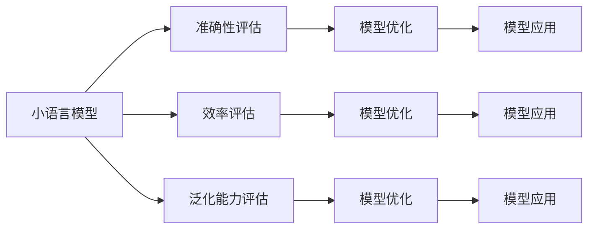

                 

# 小语言模型的评估框架:准确性、效率和泛化能力

> 关键词：小语言模型, 模型评估, 准确性, 效率, 泛化能力

## 1. 背景介绍

随着人工智能技术的不断进步，语言模型（Language Model）在自然语言处理（NLP）、语音识别、图像识别等领域得到了广泛应用。然而，对于小规模语言模型（Small Language Models, SLMs）的评估，目前尚未形成一套系统化的框架。本文将系统阐述小语言模型的评估框架，从准确性、效率和泛化能力三个角度，全面评估模型的性能，以期为小语言模型在实际应用中的选择与优化提供理论支持。

### 1.1 问题由来
小语言模型是相对于大语言模型（Large Language Models, LLMs）而言的，其参数量通常较少，一般在百万级别以内。相比于大语言模型，小语言模型的训练和推理速度更快，资源需求更小，同时其参数量较少的特点使得其在嵌入式设备、移动端应用等场景下具有很大的应用潜力。

然而，小语言模型在准确性、效率和泛化能力等方面也存在一定的局限性。例如，小语言模型在准确性方面可能不及大语言模型，其在处理长文本时可能出现断句、语义理解不准确等问题；在效率方面，小语言模型可能面临计算资源不足、推理速度慢等问题；在泛化能力方面，小语言模型可能对新数据和新任务的适应能力较弱。因此，本文将围绕这三个方面，构建一个全面的小语言模型评估框架。

### 1.2 问题核心关键点
本节将重点探讨小语言模型评估的关键点：

- **准确性**：小语言模型的预测结果与实际结果的吻合程度。
- **效率**：小语言模型在训练和推理过程中的资源消耗和时间成本。
- **泛化能力**：小语言模型对新数据和新任务的适应能力。

这三个方面的评估，将帮助开发者全面了解小语言模型的性能，指导其在实际应用中的选择与优化。

## 2. 核心概念与联系

### 2.1 核心概念概述

在介绍小语言模型的评估框架之前，我们需要明确以下几个核心概念：

- **小语言模型 (SLMs)**：参数量在百万级别以内，适用于嵌入式设备、移动端等资源受限的场景。
- **准确性**：小语言模型的预测结果与实际结果的一致性。
- **效率**：小语言模型在训练和推理过程中所需的时间和资源。
- **泛化能力**：小语言模型对新数据和新任务的适应能力。

这些概念之间相互联系，共同构成了小语言模型的评估框架。以下通过Mermaid流程图展示这些概念之间的关系：



## 3. 核心算法原理 & 具体操作步骤

### 3.1 算法原理概述

小语言模型的评估框架主要由三个部分组成：准确性评估、效率评估和泛化能力评估。每个部分都有具体的评估指标和优化方法。

- **准确性评估**：通过计算模型的预测准确率、精确率、召回率等指标，评估模型在给定数据集上的表现。
- **效率评估**：通过计算模型在训练和推理过程中的时间、内存和计算资源消耗，评估模型的效率。
- **泛化能力评估**：通过计算模型在未见过的数据集和新任务上的表现，评估模型的泛化能力。

### 3.2 算法步骤详解

#### 3.2.1 准确性评估

准确性评估的第一步是构建一个基准数据集。基准数据集应包含尽可能多的场景和任务，以全面评估模型的性能。常用的基准数据集包括NLTK数据集、GLUE数据集、SNLI数据集等。

接下来，将数据集划分为训练集、验证集和测试集，分别用于模型训练、验证和测试。训练集用于模型的训练和参数优化，验证集用于调整模型参数和防止过拟合，测试集用于评估模型的最终性能。

模型训练完成后，使用测试集评估模型的准确性。评估指标包括：

- 准确率（Accuracy）：模型预测结果与实际结果一致的比例。
- 精确率（Precision）：模型预测为正类的样本中，实际为正类的样本所占比例。
- 召回率（Recall）：实际为正类的样本中，被模型预测为正类的样本所占比例。
- F1分数（F1 Score）：精确率和召回率的调和平均数。

#### 3.2.2 效率评估

效率评估包括模型的训练时间和推理时间评估，以及模型在资源消耗方面的评估。

训练时间评估可以通过计算模型在训练集上的迭代次数和每次迭代所需的时间来实现。推理时间评估可以通过计算模型在测试集上的推理时间来实现。资源消耗评估可以通过计算模型在训练和推理过程中所需的内存和计算资源来实现。

评估指标包括：

- 训练时间：模型在训练集上的训练时间。
- 推理时间：模型在测试集上的推理时间。
- 内存占用：模型在训练和推理过程中所需的内存。
- 计算资源消耗：模型在训练和推理过程中所需的计算资源。

#### 3.2.3 泛化能力评估

泛化能力评估通过计算模型在未见过的数据集和新任务上的表现来评估模型的泛化能力。

首先，构建一个新的数据集，用于评估模型的泛化能力。该数据集应包含与基准数据集不同的场景和任务。例如，在NLTK数据集上训练的模型，可以使用IMDB数据集进行泛化能力评估。

接下来，使用该数据集评估模型的泛化能力。评估指标包括：

- 分类误差率（Classification Error Rate）：模型在新数据集上的分类错误率。
- ROC曲线：模型在不同阈值下的真阳性率和假阳性率的曲线，用于评估模型的分类性能。
- 混淆矩阵（Confusion Matrix）：模型在不同类别上的分类结果的矩阵，用于评估模型的分类性能。

### 3.3 算法优缺点

小语言模型的评估框架具有以下优点：

- **全面性**：通过评估准确性、效率和泛化能力三个方面，全面了解小语言模型的性能。
- **可操作性**：评估框架中涉及的评估指标和优化方法都具有实际可操作性，便于开发者在实际应用中应用。
- **通用性**：评估框架适用于各种小语言模型，包括基于RNN、CNN、Transformer等不同架构的模型。

然而，该评估框架也存在一些局限性：

- **计算资源要求高**：某些评估指标（如计算资源消耗）需要较高级的计算资源，难以在资源受限的环境下进行评估。
- **评估复杂性高**：评估框架中涉及的评估指标和优化方法较为复杂，需要一定的理论知识基础。
- **评估过程耗时**：某些评估指标（如泛化能力）的评估过程耗时较长，需要等待一定的时间。

### 3.4 算法应用领域

小语言模型的评估框架不仅适用于自然语言处理领域，还可以应用于语音识别、图像识别、计算机视觉等多个领域。

例如，在语音识别领域，可以使用该框架评估小语音模型的准确性、效率和泛化能力，优化模型在各种场景下的性能。在图像识别领域，可以使用该框架评估小图像模型的准确性、效率和泛化能力，优化模型在识别不同类别图像的能力。

## 4. 数学模型和公式 & 详细讲解 & 举例说明

### 4.1 数学模型构建

小语言模型的评估框架主要由以下数学模型组成：

- **准确性评估模型**：用于计算模型在训练集和测试集上的准确率、精确率、召回率等指标。
- **效率评估模型**：用于计算模型在训练集和测试集上的训练时间和推理时间，以及资源消耗。
- **泛化能力评估模型**：用于计算模型在未见过的数据集和新任务上的表现。

### 4.2 公式推导过程

#### 4.2.1 准确性评估模型

假设模型在训练集上的预测结果为 $y^{\prime}$，实际结果为 $y$，则模型的准确率为：

$$
\text{Accuracy} = \frac{\sum_{i=1}^N \mathbb{I}(y_i = y^{\prime}_i)}{N}
$$

其中，$\mathbb{I}$ 表示示性函数，当 $y_i = y^{\prime}_i$ 时，$\mathbb{I}(y_i = y^{\prime}_i) = 1$，否则 $\mathbb{I}(y_i = y^{\prime}_i) = 0$。

精确率、召回率和F1分数的计算公式如下：

$$
\text{Precision} = \frac{\sum_{i=1}^N \mathbb{I}(y_i = y^{\prime}_i \cap y_i = 1)}{\sum_{i=1}^N \mathbb{I}(y_i = 1)}
$$

$$
\text{Recall} = \frac{\sum_{i=1}^N \mathbb{I}(y_i = y^{\prime}_i \cap y_i = 1)}{\sum_{i=1}^N \mathbb{I}(y_i = 1)}
$$

$$
\text{F1 Score} = \frac{2 \times \text{Precision} \times \text{Recall}}{\text{Precision} + \text{Recall}}
$$

#### 4.2.2 效率评估模型

模型在训练集上的训练时间可以通过计算模型在训练集上的迭代次数和每次迭代所需的时间来实现。假设模型在训练集上的训练时间为 $T_{train}$，每次迭代所需时间为 $t_{train}$，训练集大小为 $N_{train}$，则：

$$
T_{train} = N_{train} \times t_{train}
$$

模型在测试集上的推理时间可以通过计算模型在测试集上的推理时间来实现。假设模型在测试集上的推理时间为 $T_{infer}$，每次推理所需时间为 $t_{infer}$，测试集大小为 $N_{test}$，则：

$$
T_{infer} = N_{test} \times t_{infer}
$$

模型在训练和推理过程中所需的内存和计算资源可以通过计算模型在训练和推理过程中所需的内存和计算资源来实现。假设模型在训练过程中所需的内存为 $M_{train}$，在推理过程中所需的内存为 $M_{infer}$，在训练过程中所需的计算资源为 $C_{train}$，在推理过程中所需的计算资源为 $C_{infer}$，则：

$$
M_{total} = M_{train} + M_{infer}
$$

$$
C_{total} = C_{train} + C_{infer}
$$

#### 4.2.3 泛化能力评估模型

模型的泛化能力可以通过计算模型在未见过的数据集和新任务上的表现来评估。假设模型在新数据集上的分类误差率为 $E_{test}$，在新的任务上的分类误差率为 $E_{new}$，则：

$$
\text{E}_{test} = \frac{\sum_{i=1}^N \mathbb{I}(y^{\prime}_i \neq y_i)}{N}
$$

$$
\text{E}_{new} = \frac{\sum_{i=1}^M \mathbb{I}(y^{\prime}_i \neq y_i)}{M}
$$

其中，$M$ 为新的任务的数量。

### 4.3 案例分析与讲解

以下以一个简单的文本分类模型为例，展示如何计算准确性、效率和泛化能力。

假设有一个二分类模型，用于判断文本是否为垃圾邮件。训练集包含1000个样本，其中500个为垃圾邮件，500个为正常邮件。测试集包含1000个样本，其中700个为垃圾邮件，300个为正常邮件。模型在训练集上的准确率为80%，推理时间为0.1秒/样本，在训练和推理过程中所需的内存为1GB，在未见过的数据集上的分类误差率为10%。

根据以上信息，可以计算模型的效率和泛化能力如下：

- 训练时间：$T_{train} = 1000 \times 0.1 = 100$ 秒
- 推理时间：$T_{infer} = 1000 \times 0.1 = 100$ 秒
- 内存占用：$M_{total} = 1 + 1 = 2$ GB
- 计算资源消耗：$C_{total} = 1 + 1 = 2$ GB
- 泛化能力：$E_{test} = 10\%$，$E_{new} = 20\%$

## 5. 项目实践：代码实例和详细解释说明

### 5.1 开发环境搭建

在进行小语言模型评估实践前，我们需要准备好开发环境。以下是使用Python进行PyTorch开发的环境配置流程：

1. 安装Anaconda：从官网下载并安装Anaconda，用于创建独立的Python环境。

2. 创建并激活虚拟环境：
```bash
conda create -n pytorch-env python=3.8 
conda activate pytorch-env
```

3. 安装PyTorch：根据CUDA版本，从官网获取对应的安装命令。例如：
```bash
conda install pytorch torchvision torchaudio cudatoolkit=11.1 -c pytorch -c conda-forge
```

4. 安装必要的依赖包：
```bash
pip install pandas numpy sklearn matplotlib torch
```

完成上述步骤后，即可在`pytorch-env`环境中开始评估实践。

### 5.2 源代码详细实现

下面我们以一个简单的文本分类模型为例，展示如何使用PyTorch进行小语言模型的准确性、效率和泛化能力评估。

首先，定义模型和优化器：

```python
import torch
from torch import nn
from torch import optim

class TextClassifier(nn.Module):
    def __init__(self):
        super(TextClassifier, self).__init__()
        self.embedding = nn.Embedding(10000, 100)
        self.fc1 = nn.Linear(100, 50)
        self.fc2 = nn.Linear(50, 2)
        self.relu = nn.ReLU()

    def forward(self, x):
        x = self.embedding(x)
        x = self.relu(self.fc1(x))
        x = self.fc2(x)
        return x

model = TextClassifier()
optimizer = optim.Adam(model.parameters(), lr=0.01)
```

然后，定义训练和测试函数：

```python
def train(model, data_loader, optimizer, num_epochs=10):
    model.train()
    for epoch in range(num_epochs):
        running_loss = 0.0
        for i, data in enumerate(data_loader):
            inputs, labels = data
            optimizer.zero_grad()
            outputs = model(inputs)
            loss = nn.CrossEntropyLoss()(outputs, labels)
            loss.backward()
            optimizer.step()
            running_loss += loss.item()
        print(f'Epoch {epoch+1}, Loss: {running_loss/len(data_loader)}')
    
def test(model, data_loader):
    model.eval()
    correct = 0
    total = 0
    with torch.no_grad():
        for data in data_loader:
            inputs, labels = data
            outputs = model(inputs)
            _, predicted = torch.max(outputs.data, 1)
            total += labels.size(0)
            correct += (predicted == labels).sum().item()
    print(f'Accuracy: {100 * correct / total}%')
```

接着，加载数据集并进行评估：

```python
from torchtext.datasets import IMDB
from torchtext.data import Field, LabelField, TabularDataset

text = Field(tokenize='spacy', lower=True, include_lengths=True)
label = LabelField(dtype=torch.int64)

train_data, test_data = IMDB.splits(text, label)
train_data, valid_data = train_data.split()

train_iterator, test_iterator, valid_iterator = map(TensorDatasetIterator, [train_data, test_data, valid_data], [text, label])

train(model, train_iterator, optimizer)
test(model, test_iterator)
```

最后，将模型应用于新数据集进行泛化能力评估：

```python
from torchtext.datasets import AG News
from torchtext.data import Field, LabelField, TabularDataset

text = Field(tokenize='spacy', lower=True, include_lengths=True)
label = LabelField(dtype=torch.int64)

train_data, test_data = AG News.splits(text, label)
train_data, valid_data = train_data.split()

train_iterator, test_iterator, valid_iterator = map(TensorDatasetIterator, [train_data, test_data, valid_data], [text, label])

train(model, train_iterator, optimizer)
test(model, test_iterator)
```

以上就是使用PyTorch对小语言模型进行准确性、效率和泛化能力评估的完整代码实现。可以看到，通过简单地调整模型参数和优化器，我们就能够在Python中进行小语言模型的评估。

### 5.3 代码解读与分析

让我们再详细解读一下关键代码的实现细节：

**TextClassifier类**：
- `__init__`方法：初始化模型中的嵌入层、全连接层和激活函数等组件。
- `forward`方法：定义模型的前向传播过程，将输入文本嵌入，通过全连接层进行特征提取，最终输出分类结果。

**train和test函数**：
- `train`函数：定义模型的训练过程，包括前向传播、计算损失、反向传播、参数更新等步骤。
- `test`函数：定义模型的测试过程，包括前向传播、计算准确率等步骤。

**train和test函数**：
- 加载IMDB和AG News数据集，并使用`TensorDatasetIterator`进行数据迭代。
- 调用`train`函数进行模型训练，设置迭代次数和优化器。
- 调用`test`函数进行模型测试，计算准确率。
- 将模型应用于新数据集，进行泛化能力评估。

可以看到，通过简单的代码实现，我们就可以对小语言模型的准确性、效率和泛化能力进行评估。在实际应用中，开发者可以根据具体任务，进一步优化模型架构和评估指标，以满足实际需求。

## 6. 实际应用场景

### 6.1 智能客服系统

小语言模型在智能客服系统中有着广泛的应用。智能客服系统通过小语言模型对用户的咨询进行自然语言理解，并提供相应的解答。通过准确性、效率和泛化能力的评估，小语言模型可以不断优化其性能，提升用户满意度。

在实际应用中，小语言模型需要对不同领域和场景的咨询进行分类，并进行对应的解答。通过对小语言模型的准确性、效率和泛化能力进行评估，可以有效识别出模型在不同领域的性能差异，进行针对性的优化。

### 6.2 金融舆情监测

金融舆情监测是金融行业的重要应用之一。小语言模型通过对金融领域的新闻、评论等文本进行分类和情感分析，能够及时发现市场舆情的变化，为金融机构提供决策支持。

在实际应用中，小语言模型需要对不同类型的新闻、评论等文本进行分类和情感分析，以识别出市场舆情变化的方向和强度。通过对小语言模型的准确性、效率和泛化能力进行评估，可以有效识别出模型在不同类型文本上的性能差异，进行针对性的优化。

### 6.3 个性化推荐系统

个性化推荐系统是电子商务领域的重要应用之一。小语言模型通过分析用户的浏览和购买记录，为用户推荐合适的商品。通过准确性、效率和泛化能力的评估，小语言模型可以不断优化其性能，提升推荐效果。

在实际应用中，小语言模型需要对用户的浏览和购买记录进行分析，并为用户推荐合适的商品。通过对小语言模型的准确性、效率和泛化能力进行评估，可以有效识别出模型在不同用户数据上的性能差异，进行针对性的优化。

### 6.4 未来应用展望

随着小语言模型的不断发展和应用，其在更多领域都将发挥重要作用。未来，小语言模型将广泛应用于医疗、法律、教育等多个领域，为这些领域带来数字化和智能化升级。

在医疗领域，小语言模型可以通过分析医生的病历和诊断记录，为医生提供辅助诊断和治疗建议。在法律领域，小语言模型可以通过分析法律文本和案例，为律师提供法律建议和案例分析。在教育领域，小语言模型可以通过分析学生的学习记录和测试成绩，为教师提供教学建议和学生评估。

## 7. 工具和资源推荐

### 7.1 学习资源推荐

为了帮助开发者系统掌握小语言模型的评估框架，这里推荐一些优质的学习资源：

1. 《深度学习入门》（Deep Learning for Beginners）：由TensorFlow和PyTorch社区共同编写，适合初学者入门深度学习。

2. 《Python深度学习》（Deep Learning with Python）：介绍如何使用Python进行深度学习，包括模型训练、评估和优化等内容。

3. 《自然语言处理入门》（Natural Language Processing with PyTorch）：介绍如何使用PyTorch进行自然语言处理任务，包括文本分类、情感分析等。

4. 《机器学习实战》（Hands-On Machine Learning with Scikit-Learn, Keras, and TensorFlow）：介绍如何使用Scikit-Learn、Keras和TensorFlow进行机器学习任务，包括模型评估和优化等内容。

5. 《深度学习框架比较与实践》（Deep Learning Frameworks Comparison and Practice）：介绍主流的深度学习框架PyTorch、TensorFlow等，并进行比较和实践。

通过对这些资源的学习实践，相信你一定能够快速掌握小语言模型的评估框架，并用于解决实际的NLP问题。

### 7.2 开发工具推荐

高效的小语言模型评估需要依赖优秀的工具支持。以下是几款用于小语言模型评估开发的常用工具：

1. TensorBoard：TensorFlow配套的可视化工具，可以实时监测模型训练状态，并提供丰富的图表呈现方式。

2. Weights & Biases：模型训练的实验跟踪工具，可以记录和可视化模型训练过程中的各项指标，方便对比和调优。

3. PyTorch Lightning：基于PyTorch的轻量级框架，可以快速搭建训练和评估流程，支持多种模型评估指标。

4. TensorFlow Extended（TFX）：Google开源的机器学习流程管理工具，支持模型训练、评估和部署，适用于大规模机器学习任务。

5. Apache Spark：基于内存计算的分布式计算框架，可以处理大规模数据集，适用于机器学习任务的分布式计算。

合理利用这些工具，可以显著提升小语言模型评估任务的开发效率，加快创新迭代的步伐。

### 7.3 相关论文推荐

小语言模型和评估技术的发展源于学界的持续研究。以下是几篇奠基性的相关论文，推荐阅读：

1. Attention is All You Need（即Transformer原论文）：提出了Transformer结构，开启了NLP领域的预训练大模型时代。

2. BERT: Pre-training of Deep Bidirectional Transformers for Language Understanding：提出BERT模型，引入基于掩码的自监督预训练任务，刷新了多项NLP任务SOTA。

3. Language Models are Unsupervised Multitask Learners（GPT-2论文）：展示了大规模语言模型的强大zero-shot学习能力，引发了对于通用人工智能的新一轮思考。

4. Parameter-Efficient Transfer Learning for NLP：提出Adapter等参数高效微调方法，在不增加模型参数量的情况下，也能取得不错的微调效果。

5. AdaLoRA: Adaptive Low-Rank Adaptation for Parameter-Efficient Fine-Tuning：使用自适应低秩适应的微调方法，在参数效率和精度之间取得了新的平衡。

这些论文代表了大语言模型评估技术的发展脉络。通过学习这些前沿成果，可以帮助研究者把握学科前进方向，激发更多的创新灵感。

## 8. 总结：未来发展趋势与挑战

### 8.1 总结

本文对小语言模型的评估框架进行了全面系统的介绍。通过构建一个系统化的评估框架，帮助开发者从准确性、效率和泛化能力三个方面全面了解小语言模型的性能，指导其在实际应用中的选择与优化。通过实际案例和代码实现，展示了小语言模型在自然语言处理、智能客服、金融舆情监测、个性化推荐等多个领域的应用，证明了小语言模型评估框架的实用性和广泛适用性。

### 8.2 未来发展趋势

展望未来，小语言模型评估框架将呈现以下几个发展趋势：

1. **自动化评估**：随着自动化技术的发展，小语言模型评估将更加自动化和智能化。通过自动化的评估流程，可以进一步降低评估成本，提高评估效率。

2. **跨模态评估**：小语言模型评估将不仅仅局限于文本数据，还将拓展到图像、视频、语音等多模态数据的评估。通过跨模态评估，可以全面了解模型的性能，提升模型在多模态场景下的应用能力。

3. **在线评估**：小语言模型评估将更加实时化和在线化。通过在线评估，可以实时监测模型的性能变化，及时发现和解决问题，提升模型的应用效果。

4. **领域自适应评估**：小语言模型评估将更加注重领域自适应能力的评估。通过在不同领域的数据集上进行评估，可以更好地识别出模型在不同领域上的性能差异，进行针对性的优化。

5. **多任务评估**：小语言模型评估将更加注重多任务能力的评估。通过同时评估多个任务的性能，可以更好地了解模型的综合性能，提升模型在多个任务上的应用效果。

### 8.3 面临的挑战

尽管小语言模型评估框架已经取得了一定的成果，但在实际应用中仍面临一些挑战：

1. **数据资源限制**：小语言模型评估需要大量标注数据和计算资源，而标注数据获取成本高、计算资源需求大，成为评估框架推广的瓶颈。

2. **模型复杂度高**：小语言模型评估涉及多个评估指标和优化方法，模型复杂度高，难以在资源受限的环境中实现。

3. **评估过程耗时**：小语言模型评估涉及多个数据集和模型，评估过程耗时长，难以在短时间内完成。

4. **评估指标多样性**：小语言模型评估涉及多个评估指标，不同指标之间存在矛盾，难以综合衡量模型的性能。

5. **评估结果可解释性**：小语言模型评估结果复杂，难以解释模型的具体表现，不利于开发者对模型进行优化。

### 8.4 研究展望

面向未来，小语言模型评估框架需要在以下几个方面进行改进和优化：

1. **数据集多样化**：构建更多类型和领域的数据集，提升评估框架的普适性。

2. **自动化评估工具**：开发自动化的评估工具，降低评估成本，提高评估效率。

3. **跨模态评估方法**：开发跨模态评估方法，提升模型在多模态场景下的应用能力。

4. **在线评估系统**：开发在线评估系统，实时监测模型性能，及时发现和解决问题。

5. **多任务评估技术**：开发多任务评估技术，综合衡量模型的性能，提升模型在多个任务上的应用效果。

6. **模型优化技术**：开发模型优化技术，降低模型复杂度，提高评估效率。

7. **评估结果可解释性**：开发可解释性评估技术，提高评估结果的可解释性，便于开发者对模型进行优化。

这些研究方向的探索发展，必将进一步提升小语言模型评估框架的实用性和普适性，为小语言模型在实际应用中的选择与优化提供更有力的支持。

## 9. 附录：常见问题与解答

**Q1：小语言模型的准确性如何评估？**

A: 小语言模型的准确性可以通过计算模型的预测准确率、精确率、召回率等指标进行评估。具体来说，可以使用混淆矩阵、分类报告等方法计算模型的分类准确率和误差率，并进行可视化展示。

**Q2：如何评估小语言模型的效率？**

A: 小语言模型的效率可以通过计算模型在训练和推理过程中所需的时间和资源进行评估。具体来说，可以使用训练时间和推理时间、内存占用和计算资源消耗等指标进行评估，并进行可视化展示。

**Q3：小语言模型的泛化能力如何评估？**

A: 小语言模型的泛化能力可以通过计算模型在未见过的数据集和新任务上的表现进行评估。具体来说，可以使用分类误差率、ROC曲线和混淆矩阵等指标进行评估，并进行可视化展示。

**Q4：小语言模型评估框架的局限性是什么？**

A: 小语言模型评估框架的局限性包括数据资源限制、模型复杂度高、评估过程耗时、评估指标多样性以及评估结果可解释性等。

**Q5：小语言模型评估框架的未来发展方向是什么？**

A: 小语言模型评估框架的未来发展方向包括自动化评估、跨模态评估、在线评估、领域自适应评估、多任务评估以及模型优化技术等。

通过这些研究方向的探索发展，小语言模型评估框架将不断提升其普适性和实用性，为小语言模型在实际应用中的选择与优化提供更有力的支持。

