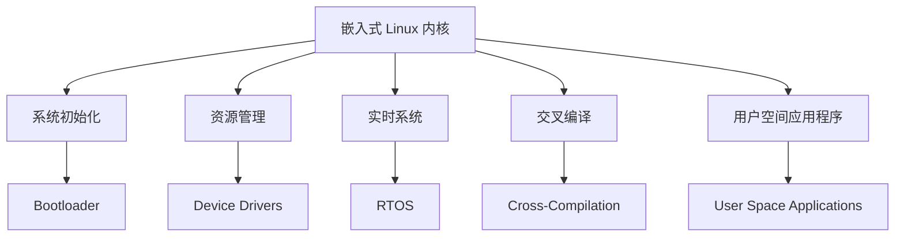

                 

# 嵌入式 Linux：在设备上运行 Linux

> 关键词：嵌入式系统, Linux, Linux 内核, 系统初始化, 系统引导, 资源管理, 实时系统, 嵌入式开发, 硬件抽象层, 用户空间应用程序, 嵌入式 Linux 发行版, 交叉编译

## 1. 背景介绍

### 1.1 问题由来

嵌入式系统（Embedded Systems）是指那些嵌入在物理设备中以实现特定功能的软硬件系统。随着物联网（IoT）、智能家居、汽车电子等应用的兴起，嵌入式系统对计算能力、实时响应和低功耗等需求日益增加。传统的嵌入式系统往往运行专有的操作系统和定制的软件栈，而近年来，Linux 在嵌入式设备中的应用越来越广泛。

嵌入式 Linux 是指在嵌入式设备上运行的 Linux 操作系统。Linux 以其强大的灵活性、可扩展性和稳定性，逐渐成为嵌入式系统开发的首选平台。本文章将全面介绍嵌入式 Linux 的核心概念、架构原理、开发流程以及应用场景，为开发者提供系统深入的技术指导。

### 1.2 问题核心关键点

嵌入式 Linux 的核心关键点包括：

- **嵌入式 Linux 内核**：在嵌入式设备上运行的操作系统内核，需要考虑实时性、小尺寸和硬件抽象等问题。
- **系统初始化和引导**：如何在硬件启动后初始化并加载 Linux 内核，以及如何运行第一个用户空间程序。
- **资源管理**：如何对嵌入式设备的硬件资源进行合理分配和管理，包括 CPU、内存、存储和外设等。
- **实时系统**：嵌入式 Linux 如何满足实时性要求，以及如何实现高可靠性和低延迟。
- **交叉编译**：如何在主机系统上编译嵌入式 Linux 应用程序，以适配目标设备的硬件架构。
- **用户空间应用程序**：如何在用户空间编写高效、安全和可移植的应用程序，与内核空间协同工作。

## 2. 核心概念与联系

### 2.1 核心概念概述

嵌入式 Linux 涉及多个核心概念，这些概念之间存在紧密的联系：

- **嵌入式 Linux 内核（Kernel）**：Linux 内核是操作系统的核心，负责管理硬件资源、调度任务、提供网络服务等。
- **系统初始化（Bootloader 和 Init）**：系统启动时，需要一系列初始化步骤来加载和运行 Linux 内核，并启动第一个用户空间程序。
- **资源管理（Device Drivers 和 Resource Management）**：Linux 内核通过设备驱动程序（Device Drivers）管理硬件设备，通过资源管理工具分配和管理系统资源。
- **实时系统（RTOS 和 Real-time Preemption）**：嵌入式 Linux 需要支持实时任务调度，通常通过实现 RTOS（Real-time Operating System）或启用实时抢占（Real-time Preemption）机制来实现。
- **交叉编译（Cross-Compilation）**：主机系统（如 PC）上编译的可执行文件需要在目标系统上运行，需要进行交叉编译。
- **用户空间应用程序（User Space Applications）**：用户空间的应用程序与内核空间协同工作，执行具体的功能，如网络通信、文件系统管理等。

这些概念之间的关系通过以下 Mermaid 流程图来展示：



这个流程图展示了一个嵌入式 Linux 系统的核心组件及其相互作用关系：

1. 嵌入式 Linux 内核作为系统核心，管理硬件资源和调度任务。
2. 系统初始化包括 Bootloader 和 Init，负责启动和运行 Linux 内核。
3. 资源管理通过设备驱动程序管理硬件设备，通过资源管理工具分配和管理资源。
4. 实时系统支持 RTOS 或实现实时抢占机制。
5. 交叉编译允许在主机系统上编译可执行文件，适配目标系统的硬件架构。
6. 用户空间应用程序执行具体的功能，与内核协同工作。

这些概念共同构成了嵌入式 Linux 的完整系统架构，确保了嵌入式设备的稳定、可靠和高效运行。

## 3. 核心算法原理 & 具体操作步骤

### 3.1 算法原理概述

嵌入式 Linux 的核心算法原理包括：

- **系统初始化**：通过 Bootloader 和 Init 启动 Linux 内核，并执行初始化脚本。
- **资源管理**：通过设备驱动程序管理硬件资源，通过资源管理工具分配和管理内存、存储和外设等。
- **实时系统**：通过实现 RTOS 或启用实时抢占机制，支持嵌入式 Linux 的实时任务调度。
- **交叉编译**：在主机系统上编译应用程序，适配目标系统的硬件架构。
- **用户空间应用程序**：在用户空间编写高效、安全和可移植的应用程序，与内核协同工作。

### 3.2 算法步骤详解

嵌入式 Linux 的核心算法步骤包括：

1. **系统初始化**：通过 Bootloader 启动 Linux 内核，并执行 Init 进程。
2. **内核初始化**：加载 Linux 内核模块，初始化 CPU、内存和网络等资源。
3. **系统引导**：通过 Init 进程启动第一个用户空间程序。
4. **资源管理**：通过设备驱动程序管理硬件设备，通过资源管理工具分配和管理内存、存储和外设等。
5. **实时系统**：通过 RTOS 或实现实时抢占机制，支持嵌入式 Linux 的实时任务调度。
6. **交叉编译**：在主机系统上编译应用程序，适配目标系统的硬件架构。
7. **用户空间应用程序**：在用户空间编写高效、安全和可移植的应用程序，与内核协同工作。

### 3.3 算法优缺点

嵌入式 Linux 的算法优点包括：

- **灵活性和可扩展性**：Linux 内核和用户空间应用程序的灵活性和可扩展性，使得嵌入式 Linux 适用于多种应用场景。
- **稳定性**：Linux 操作系统的稳定性，保证了嵌入式设备的长期稳定运行。
- **资源管理**：通过设备驱动程序和资源管理工具，有效地管理嵌入式设备的硬件资源。

嵌入式 Linux 的算法缺点包括：

- **资源限制**：嵌入式设备资源有限，需要优化系统以适应资源限制。
- **实时性**：嵌入式 Linux 需要满足实时性要求，可能需要在系统架构和调度策略上进行特殊设计。
- **复杂性**：嵌入式 Linux 开发需要掌握多个领域的技术，如硬件接口、系统初始化和资源管理等。

### 3.4 算法应用领域

嵌入式 Linux 广泛应用于以下领域：

- **工业控制**：如 PLC（Programmable Logic Controller）、SCADA（Supervisory Control And Data Acquisition）系统等。
- **汽车电子**：如车载信息娱乐系统、车辆控制和诊断系统等。
- **医疗设备**：如医疗影像处理、电子病历管理等。
- **智能家居**：如智能音箱、智能照明和智能温控等。
- **物联网**：如智能传感器网络、远程监控和智能家居等。

## 4. 数学模型和公式 & 详细讲解 & 举例说明

### 4.1 数学模型构建

嵌入式 Linux 的数学模型构建涉及多个模块，包括 CPU 调度、内存管理、磁盘调度等。以 CPU 调度为例，其数学模型如下：

$$
\text{CPU} \text{调度} = \text{Round-Robin 调度算法} + \text{优先级调度算法} + \text{实时任务调度算法}
$$

其中，Round-Robin 调度算法用于实现公平的 CPU 分配，优先级调度算法用于根据任务的优先级分配 CPU 时间片，实时任务调度算法用于支持嵌入式 Linux 的实时任务调度。

### 4.2 公式推导过程

以 CPU 调度的 Round-Robin 调度算法为例，推导其数学模型：

1. **Round-Robin 调度算法**：

$$
\text{轮询调度算法} = \frac{1}{n} \text{其中 } n \text{ 是进程数}
$$

2. **优先级调度算法**：

$$
\text{优先级调度算法} = \text{优先级} + \text{时间片} \text{ 其中 } \text{时间片} \text{ 是固定长度}
$$

3. **实时任务调度算法**：

$$
\text{实时任务调度算法} = \text{时间片} + \text{优先级} \text{ 其中 } \text{时间片} \text{ 是可变长度}
$$

通过这些公式，可以推导出嵌入式 Linux 中 CPU 调度的数学模型：

$$
\text{CPU 调度} = \text{Round-Robin 调度算法} + \text{优先级调度算法} + \text{实时任务调度算法}
$$

### 4.3 案例分析与讲解

假设嵌入式 Linux 设备上运行着两个任务 A 和 B，任务 A 的优先级为 1，任务 B 的优先级为 2。使用 Round-Robin 调度算法，时间片长度为 20ms。计算每个任务的执行时间：

- 任务 A 的执行时间 = $\frac{1}{2} \times 20ms = 10ms$
- 任务 B 的执行时间 = $\frac{1}{2} \times 20ms = 10ms$

由于任务 B 的优先级高于任务 A，因此在每个时间片中，任务 B 的执行时间更长。

## 5. 项目实践：代码实例和详细解释说明

### 5.1 开发环境搭建

嵌入式 Linux 开发需要搭建以下环境：

1. **开发主机**：PC 或虚拟机，用于编译和测试应用程序。
2. **交叉编译工具链**：编译器、链接器、库等，适配目标系统的硬件架构。
3. **调试工具**：如 GDB、QEMU 等，用于调试和模拟嵌入式系统。
4. **开发平台**：如 Linux、Windows 等，用于编写和运行应用程序。

### 5.2 源代码详细实现

以下是一个简单的嵌入式 Linux 应用程序的源代码实现：

```c
#include <stdio.h>
#include <unistd.h>

int main() {
    printf("Hello, World!\n");
    sleep(5);
    return 0;
}
```

在 Linux 上编译和运行该程序的步骤如下：

1. **安装交叉编译工具链**：

   ```bash
   sudo apt-get install build-essential
   ```

2. **编译应用程序**：

   ```bash
   gcc -o hello hello.c -static -march=arm
   ```

3. **上传应用程序**：

   ```bash
   scp hello root@embeddedLinuxDevice:/root/
   ```

4. **运行应用程序**：

   ```bash
   ssh root@embeddedLinuxDevice
   cd /root/
   ./hello
   ```

### 5.3 代码解读与分析

**hello.c 文件**：

- 定义了 Hello World 字符串和睡眠函数，并在主函数中打印字符串。

**编译命令**：

- 使用 `gcc` 编译器，`-static` 参数指定静态链接库，`-march=arm` 参数指定目标系统的硬件架构。

**上传命令**：

- 使用 `scp` 命令将编译好的应用程序上传到嵌入式设备上。

**运行命令**：

- 通过 SSH 登录嵌入式设备，在终端执行应用程序。

## 6. 实际应用场景

### 6.1 工业控制

嵌入式 Linux 在工业控制领域有广泛应用，如 PLC、SCADA 系统等。通过嵌入式 Linux，可以实现实时数据采集、远程监控和自动化控制等功能，提高生产效率和设备可靠性。

### 6.2 汽车电子

嵌入式 Linux 在汽车电子中用于车载信息娱乐系统、车辆控制和诊断系统等。通过嵌入式 Linux，可以实现语音识别、智能导航和车载通信等功能，提升驾驶体验和车辆安全性。

### 6.3 医疗设备

嵌入式 Linux 在医疗设备中用于电子病历管理、医疗影像处理和远程监控等。通过嵌入式 Linux，可以实现高效的数据处理和实时分析，提高医疗诊断的准确性和效率。

### 6.4 智能家居

嵌入式 Linux 在智能家居中用于智能音箱、智能照明和智能温控等。通过嵌入式 Linux，可以实现语音识别、智能控制和远程控制等功能，提升家居生活的便捷性和舒适性。

### 6.5 物联网

嵌入式 Linux 在物联网中用于智能传感器网络、远程监控和智能家居等。通过嵌入式 Linux，可以实现设备的低功耗运行和高效的数据处理，提升物联网系统的稳定性和可靠性。

## 7. 工具和资源推荐

### 7.1 学习资源推荐

为了帮助开发者系统掌握嵌入式 Linux 的核心技术，这里推荐一些优质的学习资源：

1. **《嵌入式 Linux 开发实战》**：该书详细介绍了嵌入式 Linux 开发的基础知识和实践技巧，适合初学者和中级开发者。
2. **《嵌入式 Linux 核心技术》**：该书深入讲解了嵌入式 Linux 的核心概念和技术细节，适合高级开发者和架构师。
3. **《Linux 内核设计与实现》**：该书详细介绍了 Linux 内核的设计和实现原理，适合系统架构师和内核开发者。
4. **《嵌入式 Linux 编程指南》**：该书提供了大量的嵌入式 Linux 编程示例，适合实战练习和项目开发。
5. **《嵌入式 Linux 应用开发》**：该书讲解了嵌入式 Linux 上的常见应用开发技巧，适合应用开发者和工程师。

### 7.2 开发工具推荐

嵌入式 Linux 开发需要使用多种工具，以下是推荐的开发工具：

1. **GCC 编译器**：用于编译应用程序，适配目标系统的硬件架构。
2. **GDB 调试器**：用于调试嵌入式 Linux 应用程序。
3. **QEMU 模拟器**：用于模拟嵌入式 Linux 设备，方便开发和测试。
4. **JTAG 调试器**：用于调试嵌入式 Linux 硬件设备。
5. **交叉编译工具链**：如 ARM 交叉编译工具链，用于编译嵌入式 Linux 应用程序。

### 7.3 相关论文推荐

嵌入式 Linux 的发展依赖于学界和工业界的持续研究。以下是几篇重要的嵌入式 Linux 相关论文，推荐阅读：

1. **"Linux on Embedded Devices"**：该论文介绍了嵌入式 Linux 的核心概念和实现方法，是嵌入式 Linux 领域的经典之作。
2. **"Real-Time Linux"**：该论文介绍了嵌入式 Linux 的实时系统设计和实现，是嵌入式 Linux 实时性研究的权威文献。
3. **"Cross-Compilation for Embedded Linux"**：该论文介绍了嵌入式 Linux 的交叉编译技术和工具，是嵌入式 Linux 开发的重要参考。
4. **"Kernel Development for Embedded Linux"**：该论文介绍了嵌入式 Linux 内核的设计和实现原理，是内核开发者必读的经典文献。
5. **"User Space Applications for Embedded Linux"**：该论文介绍了嵌入式 Linux 用户空间应用程序的开发技巧，是应用开发者的重要参考。

## 8. 总结：未来发展趋势与挑战

### 8.1 总结

本文对嵌入式 Linux 的核心概念、架构原理、开发流程以及应用场景进行了全面介绍。嵌入式 Linux 以其灵活性、可扩展性和稳定性，成为嵌入式系统开发的首选平台。通过系统初始化、资源管理、实时系统和交叉编译等关键技术，嵌入式 Linux 实现了高效、稳定和可靠的应用。未来，嵌入式 Linux 将在更多领域得到应用，为人工智能、物联网和智能家居等带来新的突破。

### 8.2 未来发展趋势

嵌入式 Linux 的未来发展趋势包括：

1. **低功耗设计**：随着物联网设备的普及，嵌入式 Linux 需要进一步优化，以适应低功耗要求。
2. **安全性和隐私保护**：嵌入式 Linux 需要加强安全性和隐私保护，防止数据泄露和攻击。
3. **边缘计算**：嵌入式 Linux 将与边缘计算技术结合，实现数据本地处理和存储。
4. **人工智能**：嵌入式 Linux 将结合人工智能技术，提升设备的智能化水平和用户体验。
5. **跨平台兼容性**：嵌入式 Linux 需要进一步提升跨平台兼容性，实现设备间的互联互通。

### 8.3 面临的挑战

嵌入式 Linux 在发展过程中面临以下挑战：

1. **资源限制**：嵌入式设备资源有限，需要优化系统以适应资源限制。
2. **实时性要求**：嵌入式 Linux 需要满足实时性要求，可能需要在系统架构和调度策略上进行特殊设计。
3. **安全性问题**：嵌入式 Linux 需要加强安全性和隐私保护，防止数据泄露和攻击。
4. **复杂性高**：嵌入式 Linux 开发需要掌握多个领域的技术，如硬件接口、系统初始化和资源管理等。

### 8.4 研究展望

未来，嵌入式 Linux 需要在以下几个方面进行深入研究：

1. **优化资源管理**：进一步优化嵌入式 Linux 的资源管理，提升系统的稳定性和效率。
2. **提高实时性**：实现高效的实时任务调度，满足嵌入式 Linux 的实时性要求。
3. **增强安全性**：加强安全性和隐私保护，确保嵌入式 Linux 系统的安全性和可靠性。
4. **结合人工智能**：结合人工智能技术，提升嵌入式 Linux 的智能化水平和用户体验。
5. **跨平台兼容性**：提升嵌入式 Linux 的跨平台兼容性，实现设备间的互联互通。

## 9. 附录：常见问题与解答

**Q1: 嵌入式 Linux 和传统 Linux 有什么区别？**

A: 嵌入式 Linux 和传统 Linux 的主要区别在于资源限制和实时性要求。嵌入式 Linux 通常运行在资源有限的设备上，需要优化系统以适应资源限制。同时，嵌入式 Linux 需要满足实时性要求，可能需要在系统架构和调度策略上进行特殊设计。

**Q2: 如何提高嵌入式 Linux 的实时性？**

A: 提高嵌入式 Linux 的实时性需要从多个方面进行优化，包括：

1. **优化内核调度**：实现高效的 Round-Robin 和优先级调度算法，提升任务的响应速度。
2. **实现 RTOS**：使用实时操作系统，如 RT Linux，提升实时任务的调度能力。
3. **启用实时抢占**：启用实时抢占机制，确保实时任务的及时响应。
4. **优化中断处理**：优化中断处理机制，减少中断响应时间。
5. **硬件支持**：使用支持实时操作系统的硬件平台，提升系统的实时性。

**Q3: 嵌入式 Linux 的交叉编译有哪些步骤？**

A: 嵌入式 Linux 的交叉编译步骤如下：

1. **安装交叉编译工具链**：下载和安装目标系统的交叉编译工具链，包括编译器、链接器和库等。
2. **编写应用程序代码**：编写应用程序代码，确保其适配目标系统的硬件架构。
3. **编译应用程序**：使用交叉编译工具链编译应用程序，生成目标系统的可执行文件。
4. **上传应用程序**：将编译好的应用程序上传到嵌入式设备上。
5. **运行应用程序**：在嵌入式设备上运行应用程序。

**Q4: 嵌入式 Linux 的调试工具有哪些？**

A: 嵌入式 Linux 的调试工具包括：

1. **GDB 调试器**：用于调试嵌入式 Linux 应用程序。
2. **QEMU 模拟器**：用于模拟嵌入式 Linux 设备，方便开发和测试。
3. **JTAG 调试器**：用于调试嵌入式 Linux 硬件设备。
4. **网络调试工具**：如 Wireshark，用于调试网络通信。
5. **日志工具**：如 syslog，用于记录和分析系统日志。

**Q5: 嵌入式 Linux 的资源管理有哪些关键技术？**

A: 嵌入式 Linux 的资源管理关键技术包括：

1. **设备驱动程序**：通过设备驱动程序管理硬件设备，如 CPU、内存和外设等。
2. **内存管理**：使用内存管理器，如 slab allocator，优化内存分配和回收。
3. **存储管理**：使用文件系统管理器，如 ext4 和 jfs，管理存储资源。
4. **任务调度**：使用调度器，如 Completely Fair Scheduler（CFS），管理 CPU 资源。
5. **资源限制**：使用资源限制器，如 cgroups，限制进程的资源使用。

---

作者：禅与计算机程序设计艺术 / Zen and the Art of Computer Programming

