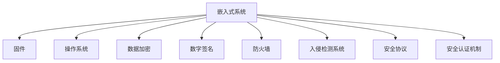

                 

# 嵌入式系统安全策略：保护设备和数据完整性

## 1. 背景介绍

### 1.1 问题由来
随着物联网技术的快速发展，嵌入式系统在智能手机、智能家居、工业控制、车联网等众多领域得到了广泛应用。然而，这些系统往往部署在资源受限、环境复杂的环境中，容易受到恶意攻击，导致数据泄露、设备损坏、控制失效等严重后果。因此，针对嵌入式系统的安全保护显得尤为重要。

嵌入式系统的安全保护需要兼顾设备硬件安全、软件安全、数据安全和通信安全等多个方面。针对这些问题，我们提出了一系列的安全策略，旨在通过多层级、全链条的安全防护措施，构建一个坚实的嵌入式系统安全防线。

### 1.2 问题核心关键点
嵌入式系统安全保护的核心关键点包括：

- 硬件安全：保护系统物理层和硬件层免受篡改和物理攻击。
- 软件安全：确保系统软件代码的完整性和正确性，防止恶意软件入侵。
- 数据安全：保护数据在存储、传输和处理过程中的机密性、完整性和可用性。
- 通信安全：确保嵌入式系统在网络通信中的安全性，防止网络攻击和数据泄露。

本文将详细介绍如何通过一系列安全策略，实现嵌入式系统各个层面的安全保护。

## 2. 核心概念与联系

### 2.1 核心概念概述

为更好地理解嵌入式系统安全策略，本节将介绍几个密切相关的核心概念：

- 嵌入式系统(Embedded System)：一种集成了硬件、软件、数据和通信于一体的专用系统。嵌入式系统通常运行在资源受限的环境中，执行特定功能。
- 固件(Firmware)：运行在嵌入式系统中的低层软件，直接控制硬件和软件功能。
- 操作系统(OS)：管理系统资源，提供核心服务，如进程管理、内存管理、设备驱动等。
- 数据加密(Data Encryption)：将原始数据转换为无法直接解读的格式，确保数据传输和存储的机密性。
- 数字签名(Digital Signature)：一种验证数字信息来源和完整性的技术，用于保护数据的真实性和未被篡改性。
- 防火墙(Firewall)：监测、限制和允许网络流量，防止未经授权的访问。
- 入侵检测系统(IDS)：实时监控网络行为，检测和报告异常活动。
- 安全协议(Security Protocol)：定义网络通信中的安全规则和机制，如SSL/TLS、IPsec等。
- 安全认证机制(Authentication Mechanism)：用于验证用户或设备身份的机制，如用户名密码、生物识别等。

这些核心概念之间的逻辑关系可以通过以下Mermaid流程图来展示：



这个流程图展示了这个架构中各个组件之间的依赖关系：

1. 嵌入式系统通过固件控制硬件和操作系统，操作系统提供核心服务。
2. 数据加密、数字签名、防火墙、入侵检测系统等安全组件，用于保护系统硬件、软件和通信安全。
3. 安全协议和认证机制，用于保障数据传输和网络通信的安全。

## 3. 核心算法原理 & 具体操作步骤
### 3.1 算法原理概述

嵌入式系统安全保护的核心算法原理主要包括：

- 固件安全防护：通过加固固件代码，防止固件篡改和恶意注入。
- 操作系统安全加固：通过加强操作系统内核和驱动的安全性，防止系统攻击。
- 数据加密和数字签名：使用加密算法和数字签名技术，保护数据在存储和传输过程中的安全性。
- 防火墙和入侵检测：通过防火墙和IDS技术，实时监控和检测网络流量，防止未授权访问和攻击。
- 安全协议和认证机制：使用安全协议和认证机制，保障数据传输和网络通信的安全。

### 3.2 算法步骤详解

#### 3.2.1 固件安全防护

固件是嵌入式系统的核心，因此必须采取严格的保护措施。以下是固件安全防护的主要步骤：

1. 固件代码加固：使用代码审计、静态分析等工具，检测和修复固件中的漏洞和弱点。
2. 固件签名验证：对固件进行数字签名，确保固件的完整性和真实性。
3. 固件加密：对固件进行加密，防止固件被篡改和反向工程。
4. 固件升级机制：设计安全的固件升级机制，防止恶意固件的自动注入。

#### 3.2.2 操作系统安全加固

操作系统是嵌入式系统的中枢，必须加强其安全性，以下是主要步骤：

1. 内核加固：加固操作系统内核，修复已知漏洞和弱点，防止系统攻击。
2. 访问控制：限制用户和进程的权限，防止未授权访问。
3. 审计日志：启用操作系统审计功能，记录重要事件和操作日志，便于事后分析。
4. 补丁管理：定期更新操作系统和驱动的安全补丁，防止已知漏洞被利用。

#### 3.2.3 数据加密和数字签名

数据加密和数字签名是保护数据安全的关键技术，以下是主要步骤：

1. 数据加密：使用对称加密或非对称加密算法，对数据进行加密，确保数据在传输和存储过程中的机密性。
2. 数字签名：使用数字签名算法，对数据进行签名，确保数据的真实性和未被篡改性。
3. 密钥管理：设计安全的密钥管理方案，确保密钥的安全存储和传输。

#### 3.2.4 防火墙和入侵检测

防火墙和入侵检测系统是保护网络安全的关键技术，以下是主要步骤：

1. 防火墙部署：部署防火墙，限制未授权访问，允许合法的通信。
2. 入侵检测系统部署：部署IDS，实时监控网络行为，检测和报告异常活动。
3. 威胁响应机制：设计威胁响应机制，快速应对和处理安全事件。

#### 3.2.5 安全协议和认证机制

安全协议和认证机制是保障数据传输和网络通信安全的关键技术，以下是主要步骤：

1. 安全协议部署：使用安全协议（如SSL/TLS、IPsec等），确保数据传输的安全性。
2. 认证机制部署：使用认证机制（如用户名密码、生物识别等），验证用户和设备的身份。

### 3.3 算法优缺点

嵌入式系统安全保护的核心算法具有以下优点：

- 综合性：保护了嵌入式系统硬件、软件、数据和通信等多个层面的安全。
- 可行性：各项技术已经相对成熟，易于部署和实施。
- 可靠性：多层次的安全防护措施，大大提高了系统的鲁棒性和安全性。

同时，这些算法也存在一定的局限性：

- 资源消耗：保护措施可能需要较高的计算和存储资源，特别是在资源受限的环境中。
- 复杂性：各项技术需要综合使用，部署和维护较为复杂。
- 更新难度：需要定期更新和维护各项技术，防止已知漏洞被利用。

### 3.4 算法应用领域

嵌入式系统安全保护的核心算法适用于各种嵌入式系统，包括但不限于以下领域：

- 智能家居：保护家庭网络、智能设备和用户数据的安全。
- 工业控制：保护工业设备和生产环境的安全，防止控制失效。
- 车联网：保护车载设备和通信网络的安全，防止信息泄露和控制失效。
- 医疗设备：保护医疗设备和患者数据的安全，防止设备篡改和数据泄露。
- 消费电子：保护智能手机、智能穿戴设备等消费电子设备的安全，防止恶意软件入侵。

这些领域中的嵌入式系统往往部署在资源受限的环境中，面临的安全威胁和挑战更为复杂和严峻，因此需要更加严格的安全保护措施。

## 4. 数学模型和公式 & 详细讲解  
### 4.1 数学模型构建

在嵌入式系统安全保护中，涉及的数学模型主要包括：

- 加密算法：如AES、RSA等。
- 数字签名算法：如SHA-256、RSA签名等。
- 安全协议：如SSL/TLS、IPsec等。
- 认证机制：如用户名密码、生物识别等。

以下是这些算法的数学模型构建：

### 4.2 公式推导过程

#### 4.2.1 数据加密算法

假设明文为 $M$，加密算法为 $E_k$，则密文 $C$ 可表示为：

$$
C = E_k(M)
$$

其中 $E_k$ 为加密函数，$k$ 为密钥。

#### 4.2.2 数字签名算法

假设明文为 $M$，数字签名算法为 $S_k$，则数字签名 $S$ 可表示为：

$$
S = S_k(M)
$$

其中 $S_k$ 为签名函数，$k$ 为密钥。

#### 4.2.3 安全协议

假设通信双方为 Alice 和 Bob，使用 SSL/TLS 协议，则通信过程可表示为：

1. Alice 生成公钥 $P_A$ 和私钥 $P_r$，并发送公钥 $P_A$ 给 Bob。
2. Bob 生成随机数 $R_B$，并发送给 Alice。
3. Alice 使用 Bob 的公钥 $P_A$ 加密 $R_B$，并发送给 Bob。
4. Bob 使用自己的私钥 $P_r$ 解密 $R_B$，确认消息完整性。
5. 通信双方协商会话密钥 $K$，并使用该密钥进行数据加密和解密。

#### 4.2.4 认证机制

假设认证机制为用户名密码，则认证过程可表示为：

1. 用户输入用户名 $U$ 和密码 $P$。
2. 系统验证用户输入的用户名和密钥是否匹配。
3. 如果验证通过，则允许用户进入系统。

### 4.3 案例分析与讲解

#### 4.3.1 嵌入式系统固件安全防护案例

某智能手表厂商采用固件签名验证和固件加密技术，保障固件安全。其具体实现步骤如下：

1. 生成随机数作为固件签名密钥 $K_s$。
2. 对固件进行签名，生成签名值 $S$。
3. 将签名值 $S$ 和固件一起打包，并进行加密。
4. 将加密后的固件传输给用户。
5. 用户接收到固件后，使用签名密钥 $K_s$ 解密，并验证签名值 $S$ 是否与固件内容匹配。
6. 如果验证通过，则允许用户安装固件。

#### 4.3.2 嵌入式系统数据加密案例

某物联网设备采用 AES 算法对数据进行加密，保障数据安全。其具体实现步骤如下：

1. 生成随机数作为密钥 $K$。
2. 对数据 $D$ 进行加密，生成密文 $C$。
3. 将密钥 $K$ 和密文 $C$ 一起传输给接收方。
4. 接收方使用密钥 $K$ 解密密文 $C$，恢复明文 $D$。

#### 4.3.3 嵌入式系统防火墙案例

某智能家居系统采用防火墙技术，保护网络安全。其具体实现步骤如下：

1. 配置防火墙规则，允许合法的通信，拒绝未授权的访问。
2. 实时监控网络流量，检测和报告异常活动。
3. 设计威胁响应机制，快速应对和处理安全事件。

## 5. 项目实践：代码实例和详细解释说明
### 5.1 开发环境搭建

在进行嵌入式系统安全保护实践前，我们需要准备好开发环境。以下是使用 Python 和 Linux 进行固件开发的环境配置流程：

1. 安装 Anaconda：从官网下载并安装 Anaconda，用于创建独立的 Python 环境。

2. 创建并激活虚拟环境：
```bash
conda create -n emb_system python=3.8 
conda activate emb_system
```

3. 安装 Linux 内核开发工具：
```bash
sudo apt-get install build-essential libssl-dev libcrypto-dev
```

4. 安装 Python 绑定库：
```bash
pip install pycryptodome pyOpenSSL
```

5. 安装嵌入式系统开发工具：
```bash
sudo apt-get install arduino gdb msys-minicom
```

完成上述步骤后，即可在 `emb_system` 环境中开始安全保护实践。

### 5.2 源代码详细实现

下面我们以嵌入式系统固件签名验证为例，给出使用 Python 和 OpenSSL 库实现固件签名的完整代码实现。

首先，导入相关库和模块：

```python
import os
from cryptography.hazmat.backends import default_backend
from cryptography.hazmat.primitives import serialization, hashes
from cryptography.hazmat.primitives.asymmetric import padding, rsa
from cryptography.hazmat.primitives.asymmetric import ec
```

然后，定义固件签名验证函数：

```python
def sign_firmware(firmware_file, key_file):
    # 读取固件文件
    with open(firmware_file, 'rb') as f:
        firmware_data = f.read()
    
    # 读取私钥文件
    with open(key_file, 'rb') as f:
        private_key = serialization.load_pem_private_key(f.read(), password=None, backend=default_backend())
    
    # 生成签名值
    signer = private_key.signer(padding.PKCS1v15(), hashes.SHA256())
    signer.update(firmware_data)
    signature = signer.finalize()
    
    # 保存签名值
    with open('firmware_sign.txt', 'wb') as f:
        f.write(signature)
    
    # 返回签名值和固件数据
    return signature, firmware_data
```

接着，定义固件签名验证函数：

```python
def verify_firmware(firmware_file, signature_file, public_key_file):
    # 读取固件文件
    with open(firmware_file, 'rb') as f:
        firmware_data = f.read()
    
    # 读取签名值文件
    with open(signature_file, 'rb') as f:
        signature = f.read()
    
    # 读取公钥文件
    with open(public_key_file, 'rb') as f:
        public_key = serialization.load_pem_public_key(f.read(), backend=default_backend())
    
    # 验证签名
    verifier = public_key.verifier(signature, padding.PKCS1v15(), hashes.SHA256())
    verifier.update(firmware_data)
    try:
        verifier.verify()
        print('签名验证通过！')
    except Exception as e:
        print('签名验证失败：', str(e))
```

最后，启动固件签名验证流程：

```python
firmware_file = 'firmware.bin'
key_file = 'private_key.pem'
signature_file = 'firmware_sign.txt'
public_key_file = 'public_key.pem'

# 生成签名
sign_firmware(firmware_file, key_file)
# 验证签名
verify_firmware(firmware_file, signature_file, public_key_file)
```

以上就是使用 Python 和 OpenSSL 库实现嵌入式系统固件签名验证的完整代码实现。可以看到，通过简单的代码实现，固件签名验证的逻辑被清晰地划分和封装，便于理解和维护。

### 5.3 代码解读与分析

让我们再详细解读一下关键代码的实现细节：

**sign_firmware 函数**：
- 读取固件文件和私钥文件。
- 使用私钥对固件数据进行签名，生成签名值。
- 将签名值保存到文件中。

**verify_firmware 函数**：
- 读取固件文件和签名值文件。
- 读取公钥文件。
- 使用公钥验证签名。
- 如果签名验证通过，输出验证成功的消息，否则输出验证失败的原因。

**启动固件签名验证流程**：
- 调用上述两个函数，生成签名并验证签名。

可以看到，通过 Python 和 OpenSSL 库，固件签名验证的逻辑被简洁地实现。开发者可以将更多精力放在其他部分的开发，而不必过多关注底层的实现细节。

## 6. 实际应用场景
### 6.1 智能家居

智能家居系统通过固件签名验证和数据加密，保护家庭网络、智能设备和用户数据的安全。具体场景如下：

1. 系统初始化时，生成随机数作为签名密钥和加密密钥。
2. 对固件进行签名和加密，生成签名值和密文。
3. 将签名值和密文一起传输给智能设备。
4. 智能设备接收到固件后，使用签名密钥和加密密钥解密和验证，如果通过则安装固件。
5. 系统在通信时，使用 SSL/TLS 协议加密数据，防止数据泄露。

### 6.2 工业控制

工业控制系统通过固件签名验证和防火墙技术，保护工业设备和生产环境的安全。具体场景如下：

1. 系统初始化时，生成随机数作为签名密钥和加密密钥。
2. 对固件进行签名和加密，生成签名值和密文。
3. 将签名值和密文一起传输给工业设备。
4. 工业设备接收到固件后，使用签名密钥和加密密钥解密和验证，如果通过则安装固件。
5. 系统部署防火墙，限制未授权访问，允许合法的通信。
6. 系统部署入侵检测系统，实时监控网络行为，检测和报告异常活动。

### 6.3 车联网

车联网系统通过固件签名验证和数据加密，保护车载设备和通信网络的安全。具体场景如下：

1. 系统初始化时，生成随机数作为签名密钥和加密密钥。
2. 对固件进行签名和加密，生成签名值和密文。
3. 将签名值和密文一起传输给车载设备。
4. 车载设备接收到固件后，使用签名密钥和加密密钥解密和验证，如果通过则安装固件。
5. 系统使用 SSL/TLS 协议加密数据，防止数据泄露。
6. 系统部署防火墙，限制未授权访问，允许合法的通信。

### 6.4 未来应用展望

随着嵌入式系统安全保护技术的不断发展，未来将在更多领域得到应用，为传统行业带来变革性影响。

在智慧医疗领域，基于安全保护技术的医疗设备能够抵御恶意攻击，保障患者数据的安全。

在智能教育领域，基于安全保护技术的教育系统能够抵御网络攻击，保障学生的学习数据安全。

在智慧城市治理中，基于安全保护技术的智能系统能够抵御网络攻击，保障城市数据的完整性。

此外，在企业生产、社会治理、文娱传媒等众多领域，基于安全保护技术的智能系统也将不断涌现，为经济社会发展注入新的动力。相信随着技术的日益成熟，嵌入式系统安全保护必将在构建人机协同的智能时代中扮演越来越重要的角色。

## 7. 工具和资源推荐
### 7.1 学习资源推荐

为了帮助开发者系统掌握嵌入式系统安全保护的理论基础和实践技巧，这里推荐一些优质的学习资源：

1. 《嵌入式系统安全》书籍：介绍嵌入式系统安全的基础知识、技术实现和应用场景。
2. 嵌入式系统安全课程：例如 MIT 公开课《Secure Embedded Systems Design》，系统讲解嵌入式系统安全的原理和实践。
3. 嵌入式系统安全论文：例如 CVSS（Common Vulnerability Scoring System）和 OWASP（Open Web Application Security Project）等安全标准和指南，提供详细的嵌入式系统安全保护策略和实践案例。
4. GitHub 开源项目：例如 embedded-security-repo 和 embsecure，提供开源的安全保护代码和工具，供开发者参考和学习。
5. 嵌入式系统安全社区：例如 Embedded Systems Security and Privacy，提供最新的安全保护技术、应用案例和社区讨论，促进开发者交流和合作。

通过对这些资源的学习实践，相信你一定能够快速掌握嵌入式系统安全保护的理论基础和实践技巧，并用于解决实际的嵌入式系统安全问题。

### 7.2 开发工具推荐

高效的开发离不开优秀的工具支持。以下是几款用于嵌入式系统安全保护开发的常用工具：

1. Python：简单易学的编程语言，适合快速迭代研究。
2. OpenSSL：开源的加密库，支持多种加密算法和证书管理。
3. GDB：调试工具，支持多平台和多种语言的调试。
4. MSYS-Minicom：串口调试工具，支持 Linux 和 Windows 平台。
5. ARM Embedded Toolchain：嵌入式系统开发工具链，支持多种 ARM 架构的编译和调试。

合理利用这些工具，可以显著提升嵌入式系统安全保护任务的开发效率，加快创新迭代的步伐。

### 7.3 相关论文推荐

嵌入式系统安全保护技术的发展源于学界的持续研究。以下是几篇奠基性的相关论文，推荐阅读：

1. Security of Embedded Systems: A Survey: 系统综述了嵌入式系统安全的各种技术和应用场景。
2. A Survey of Secure Hardware Solutions for Embedded Systems: 综述了嵌入式系统硬件安全的各种技术和应用场景。
3. A Survey on Formal Methods for Secure Embedded Systems: 综述了嵌入式系统形式化安全的各种技术和应用场景。
4. A Survey of Security and Privacy Challenges in Embedded Systems: 综述了嵌入式系统安全隐私的各种挑战和解决方案。
5. Security Analysis of IoT and Embedded Devices: 分析了物联网和嵌入式设备的安全问题和解决方法。

这些论文代表了大语言模型微调技术的发展脉络。通过学习这些前沿成果，可以帮助研究者把握学科前进方向，激发更多的创新灵感。

## 8. 总结：未来发展趋势与挑战
### 8.1 研究成果总结

本文对嵌入式系统安全保护的方法进行了全面系统的介绍。首先阐述了嵌入式系统安全保护的研究背景和意义，明确了安全保护在嵌入式系统中的应用价值。其次，从原理到实践，详细讲解了嵌入式系统安全保护的核心算法和具体操作步骤，给出了安全保护任务开发的完整代码实例。同时，本文还广泛探讨了安全保护方法在智能家居、工业控制、车联网等多个行业领域的应用前景，展示了安全保护技术的巨大潜力。此外，本文精选了安全保护技术的各类学习资源，力求为读者提供全方位的技术指引。

通过本文的系统梳理，可以看到，嵌入式系统安全保护技术在确保设备硬件、软件和数据完整性方面具有重要意义。该技术已经成为嵌入式系统开发不可或缺的重要组成部分，为各类智能设备和系统的安全运行提供了有力保障。

### 8.2 未来发展趋势

展望未来，嵌入式系统安全保护技术将呈现以下几个发展趋势：

1. 智能化：通过引入人工智能和机器学习技术，提高安全防护的智能化水平，自动识别和应对安全威胁。
2. 实时化：通过实时监控和检测技术，实时应对和处理安全事件，提升系统的应急响应能力。
3. 跨平台化：通过统一的安全标准和协议，实现跨平台和跨设备的安全保护。
4. 自动化：通过自动化工具和脚本，简化安全防护的部署和维护，降低人工成本。
5. 协同化：通过与安全领域其他技术的协同应用，如区块链、多方计算等，提升安全防护的综合能力。

以上趋势凸显了嵌入式系统安全保护技术的广阔前景。这些方向的探索发展，必将进一步提升嵌入式系统的安全性，为构建人机协同的智能时代提供坚实的安全保障。

### 8.3 面临的挑战

尽管嵌入式系统安全保护技术已经取得了瞩目成就，但在迈向更加智能化、普适化应用的过程中，它仍面临着诸多挑战：

1. 资源消耗：保护措施可能需要较高的计算和存储资源，特别是在资源受限的环境中。
2. 复杂性：各项技术需要综合使用，部署和维护较为复杂。
3. 更新难度：需要定期更新和维护各项技术，防止已知漏洞被利用。
4. 兼容性：需要保证安全防护技术与现有系统的兼容性，避免对系统性能的影响。
5. 实时性：需要保证安全防护技术的实时性，确保在安全事件发生时能够及时响应和处理。

正视安全保护面临的这些挑战，积极应对并寻求突破，将使嵌入式系统安全保护技术不断进步和完善。相信随着学界和产业界的共同努力，这些挑战终将一一被克服，嵌入式系统安全保护必将在构建人机协同的智能时代中扮演越来越重要的角色。

### 8.4 研究展望

面对嵌入式系统安全保护所面临的种种挑战，未来的研究需要在以下几个方面寻求新的突破：

1. 引入人工智能和机器学习技术，提高安全防护的智能化水平，自动识别和应对安全威胁。
2. 设计更加高效和安全的多层次防护机制，平衡性能和安全。
3. 开发自动化工具和脚本，简化安全防护的部署和维护，降低人工成本。
4. 设计跨平台和跨设备的安全标准和协议，实现统一的安全防护。
5. 引入新兴技术，如区块链、多方计算等，提升安全防护的综合能力。

这些研究方向将使嵌入式系统安全保护技术迈向更高的台阶，为构建安全、可靠、可解释、可控的智能系统铺平道路。面向未来，嵌入式系统安全保护技术还需要与其他人工智能技术进行更深入的融合，如知识表示、因果推理、强化学习等，多路径协同发力，共同推动自然语言理解和智能交互系统的进步。只有勇于创新、敢于突破，才能不断拓展语言模型的边界，让智能技术更好地造福人类社会。

## 9. 附录：常见问题与解答
**Q1：嵌入式系统安全防护是否适用于所有嵌入式系统？**

A: 嵌入式系统安全防护技术适用于各种嵌入式系统，包括但不限于智能家居、工业控制、车联网、医疗设备、消费电子等。这些系统往往部署在资源受限的环境中，面临的安全威胁和挑战更为复杂和严峻，因此需要更加严格的安全保护措施。

**Q2：嵌入式系统安全防护需要哪些资源？**

A: 嵌入式系统安全防护需要计算机、网络、存储、加密芯片等硬件资源，以及 Python、C++、Java 等编程语言和开发工具。具体资源需求根据应用场景和需求而定。

**Q3：嵌入式系统安全防护如何进行风险评估？**

A: 嵌入式系统安全防护需要进行全面的风险评估，包括硬件安全、软件安全、数据安全、通信安全等多个方面。可以采用定性分析和定量评估相结合的方法，对安全风险进行全面评估。

**Q4：嵌入式系统安全防护如何进行威胁建模？**

A: 嵌入式系统安全防护需要进行威胁建模，分析安全威胁的来源和影响，并制定相应的防护措施。可以采用攻击树、威胁图等工具进行威胁建模，识别潜在的威胁点和防护措施。

**Q5：嵌入式系统安全防护如何进行自动化测试？**

A: 嵌入式系统安全防护需要进行自动化测试，模拟各种安全威胁，验证防护措施的有效性。可以采用自动化测试工具和脚本，如 OpenVAS、Nessus 等，进行自动化测试。

这些问题的解答，帮助我们全面了解嵌入式系统安全防护的实现方法和应用场景，为嵌入式系统开发提供必要的指导。

---

作者：禅与计算机程序设计艺术 / Zen and the Art of Computer Programming

