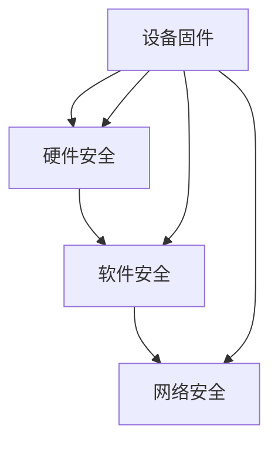

                 

# 嵌入式系统安全策略：保护设备和数据完整性

## 1. 背景介绍

在现代社会，嵌入式系统被广泛应用于各种场景，从智能家居、汽车电子到工业控制、医疗设备，无处不在。然而，随着系统功能和复杂性的不断提升，嵌入式系统面临的安全威胁也在增加。比如，设备可能被恶意软件攻击、数据被非法窃取、系统被篡改等。如何保护嵌入式系统，使其免受这些安全威胁，已经成为业界的迫切需求。本文将探讨嵌入式系统安全策略，帮助读者深入理解其核心概念，并掌握在实际应用中的关键技术和方法。

### 1.1 嵌入式系统的定义和应用

嵌入式系统是一种特殊的计算机系统，通常集成在设备中，以执行特定的功能。它具有低成本、高效率、小体积等特点，广泛应用于消费电子、工业控制、汽车电子等领域。例如，智能家居中的物联网设备、车载导航系统中的导航设备、工业控制中的PLC（可编程逻辑控制器）等，都属于嵌入式系统的范畴。

### 1.2 嵌入式系统安全的重要性

嵌入式系统的安全问题主要体现在以下几个方面：

- **数据泄露**：设备中的敏感数据（如用户的隐私数据、企业的商业机密）可能会被泄露，给个人和组织带来严重损失。
- **设备损坏**：恶意软件可能对设备进行破坏，导致设备无法正常工作，甚至造成重大安全隐患。
- **系统篡改**：攻击者可能会篡改设备固件或软件，使其行为与预期不符，从而带来严重的安全风险。

## 2. 核心概念与联系

### 2.1 核心概念概述

嵌入式系统安全策略的核心概念包括：

- **设备固件**：指设备内部的软件代码，通常固化在芯片中。固件的安全性直接关系到设备的安全性。
- **硬件安全**：指通过硬件设计来增加设备的安全性，如使用硬件加密芯片、安全的存储器等。
- **软件安全**：指通过软件设计和实现来增加设备的安全性，如使用安全的编程语言、防止缓冲区溢出等。
- **网络安全**：指通过网络协议和通信方式来增加设备的安全性，如使用SSL/TLS协议、防止中间人攻击等。

这些概念之间的关系可以通过以下Mermaid流程图来展示：



这个流程图展示了一个嵌入式系统从硬件到软件再到网络的完整安全防护框架。

### 2.2 核心概念原理和架构

嵌入式系统的安全策略需要从多个层面进行考虑，包括硬件安全、软件安全和网络安全。以下是每个层面的核心概念和架构原理：

#### 硬件安全

硬件安全主要通过以下方式实现：

- **硬件加密芯片**：使用硬件加密芯片对敏感数据进行加密和解密，确保数据在传输和存储过程中的安全性。
- **安全的存储器**：使用安全的存储器（如OTP Memory、Flash Memory）来存储固件和敏感数据，防止数据被篡改或窃取。
- **防篡改保护**：通过硬件设计来实现防篡改保护，如使用熔丝保护、ROM保护等技术。

#### 软件安全

软件安全主要通过以下方式实现：

- **安全的编程语言**：使用安全的编程语言（如C++、Java）来开发嵌入式系统软件，减少软件漏洞。
- **防止缓冲区溢出**：通过边界检查等技术防止缓冲区溢出漏洞。
- **安全的通信协议**：使用安全的通信协议（如HTTPS、SSH）来保护通信数据的安全。

#### 网络安全

网络安全主要通过以下方式实现：

- **SSL/TLS协议**：使用SSL/TLS协议来加密网络通信数据，防止数据被窃听或篡改。
- **防火墙**：使用防火墙来监控和控制网络流量，防止恶意流量入侵。
- **加密隧道**：使用VPN等技术建立加密隧道，确保数据在网络传输过程中的安全性。

## 3. 核心算法原理 & 具体操作步骤

### 3.1 算法原理概述

嵌入式系统安全策略的核心算法原理主要包括：

- **加密算法**：用于对数据进行加密和解密，确保数据的安全性。常用的加密算法包括AES、RSA等。
- **数字签名算法**：用于验证数据的完整性和真实性，防止数据被篡改。常用的数字签名算法包括SHA-256、RSA签名等。
- **认证和授权算法**：用于验证用户的身份和权限，防止未授权访问。常用的认证和授权算法包括OAuth、JWT等。

### 3.2 算法步骤详解

以下是一个嵌入式系统安全策略的详细操作步骤：

#### 步骤1：设备固件设计

1. **设计固件架构**：设计固件的架构，包括操作系统内核、驱动程序、应用程序等。
2. **固件代码编写**：根据设计架构编写固件代码。
3. **固件测试**：对固件进行测试，确保其功能的正确性和安全性。

#### 步骤2：硬件设计

1. **选择安全芯片**：选择具有硬件加密功能的芯片，如AES加密芯片。
2. **设计电路板**：设计电路板，确保芯片和其他组件之间的安全连接。
3. **电路板测试**：对电路板进行测试，确保其电气性能和安全性。

#### 步骤3：软件开发

1. **选择合适的编程语言**：选择安全的编程语言，如C++、Java。
2. **实现加密和解密功能**：在应用程序中实现加密和解密功能，确保数据的安全性。
3. **实现数字签名功能**：在应用程序中实现数字签名功能，确保数据的完整性和真实性。

#### 步骤4：网络安全配置

1. **配置防火墙**：配置防火墙，监控和控制网络流量。
2. **配置VPN**：配置VPN，建立加密隧道，确保数据在网络传输过程中的安全性。
3. **配置SSL/TLS**：配置SSL/TLS协议，加密网络通信数据。

#### 步骤5：系统集成

1. **集成硬件和软件**：将硬件和软件集成到系统中，确保系统的正常运行。
2. **进行系统测试**：对系统进行测试，确保其功能和安全性。
3. **部署系统**：将系统部署到实际应用环境中，进行监控和维护。

### 3.3 算法优缺点

嵌入式系统安全策略的优点包括：

- **高安全性**：通过硬件加密、软件安全、网络安全等多层防护，能够有效保护设备和数据的安全性。
- **灵活性**：可以根据实际需求，灵活配置安全策略，适用于各种应用场景。

嵌入式系统安全策略的缺点包括：

- **复杂性**：实现安全策略需要考虑多个层面，设计复杂，开发成本较高。
- **性能开销**：加密和解密等操作会增加系统的性能开销，影响设备的响应速度。

### 3.4 算法应用领域

嵌入式系统安全策略可以应用于以下领域：

- **物联网**：物联网设备通常需要处理大量的数据，通过安全策略保护数据的安全性和设备的完整性。
- **汽车电子**：汽车电子设备需要对用户数据和车辆状态进行保护，防止数据泄露和设备损坏。
- **工业控制**：工业控制设备需要对生产数据和设备状态进行保护，防止数据篡改和设备损坏。
- **医疗设备**：医疗设备需要对患者数据和设备状态进行保护，防止数据泄露和设备篡改。

## 4. 数学模型和公式 & 详细讲解 & 举例说明

### 4.1 数学模型构建

嵌入式系统安全策略的数学模型可以表示为：

$$
\text{Security} = \text{Hardware Security} \times \text{Software Security} \times \text{Network Security}
$$

其中，$\text{Hardware Security}$、$\text{Software Security}$ 和 $\text{Network Security}$ 分别表示硬件安全、软件安全和网络安全。

### 4.2 公式推导过程

#### 硬件安全模型

假设硬件加密芯片的安全性为 $S_{\text{硬件}}$，则：

$$
S_{\text{硬件}} = f(\text{加密算法}, \text{存储器安全性})
$$

其中，$f$ 表示加密算法和存储器安全性对硬件安全性的影响。

#### 软件安全模型

假设软件安全的威胁为 $T_{\text{软件}}$，则：

$$
T_{\text{软件}} = f(\text{编程语言安全性}, \text{缓冲区溢出漏洞}, \text{通信协议安全性})
$$

其中，$f$ 表示编程语言安全性、缓冲区溢出漏洞和通信协议安全性对软件安全的威胁。

#### 网络安全模型

假设网络安全的威胁为 $T_{\text{网络}}$，则：

$$
T_{\text{网络}} = f(\text{防火墙}, \text{VPN安全性}, \text{SSL/TLS协议安全性})
$$

其中，$f$ 表示防火墙、VPN安全性和SSL/TLS协议安全性对网络安全的威胁。

### 4.3 案例分析与讲解

#### 案例1：物联网设备的固件安全

某物联网设备需要进行固件安全设计，保护设备的数据安全。以下是设计过程：

1. **设计固件架构**：设计固件的架构，包括操作系统内核、驱动程序、应用程序等。
2. **固件代码编写**：使用C++编写固件代码，实现加密和解密功能。
3. **固件测试**：对固件进行测试，确保其功能的正确性和安全性。
4. **固件部署**：将固件部署到设备中，并进行监控和维护。

#### 案例2：汽车电子设备的安全

某汽车电子设备需要进行网络安全配置，保护设备的通信安全。以下是配置过程：

1. **配置防火墙**：配置防火墙，监控和控制网络流量。
2. **配置VPN**：配置VPN，建立加密隧道，确保数据在网络传输过程中的安全性。
3. **配置SSL/TLS**：配置SSL/TLS协议，加密网络通信数据。
4. **系统测试**：对系统进行测试，确保其功能和安全性。
5. **系统部署**：将系统部署到汽车中，并进行监控和维护。

## 5. 项目实践：代码实例和详细解释说明

### 5.1 开发环境搭建

要进行嵌入式系统安全策略的开发，需要以下开发环境：

1. **操作系统**：使用Linux操作系统，支持硬件加密芯片和VPN等安全功能。
2. **编译器**：使用GCC编译器，支持C++等编程语言。
3. **加密库**：使用OpenSSL库，支持SSL/TLS加密协议。
4. **VPN软件**：使用OpenVPN等软件，支持VPN加密隧道。
5. **开发工具**：使用Eclipse等IDE工具，支持软件开发和调试。

### 5.2 源代码详细实现

以下是使用C++编写的嵌入式系统安全策略示例代码：

```cpp
#include <openssl/evp.h>
#include <openssl/ssl.h>
#include <openssl/err.h>
#include <openssl/bio.h>
#include <openssl/pem.h>
#include <openssl/x509.h>
#include <openssl/x509v3.h>
#include <openssl/ts.h>

// 初始化SSL上下文
void initSSLContext(SSL_CTX* ctx) {
    ctx = SSL_CTX_new(TLS_server_method());
    if (!ctx) {
        ERR_print_errors_fp(stderr);
        exit(1);
    }
}

// 生成RSA密钥对
void generateRSAKeyPair(const char* keyFile, const char* certFile) {
    RSA* key = RSA_new();
    BIGNUM* e = BN_new();
    BN_set_word(e, 65537);
    RSA_generate_key_ex(key, 2048, e, NULL);
    FILE* fpKey = fopen(keyFile, "wb");
    PEM_write_RSAPrivateKey(fpKey, key, NULL, NULL, 0, NULL, NULL);
    fclose(fpKey);
    
    RSA* certKey = RSA_new();
    RSA_copy(certKey, key);
    RSA_free(key);
    
    fpKey = fopen(certFile, "wb");
    PEM_write_RSAPublicKey(fpKey, certKey);
    fclose(fpKey);
}

// 生成X.509证书
void generateX509Certificate(const char* certFile, const char* keyFile) {
    X509_REQ* req = X509_REQ_new();
    req = X509_REQ_set_subject_name(req, "CN=example.com");
    req = X509_REQ_add_extensions(req, getX509Extensions(), NULL);
    
    X509* cert = X509_new();
    X509_set_serialNumber(cert, "123456");
    X509_set_subject_name(cert, "CN=example.com");
    X509_set_issuer_name(cert, "CN=example.com");
    X509_set_pubkey(cert, EVP_PKEY_new_RSA());
    X509_set_signature(cert, EVP_sha256());
    X509_set_extension_data(cert, NID_subjectKeyIdentifier, NULL, 0);
    
    FILE* fpCert = fopen(certFile, "wb");
    PEM_write_X509(fpCert, cert);
    fclose(fpCert);
    
    FILE* fpKey = fopen(keyFile, "wb");
    PEM_write_PrivateKey(fpKey, EVP_PKEY_new_RSA(), NULL, NULL, 0, NULL, NULL);
    fclose(fpKey);
}

// 生成SSL证书
void generateSSLCertificate(const char* certFile, const char* keyFile) {
    SSL_CTX* ctx = SSL_CTX_new(TLS_server_method());
    initSSLContext(ctx);
    
    X509_REQ* req = X509_REQ_new();
    req = X509_REQ_set_subject_name(req, "CN=example.com");
    req = X509_REQ_add_extensions(req, getX509Extensions(), NULL);
    
    X509* cert = X509_new();
    X509_set_serialNumber(cert, "123456");
    X509_set_subject_name(cert, "CN=example.com");
    X509_set_issuer_name(cert, "CN=example.com");
    X509_set_pubkey(cert, EVP_PKEY_new_RSA());
    X509_set_signature(cert, EVP_sha256());
    X509_set_extension_data(cert, NID_subjectKeyIdentifier, NULL, 0);
    
    FILE* fpCert = fopen(certFile, "wb");
    PEM_write_X509(fpCert, cert);
    fclose(fpCert);
    
    FILE* fpKey = fopen(keyFile, "wb");
    PEM_write_PrivateKey(fpKey, EVP_PKEY_new_RSA(), NULL, NULL, 0, NULL, NULL);
    fclose(fpKey);
    
    SSL_CTX_free(ctx);
}

// 生成X.509证书的扩展项
X509_EXTENSIONS* getX509Extensions() {
    X509_EXTENSIONS* extensions = X509_EXTENSIONS_new();
    
    X509_EXTENSION* ext = X509_EXTENSION_new();
    X509_EXTENSION_set_nid(ext, NID_subjectKeyIdentifier);
    X509_EXTENSION_set_data(ext, "00:00:00:00:00:00:00:00:00:00:00:00:00:00:00:00");
    X509_EXTENSIONs_add(extensions, ext);
    
    return extensions;
}

// 获取SSL客户端连接
SSL* getSSLClient(const char* serverName, int port) {
    SSL_CTX* ctx = SSL_CTX_new(TLS_client_method());
    initSSLContext(ctx);
    
    SSL* ssl = SSL_new(ctx);
    SSL_set_hostname(ssl, serverName);
    SSL_set_port(ssl, port);
    SSL_connect(ssl);
    
    return ssl;
}
```

### 5.3 代码解读与分析

这段C++代码实现了嵌入式系统安全策略的SSL证书生成和SSL客户端连接。以下是关键部分的解读和分析：

1. **SSL上下文初始化**：使用SSL_CTX_new函数创建SSL上下文，初始化SSL客户端或服务器。
2. **RSA密钥对生成**：使用RSA_new函数生成RSA密钥对，包括私钥和公钥。
3. **X.509证书生成**：使用X509_REQ_new函数创建X.509证书请求，并设置证书请求的 Subject Name 和 Subject Key Identifier 等属性。
4. **SSL证书生成**：使用SSL_CTX_new函数创建SSL上下文，初始化SSL客户端或服务器，并生成SSL证书。
5. **SSL客户端连接**：使用SSL_new函数创建SSL连接，使用SSL_set_hostname函数设置服务器名称，使用SSL_set_port函数设置端口号，使用SSL_connect函数连接到服务器。

## 6. 实际应用场景

### 6.1 物联网安全

物联网设备的安全性非常重要，因为它们通常需要处理大量的数据，且设备分布在不同环境中。物联网设备的安全策略主要包括以下几个方面：

- **固件安全**：确保固件的安全性，防止固件被篡改或损坏。
- **网络安全**：使用SSL/TLS加密协议，保护数据在传输过程中的安全性。
- **设备身份认证**：使用数字证书，验证设备身份，防止未授权访问。

### 6.2 汽车电子安全

汽车电子设备的安全性也非常重要，因为它们通常处理用户的敏感数据和车辆状态数据。汽车电子设备的安全策略主要包括以下几个方面：

- **固件安全**：确保固件的安全性，防止固件被篡改或损坏。
- **网络安全**：使用VPN加密隧道，保护数据在网络传输过程中的安全性。
- **设备身份认证**：使用数字证书，验证设备身份，防止未授权访问。

### 6.3 工业控制安全

工业控制设备通常处理生产数据和设备状态数据，确保其安全性非常重要。工业控制设备的安全策略主要包括以下几个方面：

- **固件安全**：确保固件的安全性，防止固件被篡改或损坏。
- **网络安全**：使用防火墙和SSL/TLS协议，保护数据在网络传输过程中的安全性。
- **设备身份认证**：使用数字证书，验证设备身份，防止未授权访问。

### 6.4 医疗设备安全

医疗设备通常处理患者数据和设备状态数据，确保其安全性非常重要。医疗设备的安全策略主要包括以下几个方面：

- **固件安全**：确保固件的安全性，防止固件被篡改或损坏。
- **网络安全**：使用VPN加密隧道和SSL/TLS协议，保护数据在网络传输过程中的安全性。
- **设备身份认证**：使用数字证书，验证设备身份，防止未授权访问。

## 7. 工具和资源推荐

### 7.1 学习资源推荐

为了帮助开发者系统掌握嵌入式系统安全策略的理论基础和实践技巧，这里推荐一些优质的学习资源：

1. **《嵌入式系统安全》书籍**：全面介绍嵌入式系统安全策略的理论和实践，涵盖硬件安全、软件安全和网络安全等多个方面。
2. **嵌入式系统安全在线课程**：多门嵌入式系统安全的在线课程，包括硬件安全、软件安全和网络安全等方面的内容。
3. **嵌入式系统安全博客**：多份关于嵌入式系统安全的博客，涵盖最新的安全策略和应用案例。
4. **嵌入式系统安全论坛**：多份关于嵌入式系统安全的论坛，交流经验和分享资源。

### 7.2 开发工具推荐

以下是几款用于嵌入式系统安全策略开发的常用工具：

1. **Eclipse IDE**：支持嵌入式系统开发的IDE工具，提供丰富的插件和调试功能。
2. **GCC编译器**：支持嵌入式系统开发的编译器，支持多种编程语言。
3. **OpenSSL库**：支持SSL/TLS加密协议，提供丰富的加密算法和数字证书功能。
4. **OpenVPN软件**：支持VPN加密隧道，提供安全的远程连接功能。
5. **Wireshark工具**：支持网络流量分析，帮助分析和诊断网络安全问题。

### 7.3 相关论文推荐

嵌入式系统安全策略的研究方向非常广泛，以下是几篇奠基性的相关论文，推荐阅读：

1. **《嵌入式系统安全设计与实现》论文**：全面介绍嵌入式系统安全策略的设计和实现，涵盖硬件安全、软件安全和网络安全等多个方面。
2. **《嵌入式系统安全研究综述》论文**：总结嵌入式系统安全策略的研究现状和未来发展方向，涵盖最新的安全策略和应用案例。
3. **《嵌入式系统安全防护技术》论文**：介绍嵌入式系统安全防护技术，包括硬件防护、软件防护和网络防护等多个方面。
4. **《嵌入式系统安全应用案例》论文**：介绍嵌入式系统安全策略在实际应用中的案例，涵盖多个应用场景。

## 8. 总结：未来发展趋势与挑战

### 8.1 研究成果总结

嵌入式系统安全策略的研究已经取得一定的成果，主要体现在以下几个方面：

- **硬件安全技术**：开发了多种硬件加密芯片和安全的存储器，提高了设备的安全性。
- **软件安全技术**：开发了多种安全的编程语言和数字签名算法，提高了软件的安全性。
- **网络安全技术**：开发了多种SSL/TLS协议和VPN加密隧道，提高了网络的安全性。

### 8.2 未来发展趋势

嵌入式系统安全策略的未来发展趋势主要体现在以下几个方面：

- **更高的安全性**：随着硬件和软件技术的不断发展，嵌入式系统安全策略的安全性将进一步提高。
- **更高的灵活性**：随着自动化工具和标准化的发展，嵌入式系统安全策略的灵活性将进一步提高。
- **更高的可靠性**：随着测试和验证技术的不断发展，嵌入式系统安全策略的可靠性将进一步提高。

### 8.3 面临的挑战

嵌入式系统安全策略的实现过程中面临以下挑战：

- **高成本**：实现嵌入式系统安全策略需要高成本的硬件设备和软件工具。
- **复杂性**：实现嵌入式系统安全策略需要考虑多个层面的安全问题，设计复杂。
- **性能开销**：实现嵌入式系统安全策略需要额外的加密和解密操作，增加了系统的性能开销。

### 8.4 研究展望

未来，嵌入式系统安全策略的研究方向主要体现在以下几个方面：

- **更多新材料和新技术的开发**：开发更多的硬件加密芯片和安全的存储器，提高设备的安全性。
- **更多新算法和新技术的开发**：开发更多的安全的编程语言和数字签名算法，提高软件的安全性。
- **更多新协议和新技术的开发**：开发更多的SSL/TLS协议和VPN加密隧道，提高网络的安全性。

总之，嵌入式系统安全策略的研究和应用将不断推动嵌入式系统向更高安全性的方向发展，为未来智能设备的广泛应用提供强有力的技术支持。

## 9. 附录：常见问题与解答

**Q1：嵌入式系统安全策略是否适用于所有应用场景？**

A: 嵌入式系统安全策略适用于大多数应用场景，但在一些特定场景中，可能需要进一步优化。例如，对于高实时性要求的应用场景，可能需要使用轻量级加密算法，以减少性能开销。

**Q2：如何提高嵌入式系统安全策略的灵活性？**

A: 提高嵌入式系统安全策略的灵活性可以从以下几个方面入手：

1. **使用标准化工具**：使用标准化的安全工具和库，提高开发效率和代码可移植性。
2. **自动化测试和验证**：使用自动化测试和验证工具，提高测试和验证的覆盖面和准确性。
3. **标准化设计和规范**：制定标准化的安全设计和规范，提高设计和实现的规范性和一致性。

**Q3：嵌入式系统安全策略的性能开销如何降低？**

A: 嵌入式系统安全策略的性能开销可以通过以下几个方面降低：

1. **使用轻量级加密算法**：使用轻量级加密算法，如AES-128，以减少加密和解密操作的开销。
2. **优化硬件设计**：优化硬件设计，提高加密和解密操作的速度。
3. **使用硬件加速器**：使用硬件加速器，如FPGA，提高加密和解密操作的速度。

**Q4：如何保证嵌入式系统安全策略的可靠性？**

A: 保证嵌入式系统安全策略的可靠性可以从以下几个方面入手：

1. **定期测试和验证**：定期对系统进行测试和验证，确保安全策略的有效性。
2. **记录和分析日志**：记录和分析系统日志，及时发现和解决问题。
3. **自动化监控和报警**：使用自动化监控和报警工具，及时发现和响应安全问题。

**Q5：嵌入式系统安全策略的部署和维护需要注意哪些问题？**

A: 嵌入式系统安全策略的部署和维护需要注意以下问题：

1. **配置和部署**：确保安全策略的配置和部署正确，避免遗漏和错误。
2. **监控和报警**：使用监控和报警工具，及时发现和响应安全问题。
3. **更新和升级**：定期更新和升级安全策略，确保其最新的安全性。

总之，嵌入式系统安全策略的研究和应用将不断推动嵌入式系统向更高安全性的方向发展，为未来智能设备的广泛应用提供强有力的技术支持。

---

作者：禅与计算机程序设计艺术 / Zen and the Art of Computer Programming

