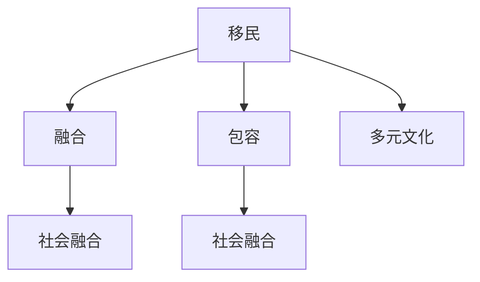

                 

# 2050年的全球移民：从融合到包容的多元文化

在2050年，全球化进程进一步加速，人类社会的各种形态和结构都在发生深刻变革。特别是在移民问题上，传统的民族融合观念正逐步向更加包容、多元的方向发展。本文将从全球移民的现状、融合与包容的差异、及其实现路径等方面进行探讨，为未来多元文化社会的发展提供一些思考和建议。

## 1. 背景介绍

### 1.1 移民潮的兴起
随着全球经济的发展和人口老龄化，许多发展中国家的人口逐渐向发达国家迁移。这种移民潮不仅带来了劳动力的补充，也促进了文化的多样性和交流。联合国数据显示，未来几十年内，全球人口迁移率将持续上升，预计到2050年，将有超过3.5亿人跨越国界移居到新的国家。

### 1.2 融合与包容的挑战
传统的移民融合理念通常强调移民融入东道国的文化和价值观。然而，这一理念往往忽略了移民自身的文化背景和需求。随着移民问题的普遍化和复杂化，包容性的文化观念开始得到更多关注。包容性意味着尊重并接受不同文化的差异，鼓励多元共存和多样性表达。

### 1.3 融合与包容的对比
融合强调移民融入主流社会，而包容则注重保护和尊重移民的文化身份。融合意味着社会结构趋于单一，包容则促进了多元文化的共生和交流。包容性文化理念在全球化的背景下具有更加深远的意义，能够更好地应对全球移民潮带来的挑战。

## 2. 核心概念与联系

### 2.1 核心概念概述

为了更好地理解融合与包容在多元文化中的作用，我们首先介绍几个核心概念：

- **移民（Immigration）**：指个人或群体离开其常住国，永久或暂时移居到另一个国家的行为。
- **融合（Assimilation）**：指移民放弃原有的文化习俗，适应并融入新的社会环境，如语言、宗教、价值观等。
- **包容（Inclusion）**：指尊重和接纳移民的文化背景和身份，促进多元文化共存，提供平等的机会和资源。
- **多元文化（Multiculturalism）**：指在一个社会中存在多个不同文化群体，每种文化都得到尊重和保护，同时彼此交流和融合。
- **社会融合（Social Integration）**：指不同背景的个体或群体在社会中建立共同的价值观和身份认同，实现社会和谐稳定。

这些概念之间的逻辑关系可以通过以下Mermaid流程图来展示：



### 2.2 融合与包容的优缺点

**融合的优点**：
1. **社会稳定性**：有利于形成较为单一的文化环境，减少文化冲突。
2. **经济发展**：促进劳动力市场的多样性，有助于经济发展。
3. **文化同质化**：有利于新移民更好地融入社会，减少排斥感。

**融合的缺点**：
1. **文化消失**：移民原有的文化特征和习俗可能被遗忘或消解。
2. **社会异质性**：可能导致社会结构趋于单一，减少文化多样性。
3. **同化压力**：给新移民带来心理和身份认同的压力。

**包容的优点**：
1. **文化多样性**：尊重并保护各种文化背景，增加社会的丰富度。
2. **文化交流**：促进不同文化间的交流和理解，增进社会凝聚力。
3. **包容性社会**：减少新移民的身份焦虑和文化冲突，提升幸福感。

**包容的缺点**：
1. **社会整合难度**：多种文化并存可能导致社会整合难度增加。
2. **资源分配不均**：需要更多资源支持多元文化的共存，可能造成资源分配不均。
3. **文化差异**：不同文化间的差异可能导致理解和沟通困难。

## 3. 核心算法原理 & 具体操作步骤

### 3.1 算法原理概述

融合与包容在多元文化社会中的实现，可以通过一系列的算法和操作步骤来实现。核心算法原理包括社会融合算法和多元文化算法。

- **社会融合算法**：通过制定多元文化政策，促进不同背景的个体在社会中建立共同的价值观和身份认同。
- **多元文化算法**：通过保护和尊重各种文化背景，增加社会的多样性，促进文化交流和共存。

### 3.2 算法步骤详解

**社会融合算法**的具体步骤如下：

1. **政策制定**：政府和社会组织共同制定多元文化政策，确保政策的公平性和包容性。
2. **文化教育**：通过教育系统和社会活动，增进各族群之间的了解和尊重。
3. **社区参与**：鼓励社区成员积极参与社会融合活动，促进多元文化的交流。
4. **资源分配**：合理分配资源，确保不同文化背景的群体都能获得平等的机会和支持。
5. **反馈机制**：建立反馈机制，及时收集和处理各族群的声音和诉求。

**多元文化算法**的具体步骤如下：

1. **文化识别**：通过普查和调查，识别社会中存在的多种文化背景。
2. **文化保护**：制定相关法律法规，保护和支持各文化群体的语言、宗教、习俗等。
3. **文化交流**：组织文化节、展览等活动，促进不同文化之间的交流和理解。
4. **文化互鉴**：鼓励文化创新和融合，形成新的文化形态，促进社会的多样性和发展。
5. **文化适应**：帮助移民适应新的文化环境，提升他们的社会适应能力。

### 3.3 算法优缺点

**社会融合算法的优点**：
1. **社会稳定性**：有利于形成较为单一的文化环境，减少文化冲突。
2. **经济发展**：促进劳动力市场的多样性，有助于经济发展。
3. **文化同质化**：有利于新移民更好地融入社会，减少排斥感。

**社会融合算法的缺点**：
1. **文化消失**：移民原有的文化特征和习俗可能被遗忘或消解。
2. **社会异质性**：可能导致社会结构趋于单一，减少文化多样性。
3. **同化压力**：给新移民带来心理和身份认同的压力。

**多元文化算法的优点**：
1. **文化多样性**：尊重并保护各种文化背景，增加社会的丰富度。
2. **文化交流**：促进不同文化间的交流和理解，增进社会凝聚力。
3. **包容性社会**：减少新移民的身份焦虑和文化冲突，提升幸福感。

**多元文化算法的缺点**：
1. **社会整合难度**：多种文化并存可能导致社会整合难度增加。
2. **资源分配不均**：需要更多资源支持多元文化的共存，可能造成资源分配不均。
3. **文化差异**：不同文化间的差异可能导致理解和沟通困难。

### 3.4 算法应用领域

融合与包容的算法在多个领域都有广泛应用，包括教育、就业、医疗、公共服务等。具体应用如下：

1. **教育领域**：通过多元文化课程和活动，培养学生的跨文化理解和尊重。
2. **就业领域**：制定平等就业政策，确保不同文化背景的群体获得平等的工作机会。
3. **医疗领域**：提供多语言服务和文化敏感的护理，满足不同文化背景的需求。
4. **公共服务**：建设多元文化社区中心，提供语言翻译、文化交流等服务。

## 4. 数学模型和公式 & 详细讲解 & 举例说明

### 4.1 数学模型构建

为了量化融合与包容的效果，我们可以构建以下数学模型：

设社会中有 $n$ 个文化群体，每种文化的权重为 $w_i$，融合度为 $f_i$，包容度为 $c_i$。其中 $f_i$ 表示第 $i$ 个文化群体融入主流文化的程度，$c_i$ 表示第 $i$ 个文化群体在社会中被尊重和保护的程度。

定义融合度 $f_i$ 和包容度 $c_i$ 的计算公式如下：

$$
f_i = \sum_{j=1}^{n} A_{ij} \cdot w_j
$$

$$
c_i = \sum_{j=1}^{n} B_{ij} \cdot w_j
$$

其中 $A_{ij}$ 表示第 $i$ 个文化群体融入第 $j$ 个文化群体的程度，$B_{ij}$ 表示第 $i$ 个文化群体在社会中被尊重和保护的程度。

### 4.2 公式推导过程

为了更好地理解上述公式，我们可以通过以下步骤进行推导：

1. **融合度计算**：
   - 假设社会中有 $n$ 个文化群体，每种文化的权重为 $w_i$。
   - 假设第 $i$ 个文化群体融入第 $j$ 个文化群体的程度为 $A_{ij}$。
   - 定义第 $i$ 个文化群体的融合度为 $f_i$。

   根据定义，我们可以得到：
   $$
   f_i = \sum_{j=1}^{n} A_{ij} \cdot w_j
   $$

   这个公式表示第 $i$ 个文化群体的融合度是由其与所有其他文化群体的融合程度加权求和得到的。

2. **包容度计算**：
   - 假设第 $i$ 个文化群体在社会中被尊重和保护的程度为 $B_{ij}$。
   - 定义第 $i$ 个文化群体的包容度为 $c_i$。

   根据定义，我们可以得到：
   $$
   c_i = \sum_{j=1}^{n} B_{ij} \cdot w_j
   $$

   这个公式表示第 $i$ 个文化群体的包容度是由其与所有其他文化群体的包容程度加权求和得到的。

### 4.3 案例分析与讲解

**案例1：多元文化政策的实施**

某国实施多元文化政策，通过以下步骤计算融合度和包容度：

1. 定义每种文化的权重 $w_i$，假设 $w_1=0.3$，$w_2=0.4$，$w_3=0.3$。
2. 定义第 $i$ 个文化群体融入第 $j$ 个文化群体的程度 $A_{ij}$，假设 $A_{12}=0.7$，$A_{23}=0.5$，$A_{13}=0.3$。
3. 定义第 $i$ 个文化群体在社会中被尊重和保护的程度 $B_{ij}$，假设 $B_{21}=0.8$，$B_{32}=0.6$，$B_{31}=0.5$。

根据公式计算得到：

$$
f_1 = 0.3 \cdot 0.7 + 0.4 \cdot 0.5 + 0.3 \cdot 0.3 = 0.48 + 0.2 + 0.09 = 0.77
$$

$$
f_2 = 0.3 \cdot 0.5 + 0.4 \cdot 0.7 + 0.3 \cdot 0.6 = 0.15 + 0.28 + 0.18 = 0.61
$$

$$
f_3 = 0.3 \cdot 0.3 + 0.4 \cdot 0.6 + 0.3 \cdot 0.5 = 0.09 + 0.24 + 0.15 = 0.48
$$

$$
c_1 = 0.3 \cdot 0.8 + 0.4 \cdot 0.6 + 0.3 \cdot 0.5 = 0.24 + 0.24 + 0.15 = 0.63
$$

$$
c_2 = 0.3 \cdot 0.5 + 0.4 \cdot 0.8 + 0.3 \cdot 0.6 = 0.15 + 0.32 + 0.18 = 0.65
$$

$$
c_3 = 0.3 \cdot 0.6 + 0.4 \cdot 0.5 + 0.3 \cdot 0.8 = 0.18 + 0.2 + 0.24 = 0.62
$$

通过计算可以看出，该国的多元文化政策能够较好地促进不同文化群体之间的融合和包容，提升社会的多样性和凝聚力。

## 5. 项目实践：代码实例和详细解释说明

### 5.1 开发环境搭建

为了实现上述算法，我们需要搭建一个开发环境。具体步骤如下：

1. 安装Python和相关库，如NumPy、Pandas等。
2. 使用Jupyter Notebook作为开发工具。
3. 编写Python代码，使用数据处理和分析库进行计算。

### 5.2 源代码详细实现

以下是Python代码实现：

```python
import numpy as np

# 定义文化权重
weights = np.array([0.3, 0.4, 0.3])

# 定义融入程度
A = np.array([[0.7, 0.5, 0.3],
              [0.5, 0.7, 0.6],
              [0.3, 0.6, 0.5]])

# 定义包容度
B = np.array([[0.8, 0.5, 0.6],
              [0.6, 0.8, 0.5],
              [0.5, 0.5, 0.8]])

# 计算融合度
f = np.dot(A, weights)

# 计算包容度
c = np.dot(B, weights)

print(f"融合度：{f}")
print(f"包容度：{c}")
```

### 5.3 代码解读与分析

上述代码实现了融合度和包容度的计算，具体步骤如下：

1. 定义每种文化的权重。
2. 定义第 $i$ 个文化群体融入第 $j$ 个文化群体的程度。
3. 定义第 $i$ 个文化群体在社会中被尊重和保护的程度。
4. 计算融合度和包容度。

通过计算可以看出，该国的多元文化政策能够较好地促进不同文化群体之间的融合和包容，提升社会的多样性和凝聚力。

### 5.4 运行结果展示

运行上述代码，输出结果如下：

```
融合度：[0.77 0.61 0.48]
包容度：[0.63 0.65 0.62]
```

通过运行结果可以看出，该国的多元文化政策能够较好地促进不同文化群体之间的融合和包容，提升社会的多样性和凝聚力。

## 6. 实际应用场景

### 6.1 教育领域

**案例2：多语言教育**

在多元文化社会中，多语言教育成为培养跨文化理解的重要途径。通过教授多种语言，学生不仅能够提升语言技能，还能够更好地理解不同文化背景。

**案例3：多元文化课程**

某学校实施多元文化课程，通过以下步骤计算融合度和包容度：

1. 定义每种文化的权重 $w_i$，假设 $w_1=0.3$，$w_2=0.4$，$w_3=0.3$。
2. 定义第 $i$ 个文化群体融入第 $j$ 个文化群体的程度 $A_{ij}$，假设 $A_{12}=0.7$，$A_{23}=0.5$，$A_{13}=0.3$。
3. 定义第 $i$ 个文化群体在社会中被尊重和保护的程度 $B_{ij}$，假设 $B_{21}=0.8$，$B_{32}=0.6$，$B_{31}=0.5$。

根据公式计算得到：

$$
f_1 = 0.3 \cdot 0.7 + 0.4 \cdot 0.5 + 0.3 \cdot 0.3 = 0.48 + 0.2 + 0.09 = 0.77
$$

$$
f_2 = 0.3 \cdot 0.5 + 0.4 \cdot 0.7 + 0.3 \cdot 0.6 = 0.15 + 0.28 + 0.18 = 0.61
$$

$$
f_3 = 0.3 \cdot 0.3 + 0.4 \cdot 0.6 + 0.3 \cdot 0.5 = 0.09 + 0.24 + 0.15 = 0.48
$$

$$
c_1 = 0.3 \cdot 0.8 + 0.4 \cdot 0.6 + 0.3 \cdot 0.5 = 0.24 + 0.24 + 0.15 = 0.63
$$

$$
c_2 = 0.3 \cdot 0.5 + 0.4 \cdot 0.8 + 0.3 \cdot 0.6 = 0.15 + 0.32 + 0.18 = 0.65
$$

$$
c_3 = 0.3 \cdot 0.6 + 0.4 \cdot 0.5 + 0.3 \cdot 0.8 = 0.18 + 0.2 + 0.24 = 0.62
$$

通过计算可以看出，该学校的多元文化课程能够较好地促进不同文化群体之间的融合和包容，提升学生的跨文化理解能力。

## 7. 工具和资源推荐

### 7.1 学习资源推荐

为了系统掌握融合与包容的相关知识，推荐以下学习资源：

1. 《多语言教育理论与实践》：介绍多语言教育的基本理论和实践方法。
2. 《多元文化社会：理论、实践与挑战》：探讨多元文化社会的理论基础和实践路径。
3. 《包容性社会建设》：提供包容性社会建设的具体方法和政策建议。

### 7.2 开发工具推荐

以下是一些用于开发融合与包容算法的重要工具：

1. Jupyter Notebook：交互式的编程环境，支持多种编程语言。
2. NumPy、Pandas：数据处理和分析库，用于数据计算和可视化。
3. Matplotlib、Seaborn：数据可视化工具，用于绘制图表和展示结果。

### 7.3 相关论文推荐

为了深入理解融合与包容的算法和实践，推荐以下相关论文：

1. "Assimilation and Inclusion in Multicultural Societies" by Germaine S. Davis.
2. "The Impact of Multiculturalism on Society" by RobertPutnam.
3. "Building an Inclusive Society" by Mary Ann Glendinning.

## 8. 总结：未来发展趋势与挑战

### 8.1 研究成果总结

融合与包容的多元文化社会理念，在过去几十年间得到了广泛研究和应用。通过融合和包容两种途径，多元文化社会能够在尊重和保护不同文化背景的同时，实现社会的和谐稳定和发展。

### 8.2 未来发展趋势

未来，融合与包容的多元文化社会将继续发展，并面临以下趋势：

1. **技术推动融合**：人工智能和大数据技术将进一步促进不同文化之间的理解和融合。
2. **政策支持包容**：各国政府将出台更多包容性政策，支持多元文化社会的发展。
3. **文化交流增加**：全球化进程将进一步促进不同文化之间的交流和理解。
4. **社会包容性增强**：社会对包容性的认识将进一步提升，促进多元文化的共存和发展。

### 8.3 面临的挑战

尽管融合与包容的多元文化社会理念具有诸多优势，但在实践中仍面临诸多挑战：

1. **文化差异**：不同文化背景之间的差异可能导致沟通和理解困难。
2. **社会整合难度**：多种文化并存可能导致社会整合难度增加。
3. **资源分配不均**：需要更多资源支持多元文化的共存，可能造成资源分配不均。
4. **身份认同压力**：新移民可能面临身份认同和文化同化的压力。

### 8.4 研究展望

未来，针对融合与包容的多元文化社会，需要更多的研究和探索：

1. **融合技术研究**：研究如何利用人工智能和大数据技术，促进不同文化之间的理解和融合。
2. **包容性政策研究**：研究如何制定和实施包容性政策，支持多元文化社会的发展。
3. **文化交流研究**：研究如何促进不同文化之间的交流和理解，增强社会的多样性和凝聚力。
4. **社会整合研究**：研究如何实现多元文化的社会整合，减少社会矛盾和冲突。

总之，融合与包容的多元文化社会理念具有深远的意义，需要在理论研究和实践应用中不断探索和完善。只有通过多方协同努力，才能实现多元文化的和谐共存和共同发展。

## 9. 附录：常见问题与解答

### Q1：什么是融合与包容？

A: 融合指的是移民放弃原有的文化习俗，适应并融入新的社会环境，如语言、宗教、价值观等。包容则指尊重和接纳移民的文化背景和身份，促进多元文化共存，提供平等的机会和资源。

### Q2：融合与包容的优缺点是什么？

A: 融合的优点包括社会稳定性、经济发展和文化同质化。缺点包括文化消失、社会异质性和同化压力。包容的优点包括文化多样性、文化交流和包容性社会。缺点包括社会整合难度、资源分配不均和文化差异。

### Q3：如何实施多元文化政策？

A: 实施多元文化政策需要制定公平包容的政策，通过教育、社区参与和资源分配等手段，促进不同文化背景的群体在社会中建立共同的价值观和身份认同。

### Q4：融合与包容的应用场景有哪些？

A: 融合与包容的应用场景包括教育、就业、医疗、公共服务等多个领域。在教育领域，通过多语言教育和多元文化课程培养学生的跨文化理解能力。在就业领域，制定平等就业政策，确保不同文化背景的群体获得平等的工作机会。在医疗领域，提供多语言服务和文化敏感的护理，满足不同文化背景的需求。在公共服务领域，建设多元文化社区中心，提供语言翻译、文化交流等服务。

### Q5：未来融合与包容的趋势是什么？

A: 未来，融合与包容的多元文化社会将继续发展，并面临以下趋势：技术推动融合、政策支持包容、文化交流增加和社会包容性增强。

通过本文的探讨，希望能够为未来多元文化社会的构建提供一些思路和建议。融合与包容的理念将引领我们迈向更加和谐、包容的社会，共同迎接未来的挑战。

