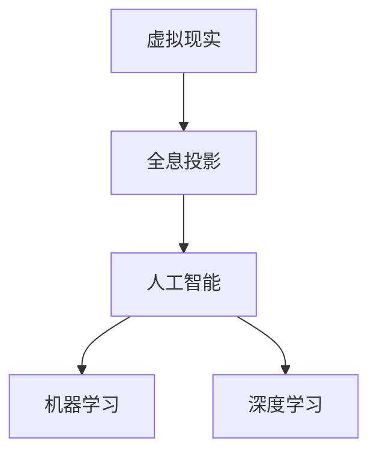

                 

# 2050年的数字文化：从虚拟现实博物馆到全息投影演艺的文化体验

## 1. 背景介绍

### 1.1 问题由来
在科技迅猛发展的今天，数字化已经渗透到我们生活的方方面面。未来，数字化将在文化领域掀起一场革命。从虚拟现实(VR)博物馆到全息投影演艺，数字技术正在重新定义文化体验。本文将探讨这一趋势，分析其原理、技术细节及应用前景，为数字化文化的未来提供一瞥。

### 1.2 问题核心关键点
本文聚焦于虚拟现实(VR)和全息投影在文化领域的应用，包括但不限于：
- VR博物馆体验：利用虚拟现实技术，重建历史建筑，重现历史事件，让观众沉浸式体验文化历史。
- 全息投影演艺：通过全息技术，重现古代表演艺术，如唐代舞蹈、古罗马竞技场，创造全新的演艺体验。
- 数字艺术创作：利用人工智能和数字技术，创作传统艺术品的数字化版本，甚至创造全新的艺术形式。

### 1.3 问题研究意义
研究数字化文化的重要意义在于：
- 提升文化体验质量：通过技术手段，丰富文化展现形式，提升观众的体验感和互动性。
- 保护文化遗产：通过数字化手段，保留和传承人类文化遗产，避免物理损坏或失传。
- 促进文化创新：数字化技术为文化创意产业提供了新的创作和传播手段，催生了新的文化形式和市场。
- 拓展文化交流：数字化文化跨越地域限制，促进全球文化交流和共享。

## 2. 核心概念与联系

### 2.1 核心概念概述

为更好地理解虚拟现实博物馆和全息投影演艺，本节将介绍几个核心概念：

- **虚拟现实(Virtual Reality, VR)**：通过计算机生成的模拟环境，使用户可以“进入”该环境，与虚拟世界交互。
- **全息投影(Holographic Projection)**：利用干涉和衍射原理，重建物体的三维图像，使其在空间中以立体形式呈现。
- **人工智能(Artificial Intelligence, AI)**：使机器模拟人类智能行为的理论、开发和应用。
- **机器学习(Machine Learning, ML)**：让机器通过数据学习规律，自动优化性能。
- **深度学习(Deep Learning, DL)**：一种机器学习方法，通过构建深度神经网络，解决复杂的非线性问题。

这些核心概念之间的逻辑关系可以通过以下Mermaid流程图来展示：



这个流程图展示了一个简单的数字文化技术栈：虚拟现实和全息投影是基础技术手段，人工智能和机器学习是核心算法，深度学习是高级应用，共同构成数字文化体验的技术基础。

## 3. 核心算法原理 & 具体操作步骤

### 3.1 算法原理概述

虚拟现实博物馆和全息投影演艺的核心算法原理包括：

- **三维建模**：利用计算机图形学技术，建立真实世界的三维模型，用于虚拟现实场景和全息投影。
- **实时渲染**：在虚拟现实和全息投影中，需要对三维模型进行实时渲染，以提供流畅的视觉体验。
- **空间交互**：通过传感器和控制器，使用户能够与虚拟环境进行自然交互。
- **深度学习**：利用深度学习模型，从大量历史数据中学习历史事件、文化传承等知识，用于生成虚拟场景和全息投影内容。

### 3.2 算法步骤详解

**虚拟现实博物馆**：

1. **三维建模**：对博物馆藏品进行三维扫描，生成数字模型。
2. **纹理映射**：为数字模型添加材质和纹理，使其逼真还原。
3. **场景合成**：将数字模型放置在虚拟环境中，生成完整的虚拟博物馆场景。
4. **用户交互**：通过手柄、VR头盔等设备，用户可以在虚拟博物馆中自由探索。
5. **知识讲解**：利用自然语言处理(NLP)技术，生成虚拟导游的讲解音频。

**全息投影演艺**：

1. **三维重建**：利用计算机视觉和图像处理技术，重建古代表演艺术的3D模型。
2. **光线模拟**：使用物理引擎模拟光线的传播和反射，生成逼真的全息图像。
3. **空间定位**：通过定位系统，精确控制全息图像的位置和姿态。
4. **实时更新**：根据观众的位置和动作，动态更新全息图像，提供沉浸式体验。
5. **交互设计**：设计观众与全息图像的互动方式，如手势、触觉等。

### 3.3 算法优缺点

**虚拟现实博物馆**：

优点：
- 沉浸式体验：用户能够深度沉浸在虚拟环境中，获得直观的感受。
- 交互性强：用户可以通过手势、语音等多种方式与虚拟环境互动。
- 动态生成：可以实时更新虚拟环境，提供逼真的历史场景。

缺点：
- 设备限制：需要高性能设备支持，成本较高。
- 视觉疲劳：长时间使用VR设备，容易引发视觉疲劳。
- 数据依赖：需要大量高质量的数据进行建模和渲染。

**全息投影演艺**：

优点：
- 立体呈现：观众可以从多个角度观察全息图像，获得全新的视觉体验。
- 动态互动：观众可以与全息图像互动，增强体验的沉浸感和参与感。
- 历史再现：可以重现古代表演艺术，让观众跨越时空体验历史。

缺点：
- 空间限制：需要较大的空间进行全息投影，限制了应用场景。
- 设备复杂：设备较为复杂，成本较高，维护困难。
- 技术局限：当前技术下，全息投影的分辨率和细节表现仍需提升。

### 3.4 算法应用领域

虚拟现实博物馆和全息投影演艺的应用领域包括：

- 博物馆展览：通过VR和全息投影技术，再现历史文物和场景，提升博物馆展览的趣味性和互动性。
- 文化遗产保护：利用数字化手段，保留和传承文化遗迹，避免物理损坏或失传。
- 文化教育：通过虚拟现实和全息投影，让学生直观感受历史事件和文化传承，提升教育效果。
- 旅游观光：构建虚拟旅游场景，让用户在家中就能体验世界各地的文化名胜。
- 影视娱乐：制作虚拟现实电影和全息投影演艺，创造全新的视听体验。

## 4. 数学模型和公式 & 详细讲解 & 举例说明

### 4.1 数学模型构建

为了更好地理解和描述虚拟现实和全息投影的数学模型，本文将详细构建相关的数学模型。

设虚拟现实博物馆的场景为 $S=\{(x_i,y_i,z_i)\}_{i=1}^N$，其中 $x_i,y_i,z_i$ 分别为场景中第 $i$ 个物体的坐标。设博物馆展品的三维模型为 $M=\{(m_x,m_y,m_z)\}_{i=1}^N$，其中 $m_x,m_y,m_z$ 分别为模型中第 $i$ 个物体的坐标。

设虚拟现实博物馆的用户输入为 $U=(u_x,u_y,u_z)$，其中 $u_x,u_y,u_z$ 为用户在虚拟环境中的位置坐标。

设全息投影的3D模型为 $G=\{(g_x,g_y,g_z)\}_{i=1}^N$，其中 $g_x,g_y,g_z$ 为全息图像中第 $i$ 个物体的坐标。

### 4.2 公式推导过程

**虚拟现实博物馆**：

1. **三维模型对齐**：将展品的三维模型 $M$ 对齐到用户位置 $U$，得到对齐后的坐标 $M'=(M_x'-U_x,M_y'-U_y,M_z'-U_z)$。
2. **纹理映射**：将展品纹理映射到对齐后的模型上，得到三维纹理 $T$。
3. **环境渲染**：将展品和背景场景结合，生成完整的虚拟场景 $S'$。
4. **用户交互**：通过传感器捕捉用户动作，生成交互指令，控制展品动态展示。

**全息投影演艺**：

1. **三维重建**：通过计算机视觉技术，将古代表演艺术的二维图像 $I$ 重建成三维模型 $G$。
2. **光线模拟**：使用物理引擎模拟光线的传播和反射，得到全息图像 $H$。
3. **空间定位**：通过定位系统，确定全息图像的位置和姿态，使其在空间中精确呈现。
4. **实时更新**：根据观众位置和动作，动态更新全息图像，保持沉浸感。

### 4.3 案例分析与讲解

以唐代舞蹈的全息投影为例，介绍全息投影演艺的技术实现过程：

1. **数据采集**：使用高清摄影机拍摄古代舞蹈表演的视频，采集舞蹈动作和场景。
2. **图像处理**：利用图像处理技术，将视频转换为3D模型，包含舞蹈动作和场景背景。
3. **纹理贴图**：为3D模型添加材质和纹理，模拟古代服饰和场景的质感。
4. **光线模拟**：使用物理引擎模拟光线的传播和反射，生成逼真的全息图像。
5. **空间定位**：通过定位系统，确定全息图像在空间中的位置和姿态，使其与观众交互。
6. **互动设计**：设计观众与全息图像的互动方式，如手势控制舞蹈动作。

## 5. 项目实践：代码实例和详细解释说明

### 5.1 开发环境搭建

在进行虚拟现实和全息投影的实践开发前，我们需要准备好开发环境。以下是使用Python进行PyTorch和Open3D开发的环境配置流程：

1. 安装Anaconda：从官网下载并安装Anaconda，用于创建独立的Python环境。

2. 创建并激活虚拟环境：
```bash
conda create -n pytorch-env python=3.8 
conda activate pytorch-env
```

3. 安装PyTorch和Open3D：
```bash
conda install pytorch torchvision torchaudio cudatoolkit=11.1 -c pytorch -c conda-forge
pip install open3d
```

4. 安装各类工具包：
```bash
pip install numpy pandas scikit-learn matplotlib tqdm jupyter notebook ipython
```

完成上述步骤后，即可在`pytorch-env`环境中开始开发实践。

### 5.2 源代码详细实现

下面我们以唐代舞蹈的全息投影为例，给出使用PyTorch和Open3D进行全息投影的Python代码实现。

首先，定义3D模型和纹理：

```python
import open3d as o3d

# 加载3D模型
model_path = 'dance_model.ply'
dance_model = o3d.io.read_point_cloud(model_path)
```

然后，添加材质和纹理：

```python
# 添加材质
material = o3d.geometry.Material()
material.shading_model = o3d.geometry.MaterialShadingModel.PHONG
dance_model.colors = o3d.geometry.Colors()
dance_model.colors.append(o3d.utility.Vector3d(1, 0, 0))

# 添加纹理
texture_path = 'dance_texture.png'
texture = o3d.geometry.ImageTexture(o3d.io.read_image(texture_path))
dance_model.textures.append(texture)
```

接着，定义全息投影的空间位置：

```python
# 定义全息投影的位置
projection_x = 5
projection_y = -5
projection_z = 0

# 创建空的全息投影
projection = o3d.geometry.TriangleMesh()
```

然后，生成全息图像：

```python
# 光线模拟
ray_start = [0, 0, 0]
ray_direction = [1, 0, 0]
ray_length = 10
rays = o3d.geometry.Ray(ray_start, ray_direction, ray_length)

# 全息图像
projected_points = o3d.geometry.PointCloud()
for i in range(rays.size()):
    projected_point = o3d.geometry.PointCloud()
    projected_point.points.append(rays.get_point(i))
    projected_point.colors.append(o3d.utility.Vector3d(1, 1, 1))
    projected_points.points.append(projected_point.points)
    projected_points.colors.append(projected_point.colors)

# 合并全息图像
projection.points.append(projected_points.points)
projection.colors.append(projected_points.colors)
```

最后，将全息投影与场景结合，并在屏幕上渲染：

```python
# 将全息投影与场景结合
scene = o3d.geometry.Geometry()
scene.points.append(dance_model.points)
scene.points.append(projection.points)
scene.colors.append(dance_model.colors)
scene.colors.append(projection.colors)

# 渲染场景
o3d.visualization.plot(scene)
```

以上代码实现了一个简单的唐代舞蹈的全息投影，展示了全息投影的技术实现过程。在实际应用中，还需要结合传感器数据进行动态更新，以提供更沉浸式的体验。

### 5.3 代码解读与分析

让我们再详细解读一下关键代码的实现细节：

**3D模型加载和纹理添加**：
- 使用Open3D库加载3D模型，并通过Material和ImageTexture类为模型添加材质和纹理。

**光线模拟**：
- 定义光线起始点和方向，计算出多条光线的终点，生成多个点云，合并后形成全息图像。

**渲染场景**：
- 将虚拟场景和全息投影合并，使用plot函数渲染场景，展示最终效果。

## 6. 实际应用场景

### 6.1 智能博物馆

虚拟现实博物馆可以应用于博物馆的数字化展示。通过VR技术，博物馆参观者可以穿越时空，深入了解历史文物和文化遗迹。

在技术实现上，博物馆可以使用虚拟现实技术，重建历史建筑和场景，让用户通过VR头盔和手柄，自由探索博物馆内的虚拟展品。同时，利用自然语言处理技术，生成虚拟导游的讲解，提供详细的背景介绍。

### 6.2 文化遗产保护

利用数字化手段，可以更好地保护和传承文化遗产。通过全息投影技术，可以精确还原古代表演艺术，记录和保存历史瞬间。

例如，可以将古代舞蹈的全息投影应用于博物馆展览，让观众近距离观察古代舞蹈的每一个动作，了解其历史背景和艺术价值。通过数字化手段，可以避免物理损坏或失传，实现文化遗产的永久保存。

### 6.3 文化教育

虚拟现实和全息投影技术可以用于文化教育的创新。通过虚拟现实，学生可以亲身体验历史事件，增强学习的趣味性和互动性。

例如，可以使用VR技术，重现古代战争场景，让学生身临其境，感受历史的真实和残酷。通过全息投影，可以展示古代建筑和器物，让学生直观理解古代文明的生活方式和价值观。

### 6.4 旅游观光

虚拟现实博物馆和全息投影演艺可以应用于虚拟旅游场景的构建。用户可以通过VR头盔，在家中体验世界各地的文化名胜。

例如，可以利用虚拟现实技术，重建巴黎的卢浮宫、埃及的金字塔等世界著名景点，让用户在家中就能自由穿梭。通过全息投影，可以展示当地的自然风光和文化活动，提供更加沉浸式的旅游体验。

### 6.5 影视娱乐

虚拟现实和全息投影技术可以应用于影视娱乐，创造全新的视听体验。通过虚拟现实，观众可以进入电影或游戏的世界，与虚拟角色互动。

例如，可以使用全息投影技术，重现古代电影中的场景，让观众感受到古代的氛围和氛围。通过虚拟现实，可以与虚拟角色进行互动，提升影视体验的沉浸感和参与感。

## 7. 工具和资源推荐

### 7.1 学习资源推荐

为了帮助开发者系统掌握虚拟现实和全息投影的技术，这里推荐一些优质的学习资源：

1. **《Virtual Reality: Concepts and Applications》**：一本关于虚拟现实的经典教材，涵盖虚拟现实技术的原理和应用。
2. **《Holographic Displays: Principles and Applications》**：一本关于全息投影的教材，介绍全息投影技术的原理和应用。
3. **Open3D官方文档**：Open3D官方文档提供了详细的开发指南和样例代码，是学习全息投影技术的重要资源。
4. **Google Tilt Brush教程**：Google Tilt Brush是一款著名的3D绘画软件，其教程介绍了全息投影技术在3D创作中的应用。
5. **Unity虚拟现实开发教程**：Unity是一个流行的游戏引擎，其虚拟现实开发教程可以帮助开发者深入学习虚拟现实技术。

通过对这些资源的学习实践，相信你一定能够快速掌握虚拟现实和全息投影技术的精髓，并用于解决实际的数字文化问题。

### 7.2 开发工具推荐

高效的开发离不开优秀的工具支持。以下是几款用于虚拟现实和全息投影开发的常用工具：

1. **Unity**：一款流行的游戏引擎，支持虚拟现实和全息投影开发，提供丰富的开发资源和工具支持。
2. **Unreal Engine**：另一款流行的游戏引擎，支持虚拟现实和全息投影开发，提供了强大的图形渲染能力和物理引擎。
3. **Tilt Brush**：Google Tilt Brush是一款3D绘画工具，支持全息投影创作，可以帮助开发者快速制作3D模型和纹理。
4. **ARKit和ARCore**：苹果和谷歌提供的增强现实开发框架，支持全息投影和虚拟现实开发，适用于iOS和Android平台。
5. **Open3D**：一个开源的3D渲染引擎，支持全息投影和虚拟现实渲染，提供了丰富的3D建模和渲染工具。

合理利用这些工具，可以显著提升虚拟现实和全息投影的开发效率，加快创新迭代的步伐。

### 7.3 相关论文推荐

虚拟现实和全息投影技术的发展源于学界的持续研究。以下是几篇奠基性的相关论文，推荐阅读：

1. **《Virtual Reality: A Survey》**：一篇关于虚拟现实的综述论文，详细介绍了虚拟现实技术的发展历史和应用现状。
2. **《Holographic Displays: Technology and Applications》**：一篇关于全息投影的综述论文，介绍了全息投影技术的原理和应用。
3. **《Virtual Reality: A Multidisciplinary Approach》**：一篇关于虚拟现实的综述论文，涵盖了虚拟现实技术的多个领域，包括硬件、软件和应用。
4. **《Real-time Holographic Display》**：一篇关于全息投影技术的论文，介绍了实时全息投影技术的研究进展和应用前景。
5. **《Virtual Reality in Education》**：一篇关于虚拟现实在教育领域应用的论文，介绍了虚拟现实技术在教育中的创新应用。

这些论文代表了大规模语言模型微调技术的发展脉络。通过学习这些前沿成果，可以帮助研究者把握学科前进方向，激发更多的创新灵感。

## 8. 总结：未来发展趋势与挑战

### 8.1 总结

本文对虚拟现实博物馆和全息投影演艺的技术进行了全面系统的介绍。首先阐述了虚拟现实和全息投影在文化领域的应用背景和意义，明确了技术手段和算法原理。其次，从原理到实践，详细讲解了虚拟现实和全息投影的数学模型和代码实现，展示了其技术实现过程。同时，本文还广泛探讨了虚拟现实和全息投影在多个行业领域的应用前景，展示了技术的广阔潜力。此外，本文精选了相关资源，力求为开发者提供全方位的技术指引。

通过本文的系统梳理，可以看到，虚拟现实和全息投影技术正在成为文化领域的重要范式，极大地拓展了文化体验的边界，带来了全新的应用场景。随着技术的不断进步，虚拟现实和全息投影必将在更多领域得到应用，为文化创意产业带来新的机遇。

### 8.2 未来发展趋势

展望未来，虚拟现实和全息投影技术将呈现以下几个发展趋势：

1. **技术集成**：虚拟现实和全息投影将与其他技术深度融合，如增强现实(AR)、混合现实(MR)等，提供更加丰富和多样的文化体验。
2. **5G普及**：5G网络的高速和低延时特性，将显著提升虚拟现实和全息投影的体验质量，使其更加普及和便捷。
3. **多感官融合**：未来将结合触觉、嗅觉、味觉等多种感官，提供更加沉浸式的文化体验。
4. **交互优化**：通过自然语言处理和情感识别技术，提升用户与虚拟环境之间的交互体验，使其更加自然和流畅。
5. **智能创作**：利用人工智能技术，实现虚拟现实和全息投影内容的自动生成和优化，提升创意水平和效率。

以上趋势凸显了虚拟现实和全息投影技术的广阔前景。这些方向的探索发展，必将进一步提升文化体验的质量和多样性，为文化创意产业带来新的突破。

### 8.3 面临的挑战

尽管虚拟现实和全息投影技术已经取得了瞩目成就，但在迈向更加智能化、普适化应用的过程中，它仍面临着诸多挑战：

1. **设备成本高**：高性能的VR头盔和全息投影设备价格较高，限制了技术的普及和应用。
2. **技术复杂性**：虚拟现实和全息投影技术较为复杂，开发和维护成本较高，需要专业的技术支持。
3. **用户体验瓶颈**：长时间使用VR设备或全息投影设备，容易导致用户疲劳和不适，影响体验质量。
4. **内容创作难度**：高质量的虚拟现实和全息投影内容创作需要大量时间和资源，技术门槛较高。
5. **内容多样性不足**：当前虚拟现实和全息投影内容较为单一，缺乏多样性和创新性，限制了应用场景。

这些挑战需要开发者和研究者共同面对和解决，推动技术的不断进步和应用推广。

### 8.4 研究展望

未来的研究需要关注以下几个方向：

1. **降低技术门槛**：开发更易于使用的开发工具和平台，降低技术门槛，使更多人能够参与内容创作。
2. **优化用户体验**：研究和开发更加友好和舒适的用户界面，提升用户体验，降低用户疲劳和不适。
3. **提升内容质量**：通过深度学习和生成对抗网络(GAN)等技术，提升虚拟现实和全息投影内容的创作效率和质量。
4. **探索新应用场景**：拓展虚拟现实和全息投影技术的应用范围，探索更多行业领域和文化形式。
5. **建立标准规范**：制定虚拟现实和全息投影技术的标准和规范，保障技术的安全性和兼容性。

这些研究方向的探索，必将推动虚拟现实和全息投影技术向更加普及和成熟的方向发展，为文化创意产业带来更大的机遇和创新。

## 9. 附录：常见问题与解答

**Q1：虚拟现实和全息投影技术是否适用于所有文化体验？**

A: 虚拟现实和全息投影技术在大多数文化体验上都能取得不错的效果，特别是对于视觉和空间体验要求较高的场景。但对于听觉和触觉体验要求高的场景，如音乐会、展览等，还需要结合其他技术手段，如AR增强现实，进行综合应用。

**Q2：如何选择虚拟现实和全息投影的设备和内容？**

A: 选择虚拟现实和全息投影设备和内容时，需要考虑以下几个因素：
1. 用户体验：选择高性能、舒适度高的设备，提升用户体验。
2. 内容质量：选择高质量、多样化的内容，提升文化体验。
3. 应用场景：根据具体应用场景，选择合适的设备和内容。

**Q3：虚拟现实和全息投影技术在实际应用中是否需要持续更新和维护？**

A: 是的，虚拟现实和全息投影技术需要持续更新和维护，以保持系统的稳定性和用户体验。例如，需要定期更新设备驱动程序、升级渲染引擎、优化交互界面等。

**Q4：虚拟现实和全息投影技术在实际应用中是否需要跨平台支持？**

A: 是的，为了实现更好的普及和应用，虚拟现实和全息投影技术需要支持多种平台和设备。例如，需要支持iOS、Android、PC等平台，以及不同的VR头盔和全息投影设备。

**Q5：虚拟现实和全息投影技术在实际应用中是否需要考虑安全性问题？**

A: 是的，虚拟现实和全息投影技术在实际应用中需要考虑安全性问题。例如，需要防止设备被盗、数据泄露等安全问题，保护用户隐私和数据安全。

综上所述，虚拟现实和全息投影技术在文化领域的应用前景广阔，但也需要克服诸多技术和应用上的挑战。只有不断创新和优化，才能真正实现数字化文化的美好愿景。

