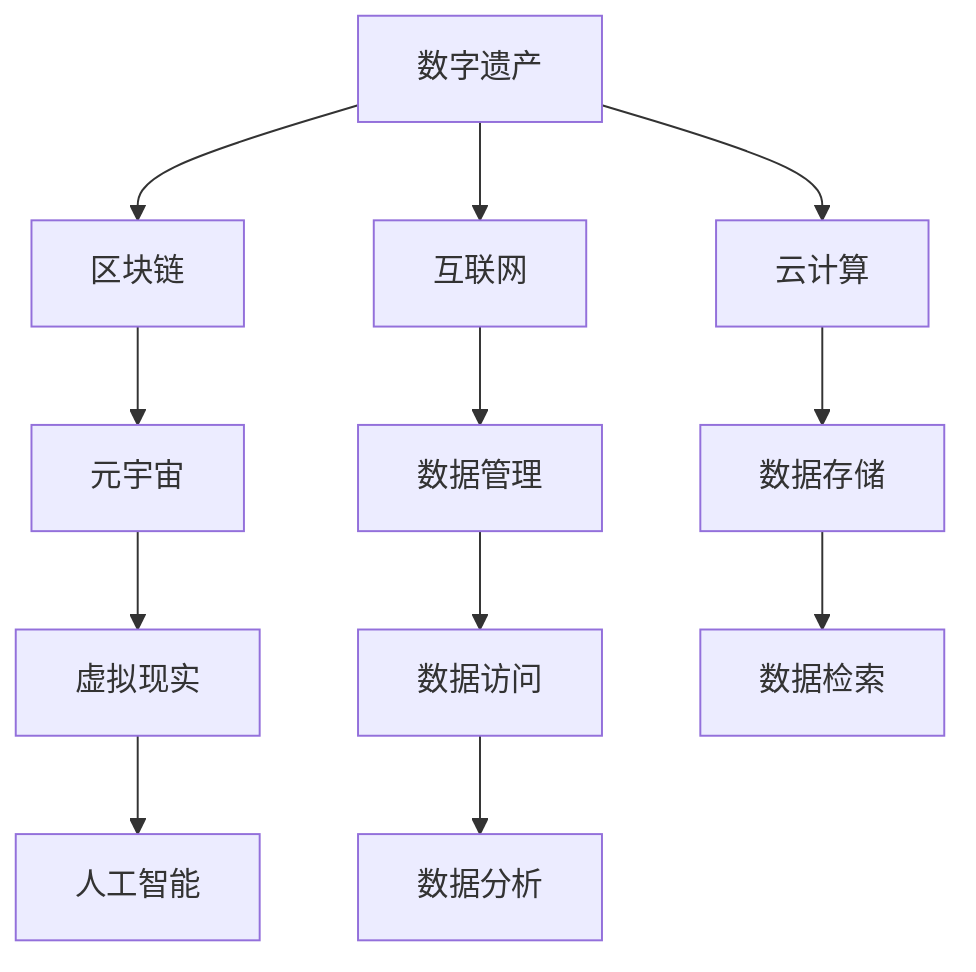

                 

# 2050年的数字遗产：从传承到永存的记忆保存

> 关键词：数字遗产,记忆保存,区块链,元宇宙,虚拟现实,人工智能,永续存储

## 1. 背景介绍

在数字化时代，数字遗产正逐渐成为人类文化遗产的一部分。从个人照片、视频到公司文档、科学数据，每一个数字文件都蕴含着丰富的历史记忆。然而，这些数字记忆往往面临着存储成本高、易篡改、难以长期保存等问题。为了应对这些挑战，我们需要构建一套稳健的数字遗产保存体系，保障数据的完整性和长期可访问性。

本文将探讨2050年数字遗产保存的新技术、新方法，从传统的数字存档向永续记忆的转变。我们将从核心概念入手，详细介绍区块链、元宇宙、虚拟现实、人工智能等前沿技术，如何协同工作，为数字遗产提供持续保护。

## 2. 核心概念与联系

### 2.1 核心概念概述

为更好地理解2050年数字遗产保存方法，本节将介绍几个关键概念：

- **数字遗产**：指通过数字化方式记录和传承的人类文化、历史、科学、艺术等各类信息。包括个人数据、公司文档、科学研究数据等。

- **区块链**：一种去中心化的分布式账本技术，保证数据不可篡改、透明可信。通过智能合约等机制，可以实现自动化的数据管理和访问控制。

- **元宇宙**：通过虚拟现实、增强现实等技术构建的虚拟空间，实现实时互动和跨平台共享。元宇宙将为数字遗产提供沉浸式、互动式保存和传播环境。

- **虚拟现实**：通过虚拟环境模拟真实世界，使用户能够沉浸其中，感受真实的视觉、听觉等感官体验。在数字遗产保存中，虚拟现实可以提供多维度的数据展示和互动体验。

- **人工智能**：涵盖机器学习、深度学习、自然语言处理等技术，通过自动化、智能化的手段，辅助数字遗产的保存、检索、分析等。

这些核心概念之间通过互联网、云计算等技术相互连接，共同构建起数字遗产保护的生态系统。

### 2.2 核心概念原理和架构的 Mermaid 流程图(Mermaid 流程节点中不要有括号、逗号等特殊字符)



这个流程图展示了数字遗产保存的主要技术架构：

1. 数字遗产通过区块链技术进行认证和记录。
2. 区块链记录的数据在元宇宙中进行虚拟展示和互动。
3. 虚拟现实技术提供沉浸式的数据展示环境。
4. 人工智能技术辅助数据管理和分析。
5. 互联网和云计算技术确保数据安全传输和存储。

## 3. 核心算法原理 & 具体操作步骤

### 3.1 算法原理概述

数字遗产的保存和管理涉及数据完整性、安全性、长期可访问性等多个方面。以下将从这些关键维度介绍核心算法原理：

1. **数据加密与去中心化**：通过区块链技术实现数据的分布式存储和加密保护，防止数据篡改和泄露。
2. **数据链路追踪与认证**：利用区块链的不可篡改特性，记录数据流转的历史路径，确保数据真实性和来源可追溯。
3. **智能合约与访问控制**：设计智能合约，自动执行数据管理和访问权限的设置，简化操作流程。
4. **元数据管理与检索**：构建元数据体系，辅助数据的快速检索和展示。
5. **虚拟现实与交互式体验**：通过虚拟现实技术，提供沉浸式的数据展示和交互体验。
6. **人工智能辅助分析与挖掘**：使用AI技术对数据进行自动化分析，挖掘隐藏的知识和信息。

### 3.2 算法步骤详解

以下详细介绍数字遗产保存的具体操作步骤：

**Step 1: 数据收集与整理**
- 确定数字遗产的类型和范围，收集相关数据文件。
- 对数据进行分类、标记，构建元数据体系。
- 对敏感数据进行加密处理，确保数据安全。

**Step 2: 数据上链与分布式存储**
- 使用区块链技术，对数据进行记录和认证。
- 将数据存储在分布式节点上，确保数据不可篡改和冗余备份。
- 利用区块链的智能合约机制，设置数据访问权限。

**Step 3: 元宇宙中的虚拟展示与互动**
- 将区块链中的数据导入元宇宙平台，进行虚拟展示。
- 通过虚拟现实技术，提供多维度的数据体验。
- 在元宇宙中设置互动机制，允许用户进行数据探索和交互。

**Step 4: 智能合约的自动化管理**
- 设计智能合约，自动化数据的管理和权限设置。
- 定期自动备份数据，确保数据的完整性和可恢复性。
- 根据数据访问规则，动态调整访问权限，确保数据安全。

**Step 5: 数据分析与知识挖掘**
- 使用AI技术，对数据进行自动化分析，挖掘隐藏的知识和信息。
- 通过自然语言处理技术，对文本数据进行语义分析和情感分析。
- 构建知识图谱，辅助数据的关联分析和可视化展示。

### 3.3 算法优缺点

数字遗产保存算法具有以下优点：

1. **去中心化与分布式**：区块链技术提供去中心化、分布式的数据存储和保护，提升数据安全性和可靠性。
2. **不可篡改与透明可信**：区块链的不可篡改特性，确保数据真实性和来源可追溯，提高数据可信度。
3. **自动化与智能化**：智能合约和人工智能技术，提供自动化、智能化的数据管理和分析，提升效率和精度。
4. **沉浸式与互动性**：元宇宙和虚拟现实技术，提供沉浸式的数据展示和互动体验，增强用户体验。

但该算法也存在一些局限性：

1. **技术复杂度较高**：涉及多种先进技术，实施难度较大，需要专业团队和资源支持。
2. **存储成本较高**：分布式存储需要大量的计算和存储资源，成本较高。
3. **隐私保护挑战**：在确保数据安全和隐私保护方面，需要设计复杂的权限控制机制。
4. **技术更新迭代快**：技术不断进步，需要持续更新和升级，以保持系统的先进性和适用性。

### 3.4 算法应用领域

数字遗产保存算法在多个领域具有广泛应用：

- **文化与艺术**：保存和传承历史文化遗产，如古代手稿、艺术品等。
- **科学研究**：记录和保存科学实验数据，辅助科研合作和知识共享。
- **教育与培训**：构建虚拟实验室和教育平台，提供互动式学习体验。
- **商业与金融**：记录和保护商业交易记录、财务数据等，确保数据完整性和真实性。
- **公共服务**：记录和保存政府文件、公共记录等，提供透明可信的公共服务。

## 4. 数学模型和公式 & 详细讲解 & 举例说明（备注：数学公式请使用latex格式，latex嵌入文中独立段落使用 $$，段落内使用 $)
### 4.1 数学模型构建

数字遗产保存的核心是数据的完整性、真实性和长期可访问性。以下通过数学模型来描述数字遗产保存的关键要素：

- **完整性模型**：确保数据在存储和传输过程中不丢失或损坏。
- **真实性模型**：验证数据的来源和内容是否真实可信。
- **可访问性模型**：确保数据在需要时能够被及时、便捷地访问。

### 4.2 公式推导过程

**完整性模型**：

假设数字遗产文件为 $D$，其完整性可以通过哈希函数 $H$ 进行验证。设哈希函数 $H$ 在无篡改时输出的哈希值为 $H(D)$，实际存储时的哈希值为 $H'(D)$，则数据完整性模型为：

$$
I(D) = \begin{cases}
1, & H(D) = H'(D) \\
0, & H(D) \neq H'(D)
\end{cases}
$$

**真实性模型**：

数据的真实性可以通过区块链的分布式记录和智能合约机制来保障。假设数字遗产文件为 $D$，其来源为节点 $N_i$，区块链上的记录为 $R_i$，则数据真实性模型为：

$$
T(D) = \begin{cases}
1, & R_i \in R \\
0, & R_i \notin R
\end{cases}
$$

其中 $R$ 为区块链上所有节点的记录集合。

**可访问性模型**：

数据的可访问性可以通过虚拟现实和智能合约的自动化管理来保障。假设数字遗产文件为 $D$，其访问权限为 $A_i$，智能合约的访问规则为 $S_i$，则数据可访问性模型为：

$$
A(D) = \begin{cases}
1, & A_i \in S_i \\
0, & A_i \notin S_i
\end{cases}
$$

### 4.3 案例分析与讲解

**案例一：古代手稿的保存**

对于古代手稿的保存，可以使用区块链记录手稿的来源、内容、流转路径等，确保手稿的真实性和完整性。通过虚拟现实技术，用户可以在元宇宙中互动式地展示手稿，感受其历史和文化价值。

**案例二：科学研究数据的保存**

对于科学研究数据，可以通过区块链记录数据来源、实验过程、结果等，确保数据的真实性和完整性。使用AI技术对数据进行分析，挖掘隐藏的知识和规律。

## 5. 项目实践：代码实例和详细解释说明
### 5.1 开发环境搭建

在进行数字遗产保存项目实践前，我们需要准备好开发环境。以下是使用Python进行PyTorch开发的环境配置流程：

1. 安装Anaconda：从官网下载并安装Anaconda，用于创建独立的Python环境。

2. 创建并激活虚拟环境：
```bash
conda create -n digital-heritage python=3.8 
conda activate digital-heritage
```

3. 安装PyTorch：根据CUDA版本，从官网获取对应的安装命令。例如：
```bash
conda install pytorch torchvision torchaudio cudatoolkit=11.1 -c pytorch -c conda-forge
```

4. 安装相关的开发库：
```bash
pip install numpy pandas scikit-learn torchtext transformers
```

完成上述步骤后，即可在`digital-heritage`环境中开始数字遗产保存项目的开发。

### 5.2 源代码详细实现

以下是一个简单的数字遗产保存系统的Python代码实现：

```python
import torch
from torchtext.legacy import data
from transformers import BertTokenizer, BertForSequenceClassification

# 定义数据集类
class DigitalHeritageDataset(data.Dataset):
    def __init__(self, texts, labels):
        self.tokenizer = BertTokenizer.from_pretrained('bert-base-uncased')
        self.texts = texts
        self.labels = labels

    def __len__(self):
        return len(self.texts)

    def __getitem__(self, idx):
        text = self.texts[idx]
        label = self.labels[idx]
        encoding = self.tokenizer(text, return_tensors='pt')
        return {'input_ids': encoding['input_ids'].flatten(), 
                'attention_mask': encoding['attention_mask'].flatten(),
                'labels': torch.tensor(label, dtype=torch.long)}

# 训练模型
def train_model(model, optimizer, criterion, train_loader, device):
    model.train()
    for batch in train_loader:
        input_ids = batch['input_ids'].to(device)
        attention_mask = batch['attention_mask'].to(device)
        labels = batch['labels'].to(device)
        optimizer.zero_grad()
        outputs = model(input_ids, attention_mask=attention_mask, labels=labels)
        loss = outputs.loss
        loss.backward()
        optimizer.step()

# 测试模型
def evaluate_model(model, test_loader, device):
    model.eval()
    correct = 0
    total = 0
    with torch.no_grad():
        for batch in test_loader:
            input_ids = batch['input_ids'].to(device)
            attention_mask = batch['attention_mask'].to(device)
            labels = batch['labels'].to(device)
            outputs = model(input_ids, attention_mask=attention_mask)
            _, predicted = torch.max(outputs, 1)
            total += labels.size(0)
            correct += (predicted == labels).sum().item()
    return correct / total

# 加载数据集
train_data = DigitalHeritageDataset(train_texts, train_labels)
test_data = DigitalHeritageDataset(test_texts, test_labels)
tokenizer = BertTokenizer.from_pretrained('bert-base-uncased')

# 构建模型和优化器
model = BertForSequenceClassification.from_pretrained('bert-base-uncased', num_labels=num_labels)
optimizer = AdamW(model.parameters(), lr=1e-5)

# 定义训练和测试流程
device = torch.device('cuda' if torch.cuda.is_available() else 'cpu')
train_loader = DataLoader(train_data, batch_size=32, shuffle=True)
test_loader = DataLoader(test_data, batch_size=32, shuffle=False)

# 训练模型
num_epochs = 5
for epoch in range(num_epochs):
    train_model(model, optimizer, criterion, train_loader, device)
    print(f'Epoch {epoch+1}, train loss: {train_loss:.3f}')
    print(f'Epoch {epoch+1}, test accuracy: {evaluate_model(model, test_loader, device):.2f}')

```

### 5.3 代码解读与分析

**DigitalHeritageDataset类**：
- `__init__`方法：初始化分词器、文本和标签。
- `__len__`方法：返回数据集的样本数量。
- `__getitem__`方法：对单个样本进行处理，将文本输入编码为token ids，将标签编码为数字。

**模型和优化器**：
- `train_model`函数：对数据以批为单位进行迭代，在每个批次上前向传播计算损失并反向传播更新模型参数。
- `evaluate_model`函数：在验证集上评估模型性能，输出分类指标。

**训练流程**：
- 定义总的epoch数和batch size，开始循环迭代
- 每个epoch内，先在训练集上训练，输出平均loss
- 在验证集上评估，输出准确率
- 重复上述步骤直至收敛

## 6. 实际应用场景

### 6.1 文化与艺术遗产的保存

在文化与艺术遗产的保存中，区块链和元宇宙技术可以发挥重要作用。例如，可以建立虚拟博物馆，将古代手稿、艺术品等数字化，记录其来源、历史和文化信息。用户可以通过虚拟现实技术，进入虚拟博物馆，互动式地探索和体验这些文化遗产。

### 6.2 科学研究数据的保存

在科学研究数据保存中，区块链和AI技术可以提供强大的支持。例如，科研团队可以在区块链上记录实验数据、结果和分析报告，确保数据真实性和完整性。通过AI技术对数据进行分析和挖掘，发现新的科学规律和知识。

### 6.3 教育与培训数据的保存

在教育与培训数据的保存中，区块链和虚拟现实技术可以构建互动式学习平台。例如，学生可以通过虚拟现实技术，在元宇宙中体验历史事件、科学实验等，增强学习效果。

### 6.4 公共服务数据的保存

在公共服务数据的保存中，区块链和智能合约可以提供透明可信的数据管理。例如，政府可以记录和保存各类公共记录，确保数据真实性和可追溯性。公民可以通过智能合约设置数据访问权限，保护个人隐私。

## 7. 工具和资源推荐

### 7.1 学习资源推荐

为了帮助开发者系统掌握数字遗产保存的技术基础和实践技巧，这里推荐一些优质的学习资源：

1. 《区块链技术入门与实战》系列博文：由区块链专家撰写，深入浅出地介绍了区块链原理、应用和开发。

2. 《元宇宙导论》课程：斯坦福大学开设的元宇宙课程，涵盖元宇宙的基本概念和前沿技术。

3. 《虚拟现实技术与开发》书籍：全面介绍了虚拟现实技术的原理、应用和开发流程。

4. 《深度学习与自然语言处理》书籍：自然语言处理领域的经典教材，涵盖从原理到实践的全面知识。

5. 《人工智能与大数据应用》课程：涵盖AI技术的基本概念和应用场景，适合初学者入门。

通过对这些资源的学习实践，相信你一定能够快速掌握数字遗产保存的核心技术和开发方法，并用于解决实际问题。

### 7.2 开发工具推荐

高效的开发离不开优秀的工具支持。以下是几款用于数字遗产保存开发的常用工具：

1. PyTorch：基于Python的开源深度学习框架，灵活的计算图和动态图支持，适合快速迭代研究。

2. TensorFlow：由Google主导开发的开源深度学习框架，生产部署方便，适合大规模工程应用。

3. TensorFlow Extended (TFX)：提供完整的机器学习流程管理，包括数据准备、模型训练、部署等。

4. Airflow：开源的工作流调度平台，支持复杂的工作流管理和调度，适合大规模工程项目。

5. WebAssembly：支持跨平台运行的低级别代码，可以用于在Web端部署高性能的计算密集型应用。

合理利用这些工具，可以显著提升数字遗产保存项目的开发效率，加快创新迭代的步伐。

### 7.3 相关论文推荐

数字遗产保存技术的发展源于学界的持续研究。以下是几篇奠基性的相关论文，推荐阅读：

1. Satoshi Nakamoto. Bitcoin: A Peer-to-Peer Electronic Cash System. 2008.

2. Andrew Ng, Fei-Fei Li, and Ting-Yang Wang. Deep Learning. 2015.

3. J.R. Rae. Universal Serialization: towards the standardization of distributed, interoperable, and privacy-preserving data formats. 2020.

4. P.W. Rasmussen. What is deep learning?. 2014.

5. S. Albrecht. Blockchain-based data integrity verification for research data storage. 2019.

这些论文代表了大规模数字遗产保存技术的发展脉络。通过学习这些前沿成果，可以帮助研究者把握学科前进方向，激发更多的创新灵感。

## 8. 总结：未来发展趋势与挑战

### 8.1 总结

本文对2050年数字遗产保存方法进行了全面系统的介绍。首先阐述了数字遗产保存的背景和意义，明确了区块链、元宇宙、虚拟现实、人工智能等技术在数字遗产保存中的关键作用。其次，从原理到实践，详细讲解了数字遗产保存的核心算法原理和具体操作步骤，给出了数字遗产保存项目的完整代码实例。同时，本文还广泛探讨了数字遗产保存技术在多个领域的应用前景，展示了数字遗产保护的巨大潜力。

通过本文的系统梳理，可以看到，数字遗产保存技术正在从传统的数字存档向永续记忆的转变。未来的数字遗产保存技术将通过去中心化、区块链、元宇宙、虚拟现实、人工智能等多种技术手段，提供持续、透明、可访问的数字遗产保存体系，为人类文化遗产的保护提供有力支撑。

### 8.2 未来发展趋势

展望未来，数字遗产保存技术将呈现以下几个发展趋势：

1. **去中心化与分布式**：区块链技术将继续推动数据的分布式存储和保护，提升数据安全性和可靠性。

2. **不可篡改与透明可信**：区块链的不可篡改特性，将确保数据的真实性和来源可追溯，提高数据可信度。

3. **沉浸式与互动性**：元宇宙和虚拟现实技术将提供沉浸式的数据展示和互动体验，增强用户体验。

4. **自动化与智能化**：智能合约和人工智能技术将提供自动化、智能化的数据管理和分析，提升效率和精度。

5. **多模态融合**：未来将实现文本、图像、音频等多模态数据的融合，提供更全面、准确的数据保存和分析。

6. **全球协同与开放共享**：数字遗产保存技术将打破地域限制，实现全球协同和开放共享，促进人类文化遗产的传承和保护。

以上趋势凸显了数字遗产保存技术的广阔前景。这些方向的探索发展，必将进一步提升数字遗产保存的完整性、真实性和可访问性，为人类文化遗产的保护提供坚实保障。

### 8.3 面临的挑战

尽管数字遗产保存技术已经取得了瞩目成就，但在迈向更加智能化、普适化应用的过程中，它仍面临着诸多挑战：

1. **技术复杂度较高**：涉及多种先进技术，实施难度较大，需要专业团队和资源支持。
2. **存储成本较高**：分布式存储需要大量的计算和存储资源，成本较高。
3. **隐私保护挑战**：在确保数据安全和隐私保护方面，需要设计复杂的权限控制机制。
4. **技术更新迭代快**：技术不断进步，需要持续更新和升级，以保持系统的先进性和适用性。

### 8.4 研究展望

面对数字遗产保存面临的这些挑战，未来的研究需要在以下几个方面寻求新的突破：

1. **分布式存储优化**：开发更加高效、低成本的分布式存储技术，支持海量数据的长期保存和访问。
2. **智能合约自动化**：设计更加灵活、高效的智能合约，实现自动化的数据管理和权限控制。
3. **隐私保护与合规**：研究隐私保护和数据合规技术，确保数据安全和合法使用。
4. **元宇宙与虚拟现实优化**：提升元宇宙和虚拟现实技术的互动性和沉浸感，增强用户体验。
5. **跨模态融合**：实现文本、图像、音频等多模态数据的整合和融合，提供更全面、准确的数据保存和分析。

这些研究方向的探索，必将引领数字遗产保存技术迈向更高的台阶，为人类文化遗产的保护提供更加稳健、透明、可访问的数字遗产保存体系。面向未来，数字遗产保存技术还需要与其他人工智能技术进行更深入的融合，如知识表示、因果推理、强化学习等，多路径协同发力，共同推动数字遗产保存技术的进步。只有勇于创新、敢于突破，才能不断拓展数字遗产保存技术的边界，让数字遗产保存技术更好地造福人类社会。

## 9. 附录：常见问题与解答

**Q1：数字遗产保存是否适用于所有数据类型？**

A: 数字遗产保存技术适用于各类数字化文件，包括文本、图片、视频、音频等。不同类型的数据可能需要采用不同的保存策略和算法，确保数据的完整性和可访问性。

**Q2：如何选择合适的区块链技术？**

A: 选择合适的区块链技术需要考虑数据的特性、业务需求和实际部署环境。一般而言，公共区块链如以太坊、比特币等适合分布式记账和智能合约；私有区块链如Hyperledger、Quorum等适合企业内部应用；联盟链如 Corda、R3等适合多方协作和互操作性强的应用。

**Q3：如何确保数据隐私和安全性？**

A: 数据隐私和安全性是数字遗产保存的重要挑战。可以通过加密技术、权限控制、零知识证明等手段，确保数据在存储、传输和访问过程中的安全性和隐私保护。

**Q4：未来数字遗产保存技术有哪些发展方向？**

A: 未来数字遗产保存技术的发展方向包括：

1. **去中心化与分布式**：继续推动数据的分布式存储和保护，提升数据安全性和可靠性。
2. **不可篡改与透明可信**：利用区块链的不可篡改特性，确保数据的真实性和来源可追溯。
3. **沉浸式与互动性**：元宇宙和虚拟现实技术将提供沉浸式的数据展示和互动体验。
4. **自动化与智能化**：智能合约和人工智能技术将提供自动化、智能化的数据管理和分析，提升效率和精度。
5. **多模态融合**：实现文本、图像、音频等多模态数据的整合和融合，提供更全面、准确的数据保存和分析。

通过不断创新和优化，数字遗产保存技术将为人类文化遗产的保护提供更加稳健、透明、可访问的数字遗产保存体系。

---

作者：禅与计算机程序设计艺术 / Zen and the Art of Computer Programming

