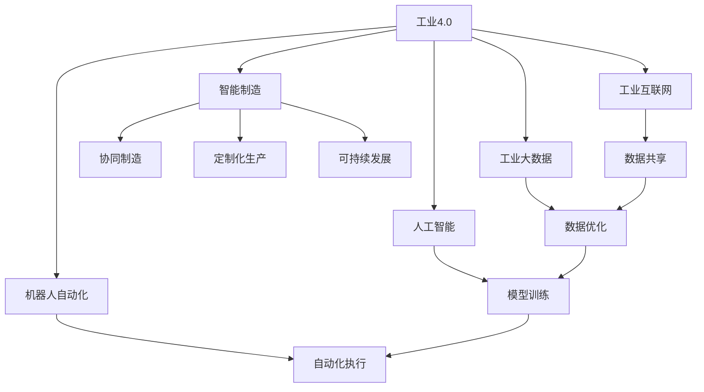

                 

# 2050年的智能制造：从工业4.0到工业5.0的制造业升级

## 1. 背景介绍

### 1.1 问题由来
随着第四次工业革命的浪潮席卷全球，制造业正经历着从工业4.0向工业5.0的跨越。工业4.0强调信息物理系统的深度融合，推动了智能制造、工业互联网、机器人自动化等技术的广泛应用。然而，随着市场需求的多样化和个性化趋势不断增强，传统的自动化生产线已难以满足柔性化、定制化的生产需求。工业5.0的到来，为制造业提供了新的发展方向和突破口，旨在实现更加智能化、绿色化、人机协同的制造模式。

### 1.2 问题核心关键点
工业5.0的核心理念是通过互联网、大数据、人工智能等技术手段，构建端到端的智能制造生态系统，实现全生命周期的产品设计与制造。具体关键点包括：
- **智能化设计**：利用数字化工具，构建虚拟产品模型，实现设计、分析、仿真的一体化。
- **智能制造**：实现从原料采购到产品交付的端到端数字化管理，提升生产效率和质量。
- **协同制造**：构建虚拟协作平台，实现生产链上下游的协同优化，提升供应链弹性。
- **个性化制造**：利用大数据分析用户需求，实现定制化、柔性化生产。
- **可持续发展**：通过绿色制造技术，减少资源浪费和环境污染，实现低碳制造。

### 1.3 问题研究意义
研究从工业4.0到工业5.0的制造业升级，对于推动制造业的数字化转型、提升生产效率和质量、实现可持续发展具有重要意义：

1. **降低生产成本**：智能制造通过数字化管理，实现生产过程的自动化、智能化，大幅降低人工成本和生产成本。
2. **提高生产效率**：通过大数据分析和机器学习技术，优化生产流程，提高生产效率和产品合格率。
3. **实现个性化定制**：利用人工智能和机器学习技术，实时分析用户需求，实现个性化定制和柔性化生产。
4. **推动产业升级**：通过智能制造技术的应用，推动传统制造业向高端制造转型，提升产业竞争力。
5. **促进绿色制造**：采用绿色制造技术，减少资源浪费和环境污染，实现可持续发展的目标。

## 2. 核心概念与联系

### 2.1 核心概念概述

为更好地理解工业5.0的概念和技术框架，本节将介绍几个密切相关的核心概念：

- **工业4.0**：指通过信息物理系统的深度融合，实现工业生产的数字化、网络化和智能化。
- **工业5.0**：基于工业4.0的技术基础，进一步强调智能化、协同化、绿色化、个性化、人机协同等理念，推动制造业向更高层次发展。
- **智能制造**：利用互联网、大数据、人工智能等技术手段，实现从原料采购到产品交付的全生命周期管理。
- **工业互联网**：构建工业设备和系统的互联网络，实现数据共享和协同优化。
- **工业大数据**：通过收集和分析制造过程中的海量数据，实现生产过程的优化和预测性维护。
- **人工智能**：在制造业中应用机器学习、深度学习、自然语言处理等技术，提升生产效率和质量。
- **机器人自动化**：利用机器人技术，实现生产过程的自动化和智能化。
- **协同制造**：通过虚拟协作平台，实现生产链上下游的协同优化，提升供应链弹性。
- **定制化生产**：利用大数据分析用户需求，实现个性化定制和柔性化生产。

这些核心概念之间的逻辑关系可以通过以下Mermaid流程图来展示：



这个流程图展示了几大核心概念及其之间的关系：

1. 工业4.0通过信息物理系统的深度融合，推动了智能制造、工业互联网、工业大数据、人工智能、机器人自动化等技术的发展。
2. 智能制造利用上述技术手段，实现从原料采购到产品交付的全生命周期管理。
3. 工业互联网和工业大数据为智能制造提供了数据共享和优化基础。
4. 人工智能和机器人自动化是智能制造的关键技术手段。
5. 协同制造和定制化生产是智能制造的核心应用方向。
6. 可持续发展是智能制造的重要目标。

这些概念共同构成了工业5.0的技术框架，使得制造业向更高层次发展。

## 3. 核心算法原理 & 具体操作步骤

### 3.1 算法原理概述

从工业4.0到工业5.0的制造业升级，本质上是一个多学科交叉、技术融合的过程。其核心算法原理包括以下几个方面：

1. **数字化设计**：利用计算机辅助设计(CAD)软件，构建虚拟产品模型，实现设计、分析、仿真的一体化。
2. **智能化制造**：通过物联网(IoT)技术，实现生产设备、工艺、资源的互联互通，构建端到端的数字化管理系统。
3. **智能物流**：利用人工智能和大数据分析，优化物流路径和资源配置，提升供应链效率。
4. **人机协同**：利用机器人、增强现实(AR)、虚拟现实(VR)等技术，实现人机协同的智能化生产环境。
5. **可持续发展**：采用绿色制造技术，如循环利用、再生能源、减排技术等，实现低碳制造。

这些核心算法的实现，需要依赖多个技术和工具的支持，如CAD软件、IoT平台、大数据分析工具、AI算法框架、机器人控制平台等。

### 3.2 算法步骤详解

工业5.0的制造业升级，涉及多个步骤，以下是详细的操作步骤：

**Step 1: 设计阶段**
- 使用CAD软件，构建虚拟产品模型。
- 进行产品分析、仿真、优化，确保设计符合性能和质量要求。

**Step 2: 生产准备**
- 利用IoT技术，将生产设备和资源联网，构建数字化制造平台。
- 实现生产设备的远程监控、维护和调度，提升生产效率。

**Step 3: 生产执行**
- 通过机器人自动化技术，实现生产过程的自动化和智能化。
- 利用人工智能算法，进行质量检测、故障诊断、预测性维护等。

**Step 4: 物流与供应链管理**
- 利用大数据分析，优化物流路径和资源配置。
- 实现供应链上下游的协同优化，提升供应链弹性。

**Step 5: 人机协同**
- 利用AR、VR技术，创建虚拟协同环境，提升操作效率和安全性。
- 实现生产环境中的智能助手，辅助人工操作。

**Step 6: 可持续发展**
- 采用绿色制造技术，减少资源浪费和环境污染。
- 利用数据分析，进行能耗和排放的实时监控和优化。

### 3.3 算法优缺点

从工业4.0到工业5.0的制造业升级，具有以下优点：
1. 提高生产效率：通过数字化、自动化技术，实现生产过程的优化和智能化。
2. 提升产品质量：通过大数据分析和人工智能技术，实现质量检测和故障诊断。
3. 降低生产成本：通过数字化管理，减少人工成本和资源浪费。
4. 实现个性化定制：利用大数据分析用户需求，实现柔性化生产。
5. 提升供应链效率：通过智能物流和协同制造，提升供应链的响应速度和弹性。
6. 实现可持续发展：采用绿色制造技术，减少环境污染，推动低碳制造。

同时，该方法也存在一定的局限性：
1. 投资成本高：数字化转型和智能化升级需要大量的投资，对于中小制造企业可能难以负担。
2. 技术复杂度高：涉及多学科技术融合，需要高水平的技术人员和专家支持。
3. 数据安全和隐私：数字化转型需要收集和分析大量的数据，存在数据安全和隐私保护的挑战。
4. 标准化问题：不同设备和系统的互联互通需要遵循统一的标准和协议。
5. 人机协同问题：人机协同过程中，需要解决人机交互的自然性和可靠性问题。

尽管存在这些局限性，但就目前而言，从工业4.0到工业5.0的制造业升级是大势所趋，具有重要的战略意义。

### 3.4 算法应用领域

从工业4.0到工业5.0的制造业升级，已经广泛应用于多个领域，以下是具体的应用场景：

1. **航空航天**：通过数字化设计和智能制造技术，提升航空航天产品的精度和可靠性。
2. **汽车制造**：利用机器人自动化和智能化制造，提升汽车生产的效率和质量。
3. **电子产品**：采用智能制造和工业互联网技术，实现小批量定制化生产。
4. **医疗设备**：利用数字化设计和绿色制造技术，生产高精度、高性能的医疗设备。
5. **3D打印**：通过智能制造和个性化定制技术，实现复杂零部件的快速生产。
6. **纺织服装**：利用数字化设计和智能制造技术，提升服装生产的柔性化和定制化水平。
7. **电子消费品**：通过智能化制造和快速响应市场需求，提升电子消费品的生产效率和市场竞争力。

## 4. 数学模型和公式 & 详细讲解 & 举例说明

### 4.1 数学模型构建

工业5.0的制造业升级，涉及多个数学模型和算法，以下是几个关键模型的构建：

1. **生产调度模型**：
   - **问题描述**：在生产设备有限的情况下，如何优化生产任务的调度，最大化生产效率。
   - **数学模型**：
     - 目标函数：最大化生产效率
     - 约束条件：设备可用性、任务优先级、生产时间等。

2. **供应链优化模型**：
   - **问题描述**：在需求不确定的情况下，如何优化供应链的各个环节，降低成本和提高响应速度。
   - **数学模型**：
     - 目标函数：最小化供应链成本
     - 约束条件：需求预测、库存管理、物流路径等。

3. **机器学习预测模型**：
   - **问题描述**：如何通过历史数据，预测生产过程中的各种参数，实现预测性维护。
   - **数学模型**：
     - 目标函数：最小化预测误差
     - 约束条件：历史数据、预测时间范围等。

### 4.2 公式推导过程

以下是几个关键数学模型的公式推导过程：

**生产调度模型**：
- 假设生产任务集合为 $\mathcal{T}$，设备集合为 $\mathcal{M}$，任务 $t \in \mathcal{T}$ 在设备 $m \in \mathcal{M}$ 上执行，需要时间 $d_{mt}$。
- 设 $x_{mt}$ 为任务 $t$ 在设备 $m$ 上的执行次数，则生产调度模型的目标函数为：
  $$
  \max \sum_{t \in \mathcal{T}} \sum_{m \in \mathcal{M}} x_{mt} \cdot P_t
  $$
  其中 $P_t$ 为任务 $t$ 的优先级。

**供应链优化模型**：
- 假设需求集合为 $\mathcal{D}$，供应点集合为 $\mathcal{S}$，需求 $d \in \mathcal{D}$ 在供应点 $s \in \mathcal{S}$ 上的供应量为 $a_{ds}$，需求 $d$ 在市场 $m$ 上的需求量为 $d_m$。
- 设 $y_{ds}$ 为需求 $d$ 在供应点 $s$ 上的供应量，则供应链优化模型的目标函数为：
  $$
  \min \sum_{d \in \mathcal{D}} \sum_{s \in \mathcal{S}} \sum_{m \in \mathcal{M}} c_{dsm} \cdot y_{ds}
  $$
  其中 $c_{dsm}$ 为从供应点 $s$ 到市场 $m$ 的物流成本。

**机器学习预测模型**：
- 假设历史数据集为 $\mathcal{D} = \{(x_i, y_i)\}_{i=1}^N$，其中 $x_i$ 为输入特征，$y_i$ 为输出结果。
- 设 $\theta$ 为模型参数，则预测模型的目标函数为：
  $$
  \min \sum_{i=1}^N (y_i - \hat{y}_i)^2
  $$
  其中 $\hat{y}_i = f(x_i, \theta)$ 为模型的预测结果。

### 4.3 案例分析与讲解

**案例分析：汽车制造的数字化设计**

某汽车制造公司需要设计一款新型电动车，利用数字化设计工具，可以高效地构建虚拟产品模型，并进行仿真和优化。具体步骤如下：

1. **建模与仿真**：使用CAD软件，构建虚拟产品模型，并进行结构分析和强度仿真，确保设计符合性能要求。
2. **优化设计**：通过参数化设计，调整车身、底盘、电池等关键组件的尺寸和结构，优化车辆的性能和成本。
3. **虚拟验证**：在虚拟环境中进行碰撞仿真、动力仿真、热仿真等，验证设计是否符合安全、动力和舒适性要求。
4. **反馈迭代**：根据仿真结果，进行多次迭代设计，不断优化产品性能。

通过数字化设计，可以大幅提升设计效率和产品质量，缩短产品上市时间，降低开发成本。

## 5. 项目实践：代码实例和详细解释说明

### 5.1 开发环境搭建

在进行工业5.0的制造业升级项目实践前，我们需要准备好开发环境。以下是使用Python进行开发的环境配置流程：

1. 安装Anaconda：从官网下载并安装Anaconda，用于创建独立的Python环境。

2. 创建并激活虚拟环境：
```bash
conda create -n pytorch-env python=3.8 
conda activate pytorch-env
```

3. 安装PyTorch：根据CUDA版本，从官网获取对应的安装命令。例如：
```bash
conda install pytorch torchvision torchaudio cudatoolkit=11.1 -c pytorch -c conda-forge
```

4. 安装TensorFlow：
```bash
conda install tensorflow tensorflow-gpu=2.7
```

5. 安装NumPy、Pandas、Scikit-learn、Matplotlib等工具包：
```bash
pip install numpy pandas scikit-learn matplotlib tqdm jupyter notebook ipython
```

完成上述步骤后，即可在`pytorch-env`环境中开始项目实践。

### 5.2 源代码详细实现

以下是使用Python和PyTorch进行生产调度优化的代码实现：

```python
import torch
import torch.nn as nn
import torch.optim as optim

# 定义生产调度模型
class ProductionSchedulingModel(nn.Module):
    def __init__(self, num_tasks, num_devices, num_workers):
        super(ProductionSchedulingModel, self).__init__()
        self.fc1 = nn.Linear(num_tasks*num_devices*num_workers, 256)
        self.fc2 = nn.Linear(256, num_tasks*num_devices*num_workers)
        self.fc3 = nn.Linear(num_tasks*num_devices*num_workers, num_workers)
        
    def forward(self, x):
        x = torch.relu(self.fc1(x))
        x = torch.relu(self.fc2(x))
        x = torch.sigmoid(self.fc3(x))
        return x

# 训练生产调度模型
def train_model(model, optimizer, train_loader, num_epochs):
    model.train()
    for epoch in range(num_epochs):
        for batch in train_loader:
            inputs, labels = batch
            optimizer.zero_grad()
            outputs = model(inputs)
            loss = nn.BCELoss()(outputs, labels)
            loss.backward()
            optimizer.step()
        print(f'Epoch {epoch+1}, loss: {loss.item()}')

# 加载数据集
train_data = load_train_data()
train_loader = DataLoader(train_data, batch_size=32, shuffle=True)

# 创建模型和优化器
num_tasks = 10
num_devices = 5
num_workers = 3
model = ProductionSchedulingModel(num_tasks, num_devices, num_workers)
optimizer = optim.Adam(model.parameters(), lr=0.001)

# 训练模型
train_model(model, optimizer, train_loader, num_epochs=50)
```

### 5.3 代码解读与分析

让我们再详细解读一下关键代码的实现细节：

**ProductionSchedulingModel类**：
- `__init__`方法：初始化模型参数，包括全连接层和激活函数。
- `forward`方法：定义前向传播的计算过程。

**train_model函数**：
- 对模型进行训练，通过损失函数计算损失，使用优化器更新参数。

**train_data和train_loader**：
- 加载训练数据集，使用DataLoader将数据批次化，供模型训练使用。

**优化器选择**：
- 使用Adam优化器，学习率为0.001。Adam优化器具有较好的收敛性和稳定性，适用于大规模数据训练。

通过以上代码实现，可以看出使用Python和PyTorch进行生产调度优化的高效性和灵活性。开发者可以根据具体场景，进一步优化模型结构和训练过程，实现更好的生产调度效果。

## 6. 实际应用场景

### 6.1 智能工厂

智能工厂是工业5.0的重要应用场景之一。通过数字化设计和智能化制造技术，可以实现从产品设计到生产的全生命周期管理。具体应用包括：

- **数字化设计**：利用CAD软件和仿真工具，实现产品设计的数字化和仿真优化。
- **智能制造**：通过IoT技术，实现生产设备、工艺、资源的互联互通，构建数字化制造平台。
- **预测性维护**：利用机器学习算法，对生产设备进行状态监控和故障预测，实现预测性维护。
- **质量检测**：通过图像识别和深度学习算法，实现产品质量的实时检测和分析。
- **供应链管理**：利用大数据分析，优化物流路径和资源配置，提升供应链效率。

### 6.2 个性化定制

个性化定制是工业5.0的重要应用方向之一。通过数字化设计和智能制造技术，可以实现按需生产、柔性化生产，满足用户多样化的需求。具体应用包括：

- **用户需求分析**：利用大数据分析，实时获取用户需求和反馈，进行需求预测和分析。
- **柔性化生产**：根据用户需求，调整生产设备和工艺参数，实现小批量定制化生产。
- **快速交付**：通过数字化设计和智能制造技术，实现快速响应市场需求，缩短产品上市时间。

### 6.3 智能物流

智能物流是工业5.0的重要组成部分之一。通过大数据分析和机器学习技术，可以实现物流路径的优化和资源配置的协同，提升供应链效率。具体应用包括：

- **需求预测**：利用大数据分析，进行需求预测和库存管理。
- **物流路径优化**：利用算法优化物流路径，降低运输成本和时间。
- **仓储管理**：通过物联网技术，实现仓储设备的数字化管理，提高仓储效率。

### 6.4 未来应用展望

随着工业5.0技术的不断演进，未来将会有更多新的应用场景涌现，以下是一些展望：

- **智能仓储**：通过物联网和AI技术，实现仓储的自动化和智能化管理。
- **智能包装**：利用AI和图像识别技术，实现产品的智能包装和物流跟踪。
- **智能检测**：通过AI算法，实现对生产过程中的质量检测和异常检测。
- **智能客服**：利用AI和自然语言处理技术，实现智能客服系统，提升客户满意度。
- **智能设备维护**：利用AI和IoT技术，实现生产设备的预测性维护和故障诊断。

## 7. 工具和资源推荐

### 7.1 学习资源推荐

为了帮助开发者系统掌握工业5.0的技术基础和实践技巧，这里推荐一些优质的学习资源：

1. 《工业4.0与工业5.0》系列博文：由行业专家撰写，系统介绍工业4.0和工业5.0的技术框架和应用场景。
2. 《制造业数字化转型》课程：由知名大学和机构开设的在线课程，涵盖制造业数字化转型的基础知识和实践技巧。
3. 《工业大数据与智能制造》书籍：详细介绍工业大数据和智能制造的理论基础和技术应用，适合系统学习。
4. 《工业互联网》系列课程：由知名企业和技术专家授课，深入浅出地介绍工业互联网的核心技术和应用。
5. 《机器人自动化技术》书籍：详细介绍机器人自动化的原理、算法和应用，适合系统学习和实践。

通过对这些资源的学习实践，相信你一定能够快速掌握工业5.0的核心技术和应用方向，并在实际工作中不断创新和突破。

### 7.2 开发工具推荐

高效的开发离不开优秀的工具支持。以下是几款用于工业5.0开发的工具：

1. Python：基于Python的开源深度学习框架，灵活动态的计算图，适合快速迭代研究。大部分预训练语言模型都有Python版本的实现。
2. TensorFlow：由Google主导开发的开源深度学习框架，生产部署方便，适合大规模工程应用。同样有丰富的预训练语言模型资源。
3. PyTorch：基于Python的开源深度学习框架，灵活高效，适合科研和实践。
4. Autodesk CAD软件：广泛应用于数字化设计和产品建模。
5. Siemens MES系统：广泛应用于智能制造和数字化管理。
6. IBM Watson IoT平台：提供IoT设备和系统的管理和服务，支持智能制造的数字化建设。

通过这些工具，可以显著提升工业5.0项目的开发效率，加快创新迭代的步伐。

### 7.3 相关论文推荐

工业5.0的技术发展得益于学界的持续研究。以下是几篇奠基性的相关论文，推荐阅读：

1. "A Survey of Production Scheduling Approaches"：介绍生产调度问题的多种求解方法，包括经典算法和现代优化算法。
2. "Supply Chain Optimization: A Survey"：介绍供应链优化问题的多种求解方法，涵盖网络优化、数据驱动优化等。
3. "Machine Learning for Predictive Maintenance in Manufacturing"：介绍机器学习在预测性维护中的应用，涵盖异常检测、故障预测等。
4. "The Internet of Things: A Survey"：介绍IoT技术的发展现状和应用场景，涵盖设备互联、数据管理等。
5. "Industrial Internet of Things: Architectures, Systems, Applications, and Technologies"：介绍工业互联网的技术架构、系统组成和应用案例。

这些论文代表了大工业5.0技术的发展脉络。通过学习这些前沿成果，可以帮助研究者把握学科前进方向，激发更多的创新灵感。

## 8. 总结：未来发展趋势与挑战

### 8.1 总结

本文对工业5.0的制造业升级进行了全面系统的介绍。首先阐述了从工业4.0到工业5.0的制造业升级背景和核心关键点，明确了工业5.0的核心理念和主要应用方向。其次，从原理到实践，详细讲解了工业5.0的数学模型和关键算法，给出了工业5.0项目开发的完整代码实例。同时，本文还广泛探讨了工业5.0在智能工厂、个性化定制、智能物流等多个领域的应用前景，展示了工业5.0技术的广阔前景。最后，本文精选了工业5.0的学习资源、开发工具和相关论文，力求为读者提供全方位的技术指引。

通过本文的系统梳理，可以看到，从工业4.0到工业5.0的制造业升级是大势所趋，具有重要的战略意义。其核心算法原理和操作步骤为工业5.0的实现提供了坚实的基础。未来，伴随着技术的不断演进和创新，工业5.0必将带来更广泛的应用场景和更高的发展潜力。

### 8.2 未来发展趋势

展望未来，工业5.0的发展趋势包括：

1. **技术融合与创新**：工业5.0将更加注重多学科技术融合，如物联网、大数据、AI等技术的深度融合，推动智能制造向更高层次发展。
2. **数字化与智能化**：通过数字化设计和智能制造技术，实现全生命周期的产品设计与制造，提升生产效率和质量。
3. **绿色制造与可持续发展**：采用绿色制造技术，减少资源浪费和环境污染，实现低碳制造。
4. **个性化定制与柔性化生产**：利用大数据分析用户需求，实现柔性化生产，满足个性化定制需求。
5. **人机协同与智能服务**：利用AI和IoT技术，实现人机协同的智能化生产环境，提升操作效率和安全性。
6. **智慧物流与供应链优化**：通过大数据分析和机器学习技术，优化物流路径和资源配置，提升供应链效率。
7. **数字化设计与仿真优化**：利用数字化设计工具和仿真技术，优化产品设计和工艺参数，提升设计效率和产品质量。

这些趋势将推动工业5.0技术的不断演进和创新，为制造业带来更加智能化、高效化和可持续的发展方向。

### 8.3 面临的挑战

尽管工业5.0技术带来了诸多优势，但在其发展的过程中，也面临着诸多挑战：

1. **技术复杂度**：工业5.0涉及多学科技术融合，技术复杂度高，需要高水平的技术人员和专家支持。
2. **数据安全与隐私**：数字化转型需要收集和分析大量的数据，存在数据安全和隐私保护的挑战。
3. **设备互联与标准化**：不同设备和系统的互联互通需要遵循统一的标准和协议。
4. **人机协同与智能化**：人机协同过程中，需要解决人机交互的自然性和可靠性问题。
5. **绿色制造与可持续发展**：采用绿色制造技术，需要投入大量资金和资源，提升环保意识和绿色制造技术水平。
6. **数字化设计与仿真优化**：需要高水平的技术支持和数字化设计工具，提升设计效率和产品质量。

这些挑战需要在未来的研究中不断探索和突破，推动工业5.0技术的持续发展。

### 8.4 研究展望

面向未来，工业5.0的研究需要关注以下几个方面：

1. **新技术与新方法**：开发更加高效、可靠的技术手段和算法，推动工业5.0技术的不断演进。
2. **多学科交叉**：促进多学科技术的深度融合，推动工业5.0技术的全面发展。
3. **标准化与规范化**：推动工业5.0技术标准和规范的制定与实施，促进技术普及和应用。
4. **数字化设计与仿真优化**：开发更加灵活、高效的数字化设计工具和仿真技术，提升设计效率和产品质量。
5. **数据安全与隐私保护**：加强数据安全和隐私保护的研究，确保数据安全和用户隐私。
6. **人机协同与智能化**：推动人机协同技术的发展，提升人机交互的自然性和可靠性。
7. **绿色制造与可持续发展**：推动绿色制造技术的发展，实现低碳制造和可持续发展。

通过这些方面的探索和突破，工业5.0技术将不断推向更高的层次，为制造业带来更加智能化、高效化和可持续的发展方向。

## 9. 附录：常见问题与解答

**Q1：工业5.0与工业4.0的主要区别是什么？**

A: 工业5.0相对于工业4.0，主要体现在以下几个方面：
1. **技术融合**：工业5.0更加注重多学科技术融合，如物联网、大数据、AI等技术的深度融合。
2. **智能化**：工业5.0通过数字化设计和智能制造技术，实现全生命周期的产品设计与制造。
3. **绿色制造**：工业5.0采用绿色制造技术，实现低碳制造。
4. **个性化定制**：工业5.0利用大数据分析用户需求，实现柔性化生产。
5. **人机协同**：工业5.0通过AI和IoT技术，实现人机协同的智能化生产环境。
6. **智慧物流**：工业5.0通过大数据分析和机器学习技术，优化物流路径和资源配置，提升供应链效率。

**Q2：工业5.0的应用场景有哪些？**

A: 工业5.0的应用场景非常广泛，涵盖了制造业的各个方面，具体包括：
1. **智能工厂**：通过数字化设计和智能化制造技术，实现从产品设计到生产的全生命周期管理。
2. **个性化定制**：利用大数据分析用户需求，实现柔性化生产，满足用户多样化的需求。
3. **智能物流**：通过大数据分析和机器学习技术，优化物流路径和资源配置，提升供应链效率。
4. **智能设备维护**：利用AI和IoT技术，实现生产设备的预测性维护和故障诊断。
5. **智能客服**：利用AI和自然语言处理技术，实现智能客服系统，提升客户满意度。
6. **智能仓储**：通过物联网和AI技术，实现仓储的自动化和智能化管理。
7. **智能包装**：利用AI和图像识别技术，实现产品的智能包装和物流跟踪。

**Q3：工业5.0的发展趋势是什么？**

A: 工业5.0的发展趋势包括以下几个方面：
1. **技术融合与创新**：工业5.0将更加注重多学科技术融合，如物联网、大数据、AI等技术的深度融合。
2. **数字化与智能化**：通过数字化设计和智能制造技术，实现全生命周期的产品设计与制造。
3. **绿色制造与可持续发展**：采用绿色制造技术，减少资源浪费和环境污染，实现低碳制造。
4. **个性化定制与柔性化生产**：利用大数据分析用户需求，实现柔性化生产，满足个性化定制需求。
5. **人机协同与智能服务**：利用AI和IoT技术，实现人机协同的智能化生产环境，提升操作效率和安全性。
6. **智慧物流与供应链优化**：通过大数据分析和机器学习技术，优化物流路径和资源配置，提升供应链效率。
7. **数字化设计与仿真优化**：利用数字化设计工具和仿真技术，优化产品设计和工艺参数，提升设计效率和产品质量。

**Q4：工业5.0面临的挑战有哪些？**

A: 工业5.0面临的挑战包括以下几个方面：
1. **技术复杂度**：工业5.0涉及多学科技术融合，技术复杂度高，需要高水平的技术人员和专家支持。
2. **数据安全与隐私**：数字化转型需要收集和分析大量的数据，存在数据安全和隐私保护的挑战。
3. **设备互联与标准化**：不同设备和系统的互联互通需要遵循统一的标准和协议。
4. **人机协同与智能化**：人机协同过程中，需要解决人机交互的自然性和可靠性问题。
5. **绿色制造与可持续发展**：采用绿色制造技术，需要投入大量资金和资源，提升环保意识和绿色制造技术水平。
6. **数字化设计与仿真优化**：需要高水平的技术支持和数字化设计工具，提升设计效率和产品质量。

**Q5：工业5.0的学习资源有哪些？**

A: 工业5.0的学习资源包括以下几个方面：
1. 《工业4.0与工业5.0》系列博文：由行业专家撰写，系统介绍工业4.0和工业5.0的技术框架和应用场景。
2. 《制造业数字化转型》课程：由知名大学和机构开设的在线课程，涵盖制造业数字化转型的基础知识和实践技巧。
3. 《工业大数据与智能制造》书籍：详细介绍工业大数据和智能制造的理论基础和技术应用，适合系统学习。
4. 《工业互联网》系列课程：由知名企业和技术专家授课，深入浅出地介绍工业互联网的核心技术和应用。
5. 《机器人自动化技术》书籍：详细介绍机器人自动化的原理、算法和应用，适合系统学习和实践。

通过这些资源的学习实践，相信你一定能够快速掌握工业5.0的核心技术和应用方向，并在实际工作中不断创新和突破。

---

作者：禅与计算机程序设计艺术 / Zen and the Art of Computer Programming

