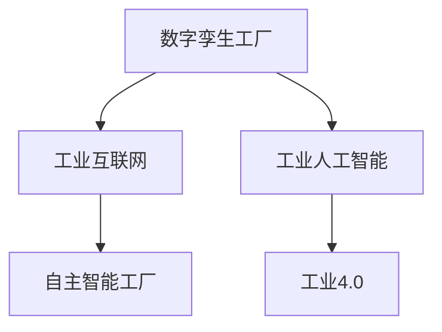

                 

# 2050年的智能制造：从数字孪生工厂到自主智能工厂的制造业智能化

## 1. 背景介绍

### 1.1 问题由来

随着工业4.0的深入推进，智能制造已成为全球制造业转型升级的重要方向。智能制造通过深度融合信息技术和物理系统，实现对生产全过程的数字化、网络化和智能化，从而大幅提升生产效率、产品质量和能源利用率。在未来的2050年，智能制造将从数字孪生工厂阶段迈向自主智能工厂阶段，实现更高层次的智能化和自主化。

### 1.2 问题核心关键点

未来智能制造的核心关键点在于以下几个方面：

- **数字化转型**：通过数字化技术改造传统生产流程，实现数据驱动的智能决策。
- **工业互联网**：构建工业互联网平台，实现设备、数据、人和业务的全面互联互通。
- **工业人工智能**：应用人工智能技术优化生产过程，提高生产效率和产品质量。
- **自主化生产**：通过自主学习、自主决策和自主控制，实现生产系统的自我管理和优化。
- **可持续发展**：实现绿色制造、节能减排、循环经济等目标，推动制造业的可持续发展。

这些关键点共同构成了智能制造的未来发展方向，为制造业智能化提供了强有力的技术支撑。

### 1.3 问题研究意义

研究未来智能制造，对于推动制造业转型升级、提升产业竞争力、促进经济可持续发展具有重要意义：

- **提升生产效率**：通过数字化和智能化改造，大幅降低生产成本，提高生产效率。
- **改善产品质量**：通过数据驱动的质量管理，实时监控生产过程，减少缺陷率和废品率。
- **推动可持续发展**：实现资源的高效利用和循环经济，减少环境污染，降低碳排放。
- **增强产业竞争力**：通过技术创新和升级，推动制造业向高端化、智能化、绿色化方向发展。

## 2. 核心概念与联系

### 2.1 核心概念概述

为更好地理解未来智能制造，本节将介绍几个密切相关的核心概念：

- **数字孪生工厂(Digital Twin Factory)**：利用数字孪生技术，实现物理工厂和虚拟工厂的双向映射和同步更新，为生产全过程提供数字化参考。
- **工业互联网(Industrial Internet of Things, IIoT)**：通过工业互联网平台，实现设备、数据、人和业务的全面互联互通，形成实时化、网络化、智能化的生产体系。
- **工业人工智能(AI in Industry)**：通过人工智能技术，如机器学习、计算机视觉、自然语言处理等，优化生产过程，提高生产效率和产品质量。
- **自主智能工厂(Self-driving Smart Factory)**：通过自主学习、自主决策和自主控制，实现生产系统的自我管理和优化，具备高度的自主化、智能化和灵活性。
- **工业4.0(Industry 4.0)**：利用信息技术和物理系统融合，实现智能制造的目标，推动制造业的全面数字化、网络化和智能化。

这些核心概念之间的逻辑关系可以通过以下Mermaid流程图来展示：



这个流程图展示了几大核心概念之间的联系：

1. 数字孪生工厂利用数字孪生技术，为工业互联网和工业人工智能提供基础数据支持。
2. 工业互联网通过平台化、网络化实现设备、数据和业务的全面互联互通。
3. 工业人工智能通过优化生产过程，实现智能决策和自主控制。
4. 自主智能工厂通过学习、决策和控制，实现生产系统的自主管理和优化。
5. 工业4.0是智能制造的总目标，涉及数字化、网络化和智能化的全面转型。

## 3. 核心算法原理 & 具体操作步骤

### 3.1 算法原理概述

未来智能制造的实现离不开数字化转型、工业互联网和工业人工智能的深度融合。其中，工业人工智能在智能制造中扮演着关键角色，通过算法优化和模型训练，实现对生产全过程的智能化管理。

核心算法原理主要包括以下几个方面：

1. **数据采集与处理**：通过各种传感器、监控设备和控制系统，采集生产数据，并进行清洗、整合和预处理。
2. **特征提取与建模**：从处理后的数据中提取关键特征，构建机器学习模型，进行生产过程的建模和预测。
3. **模型训练与优化**：利用标注数据对模型进行训练，并通过超参数调优和模型融合，提升模型的准确性和鲁棒性。
4. **智能决策与控制**：将训练好的模型应用于生产系统，实现实时监控、预测和决策，指导生产过程的智能化控制。

### 3.2 算法步骤详解

以下是未来智能制造中的主要算法步骤：

1. **数据采集与预处理**
    - 通过传感器、监控设备和控制系统，采集生产过程中的各类数据，如温度、压力、流量、能耗等。
    - 对采集的数据进行清洗、去噪和归一化，确保数据的质量和一致性。
    - 利用时间序列分析等方法，对数据进行时间上的对齐和聚合，提高数据的可分析性。

2. **特征提取与建模**
    - 利用特征工程方法，从处理后的数据中提取关键特征，如温度变化、压力波动、能耗变化等。
    - 构建机器学习模型，如深度神经网络、支持向量机、随机森林等，进行生产过程的建模和预测。
    - 应用特征选择和特征降维技术，提升模型的准确性和计算效率。

3. **模型训练与优化**
    - 利用标注数据对模型进行训练，选择适当的优化算法和损失函数，最小化预测误差。
    - 应用正则化技术，如L2正则、Dropout等，防止模型过拟合。
    - 进行超参数调优，如网格搜索、随机搜索等，寻找最优的模型参数。
    - 应用模型融合技术，如Stacking、Bagging等，提高模型的泛化能力和稳定性。

4. **智能决策与控制**
    - 将训练好的模型应用于生产系统，实时监控生产过程，预测生产状态。
    - 根据预测结果，进行智能决策，如设备维护、生产调度、质量控制等。
    - 应用控制算法，如PID控制、模型预测控制等，实现生产过程的自主控制和优化。

### 3.3 算法优缺点

未来智能制造中的算法有以下优缺点：

**优点：**

1. **高准确性**：利用机器学习模型，可以实现对生产过程的高精度预测和决策。
2. **实时性**：利用深度神经网络等模型，可以实现实时数据处理和决策。
3. **自适应性**：利用自主学习技术，可以实现对生产环境变化的自适应调整。
4. **可靠性**：利用模型融合和异常检测等技术，可以提高系统的稳定性和可靠性。

**缺点：**

1. **数据依赖性**：模型训练依赖高质量、大样本量的标注数据，数据采集和处理复杂。
2. **计算资源需求高**：深度学习模型计算复杂度高，需要高性能计算资源支持。
3. **模型复杂性**：模型结构复杂，难以解释和调试。
4. **鲁棒性不足**：模型可能对数据异常、噪声等因素敏感，鲁棒性不足。

### 3.4 算法应用领域

未来智能制造的算法在多个领域得到了广泛应用：

1. **智能制造系统**：通过算法优化，实现生产设备的自主管理和优化，提高生产效率和产品质量。
2. **质量控制系统**：利用机器学习模型，实现实时监控和预测，提升质量控制能力。
3. **能源管理系统**：应用深度学习模型，进行能源消耗的预测和优化，实现节能减排和循环经济。
4. **物流管理系统**：通过算法优化，实现生产物资的优化调度和运输，提升供应链效率。
5. **智能仓储系统**：应用计算机视觉和机器学习技术，实现仓储物资的自动化管理和盘点。

## 4. 数学模型和公式 & 详细讲解 & 举例说明

### 4.1 数学模型构建

本节将使用数学语言对未来智能制造的主要算法进行更加严格的刻画。

记生产数据为 $D=\{x_i,y_i\}_{i=1}^N$，其中 $x_i$ 为输入特征，$y_i$ 为输出标签。假设模型为 $f(x;\theta)$，其中 $\theta$ 为模型参数。

定义模型的损失函数为：

$$
\mathcal{L}(\theta) = \frac{1}{N}\sum_{i=1}^N \ell(f(x_i;\theta),y_i)
$$

其中 $\ell$ 为损失函数，通常为均方误差、交叉熵等。

### 4.2 公式推导过程

以下以线性回归模型为例，推导训练过程的数学公式。

假设模型为线性回归模型：

$$
f(x_i;\theta) = \theta_0 + \theta_1 x_{i1} + \theta_2 x_{i2} + \cdots + \theta_n x_{in}
$$

损失函数为均方误差：

$$
\ell(f(x_i;\theta),y_i) = (f(x_i;\theta)-y_i)^2
$$

则损失函数为：

$$
\mathcal{L}(\theta) = \frac{1}{N}\sum_{i=1}^N (f(x_i;\theta)-y_i)^2
$$

利用梯度下降法进行参数更新，得：

$$
\theta_k \leftarrow \theta_k - \eta \frac{\partial \mathcal{L}(\theta)}{\partial \theta_k}
$$

其中 $\eta$ 为学习率。根据梯度下降法，损失函数对 $\theta_k$ 的偏导数为：

$$
\frac{\partial \mathcal{L}(\theta)}{\partial \theta_k} = \frac{2}{N}\sum_{i=1}^N (f(x_i;\theta)-y_i)x_{ik}
$$

通过前向传播和反向传播，即可得到模型参数的更新公式。

### 4.3 案例分析与讲解

以下以智能制造系统为例，介绍模型训练的实际应用。

假设智能制造系统包含多个生产设备，每个设备的状态由多个传感器监测，如温度、压力、能耗等。采集到的数据经过预处理后，利用线性回归模型进行建模，预测设备运行状态。

- **数据采集与预处理**：通过传感器采集设备状态数据，进行清洗、去噪和归一化。
- **模型训练**：利用历史状态数据和对应的标签，对线性回归模型进行训练，得到最优模型参数。
- **智能决策与控制**：利用训练好的模型，实时监控设备状态，预测设备故障和能耗变化，进行智能决策和控制，如设备维护、生产调度、节能减排等。

## 5. 项目实践：代码实例和详细解释说明

### 5.1 开发环境搭建

在进行智能制造系统开发前，需要准备好开发环境。以下是使用Python进行TensorFlow开发的环境配置流程：

1. 安装Anaconda：从官网下载并安装Anaconda，用于创建独立的Python环境。

2. 创建并激活虚拟环境：
```bash
conda create -n tf-env python=3.8 
conda activate tf-env
```

3. 安装TensorFlow：根据CUDA版本，从官网获取对应的安装命令。例如：
```bash
conda install tensorflow tensorflow-gpu=2.7 -c conda-forge
```

4. 安装各类工具包：
```bash
pip install numpy pandas scikit-learn matplotlib tqdm jupyter notebook ipython
```

完成上述步骤后，即可在`tf-env`环境中开始智能制造系统的开发。

### 5.2 源代码详细实现

以下是使用TensorFlow实现智能制造系统的Python代码示例。

```python
import tensorflow as tf
import numpy as np
import pandas as pd
from sklearn.model_selection import train_test_split

# 读取数据集
data = pd.read_csv('data.csv')

# 分割训练集和测试集
x_train, x_test, y_train, y_test = train_test_split(data[['x1', 'x2', 'x3']], data['y'], test_size=0.2, random_state=42)

# 构建模型
model = tf.keras.Sequential([
    tf.keras.layers.Dense(32, activation='relu', input_shape=(x_train.shape[1],)),
    tf.keras.layers.Dense(1)
])

# 编译模型
model.compile(optimizer=tf.keras.optimizers.Adam(learning_rate=0.001), loss='mse')

# 训练模型
model.fit(x_train, y_train, epochs=100, validation_data=(x_test, y_test))

# 预测新数据
new_data = np.array([[0.5, 0.7, 0.9]])
prediction = model.predict(new_data)
print(prediction)
```

### 5.3 代码解读与分析

让我们再详细解读一下关键代码的实现细节：

**数据预处理**：
- 通过pandas库读取CSV文件中的数据，并进行分割。
- 利用train_test_split函数将数据集分割为训练集和测试集，确保数据集的公平性。

**模型构建**：
- 利用TensorFlow的Sequential模型，构建包含两个全连接层的神经网络，第一个层有32个神经元，使用ReLU激活函数。
- 第二个层为输出层，只有一个神经元，用于回归预测。

**模型编译与训练**：
- 利用Adam优化器和均方误差损失函数，编译模型。
- 调用fit函数，对模型进行训练，设置训练轮数为100，并在测试集上进行验证。

**预测与分析**：
- 利用训练好的模型，对新数据进行预测。
- 输出预测结果，分析其合理性。

## 6. 实际应用场景

### 6.1 智能制造系统

未来智能制造系统将具备高度的自主性和智能化，实现对生产全过程的实时监控和智能决策。具体应用场景包括：

- **生产设备管理**：通过智能监控和预测，及时发现设备异常，进行预防性维护，降低故障率和停机时间。
- **生产调度优化**：利用算法优化生产计划，实现最优的生产调度，提高生产效率和资源利用率。
- **质量控制**：实时监控生产过程，预测产品质量问题，进行智能质量控制，减少缺陷率和废品率。
- **能耗优化**：应用深度学习模型，预测能耗变化，进行智能能耗控制，降低生产成本，实现节能减排。

### 6.2 智能仓储系统

智能仓储系统通过物联网和人工智能技术，实现仓储物资的自动化管理和盘点。主要应用场景包括：

- **物资追踪**：利用RFID等技术，实现物资的实时追踪和定位，确保物资的安全和准确。
- **库存管理**：通过机器学习模型，预测库存水平，进行智能补货，优化库存管理。
- **自动化仓储**：应用计算机视觉和机器人技术，实现自动化仓储和分拣，提高仓储效率。
- **智能调度**：利用算法优化仓储任务，实现最优的仓储调度，提高仓储利用率。

### 6.3 智能物流系统

智能物流系统通过算法优化和数据驱动，实现物流过程的智能化管理。主要应用场景包括：

- **路径规划**：利用算法优化物流路径，实现最优的运输路线，降低物流成本。
- **车辆调度**：应用机器学习模型，预测物流需求，进行智能车辆调度，提高物流效率。
- **库存管理**：通过物联网技术，实时监控库存水平，进行智能补货和库存管理。
- **配送优化**：利用算法优化配送策略，实现最优的配送路径和时间，提升配送效率。

### 6.4 未来应用展望

未来，智能制造将从数字孪生工厂阶段迈向自主智能工厂阶段，实现更高层次的智能化和自主化。具体展望如下：

- **自主学习**：利用自主学习技术，实现对生产环境变化的自适应调整，提高系统的智能性和自主性。
- **自主决策**：应用自主决策算法，实现生产过程的自主决策和优化，提升生产效率和产品质量。
- **自主控制**：利用控制算法，实现生产过程的自主控制和优化，提高系统的稳定性和可靠性。
- **跨领域融合**：将智能制造与物联网、大数据、云计算等技术深度融合，实现全业务链的智能化管理。
- **可持续发展**：应用智能制造技术，实现绿色制造、节能减排、循环经济等目标，推动制造业的可持续发展。

## 7. 工具和资源推荐

### 7.1 学习资源推荐

为了帮助开发者系统掌握未来智能制造的理论基础和实践技巧，这里推荐一些优质的学习资源：

1. **《智能制造技术与应用》系列书籍**：详细介绍了智能制造的各个技术环节，包括数字化转型、工业互联网、工业人工智能等。

2. **Coursera《智能制造与物联网》课程**：斯坦福大学开设的课程，涵盖智能制造和物联网的最新进展和实践案例。

3. **《工业4.0：从智能制造到智慧工厂》书籍**：全面介绍了工业4.0的各个环节，包括数字孪生、工业互联网、工业人工智能等。

4. **IEEE Xplore论文库**：收录了大量智能制造和工业互联网的最新研究成果，是学习和研究的重要资源。

5. **GlobalSpec平台**：提供丰富的智能制造和工业互联网资源，包括案例、技术文档和行业报告等。

通过对这些资源的学习实践，相信你一定能够快速掌握未来智能制造的精髓，并用于解决实际的工业问题。

### 7.2 开发工具推荐

高效的开发离不开优秀的工具支持。以下是几款用于智能制造开发的常用工具：

1. **TensorFlow**：由Google主导开发的开源深度学习框架，生产部署方便，适合大规模工程应用。

2. **PyTorch**：由Facebook主导开发的开源深度学习框架，灵活高效，适合快速迭代研究。

3. **TensorBoard**：TensorFlow配套的可视化工具，可实时监测模型训练状态，并提供丰富的图表呈现方式。

4. **Anaconda**：用于创建和管理Python环境，方便在多个项目间切换和管理依赖。

5. **Jupyter Notebook**：支持Python、R等语言的多功能开发环境，方便编写和运行代码。

合理利用这些工具，可以显著提升智能制造系统的开发效率，加快创新迭代的步伐。

### 7.3 相关论文推荐

未来智能制造的研究源于学界的持续研究。以下是几篇奠基性的相关论文，推荐阅读：

1. **"Manufacturing Process Monitoring Based on Multimodal Data Fusion"**：利用多模态数据融合技术，实现生产过程的实时监控和预测。

2. **"Predictive Maintenance in Manufacturing Using Deep Learning"**：应用深度学习模型，进行设备故障预测和维护决策。

3. **"Enhancing Industrial Internet of Things with Blockchain Technology"**：利用区块链技术，增强工业互联网的安全性和可靠性。

4. **"Intelligent Manufacturing System Architecture Based on Cloud Computing"**：构建基于云计算的智能制造系统，实现全业务链的智能化管理。

5. **"A Survey on Predictive Maintenance in Manufacturing"**：综述了智能制造中设备故障预测的最新研究成果和应用实践。

这些论文代表了大制造智能的研究进展，通过学习这些前沿成果，可以帮助研究者把握学科前进方向，激发更多的创新灵感。

## 8. 总结：未来发展趋势与挑战

### 8.1 研究成果总结

本文对未来智能制造的算法和应用进行了全面系统的介绍。首先阐述了智能制造的背景和意义，明确了智能制造在推动制造业转型升级、提升产业竞争力、促进经济可持续发展方面的重要价值。其次，从原理到实践，详细讲解了智能制造的数学模型和算法步骤，给出了智能制造系统的完整代码实例。同时，本文还广泛探讨了智能制造在智能制造系统、智能仓储系统、智能物流系统等多个领域的应用前景，展示了智能制造的巨大潜力。此外，本文精选了智能制造的学习资源，力求为读者提供全方位的技术指引。

通过本文的系统梳理，可以看到，未来智能制造正在迎来全面数字化、网络化和智能化的转型升级，为制造业智能化提供了强有力的技术支撑。伴随预训练语言模型和微调方法的持续演进，相信NLP技术必将在更广阔的应用领域大放异彩，深刻影响人类的生产生活方式。

### 8.2 未来发展趋势

展望未来，智能制造将呈现以下几个发展趋势：

1. **数字化转型加速**：通过深度融合信息技术与物理系统，实现生产全过程的数字化、网络化和智能化。

2. **工业互联网普及**：构建工业互联网平台，实现设备、数据、人和业务的全面互联互通。

3. **工业人工智能广泛应用**：应用人工智能技术，优化生产过程，提高生产效率和产品质量。

4. **自主智能工厂兴起**：通过自主学习、自主决策和自主控制，实现生产系统的自我管理和优化。

5. **绿色制造推广**：实现绿色制造、节能减排、循环经济等目标，推动制造业的可持续发展。

这些趋势凸显了未来智能制造的广阔前景。这些方向的探索发展，必将进一步提升智能制造系统的性能和应用范围，为人类认知智能的进化带来深远影响。

### 8.3 面临的挑战

尽管未来智能制造技术已经取得了瞩目成就，但在迈向更加智能化、普适化应用的过程中，它仍面临着诸多挑战：

1. **数据依赖性**：模型训练依赖高质量、大样本量的标注数据，数据采集和处理复杂。

2. **计算资源需求高**：深度学习模型计算复杂度高，需要高性能计算资源支持。

3. **模型复杂性**：模型结构复杂，难以解释和调试。

4. **鲁棒性不足**：模型可能对数据异常、噪声等因素敏感，鲁棒性不足。

5. **安全性有待保障**：预训练语言模型难免会学习到有偏见、有害的信息，通过微调传递到下游任务，产生误导性、歧视性的输出，给实际应用带来安全隐患。

6. **知识整合能力不足**：现有的微调模型往往局限于任务内数据，难以灵活吸收和运用更广泛的先验知识。

正视智能制造面临的这些挑战，积极应对并寻求突破，将是大语言模型微调走向成熟的必由之路。相信随着学界和产业界的共同努力，这些挑战终将一一被克服，智能制造必将在构建人机协同的智能时代中扮演越来越重要的角色。

### 8.4 研究展望

面对智能制造面临的挑战，未来的研究需要在以下几个方面寻求新的突破：

1. **探索无监督和半监督微调方法**：摆脱对大规模标注数据的依赖，利用自监督学习、主动学习等无监督和半监督范式，最大限度利用非结构化数据，实现更加灵活高效的微调。

2. **研究参数高效和计算高效的微调范式**：开发更加参数高效的微调方法，在固定大部分预训练参数的同时，只更新极少量的任务相关参数。同时优化微调模型的计算图，减少前向传播和反向传播的资源消耗，实现更加轻量级、实时性的部署。

3. **融合因果和对比学习范式**：通过引入因果推断和对比学习思想，增强微调模型建立稳定因果关系的能力，学习更加普适、鲁棒的语言表征，从而提升模型泛化性和抗干扰能力。

4. **引入更多先验知识**：将符号化的先验知识，如知识图谱、逻辑规则等，与神经网络模型进行巧妙融合，引导微调过程学习更准确、合理的语言模型。同时加强不同模态数据的整合，实现视觉、语音等多模态信息与文本信息的协同建模。

5. **结合因果分析和博弈论工具**：将因果分析方法引入微调模型，识别出模型决策的关键特征，增强输出解释的因果性和逻辑性。借助博弈论工具刻画人机交互过程，主动探索并规避模型的脆弱点，提高系统稳定性。

6. **纳入伦理道德约束**：在模型训练目标中引入伦理导向的评估指标，过滤和惩罚有偏见、有害的输出倾向。同时加强人工干预和审核，建立模型行为的监管机制，确保输出符合人类价值观和伦理道德。

这些研究方向的探索，必将引领未来智能制造技术迈向更高的台阶，为构建安全、可靠、可解释、可控的智能系统铺平道路。面向未来，未来智能制造技术还需要与其他人工智能技术进行更深入的融合，如知识表示、因果推理、强化学习等，多路径协同发力，共同推动自然语言理解和智能交互系统的进步。只有勇于创新、敢于突破，才能不断拓展语言模型的边界，让智能技术更好地造福人类社会。

## 9. 附录：常见问题与解答

**Q1：未来智能制造的核心是什么？**

A: 未来智能制造的核心在于实现生产过程的数字化、网络化和智能化。通过深度融合信息技术与物理系统，利用数据驱动的智能决策和实时控制，优化生产过程，提高生产效率和产品质量，实现绿色制造和可持续发展。

**Q2：未来智能制造面临的主要挑战是什么？**

A: 未来智能制造面临的主要挑战包括数据依赖性、计算资源需求高、模型复杂性、鲁棒性不足、安全性问题、知识整合能力不足等。这些问题需要通过无监督学习、参数高效微调、因果推断、先验知识融合等方法加以解决。

**Q3：未来智能制造将如何发展？**

A: 未来智能制造将向自主智能工厂方向发展，实现生产过程的自主学习、自主决策和自主控制。利用工业互联网和人工智能技术，实现全业务链的智能化管理，推动制造业向高端化、智能化、绿色化方向发展。

**Q4：未来智能制造的数学模型和算法有哪些？**

A: 未来智能制造的数学模型和算法包括线性回归、深度神经网络、支持向量机、随机森林、因果推断、对比学习等。这些模型和算法为智能制造提供了数学基础和技术支撑，实现了生产过程的建模和优化。

**Q5：未来智能制造的系统架构是怎样的？**

A: 未来智能制造的系统架构包括数字化转型、工业互联网、工业人工智能、自主智能工厂等部分。通过数据驱动的智能决策和实时控制，实现生产过程的优化和自动化管理，提升生产效率和产品质量。

通过本文的系统梳理，可以看到，未来智能制造正在迎来全面数字化、网络化和智能化的转型升级，为制造业智能化提供了强有力的技术支撑。伴随预训练语言模型和微调方法的持续演进，相信NLP技术必将在更广阔的应用领域大放异彩，深刻影响人类的生产生活方式。

