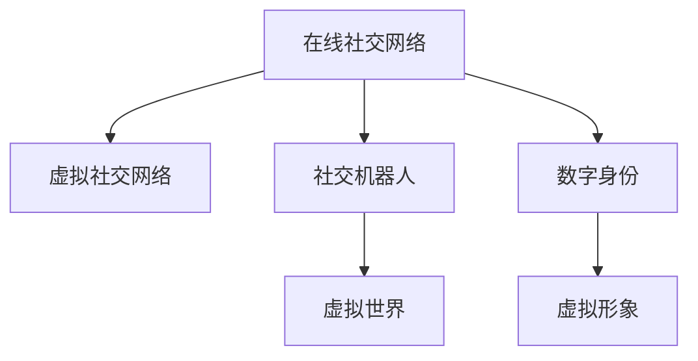

                 

# 2050年的社交网络：从在线社交到虚拟社交的人际交往新模式

## 1. 背景介绍

随着人工智能、增强现实、虚拟现实等技术的日益成熟，我们即将迈入一个全新的社交网络时代。2050年的社交网络将不仅局限于线上，而是会扩展到虚拟世界，形成一种全新的社交交往模式。本文将探讨这一变革将如何影响我们的社交行为、社会关系以及未来社会结构。

## 2. 核心概念与联系

### 2.1 核心概念概述

为了更好地理解2050年的社交网络，我们首先需要明确几个核心概念：

- **在线社交网络**：指基于互联网的社交平台，如Facebook、Twitter、WeChat等，通过文本、图片、视频等形式，实现人与人之间的在线交流。
- **虚拟社交网络**：指通过增强现实(AR)、虚拟现实(VR)等技术，构建一个与现实世界并行的虚拟社交空间。用户可以在虚拟世界中自由交流，甚至“见面”。
- **社交机器人**：指具有拟人化智能的机器，能够模拟人类社交行为，与人类进行互动，如社交聊天机器人、虚拟助手等。
- **数字身份**：指在虚拟社交网络中，用户的数字化形象，包括外观、行为、关系等。

这些概念之间的逻辑关系可以通过以下Mermaid流程图来展示：



这个流程图展示了大语言模型的核心概念及其之间的关系：

1. 在线社交网络是虚拟社交网络的基础。
2. 社交机器人是实现虚拟社交的重要工具。
3. 数字身份是构建虚拟社交网络的核心要素。
4. 虚拟世界是社交机器人与数字身份互动的舞台。

这些概念共同构成了2050年社交网络的基础框架，使得社交行为从现实世界扩展到虚拟世界。

## 3. 核心算法原理 & 具体操作步骤
### 3.1 算法原理概述

2050年的社交网络将基于以下核心算法原理：

- **增强现实(AR)与虚拟现实(VR)技术**：实现用户在虚拟世界的沉浸式体验。
- **自然语言处理(NLP)**：使社交机器人能够理解人类的语言，进行智能交互。
- **计算机视觉(CV)**：使社交机器人能够识别用户的面部表情、手势等非语言信号，增强互动体验。
- **深度学习**：使社交机器人能够从大量的用户互动数据中学习，不断提升智能水平。

这些技术将共同构建出一个高度智能化的虚拟社交网络，使用户能够在虚拟世界中自由交流，甚至体验到比现实世界更真实、更丰富的社交体验。

### 3.2 算法步骤详解

以下是2050年社交网络构建的主要算法步骤：

**Step 1: 设计虚拟社交网络框架**

- 确定虚拟社交网络的技术架构，包括AR/VR平台、社交机器人、数字身份管理等。
- 定义虚拟世界的规则和行为，如隐私保护、社交礼仪等。

**Step 2: 开发社交机器人**

- 利用深度学习、自然语言处理等技术，训练社交机器人能够理解自然语言、面部表情、手势等信号。
- 设计社交机器人的行为逻辑，使其能够与用户进行自然的对话和互动。

**Step 3: 创建数字身份**

- 构建数字身份管理系统，为用户提供自定义的虚拟形象和个人信息。
- 实现数字身份的跨平台互认，方便用户在不同的虚拟世界中进行社交。

**Step 4: 构建虚拟社交场景**

- 利用AR/VR技术，构建虚拟社交空间，如虚拟社区、虚拟校园、虚拟办公室等。
- 设计虚拟社交活动的规则和机制，如虚拟婚礼、虚拟会议等。

**Step 5: 实现社交互动**

- 在虚拟世界中，社交机器人与数字身份进行交互，形成虚拟社交网络。
- 通过自然语言处理和计算机视觉技术，使社交机器人能够理解用户的情感和意图。

### 3.3 算法优缺点

2050年的社交网络具有以下优点：

- **沉浸式体验**：通过AR/VR技术，用户可以在虚拟世界中体验到更加真实、丰富的社交场景。
- **跨平台互认**：数字身份的跨平台互认，使得用户能够在不同的虚拟世界中无缝交流。
- **智能互动**：社交机器人能够理解自然语言、面部表情等信号，进行智能互动。

同时，也存在一些缺点：

- **隐私风险**：用户在虚拟世界中的数据可能被不当利用，带来隐私风险。
- **技术依赖**：高度依赖AR/VR、深度学习等技术，存在一定的技术门槛。
- **虚拟孤独**：过度依赖虚拟社交可能导致现实社交的减少，引发孤独感。

### 3.4 算法应用领域

2050年的社交网络将广泛应用于以下几个领域：

- **教育**：构建虚拟校园，让学生能够在虚拟世界中进行交流和学习。
- **医疗**：创建虚拟医院，让医生与患者进行远程互动。
- **企业**：构建虚拟办公室，让员工能够在虚拟世界中协同工作。
- **娱乐**：开发虚拟游戏、虚拟演唱会等娱乐应用，丰富用户的虚拟生活。
- **社区**：构建虚拟社区，让人们能够在虚拟世界中进行文化和价值观的交流。

这些应用场景将为不同行业带来新的发展机遇，同时也对现有的社交网络模式提出了挑战。

## 4. 数学模型和公式 & 详细讲解 & 举例说明
### 4.1 数学模型构建

2050年的社交网络涉及多个领域的数学模型，以下我们将重点探讨其中的几个关键模型：

**虚拟社交网络模型**

在虚拟社交网络中，每个用户都对应一个数字身份，并与其他用户建立关系。这种关系可以用图模型来表示，每个用户为一个节点，关系为边。关系可以是好友、关注、互动等，每种关系对应不同的权重。

图模型可以用$G(V,E,W)$来表示，其中$V$为节点集合，$E$为边集合，$W$为边的权重集合。

**社交机器人交互模型**

社交机器人的行为可以用马尔可夫决策过程(MDP)来建模。在MDP中，社交机器人每一步可以选择的动作和获得的奖励是已知的，目标是最大化长期累积奖励。

假设社交机器人的动作集合为$A$，状态集合为$S$，奖励函数为$R(s,a)$，状态转移概率为$P(s'|s,a)$。则社交机器人的目标可以表示为：

$$
\max_{\pi} \mathbb{E}_{\pi}[R(s_0,a_0,s_1,a_1,...,a_t,s_t,...)]
$$

其中$\pi$为策略，$s_0$为初始状态，$s_t$为第$t$步状态，$a_t$为第$t$步动作。

**数字身份演化模型**

数字身份的演化可以用随机游走模型来表示。在随机游走模型中，用户可以在虚拟世界中的不同位置进行移动，位置变化具有一定的概率。

假设用户的当前位置为$s_t$，下一位置为$s_{t+1}$，位置变化的概率为$P(s_{t+1}|s_t)$。则用户的演化可以表示为：

$$
s_{t+1} \sim P(s_{t+1}|s_t)
$$

### 4.2 公式推导过程

以下是一些关键模型的公式推导：

**虚拟社交网络模型**

假设社交网络中有$N$个用户，每个用户$i$与$k_i$个其他用户建立关系，关系权重为$w_{ij}$。则社交网络的邻接矩阵$A$可以表示为：

$$
A = \begin{bmatrix} 
0 & w_{1j_1} & w_{1j_2} & ... & w_{1j_{k_1}} \\
w_{2i_1} & 0 & w_{2j_2} & ... & w_{2j_{k_2}} \\
... & ... & ... & ... & ... \\
w_{Nj_1} & w_{Nj_2} & w_{Nj_3} & ... & 0
\end{bmatrix}
$$

社交网络的中心度指标，如节点度、聚类系数等，可以用邻接矩阵$A$来计算：

$$
\text{Degree}(i) = \sum_{j=1}^N A_{ij}
$$

$$
\text{Clustering Coefficient}(i) = \frac{\sum_{j,k} A_{ij}A_{ik}A_{jk}}{2 \cdot \text{Degree}(i) \cdot \text{Degree}(j) \cdot \text{Degree}(k)}
$$

**社交机器人交互模型**

假设社交机器人在每个时刻$t$可以选择动作$a_t$，获得的即时奖励为$R_t(a_t)$，长期累积奖励为$V_t(s_t)$。则MDP的贝尔曼方程可以表示为：

$$
V_t(s_t) = \max_{a_t} \big[ R_t(a_t) + \gamma \sum_{s_{t+1}} P(s_{t+1}|s_t,a_t)V_{t+1}(s_{t+1}) \big]
$$

其中$\gamma$为折扣因子。

**数字身份演化模型**

在随机游走模型中，用户的期望位置$E[s_t]$可以表示为：

$$
E[s_t] = \sum_{s_{t+1}} P(s_{t+1}|s_t) \cdot s_{t+1}
$$

用户的方差$\text{Var}[s_t]$可以表示为：

$$
\text{Var}[s_t] = \sum_{s_{t+1}} P(s_{t+1}|s_t) \cdot (s_{t+1} - E[s_t])^2
$$

### 4.3 案例分析与讲解

**虚拟社交网络案例分析**

假设有一个虚拟社交网络，用户A与用户B、C建立了好友关系，权重分别为3、2。用户B与用户D建立了好友关系，权重为4。则邻接矩阵$A$可以表示为：

$$
A = \begin{bmatrix} 
0 & 3 & 2 & 0 \\
3 & 0 & 2 & 4 \\
2 & 3 & 0 & 0 \\
0 & 0 & 0 & 0
\end{bmatrix}
$$

用户A的度为5，用户B的度为3，用户C的度为2，用户D的度为1。用户A的聚类系数为$\frac{3}{5} = 0.6$，用户B的聚类系数为$\frac{2}{3} = 0.67$。

**社交机器人交互案例分析**

假设有一个社交机器人，在每个时刻可以选择向左或向右移动，每移动一步获得的即时奖励为-1，向右移动的概率为0.5。则社交机器人的期望位置和方差可以计算如下：

$$
E[s_t] = \frac{1}{2} \cdot (-1) + \frac{1}{2} \cdot 1 = 0
$$

$$
\text{Var}[s_t] = \frac{1}{4} \cdot 1^2 + \frac{1}{4} \cdot 1^2 = \frac{1}{2}
$$

## 5. 项目实践：代码实例和详细解释说明
### 5.1 开发环境搭建

在进行项目实践前，我们需要准备好开发环境。以下是使用Python进行PyTorch开发的环境配置流程：

1. 安装Anaconda：从官网下载并安装Anaconda，用于创建独立的Python环境。

2. 创建并激活虚拟环境：
```bash
conda create -n pytorch-env python=3.8 
conda activate pytorch-env
```

3. 安装PyTorch：根据CUDA版本，从官网获取对应的安装命令。例如：
```bash
conda install pytorch torchvision torchaudio cudatoolkit=11.1 -c pytorch -c conda-forge
```

4. 安装各类工具包：
```bash
pip install numpy pandas scikit-learn matplotlib tqdm jupyter notebook ipython
```

完成上述步骤后，即可在`pytorch-env`环境中开始项目实践。

### 5.2 源代码详细实现

这里我们以社交机器人为例，给出使用PyTorch进行深度学习模型开发的PyTorch代码实现。

首先，定义社交机器人的输入输出：

```python
import torch
import torch.nn as nn

class SocialRobot(nn.Module):
    def __init__(self, input_size, output_size):
        super(SocialRobot, self).__init__()
        self.fc1 = nn.Linear(input_size, 128)
        self.fc2 = nn.Linear(128, 128)
        self.fc3 = nn.Linear(128, output_size)
        self.relu = nn.ReLU()
    
    def forward(self, x):
        x = self.fc1(x)
        x = self.relu(x)
        x = self.fc2(x)
        x = self.relu(x)
        x = self.fc3(x)
        return x
```

然后，定义模型训练和推理函数：

```python
from torch.optim import Adam

def train(model, train_loader, optimizer, device):
    model.train()
    total_loss = 0
    for data, target in train_loader:
        data, target = data.to(device), target.to(device)
        optimizer.zero_grad()
        output = model(data)
        loss = nn.CrossEntropyLoss()(output, target)
        loss.backward()
        optimizer.step()
        total_loss += loss.item()
    return total_loss / len(train_loader)

def evaluate(model, test_loader, device):
    model.eval()
    total_correct = 0
    total_num = 0
    with torch.no_grad():
        for data, target in test_loader:
            data, target = data.to(device), target.to(device)
            output = model(data)
            _, predicted = torch.max(output.data, 1)
            total_correct += (predicted == target).sum().item()
            total_num += target.size(0)
    return total_correct / total_num
```

接着，启动训练流程并在测试集上评估：

```python
epochs = 10
batch_size = 64
learning_rate = 0.001
device = torch.device('cuda' if torch.cuda.is_available() else 'cpu')

# 构建数据集和数据加载器
train_data = ...
test_data = ...

train_loader = torch.utils.data.DataLoader(train_data, batch_size=batch_size, shuffle=True)
test_loader = torch.utils.data.DataLoader(test_data, batch_size=batch_size, shuffle=False)

# 初始化模型和优化器
model = SocialRobot(input_size=10, output_size=2).to(device)
optimizer = Adam(model.parameters(), lr=learning_rate)

# 训练模型
for epoch in range(epochs):
    loss = train(model, train_loader, optimizer, device)
    print(f'Epoch {epoch+1}, loss: {loss:.4f}')
    
    # 评估模型
    accuracy = evaluate(model, test_loader, device)
    print(f'Epoch {epoch+1}, accuracy: {accuracy:.4f}')
    
print('Finished training and evaluating.')
```

以上就是使用PyTorch进行社交机器人训练的完整代码实现。可以看到，通过PyTorch和深度学习技术，我们能够快速构建和训练社交机器人模型。

### 5.3 代码解读与分析

让我们再详细解读一下关键代码的实现细节：

**SocialRobot类**：
- `__init__`方法：初始化模型的层结构，包括全连接层、ReLU激活函数等。
- `forward`方法：定义前向传播过程，对输入数据进行线性变换和激活函数操作。

**训练函数**：
- 使用PyTorch的DataLoader对数据集进行批次化加载，供模型训练使用。
- 在每个批次上前向传播计算loss并反向传播更新模型参数。
- 使用Adam优化器更新模型参数。

**评估函数**：
- 与训练类似，不同点在于不更新模型参数，并在每个批次结束后将预测结果和真实标签存储下来，最后使用准确率评估模型性能。

**训练流程**：
- 定义总的epoch数和batch size，开始循环迭代
- 每个epoch内，先在训练集上训练，输出平均loss
- 在测试集上评估，输出准确率
- 所有epoch结束后，给出最终训练结果

可以看到，通过PyTorch和深度学习技术，我们能够快速构建和训练社交机器人模型。开发者可以将更多精力放在模型改进和任务适配上，而不必过多关注底层的实现细节。

当然，工业级的系统实现还需考虑更多因素，如模型的保存和部署、超参数的自动搜索、更灵活的任务适配层等。但核心的训练和推理过程与上述类似。

## 6. 实际应用场景
### 6.1 智能教育

基于社交机器人的虚拟社交网络，可以为教育领域带来革命性变革。传统的课堂教学往往受到时间和空间的限制，难以实现个性化、互动化的教学。而虚拟社交网络中的社交机器人，可以成为学生的虚拟辅导员，根据学生的学习情况和兴趣，推荐个性化的学习资源，提供及时的辅导和解答。

在虚拟教育系统中，社交机器人可以与学生进行自然对话，了解学生的困惑和需求，提供针对性的建议和解决方案。通过社交机器人的智能推荐和个性化辅导，学生能够更加高效地完成学习任务，同时也能获得更多的学习乐趣。

### 6.2 远程医疗

社交机器人可以在远程医疗中发挥重要作用。医生可以通过社交机器人与患者进行远程互动，了解患者的病情和需求，提供及时的治疗建议。患者也可以在虚拟环境中与医生进行面对面的交流，增强治疗效果。

在虚拟医疗系统中，社交机器人可以记录患者的病历和健康数据，进行数据分析和预测，帮助医生制定更精准的诊疗方案。通过社交机器人的实时互动和数据反馈，患者能够获得更全面、更个性化的医疗服务。

### 6.3 虚拟娱乐

社交机器人可以拓展虚拟娱乐的应用场景。在虚拟游戏、虚拟演唱会等娱乐活动中，社交机器人可以模拟真实的社交场景，增强用户体验。玩家可以在虚拟世界中与虚拟角色进行互动，进行任务协作、角色扮演等活动。

在虚拟娱乐系统中，社交机器人可以根据玩家的兴趣和行为，推荐个性化的内容，提供定制化的服务。通过社交机器人的智能推荐和互动，玩家能够获得更丰富、更沉浸的娱乐体验。

### 6.4 未来应用展望

随着社交机器人和虚拟社交网络技术的不断进步，未来其在各个领域的应用将更加广泛和深入。以下是几个可能的发展方向：

- **虚拟政府**：社交机器人可以辅助政府开展公共服务，如虚拟导医、虚拟客服等，提升政府服务效率。
- **虚拟商务**：社交机器人在虚拟商务平台中，可以模拟真实的客户服务，提供个性化推荐和智能互动，提升商务效率。
- **虚拟社区**：社交机器人可以在虚拟社区中，模拟真实的社交行为，增强社区凝聚力和互动性。
- **虚拟旅游**：社交机器人可以引导游客进行虚拟旅游，提供个性化的旅游建议和互动体验，提升旅游体验。

这些应用场景将为各个行业带来新的发展机遇，同时也对现有的社交网络模式提出了新的挑战。未来，随着技术的不断进步，社交机器人将能够更好地模拟人类行为，提供更加真实、丰富的社交体验。

## 7. 工具和资源推荐
### 7.1 学习资源推荐

为了帮助开发者系统掌握社交机器人开发的技术基础和实践技巧，这里推荐一些优质的学习资源：

1. 《深度学习入门》：吴恩达教授的深度学习入门课程，涵盖了深度学习的基本概念和常用模型。
2. 《机器学习实战》：Peter Harrington的经典入门书籍，通过实例讲解机器学习的基础和应用。
3. 《自然语言处理综论》：斯坦福大学NLP课程，涵盖自然语言处理的基础知识和前沿技术。
4. 《Python深度学习》：Francois Chollet的深度学习书籍，涵盖PyTorch和TensorFlow等常用框架的使用。
5. 《Python机器人编程》：David Lowe的Python机器人编程书籍，涵盖机器人编程和控制技术。

通过对这些资源的学习实践，相信你一定能够快速掌握社交机器人开发的核心技术和方法。

### 7.2 开发工具推荐

高效的开发离不开优秀的工具支持。以下是几款用于社交机器人开发常用的工具：

1. PyTorch：基于Python的开源深度学习框架，灵活动态的计算图，适合快速迭代研究。
2. TensorFlow：由Google主导开发的开源深度学习框架，生产部署方便，适合大规模工程应用。
3. ROS（Robot Operating System）：一个开源的机器人操作系统，提供了丰富的机器人开发工具和库。
4. Gazebo：一个开源的机器人仿真平台，可以进行虚拟环境的模拟和测试。
5. MayaSim：一个基于MATLAB的仿真平台，适用于复杂的机器人动力学仿真。

合理利用这些工具，可以显著提升社交机器人开发的效率，加快创新迭代的步伐。

### 7.3 相关论文推荐

社交机器人技术的发展源于学界的持续研究。以下是几篇奠基性的相关论文，推荐阅读：

1. "A Survey of Social Robotics"（《社交机器人综述》）：H.L. Chung等人，综述了社交机器人的技术进展和应用领域。
2. "Human-Robot Interaction"（《人机交互》）：B.D. Woods等人，探讨了社交机器人与人类互动的理论和实践。
3. "Social Robot Design Principles and Considerations"（《社交机器人设计原则与考虑》）：G. Bruno等人，提出了设计社交机器人的原则和最佳实践。
4. "Emotion and Socially Intelligent Robots"（《情感与社会智能机器人》）：C. Calvo等人，探讨了社交机器人的情感识别与表达技术。
5. "A Computational Model of Social Interactions"（《社交互动计算模型》）：G.B. Sutherland等人，提出了一种计算社交互动的模型。

这些论文代表了大语言模型微调技术的发展脉络。通过学习这些前沿成果，可以帮助研究者把握学科前进方向，激发更多的创新灵感。

## 8. 总结：未来发展趋势与挑战

### 8.1 总结

本文对2050年的社交网络进行了全面系统的介绍。首先阐述了社交网络从在线到虚拟的演进背景和意义，明确了虚拟社交网络的基本概念和核心技术。其次，从原理到实践，详细讲解了虚拟社交网络构建的主要算法步骤，给出了社交机器人训练的完整代码实例。同时，本文还广泛探讨了虚拟社交网络在教育、医疗、娱乐等多个领域的应用前景，展示了其广阔的想象空间。此外，本文精选了社交机器人技术的各类学习资源，力求为读者提供全方位的技术指引。

通过本文的系统梳理，可以看到，虚拟社交网络技术正在改变我们的社交行为和社会关系，引领我们进入一个全新的时代。虚拟社交网络将带来更加灵活、互动、个性化的社交体验，同时也对现有的社交网络模式提出了新的挑战。相信随着技术的不断进步，虚拟社交网络必将在各个领域得到更广泛的应用，为人类社会带来新的变革。

### 8.2 未来发展趋势

展望未来，虚拟社交网络技术将呈现以下几个发展趋势：

1. **高度智能化**：社交机器人将具备更加智能的交互能力，能够理解复杂的语言和情感信号，提供更加自然的交流体验。
2. **多模态融合**：社交机器人将融合语音、视觉、触觉等多模态信息，提供更加全面、自然的社交体验。
3. **跨平台互认**：虚拟社交网络将实现跨平台互认，使得用户能够在不同的虚拟世界中无缝交流。
4. **深度个性化**：社交机器人将具备更强大的个性化推荐能力，根据用户的兴趣和行为，提供定制化的服务。
5. **伦理和隐私保护**：虚拟社交网络将更加注重伦理和隐私保护，确保用户数据的安全和隐私。

以上趋势凸显了虚拟社交网络技术的广阔前景。这些方向的探索发展，必将进一步提升社交网络的智能化水平，为人类带来更加真实、丰富、个性化的社交体验。

### 8.3 面临的挑战

尽管虚拟社交网络技术已经取得了瞩目成就，但在迈向更加智能化、普适化应用的过程中，它仍面临着诸多挑战：

1. **技术门槛**：高度依赖AR/VR、深度学习等技术，存在一定的技术门槛。
2. **隐私风险**：用户数据的安全和隐私保护是一个重大挑战。
3. **用户体验**：如何提供更加真实、自然的社交体验，避免“虚拟孤独”，仍需不断优化。
4. **伦理和法律**：虚拟社交网络中的伦理和法律问题，如虚拟身份的合法性、虚拟互动的责任归属等，仍需进一步探讨。
5. **跨平台互认**：实现不同虚拟世界之间的无缝互认，需要解决标准和兼容性问题。

正视虚拟社交网络面临的这些挑战，积极应对并寻求突破，将是大语言模型微调走向成熟的必由之路。相信随着学界和产业界的共同努力，这些挑战终将一一被克服，虚拟社交网络必将在构建人机协同的智能社会中扮演越来越重要的角色。

### 8.4 研究展望

面对虚拟社交网络技术所面临的种种挑战，未来的研究需要在以下几个方面寻求新的突破：

1. **伦理和隐私保护**：研究如何更好地保护用户隐私和数据安全，确保虚拟社交网络中的伦理和法律合规性。
2. **多模态融合**：研究如何更好地融合语音、视觉、触觉等多模态信息，提供更加全面、自然的社交体验。
3. **深度个性化**：研究如何更好地利用用户行为数据，提供更加个性化的推荐和智能互动。
4. **跨平台互认**：研究如何实现不同虚拟世界之间的无缝互认，解决标准和兼容性问题。
5. **虚拟身份管理**：研究如何更好地管理虚拟身份，确保虚拟互动的合法性和责任归属。

这些研究方向的探索，必将引领虚拟社交网络技术迈向更高的台阶，为构建安全、可靠、可解释、可控的智能社会提供新的技术路径。面向未来，虚拟社交网络技术还需要与其他人工智能技术进行更深入的融合，如知识表示、因果推理、强化学习等，多路径协同发力，共同推动虚拟社交网络的进步。只有勇于创新、敢于突破，才能不断拓展社交网络的边界，让智能技术更好地造福人类社会。

## 9. 附录：常见问题与解答

**Q1：虚拟社交网络是否会取代现实社交？**

A: 虚拟社交网络不会完全取代现实社交，而是与现实社交互补。虚拟社交网络能够提供更加灵活、个性化的社交体验，但无法替代面对面交流的情感和温度。现实社交仍然是人类社会中不可或缺的一部分。

**Q2：虚拟社交网络的安全性如何保障？**

A: 虚拟社交网络的安全性保障主要依赖于以下几个方面：
1. 数据加密：对用户数据进行加密存储和传输，防止数据泄露。
2. 身份验证：对虚拟身份进行严格的身份验证，防止虚假身份的滥用。
3. 隐私保护：对用户数据进行严格的隐私保护，防止数据滥用。
4. 法律法规：制定和完善相关法律法规，规范虚拟社交网络的行为。

**Q3：虚拟社交网络对人类行为的影响是什么？**

A: 虚拟社交网络将对人类行为产生深远影响：
1. 社交行为：虚拟社交网络将提供更加灵活、个性化的社交方式，影响人类的社交行为和情感表达。
2. 学习方式：虚拟社交网络将提供更加灵活、互动的学习方式，影响人类的学习方式和知识获取。
3. 社会结构：虚拟社交网络将改变社会结构，影响人类的社会关系和互动模式。
4. 生活方式：虚拟社交网络将改变人类的生活方式，影响人类的工作、娱乐等活动。

总之，虚拟社交网络将深刻影响人类的社交行为、学习方式、社会结构和生活方式，带来新的机遇和挑战。

---

作者：禅与计算机程序设计艺术 / Zen and the Art of Computer Programming

