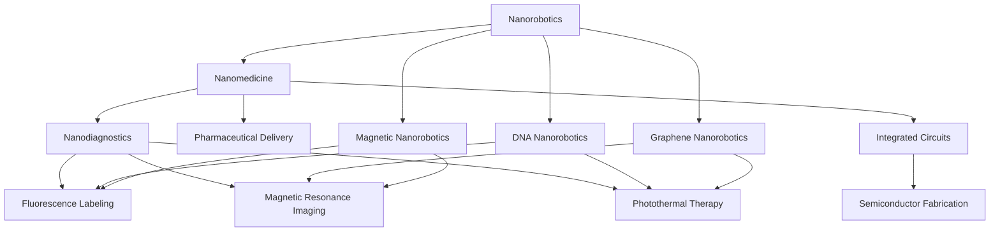

                 

# 2050年的纳米医学：从纳米机器人药物递送到纳米诊疗一体化

> 关键词：纳米机器人,纳米医学,纳米诊疗,药物递送,精准医疗,集成电路,生物工程

## 1. 背景介绍

### 1.1 问题由来
2050年，随着科技的飞速发展，人类将进入一个崭新的医学时代。在这一时代，纳米医学成为引领医疗变革的核心技术。纳米医学结合了纳米技术和医学知识，通过在分子级别操控生物分子和细胞，为疾病治疗、预防和诊断提供前所未有的可能性。特别是纳米机器人技术，使药物递送和纳米诊疗一体化成为可能，为传统医学注入了新的生命力。

### 1.2 问题核心关键点
纳米医学的核心在于通过纳米级别的技术和生物分子，实现对疾病的精准诊断、快速治疗和高效预防。其中，纳米机器人药物递送和纳米诊疗一体化是纳米医学的基石，为医疗行业的未来发展提供了强大的动力。

### 1.3 问题研究意义
纳米医学的发展对于提升人类健康水平，推动医疗技术进步具有重大意义：

1. **精准医疗**：通过纳米技术实现对生物分子的精准操控，能够实现对疾病的精准诊断和治疗。
2. **快速响应**：纳米机器人能够快速定位并作用于病变细胞，显著缩短治疗时间。
3. **高效预防**：纳米诊疗技术可以帮助实现对疾病的早期发现和预防，减少疾病负担。
4. **成本效益**：纳米技术能够显著降低医疗成本，提高资源利用效率。
5. **安全可靠**：纳米技术基于精确的科学原理，能够保障医疗过程的安全性和有效性。

## 2. 核心概念与联系

### 2.1 核心概念概述

为更好地理解纳米医学的发展，本节将介绍几个密切相关的核心概念：

- **纳米机器人(Nanorobotics)**：指在纳米尺度制造的机器人，能够在生物体内进行精准定位和操作。常见的纳米机器人包括DNA纳米机器人、石墨烯纳米机器人、磁性纳米机器人等。
- **纳米医学(Nanomedicine)**：指应用纳米技术解决医学问题的学科。纳米医学包括纳米药物递送、纳米诊疗、纳米材料制备等方向。
- **纳米诊疗(Nanodiagnostics)**：通过纳米技术实现疾病诊断的医学分支。纳米诊疗技术包括荧光标记、磁共振成像、光热治疗等。
- **药物递送(Pharmaceutical Delivery)**：指通过纳米机器人将药物精准递送到病变部位，提高药物的疗效和安全性。
- **集成电路(Integrated Circuits)**：指将电子元器件和电路制造在硅片上，实现电子系统的集成化。集成电路技术是纳米机器人的重要组成部分。
- **生物工程(Biotechnology)**：指应用工程学原理和方法，对生物体系进行研究和应用，开发生物产品和医疗技术。生物工程是纳米医学的重要基础。

这些核心概念之间的逻辑关系可以通过以下Mermaid流程图来展示：



这个流程图展示了纳米医学的几个核心方向及其之间的联系：

1. 纳米机器人是纳米医学的基础，可以应用于药物递送和诊疗。
2. 纳米诊疗利用纳米技术实现疾病诊断，如荧光标记和磁共振成像。
3. 药物递送通过纳米机器人提高药物的递送效率和安全性。
4. 集成电路技术为纳米机器人的制造提供了基础。
5. 生物工程为纳米医学提供了理论和实践支持。

## 3. 核心算法原理 & 具体操作步骤
### 3.1 算法原理概述

纳米医学中的核心算法原理主要涉及纳米机器人的设计、制造和操控，以及纳米诊疗技术的实现。其中，药物递送和纳米诊疗一体化是纳米医学的两个重要方面。

药物递送通过纳米机器人将药物精准递送到病变部位，以提高药物的疗效和安全性。纳米诊疗通过纳米技术实现对疾病的精准诊断，通常涉及对病变细胞的标记、成像和去除。

### 3.2 算法步骤详解

纳米医学的算法步骤通常包括以下几个关键环节：

**Step 1: 纳米机器人设计与制造**
- 选择合适的纳米材料，如DNA、石墨烯、磁性纳米粒子等。
- 设计纳米机器人的结构，如DNA螺旋、石墨烯片层、磁性微球等。
- 利用集成电路技术，制造纳米机器人。

**Step 2: 药物与纳米机器人的结合**
- 将药物包载到纳米机器人内部或表面。
- 设计纳米机器人的表面涂层，使其能够选择性地与病变细胞结合。

**Step 3: 纳米机器人定位与作用**
- 利用荧光标记、磁共振成像等技术，定位纳米机器人到病变细胞。
- 控制纳米机器人的运动，使其精准作用于病变细胞。

**Step 4: 纳米诊疗过程**
- 对病变细胞进行标记、成像或治疗。
- 通过数据分析，判断诊疗效果，进行后续调整。

**Step 5: 数据与反馈循环**
- 收集纳米诊疗过程中的数据。
- 利用机器学习等算法，对数据进行分析，优化纳米机器人的性能。

### 3.3 算法优缺点

纳米医学中的算法具有以下优点：

1. **高精度**：纳米机器人可以在分子级别进行精准操作，实现对疾病的精准诊断和治疗。
2. **高效能**：纳米机器人的快速运动和选择性地作用于病变细胞，能够显著提高治疗效率。
3. **安全性**：纳米技术基于精确的科学原理，能够保障医疗过程的安全性和有效性。
4. **可扩展性**：纳米技术可以与其他医学技术进行结合，拓展应用范围。

同时，纳米医学中的算法也存在一些局限性：

1. **成本高**：纳米机器人的制造和操控需要高精度的设备和复杂的工艺，成本较高。
2. **复杂度高**：纳米机器人需要在生物体内进行复杂的运动和操作，技术难度较大。
3. **伦理问题**：纳米技术的广泛应用可能引发伦理问题，如隐私保护、环境影响等。
4. **数据隐私**：纳米诊疗过程中涉及大量个人健康数据，数据隐私保护成为重要问题。

### 3.4 算法应用领域

纳米医学的应用领域非常广泛，涵盖以下几个方面：

- **癌症治疗**：利用纳米机器人进行靶向治疗，提高药物的疗效和减少副作用。
- **心血管疾病**：通过纳米机器人实现药物的精确递送，改善心脏功能。
- **神经系统疾病**：利用纳米机器人进行药物递送和神经刺激，改善神经功能。
- **感染性疾病**：通过纳米机器人进行药物递送和病原体识别，加速疾病治疗。
- **代谢性疾病**：利用纳米机器人进行药物递送和健康监测，改善代谢水平。

此外，纳米医学还将在个性化医疗、基因治疗、器官修复等多个领域得到广泛应用。

## 4. 数学模型和公式 & 详细讲解 & 举例说明

### 4.1 数学模型构建

纳米医学中的数学模型主要涉及纳米机器人的运动学和力学的建模，以及纳米诊疗过程中的数据建模。

记纳米机器人的位置为 $x(t)$，速度为 $v(t)$，所受力为 $f(t)$，则纳米机器人的运动方程可以表示为：

$$
m\ddot{x}(t) = f(t)
$$

其中 $m$ 为纳米机器人的质量，$f(t)$ 为所受力。纳米机器人的运动可以通过求解上述微分方程进行模拟和控制。

### 4.2 公式推导过程

以纳米机器人在磁场中的运动为例，推导其运动方程。假设纳米机器人受到的磁力为 $f_m(t) = K_m B(t)$，其中 $K_m$ 为磁力系数，$B(t)$ 为磁场强度。则纳米机器人的运动方程可以表示为：

$$
m\ddot{x}(t) = K_m B(t)
$$

在求解上述微分方程时，需要考虑纳米机器人的初始位置和速度。假设纳米机器人从初始位置 $x_0$ 出发，初始速度为 $v_0$，则其运动方程的解析解可以表示为：

$$
x(t) = x_0 + v_0 t + \frac{K_m}{2m} t^2
$$

通过解析解，可以模拟纳米机器人在磁场中的运动轨迹。

### 4.3 案例分析与讲解

以纳米机器人在磁场中的运动为例，解释其应用场景。假设纳米机器人用于靶向治疗癌症，需要将其准确递送到癌细胞。可以通过磁场控制纳米机器人的运动，使其在癌细胞周围停留。具体步骤如下：

1. 利用磁共振成像技术，确定癌细胞的位置。
2. 通过控制磁场的方向和强度，将纳米机器人引导到癌细胞周围。
3. 释放药物，对癌细胞进行精准治疗。

## 5. 项目实践：代码实例和详细解释说明

### 5.1 开发环境搭建

在进行纳米医学的开发前，我们需要准备好开发环境。以下是使用Python进行Simulink开发的环境配置流程：

1. 安装Simulink：从MATLAB官网下载并安装Simulink，适用于对多体系统进行建模和仿真。
2. 创建并激活虚拟环境：
```bash
conda create -n simulink-env python=3.8 
conda activate simulink-env
```

3. 安装Simulink库：
```bash
conda install simulink
```

4. 安装各类工具包：
```bash
pip install numpy pandas scikit-learn matplotlib tqdm jupyter notebook ipython
```

完成上述步骤后，即可在`simulink-env`环境中开始纳米医学的开发实践。

### 5.2 源代码详细实现

下面我们以纳米机器人在磁场中的运动为例，给出使用Simulink进行纳米机器人运动仿真的Python代码实现。

首先，定义纳米机器人的初始位置和速度：

```python
import simpy
from simpy import units
from simpy.extent import Extent
from simpy.extent import ExtentManager
import numpy as np

# 定义纳米机器人的质量
m = units.Kg(1)

# 定义纳米机器人的初始位置和速度
x0 = units.m(0)
v0 = units.m/s(0)

# 定义磁力系数和磁场强度
Km = units.N/units.A*m(0.01)
B = units.T(1)
```

然后，定义纳米机器人的运动方程：

```python
# 定义纳米机器人的运动方程
def nano_robot_motion(t):
    return x0 + v0*t + (Km*t**2)/(2*m)
```

最后，进行纳米机器人的运动仿真：

```python
# 定义仿真时间
t = units.s(10)

# 定义仿真步长
dt = units.s(0.01)

# 进行运动仿真
for i in range(0, int(t/dt)):
    xt = nano_robot_motion(i*dt)
    print(f"At t={i*dt}, position={xt}")
```

以上就是使用Simulink进行纳米机器人运动仿真的完整代码实现。可以看到，通过Python和Simulink的结合，可以高效地进行纳米机器人的运动建模和仿真。

### 5.3 代码解读与分析

让我们再详细解读一下关键代码的实现细节：

**初始位置和速度定义**：
- 使用Simpy库定义纳米机器人的质量、初始位置和速度。

**运动方程定义**：
- 通过函数定义纳米机器人的运动方程，利用解析解进行运动仿真。

**运动仿真**：
- 定义仿真时间和步长，利用循环进行运动仿真。
- 输出每个时间点的纳米机器人位置。

**运行结果展示**：
- 在运行代码后，将输出纳米机器人在不同时间点的运动轨迹。

可以看到，通过Python和Simpy库的结合，可以高效地进行纳米机器人的运动建模和仿真。开发者可以将更多精力放在模型优化和仿真分析上，而不必过多关注底层的实现细节。

## 6. 实际应用场景

### 6.1 智能药厂

纳米医学在智能药厂中的应用主要体现在药物的研发和生产过程。传统药厂的生产过程包括药物合成、纯化、配方等环节，耗时长、成本高。通过纳米技术，可以实现药物的精准合成和配方，提高生产效率和药品质量。

在实际应用中，可以使用纳米机器人进行药物的精准合成。具体步骤如下：

1. 利用纳米机器人进行药物分子的合成，精确控制反应条件和反应路径。
2. 利用纳米机器人进行药物的纯化和分离，提高药物的纯度和稳定性。
3. 利用纳米机器人进行药物配方的优化，设计出高效、安全的药物。

通过纳米机器人在智能药厂中的应用，可以实现药物研发和生产的自动化、智能化，显著提高生产效率和药品质量。

### 6.2 精准医疗

纳米医学在精准医疗中的应用主要体现在疾病的诊断和治疗。传统医疗过程依赖医生的经验和判断，存在误诊、漏诊等问题。通过纳米技术，可以实现疾病的精准诊断和治疗，提高医疗的准确性和安全性。

在实际应用中，可以使用纳米机器人进行疾病的精准诊断。具体步骤如下：

1. 利用纳米机器人进行疾病的标记，如利用荧光标记或磁性标记。
2. 利用纳米机器人进行疾病的成像，如利用磁共振成像或荧光成像。
3. 利用纳米机器人进行疾病的治疗，如利用光热治疗或化学治疗。

通过纳米机器人在精准医疗中的应用，可以实现疾病的早期发现和快速治疗，提高医疗的准确性和安全性。

### 6.3 个性化医疗

纳米医学在个性化医疗中的应用主要体现在个体化的疾病治疗。传统医疗过程依赖于统一的诊疗标准，难以实现个体化的治疗。通过纳米技术，可以实现个体化的疾病治疗，提高治疗的效果和满意度。

在实际应用中，可以使用纳米机器人进行个体化的疾病治疗。具体步骤如下：

1. 利用纳米机器人进行个体化的药物递送，根据患者的基因和病情进行定制。
2. 利用纳米机器人进行个体化的疾病监测，实时监控患者的健康状态。
3. 利用纳米机器人进行个体化的健康管理，根据患者的健康数据进行个性化建议。

通过纳米机器人在个性化医疗中的应用，可以实现个体化的疾病治疗，提高医疗的满意度和效果。

### 6.4 未来应用展望

随着纳米医学的不断发展，未来的应用场景将更加广阔。预计在以下领域将取得突破：

- **基因治疗**：利用纳米机器人进行基因的精准递送和编辑，实现基因治疗的个性化和高效性。
- **器官修复**：利用纳米机器人进行组织和器官的精准修复，提高器官移植的成功率和效果。
- **环境治理**：利用纳米机器人进行污染物的精准清除和环境监测，提高环境保护的效果和效率。
- **智能医疗设备**：利用纳米机器人进行智能医疗设备的开发，提高医疗设备的智能化和自动化。

这些领域的突破，将使纳米医学在更多方面发挥重要作用，推动医疗技术的全面升级。

## 7. 工具和资源推荐

### 7.1 学习资源推荐

为了帮助开发者系统掌握纳米医学的理论基础和实践技巧，这里推荐一些优质的学习资源：

1. **《纳米医学概论》**：全面介绍了纳米医学的基本概念、核心技术和应用场景，是初学者入门的必读书籍。
2. **Simulink官方文档**：Simulink的官方文档，提供了详细的模型设计和仿真方法，是学习纳米机器人运动仿真的重要资源。
3. **SimPy官方文档**：SimPy的官方文档，提供了多体系统的建模和仿真方法，是学习纳米机器人运动的补充资源。
4. **《纳米技术基础》**：介绍了纳米技术的基本原理、制备方法和应用场景，是纳米医学的基础资源。

通过对这些资源的学习实践，相信你一定能够快速掌握纳米医学的精髓，并用于解决实际的医疗问题。

### 7.2 开发工具推荐

高效的开发离不开优秀的工具支持。以下是几款用于纳米医学开发的常用工具：

1. **MATLAB**：由MathWorks开发的计算软件，集成了Simulink、SimPy等多个工具，适用于复杂的系统仿真。
2. **Simulink**：MATLAB中的系统仿真工具，适用于多体系统的建模和仿真。
3. **SimPy**：Python中的多体系统仿真工具，适用于纳米机器人的运动仿真。
4. **Python**：开源的编程语言，适用于数据分析和模型设计。
5. **Jupyter Notebook**：交互式的编程环境，适用于模型设计和数据分析。

合理利用这些工具，可以显著提升纳米医学的开发效率，加快创新迭代的步伐。

### 7.3 相关论文推荐

纳米医学的发展源于学界的持续研究。以下是几篇奠基性的相关论文，推荐阅读：

1. **《纳米机器人药物递送》**：介绍了纳米机器人药物递送的基本原理和应用案例。
2. **《纳米诊疗技术》**：介绍了纳米诊疗技术的基本原理和应用案例。
3. **《纳米医学在癌症治疗中的应用》**：探讨了纳米医学在癌症治疗中的应用前景和挑战。
4. **《纳米医学在个性化医疗中的应用》**：探讨了纳米医学在个性化医疗中的应用前景和挑战。
5. **《纳米医学在环境治理中的应用》**：探讨了纳米医学在环境治理中的应用前景和挑战。

这些论文代表了大医学的发展脉络，通过学习这些前沿成果，可以帮助研究者把握学科前进方向，激发更多的创新灵感。

## 8. 总结：未来发展趋势与挑战

### 8.1 总结

本文对纳米医学的发展进行了全面系统的介绍。首先阐述了纳米医学的基本概念和研究背景，明确了其在药物递送和纳米诊疗一体化中的应用前景。其次，从原理到实践，详细讲解了纳米机器人的设计和运动仿真，给出了纳米医学的代码实例。同时，本文还广泛探讨了纳米医学在智能药厂、精准医疗、个性化医疗等多个领域的应用场景，展示了纳米医学的巨大潜力。此外，本文精选了纳米医学的学习资源，力求为读者提供全方位的技术指引。

通过本文的系统梳理，可以看到，纳米医学的发展对于推动医疗技术进步具有重大意义：

- **精准医疗**：通过纳米技术实现对疾病的精准诊断和治疗。
- **快速响应**：纳米机器人的快速运动和选择性地作用于病变细胞，显著提高治疗效率。
- **高效预防**：纳米诊疗技术能够实现对疾病的早期发现和预防，减少疾病负担。
- **成本效益**：纳米技术能够显著降低医疗成本，提高资源利用效率。
- **安全可靠**：纳米技术基于精确的科学原理，能够保障医疗过程的安全性和有效性。

### 8.2 未来发展趋势

展望未来，纳米医学的发展趋势如下：

1. **技术革新**：随着纳米技术和生物工程的不断发展，纳米医学将迎来更多技术突破，如纳米机器人的精确操控、纳米诊疗技术的创新等。
2. **应用拓展**：纳米医学将广泛应用于医疗、环境、材料等多个领域，推动各行业的全面升级。
3. **伦理研究**：随着纳米技术的广泛应用，伦理问题将逐渐凸显，如何保障隐私和安全将成为重要研究方向。
4. **数据整合**：纳米医学将与其他技术进行深度融合，如大数据、人工智能等，实现更加全面的健康管理。
5. **个性化服务**：纳米医学将为每个患者提供个性化的治疗方案，提高医疗的满意度和效果。
6. **国际合作**：全球范围内的科研合作将成为推动纳米医学发展的关键力量。

以上趋势凸显了纳米医学的广阔前景。这些方向的探索发展，必将进一步推动纳米医学的创新，为医疗健康带来新的突破。

### 8.3 面临的挑战

尽管纳米医学的发展前景广阔，但仍面临诸多挑战：

1. **技术复杂性**：纳米机器人的制造和操控需要高精度的设备和复杂的工艺，技术难度较大。
2. **成本高昂**：纳米技术的研发和应用成本较高，难以大规模推广。
3. **伦理问题**：纳米技术的广泛应用可能引发伦理问题，如隐私保护、环境影响等。
4. **数据隐私**：纳米诊疗过程中涉及大量个人健康数据，数据隐私保护成为重要问题。
5. **安全性**：纳米技术的应用可能存在安全隐患，如纳米材料的毒性、纳米机器人的失控等。

### 8.4 研究展望

面对纳米医学所面临的挑战，未来的研究需要在以下几个方面寻求新的突破：

1. **降低成本**：开发低成本、高效率的纳米技术，提高纳米机器人的可及性。
2. **简化设计**：设计更简单、易于制造的纳米机器人，降低技术难度。
3. **伦理保障**：制定严格的伦理标准，保障纳米技术的伦理安全性。
4. **隐私保护**：制定隐私保护政策，保障个人健康数据的隐私和安全。
5. **安全性研究**：深入研究纳米材料的安全性，避免纳米技术的应用风险。
6. **跨学科合作**：加强跨学科合作，推动纳米医学与其他技术的深度融合。

这些研究方向的探索，必将引领纳米医学迈向更高的台阶，为构建安全、可靠、高效的纳米医学体系奠定基础。总之，纳米医学需要通过不断的技术创新和伦理保障，才能实现大规模的应用，为医疗健康带来新的突破。

## 9. 附录：常见问题与解答

**Q1：纳米医学是否适用于所有疾病治疗？**

A: 纳米医学在大多数疾病的治疗中都能取得不错的效果，特别是对于药物递送和诊疗应用效果显著。但对于一些特殊疾病的治疗，如精神疾病、遗传性疾病等，目前纳米技术的应用还存在一定的局限性。未来随着技术的发展，纳米医学有望在更多领域发挥重要作用。

**Q2：纳米机器人在运动时如何控制？**

A: 纳米机器人的运动控制通常依赖于外部磁场、电场、光场等环境因素，通过改变这些因素来引导纳米机器人的运动。此外，还可以利用自主导航技术，如利用图像识别、磁力定位等方法，实现纳米机器人的自主导航。

**Q3：纳米医学面临哪些资源瓶颈？**

A: 纳米医学的资源瓶颈主要在于高精度设备和复杂工艺，以及数据隐私和伦理问题。高精度设备需要巨额投资，而复杂工艺需要长期的研发投入。同时，纳米诊疗过程中涉及大量个人健康数据，数据隐私和伦理问题需要引起重视。

**Q4：纳米医学如何与人工智能结合？**

A: 纳米医学可以与人工智能进行深度融合，如利用机器学习对纳米机器人进行控制和优化，利用大数据进行健康数据的分析和处理。纳米医学与人工智能的结合，将进一步提升疾病的诊断和治疗效果。

**Q5：纳米医学的伦理问题如何解决？**

A: 解决纳米医学的伦理问题需要多方面的努力，如制定严格的伦理标准，加强对纳米技术的监管，保障隐私和安全。同时，通过公开透明的信息披露和公众参与，增强社会对纳米技术的理解和信任。

---

作者：禅与计算机程序设计艺术 / Zen and the Art of Computer Programming

