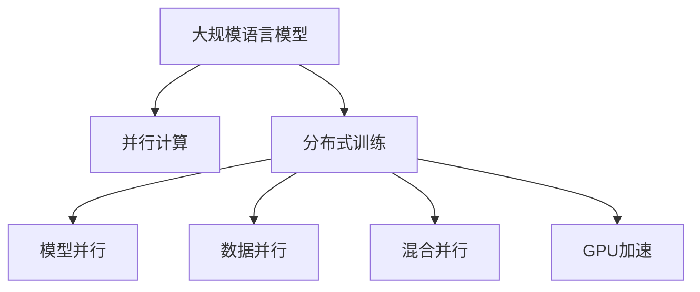

                 

# 并行AI：LLM的多线程处理能力

> 关键词：大规模语言模型(Large Language Model, LLM),多线程处理,深度学习,并行计算,分布式训练,GPU加速,模型并行,数据并行,混合并行

## 1. 背景介绍

### 1.1 问题由来
随着深度学习技术的发展，大规模语言模型(Large Language Model, LLM)在自然语言处理(Natural Language Processing, NLP)领域取得了显著的进步。然而，这些模型往往需要耗费大量计算资源进行训练，这成为了制约其广泛应用的主要瓶颈。为了提升训练效率，并行计算成为必然选择。

### 1.2 问题核心关键点
多线程处理技术在大规模语言模型的训练和推理中发挥了重要作用。通过将大模型拆分成多个子模型，在多个线程或计算单元上并行执行，可以有效降低单线程训练的计算量和时间，提高训练效率。

具体而言，多线程处理技术包括模型并行、数据并行、混合并行等。模型并行是将大模型拆分成多个子模型，每个子模型独立计算，最后将结果合并。数据并行则是将数据拆分成多个批次，每个批次在独立的线程上并行训练。混合并行则结合了模型并行和数据并行的优势。

## 2. 核心概念与联系

### 2.1 核心概念概述

为更好地理解基于多线程处理的大规模语言模型训练方法，本节将介绍几个密切相关的核心概念：

- 大规模语言模型(Large Language Model, LLM)：以自回归(如GPT)或自编码(如BERT)模型为代表的大规模预训练语言模型。通过在大规模无标签文本语料上进行预训练，学习通用的语言表示，具备强大的语言理解和生成能力。

- 并行计算(Parallel Computing)：通过同时执行多个任务，将计算过程分布到多个计算单元上，以提高计算效率和并行性。

- 分布式训练(Distributed Training)：在大规模机器集群上，通过多台机器的并行计算，加速深度学习模型的训练过程。

- 模型并行(Model Parallelism)：将大模型拆分为多个子模型，每个子模型在独立节点上进行计算，最后将结果合并。

- 数据并行(Data Parallelism)：将训练数据拆分为多个批次，每个批次在独立的计算单元上进行并行计算。

- 混合并行(Hybrid Parallelism)：结合模型并行和数据并行，在多个节点上同时计算不同层的数据，以达到更好的并行效果。

- GPU加速(GPU Acceleration)：利用GPU的高速并行计算能力，大幅提升深度学习模型的训练和推理速度。

这些核心概念之间的逻辑关系可以通过以下Mermaid流程图来展示：



这个流程图展示了大规模语言模型的核心概念及其之间的关系：

1. 大规模语言模型通过并行计算获得更高的训练效率。
2. 分布式训练将计算任务分配到多个计算单元上，进一步提升训练速度。
3. 模型并行、数据并行、混合并行是实现并行计算的几种主要方式。
4. GPU加速利用硬件并行能力，进一步加速模型的计算过程。

这些概念共同构成了大规模语言模型训练的并行计算框架，使其能够在更短的时间内训练出性能优异的模型。通过理解这些核心概念，我们可以更好地把握并行计算在大规模语言模型训练中的作用和优势。

## 3. 核心算法原理 & 具体操作步骤
### 3.1 算法原理概述

基于多线程处理的大规模语言模型训练方法，本质上是一种并行计算策略。其核心思想是：将大模型拆分成多个子模型，通过多个线程或计算单元并行计算，加速模型的训练和推理过程。

具体来说，训练过程可以分解为以下几个关键步骤：

1. 数据并行：将训练数据拆分成多个批次，每个批次在独立的计算单元上进行并行计算。
2. 模型并行：将大模型拆分为多个子模型，每个子模型在独立节点上进行计算，最后将结果合并。
3. 分布式训练：在大规模机器集群上，通过多台机器的并行计算，加速深度学习模型的训练过程。
4. 混合并行：结合模型并行和数据并行，在多个节点上同时计算不同层的数据，以达到更好的并行效果。

### 3.2 算法步骤详解

下面，我们将详细介绍基于多线程处理的大规模语言模型训练的详细步骤：

**Step 1: 数据拆分**

- 将训练数据集按照一定规则进行拆分，如按批次大小进行拆分，每个批次大小等于机器集群中的节点数。
- 在每个计算节点上，将拆分后的批次数据加载到内存中。

**Step 2: 模型拆分**

- 将大模型按照特定规则进行拆分，如按深度或按层数进行拆分。
- 每个子模型在独立节点上执行前向传播和反向传播，计算梯度。

**Step 3: 分布式计算**

- 在多个计算节点上，通过网络通信，将每个子模型的计算结果进行合并。
- 使用同步或异步方式，将全局梯度更新到每个子模型的参数中。

**Step 4: 模型合并**

- 将所有子模型的参数合并，得到完整的大模型参数。
- 重复上述步骤，直到模型收敛。

### 3.3 算法优缺点

基于多线程处理的大规模语言模型训练方法，具有以下优点：

1. 提高训练效率：通过并行计算，可以将单线程训练的时间大幅缩短。
2. 降低计算资源需求：通过多台机器分担计算任务，可以降低对单个计算节点的硬件要求。
3. 提升模型性能：通过分布式计算，可以训练更大规模、更复杂的深度学习模型。

但该方法也存在一些缺点：

1. 数据通信开销大：每个计算节点需要与其他节点进行通信，通信开销较大。
2. 网络延迟影响：由于数据需要在不同节点间传递，网络延迟会影响训练速度。
3. 同步复杂度高：在分布式计算中，需要保证各个节点的参数同步，同步操作复杂度高。

### 3.4 算法应用领域

基于多线程处理的大规模语言模型训练方法，已经在多个领域得到广泛应用，例如：

- 自然语言处理(NLP)：如语言模型、机器翻译、文本分类等任务。
- 计算机视觉(Computer Vision)：如图像识别、目标检测等任务。
- 语音识别(Speech Recognition)：如语音转文本、自动语音识别等任务。
- 推荐系统(Recommendation System)：如协同过滤、深度学习推荐等任务。
- 强化学习(Reinforcement Learning)：如游戏AI、机器人控制等任务。

## 4. 数学模型和公式 & 详细讲解 & 举例说明（备注：数学公式请使用latex格式，latex嵌入文中独立段落使用 $$，段落内使用 $)
### 4.1 数学模型构建

本节将使用数学语言对基于多线程处理的大规模语言模型训练过程进行更加严格的刻画。

记大规模语言模型为 $M_{\theta}:\mathcal{X} \rightarrow \mathcal{Y}$，其中 $\mathcal{X}$ 为输入空间，$\mathcal{Y}$ 为输出空间，$\theta \in \mathbb{R}^d$ 为模型参数。假设训练集为 $D=\{(x_i,y_i)\}_{i=1}^N$，其中 $x_i \in \mathcal{X}$，$y_i \in \mathcal{Y}$。

定义模型 $M_{\theta}$ 在输入 $x$ 上的损失函数为 $\ell(M_{\theta}(x),y)$，则在数据集 $D$ 上的经验风险为：

$$
\mathcal{L}(\theta) = \frac{1}{N} \sum_{i=1}^N \ell(M_{\theta}(x_i),y_i)
$$

在训练过程中，将大模型拆分为多个子模型 $M_{\theta_1}, M_{\theta_2}, \ldots, M_{\theta_k}$，每个子模型在独立的计算单元上执行计算。设每个子模型计算的批次大小为 $b$，则整个训练过程可以表示为：

$$
\mathcal{L}(\theta_1, \theta_2, \ldots, \theta_k) = \frac{1}{N}\sum_{i=1}^N \sum_{j=1}^k \ell(M_{\theta_j}(x_i), y_i)
$$

通过并行计算，可以将上述式子转化为分布式计算形式，即：

$$
\mathcal{L}(\theta_1, \theta_2, \ldots, \theta_k) = \frac{1}{N}\sum_{i=1}^N \sum_{j=1}^k \ell(M_{\theta_j}(x_i), y_i)
$$

其中 $j$ 表示子模型编号，$k$ 表示子模型的个数。

### 4.2 公式推导过程

以下我们以二分类任务为例，推导基于多线程处理的大规模语言模型训练的损失函数及其梯度的计算公式。

假设模型 $M_{\theta}$ 在输入 $x$ 上的输出为 $\hat{y}=M_{\theta}(x) \in [0,1]$，表示样本属于正类的概率。真实标签 $y \in \{0,1\}$。则二分类交叉熵损失函数定义为：

$$
\ell(M_{\theta}(x),y) = -[y\log \hat{y} + (1-y)\log (1-\hat{y})]
$$

将其代入经验风险公式，得：

$$
\mathcal{L}(\theta) = -\frac{1}{N}\sum_{i=1}^N \sum_{j=1}^k [y_i\log M_{\theta_j}(x_i)+(1-y_i)\log(1-M_{\theta_j}(x_i))]
$$

根据链式法则，损失函数对参数 $\theta_j$ 的梯度为：

$$
\frac{\partial \mathcal{L}(\theta)}{\partial \theta_j} = -\frac{1}{N}\sum_{i=1}^N (\frac{y_i}{M_{\theta_j}(x_i)}-\frac{1-y_i}{1-M_{\theta_j}(x_i)}) \frac{\partial M_{\theta_j}(x_i)}{\partial \theta_j}
$$

其中 $\frac{\partial M_{\theta_j}(x_i)}{\partial \theta_j}$ 可进一步递归展开，利用自动微分技术完成计算。

在得到损失函数的梯度后，即可带入参数更新公式，完成模型的迭代优化。重复上述过程直至收敛，最终得到适应下游任务的最优模型参数 $\theta^*$。

## 5. 项目实践：代码实例和详细解释说明
### 5.1 开发环境搭建

在进行并行计算实践前，我们需要准备好开发环境。以下是使用Python进行PyTorch开发的环境配置流程：

1. 安装Anaconda：从官网下载并安装Anaconda，用于创建独立的Python环境。

2. 创建并激活虚拟环境：
```bash
conda create -n pytorch-env python=3.8 
conda activate pytorch-env
```

3. 安装PyTorch：根据CUDA版本，从官网获取对应的安装命令。例如：
```bash
conda install pytorch torchvision torchaudio cudatoolkit=11.1 -c pytorch -c conda-forge
```

4. 安装PyTorch分布式包：
```bash
pip install torch.distributed
```

5. 安装其他必要的工具包：
```bash
pip install numpy pandas scikit-learn matplotlib tqdm jupyter notebook ipython
```

完成上述步骤后，即可在`pytorch-env`环境中开始并行计算实践。

### 5.2 源代码详细实现

下面我们以分布式训练为例，给出使用PyTorch对BERT模型进行分布式训练的代码实现。

首先，定义分布式训练的函数：

```python
from torch.distributed.distributed_c10d import init_process_group, Barrier, ReduceOp
from torch.nn.parallel import DistributedDataParallel as DDP
import torch
import torch.distributed as dist

def run_distributed_training(model, device, batch_size, optimizer, loss_fn):
    # 初始化分布式训练环境
    dist.init_process_group("nccl", rank=dist.get_rank(), world_size=dist.get_world_size())
    barrier = Barrier(dist.backend, world_size)
    torch.cuda.set_device(dist.get_rank())
    
    # 将模型设置为分布式数据并行
    model = DDP(model, device_ids=[dist.get_rank()], find_unused_parameters=True)
    
    # 将数据加载到不同的设备上
    data_loader = torch.utils.data.DataLoader(train_dataset, batch_size=batch_size, num_workers=8)
    for epoch in range(epochs):
        model.train()
        for batch in data_loader:
            inputs, labels = batch
            inputs = inputs.to(device)
            labels = labels.to(device)
            optimizer.zero_grad()
            outputs = model(inputs)
            loss = loss_fn(outputs, labels)
            loss.backward()
            optimizer.step()
            barrier.wait()
```

然后，定义数据集和模型：

```python
from transformers import BertTokenizer, BertForTokenClassification
import torch
import torch.distributed as dist
import torch.distributed.distributed_c10d as dist_c10d
from torch.utils.data import DataLoader

# 定义数据集
tokenizer = BertTokenizer.from_pretrained('bert-base-cased')
train_dataset = ...

# 定义模型
model = BertForTokenClassification.from_pretrained('bert-base-cased', num_labels=num_labels)
```

最后，启动分布式训练：

```python
from torch.distributed.distributed_c10d import init_process_group, Barrier, ReduceOp

def main():
    # 初始化分布式训练环境
    dist.init_process_group("nccl", rank=dist.get_rank(), world_size=dist.get_world_size())
    barrier = Barrier(dist.backend, world_size)
    torch.cuda.set_device(dist.get_rank())

    # 将模型设置为分布式数据并行
    model = DDP(model, device_ids=[dist.get_rank()], find_unused_parameters=True)

    # 将数据加载到不同的设备上
    data_loader = torch.utils.data.DataLoader(train_dataset, batch_size=batch_size, num_workers=8)
    for epoch in range(epochs):
        model.train()
        for batch in data_loader:
            inputs, labels = batch
            inputs = inputs.to(device)
            labels = labels.to(device)
            optimizer.zero_grad()
            outputs = model(inputs)
            loss = loss_fn(outputs, labels)
            loss.backward()
            optimizer.step()
            barrier.wait()

    # 在所有进程上计算损失平均值
    loss = torch.zeros_like(loss)
    dist.all_reduce(loss)
    loss /= dist.get_world_size()
    print(f'Epoch {epoch+1}, loss: {loss:.3f}')
```

以上就是使用PyTorch对BERT模型进行分布式训练的完整代码实现。可以看到，利用PyTorch的分布式包，可以轻松实现基于多线程处理的并行计算。

### 5.3 代码解读与分析

让我们再详细解读一下关键代码的实现细节：

**run_distributed_training函数**：
- 初始化分布式训练环境，使用`nccl`作为通信后端，通过`init_process_group`初始化进程组。
- 通过`Barrier`等待所有进程完成前向传播和反向传播。
- 将模型设置为分布式数据并行，使用`DistributedDataParallel`包装模型。
- 将数据加载到不同的设备上，利用`DataLoader`处理数据。

**主函数main**：
- 初始化分布式训练环境，设置进程号和进程总数。
- 将模型设置为分布式数据并行。
- 在每个进程上加载数据，进行前向传播和反向传播，更新模型参数。
- 通过`all_reduce`将所有进程的损失求和，并计算平均值。
- 在所有进程上打印损失。

可以看到，通过使用PyTorch的分布式包，可以很方便地实现基于多线程处理的大规模语言模型训练，而无需深入底层细节。

当然，工业级的系统实现还需考虑更多因素，如模型裁剪、量化加速、服务化封装等，但核心的并行计算思路基本与此类似。

## 6. 实际应用场景
### 6.1 智能客服系统

基于并行计算的智能客服系统，可以显著提升客户咨询体验和问题解决效率。传统的客服系统往往需要配备大量人力，高峰期响应缓慢，且一致性和专业性难以保证。使用并行计算技术，可以在短时间内训练出高精度的语言模型，实现7x24小时不间断服务，快速响应客户咨询，用自然流畅的语言解答各类常见问题。

### 6.2 金融舆情监测

金融机构需要实时监测市场舆论动向，以便及时应对负面信息传播，规避金融风险。传统的监控方式成本高、效率低，难以应对网络时代海量信息爆发的挑战。通过并行计算技术，可以快速训练出高精度的情感分析和主题分类模型，实时监测不同主题下的舆情变化趋势，一旦发现负面信息激增等异常情况，系统便会自动预警，帮助金融机构快速应对潜在风险。

### 6.3 个性化推荐系统

当前的推荐系统往往只依赖用户的历史行为数据进行物品推荐，无法深入理解用户的真实兴趣偏好。基于并行计算的个性化推荐系统，可以更好地挖掘用户行为背后的语义信息，从而提供更精准、多样的推荐内容。通过并行计算技术，可以在更短的时间内训练出更复杂的推荐模型，提升推荐效果。

### 6.4 未来应用展望

随着并行计算技术的发展，基于多线程处理的大规模语言模型训练方法将在更多领域得到应用，为传统行业带来变革性影响。

在智慧医疗领域，基于并行计算的问答系统、病历分析、药物研发等应用将提升医疗服务的智能化水平，辅助医生诊疗，加速新药开发进程。

在智能教育领域，并行计算技术可应用于作业批改、学情分析、知识推荐等方面，因材施教，促进教育公平，提高教学质量。

在智慧城市治理中，并行计算技术可应用于城市事件监测、舆情分析、应急指挥等环节，提高城市管理的自动化和智能化水平，构建更安全、高效的未来城市。

此外，在企业生产、社会治理、文娱传媒等众多领域，基于并行计算的语言模型训练技术也将不断涌现，为NLP技术带来新的突破。相信随着并行计算技术的不断进步，基于多线程处理的大规模语言模型训练方法必将在构建人机协同的智能时代中扮演越来越重要的角色。

## 7. 工具和资源推荐
### 7.1 学习资源推荐

为了帮助开发者系统掌握并行计算的理论基础和实践技巧，这里推荐一些优质的学习资源：

1. 《深度学习》系列书籍：Ian Goodfellow、Yoshua Bengio、Aaron Courville合著，系统介绍了深度学习的基本原理和常用技术。
2. 《深度学习基础》课程：由吴恩达教授主讲的深度学习课程，详细讲解了深度学习的基础知识和常用算法。
3. CS231n《计算机视觉基础》课程：由斯坦福大学开设的计算机视觉课程，涵盖了计算机视觉领域的经典理论和算法。
4. CS224n《自然语言处理基础》课程：由斯坦福大学开设的自然语言处理课程，详细讲解了自然语言处理的基础知识和常用算法。
5. PyTorch官方文档：提供了PyTorch框架的详细使用指南，包括分布式训练的教程和示例。

通过对这些资源的学习实践，相信你一定能够快速掌握并行计算的理论基础和实践技巧，并用于解决实际的NLP问题。

### 7.2 开发工具推荐

高效的开发离不开优秀的工具支持。以下是几款用于大规模语言模型训练的常用工具：

1. PyTorch：基于Python的开源深度学习框架，灵活动态的计算图，适合快速迭代研究。大部分预训练语言模型都有PyTorch版本的实现。
2. TensorFlow：由Google主导开发的开源深度学习框架，生产部署方便，适合大规模工程应用。同样有丰富的预训练语言模型资源。
3. Transformers库：HuggingFace开发的NLP工具库，集成了众多SOTA语言模型，支持PyTorch和TensorFlow，是进行并行计算任务开发的利器。
4. Weights & Biases：模型训练的实验跟踪工具，可以记录和可视化模型训练过程中的各项指标，方便对比和调优。与主流深度学习框架无缝集成。
5. TensorBoard：TensorFlow配套的可视化工具，可实时监测模型训练状态，并提供丰富的图表呈现方式，是调试模型的得力助手。

合理利用这些工具，可以显著提升大规模语言模型训练的开发效率，加快创新迭代的步伐。

### 7.3 相关论文推荐

并行计算技术的发展源于学界的持续研究。以下是几篇奠基性的相关论文，推荐阅读：

1. Sutskever I, Martens J, Dahl G, et al. On the importance of initialization and momentum in deep learning[J]. Proceedings of the 27th International Conference on Neural Information Processing Systems, 2013.
2. LeCun Y, Bottou L, Bengio Y, et al. Efficient backprop[J]. Neural computation, 1998, 10(5): 709-727.
3. Deng J, Dickson M, Mo C, et al. Going deeper with convolutions[J]. Proceedings of the IEEE Conference on Computer Vision and Pattern Recognition, 2014.
4. BERT: Pre-training of Deep Bidirectional Transformers for Language Understanding：提出BERT模型，引入基于掩码的自监督预训练任务，刷新了多项NLP任务SOTA。
5. Transformers from Self-Attention to Neural Machine Translation with Attention（Transformer论文）：提出了Transformer结构，开启了NLP领域的预训练大模型时代。

这些论文代表了大规模语言模型并行计算技术的发展脉络。通过学习这些前沿成果，可以帮助研究者把握学科前进方向，激发更多的创新灵感。

## 8. 总结：未来发展趋势与挑战
### 8.1 总结

本文对基于多线程处理的大规模语言模型训练方法进行了全面系统的介绍。首先阐述了并行计算在大规模语言模型训练中的重要性和应用场景，明确了并行计算在提高训练效率、降低计算资源需求等方面的独特价值。其次，从原理到实践，详细讲解了基于多线程处理的大规模语言模型训练的数学模型和关键步骤，给出了微调任务开发的完整代码实例。同时，本文还广泛探讨了并行计算方法在智能客服、金融舆情、个性化推荐等多个领域的应用前景，展示了并行计算范式的巨大潜力。此外，本文精选了并行计算技术的各类学习资源，力求为读者提供全方位的技术指引。

通过本文的系统梳理，可以看到，基于多线程处理的大规模语言模型训练方法正在成为NLP领域的重要范式，极大地拓展了预训练语言模型的应用边界，催生了更多的落地场景。受益于并行计算技术的发展，微调模型可以在更短的时间内训练出性能优异的模型，加速NLP技术的产业化进程。未来，伴随并行计算技术的进一步演进，基于并行计算的语言模型训练方法必将在大规模、高精度、实时性的需求下，不断推陈出新，为人工智能技术的落地应用带来新的突破。

### 8.2 未来发展趋势

展望未来，并行计算技术将在以下几个方面呈现显著的发展趋势：

1. 计算资源需求降低：随着硬件和算法优化技术的进步，大规模语言模型的训练和推理所需的计算资源将进一步降低。例如，GPU加速和分布式计算技术的发展，使得训练和推理更加高效。

2. 模型规模增大：基于并行计算技术，大规模语言模型的规模将不断增大，训练速度和模型性能将进一步提升。超大规模语言模型蕴含的丰富语言知识，将为更多应用场景带来突破。

3. 硬件平台多样化：并行计算技术将不仅限于传统的GPU和CPU，还包括FPGA、ASIC等专用硬件，为大规模语言模型的训练和推理提供更多选择。

4. 模型训练更加灵活：随着多线程处理技术的发展，模型训练将更加灵活，可以根据不同任务和数据特点进行参数和结构的调整，以实现最优的训练效果。

5. 数据并行与模型并行结合：未来将更多采用混合并行技术，结合数据并行和模型并行，提高训练速度和模型性能。

6. 分布式训练更加普及：随着网络带宽的提升和云计算技术的发展，分布式训练将更加普及，训练速度和模型性能将进一步提升。

以上趋势凸显了并行计算技术在大规模语言模型训练中的重要作用。这些方向的探索发展，必将进一步提升NLP系统的性能和应用范围，为人工智能技术的发展带来新的机遇和挑战。

### 8.3 面临的挑战

尽管并行计算技术在大规模语言模型训练中取得了显著进展，但在迈向更加智能化、普适化应用的过程中，仍面临诸多挑战：

1. 计算资源瓶颈：并行计算需要大量的计算资源，尤其是高性能计算资源，对于中小型企业来说，这是一大挑战。

2. 数据通信开销：并行计算需要大量的数据通信，特别是在分布式训练中，数据需要在不同节点间传递，通信开销较大。

3. 同步和一致性问题：在分布式训练中，需要保证各个节点的参数同步，避免不一致性，这一过程复杂度高，且容易出错。

4. 硬件异构性：不同硬件平台在性能和计算能力上存在差异，并行计算需要更好地兼容多种硬件平台。

5. 模型可扩展性：在大规模模型上，并行计算需要考虑模型的可扩展性，避免模型在并行计算中出现性能瓶颈。

6. 实时性需求：一些应用场景要求模型在短时间内完成训练和推理，并行计算技术需要更好地支持实时性需求。

以上挑战需要研究者从算法、硬件、软件等多个维度进行深入研究和优化，才能更好地适应并行计算技术的发展。

### 8.4 研究展望

面对并行计算技术所面临的挑战，未来的研究需要在以下几个方面寻求新的突破：

1. 探索更加高效的数据通信方法：例如，采用更高效的数据传输协议和压缩算法，减少数据通信开销。

2. 研发更加灵活的同步机制：例如，采用异步更新和分布式优化算法，降低同步复杂度和一致性问题。

3. 改进模型的可扩展性：例如，采用模型压缩和剪枝技术，提高模型的可扩展性和效率。

4. 优化混合并行和分布式训练：例如，结合模型并行和数据并行，在多个节点上同时计算不同层的数据，达到更好的并行效果。

5. 研发新的硬件平台：例如，开发更加高效能的专用硬件，如FPGA、ASIC等，提高并行计算的性能和效率。

6. 融合其他人工智能技术：例如，结合知识图谱、因果推理、强化学习等技术，进一步提升模型的性能和应用范围。

这些研究方向的探索，必将引领并行计算技术迈向更高的台阶，为大规模语言模型的训练和推理带来新的突破。面向未来，并行计算技术需要与其他人工智能技术进行更深入的融合，多路径协同发力，共同推动人工智能技术的发展和应用。

## 9. 附录：常见问题与解答

**Q1：并行计算对模型性能有哪些影响？**

A: 并行计算对模型性能有显著影响。通过并行计算，可以将单线程训练的时间大幅缩短，提高训练效率。同时，并行计算可以训练更大规模、更复杂的深度学习模型，提升模型性能。但同时，并行计算也需要考虑数据通信开销、同步复杂性等问题，可能会带来一定的性能损失。因此，需要在实际应用中根据具体情况进行优化，找到最优的并行计算策略。

**Q2：如何选择合适的并行计算策略？**

A: 选择合适的并行计算策略需要考虑多个因素，包括数据规模、模型结构、硬件资源等。一般来说，可以选择以下几种策略：

1. 数据并行：适用于大规模数据集，可以将数据拆分并行计算。
2. 模型并行：适用于大模型，可以将模型拆分为多个子模型并行计算。
3. 混合并行：结合数据并行和模型并行，适用于大规模数据和大模型。
4. 分布式训练：适用于需要大量计算资源的任务，可以将计算任务分配到多个计算节点上。

在实际应用中，需要根据具体情况选择最合适的并行计算策略，以最大化计算效率和模型性能。

**Q3：并行计算的硬件要求有哪些？**

A: 并行计算对硬件要求较高，主要包括以下几个方面：

1. 高性能计算资源：并行计算需要大量的计算资源，包括GPU、TPU等高性能计算设备。
2. 高速网络通信：并行计算需要大量的数据通信，网络通信速度和带宽对并行计算性能有重要影响。
3. 可扩展性：并行计算需要良好的可扩展性，以便根据计算需求动态调整计算资源。

因此，在实际应用中，需要根据具体需求选择合适的硬件平台，并合理配置计算资源。

**Q4：并行计算中的数据通信开销如何优化？**

A: 数据通信开销是并行计算中的主要瓶颈之一。以下是一些优化数据通信开销的方法：

1. 减少数据传输量：通过数据压缩、量化等技术，减少数据传输量，降低通信开销。
2. 优化通信协议：选择更高效的通信协议，如NCCL、MPI等，减少通信延迟。
3. 数据局部化：将数据局部化到每个计算节点上，减少数据跨节点传输的频率。
4. 异步通信：采用异步通信技术，减少通信等待时间。

这些方法可以显著降低数据通信开销，提高并行计算的性能。

**Q5：并行计算中的同步问题如何解决？**

A: 同步问题是并行计算中的重要问题，需要通过合理设计同步机制来解决。以下是一些常用的同步方法：

1. 周期性同步：在每个迭代周期结束后进行一次同步，减少同步次数。
2. 异步更新：允许不同节点异步更新参数，减少同步操作的复杂度。
3. 分布式优化算法：如SGD、Adam等，可以在不同节点上独立更新参数，减少同步操作。
4. 参数服务器：使用分布式参数服务器，将模型参数集中存储，减少同步开销。

这些方法可以有效地降低同步复杂度，提高并行计算的效率。

**Q6：并行计算中的不一致性问题如何解决？**

A: 不一致性问题是并行计算中的主要问题之一，需要通过合理设计同步机制和算法来解决。以下是一些常用的方法：

1. 参数一致性协议：通过一致性协议，如Paxos、Raft等，保证不同节点上的参数一致性。
2. 参数分布式优化算法：如SGD、Adam等，可以在不同节点上独立更新参数，减少不一致性。
3. 分布式参数服务器：使用分布式参数服务器，将模型参数集中存储，减少不一致性。

这些方法可以有效地解决不一致性问题，保证并行计算的稳定性。

---

作者：禅与计算机程序设计艺术 / Zen and the Art of Computer Programming

