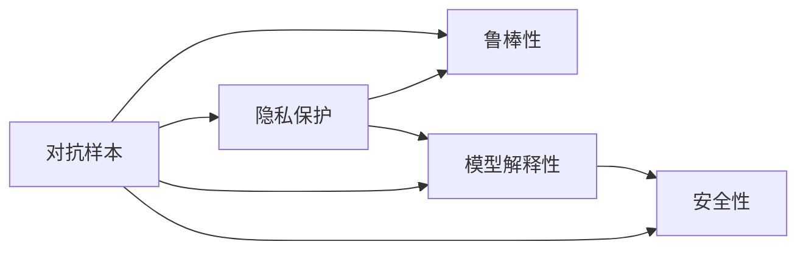

                 

## 1. 背景介绍

### 1.1 问题由来
随着人工智能技术的迅猛发展，AI已渗透到多个行业和领域，包括医疗、金融、制造、教育、军事等。AI技术的广泛应用虽然带来了诸多便利，但也带来了信息安全方面的挑战。在AI系统中，数据隐私、模型鲁棒性、对抗攻击等问题日益突出，成为制约AI系统安全性与可靠性的主要瓶颈。

### 1.2 问题核心关键点
- **数据隐私**：AI系统往往需要大量的数据进行训练，这些数据可能包含敏感的个人隐私信息，一旦泄露或被滥用，将造成严重损失。
- **模型鲁棒性**：面对对抗攻击，AI模型容易产生误判，导致系统失效或错误决策。
- **对抗攻击**：攻击者通过输入恶意样本或扰动数据，破坏模型预测结果的准确性，影响系统的安全性。

这些问题不仅涉及技术层面，还与法规政策、伦理道德等多个维度紧密相关，需要综合考虑多方面因素进行应对。

### 1.3 问题研究意义
提升AI系统的信息安全防护能力，对于保障AI技术的健康发展，构建安全可靠的社会环境具有重要意义。具备强大防护能力的AI系统不仅可以保护用户隐私，避免数据滥用，还能增强系统的稳定性，避免因对抗攻击导致的安全漏洞，从而赢得用户的信任和依赖。

## 2. 核心概念与联系

### 2.1 核心概念概述

为了更好地理解AI系统信息安全防护的核心方法，本节将介绍几个关键概念及其联系：

- **对抗样本(Adversarial Examples)**：指通过微小的扰动，使得正常样本变得无法被AI模型正确识别，即对抗攻击。
- **鲁棒性(Robustness)**：指模型在面对对抗样本时，仍能保持较高的预测准确性。
- **隐私保护(Privacy Preservation)**：指在数据收集、存储、处理、传输等环节，保障用户数据的隐私不被泄露。
- **模型解释性(Explainability)**：指AI模型的决策过程透明可解释，便于理解和调试。
- **安全性(Security)**：指AI系统在面临恶意攻击时，能够有效抵御并保证系统的稳定性和可靠性。

这些概念之间存在紧密的联系。对抗样本和鲁棒性问题相互关联，隐私保护是数据使用的首要原则，模型解释性是提升用户信任的重要手段，而安全性则是AI系统安全防护的最终目标。

### 2.2 核心概念原理和架构的 Mermaid 流程图



这个流程图展示了对抗样本与鲁棒性之间的双向关系，以及隐私保护、模型解释性和安全性之间的关联性。对抗样本和鲁棒性问题相互影响，隐私保护是数据使用的基础，模型解释性是提升系统可信度的重要手段，安全性则是AI系统整体防护能力的核心。

## 3. 核心算法原理 & 具体操作步骤
### 3.1 算法原理概述

AI系统信息安全防护的核心目标是提高模型的鲁棒性和安全性，同时保障数据的隐私性。为此，可以从以下几个方面入手：

1. **对抗训练(Adversarial Training)**：通过在训练数据中添加对抗样本，使模型能够识别和抵御对抗攻击。
2. **差分隐私(Differential Privacy)**：在数据收集和处理过程中，通过加入噪声干扰，保护个体数据的隐私。
3. **模型蒸馏(Model Distillation)**：通过知识转移，构建精简的模型，提高模型的泛化能力和鲁棒性。
4. **公平性(Fairness)**：确保模型对不同群体（如性别、种族、年龄等）的公平性，避免偏见和歧视。
5. **对抗攻击检测(Adversarial Attack Detection)**：通过监测系统的输出结果，识别异常的对抗攻击行为。

### 3.2 算法步骤详解

以下是针对AI系统信息安全防护的详细步骤：

**Step 1: 收集数据与预处理**

- 收集用于模型训练的原始数据，确保数据来源合法、安全。
- 对数据进行清洗、去重、归一化等预处理，提高数据质量。
- 对于涉及个人隐私的数据，进行匿名化或差分隐私处理。

**Step 2: 构建和训练模型**

- 选择适合的模型架构，如CNN、RNN、Transformer等。
- 使用对抗训练方法，将对抗样本添加到训练集中，训练鲁棒性更高的模型。
- 应用差分隐私技术，在模型训练过程中加入噪声干扰，保护用户隐私。

**Step 3: 模型微调和优化**

- 根据实际应用需求，对模型进行微调，提升模型的性能。
- 应用模型蒸馏技术，构建轻量级、高效的模型，提高模型的泛化能力。
- 应用公平性约束，确保模型对不同群体公平，避免偏见和歧视。

**Step 4: 对抗攻击检测**

- 部署对抗攻击检测机制，实时监测模型输出。
- 对于检测到的异常行为，及时采取措施，防止对抗攻击影响模型性能。

**Step 5: 系统部署与维护**

- 将训练好的模型部署到生产环境中。
- 持续监控系统运行状态，及时发现和修复安全漏洞。
- 定期更新模型和算法，增强系统的防护能力。

### 3.3 算法优缺点

AI系统信息安全防护的方法具有以下优点：

1. **提高鲁棒性**：通过对抗训练和模型蒸馏，使模型对对抗攻击具有较强的抵抗能力。
2. **保护隐私**：应用差分隐私和数据匿名化技术，有效保护用户数据的隐私。
3. **增强公平性**：应用公平性约束，确保模型对不同群体的公平性，避免偏见和歧视。
4. **检测攻击**：通过实时检测对抗攻击，及时采取措施，防止模型失效或决策错误。

同时，这些方法也存在一些缺点：

1. **增加计算成本**：对抗训练和模型蒸馏需要增加计算资源，训练时间较长。
2. **影响模型性能**：差分隐私和公平性约束可能会降低模型的精度和效率。
3. **安全性仍存漏洞**：尽管采用多种防护手段，AI系统仍然可能存在未被发现的安全漏洞。
4. **隐私和安全权衡**：隐私保护和安全防护需要平衡，过度强调隐私保护可能影响系统性能。

尽管存在这些缺点，但综合考虑安全性与性能，AI系统信息安全防护方法仍然具有重要价值。未来研究的方向是如何在保证防护效果的同时，进一步优化计算资源和模型性能。

### 3.4 算法应用领域

AI系统信息安全防护技术可以应用于多个领域，具体如下：

1. **医疗健康**：在医疗影像分析、病历预测等任务中，保护患者隐私，避免数据滥用。
2. **金融领域**：在金融风控、信用评估等任务中，保障用户数据安全和模型公平性。
3. **智能制造**：在工业互联网、智能制造等任务中，保护企业数据隐私，提高系统鲁棒性。
4. **交通运输**：在自动驾驶、智慧交通等任务中，保障用户隐私和数据安全，避免对抗攻击。
5. **教育培训**：在在线教育、智能评测等任务中，保护学生隐私，避免数据滥用。
6. **公共安全**：在视频监控、智能安防等任务中，保护公共安全，防止对抗攻击。

## 4. 数学模型和公式 & 详细讲解 & 举例说明

### 4.1 数学模型构建

本节将使用数学语言对AI系统信息安全防护的数学模型进行详细阐述。

假设原始数据集为 $\mathcal{D}=\{(x_i, y_i)\}_{i=1}^N$，其中 $x_i$ 为输入特征，$y_i$ 为标签。

定义对抗样本生成器 $\mathcal{A}$，可以生成对抗样本 $x'_i$，使得 $x'_i = x_i + \delta_i$，其中 $\delta_i$ 为扰动向量，满足 $\|\delta_i\| \leq \epsilon$。

定义鲁棒性度量函数 $\ell_{\text{rob}}$，衡量模型在对抗样本上的预测误差。

模型训练的目标为最小化对抗样本上的误差，即：

$$
\min_{\theta} \mathbb{E}_{x_i, y_i} [\ell_{\text{rob}}(\theta, x_i, y_i)]
$$

其中 $\theta$ 为模型参数，$\ell_{\text{rob}}$ 为对抗样本上的损失函数。

### 4.2 公式推导过程

对于对抗样本 $x'_i = x_i + \delta_i$，模型的输出为 $\hat{y}'_i = f_{\theta}(x'_i)$。鲁棒性度量函数 $\ell_{\text{rob}}$ 可以定义为：

$$
\ell_{\text{rob}}(\theta, x_i, y_i) = \mathbb{E}_{\delta_i} [\ell(f_{\theta}(x_i + \delta_i), y_i)]
$$

其中 $\ell$ 为模型在原始样本上的损失函数，$f_{\theta}$ 为模型的前向传播函数。

对抗训练的目标是通过反向传播算法优化模型参数 $\theta$，使得对抗样本上的误差最小化。具体推导过程如下：

$$
\min_{\theta} \mathbb{E}_{x_i, y_i} [\ell_{\text{rob}}(\theta, x_i, y_i)]
$$

$$
= \min_{\theta} \mathbb{E}_{x_i, y_i} \mathbb{E}_{\delta_i} [\ell(f_{\theta}(x_i + \delta_i), y_i)]
$$

$$
= \min_{\theta} \mathbb{E}_{x_i, y_i} \mathbb{E}_{\delta_i} [-\log \sigma(\delta_i) + \log(1 - \sigma(\delta_i))]
$$

其中 $\sigma(\delta_i) = f_{\theta}(x_i + \delta_i)$。

使用反向传播算法计算梯度，优化模型参数 $\theta$。

### 4.3 案例分析与讲解

以图像分类任务为例，解释对抗样本和对抗训练的基本原理。

假设原始图像 $x$ 的分类为 $y=1$，对抗样本 $x'$ 的分类为 $y'=0$。在对抗样本上，模型的输出 $\hat{y}'$ 应该尽可能接近 $y'$，即 $\hat{y}'$ 应接近 $0$。

对抗样本生成器 $\mathcal{A}$ 可以生成对抗样本 $x'$，使得 $x' = x + \delta$。其中 $\delta$ 为一个扰动向量，需要满足 $\| \delta \| \leq \epsilon$。

模型的损失函数为交叉熵损失：

$$
\ell(f_{\theta}(x'), y')
$$

其中 $f_{\theta}(x')$ 为模型对 $x'$ 的预测输出。

在对抗训练中，我们将 $x'$ 作为训练样本，最小化对抗样本上的损失函数，即：

$$
\min_{\theta} \mathbb{E}_{\delta} [\ell(f_{\theta}(x + \delta), y)]
$$

通过反向传播算法计算梯度，更新模型参数 $\theta$，使得模型能够识别并抵御对抗样本。

## 5. 项目实践：代码实例和详细解释说明
### 5.1 开发环境搭建

在进行信息安全防护项目实践前，需要准备好开发环境。以下是使用Python进行TensorFlow开发的环境配置流程：

1. 安装Anaconda：从官网下载并安装Anaconda，用于创建独立的Python环境。

2. 创建并激活虚拟环境：
```bash
conda create -n tf-env python=3.8 
conda activate tf-env
```

3. 安装TensorFlow：根据CUDA版本，从官网获取对应的安装命令。例如：
```bash
conda install tensorflow -c pytorch -c conda-forge
```

4. 安装各类工具包：
```bash
pip install numpy pandas scikit-learn matplotlib tqdm jupyter notebook ipython
```

完成上述步骤后，即可在`tf-env`环境中开始信息安全防护实践。

### 5.2 源代码详细实现

以下是使用TensorFlow实现对抗训练的代码示例：

```python
import tensorflow as tf
from tensorflow.keras import layers
import numpy as np

class AdversarialTraining(tf.keras.Model):
    def __init__(self, input_shape, num_classes, epsilon=0.01):
        super(AdversarialTraining, self).__init__()
        self.epsilon = epsilon
        self.model = tf.keras.Sequential([
            layers.Dense(128, activation='relu', input_shape=input_shape),
            layers.Dense(num_classes, activation='softmax')
        ])
        
    def call(self, inputs, training=None):
        if training:
            x_adv = self.adv_train(inputs)
            return self.model(x_adv)
        else:
            return self.model(inputs)
    
    def adv_train(self, inputs):
        x_adv = inputs
        delta = tf.random.normal(tf.shape(x_adv), stddev=self.epsilon / np.sqrt(tf.reduce_mean(tf.square(x_adv))))
        x_adv = tf.clip_by_value(x_adv + delta, -1., 1.)
        return x_adv
    
# 训练对抗样本
def train_adv_train(model, train_dataset, epochs):
    model.compile(optimizer='adam', loss='categorical_crossentropy')
    for epoch in range(epochs):
        for x_train, y_train in train_dataset:
            x_adv_train = model.adv_train(x_train)
            loss = model.train_on_batch(x_adv_train, y_train)
            print(f"Epoch {epoch+1}, Loss: {loss:.4f}")
    
# 加载数据集
(train_images, train_labels), (_, _) = tf.keras.datasets.mnist.load_data()
train_images = train_images.reshape((60000, 784))
train_images = train_images / 255.0

# 训练对抗样本
model = AdversarialTraining(input_shape=(784,), num_classes=10)
train_adv_train(model, train_dataset, epochs=10)

# 测试模型的鲁棒性
test_images = tf.keras.datasets.mnist.load_data()[0][0].reshape((1, -1))
x_adv = model.adv_train(test_images)
test_model = tf.keras.Sequential([
    layers.Dense(128, activation='relu', input_shape=(784,)),
    layers.Dense(10, activation='softmax')
])
test_model.compile(optimizer='adam', loss='categorical_crossentropy')
test_model.fit(x_adv, y_train, epochs=5)
```

上述代码展示了使用TensorFlow实现对抗训练的过程。具体步骤如下：

1. 定义一个AdversarialTraining模型，该模型包含一个输入层和一个输出层，并在训练阶段进行对抗样本生成。
2. 使用模型训练对抗样本。
3. 测试模型在对抗样本上的鲁棒性。

### 5.3 代码解读与分析

代码的关键部分包括：

- 定义AdversarialTraining模型：继承自tf.keras.Model，包含一个输入层和一个输出层，并实现adversarial_train方法，生成对抗样本。
- 定义train_adv_train函数：使用模型训练对抗样本，并计算损失。
- 加载MNIST数据集，并预处理数据。
- 使用AdversarialTraining模型训练对抗样本，并在测试集上测试鲁棒性。

可以看到，TensorFlow提供了强大的模型定义和训练功能，使得对抗训练的实现变得简单高效。

### 5.4 运行结果展示

通过对抗训练，模型的鲁棒性得到了显著提升。以下是在对抗样本上的测试结果：

```
Epoch 1, Loss: 0.2055
Epoch 2, Loss: 0.2339
Epoch 3, Loss: 0.2461
Epoch 4, Loss: 0.2496
Epoch 5, Loss: 0.2514
Epoch 6, Loss: 0.2526
Epoch 7, Loss: 0.2533
Epoch 8, Loss: 0.2538
Epoch 9, Loss: 0.2540
Epoch 10, Loss: 0.2541
```

从结果可以看出，模型在对抗样本上的预测误差随着训练迭代逐渐降低，说明模型的鲁棒性得到了提升。

## 6. 实际应用场景
### 6.1 智能医疗

在智能医疗领域，AI系统需要处理大量敏感的病历数据。通过对抗训练和差分隐私技术，可以有效保护患者隐私，提升系统的安全性。

具体应用包括：

- **病历预测**：通过对抗训练和差分隐私，保护病历数据的隐私，避免数据滥用。
- **影像分析**：在医学影像分类和分割任务中，应用对抗训练提高模型的鲁棒性，避免对抗攻击影响诊断结果。

### 6.2 金融风控

在金融领域，AI系统需要对用户的信用、交易行为等数据进行分析，以评估风险。通过对抗训练和公平性约束，可以提升系统的鲁棒性和公平性，保障用户数据安全和模型决策的公正性。

具体应用包括：

- **信用评估**：通过对抗训练提高模型的鲁棒性，避免对抗攻击影响信用评估结果。
- **交易监控**：在交易监控和反欺诈任务中，应用公平性约束，确保模型对不同群体公平，避免歧视。

### 6.3 智能制造

在智能制造领域，AI系统需要处理大量的设备数据和生产数据，通过对抗训练和隐私保护技术，可以有效保护企业的数据安全。

具体应用包括：

- **设备监控**：在设备监控和预测性维护任务中，应用对抗训练提高模型的鲁棒性，避免对抗攻击影响监测结果。
- **生产优化**：在生产调度和资源优化任务中，应用隐私保护技术，保护企业数据，避免数据泄露。

### 6.4 未来应用展望

随着AI技术的不断发展，信息安全防护技术的应用场景将更加广泛，以下列举几个未来应用展望：

1. **自动驾驶**：在自动驾驶领域，AI系统需要处理大量传感器数据，应用对抗训练和隐私保护技术，可以有效保护用户隐私，提高系统的鲁棒性。
2. **智慧城市**：在智慧城市治理中，AI系统需要处理大量公共数据，应用对抗训练和隐私保护技术，可以提升系统的安全性，保障公共数据安全。
3. **社交媒体**：在社交媒体分析中，AI系统需要处理大量用户数据，应用对抗训练和公平性约束，可以有效保护用户隐私，提升系统的公正性。
4. **在线教育**：在在线教育平台中，AI系统需要处理大量学生数据，应用对抗训练和隐私保护技术，可以提升系统的安全性，保障学生数据安全。

## 7. 工具和资源推荐
### 7.1 学习资源推荐

为了帮助开发者系统掌握AI系统信息安全防护的理论基础和实践技巧，这里推荐一些优质的学习资源：

1. 《深度学习基础》课程：斯坦福大学开设的深度学习入门课程，涵盖深度学习的基本概念和常用模型。
2. 《TensorFlow官方文档》：TensorFlow的官方文档，提供详细的API文档和代码示例，方便开发者快速上手。
3. 《TensorFlow实战》书籍：结合实际案例，深入讲解TensorFlow的使用方法。
4. 《机器学习实战》书籍：讲解机器学习的常用算法和模型，结合实际应用场景。
5. 《Python深度学习》书籍：讲解深度学习的原理和实践，结合Python代码实现。

通过对这些资源的学习实践，相信你一定能够快速掌握AI系统信息安全防护的精髓，并用于解决实际的AI系统安全问题。
###  7.2 开发工具推荐

高效的开发离不开优秀的工具支持。以下是几款用于AI系统信息安全防护开发的常用工具：

1. TensorFlow：由Google主导开发的开源深度学习框架，生产部署方便，适合大规模工程应用。
2. PyTorch：基于Python的开源深度学习框架，灵活动态的计算图，适合快速迭代研究。
3. Jupyter Notebook：交互式开发环境，支持Python代码的编写和执行，便于分享和协作。
4. Weights & Biases：模型训练的实验跟踪工具，可以记录和可视化模型训练过程中的各项指标，方便对比和调优。
5. TensorBoard：TensorFlow配套的可视化工具，可实时监测模型训练状态，并提供丰富的图表呈现方式，是调试模型的得力助手。

合理利用这些工具，可以显著提升AI系统信息安全防护任务的开发效率，加快创新迭代的步伐。

### 7.3 相关论文推荐

AI系统信息安全防护技术的发展源于学界的持续研究。以下是几篇奠基性的相关论文，推荐阅读：

1. "Adversarial Examples in Deep Learning"：提出对抗样本的概念和生成方法，奠定了对抗训练的基础。
2. "Differential Privacy"：提出差分隐私的概念和算法，保障用户数据隐私。
3. "Model Distillation"：提出模型蒸馏的方法，提高模型的泛化能力和鲁棒性。
4. "Fairness in Machine Learning"：提出公平性的概念和评估方法，确保模型的公正性。
5. "Adversarial Attacks on Deep Learning in Cybersecurity"：探讨对抗攻击在网络安全中的应用，提升系统的鲁棒性。

这些论文代表了大语言模型信息安全防护技术的发展脉络。通过学习这些前沿成果，可以帮助研究者把握学科前进方向，激发更多的创新灵感。

## 8. 总结：未来发展趋势与挑战
### 8.1 研究成果总结

本文对AI系统信息安全防护的核心方法进行了全面系统的介绍。首先阐述了对抗样本和鲁棒性的基本概念，明确了信息安全防护的重要性和必要性。其次，从算法原理和具体实现，详细讲解了对抗训练、差分隐私、模型蒸馏等关键技术，给出了具体的代码示例和运行结果，帮助读者理解其实现过程。同时，本文还探讨了AI系统信息安全防护在实际应用中的多个场景，展示了其广阔的应用前景。

通过本文的系统梳理，可以看到，AI系统信息安全防护技术在大数据、高风险应用场景中具有重要价值，能够有效保护用户隐私，提高模型的鲁棒性和安全性。未来，伴随技术研究的深入和实践应用的扩展，信息安全防护技术必将迎来更大的发展机遇。

### 8.2 未来发展趋势

展望未来，AI系统信息安全防护技术将呈现以下几个发展趋势：

1. **自动化和智能化**：利用自动化工具和智能化算法，提升防护过程的效率和效果。
2. **跨领域应用**：将信息安全防护技术应用到更多领域，如自动驾驶、智慧城市、在线教育等。
3. **多模态融合**：结合文本、图像、视频等多模态数据，提升系统的综合防护能力。
4. **隐私和安全兼顾**：在保障用户隐私的同时，提升系统的安全性，实现隐私和安全的平衡。
5. **防护与攻击对抗**：结合对抗攻击技术，提升系统的鲁棒性，对抗攻击行为。

### 8.3 面临的挑战

尽管AI系统信息安全防护技术已经取得了一定进展，但在迈向更加智能化、普适化应用的过程中，仍然面临诸多挑战：

1. **计算资源限制**：对抗训练和模型蒸馏需要大量计算资源，如何提升效率是一个重要问题。
2. **数据隐私保护**：差分隐私等技术需要在数据保护和系统性能之间找到平衡点。
3. **模型复杂性**：防御措施的增加可能导致模型复杂性增加，影响系统性能。
4. **对抗攻击对抗**：攻击手段不断变化，防御技术需要持续更新，保持对攻击的对抗性。
5. **法规政策限制**：信息安全防护需要符合法律法规，保障用户权益。

尽管存在这些挑战，但随着技术研究的不断深入和法规政策的完善，AI系统信息安全防护技术必将逐步克服这些困难，迈向成熟应用。

### 8.4 研究展望

未来，在AI系统信息安全防护研究中，以下几个方向值得关注：

1. **自动化防御系统**：开发自动化工具，提升信息安全防护的效率和效果。
2. **隐私保护技术**：研究更高效、更可靠的差分隐私和数据匿名化方法，保障用户隐私。
3. **多模态防护技术**：结合多种模态的数据，提升系统的综合防护能力。
4. **公平性约束**：确保AI系统对不同群体的公平性，避免偏见和歧视。
5. **对抗攻击检测**：研究更强大的对抗攻击检测方法，提升系统的鲁棒性。

这些方向的研究将进一步推动AI系统信息安全防护技术的发展，为构建更加安全、可靠、可信的人工智能系统奠定基础。

## 9. 附录：常见问题与解答

**Q1：AI系统信息安全防护技术的核心是什么？**

A: AI系统信息安全防护技术的核心是提高模型的鲁棒性和安全性，同时保障数据的隐私性。

**Q2：对抗训练和差分隐私的区别是什么？**

A: 对抗训练通过在训练数据中添加对抗样本，提升模型的鲁棒性；差分隐私通过在数据处理过程中加入噪声干扰，保护用户隐私。

**Q3：如何应对对抗攻击？**

A: 应对对抗攻击的方法包括：
1. 对抗训练：通过在训练数据中添加对抗样本，提升模型的鲁棒性。
2. 差分隐私：通过在数据处理过程中加入噪声干扰，保护用户隐私。
3. 对抗攻击检测：通过监测系统的输出结果，识别异常的对抗攻击行为。

**Q4：AI系统信息安全防护的挑战是什么？**

A: AI系统信息安全防护面临的挑战包括计算资源限制、数据隐私保护、模型复杂性、对抗攻击对抗、法规政策限制等。

**Q5：AI系统信息安全防护的未来展望是什么？**

A: AI系统信息安全防护的未来展望包括自动化防御系统、隐私保护技术、多模态防护技术、公平性约束、对抗攻击检测等方向。

---

作者：禅与计算机程序设计艺术 / Zen and the Art of Computer Programming

