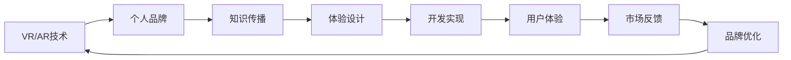

                 

# 开发个人品牌VR/AR体验：创新知识传播方式

> 关键词：虚拟现实,增强现实,个人品牌,知识传播,VR/AR体验设计

## 1. 背景介绍

### 1.1 问题由来
随着数字技术的迅猛发展，VR（虚拟现实）和AR（增强现实）技术正在深刻改变我们的生活方式。在娱乐、教育、医疗、商业等诸多领域，VR/AR应用正展现出广阔的应用前景。特别是在知识传播方面，传统的文本、视频、声音等传播方式正在被更加沉浸式、互动性的VR/AR体验所取代。

对于个人而言，通过开发个性化的VR/AR体验，不仅可以将自身品牌形象立体化、动态化，还能更好地与用户互动，传达知识与信息。VR/AR技术的独特优势在于其能够提供沉浸式的交互体验，使用户在虚拟世界或现实环境中获得身临其境的感受，从而更有效地吸引和保持用户的注意力。

### 1.2 问题核心关键点
开发个人品牌的VR/AR体验，需要综合运用虚拟现实和增强现实技术，创造符合用户需求和品牌定位的互动体验。这涉及到从用户体验设计、交互界面设计、场景构建到内容生产的各个环节。其核心在于：

- **沉浸式体验设计**：如何让用户获得强烈的沉浸感和真实感，减少心理上的距离感。
- **互动性与互动逻辑**：设计高效的互动方式，引导用户自然地与内容进行互动，增强用户的参与感。
- **内容生产与组织**：结合用户需求和品牌特色，产出高质量、富有吸引力的内容，保证内容的相关性和趣味性。
- **技术实现与优化**：选择合适的VR/AR开发工具和引擎，优化性能，确保用户体验的流畅性和稳定性。

### 1.3 问题研究意义
开发个人品牌的VR/AR体验，不仅有助于提升品牌影响力，还能通过新技术开拓新的市场机会。具体意义包括：

- **品牌立体化**：通过沉浸式体验，使品牌形象更加生动、立体，提升用户对品牌的认知和情感。
- **市场拓展**：为品牌开辟新的传播渠道，扩大品牌的覆盖范围和影响力。
- **用户体验优化**：通过个性化、互动化的体验，提升用户的满意度和忠诚度。
- **技术创新**：推动VR/AR技术在内容创作和用户体验设计上的创新，推动行业技术进步。

## 2. 核心概念与联系

### 2.1 核心概念概述

本节将介绍几个核心概念，帮助理解VR/AR体验的开发过程及其间的联系。

- **虚拟现实（Virtual Reality, VR）**：通过计算机生成的仿真环境，使用户能够在虚拟世界中体验感官刺激，通常包括头显、手柄等硬件设备和虚拟环境软件。
- **增强现实（Augmented Reality, AR）**：将虚拟元素叠加在现实世界中，增强用户的现实体验，常用于导航、信息展示等领域。
- **个人品牌（Personal Brand）**：个人在特定领域的独特形象和价值主张，包括个人风格、专业能力和独特观点。
- **知识传播（Knowledge Dissemination）**：通过各种方式将知识、技能或信息传递给他人的过程，目的是提升公众的认知水平。
- **VR/AR体验设计（VR/AR Experience Design）**：结合VR/AR技术和用户需求，设计出符合品牌定位和用户期望的互动体验。

这些概念之间的逻辑关系可以通过以下Mermaid流程图来展示：



这个流程图展示了VR/AR体验从技术到市场反馈的完整过程：

1. VR/AR技术作为基础，为体验设计提供支持。
2. 个人品牌作为体验设计的前提，确保体验的独特性和品牌相关性。
3. 知识传播作为体验内容的载体，传递有价值的信息。
4. 体验设计通过用户体验和交互逻辑，实现技术到内容的转化。
5. 开发实现基于设计，具体构建VR/AR体验。
6. 用户体验关注用户反馈，持续优化体验。
7. 市场反馈用于品牌优化，提升体验效果。

## 3. 核心算法原理 & 具体操作步骤
### 3.1 算法原理概述

开发个人品牌的VR/AR体验，本质上是一个结合VR/AR技术和内容创作的复杂过程。其核心算法原理包括以下几个方面：

- **交互设计算法**：设计用户与虚拟环境之间的交互方式，如手势控制、语音识别等。
- **环境渲染算法**：通过图形渲染技术，生成逼真的虚拟环境，如光照、阴影、反射等。
- **内容生产算法**：结合用户需求和品牌特色，创作高质量的交互内容，如游戏、教育、信息展示等。
- **用户体验优化算法**：通过实时反馈和数据分析，不断调整优化用户体验，提升用户满意度。

### 3.2 算法步骤详解

开发个人品牌的VR/AR体验，一般包括以下关键步骤：

**Step 1: 需求分析和设计规划**
- 确定体验的目标受众、核心功能和品牌特色。
- 设计体验的整体框架，包括界面布局、交互方式等。
- 制定内容生产计划，明确内容的类型、形式和时长。

**Step 2: 技术选型和环境搭建**
- 选择合适的VR/AR开发工具和引擎，如Unity、Unreal Engine等。
- 搭建开发环境，配置硬件设备，如头显、手柄等。
- 选择适合的图形渲染技术，如光追、贴图渲染等。

**Step 3: 交互界面设计**
- 设计用户界面(UI)，确保界面简洁、直观，易于用户操作。
- 设计交互逻辑，如手势控制、语音指令、按钮点击等。
- 实现用户与虚拟环境的互动，如拖动、旋转、触摸等。

**Step 4: 场景构建与内容生产**
- 使用3D建模软件构建虚拟环境，如房屋、城市、自然景观等。
- 根据内容需求，创作相关的交互元素，如场景中的角色、道具、文本等。
- 结合品牌特色，设计高质量的内容，如教学场景、游戏关卡等。

**Step 5: 开发实现与测试优化**
- 使用选定的VR/AR开发工具，将设计转化为代码。
- 进行单元测试、系统测试，确保代码正确性和性能。
- 根据用户体验反馈，持续优化体验设计和技术实现。

**Step 6: 发布部署与用户反馈**
- 将体验部署至市场平台，如Steam、Oculus Store等。
- 收集用户反馈，分析用户行为和满意度。
- 根据反馈优化体验，进行后续迭代。

### 3.3 算法优缺点

开发个人品牌的VR/AR体验，相较于传统方式，具有以下优点：

- **沉浸式体验**：通过虚拟环境，让用户更加深入地理解和感受品牌理念和产品特性。
- **互动性强**：通过交互设计，增强用户参与度，提升用户粘性。
- **创新性高**：通过新技术的应用，打造新颖独特的体验，吸引用户关注。

同时，也存在一些缺点：

- **技术门槛高**：需要具备一定的编程和图形渲染知识，开发难度较大。
- **成本高**：开发和维护VR/AR体验所需的硬件设备和软件工具成本较高。
- **用户体验复杂**：用户需要适应全新的交互方式，可能存在一定的学习曲线。

### 3.4 算法应用领域

VR/AR体验作为一种新型的知识传播方式，在多个领域都有广泛的应用：

- **教育培训**：通过虚拟实验室、互动课程等形式，提升学习效果和参与度。
- **医疗健康**：提供虚拟手术模拟、健康监测等，增强医疗体验和教育效果。
- **旅游观光**：通过虚拟旅游、虚拟导览等方式，让用户足不出户游览世界名景。
- **房地产**：通过虚拟看房、虚拟场景展示等，提升用户体验和销售转化率。
- **娱乐游戏**：开发高质量的VR/AR游戏，提供沉浸式娱乐体验。

## 4. 数学模型和公式 & 详细讲解 & 举例说明

### 4.1 数学模型构建

本节将使用数学语言对开发个人品牌VR/AR体验的算法原理进行更加严格的刻画。

设用户与虚拟环境进行交互的空间为 $\mathcal{X}$，交互行为为 $\mathcal{Y}$，交互结果为 $\mathcal{R}$。体验设计的目标函数为：

$$
\min_{\theta} \mathcal{L}(\theta) = \sum_{(x,y) \in \mathcal{X} \times \mathcal{Y}} ||y - f_\theta(x)||^2
$$

其中，$f_\theta(x)$ 表示交互模型在输入 $x$ 下的输出结果，$\theta$ 为模型参数，$\mathcal{L}(\theta)$ 为损失函数，衡量输出结果与真实结果之间的差距。

### 4.2 公式推导过程

以下我们以手势控制为例，推导手势识别模型的损失函数及其梯度计算公式。

设用户输入的手势图像为 $I$，手势识别模型的输出为 $O$。目标函数定义为：

$$
\mathcal{L}(O, I) = \frac{1}{N} \sum_{i=1}^N [y_i \log \hat{y_i} + (1-y_i) \log (1-\hat{y_i})]
$$

其中 $y_i$ 为手势的真实标签，$\hat{y_i}$ 为模型预测的手势概率，$N$ 为样本数量。

模型参数 $\theta$ 的梯度计算公式为：

$$
\frac{\partial \mathcal{L}(O, I)}{\partial \theta} = \frac{1}{N} \sum_{i=1}^N \frac{\partial \log \hat{y_i}}{\partial \theta} \frac{\partial \hat{y_i}}{\partial I}
$$

其中 $\frac{\partial \log \hat{y_i}}{\partial \theta}$ 为交叉熵损失对模型参数的梯度，$\frac{\partial \hat{y_i}}{\partial I}$ 为模型输出对输入的偏导数，可通过反向传播算法计算。

### 4.3 案例分析与讲解

我们以虚拟教室为例，展示如何设计一个教育场景的VR/AR体验。

**场景构建**：
- 使用3D建模软件创建虚拟教室空间，包括讲台、课桌、白板等。
- 添加虚拟教师模型，使用面部表情、手势等增强互动感。
- 配置虚拟教材、投影仪等教学工具。

**交互设计**：
- 设计手势控制界面，允许用户通过手势操作虚拟白板。
- 实现语音识别功能，用户可语音提问和互动。
- 设计场景切换按钮，用户可自由选择不同的教学内容。

**内容生产**：
- 创建丰富的教学内容，包括视频讲解、动画演示等。
- 设计互动题目，增强学习效果。
- 整合多媒体资源，提供综合性的学习体验。

**开发实现**：
- 使用Unity或Unreal Engine搭建虚拟教室环境。
- 实现手势控制和语音识别算法，如Kinect传感器、Speech-to-Text技术等。
- 集成教育内容，如视频播放器、交互式教材等。

**用户体验优化**：
- 收集用户反馈，分析用户行为和满意度。
- 根据反馈调整优化手势识别算法和交互界面。
- 持续更新教学内容，提升用户体验。

## 5. 项目实践：代码实例和详细解释说明

### 5.1 开发环境搭建

在进行VR/AR体验开发前，需要先准备好开发环境。以下是使用Unity3D进行VR/AR体验开发的流程：

1. 安装Unity3D：从官网下载安装Unity3D，确保安装最新版。

2. 安装VR插件：根据使用的头显设备，安装相应的VR插件，如SteamVR、Oculus SDK等。

3. 配置VR设备：将头显和手柄等设备连接到计算机，并开启Unity3D的VR开发模式。

4. 安装开发工具：安装必要的开发工具，如VS Code、Git等，用于代码编写和管理。

5. 安装渲染引擎：选择适合的图形渲染引擎，如Unity自带的渲染引擎或第三方插件，如Real-Time Rendering Engine等。

完成上述步骤后，即可在Unity3D中进行VR/AR体验的开发。

### 5.2 源代码详细实现

下面我们以虚拟教室为例，展示如何在Unity3D中实现一个基本的VR/AR体验。

**创建场景**：
- 创建一个新场景，添加虚拟教室模型，布置虚拟设备和教学工具。
- 配置光照、阴影等环境参数，确保场景效果逼真。

```csharp
using UnityEngine;
using UnityEngine.XR;

public class VirtualClassroom : MonoBehaviour
{
    public GameObject teacher;
    public GameObject whiteboard;
    
    void Update()
    {
        // 虚拟教师动画
        teacher.transform.Rotate(new Vector3(0, 1, 0) * 5);
        
        // 虚拟白板手势控制
        if (XRInputManager.GetDeviceCount() > 0)
        {
            var hand = XRInputManager.GetActiveHand();
            if (hand && hand.inputSource.TryGetNodePosition(out var position))
            {
                whiteboard.transform.position = position;
            }
        }
    }
}
```

**实现手势控制**：
- 使用Kinect或Oculus SDK，捕捉用户的手势动作。
- 将手势动作映射为虚拟白板的移动和旋转。

```csharp
using UnityEngine;
using UnityEngine.XR.Interaction.Toolkit;

public class GestureController : MonoBehaviour
{
    public GameObject whiteboard;
    private XRHand hand;
    
    void Start()
    {
        hand = GetActiveHand();
    }
    
    void Update()
    {
        if (hand && hand.inputSource.TryGetNodePosition(out var position))
        {
            whiteboard.transform.position = position;
        }
    }
    
    XRHand GetActiveHand()
    {
        if (XRInputManager.GetDeviceCount() > 0)
        {
            return XRInputManager.GetActiveHand();
        }
        return null;
    }
}
```

**集成教育内容**：
- 导入教学视频、动画等资源，使用Unity的视频播放和动画工具进行集成。
- 设计互动题目，使用Unity的交互工具实现用户回答和反馈。

```csharp
using UnityEngine;
using UnityEngine.XR.Interaction.Toolkit;

public class InteractiveQuestion : MonoBehaviour
{
    public GameObject questionText;
    public GameObject answerButton;
    
    void Update()
    {
        if (answerButton && hand && hand.inputSource.TryGetNodePosition(out var position))
        {
            answerButton.transform.position = position;
            if (hand.inputSource.GetPointerData(0).raycast(targets: new RaycastHit[1], hitDistance: 1))
            {
                // 用户点击了正确答案
            }
        }
    }
}
```

**用户体验优化**：
- 通过Unity的Debug模式，实时收集用户反馈，分析用户行为。
- 根据反馈调整优化手势识别和场景交互逻辑。
- 定期更新教育内容，保持体验的新鲜感。

## 6. 实际应用场景

### 6.1 教育培训

虚拟教室技术可以广泛应用于教育培训领域，提供沉浸式、互动性的学习体验。通过虚拟实验、互动课程等形式，提升学习效果和参与度。

在技术实现上，可以整合虚拟教师、互动白板、多媒体资源等，打造一个完整的虚拟学习环境。通过手势控制、语音互动等功能，增强学习的互动性和趣味性，提升学生的学习体验和效果。

### 6.2 医疗健康

虚拟手术室技术可以为医生提供沉浸式的模拟手术环境，帮助医生提升技能和经验。通过虚拟患者、虚拟手术工具等，医生可以在虚拟环境中进行复杂的手术练习，提升手术的成功率和安全性。

在技术实现上，需要结合虚拟现实和增强现实技术，设计逼真的手术场景和交互逻辑。使用手势控制、语音指令等功能，使医生能够自然地与虚拟环境互动，增强手术的模拟效果。

### 6.3 旅游观光

虚拟旅游技术可以为用户提供沉浸式的旅游体验，让用户足不出户游览世界名景。通过虚拟导览、互动讲解等方式，增强用户的旅游体验和知识获取。

在技术实现上，需要结合VR/AR技术，创建逼真的虚拟旅游场景。通过手势控制、语音导航等功能，使用户能够自然地与虚拟环境互动，增强旅游的沉浸感和互动性。

### 6.4 房地产

虚拟看房技术可以为购房者提供沉浸式的房产体验，帮助用户更好地了解房产的布局、环境等细节。通过虚拟房屋、虚拟导览等方式，提升用户的购房体验和决策质量。

在技术实现上，需要结合VR/AR技术，创建逼真的虚拟房产环境。通过手势控制、语音导航等功能，使用户能够自然地与虚拟环境互动，增强房产的展示效果。

### 6.5 未来应用展望

随着VR/AR技术的不断成熟，其在知识传播领域的应用将更加广泛。未来的发展趋势包括：

- **多感官融合**：结合视觉、听觉、触觉等多感官信息，提供更加丰富、真实的体验。
- **跨平台兼容**：支持多平台、多设备的VR/AR体验，增强用户的便捷性和体验一致性。
- **实时交互**：实现更加流畅、自然的实时交互，提升用户体验和互动性。
- **内容创作工具化**：开发更加便捷的内容创作工具，降低VR/AR内容的制作门槛。

## 7. 工具和资源推荐

### 7.1 学习资源推荐

为了帮助开发者系统掌握VR/AR体验的开发技术，这里推荐一些优质的学习资源：

1. Unity官方文档：Unity3D的官方文档，提供全面的技术教程和示例代码。
2. ARKit/ARCore官方文档：苹果和谷歌提供的AR开发文档，涵盖多种AR技术的应用。
3.《虚拟现实编程》书籍：详细介绍虚拟现实技术原理和开发实践，涵盖Unity、C#等工具的使用。
4. Coursera VR/AR课程：涵盖虚拟现实和增强现实技术的入门和进阶课程，适合各层次开发者。
5. ARVR.com论坛：汇集VR/AR开发者和爱好者的技术交流平台，提供丰富的开发资源和工具推荐。

通过对这些资源的学习实践，相信你一定能够快速掌握VR/AR体验的开发技术，并用于解决实际的问题。

### 7.2 开发工具推荐

高效的开发离不开优秀的工具支持。以下是几款用于VR/AR体验开发的常用工具：

1. Unity3D：基于C#的游戏引擎，支持VR/AR开发，提供了丰富的插件和资源库。
2. Unreal Engine：强大的游戏引擎，支持VR/AR开发，提供了高度逼真的渲染效果和灵活的编程能力。
3. Oculus SDK：Oculus平台提供的SDK，支持开发和部署VR/AR应用。
4. SteamVR：Steam平台上支持的VR应用，提供丰富的VR设备和开发工具。
5. Kinect SDK：微软提供的Kinect传感器SDK，支持手势控制和体感交互。

合理利用这些工具，可以显著提升VR/AR体验的开发效率，加快创新迭代的步伐。

### 7.3 相关论文推荐

VR/AR技术的发展源于学界的持续研究。以下是几篇奠基性的相关论文，推荐阅读：

1. "Virtual Reality: A Survey"（《虚拟现实综述》）：一篇全面的VR技术综述，介绍了VR技术的发展历程和关键技术。
2. "Augmented Reality: A Review and Survey of the Literature"（《增强现实综述》）：一篇关于增强现实技术的综述，涵盖了AR技术的发展和应用。
3. "Virtual Classrooms: A Survey"（《虚拟教室综述》）：一篇关于虚拟教室技术的综述，介绍了虚拟教室的应用和关键技术。
4. "VR/AR Education: A Survey and Analysis"（《VR/AR教育综述》）：一篇关于VR/AR教育应用的综述，分析了VR/AR在教育中的潜在价值。
5. "Real-time Interactive Visualization in Virtual Reality"（《实时交互式虚拟现实可视化》）：一篇关于实时交互式VR可视化技术的论文，介绍了关键技术算法。

这些论文代表了大语言模型微调技术的发展脉络。通过学习这些前沿成果，可以帮助研究者把握学科前进方向，激发更多的创新灵感。

## 8. 总结：未来发展趋势与挑战

### 8.1 总结

本文对开发个人品牌VR/AR体验的算法原理和操作步骤进行了全面系统的介绍。首先阐述了VR/AR体验开发的背景和意义，明确了VR/AR体验在品牌传播、教育培训、医疗健康等领域的重要作用。其次，从原理到实践，详细讲解了VR/AR体验开发的关键步骤和核心算法，给出了完整的代码实例。同时，本文还广泛探讨了VR/AR体验在各个领域的应用前景，展示了其广阔的发展空间。最后，本文精选了VR/AR体验开发的学习资源、开发工具和相关论文，力求为读者提供全方位的技术指引。

通过本文的系统梳理，可以看到，开发个人品牌的VR/AR体验，不仅是技术上的挑战，更是一个融合创意与科技的过程。在这个过程中，开发者需要通过不断的实践和创新，结合用户的真实需求和品牌特色，创造出更加沉浸、互动、高效的体验。相信随着VR/AR技术的不断成熟和普及，VR/AR体验将在各个领域得到广泛应用，为知识传播和品牌推广注入新的活力。

### 8.2 未来发展趋势

展望未来，VR/AR体验将呈现以下几个发展趋势：

- **多感官融合**：结合视觉、听觉、触觉等多感官信息，提供更加丰富、真实的体验。
- **跨平台兼容**：支持多平台、多设备的VR/AR体验，增强用户的便捷性和体验一致性。
- **实时交互**：实现更加流畅、自然的实时交互，提升用户体验和互动性。
- **内容创作工具化**：开发更加便捷的内容创作工具，降低VR/AR内容的制作门槛。

以上趋势凸显了VR/AR体验的巨大前景。这些方向的探索发展，必将进一步提升VR/AR体验的质量和用户满意度，为知识传播和品牌推广带来新的机遇。

### 8.3 面临的挑战

尽管VR/AR体验在知识传播领域展现出巨大潜力，但在迈向更加智能化、普适化应用的过程中，仍面临诸多挑战：

- **技术瓶颈**：当前VR/AR技术的渲染性能、计算效率等问题尚未完全解决，限制了体验的普及和优化。
- **设备兼容性**：不同的VR/AR设备和平台需要适配，增加了开发和部署的复杂度。
- **内容创作**：高质量VR/AR内容的制作门槛较高，需要具备较强的3D建模、编程等技能。
- **用户体验**：用户需要适应新的交互方式，存在一定的学习曲线和接受度问题。
- **市场推广**：VR/AR体验的市场推广和用户教育仍需进一步加强。

正视这些挑战，积极应对并寻求突破，将使VR/AR体验技术迈向成熟，为知识传播和品牌推广带来新的发展机遇。

### 8.4 研究展望

面对VR/AR体验所面临的种种挑战，未来的研究需要在以下几个方面寻求新的突破：

- **技术优化**：提高VR/AR技术的渲染性能和计算效率，实现更加流畅、自然的实时交互。
- **平台统一**：开发跨平台、跨设备的VR/AR应用，增强用户体验的一致性和便捷性。
- **内容创作**：降低VR/AR内容的制作门槛，开发易于使用的创作工具，鼓励更多开发者参与。
- **用户体验**：优化交互设计，提升用户的学习曲线和接受度，增强用户体验和满意度。
- **市场推广**：加强市场教育和推广，提升用户对VR/AR体验的认知和接受度。

这些研究方向的探索，必将引领VR/AR体验技术迈向更高的台阶，为知识传播和品牌推广提供更加丰富、便捷、高效的平台和工具。面向未来，VR/AR体验技术还需与其他技术进行更深入的融合，如人工智能、区块链等，共同推动技术的进步和应用的普及。

## 9. 附录：常见问题与解答

**Q1：开发VR/AR体验需要掌握哪些核心技术？**

A: 开发VR/AR体验需要掌握以下核心技术：

- **3D建模与渲染**：掌握3D建模工具和渲染技术，创建逼真的虚拟环境。
- **交互设计**：设计用户与虚拟环境之间的交互方式，如手势控制、语音识别等。
- **虚拟仿真**：使用图形渲染引擎，实现逼真的虚拟环境。
- **数据处理**：处理和分析用户行为数据，优化用户体验。

**Q2：如何在VR/AR体验中实现手势控制？**

A: 实现手势控制的步骤如下：

1. 选择合适的手势识别传感器，如Kinect、Oculus Hand Tracking等。
2. 将传感器数据与虚拟环境进行映射，生成手势动作。
3. 将手势动作转化为虚拟场景中的交互行为，如移动、旋转、缩放等。

**Q3：开发VR/AR体验的难点在哪里？**

A: 开发VR/AR体验的难点主要在于：

- **技术门槛高**：需要掌握3D建模、渲染、编程等技术。
- **设备适配复杂**：不同的VR/AR设备和平台需要适配。
- **用户体验优化**：需要不断调整优化交互设计，提升用户体验。
- **内容创作门槛高**：高质量VR/AR内容的制作门槛较高。

**Q4：VR/AR体验在知识传播中的应用有哪些？**

A: VR/AR体验在知识传播中的应用包括：

- **虚拟教室**：提供沉浸式学习环境，提升学习效果和参与度。
- **虚拟手术室**：为医生提供沉浸式手术模拟环境，提升手术技能和经验。
- **虚拟旅游**：提供沉浸式旅游体验，增强用户旅游的沉浸感和互动性。
- **虚拟房产**：提供沉浸式房产体验，帮助用户更好地了解房产的布局和环境。

**Q5：如何评估VR/AR体验的质量？**

A: 评估VR/AR体验的质量主要从以下几个方面进行：

- **沉浸感**：评估用户是否能够获得强烈的沉浸感和真实感。
- **互动性**：评估用户是否能够自然地与虚拟环境互动，体验是否流畅。
- **内容质量**：评估虚拟场景和内容的真实性、丰富性和趣味性。
- **用户体验**：通过用户反馈和行为数据，评估用户体验的满意度。

通过这些指标的评估，可以不断优化VR/AR体验的质量，提升用户的体验感和满意度。

---

作者：禅与计算机程序设计艺术 / Zen and the Art of Computer Programming

