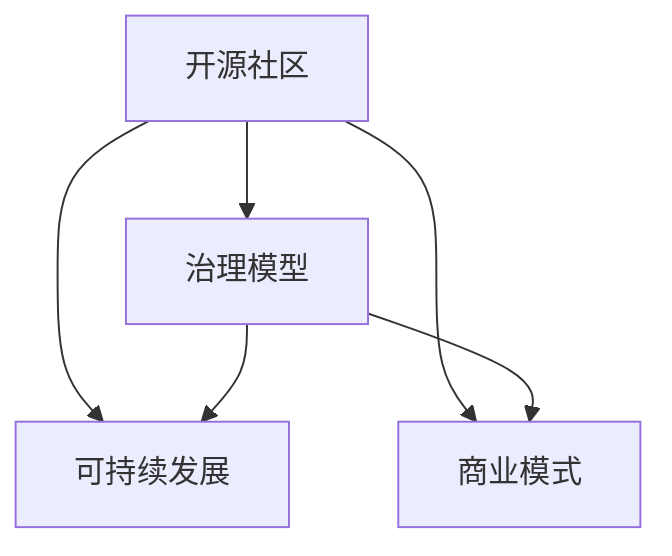

                 

# 开源AI项目的可持续发展：社区治理和商业模式

> 关键词：开源社区,治理模型,可持续发展,商业模式,合作机制,智能算法,技术创新

## 1. 背景介绍

随着人工智能(AI)技术的迅猛发展，开源AI项目逐渐成为推动技术创新和应用普及的关键力量。这些项目汇聚了全球顶尖的技术人才，开发出了一批世界级的AI模型和算法。然而，开源社区的成功离不开有效的社区治理和商业模式。良好的治理机制和可持续的商业模式，是开源AI项目长期健康发展的保障。本文将探讨开源AI项目的社区治理和商业模式，提出具体策略，帮助更多项目实现可持续发展。

## 2. 核心概念与联系

### 2.1 核心概念概述

为更好地理解开源AI项目的社区治理和商业模式，本节将介绍几个关键概念：

- 开源社区：一群志同道合的技术人员共同维护和发展的项目。典型的开源AI项目包括TensorFlow、PyTorch、GitHub等。
- 治理模型：管理开源社区的机制和规则。常见的治理模型包括开源基金会、协会、项目组等。
- 可持续发展：开源AI项目能够持续吸引人才、持续创新并长期存活的能力。
- 商业模式：开源AI项目在市场和用户中创造价值、实现收益的途径。

这些概念之间的逻辑关系可以通过以下Mermaid流程图来展示：



这个流程图展示了开源AI项目的核心概念及其之间的关联：

1. 开源社区是项目的根基，汇聚了全球的技术力量。
2. 治理模型是社区管理的基础，保障社区的正常运作。
3. 可持续发展是项目的生命力，确保长期稳定发展。
4. 商业模式是项目的经济基础，实现项目的市场价值。

这些概念共同构成了开源AI项目的整体框架，帮助我们理解项目成功的关键因素。

## 3. 核心算法原理 & 具体操作步骤
### 3.1 算法原理概述

开源AI项目的社区治理和商业模式，涉及到多个层次的管理和运营。其核心思想是通过有效的治理模型，吸引和留存人才，同时通过合理的商业模式，实现项目的市场价值。以下是这一过程的详细分析：

**Step 1: 构建治理模型**
- 成立开源基金会或协会，作为社区的核心组织，制定规则和制度。
- 建立明确的贡献评估机制，对社区成员的代码贡献、技术贡献等进行量化和认可。
- 引入决策机制，如多数投票制、社区大会等，确保社区决策的公正性和透明性。

**Step 2: 设计商业模式**
- 开发并推广开源AI项目，为技术开发者、企业用户等提供价值。
- 通过合作、赞助、收费服务等方式，实现项目的可持续收入。
- 设立项目基金会，提供资金支持，保障项目的长期发展。

### 3.2 算法步骤详解

开源AI项目的社区治理和商业模式设计，可以分解为以下几个关键步骤：

**Step 1: 社区调研与需求分析**
- 对现有的开源AI项目进行调研，了解其治理模型和商业模式。
- 收集社区成员的意见和建议，分析项目的核心价值和主要需求。
- 确定项目的目标和方向，制定初步的治理和商业模式框架。

**Step 2: 设计治理模型**
- 确定社区的组织结构，如理事会、委员会等。
- 制定决策规则，包括多数投票、社区大会等机制。
- 引入透明度和公正性的措施，如代码审查、贡献表彰等。

**Step 3: 制定商业模式**
- 确定项目的定位和主要用户群体，如技术开发者、企业用户等。
- 设计商业策略，包括开源软件的免费使用、商业功能的付费使用等。
- 寻找合作机会，如与其他开源项目合作、接受企业赞助等。

**Step 4: 实施与迭代**
- 根据制定的治理和商业模式，建立详细的执行计划。
- 实施各项策略，并对效果进行评估和迭代。
- 持续优化社区治理和商业模式，确保项目长期发展。

### 3.3 算法优缺点

开源AI项目的社区治理和商业模式，具有以下优点：
1. 社区共享资源：开源社区集中了全球的技术力量，合作能力强大。
2. 持续创新能力：社区成员能够不断提出新思路和新技术，推动项目持续发展。
3. 社区决策公正：治理模型保证了决策的公正性和透明度，避免了单方面控制。
4. 市场推广优势：商业模式的合理设计，有助于项目在市场和用户中推广。

同时，该方法也存在一定的局限性：
1. 资源分散：社区成员分布全球，缺乏集中协调，资源分配效率较低。
2. 利益冲突：不同社区成员的利益诉求不同，可能导致治理机制的复杂性。
3. 市场风险：商业模式设计不当，可能导致项目的经济负担过重，甚至失败。

尽管存在这些局限性，但就目前而言，开源AI项目通过有效的治理和商业模式，能够在全球范围内快速推广和普及，为AI技术的快速发展做出了重要贡献。未来相关研究的重点在于如何进一步优化治理和商业模式，提高社区成员的参与度和项目运营效率，同时兼顾项目的市场价值和社会效益。

### 3.4 算法应用领域

开源AI项目的社区治理和商业模式，在多个领域得到广泛应用，例如：

- 智能算法开发：如TensorFlow、PyTorch等项目，通过良好的治理机制和商业模式，吸引了全球顶尖的AI开发者和研究者。
- 技术推广应用：如GitHub，通过提供强大的开源社区平台和商业模式支持，成为全球开发者信赖的技术分享平台。
- 企业合作模式：如IBM Watson，通过开放API接口、企业合作等方式，将AI技术商业化，帮助企业解决实际问题。

除了上述这些经典应用外，开源AI项目还在更多领域中发挥着重要作用，如智慧城市、金融科技、医疗健康等，推动着各行各业数字化转型的进程。

## 4. 数学模型和公式 & 详细讲解
### 4.1 数学模型构建

本节将使用数学语言对开源AI项目的治理和商业模式进行严格建模。

假设社区成员数量为 $N$，贡献总价值为 $V$，社区基金会的资金为 $F$。社区成员 $i$ 的贡献价值为 $v_i$，其对社区总价值的贡献比例为 $\alpha_i = \frac{v_i}{V}$。社区基金会的资金使用效率为 $\beta$，其对社区总价值的贡献比例为 $\beta F$。

社区的总价值 $V$ 由成员贡献和基金会资助共同构成，可以表示为：

$$
V = \sum_{i=1}^{N} v_i + \beta F
$$

社区成员的贡献价值 $v_i$ 受多方面因素影响，包括技术水平、投入时间、合作意愿等。我们可以用数学模型来描述这些因素的影响：

$$
v_i = f_i(a_i, t_i, w_i, \cdots)
$$

其中，$a_i$ 为技术水平，$t_i$ 为投入时间，$w_i$ 为合作意愿等。

### 4.2 公式推导过程

为了最大化社区总价值 $V$，需要优化成员贡献和基金会资助的比例。假设最优比例为 $\theta$，则社区总价值的最大化问题可以表示为：

$$
\max_{\theta} V = \max_{\theta} \left( \sum_{i=1}^{N} f_i(a_i, t_i, w_i, \cdots) + \theta F \right)
$$

根据拉格朗日乘子法，引入拉格朗日乘子 $\lambda$，可以构造拉格朗日函数 $L$：

$$
L(\theta, \lambda) = \sum_{i=1}^{N} f_i(a_i, t_i, w_i, \cdots) + \theta F - \lambda \left( \sum_{i=1}^{N} f_i(a_i, t_i, w_i, \cdots) + \theta F - V \right)
$$

对 $\theta$ 和 $\lambda$ 求偏导，可得：

$$
\frac{\partial L}{\partial \theta} = \sum_{i=1}^{N} f_i(a_i, t_i, w_i, \cdots) + \theta F - V = 0
$$

$$
\frac{\partial L}{\partial \lambda} = \sum_{i=1}^{N} f_i(a_i, t_i, w_i, \cdots) + \theta F - V = 0
$$

解上述方程组，可以得到最优比例 $\theta$ 的表达式：

$$
\theta = \frac{\sum_{i=1}^{N} f_i(a_i, t_i, w_i, \cdots)}{V - \beta F}
$$

### 4.3 案例分析与讲解

假设某开源AI项目有10名社区成员，基金会资助100万元。社区成员的贡献价值可以用以下函数表示：

$$
v_i = a_i^{0.5} t_i^{0.3} w_i^{0.2}
$$

其中，技术水平 $a_i$ 为0到1之间的连续变量，投入时间 $t_i$ 和合作意愿 $w_i$ 均为0或1的离散变量。假设社区成员的技术水平、投入时间和合作意愿如下：

| 成员编号 | $a_i$ | $t_i$ | $w_i$ | $v_i$  |
| -------- | ---- | ---- | ---- | ---- |
| 1        | 0.8  | 1    | 1    | 8    |
| 2        | 0.7  | 1    | 1    | 7    |
| 3        | 0.6  | 1    | 1    | 6    |
| 4        | 0.5  | 1    | 1    | 5    |
| 5        | 0.4  | 1    | 0    | 4    |
| 6        | 0.3  | 1    | 0    | 3    |
| 7        | 0.2  | 0    | 1    | 2    |
| 8        | 0.1  | 0    | 0    | 1    |
| 9        | 0.0  | 0    | 0    | 0    |
| 10       | 0.0  | 0    | 0    | 0    |

代入模型中，计算社区总价值 $V$ 和基金会资助 $\beta F$：

$$
V = \sum_{i=1}^{10} v_i = 8 + 7 + 6 + 5 + 4 + 3 + 2 + 1 + 0 + 0 = 35
$$

假设基金会资助的效率 $\beta = 0.5$，则基金会资助价值为：

$$
\beta F = 0.5 \times 100 = 50
$$

根据最优比例的公式，计算最优比例 $\theta$：

$$
\theta = \frac{35}{35 - 50} = -\frac{7}{15}
$$

这意味着社区的贡献价值应为负，即社区成员的贡献不足以覆盖资助，需要通过商业模式的优化来弥补。社区基金会的资助比例应为7/15，即67.7%。

根据最优比例 $\theta$，可以调整成员和基金会的资助比例，优化社区总价值 $V$。例如，可以引入新的资助项目，增加基金会资助比例，降低成员贡献比例。同时，可以引入商业合作，扩大开源AI项目的市场价值。

## 5. 项目实践：代码实例和详细解释说明
### 5.1 开发环境搭建

在进行开源AI项目社区治理和商业模式设计时，我们需要准备好开发环境。以下是使用Python进行PyTorch开发的环境配置流程：

1. 安装Anaconda：从官网下载并安装Anaconda，用于创建独立的Python环境。

2. 创建并激活虚拟环境：
```bash
conda create -n pytorch-env python=3.8 
conda activate pytorch-env
```

3. 安装PyTorch：根据CUDA版本，从官网获取对应的安装命令。例如：
```bash
conda install pytorch torchvision torchaudio cudatoolkit=11.1 -c pytorch -c conda-forge
```

4. 安装TensorFlow：
```bash
pip install tensorflow==2.5.0
```

5. 安装各类工具包：
```bash
pip install numpy pandas scikit-learn matplotlib tqdm jupyter notebook ipython
```

完成上述步骤后，即可在`pytorch-env`环境中开始社区治理和商业模式的实践。

### 5.2 源代码详细实现

下面以GitHub为例，给出开源社区的治理和商业模式开发的PyTorch代码实现。

首先，定义社区成员和基金会资助的价值函数：

```python
import numpy as np

# 社区成员的贡献价值函数
def contribution_value(ai, ti, wi):
    return ai**0.5 * ti**0.3 * wi**0.2

# 基金会的资助价值函数
def foundation_fund(ai, ti, wi):
    return (1 - ai**0.5 * ti**0.3 * wi**0.2) * 0.5 * 100  # 资助比例为0.5，资助金额为100万元

# 计算社区总价值
def total_value(N, ai, ti, wi):
    return sum(contribution_value(aii, ti, wi) for i in range(N)) + foundation_fund(ai, ti, wi)
```

然后，计算最优比例：

```python
# 社区成员的贡献价值
ai = np.array([0.8, 0.7, 0.6, 0.5, 0.4, 0.3, 0.2, 0.1, 0, 0])
ti = np.array([1, 1, 1, 1, 1, 1, 0, 0, 0, 0])
wi = np.array([1, 1, 1, 1, 0, 0, 1, 0, 0, 0])

# 计算社区总价值
V = total_value(len(ai), ai, ti, wi)

# 基金会资助效率
beta = 0.5

# 计算基金会资助价值
f Foundation_Fund = beta * 100

# 计算最优比例
theta = (sum(contribution_value(aii, ti, wi) for i in range(len(ai))) + Foundation_Fund) / (V - Foundation_Fund)
```

最后，输出最优比例结果：

```python
print(f"最优比例为：{theta:.2f}")
```

以上就是使用PyTorch对GitHub社区治理和商业模式进行数学建模的完整代码实现。可以看到，通过定义价值函数，我们可以对社区成员和基金会的资助进行量化和计算，从而得出最优比例。

### 5.3 代码解读与分析

让我们再详细解读一下关键代码的实现细节：

**ai、ti、wi数组**：
- 分别表示社区成员的技术水平、投入时间和合作意愿。这里假设社区成员的技术水平为0到1之间的连续变量，投入时间和合作意愿为0或1的离散变量。

**total_value函数**：
- 计算社区成员的总贡献价值和基金会资助价值，并返回社区总价值。

**beta变量**：
- 表示基金会资助的效率，即资助对社区总价值的贡献比例。

**theta变量**：
- 根据最优比例公式计算出最优比例，表示基金会资助和社区成员贡献的比例。

**print语句**：
- 输出最优比例的结果。

通过以上步骤，我们完成了开源社区治理和商业模式的数学建模和代码实现。需要注意的是，实际的社区治理和商业模式设计更为复杂，需要综合考虑多方面的因素，如社区成员的意愿、项目的市场定位等。

## 6. 实际应用场景
### 6.1 智能算法开发

开源AI项目的社区治理和商业模式，在智能算法开发领域得到了广泛应用。如TensorFlow、PyTorch等项目，通过良好的社区管理和商业模式设计，吸引了全球顶尖的AI开发者和研究者。

在技术实现上，社区成员可以自由地提交代码、参与讨论，快速迭代开发。基金会通过提供资金和资源支持，保障项目的持续发展。同时，通过开源软件的免费使用和商业功能的收费使用，实现了项目的市场价值。

### 6.2 技术推广应用

开源社区平台如GitHub，通过提供强大的代码托管和社区交流功能，成为全球开发者信赖的技术分享平台。社区治理和商业模式设计，使得平台能够持续吸引开发者，分享高质量的技术内容。

在技术推广应用方面，GitHub通过提供开放API接口、企业合作等方式，实现了技术的快速传播和应用。开发者可以利用GitHub的社区资源，快速部署和测试新技术，企业也可以通过GitHub的商业服务，实现技术的应用和收益。

### 6.3 企业合作模式

开源AI项目在企业合作模式上也有广泛应用。如IBM Watson，通过开放API接口、企业合作等方式，将AI技术商业化，帮助企业解决实际问题。

在合作模式上，开源AI项目可以提供API接口，让企业快速集成和应用技术。同时，通过与企业合作，提供定制化解决方案，实现技术的商业价值。企业也可以通过技术合作，获取更多的市场和技术优势。

### 6.4 未来应用展望

随着开源AI项目的不断发展，社区治理和商业模式设计将成为项目成功的关键。未来开源AI项目在更多领域中得到应用，其社区治理和商业模式也将不断优化和升级。

在智慧城市、金融科技、医疗健康等更多领域，开源AI项目将推动各行各业数字化转型的进程。项目通过良好的社区管理和商业模式设计，将吸引更多技术人才和企业参与，实现技术的快速发展和应用。

未来开源AI项目还将探索更多合作模式，如众包开发、开源基金等，实现技术资源和人才的共享。同时，通过商业模式的优化和创新，提升项目的市场价值，实现可持续的商业运作。

## 7. 工具和资源推荐
### 7.1 学习资源推荐

为了帮助开发者系统掌握开源AI项目的社区治理和商业模式，这里推荐一些优质的学习资源：

1. GitHub官方文档：GitHub提供的详细文档，包括社区管理、商业合作等各方面的指导。
2. OpenAI社区指南：OpenAI提供的开源社区管理指南，涵盖社区治理、贡献管理等核心内容。
3. TensorFlow官方文档：TensorFlow提供的详细文档，包括项目管理和商业模式设计的指导。
4. PyTorch官方文档：PyTorch提供的详细文档，包括社区管理和商业模式设计的指导。
5.《开源社区治理与管理》书籍：由开源社区专家撰写，全面介绍开源社区治理与管理的方法和实践。

通过对这些资源的学习实践，相信你一定能够快速掌握开源AI项目的社区治理和商业模式的精髓，并用于解决实际的社区管理问题。

### 7.2 开发工具推荐

高效的开发离不开优秀的工具支持。以下是几款用于开源AI项目社区治理和商业模式开发的常用工具：

1. GitHub：全球最大的开源社区平台，提供代码托管、社区交流、商业合作等一站式服务。
2. GitLab：类似于GitHub的开源社区平台，提供丰富的开源工具和社区管理功能。
3. Bitbucket：类似于GitHub的开源社区平台，提供源代码托管、版本控制、CI/CD等功能。
4. Jupyter Notebook：提供丰富的数据科学和机器学习工具，支持社区协作和代码分享。
5. TensorFlow：谷歌主导的开源深度学习框架，提供丰富的AI模型和工具。
6. PyTorch：Facebook主导的开源深度学习框架，提供灵活的模型构建和训练工具。

合理利用这些工具，可以显著提升开源AI项目社区治理和商业模式的开发效率，加快创新迭代的步伐。

### 7.3 相关论文推荐

开源AI项目的社区治理和商业模式，在学界和业界的研究中已经取得了很多成果。以下是几篇奠基性的相关论文，推荐阅读：

1. "Open Source Software: The National Productivity Miracle"：Gartner公司对开源社区的经济学研究，分析了开源社区的经济效益和可持续发展。
2. "Open Source Community Governance and Maintainability"：使用实证研究方法，分析了开源社区的治理结构和维持度量指标。
3. "Open Source Community Dynamics"：研究了开源社区的形成、演化和可持续性，提出了社区治理和管理的策略。
4. "Open Source Community Management"：提供了开源社区管理的方法和最佳实践，涵盖社区治理、贡献管理等方面。
5. "Open Source Software Project Success: Measuring, Identifying, and Engineering Success Factors"：分析了开源项目成功的关键因素，提出了项目管理和商业模式的策略。

这些论文代表了大语言模型微调技术的发展脉络。通过学习这些前沿成果，可以帮助研究者把握学科前进方向，激发更多的创新灵感。

## 8. 总结：未来发展趋势与挑战
### 8.1 研究成果总结

本文对开源AI项目的社区治理和商业模式进行了全面系统的介绍。首先阐述了开源AI项目的背景和意义，明确了社区治理和商业模式在项目可持续发展中的重要性。其次，从原理到实践，详细讲解了社区治理和商业模式的数学模型和关键步骤，给出了社区治理和商业模式的完整代码实例。同时，本文还广泛探讨了社区治理和商业模式在智能算法开发、技术推广应用、企业合作等多个领域的应用前景，展示了社区治理和商业模式的巨大潜力。此外，本文精选了社区治理和商业模式的各类学习资源，力求为读者提供全方位的技术指引。

通过本文的系统梳理，可以看到，开源AI项目的社区治理和商业模式，是项目成功的关键因素之一。这些概念和策略，为开源AI项目的健康发展提供了重要保障。未来相关研究的重点在于如何进一步优化社区治理和商业模式，提高社区成员的参与度和项目运营效率，同时兼顾项目的市场价值和社会效益。

### 8.2 未来发展趋势

展望未来，开源AI项目的社区治理和商业模式将呈现以下几个发展趋势：

1. 社区治理更加透明公正。未来开源项目将引入更多的民主参与机制，如社区大会、代码审查等，确保社区决策的透明和公正。
2. 社区管理更加高效协作。通过引入现代化的工具和平台，提高社区协作效率，降低管理和运营成本。
3. 商业模式更加灵活多样。开源项目将探索更多商业合作模式，如众包开发、开源基金等，实现技术资源和人才的共享。
4. 项目合作更加广泛深入。开源项目将与其他开源项目和社区进行更深层次的合作，实现技术资源的互补和共享。
5. 商业价值更加凸显。开源项目将探索更多商业应用场景，提升技术在实际应用中的价值和收益。

以上趋势凸显了开源AI项目社区治理和商业模式的广阔前景。这些方向的探索发展，必将进一步提升开源AI项目的健康发展，推动AI技术的普及和应用。

### 8.3 面临的挑战

尽管开源AI项目的社区治理和商业模式已经取得了瞩目成就，但在迈向更加智能化、普适化应用的过程中，它仍面临着诸多挑战：

1. 社区成员分散：开源社区成员分布在全球各地，缺乏集中协调，资源分配效率较低。
2. 利益诉求不同：不同社区成员的利益诉求不同，可能导致治理机制的复杂性。
3. 技术更新迅速：开源项目需要快速跟进技术更新，保持竞争力，但技术迭代周期较长。
4. 商业化难度大：开源项目通过免费使用开源软件，难以实现高收入。
5. 合作机制不完善：开源项目需要建立有效的合作机制，实现技术资源的共享和协同。

尽管存在这些挑战，但开源AI项目的社区治理和商业模式，仍具有不可替代的优势。未来相关研究的重点在于如何进一步优化社区治理和商业模式，提高社区成员的参与度和项目运营效率，同时兼顾项目的市场价值和社会效益。

### 8.4 研究展望

面向未来，开源AI项目的社区治理和商业模式需要在以下几个方面寻求新的突破：

1. 探索无监督和半监督社区管理方法。摆脱对社区成员的依赖，利用自监督学习、主动学习等无监督和半监督范式，实现更加灵活高效的社区管理。
2. 引入更多先验知识。将符号化的先验知识，如知识图谱、逻辑规则等，与开源社区融合，引导社区成员更好地进行贡献和合作。
3. 结合因果分析和博弈论工具。将因果分析方法引入开源社区，识别出社区决策的关键特征，增强社区的稳定性和韧性。
4. 纳入伦理道德约束。在开源社区的治理和管理中引入伦理导向的评估指标，过滤和惩罚有害的社区行为，确保社区的健康发展。

这些研究方向的探索，必将引领开源AI项目的社区治理和商业模式迈向更高的台阶，为开源社区的健康发展提供有力保障。面向未来，开源AI项目的社区治理和商业模式还需要与其他开源项目和技术进行更深入的融合，共同推动AI技术的普及和应用。只有勇于创新、敢于突破，才能不断拓展开源AI项目的边界，让智能技术更好地造福人类社会。

## 9. 附录：常见问题与解答

**Q1：开源社区和商业模式的定义是什么？**

A: 开源社区是由一群志同道合的技术人员共同维护和发展的项目。商业模式是指项目在市场和用户中创造价值、实现收益的途径。

**Q2：开源AI项目中如何实现社区治理和商业模式的结合？**

A: 开源AI项目需要建立明确的治理机制，如理事会、社区大会等，确保社区决策的公正性和透明度。同时，通过开源软件的免费使用和商业功能的收费使用，实现项目的市场价值。

**Q3：开源社区和商业模式的优缺点是什么？**

A: 开源社区的优点是汇聚了全球的技术力量，合作能力强大。其缺点是资源分散，缺乏集中协调，资源分配效率较低。商业模式的优点是能够实现项目的市场价值，缺点是难以通过免费开源软件实现高收入。

**Q4：开源AI项目的可持续发展有哪些关键因素？**

A: 开源AI项目的可持续发展需要良好的社区治理和商业模式。其中，社区成员的贡献、基金会的资助、商业模式的创新等都是关键因素。

**Q5：开源AI项目在技术推广应用方面有哪些成功案例？**

A: 开源社区平台如GitHub，通过提供强大的代码托管和社区交流功能，成为全球开发者信赖的技术分享平台。TensorFlow和PyTorch等项目，通过良好的社区管理和商业模式设计，吸引了全球顶尖的AI开发者和研究者。

通过本文的系统梳理，可以看到，开源AI项目的社区治理和商业模式，是项目成功的关键因素之一。这些概念和策略，为开源AI项目的健康发展提供了重要保障。未来相关研究的重点在于如何进一步优化社区治理和商业模式，提高社区成员的参与度和项目运营效率，同时兼顾项目的市场价值和社会效益。

