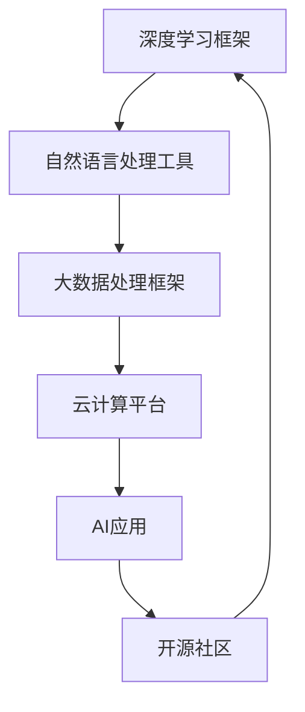

                 

## 1. 背景介绍

人工智能(AI)技术正在以前所未有的速度发展，它已经成为推动全球创新和经济增长的重要引擎。在这一过程中，开源技术起到了不可替代的作用。从深度学习框架到自然语言处理工具，再到云计算基础设施，开源技术为AI研究者和开发者提供了强大的工具和平台，使得AI技术的开发和应用变得更加高效和便捷。

## 2. 核心概念与联系

### 2.1 核心概念概述

开源技术是公共使用和共享的源代码和资源，旨在推动技术的普及和创新。在AI领域，开源技术主要体现在以下几个方面：

- **深度学习框架**：如TensorFlow、PyTorch、Keras等，提供了模型训练、推理、部署的完整生态系统。
- **自然语言处理工具**：如NLTK、spaCy、HuggingFace Transformers等，提供了丰富的预训练模型和语言处理工具。
- **大数据处理框架**：如Apache Spark、Apache Hadoop等，支持大规模数据的分布式处理和分析。
- **云计算平台**：如AWS、Google Cloud、Microsoft Azure等，提供了高效的计算和存储资源，支持AI应用的开发和部署。

这些开源技术通过协作和共享，极大地促进了AI领域的研究和应用，推动了技术的快速迭代和普及。

### 2.2 核心概念原理和架构的 Mermaid 流程图



该流程图展示了开源技术在AI应用中的核心作用和相互关系。深度学习框架提供模型训练的工具，自然语言处理工具提供语言处理的能力，大数据处理框架支持大规模数据的处理，云计算平台提供计算和存储资源，而开源社区则促进了技术共享和协作。

## 3. 核心算法原理 & 具体操作步骤

### 3.1 算法原理概述

开源技术在推动AI进步中的作用，不仅体现在提供了工具和平台，更在于推动了算法原理和操作方法的创新。以下是一些关键算法原理的概述：

- **深度学习**：通过多层次的非线性变换，构建复杂的数据表示。深度学习框架如TensorFlow和PyTorch提供了强大的模型构建和训练工具，支持各种深度学习算法的实现。
- **自然语言处理**：通过语言模型、序列模型、神经网络等方法，实现对自然语言文本的理解和生成。开源工具如NLTK和spaCy提供了丰富的预训练模型和处理方法。
- **计算机视觉**：通过卷积神经网络(CNN)、循环神经网络(RNN)、Transformer等模型，实现对图像和视频数据的分析和理解。开源库如OpenCV和TensorFlow提供了丰富的视觉处理工具。
- **强化学习**：通过与环境交互，学习最优策略以达成特定目标。开源框架如OpenAI Gym和Reinforcement Learning提供了简单易用的环境模拟工具。

### 3.2 算法步骤详解

#### 3.2.1 深度学习算法步骤

1. **数据预处理**：收集和准备训练数据，包括数据清洗、数据增强、数据划分等。
2. **模型构建**：选择合适的深度学习模型，使用框架提供的接口构建模型结构。
3. **模型训练**：使用训练数据集进行模型训练，优化模型参数，提升模型性能。
4. **模型评估**：使用测试数据集评估模型性能，调整模型参数。
5. **模型部署**：将训练好的模型部署到生产环境，进行实际应用。

#### 3.2.2 自然语言处理算法步骤

1. **分词和词性标注**：将文本分解成词汇单元，并标注每个词汇的词性。
2. **句法分析**：分析句子的结构，识别出短语、从句等。
3. **实体识别**：识别出文本中的实体，如人名、地名、组织名等。
4. **语义分析**：理解文本的语义，如情感分析、意图识别等。
5. **机器翻译**：将一种语言的文本翻译成另一种语言的文本。

#### 3.2.3 强化学习算法步骤

1. **环境定义**：定义环境和状态空间，描述环境如何响应模型的动作。
2. **模型选择**：选择合适的强化学习算法，如Q-learning、Policy Gradient等。
3. **模型训练**：使用环境模拟和实际交互数据进行模型训练，优化模型策略。
4. **模型评估**：在测试环境中评估模型的性能，调整策略。
5. **策略优化**：通过多次迭代训练，优化模型策略，提升模型性能。

### 3.3 算法优缺点

开源技术在推动AI进步中的作用既有其优点，也有其局限性：

#### 3.3.1 优点

- **灵活性**：开源技术提供了多种算法和框架，开发者可以根据自己的需求选择合适的工具。
- **可扩展性**：开源技术支持多种硬件和软件环境，可以方便地进行扩展和升级。
- **社区支持**：开源技术有一个庞大的社区，开发者可以在社区中获得支持和帮助。
- **成本效益**：开源技术的免费使用降低了技术开发的成本。

#### 3.3.2 局限性

- **复杂性**：开源技术的复杂性较高，需要开发者具备一定的技术背景。
- **性能瓶颈**：开源技术在处理大规模数据和高并发任务时，可能存在性能瓶颈。
- **版本兼容性**：不同版本的开源技术可能存在兼容性问题，需要开发者进行版本管理和兼容性测试。

## 4. 数学模型和公式 & 详细讲解 & 举例说明

### 4.1 数学模型构建

深度学习模型的构建通常涉及以下几个步骤：

1. **输入层**：将原始数据转换为模型可以处理的向量形式。
2. **隐藏层**：通过多层非线性变换，构建复杂的数据表示。
3. **输出层**：根据任务需求，输出模型的预测结果。

### 4.2 公式推导过程

以深度学习中的卷积神经网络(CNN)为例，其公式推导过程如下：

假设输入图像为 $x = [x_1, x_2, ..., x_n]$，卷积核为 $w = [w_1, w_2, ..., w_m]$，卷积操作后的结果为 $y = [y_1, y_2, ..., y_p]$，其中 $p = n - m + 1$。卷积操作的公式可以表示为：

$$
y_i = \sum_{j=1}^{m} w_j \cdot x_{i-j+1}
$$

其中，$y_i$ 表示卷积操作后的结果，$w_j$ 表示卷积核的权重，$x_{i-j+1}$ 表示输入图像的局部区域。

### 4.3 案例分析与讲解

#### 4.3.1 图像分类案例

假设我们要对一组图像进行分类，使用卷积神经网络进行处理。首先，我们需要定义输入图像的大小和卷积核的大小。然后，使用卷积层对输入图像进行卷积操作，得到一个特征图。接着，使用池化层对特征图进行下采样，减少特征图的大小。最后，使用全连接层对特征图进行分类。

使用开源深度学习框架TensorFlow进行实现，代码如下：

```python
import tensorflow as tf

# 定义输入图像大小和卷积核大小
input_shape = (32, 32, 3)
filter_shape = (3, 3, 3, 32)

# 定义卷积层和池化层
conv = tf.keras.layers.Conv2D(32, filter_shape, activation='relu')
pool = tf.keras.layers.MaxPooling2D(pool_size=(2, 2))

# 定义全连接层和分类层
fc = tf.keras.layers.Flatten()
classifier = tf.keras.layers.Dense(10, activation='softmax')

# 定义模型
model = tf.keras.Sequential([
    conv,
    pool,
    fc,
    classifier
])

# 编译模型
model.compile(optimizer='adam', loss='categorical_crossentropy', metrics=['accuracy'])

# 训练模型
model.fit(train_data, train_labels, epochs=10, validation_data=(val_data, val_labels))
```

## 5. 项目实践：代码实例和详细解释说明

### 5.1 开发环境搭建

为了进行深度学习项目开发，我们需要搭建一个完整的开发环境。以下是一个简单的Python开发环境搭建流程：

1. **安装Python**：从官网下载并安装Python，建议使用3.6及以上版本。
2. **安装pip**：确保pip已经安装，可以通过命令行`python -m pip --version`检查。
3. **安装依赖包**：使用pip安装依赖包，如TensorFlow、Keras、Pandas等。
4. **配置虚拟环境**：使用虚拟环境工具如virtualenv，创建并激活虚拟环境。
5. **设置Git仓库**：将代码存储在Git仓库中，方便版本控制和协作。

### 5.2 源代码详细实现

以下是一个简单的图像分类项目的代码实现，使用TensorFlow和Keras框架：

```python
import tensorflow as tf
import numpy as np
import os
import cv2
import matplotlib.pyplot as plt

# 定义图像大小
img_size = (32, 32, 3)

# 定义类别数
num_classes = 10

# 定义模型结构
model = tf.keras.Sequential([
    tf.keras.layers.Conv2D(32, (3, 3), activation='relu', input_shape=img_size),
    tf.keras.layers.MaxPooling2D((2, 2)),
    tf.keras.layers.Conv2D(64, (3, 3), activation='relu'),
    tf.keras.layers.MaxPooling2D((2, 2)),
    tf.keras.layers.Flatten(),
    tf.keras.layers.Dense(128, activation='relu'),
    tf.keras.layers.Dense(num_classes, activation='softmax')
])

# 编译模型
model.compile(optimizer='adam', loss='categorical_crossentropy', metrics=['accuracy'])

# 加载数据集
train_data = np.load('train_data.npy')
train_labels = np.load('train_labels.npy')
val_data = np.load('val_data.npy')
val_labels = np.load('val_labels.npy')

# 训练模型
model.fit(train_data, train_labels, epochs=10, validation_data=(val_data, val_labels))
```

### 5.3 代码解读与分析

该代码实现了简单的图像分类任务，使用卷积神经网络进行模型训练。代码的关键部分如下：

- **模型结构定义**：使用Sequential模型定义卷积层、池化层、全连接层等，构建完整的模型结构。
- **模型编译**：使用编译函数设置优化器、损失函数和评估指标。
- **数据加载**：使用numpy库加载训练数据和标签，进行模型训练。
- **模型训练**：使用fit函数进行模型训练，设置训练轮数和验证集。

### 5.4 运行结果展示

该代码运行后，可以在终端看到训练过程的输出，如训练轮数、损失函数值、准确率等。训练完成后，可以使用模型对新的测试数据进行分类预测，评估模型性能。

## 6. 实际应用场景

开源技术在推动AI进步中的作用，不仅体现在理论研究和模型训练中，更在于实际应用中的广泛应用。以下列举了几个实际应用场景：

### 6.1 图像识别

图像识别是深度学习领域的一个重要应用，广泛应用于安防、医疗、自动驾驶等领域。开源深度学习框架如TensorFlow、PyTorch、Keras等提供了丰富的图像处理和识别工具，使得图像识别技术的应用更加便捷。

### 6.2 自然语言处理

自然语言处理(NLP)技术可以帮助机器理解、处理和生成自然语言文本。开源工具如NLTK、spaCy、HuggingFace Transformers等提供了丰富的NLP处理工具，使得NLP技术的应用更加广泛。

### 6.3 智能推荐

智能推荐系统可以根据用户的历史行为和偏好，推荐个性化的商品或内容。开源推荐系统如OpenRec、TensorRec等提供了丰富的推荐算法和实现，使得智能推荐技术的应用更加高效。

### 6.4 机器翻译

机器翻译技术可以将一种语言的文本翻译成另一种语言的文本。开源机器翻译工具如OpenNMT、Marian等提供了丰富的翻译算法和实现，使得机器翻译技术的应用更加便捷。

### 6.5 自动化生成

自动化生成技术可以根据用户输入的文本或数据，自动生成新的文本或数据。开源生成模型如GPT、XLNet等提供了丰富的生成算法和实现，使得自动化生成技术的应用更加广泛。

## 7. 工具和资源推荐

### 7.1 学习资源推荐

以下是一些学习开源技术的推荐资源：

1. **深度学习框架文档**：如TensorFlow、PyTorch、Keras的官方文档，提供了详细的API和使用指南。
2. **在线课程**：如Coursera上的深度学习课程、Udacity上的机器学习课程，提供了系统化的学习路径。
3. **开源社区**：如GitHub、Stack Overflow等，提供了丰富的开源项目和学习资源。
4. **书籍**：如《深度学习》、《TensorFlow实战》、《自然语言处理入门》等，提供了深入的理论和实践指导。

### 7.2 开发工具推荐

以下是一些常用的开发工具：

1. **IDE**：如PyCharm、Visual Studio Code等，提供了丰富的开发环境和插件。
2. **版本控制**：如Git、SVN等，提供了版本控制和协作功能。
3. **数据处理工具**：如Pandas、NumPy等，提供了高效的数据处理和分析能力。
4. **可视化工具**：如Matplotlib、Seaborn等，提供了数据可视化和分析功能。

### 7.3 相关论文推荐

以下是一些重要的开源技术相关论文：

1. **深度学习框架**：如《TensorFlow: A System for Large-Scale Machine Learning》、《Keras: Deep Learning for Humans》等。
2. **自然语言处理**：如《Attention is All You Need》、《BERT: Pre-training of Deep Bidirectional Transformers for Language Understanding》等。
3. **计算机视觉**：如《Deep Residual Learning for Image Recognition》、《Faster R-CNN: Towards Real-Time Object Detection with Region Proposal Networks》等。
4. **强化学习**：如《Human Level Control Through Deep Reinforcement Learning》、《Deep Q-Learning with Human-Level Performance》等。

## 8. 总结：未来发展趋势与挑战

### 8.1 总结

开源技术在推动AI进步中起到了不可替代的作用。通过提供强大的工具和平台，开源技术推动了深度学习、自然语言处理、计算机视觉、强化学习等领域的快速发展，推动了AI技术的应用和普及。未来，开源技术将进一步推动AI技术的创新和应用，为人类社会带来更多的变革和机遇。

### 8.2 未来发展趋势

开源技术在推动AI进步中，未来将呈现以下几个趋势：

1. **更加开放和协作**：开源社区将进一步开放和协作，推动技术的共享和创新。
2. **更高效和便捷**：开源技术将进一步提升开发和应用的效率，降低使用门槛。
3. **更广泛和深入**：开源技术将广泛应用于更多领域，推动技术在各个行业的应用。
4. **更智能和自主**：开源技术将进一步提升AI系统的智能化水平，实现自主学习和决策。
5. **更安全和可控**：开源技术将进一步提升系统的安全性和可控性，保障应用的安全和可靠。

### 8.3 面临的挑战

尽管开源技术在推动AI进步中取得了巨大的成功，但也面临着一些挑战：

1. **性能瓶颈**：开源技术在高性能计算和大规模数据处理方面，可能存在性能瓶颈。
2. **安全性问题**：开源技术在共享和协作中，可能面临安全性和隐私问题。
3. **知识产权争议**：开源技术的知识产权问题，可能会引发争议和法律纠纷。
4. **版本兼容性**：不同版本的开源技术可能存在兼容性问题，需要开发者进行版本管理和兼容性测试。
5. **商业化挑战**：开源技术在商业化应用中，可能面临收益和成本的平衡问题。

### 8.4 研究展望

未来，开源技术在推动AI进步中，需要重点关注以下几个方面：

1. **提升性能和效率**：通过优化算法和架构，提升开源技术的性能和效率。
2. **增强安全性和隐私保护**：建立安全机制和隐私保护措施，保障系统的安全性和隐私。
3. **解决版本兼容性问题**：开发兼容性解决方案，简化不同版本之间的转换和使用。
4. **推动商业化应用**：通过商业模式创新，推动开源技术的商业化应用和推广。
5. **拓展应用场景**：将开源技术应用于更多领域，推动技术在各个行业的应用。

## 9. 附录：常见问题与解答

**Q1: 开源技术在推动AI进步中主要体现在哪些方面？**

A: 开源技术在推动AI进步中主要体现在以下几个方面：
1. **提供了强大的工具和平台**：如深度学习框架、自然语言处理工具等，使得AI技术的开发和应用变得更加高效和便捷。
2. **推动了算法原理和操作方法的创新**：如深度学习、自然语言处理、计算机视觉、强化学习等领域的算法创新。
3. **促进了技术的共享和协作**：通过开源社区的协作，推动技术的共享和创新。
4. **降低了技术开发的成本**：开源技术的免费使用降低了技术开发的成本。

**Q2: 开源技术在AI应用中面临哪些挑战？**

A: 开源技术在AI应用中面临以下几个挑战：
1. **性能瓶颈**：在高性能计算和大规模数据处理方面，可能存在性能瓶颈。
2. **安全性问题**：在共享和协作中，可能面临安全性和隐私问题。
3. **版本兼容性**：不同版本的开源技术可能存在兼容性问题，需要开发者进行版本管理和兼容性测试。
4. **商业化挑战**：在商业化应用中，可能面临收益和成本的平衡问题。
5. **知识产权争议**：开源技术的知识产权问题，可能会引发争议和法律纠纷。

**Q3: 未来开源技术的发展趋势是什么？**

A: 未来开源技术的发展趋势包括以下几个方面：
1. **更加开放和协作**：开源社区将进一步开放和协作，推动技术的共享和创新。
2. **更高效和便捷**：开源技术将进一步提升开发和应用的效率，降低使用门槛。
3. **更广泛和深入**：开源技术将广泛应用于更多领域，推动技术在各个行业的应用。
4. **更智能和自主**：开源技术将进一步提升AI系统的智能化水平，实现自主学习和决策。
5. **更安全和可控**：开源技术将进一步提升系统的安全性和可控性，保障应用的安全和可靠。

**Q4: 开源技术在AI应用中如何解决版本兼容性问题？**

A: 开源技术在AI应用中解决版本兼容性问题，可以采取以下几个措施：
1. **版本控制工具**：使用版本控制工具如Git、SVN等，进行版本管理和协作。
2. **兼容性测试**：进行兼容性测试，确保不同版本之间的接口和功能兼容。
3. **兼容性库**：开发兼容性库或工具，简化不同版本之间的转换和使用。
4. **文档和文档工具**：提供详细的文档和使用指南，帮助开发者了解不同版本的功能和用法。

**Q5: 开源技术在推动AI进步中未来需要重点关注哪些方面？**

A: 开源技术在推动AI进步中未来需要重点关注以下几个方面：
1. **提升性能和效率**：通过优化算法和架构，提升开源技术的性能和效率。
2. **增强安全性和隐私保护**：建立安全机制和隐私保护措施，保障系统的安全性和隐私。
3. **解决版本兼容性问题**：开发兼容性解决方案，简化不同版本之间的转换和使用。
4. **推动商业化应用**：通过商业模式创新，推动开源技术的商业化应用和推广。
5. **拓展应用场景**：将开源技术应用于更多领域，推动技术在各个行业的应用。

---

作者：禅与计算机程序设计艺术 / Zen and the Art of Computer Programming

