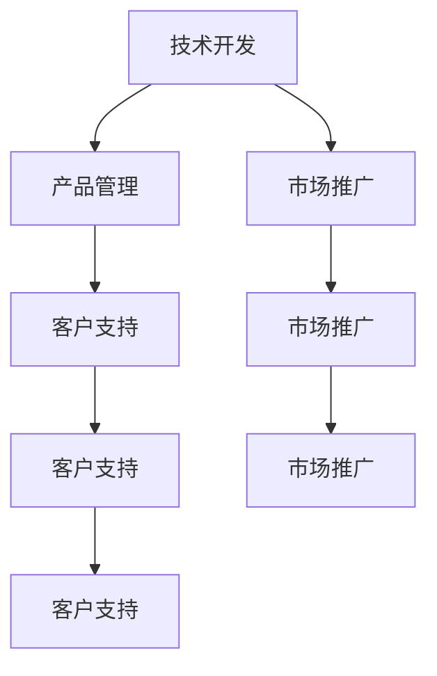

                 

# 开源项目的商业化团队构建：角色与职责

> 关键词：开源项目,商业化团队,团队构建,角色职责,技术开发,项目管理,运营维护,产品管理,市场推广,市场营销,客户支持,技术培训,业务合作

## 1. 背景介绍

在当前激烈的市场竞争中，企业开源项目的商业化速度成为竞争优势的重要体现。无论是在技术研发、产品迭代，还是在市场拓展、客户服务等方面，商业化团队都在其中发挥着关键作用。一个高效、协同、具有前瞻性的商业化团队能够帮助企业迅速实现技术转化为现实价值，提升企业竞争力。

开源项目的商业化涉及技术开发、产品管理、市场推广、客户支持等多个环节，需要各团队紧密协作，形成闭环。因此，构建一个具有明确角色和职责的商业化团队成为实现开源项目商业化的关键。本文将系统介绍商业化团队的构建思路，并详细阐述不同角色的具体职责，以期为企业提供全面、实用的开源项目商业化指导。

## 2. 核心概念与联系

### 2.1 核心概念概述

开源项目商业化是指将开源项目从社区驱动的开发模式，转换为具有商业价值的应用和服务，从而实现商业变现的过程。这一过程包括但不限于技术开发、产品管理、市场推广、客户支持等多个环节，需要跨团队、跨部门的紧密协作。

- 技术开发：负责从项目立项、需求分析、代码开发、测试部署到版本维护等全生命周期的技术工作。
- 产品管理：负责从市场调研、需求收集、产品规划、设计评审到迭代迭代升级的产品管理过程。
- 市场推广：负责从市场调研、品牌打造、内容营销到用户获取、市场扩展的市场推广工作。
- 客户支持：负责从客户反馈收集、问题分析、解决方案提供到培训手册编写、知识库建设的客户支持工作。

这些核心概念之间的逻辑关系可以通过以下Mermaid流程图来展示：



这个流程图展示了技术开发、产品管理、市场推广和客户支持等核心概念之间的协作关系。

## 3. 核心算法原理 & 具体操作步骤

### 3.1 算法原理概述

开源项目的商业化过程中，通常涉及以下核心算法原理：

- 数据驱动的决策：通过数据分析和市场调研，找到开源项目的商业化机会点，制定相应的推广策略。
- 敏捷开发和迭代：通过敏捷开发方法，快速响应市场需求，快速迭代产品功能，提升用户体验和满意度。
- 市场营销策略：利用数字营销、内容营销等策略，提升开源项目的品牌知名度和市场份额。
- 客户关系管理：通过客户反馈和支持策略，提升用户满意度和忠诚度，促进二次销售和口碑传播。

### 3.2 算法步骤详解

开源项目商业化的大致流程如下：

**Step 1: 项目立项**
- 根据市场需求调研，确定商业化项目方向。
- 制定项目目标和里程碑计划。

**Step 2: 技术开发**
- 设计产品架构和技术栈。
- 实施代码开发、测试、部署和版本管理。

**Step 3: 产品管理**
- 收集用户需求和反馈。
- 设计产品功能，进行原型设计和评审。
- 迭代升级产品版本，提升用户体验。

**Step 4: 市场推广**
- 制定市场营销策略，包括数字营销、内容营销等。
- 通过SEO、SEM、社交媒体等渠道提升项目知名度。
- 举办线上线下活动，促进用户获取和市场扩展。

**Step 5: 客户支持**
- 收集用户反馈和问题，分析常见问题和解决方案。
- 编写技术文档和培训材料，建立知识库。
- 提供客户支持和售后服务，提升用户满意度。

### 3.3 算法优缺点

开源项目商业化团队的优点：
1. 充分利用开源社区资源，降低研发成本。
2. 快速迭代和响应市场需求，提升市场竞争力。
3. 提供全面且高效的产品和客户支持，提升用户体验和满意度。

缺点包括：
1. 开源项目的特性和商业化目标存在潜在冲突，管理难度较大。
2. 商业化团队需要具备跨领域知识和技能，人才储备和培养难度较大。
3. 商业化过程中的资源调配和利益分配需要细致考虑，团队内部协作难度较大。

### 3.4 算法应用领域

开源项目商业化团队通常应用于以下几个领域：

- 软件工具开发：如开源数据库、操作系统等。
- 数据科学和机器学习：如开源数据分析工具、机器学习框架等。
- 互联网服务：如开源云平台、网络安全解决方案等。

这些领域的应用场景需要不同的商业化策略和技术手段，商业化团队需具备相应的专业知识和技能。

## 4. 数学模型和公式 & 详细讲解 & 举例说明

### 4.1 数学模型构建

商业化团队的工作可以抽象为以下几个数学模型：

- 用户满意度模型：描述用户对产品的满意度，一般用平均满意度评分衡量。
- 市场份额模型：描述产品在市场中的占有率，一般用用户数和收入占比衡量。
- 增长模型：描述用户增长和收入增长的关系，一般用泊松分布或几何增长模型等。
- 资源配置模型：描述不同团队和资源在项目中投入的优化分配，一般用线性规划或整数规划模型等。

### 4.2 公式推导过程

以用户满意度模型为例，假设用户满意度评分服从正态分布 $N(\mu,\sigma^2)$，其中 $\mu$ 为平均满意度，$\sigma$ 为标准差。则用户满意度的期望为 $\mu$，方差为 $\sigma^2$。用户满意度的数学期望和方差可以表示为：

$$
E[\text{用户满意度}] = \mu
$$

$$
\text{Var}[\text{用户满意度}] = \sigma^2
$$

通过市场调研和数据分析，可以估计 $\mu$ 和 $\sigma$ 的值。

### 4.3 案例分析与讲解

某开源数据库项目在商业化过程中，通过用户满意度调查，发现用户对性能和易用性的满意度最高，对文档和社区支持满意度最低。项目团队根据用户反馈，优化了性能和易用性功能，编写了详细的文档和操作指南，并建立了线上支持渠道，显著提升了用户满意度。

## 5. 项目实践：代码实例和详细解释说明

### 5.1 开发环境搭建

为了进行开源项目商业化开发，需要搭建以下开发环境：

1. 选择合适的编程语言和框架，如Python、Java、React等。
2. 安装相关的开发工具，如Git、JDK、npm等。
3. 搭建开发服务器，配置好开发环境。
4. 搭建测试环境，用于进行单元测试和集成测试。

### 5.2 源代码详细实现

以下是一个简单的开源项目商业化团队的代码实现示例，具体包括技术开发、产品管理、市场推广和客户支持的模块代码：

```python
class Team:
    def __init__(self, team_name):
        self.team_name = team_name
        self.members = []
    
    def add_member(self, member):
        self.members.append(member)
    
    def remove_member(self, member):
        self.members.remove(member)
    
    def get_members(self):
        return self.members

class Member:
    def __init__(self, name, role):
        self.name = name
        self.role = role
    
    def get_name(self):
        return self.name
    
    def get_role(self):
        return self.role

# 构建团队
team = Team('商业化团队')

# 添加成员
team.add_member(Member('张三', '技术开发'))
team.add_member(Member('李四', '产品管理'))
team.add_member(Member('王五', '市场推广'))
team.add_member(Member('赵六', '客户支持'))

# 获取成员
print(team.get_members())
```

### 5.3 代码解读与分析

代码示例中，通过定义 `Team` 和 `Member` 类，实现了开源项目商业化团队的构建和管理。该代码实现了基本的团队成员添加、移除和查询功能。在实际应用中，还可以进一步扩展团队管理功能，如角色分配、任务分配等。

## 6. 实际应用场景

### 6.1 软件工具开发

以数据库商业化为例，开源数据库项目通过不断优化性能和易用性，提升用户满意度。同时，通过发布白皮书、用户手册、技术支持等手段，提升用户粘性和市场份额。

### 6.2 数据科学和机器学习

开源机器学习框架如TensorFlow、PyTorch等，通过提供丰富的API和工具包，帮助企业快速构建AI应用。同时，通过举办线上线下技术研讨会、提供企业级服务，加速产品市场推广。

### 6.3 互联网服务

开源云平台如Kubernetes、OpenStack等，通过提供高性能、高可靠的服务，帮助企业构建自己的云基础设施。同时，通过提供培训、认证、社区支持等，提升用户满意度和忠诚度。

### 6.4 未来应用展望

随着开源项目商业化需求的不断增加，未来商业化团队在以下几个方面将面临新的挑战和机遇：

1. 数据驱动决策的深度应用：通过数据分析和预测模型，实现更精准的商业化决策。
2. 跨领域协作的增强：随着技术栈的不断扩展，商业化团队需具备更广泛的跨领域知识和技能。
3. 客户体验的全面提升：通过个性化推荐、用户体验设计等手段，提升用户满意度和忠诚度。
4. 开源与商业化的平衡：找到开源与商业化的最佳平衡点，实现共赢发展。

## 7. 工具和资源推荐

### 7.1 学习资源推荐

1. GitHub：开源项目的协作和代码托管平台，提供大量优秀的开源项目和社区资源。
2. GitLab：开源项目的协作和代码托管平台，提供CI/CD和容器化支持。
3. Docker：容器化工具，便于构建和部署应用。
4. JIRA：项目管理工具，提供任务分配、进度跟踪和报告功能。
5. Slack：团队协作工具，提供即时通讯和文件共享功能。

### 7.2 开发工具推荐

1. PyTorch：开源机器学习框架，提供丰富的API和工具包。
2. TensorFlow：开源机器学习框架，支持分布式计算和优化。
3. React：开源前端框架，支持构建交互式Web应用。
4. Docker：容器化工具，便于构建和部署应用。
5. Kubernetes：开源容器编排平台，支持自动部署、扩展和监控。

### 7.3 相关论文推荐

1. "Managing Software Products: A Systematic Approach" by Erich Gamma, Richard Helm, Ralph Johnson, and John Vlissides。
2. "Open Source Software: The Key to Success" by Martin Fowler。
3. "The State of Open Source" by OWASP。
4. "The Open Source Traction Playbook" by Crystal Outsourcing。

## 8. 总结：未来发展趋势与挑战

### 8.1 研究成果总结

本文对开源项目商业化团队构建进行了全面系统的介绍，包括商业化团队的构建思路、各角色的职责描述、实际应用场景等。通过案例分析和技术解读，展示了开源项目商业化团队的关键作用和实际价值。

### 8.2 未来发展趋势

未来，开源项目商业化团队将面临以下几个发展趋势：

1. 数据驱动决策：通过大数据分析和预测模型，提升商业化决策的准确性和前瞻性。
2. 跨领域协作：随着技术栈的不断扩展，商业化团队需具备更广泛的跨领域知识和技能。
3. 客户体验优化：通过个性化推荐、用户体验设计等手段，提升用户满意度和忠诚度。
4. 开源与商业化的平衡：找到开源与商业化的最佳平衡点，实现共赢发展。

### 8.3 面临的挑战

开源项目商业化团队在发展过程中面临的挑战包括：

1. 开源项目的特性和商业化目标存在潜在冲突，管理难度较大。
2. 商业化团队需要具备跨领域知识和技能，人才储备和培养难度较大。
3. 商业化过程中的资源调配和利益分配需要细致考虑，团队内部协作难度较大。

### 8.4 研究展望

未来，开源项目商业化团队需要在以下几个方面进行深入研究：

1. 商业化团队的组织和管理机制：探索有效的团队管理方式，提升团队协作效率。
2. 开源项目的商业化路径：研究开源项目商业化的多种路径和策略，最大化商业价值。
3. 客户支持的全面提升：通过客户支持策略和工具，提升用户满意度和忠诚度。

总之，开源项目商业化团队构建是一项系统工程，需要多方面协同合作，才能实现开源项目的商业化目标。相信随着研究的深入和实践的不断探索，商业化团队将成为开源项目成功转化的关键因素。

## 9. 附录：常见问题与解答

**Q1：开源项目商业化过程中，如何平衡开源与商业化的利益？**

A: 开源项目商业化过程中，需要找到开源与商业化的最佳平衡点，一般可以采取以下措施：
1. 制定清晰的开源与商业化政策，明确双方的权利和义务。
2. 开放核心功能，限制商业化功能，确保社区和商业用户都能受益。
3. 通过付费增值服务、企业级支持等方式，最大化商业化收益。

**Q2：开源项目商业化过程中，如何提升用户满意度？**

A: 提升用户满意度可以从以下几个方面入手：
1. 优化产品性能和易用性，提升用户体验。
2. 提供详细的技术文档和操作指南，帮助用户快速上手。
3. 建立线上支持渠道，及时响应用户反馈和问题。
4. 举办技术研讨会、培训课程等，增强用户对项目的理解和信任。

**Q3：开源项目商业化过程中，如何选择合适的团队角色？**

A: 选择合适的团队角色可以从以下几个方面入手：
1. 根据项目需求和团队资源，明确团队角色和职责。
2. 选择具有相关经验和技能的专业人才，确保团队高效运行。
3. 定期评估团队绩效，及时调整和优化团队配置。

**Q4：开源项目商业化过程中，如何确保数据安全？**

A: 确保数据安全可以从以下几个方面入手：
1. 制定严格的数据访问和处理政策，确保数据安全。
2. 采用数据加密、备份等措施，保护数据隐私和安全。
3. 建立数据审计机制，定期检查和评估数据安全状况。

**Q5：开源项目商业化过程中，如何确保团队协作高效？**

A: 确保团队协作高效可以从以下几个方面入手：
1. 明确团队目标和任务，确保团队成员理解和认同。
2. 制定详细的项目管理计划，明确各团队和成员的职责和任务。
3. 建立有效的沟通机制，确保团队成员之间的信息共享和协作。

---

作者：禅与计算机程序设计艺术 / Zen and the Art of Computer Programming

