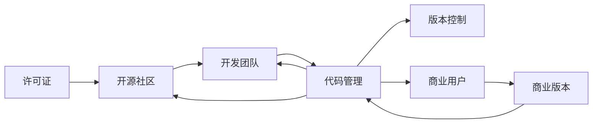

                 

## 1. 背景介绍

在数字化、互联网化的浪潮下，开源软件项目如雨后春笋般涌现，极大地推动了技术创新和产业升级。然而，随着开源项目的逐步成熟和广泛应用，如何平衡开源与商业化的关系，成为开源项目成功运营的重要问题。本文将探讨开源项目的商业版本开发策略，并结合实际案例，分析其优缺点和应用前景。

### 1.1 问题由来

开源软件项目通常具有高度透明度、自由使用和持续社区贡献的特点，对创新和研发具有重要意义。但同时，开源项目的商业模式往往依赖于社区的维系和商业化产品的推广，这对平衡开源与商业化带来了挑战。如何确保开源项目的持续创新，同时实现商业变现，成为开源项目成功的关键。

### 1.2 问题核心关键点

1. **开源社区与商业需求：** 开源社区希望提供免费的、高质量的软件，而商业用户则希望获得稳定、专业的产品支持和服务。
2. **代码管理与版本控制：** 开源项目如何管理商业版本的分支和更新，保证商业版本与开源版本的一致性和稳定性。
3. **知识产权与法律风险：** 开源与商业化过程中，如何处理知识产权和法律合规问题，确保各方利益。
4. **用户心理与市场定位：** 用户对开源软件和商业软件的认知差异，如何有效区分并满足不同用户群体的需求。

### 1.3 问题研究意义

开源项目的商业化开发策略研究具有重要意义：
1. **保障开源项目持续发展：** 通过商业化的收入支持开源社区的运作和发展，实现良性循环。
2. **提升软件质量与功能：** 商业化收入用于资金投入，提升软件的性能和功能，满足更多用户需求。
3. **增强市场竞争力：** 商业化产品丰富软件生态，增强市场竞争力，吸引更多用户和开发者参与。
4. **解决商业化与开放性的矛盾：** 通过科学的管理和策略，确保商业化与开源项目的开放性不矛盾，实现双赢。

## 2. 核心概念与联系

### 2.1 核心概念概述

1. **开源软件（Open Source Software，OSS）**：指代码公开、自由使用、自由修改和自由分发的软件。通常基于Git等版本控制系统进行管理，遵循开源协议如Apache、MIT、GPL等。
2. **商业版本（Commercial Version）**：指对开源项目进行商业化包装、定制和增强，提供付费支持和专属服务的版本。
3. **软件生命周期（Software Life Cycle）**：包括开发、测试、发布、维护、升级等阶段，商业版本一般需要更严格的版本管理和发布流程。
4. **许可证（License）**：决定开源软件的使用和分发的规则，如Apache License、MIT License等。
5. **代码管理（Code Management）**：指对开源和商业版本代码进行跟踪、管理、变更和合并的过程。

### 2.2 核心概念原理和架构的 Mermaid 流程图



此图表展示了开源项目的核心概念及其相互关系：

- 开源社区提供代码开发环境，并通过开源协议决定代码的使用规范。
- 开发团队基于开源代码进行开发和测试，并管理代码变更。
- 商业用户支付费用获得商业版本，享受专属服务。
- 商业版本对开源代码进行增强和定制，并遵循许可证进行分发。
- 代码管理对开源和商业代码进行同步和合并，确保版本的稳定性和一致性。

## 3. 核心算法原理 & 具体操作步骤

### 3.1 算法原理概述

开源项目的商业化开发，本质上是一种将开放性资源进行商业化的过程。其核心在于如何将开源代码与商业需求有效结合，并通过商业化的策略，实现开源与商业的双赢。

商业化开发的基本流程包括：

1. **商业化需求分析**：通过调研商业用户需求，确定商业化产品的功能、性能和特点。
2. **商业化定制开发**：基于开源代码进行定制开发，并引入商业化的功能和技术。
3. **商业版本发布**：根据商业化需求，发布商业版本，并保证与开源版本的一致性。
4. **商业化运营和维护**：提供商业支持和服务，持续优化和更新商业版本。

### 3.2 算法步骤详解

**步骤1：商业化需求分析**

商业化需求分析主要包括以下几个方面：

1. **用户调研**：通过问卷、访谈等方式，了解商业用户的具体需求和使用场景。
2. **功能定义**：基于调研结果，定义商业版本需要新增和增强的功能模块。
3. **性能要求**：确定商业版本在性能、安全性、稳定性等方面的要求。
4. **法律合规**：分析商业化过程中可能面临的法律和合规问题，确保合法合规。

**步骤2：商业化定制开发**

商业化定制开发主要包括以下几个环节：

1. **代码分支管理**：创建商业版本的分支，与开源版本进行隔离。
2. **功能实现**：基于开源代码，实现商业化需求，并遵循商业化开发的最佳实践。
3. **测试验证**：对商业版本进行全面的测试，包括功能测试、性能测试、安全测试等。
4. **代码合并**：根据商业版本和开源版本的更新情况，进行代码合并，确保两者的稳定性。

**步骤3：商业版本发布**

商业版本发布主要包括以下几个环节：

1. **版本命名规则**：定义商业版本的命名规则，如版本号、发布日期等。
2. **发布流程**：制定商业版本的发布流程，包括发布前的预发布测试、发布后的用户反馈和问题修复。
3. **用户支持**：提供商业版本的用户支持和技术服务，确保用户使用体验。
4. **市场营销**：通过市场营销推广商业版本，吸引更多商业用户。

**步骤4：商业化运营和维护**

商业化运营和维护主要包括以下几个环节：

1. **持续更新**：根据商业用户的需求和市场变化，持续更新商业版本，保持竞争力。
2. **客户反馈**：收集商业用户的反馈和建议，进行功能优化和改进。
3. **技术支持**：提供高质量的技术支持和服务，增强用户满意度和忠诚度。
4. **市场推广**：通过市场推广活动，提升商业版本的市场占有率。

### 3.3 算法优缺点

开源项目商业化开发具有以下优点：

1. **加速产品迭代**：商业化收入可用于支持开发和测试，加速产品迭代和功能增强。
2. **增强市场竞争力**：商业版本通过市场推广，吸引更多用户和开发者，增强市场竞争力。
3. **提升用户满意度**：商业版本提供专属支持和服务，提升用户满意度和忠诚度。
4. **保障开源项目的持续发展**：商业化收入可用于支持开源社区的运作和发展，实现良性循环。

同时，也存在以下缺点：

1. **开源社区的抵触**：部分开源贡献者可能对商业化持保留态度，认为商业化会损害开源项目的开放性。
2. **法律风险**：商业化过程中可能面临法律和合规问题，需要严格遵守相关法律法规。
3. **市场认知差异**：用户对开源和商业软件的认知差异较大，需要进行市场教育和区分。
4. **成本高昂**：商业化开发和运营需要较高的成本投入，增加了项目风险。

### 3.4 算法应用领域

开源项目商业化开发在多个领域都有广泛应用：

1. **云服务**：如AWS、阿里云等，通过开源代码进行商业化，提供云服务解决方案。
2. **企业应用**：如JIRA、Salesforce等，基于开源代码进行定制开发，提供企业级应用。
3. **物联网**：如OpenIoT、ThingWorx等，通过开源代码进行商业化，提供物联网平台和解决方案。
4. **人工智能**：如TensorFlow、PyTorch等，提供商业版本和云服务，满足特定行业需求。
5. **大数据**：如Apache Hadoop、Apache Spark等，提供商业版本和云服务，满足大数据分析需求。

## 4. 数学模型和公式 & 详细讲解 & 举例说明

### 4.1 数学模型构建

为了分析开源项目商业化的过程，可以构建一个简单的数学模型。假设开源项目的开发成本为 $C$，开源代码的价值为 $V_{open}$，商业版本的功能价值为 $V_{commercial}$。

商业化的收益可以用以下公式表示：

$$
R = V_{commercial} - C
$$

其中，$R$ 表示商业化带来的净收益。

### 4.2 公式推导过程

1. **成本分析**：
   - 开发成本 $C = C_{base} + C_{extra}$，其中 $C_{base}$ 是开源版本开发的固定成本，$C_{extra}$ 是商业版本额外开发的成本。
   - $C_{extra}$ 包括额外的开发人员、测试人员、管理费用等。

2. **价值分析**：
   - 开源代码价值 $V_{open}$ 包括代码质量、社区贡献、代码可维护性等。
   - 商业版本价值 $V_{commercial}$ 包括商业需求、功能增强、性能提升等。

3. **收益计算**：
   - 商业化净收益 $R = V_{commercial} - C$。

### 4.3 案例分析与讲解

假设某开源项目开发成本为 $C = 1000$ 万美元，开源代码价值为 $V_{open} = 2000$ 万美元。商业化过程中，商业版本额外开发成本为 $C_{extra} = 500$ 万美元，商业版本功能价值为 $V_{commercial} = 3000$ 万美元。

则商业化净收益为：

$$
R = V_{commercial} - C = 3000 - (1000 + 500) = 1500
$$

案例分析说明，虽然商业化开发增加了额外的成本，但由于商业版本价值高于开发成本，仍能获得显著的净收益。

## 5. 项目实践：代码实例和详细解释说明

### 5.1 开发环境搭建

开源项目的商业化开发通常使用敏捷开发和DevOps流程。以下是一个基于Git、Jenkins、Docker等工具的开发环境搭建示例：

1. **Git版本控制**：使用Git进行代码管理，创建主分支和商业分支。
2. **Jenkins持续集成**：配置Jenkins进行代码构建和自动化测试。
3. **Docker容器化**：将商业版本打包为Docker容器，方便部署和扩展。
4. **云平台部署**：使用AWS、阿里云等云平台进行商业版本的部署和运维。

### 5.2 源代码详细实现

以下是一个简单的开源项目商业化开发示例：

```python
import git
import jenkins
import docker

# 使用Git进行版本管理
repo = git.Repo("path/to/source")
branch = "master"
new_branch = "commercial"
repo.git.checkout(new_branch)

# 使用Jenkins进行持续集成
jenkins_url = "http://jenkins.example.com"
jenkins_job = jenkins.Jenkins(url=jenkins_url, username="user", password="password")
jenkins_job.build()

# 使用Docker进行容器化
docker_image = "path/to/source:latest"
docker_client = docker.from_env()
docker_client.images.build(path=path_to_source, tag=image_name)
```

### 5.3 代码解读与分析

1. **Git版本控制**：
   - `git.checkout(new_branch)`：创建商业分支，与开源版本隔离。
   - `git.add()`, `git.commit()`：提交代码变更。

2. **Jenkins持续集成**：
   - `jenkins.Jenkins(url, username, password)`：创建Jenkins客户端。
   - `jenkins_job.build()`：触发Jenkins构建任务。

3. **Docker容器化**：
   - `docker.from_env()`：创建Docker客户端。
   - `docker_client.images.build(path, tag)`：构建Docker镜像。

### 5.4 运行结果展示

1. **Git分支对比**：
   ```
   $ git log --graph --oneline --date=short --color=never --first=10 --since=commercial
   ```

2. **Jenkins构建日志**：
   ```
   $ jenkins job list
   $ jenkins job log job_name
   ```

3. **Docker镜像信息**：
   ```
   $ docker images
   $ docker run -p 8080:8080 image_name
   ```

## 6. 实际应用场景

### 6.1 智能客服系统

开源智能客服系统通过商业化开发，提供企业级智能客服解决方案。商业化版本可以根据企业需求进行定制，包括多语言支持、知识库集成、自然语言处理等，同时提供专属的技术支持和用户培训。

### 6.2 金融行业解决方案

开源金融行业解决方案通过商业化开发，提供企业级金融业务应用。商业化版本可以实现高频交易、风险管理、智能投顾等功能，同时提供数据安全、合规支持等专业服务。

### 6.3 物联网平台

开源物联网平台通过商业化开发，提供企业级物联网应用开发平台。商业化版本可以实现设备管理、数据采集、实时监控等功能，同时提供云平台、网络安全等专业服务。

## 7. 工具和资源推荐

### 7.1 学习资源推荐

1. **开源社区**：Github、Apache、MIT License等。
2. **商业化开发**：Agile、DevOps、Jenkins、Docker等。
3. **技术博客**：InfoQ、DZone、Stack Overflow等。
4. **商业化策略**：商业模式、定价策略、市场营销等书籍和论文。

### 7.2 开发工具推荐

1. **版本控制**：Git、GitHub、GitLab等。
2. **持续集成**：Jenkins、Travis CI等。
3. **容器化**：Docker、Kubernetes等。
4. **云平台**：AWS、阿里云、腾讯云等。

### 7.3 相关论文推荐

1. **开源社区管理**：Linux Kernel社区管理经验。
2. **商业化策略**：Open Source Software in the Enterprise by 陈春花。
3. **开源与商业化**：Open Source Software: The Economics of Innovation by Eric S. Raymond。

## 8. 总结：未来发展趋势与挑战

### 8.1 研究成果总结

开源项目的商业化开发是开源社区与商业化需求相结合的重要策略，能够实现开源与商业的双赢。本文详细探讨了开源项目的商业化开发策略，并结合实际案例进行了分析。

### 8.2 未来发展趋势

1. **社区与商业的融合**：开源社区与商业化项目将更加紧密结合，形成互惠互利的生态系统。
2. **自动化与智能化**：商业化开发将更加依赖自动化和智能化工具，提升开发效率。
3. **跨领域的应用**：开源项目的商业化开发将拓展到更多领域，如医疗、教育、智能制造等。
4. **法律与合规的完善**：开源与商业化过程中将更加注重法律合规，确保各方权益。

### 8.3 面临的挑战

1. **社区与商业的冲突**：开源贡献者可能对商业化持保留态度，影响社区贡献。
2. **成本与效益的平衡**：商业化开发和运营需要较高的成本投入，风险较高。
3. **技术复杂度提升**：商业化开发需要更复杂的技术栈和开发流程。

### 8.4 研究展望

开源项目的商业化开发需要不断创新和优化，以适应新的技术和市场环境。未来需要：

1. **提高社区参与度**：通过更好的商业化策略，吸引更多开源贡献者参与。
2. **优化成本控制**：探索更加高效和低成本的商业化开发和运营模式。
3. **增强市场竞争力**：提升商业版本的市场竞争力和用户满意度。
4. **完善法律合规**：确保开源与商业化过程中的法律合规，保障各方权益。

## 9. 附录：常见问题与解答

**Q1: 开源项目如何进行商业化开发？**

A: 开源项目的商业化开发主要包括以下几个步骤：
1. **需求分析**：通过调研和访谈，明确商业化需求和功能。
2. **分支管理**：创建商业分支，与开源版本隔离。
3. **定制开发**：基于开源代码进行定制开发，并引入商业化功能。
4. **版本发布**：根据商业化需求，发布商业版本。
5. **持续维护**：提供商业支持和技术服务，持续更新和优化商业版本。

**Q2: 开源项目商业化开发需要哪些资源？**

A: 开源项目商业化开发需要以下资源：
1. **开源社区**：提供代码开发环境，进行开源贡献。
2. **开发团队**：进行商业化定制开发和技术支持。
3. **商业用户**：提供资金支持，进行商业化推广。
4. **持续集成工具**：如Jenkins，进行自动化测试和部署。
5. **容器化技术**：如Docker，进行商业版本打包和部署。

**Q3: 开源项目商业化开发面临哪些挑战？**

A: 开源项目商业化开发面临以下挑战：
1. **社区抵触**：部分开源贡献者可能对商业化持保留态度。
2. **法律风险**：商业化过程中可能面临法律和合规问题。
3. **成本高昂**：商业化开发和运营需要较高的成本投入。
4. **技术复杂**：商业化开发需要更复杂的技术栈和开发流程。

**Q4: 开源项目商业化开发如何保障用户权益？**

A: 开源项目商业化开发可以通过以下方式保障用户权益：
1. **明确许可证**：确保开源代码和商业代码符合相关许可证。
2. **开放API接口**：允许用户通过开放API获取和使用开源代码。
3. **用户支持**：提供高质量的技术支持和售后服务。
4. **客户反馈**：定期收集用户反馈，进行功能优化和改进。

---

作者：禅与计算机程序设计艺术 / Zen and the Art of Computer Programming

