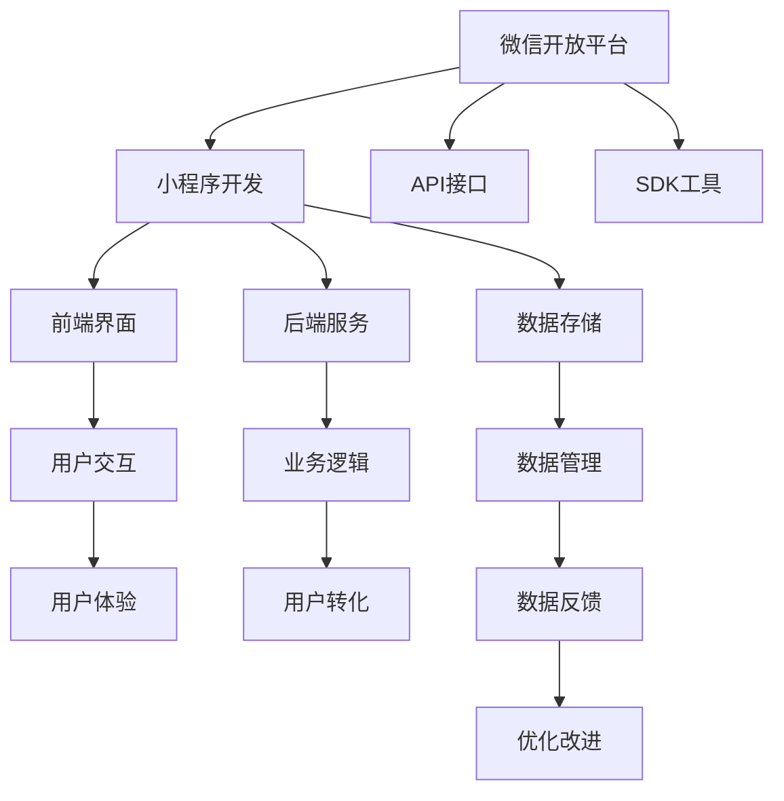

                 

# 微信小程序：注意力经济的新战场

## 1. 背景介绍

### 1.1 问题由来

随着移动互联网和智能手机的普及，人们的生活方式发生了翻天覆地的变化。相较于传统的线下购物，线上购物正在逐渐成为主流。而微信小程序作为新型的零售工具，以其便捷、高效、覆盖广泛等特点迅速获得了市场的认可，成为移动互联网的下一个“流量风口”。

小程序即用即走、无需安装，让消费者在购物体验上拥有更高的自由度。对于商家而言，小程序帮助其触达更多的用户群体，通过互动提升用户粘性，实现对用户的全生命周期管理。

### 1.2 问题核心关键点

1. **微信小程序的技术架构**：小程序是基于微信平台的一个功能强大的应用工具，涵盖前端界面、后端服务、数据存储等方面，通过微信开放平台提供的API和SDK，可以实现丰富的业务功能。
2. **注意力经济**：指通过增加用户关注度，在用户的注意力被吸引后，通过相关推荐、内容投放等方式，提升用户转化率，实现商业价值的最大化。
3. **用户体验**：小程序需要在短时间内抓住用户注意力，提供流畅、直观、互动性强的用户体验，以便用户能够快速进行消费决策。
4. **跨平台兼容**：小程序具有良好的跨平台兼容性，能够在微信、支付宝等平台上快速部署，满足用户的不同使用需求。
5. **数据分析与反馈机制**：小程序需要对用户行为进行数据采集与分析，通过反馈机制不断优化产品设计和用户体验。

### 1.3 问题研究意义

在信息化时代，注意力是稀缺资源。商家能够吸引并留住用户的注意力，在竞争中取得优势。微信小程序利用其在注意力获取和分发上的天然优势，为用户提供了更加便捷、快速、个性化的服务。通过合理利用微信小程序，商家可以在竞争激烈的市场中脱颖而出，实现更高的商业价值。

因此，理解微信小程序的开发与优化，对于提升商家在注意力经济中的竞争力和用户体验至关重要。

## 2. 核心概念与联系

### 2.1 核心概念概述

在探究微信小程序的开发与优化时，需要理解以下核心概念：

1. **微信小程序（Mini Programs）**：基于微信平台的一个功能强大的应用工具，涵盖前端界面、后端服务、数据存储等方面，通过微信开放平台提供的API和SDK，可以实现丰富的业务功能。
2. **注意力经济（Attention Economy）**：指通过增加用户关注度，在用户的注意力被吸引后，通过相关推荐、内容投放等方式，提升用户转化率，实现商业价值的最大化。
3. **用户体验（User Experience, UX）**：小程序需要在短时间内抓住用户注意力，提供流畅、直观、互动性强的用户体验，以便用户能够快速进行消费决策。
4. **跨平台兼容**：小程序具有良好的跨平台兼容性，能够在微信、支付宝等平台上快速部署，满足用户的不同使用需求。
5. **数据分析与反馈机制**：小程序需要对用户行为进行数据采集与分析，通过反馈机制不断优化产品设计和用户体验。

### 2.2 核心概念原理和架构的 Mermaid 流程图



这个流程图展示了微信小程序的核心架构和关键环节，包括开发流程、功能组件、用户体验等多个方面。

## 3. 核心算法原理 & 具体操作步骤

### 3.1 算法原理概述

小程序的开发与优化涉及到多个领域的技术，如前端开发、后端服务、数据存储、用户交互设计等。其中，优化算法主要是通过数据分析与反馈机制，不断优化用户体验和提升转化率。

在优化过程中，核心算法主要包含：

1. **A/B测试**：对比不同版本的体验效果，优化小程序的各个环节。
2. **推荐算法**：通过数据分析，预测用户可能感兴趣的内容，提升用户体验和转化率。
3. **个性化推荐**：根据用户行为数据，提供个性化的推荐服务。
4. **用户体验优化**：优化界面设计，提升用户互动体验。
5. **数据驱动优化**：通过数据分析结果，不断调整小程序策略，提升整体效果。

### 3.2 算法步骤详解

小程序的优化主要分为以下几个步骤：

1. **需求分析与规划**：确定小程序的业务目标，制定详细的开发与优化计划。
2. **开发与测试**：按照规划，开发小程序前端界面和后端服务，并进行充分测试，确保功能稳定。
3. **数据分析与反馈**：通过数据采集和分析，了解用户行为，发现问题并进行优化。
4. **用户交互优化**：根据数据分析结果，调整界面和功能设计，提升用户体验。
5. **业务优化**：通过优化推荐算法和个性化推荐，提升用户转化率和满意度。
6. **反馈与迭代**：根据用户反馈，持续优化小程序，不断提升用户体验和商业价值。

### 3.3 算法优缺点

**优点**：

1. **快速迭代**：小程序开发与优化过程具有迭代性，能够快速进行版本更新和功能升级。
2. **用户粘性强**：通过数据分析与优化，提升用户粘性，增加用户留存率。
3. **跨平台兼容**：小程序具有跨平台兼容性，能够覆盖更多用户。
4. **功能丰富**：通过微信开放平台的API和SDK，可以实现丰富的业务功能。

**缺点**：

1. **用户体验提升难度大**：小程序需要在短时间内提升用户体验，难度较大。
2. **开发复杂度高**：小程序开发与优化涉及多个技术环节，开发复杂度较高。
3. **数据分析成本高**：数据采集与分析需要投入大量人力物力，成本较高。
4. **算法优化复杂**：推荐算法和个性化推荐的优化需要专业知识，难度较大。

### 3.4 算法应用领域

小程序优化算法广泛应用于以下几个领域：

1. **电商购物**：通过优化推荐算法和个性化推荐，提升商品转化率和用户满意度。
2. **内容分享**：通过数据分析，推荐用户感兴趣的内容，提升用户粘性。
3. **金融服务**：通过用户体验优化和数据分析，提升金融服务的效率和安全性。
4. **社交互动**：通过优化用户交互设计，提升社交互动的体验和用户粘性。
5. **本地服务**：通过数据分析和反馈机制，优化本地服务的用户体验和资源配置。

## 4. 数学模型和公式 & 详细讲解 & 举例说明

### 4.1 数学模型构建

在小程序优化过程中，涉及多个数学模型，主要包括用户行为模型、推荐模型和反馈模型等。这里以推荐模型为例，进行数学建模：

**用户行为模型**：
- 用户行为数据：点击率、购买率、浏览时间等。
- 用户画像：性别、年龄、地域等。

**推荐模型**：
- 协同过滤模型：基于用户行为数据和物品特征进行推荐。
- 深度学习模型：通过神经网络进行用户兴趣预测和物品推荐。

**反馈模型**：
- A/B测试模型：对比不同版本的用户行为，优化小程序功能。
- 用户体验评分模型：通过用户评分数据，优化用户体验设计。

### 4.2 公式推导过程

以推荐模型为例，设推荐模型的输入为 $x$，输出为 $y$，其中 $x$ 为用户的行为数据，$y$ 为用户感兴趣的物品。推荐模型的目标是最小化损失函数 $L$，公式如下：

$$
L = \frac{1}{N}\sum_{i=1}^{N}(y_i-\hat{y_i})^2
$$

其中 $\hat{y_i}$ 为模型预测结果。

通过最小化损失函数 $L$，可以不断调整模型参数，优化推荐结果。具体过程如下：

1. 初始化模型参数 $\theta$。
2. 输入用户行为数据 $x$，进行前向传播计算 $y_i$。
3. 计算预测结果 $\hat{y_i}$ 与真实结果 $y_i$ 的误差 $\delta$。
4. 反向传播计算梯度 $\nabla_{\theta}L$。
5. 更新模型参数 $\theta \leftarrow \theta - \eta \nabla_{\theta}L$，其中 $\eta$ 为学习率。

重复以上过程，直至模型收敛，完成推荐模型优化。

### 4.3 案例分析与讲解

以电商购物为例，小程序通过数据分析，了解用户浏览商品的行为数据，利用协同过滤模型进行推荐，优化推荐结果。具体步骤如下：

1. 收集用户浏览商品的历史数据 $x$。
2. 使用协同过滤模型进行推荐，计算用户兴趣 $y$。
3. 通过A/B测试，对比不同推荐算法的效果，优化推荐模型。
4. 利用推荐结果，提升用户体验和转化率。

## 5. 项目实践：代码实例和详细解释说明

### 5.1 开发环境搭建

在进行小程序开发与优化实践前，需要准备好开发环境：

1. 安装Node.js：从官网下载并安装Node.js。
2. 安装微信开发者工具：从微信官网下载并安装微信开发者工具，配置开发环境。
3. 安装VSCode：下载并安装Visual Studio Code，配置前端开发环境。

### 5.2 源代码详细实现

以下是一个简单的微信小程序实现代码，包括前端界面和后端服务：

**前端代码**：

```html
<!-- app.wxml -->
<view class="container">
  <scroll-view scroll-y="true">
    <view class="item" wx:for="{{items}}" wx:key="{{item.id}}" wx:item="{{item}}" wx:bindtap="itemTapped">
      
      <view class="info">
        <text wx:if="{{item.showTitle}}" class="title">{{item.title}}</text>
        <text wx:if="{{item.showDesc}}" class="desc">{{item.desc}}</text>
        <text wx:if="{{item.showPrice}}" class="price">{{item.price}}</text>
      </view>
    </view>
  </scroll-view>
</view>
```

**后端代码**：

```javascript
// app.js
Component({
  data: {
    items: []
  },
  onLoad() {
    this.setData({
      items: this.getItems()
    });
  },
  getItems() {
    // 从服务器获取商品列表
    return wx.request({
      url: 'http://example.com/items',
      success: (res) => {
        return res.data.items;
      }
    });
  },
  itemTapped(event) {
    // 处理用户点击商品事件
    console.log(event.detail.item);
  }
});
```

### 5.3 代码解读与分析

**前端代码**：

1. `app.wxml` 为小程序前端代码，使用了微信开放平台的组件系统，通过 `wx:for` 实现列表展示。
2. `scroll-view` 组件用于实现滚动展示效果。
3. `item` 组件用于展示商品信息，包括图片、标题、描述和价格等。
4. `wx:bindtap` 事件用于处理用户点击事件，触发 `itemTapped` 方法。

**后端代码**：

1. `app.js` 为小程序后端代码，通过 `onLoad` 生命周期钩子获取初始数据，并展示到前端。
2. `getItems` 方法用于从服务器获取商品列表，这里使用了 `wx.request` 接口进行数据请求。
3. `itemTapped` 方法用于处理用户点击事件，这里只是简单地输出了点击的商品信息。

### 5.4 运行结果展示

通过前端界面展示商品列表，用户可以点击商品进行查看详情。在后端，小程序通过 `getItems` 方法从服务器获取商品数据，并展示到前端界面。用户点击商品时，触发 `itemTapped` 方法，处理用户交互事件。

## 6. 实际应用场景

### 6.1 电商购物

小程序在电商购物场景中得到了广泛应用。电商商家通过小程序进行商品展示、促销活动、订单管理等功能，实现了全渠道零售。例如，京东、拼多多等电商平台都在微信小程序中实现了多项电商功能。

电商小程序通过优化推荐算法和个性化推荐，提升用户购买转化率。例如，京东的小程序通过用户浏览行为数据，推荐用户感兴趣的商品，提升用户购买意愿。

### 6.2 内容分享

内容分享小程序广泛应用于视频、音频、电子书等数字内容的分享。例如，腾讯微视、网易云音乐等小程序，通过优化推荐算法和个性化推荐，提升用户粘性和互动率。

内容分享小程序通过数据分析，了解用户行为，推荐用户感兴趣的内容，提升用户粘性。例如，网易云音乐的小程序通过用户听歌行为数据，推荐用户感兴趣的歌曲，提升用户粘性。

### 6.3 金融服务

金融服务小程序广泛应用于理财、保险、支付等场景。例如，招商银行、平安银行等小程序，通过优化用户体验和数据分析，提升金融服务的效率和安全性。

金融服务小程序通过数据分析，了解用户行为，提升金融服务的效率和安全性。例如，招商银行的小程序通过用户理财行为数据，推荐用户感兴趣的产品，提升用户转化率。

### 6.4 社交互动

社交互动小程序广泛应用于聊天、社交网络等场景。例如，微信朋友圈、微信好友等小程序，通过优化用户体验和数据分析，提升社交互动的体验和用户粘性。

社交互动小程序通过优化用户交互设计，提升社交互动的体验和用户粘性。例如，微信朋友圈的小程序通过用户好友关系数据，推荐用户感兴趣的内容，提升用户粘性。

### 6.5 本地服务

本地服务小程序广泛应用于本地生活服务、旅游、美食等场景。例如，美团、大众点评等小程序，通过优化用户体验和数据分析，提升本地服务的效率和质量。

本地服务小程序通过数据分析，了解用户行为，提升本地服务的效率和质量。例如，美团的小程序通过用户评价数据，推荐用户感兴趣的餐厅，提升用户满意度。

## 7. 工具和资源推荐

### 7.1 学习资源推荐

为了帮助开发者系统掌握微信小程序的开发与优化技术，这里推荐一些优质的学习资源：

1. 《微信小程序开发与实践》：由微信官方编写的微信小程序开发教程，系统介绍了小程序开发流程和优化技巧。
2. 《微信小程序实战》：由微信开发者社区推荐的小程序开发教程，涵盖小程序的开发和优化技巧。
3. 《微信小程序API文档》：微信官方提供的小程序API文档，详细介绍了小程序各个组件和功能的实现方法。
4. 《微信开发者社区》：微信开发者社区提供的小程序开发交流平台，有大量的开发实践经验和交流讨论。
5. 《小程序优化实战》：由微信开发者社区推荐的小程序优化教程，涵盖小程序的优化技巧和案例分析。

通过对这些资源的学习实践，相信你一定能够快速掌握微信小程序的开发与优化技术，并用于解决实际的NLP问题。

### 7.2 开发工具推荐

高效的开发离不开优秀的工具支持。以下是几款用于微信小程序开发的工具：

1. VSCode：支持前端开发，提供代码补全、断点调试等功能。
2. Sublime Text：支持多语言编程，提供丰富的插件和扩展。
3. CodePen：在线代码编辑器，支持HTML、CSS、JavaScript等前端代码的实时预览。
4. Figma：设计工具，支持微信小程序界面设计和用户体验优化。
5. Sketch：设计工具，支持微信小程序界面设计和用户体验优化。

合理利用这些工具，可以显著提升微信小程序的开发效率，加快创新迭代的步伐。

### 7.3 相关论文推荐

微信小程序开发与优化技术的发展源于学界的持续研究。以下是几篇奠基性的相关论文，推荐阅读：

1. 《微信小程序设计模式与开发实践》：详细介绍了微信小程序的设计模式和开发实践。
2. 《微信小程序性能优化技术》：研究了微信小程序的性能优化方法和技术实现。
3. 《微信小程序用户体验设计》：探讨了微信小程序的用户体验设计方法和实践案例。
4. 《微信小程序推荐算法研究》：研究了微信小程序的推荐算法和实现方法。
5. 《微信小程序安全防护技术》：研究了微信小程序的安全防护方法和技术实现。

这些论文代表了大语言模型微调技术的发展脉络。通过学习这些前沿成果，可以帮助研究者把握学科前进方向，激发更多的创新灵感。

## 8. 总结：未来发展趋势与挑战

### 8.1 研究成果总结

微信小程序作为移动互联网的重要工具，已经成为电商、金融、社交等多个行业的重要平台。通过优化小程序的开发与优化，商家可以实现更高的商业价值，提升用户体验。

### 8.2 未来发展趋势

展望未来，微信小程序的开发与优化技术将呈现以下几个发展趋势：

1. **交互设计优化**：优化用户交互设计，提升用户体验，增加用户留存率。
2. **推荐算法优化**：通过优化推荐算法，提升推荐效果，增加用户转化率。
3. **数据分析深入**：深入挖掘用户行为数据，提升数据驱动优化效果。
4. **多平台兼容**：支持跨平台部署，满足用户不同使用需求。
5. **新技术应用**：引入新技术，如人工智能、大数据等，提升小程序功能。

### 8.3 面临的挑战

尽管微信小程序发展迅速，但在迈向更加智能化、普适化应用的过程中，仍面临诸多挑战：

1. **用户体验提升难度大**：小程序需要在短时间内提升用户体验，难度较大。
2. **开发复杂度高**：小程序开发与优化涉及多个技术环节，开发复杂度较高。
3. **数据分析成本高**：数据采集与分析需要投入大量人力物力，成本较高。
4. **算法优化复杂**：推荐算法和个性化推荐的优化需要专业知识，难度较大。
5. **跨平台兼容难度大**：小程序在跨平台部署时，需要进行大量适配工作。

### 8.4 研究展望

未来，针对以上挑战，需要从以下几个方面进行研究和探索：

1. **用户体验优化**：通过优化用户交互设计，提升用户体验，增加用户留存率。
2. **推荐算法优化**：通过优化推荐算法，提升推荐效果，增加用户转化率。
3. **数据分析优化**：通过优化数据分析方法和技术，降低数据分析成本，提高数据分析效果。
4. **跨平台兼容优化**：通过优化跨平台适配方法，提高跨平台兼容性。
5. **新技术应用**：引入新技术，如人工智能、大数据等，提升小程序功能。

这些研究方向将进一步推动微信小程序的发展，提升用户体验和商家商业价值，实现更高的自动化和智能化水平。

## 9. 附录：常见问题与解答

**Q1：微信小程序的跨平台兼容性如何实现？**

A: 微信小程序具有良好的跨平台兼容性，通过微信开放平台的API和SDK，可以实现不同的平台适配。具体实现步骤如下：

1. 使用微信开发者工具进行开发和调试。
2. 在小程序编辑器中设置目标平台，进行跨平台部署。
3. 根据不同平台的特点，进行适配和优化。

**Q2：微信小程序的推荐算法如何优化？**

A: 微信小程序的推荐算法优化主要分为以下几个步骤：

1. 收集用户行为数据，建立用户画像。
2. 设计推荐模型，如协同过滤模型、深度学习模型等。
3. 通过A/B测试，对比不同推荐算法的效果，优化推荐模型。
4. 根据推荐结果，优化用户体验和转化率。

**Q3：微信小程序的性能优化有哪些方法？**

A: 微信小程序的性能优化主要分为以下几个方面：

1. 减少前端代码的体积，压缩资源文件。
2. 优化网络请求，减少加载时间。
3. 优化渲染性能，提升页面加载速度。
4. 使用CDN加速，提高资源访问速度。
5. 使用本地缓存，减少页面渲染次数。

**Q4：微信小程序的数据分析如何实现？**

A: 微信小程序的数据分析主要通过微信开放平台的API和SDK进行实现，具体步骤如下：

1. 使用微信开发者工具，进行数据采集和存储。
2. 使用数据分析工具，如Python、SQL等，进行数据处理和分析。
3. 通过可视化工具，如Tableau、Power BI等，展示数据分析结果。
4. 根据数据分析结果，进行产品优化和用户体验改进。

**Q5：微信小程序的开发与优化过程中需要注意哪些问题？**

A: 微信小程序的开发与优化过程中需要注意以下几个问题：

1. 界面设计：确保界面简洁、美观、易用，提升用户体验。
2. 功能实现：确保功能稳定、高效、可靠，避免Bug。
3. 用户体验：通过数据分析，优化用户体验，提升用户粘性。
4. 安全防护：通过安全防护措施，确保数据和用户安全。
5. 性能优化：通过性能优化，提升小程序的响应速度和用户体验。

这些注意事项将帮助开发者在系统开发与优化过程中，提升小程序的质量和性能。

