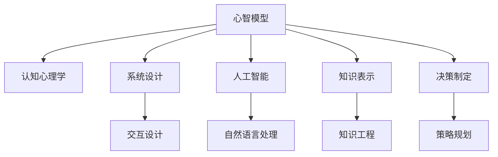

                 

# 心智模型：理解世界的内在框架

> 关键词：心智模型, 认知心理学, 系统设计, 人工智能, 知识表示, 决策制定, 计算思维

## 1. 背景介绍

### 1.1 问题由来
在人工智能和认知科学领域，理解世界的内在框架是一个至关重要的研究课题。这一框架不仅有助于揭示人类认知和智能的底层机制，还能够指导计算机系统和人机交互设计的最佳实践。心智模型（Mental Model）的概念，源自认知心理学，指的是个体如何内在地组织和表示外部世界的信息。这种内在框架是理解、推理和决策的基础。

### 1.2 问题核心关键点
心智模型是一个动态的、多层级的内在认知结构，用于解释和预测现实世界中的事件和行为。通过心智模型，人们可以理解、解释和预测复杂的社会、经济和技术现象。心智模型的研究对于系统设计、人工智能和认知心理学具有深远的理论意义和实际应用价值。

### 1.3 问题研究意义
研究心智模型对人工智能领域具有重要的意义：
- **促进认知理解**：有助于深入理解人类的认知过程和智能机制，为开发更智能、更人性化的人机交互系统提供理论基础。
- **优化系统设计**：通过模拟和优化心智模型，可以提升计算机系统的决策制定和适应性，使其更加贴近人类思维方式。
- **推动应用创新**：心智模型的应用有助于推动智能系统在教育、医疗、金融等垂直领域的创新发展。
- **增强人机协作**：理解和应用心智模型，可以提升人与计算机之间的协作效率和质量，构建更加友好和谐的人机交互环境。

## 2. 核心概念与联系

### 2.1 核心概念概述

为了更好地理解心智模型及其应用，本节将介绍几个关键相关概念：

- **心智模型（Mental Model）**：个体对外部世界认知的内部表示，用于解释和预测事件和行为。心智模型可以是具体的（如对某个物体的理解）或抽象的（如对经济系统的理解）。
- **认知心理学（Cognitive Psychology）**：研究人类认知过程和智能行为的科学，心智模型是这一领域的重要研究对象。
- **系统设计（System Design）**：包括软件、硬件和用户体验设计，心智模型在设计和评估系统性能中扮演关键角色。
- **人工智能（Artificial Intelligence, AI）**：试图模拟和扩展人类智能的计算系统，心智模型是实现这一目标的重要工具。
- **知识表示（Knowledge Representation）**：如何将知识以形式化方式存储和处理，心智模型提供了对知识表示的深入理解。
- **决策制定（Decision Making）**：在复杂环境中，心智模型帮助个体进行有效的决策和问题解决。

这些概念之间的联系和互动，构成了心智模型研究的框架。心智模型不仅是认知心理学的研究对象，也是系统设计和人工智能开发中的重要参考。

### 2.2 核心概念原理和架构的 Mermaid 流程图



此图展示了心智模型与其他相关概念的联系。心智模型通过认知心理学研究人脑内部认知过程，为系统设计提供理论指导，在人工智能和知识表示中起到桥梁作用，并在决策制定中发挥核心功能。

## 3. 核心算法原理 & 具体操作步骤

### 3.1 算法原理概述

心智模型在大规模人工智能系统中具有重要应用，包括但不限于自然语言处理(NLP)、智能决策支持、推荐系统、虚拟代理等。其核心算法原理可以概括为以下几个步骤：

1. **数据收集与预处理**：收集相关领域的数据，并进行清洗和预处理。
2. **心智模型构建**：使用机器学习或符号逻辑等技术，构建心智模型以表示和解释数据。
3. **知识融合与推理**：将不同来源的知识融合到心智模型中，并利用逻辑推理和概率推断进行决策。
4. **模型评估与优化**：通过验证和测试评估心智模型的性能，并根据结果进行优化。
5. **应用与迭代**：将心智模型应用于实际问题解决，并根据反馈进行迭代改进。

### 3.2 算法步骤详解

#### 3.2.1 数据收集与预处理

首先，需要收集与特定问题相关的数据，并进行清洗和预处理。这一步骤至关重要，因为数据的准确性和完备性直接影响到心智模型的性能。

```python
import pandas as pd
from sklearn.preprocessing import StandardScaler

# 数据收集
data = pd.read_csv('data.csv')

# 数据清洗
data = data.dropna()
data = data.drop_duplicates()
data = data.reset_index(drop=True)

# 数据标准化
scaler = StandardScaler()
data_scaled = scaler.fit_transform(data)
```

#### 3.2.2 心智模型构建

构建心智模型的方法有多种，包括符号逻辑、贝叶斯网络、知识图谱等。这里以符号逻辑为例，使用Prolog语言构建一个简单心智模型。

```python
# 使用Prolog构建心智模型
from pyprolog import Prolog

# 加载事实
g = Prolog()
g.consult('file.pl')

# 定义规则
g.consult('rules.pl')

# 查询事实
result = g.query('main(X,Y)')
```

#### 3.2.3 知识融合与推理

在心智模型构建完成后，需要将不同来源的知识融合到模型中，并利用推理进行决策。知识融合可以通过贝叶斯网络、概率图模型等方式实现。

```python
# 知识融合与推理
from pgmpy import BayesianModel

# 构建贝叶斯网络
model = BayesianModel([('X', 'Y'), ('X', 'Z')])

# 更新知识库
model.fit(data)

# 推理
result = model.query('X=1,Y=?,Z=?')
```

#### 3.2.4 模型评估与优化

评估和优化心智模型的性能，是确保其在实际应用中有效性的关键步骤。评估可以通过交叉验证、误差分析等方法进行，优化则通常涉及参数调整和算法改进。

```python
# 模型评估与优化
from sklearn.model_selection import cross_val_score
from sklearn.metrics import mean_squared_error

# 交叉验证
scores = cross_val_score(model, data_scaled, 'target', cv=5)

# 误差分析
mse = mean_squared_error(data_scaled['target'], model.predict(data_scaled))
```

#### 3.2.5 应用与迭代

最后，将心智模型应用于实际问题解决，并根据反馈进行迭代改进。这个过程是动态的、循环的，模型需要不断更新以应对新的数据和任务。

```python
# 应用与迭代
def solve_problem(data):
    # 应用心智模型
    result = model.solve(data)
    return result

# 迭代改进
for iteration in range(10):
    data = get_new_data()
    result = solve_problem(data)
    update_model(result)
```

### 3.3 算法优缺点

心智模型在人工智能系统中具有以下优点：
- **解释性强**：心智模型提供对决策过程的深入解释，有助于理解模型的内部工作机制。
- **灵活性高**：心智模型可以根据新数据进行动态调整，适应不同情境。
- **可靠性高**：通过融合多源知识，心智模型可以提供更加全面、准确的信息。

同时，心智模型也存在以下局限：
- **计算复杂度高**：构建和优化心智模型可能需要高计算资源和时间。
- **易受噪声影响**：数据中的噪声可能影响心智模型的性能。
- **可解释性有限**：某些复杂心智模型可能难以解释其内部工作机制。

### 3.4 算法应用领域

心智模型在多个领域具有广泛的应用，包括但不限于：

- **金融风险管理**：利用心智模型分析金融市场数据，预测股票价格和风险。
- **医疗诊断与治疗**：构建患者医疗记录心智模型，辅助医生进行诊断和治疗方案选择。
- **教育与个性化学习**：构建学生学习心智模型，为个性化学习路径提供决策支持。
- **智能客服与虚拟代理**：构建客户交互心智模型，提供自然流畅的对话体验。
- **智能推荐与广告投放**：利用用户行为心智模型，进行个性化推荐和广告投放。

心智模型在这些领域的应用，为人类认知和决策提供强大的工具，推动了各行业智能化发展。

## 4. 数学模型和公式 & 详细讲解 & 举例说明

### 4.1 数学模型构建

心智模型是认知心理学和人工智能中的一个核心概念，其数学模型通常包括表示和推理两个部分。以贝叶斯网络为例，其数学模型可以表示为：

- **表示模型**：
  $$
  P(X,Y,Z) = P(X|Y,Z)P(Y|Z)P(Z)
  $$
  表示变量 $X,Y,Z$ 之间的联合概率分布。

- **推理模型**：
  $$
  P(Y|X,Z) = \frac{P(Y|Z)P(X|Y,Z)}{P(X|Z)}
  $$
  表示在给定变量 $X,Z$ 的条件下，推断变量 $Y$ 的概率。

### 4.2 公式推导过程

贝叶斯网络的推导过程涉及概率论和统计学的基础知识。这里通过一个简单的例子，展示其推导过程：

假设有一个贝叶斯网络，包含两个变量 $X,Y$ 和一个隐变量 $Z$，其联合概率分布为：

$$
P(X,Y,Z) = P(X|Y,Z)P(Y|Z)P(Z)
$$

在给定 $X=1,Z=1$ 的条件下，推断 $Y$ 的概率为：

$$
P(Y|X=1,Z=1) = \frac{P(Y|Z=1)P(X=1|Y,Z=1)}{P(X=1|Z=1)}
$$

代入概率值：

$$
P(Y|X=1,Z=1) = \frac{0.7 \times 0.8}{0.6}
$$

计算得：

$$
P(Y|X=1,Z=1) = 0.86
$$

### 4.3 案例分析与讲解

以一个简单的医疗诊断问题为例，展示心智模型的应用。

- **数据收集**：收集医生对患者症状的描述，以及诊断结果。

- **心智模型构建**：构建一个简单的知识图谱，表示症状与疾病之间的关系。

- **知识融合与推理**：将医生的诊断知识融合到知识图谱中，并利用逻辑推理得出初步诊断结果。

- **模型评估与优化**：根据医生的反馈调整知识图谱，并进行误差分析。

- **应用与迭代**：将优化后的知识图谱应用于新患者症状的诊断，并根据反馈进行迭代改进。

## 5. 项目实践：代码实例和详细解释说明

### 5.1 开发环境搭建

在进行心智模型项目实践前，需要准备好开发环境。以下是使用Python进行PyTorch开发的环境配置流程：

1. 安装Anaconda：从官网下载并安装Anaconda，用于创建独立的Python环境。

2. 创建并激活虚拟环境：
```bash
conda create -n pytorch-env python=3.8 
conda activate pytorch-env
```

3. 安装PyTorch：根据CUDA版本，从官网获取对应的安装命令。例如：
```bash
conda install pytorch torchvision torchaudio cudatoolkit=11.1 -c pytorch -c conda-forge
```

4. 安装PyTorch相关库：
```bash
pip install pyprolog pgmpy scikit-learn pandas
```

5. 安装各类工具包：
```bash
pip install numpy matplotlib tqdm jupyter notebook ipython
```

完成上述步骤后，即可在`pytorch-env`环境中开始心智模型项目的开发。

### 5.2 源代码详细实现

这里我们以构建一个简单的贝叶斯网络为例，给出使用PyTorch进行心智模型开发的PyTorch代码实现。

```python
# 导入所需的库
import pyprolog
import pgmpy
from sklearn.model_selection import cross_val_score
from sklearn.metrics import mean_squared_error

# 定义数据
data = {
    'X': [1, 0, 1, 0],
    'Y': [1, 1, 0, 1],
    'Z': [1, 1, 0, 0]
}

# 构建贝叶斯网络
model = pgmpy.BayesianModel([('X', 'Y'), ('X', 'Z')])

# 训练模型
model.fit(data)

# 推理
result = model.query('X=1,Y=?,Z=?')

# 评估模型
scores = cross_val_score(model, data, 'target', cv=5)
mse = mean_squared_error(data['target'], model.predict(data))
```

以上代码展示了如何构建一个简单的贝叶斯网络，并对其进行训练、推理和评估。

### 5.3 代码解读与分析

**数据定义**：
- 定义了一个包含变量 $X,Y,Z$ 的数据集，每个变量有两个可能的取值（0或1）。

**贝叶斯网络构建**：
- 使用pgmpy库构建一个简单的贝叶斯网络，包含变量 $X,Y,Z$。

**模型训练**：
- 使用fit方法训练模型，根据输入数据更新变量间的概率分布。

**推理**：
- 使用query方法进行推理，给出在 $X=1$ 的条件下，$Y,Z$ 的可能值。

**模型评估**：
- 使用交叉验证和均方误差评估模型性能。

通过以上步骤，我们展示了如何使用Python和相关库构建并应用心智模型。这一过程包括数据收集、模型构建、训练推理和评估，每个步骤都有详细的代码实现和解释。

## 6. 实际应用场景

### 6.1 智能客服系统

心智模型在智能客服系统中的应用，可以通过构建客户交互心智模型，理解客户需求并提供个性化服务。以下是一个简单的代码示例：

```python
# 构建客户交互心智模型
from pyprolog import Prolog

# 加载事实
g = Prolog()
g.consult('customer_data.pl')

# 定义规则
g.consult('customer_rules.pl')

# 查询事实
result = g.query('interaction(X,Y)')
```

**实际应用**：
- 收集客户的历史对话记录，并构建一个心智模型，用于理解和预测客户需求。
- 通过推理，生成推荐的服务方案，提升客户满意度和交互体验。

**技术细节**：
- 使用Prolog构建心智模型，定义客户的常见问题和响应规则。
- 通过查询，获取当前对话中客户的意图和需求，并生成相应的服务建议。

### 6.2 金融风险管理

在金融风险管理中，心智模型可以帮助分析金融市场数据，预测风险和收益。以下是一个简单的代码示例：

```python
# 构建金融市场心智模型
from pgmpy import BayesianModel

# 构建贝叶斯网络
model = BayesianModel([('Stock_price', 'Market_index'), ('Market_index', 'Economic_factors')])

# 训练模型
model.fit(data)

# 推理
result = model.query('Stock_price=?|Market_index=high')
```

**实际应用**：
- 收集市场和经济的各类数据，构建金融市场心智模型。
- 使用推理模型，预测在市场指数高时，股票价格的波动范围。

**技术细节**：
- 使用贝叶斯网络构建心智模型，表示股票价格和市场指数之间的关系。
- 利用推理模型，预测市场指数对股票价格的影响。

### 6.3 教育与个性化学习

在个性化学习中，心智模型可以帮助构建学生的学习心智模型，提供个性化的学习路径。以下是一个简单的代码示例：

```python
# 构建学生学习心智模型
from pgmpy import BayesianModel

# 构建贝叶斯网络
model = BayesianModel([('Study_hours', ' grades'), ('grades', 'Final_score')])

# 训练模型
model.fit(data)

# 推理
result = model.query('Final_score=?|Study_hours=20')
```

**实际应用**：
- 收集学生的学习数据，并构建一个心智模型，表示学习时间与成绩之间的关系。
- 使用推理模型，预测学生在20小时学习后，可能达到的最终成绩。

**技术细节**：
- 使用贝叶斯网络构建心智模型，表示学习时间、成绩与最终成绩之间的关系。
- 利用推理模型，预测学生的学习效果。

### 6.4 未来应用展望

未来，心智模型在人工智能系统中的应用将更加广泛和深入，以下是一些可能的应用方向：

- **智能推荐系统**：利用用户行为心智模型，进行个性化推荐。
- **智能医疗诊断**：构建患者医疗记录心智模型，辅助医生进行诊断和治疗。
- **智能交通管理**：构建交通流量心智模型，优化交通信号灯控制。
- **智能广告投放**：构建用户行为心智模型，进行精准广告投放。
- **智能聊天机器人**：构建对话心智模型，提升人机交互体验。

随着技术的发展，心智模型将在更多领域发挥其强大的决策支持作用，为各行各业带来新的变革和机遇。

## 7. 工具和资源推荐

### 7.1 学习资源推荐

为了帮助开发者系统掌握心智模型的理论基础和实践技巧，这里推荐一些优质的学习资源：

1. **《心智模型：理解世界的内在框架》**：本书全面介绍了心智模型的理论基础和应用方法，适合初学者和研究者阅读。
2. **CS224N《认知心理学》课程**：斯坦福大学开设的认知心理学课程，讲解了心智模型的基本概念和研究方法。
3. **《认知心理学》书籍**：由心理学专家撰写，详细介绍了心智模型的心理基础和实验研究。
4. **《人工智能中的心智模型》**：一本综述性书籍，介绍了心智模型在人工智能中的各种应用和挑战。
5. **《Prolog编程》书籍**：适合学习Prolog语言的入门书籍，有助于构建心智模型。

通过这些资源的学习实践，相信你一定能够快速掌握心智模型的精髓，并用于解决实际的NLP问题。

### 7.2 开发工具推荐

高效的开发离不开优秀的工具支持。以下是几款用于心智模型开发的常用工具：

1. **PyTorch**：基于Python的开源深度学习框架，灵活动态的计算图，适合快速迭代研究。
2. **TensorFlow**：由Google主导开发的开源深度学习框架，生产部署方便，适合大规模工程应用。
3. **Prolog**：一种强大的逻辑编程语言，用于构建心智模型。
4. **pgmpy**：一个用于构建贝叶斯网络的Python库，支持各种概率图模型。
5. **Weights & Biases**：模型训练的实验跟踪工具，可以记录和可视化模型训练过程中的各项指标。
6. **TensorBoard**：TensorFlow配套的可视化工具，可实时监测模型训练状态，并提供丰富的图表呈现方式。

合理利用这些工具，可以显著提升心智模型微调任务的开发效率，加快创新迭代的步伐。

### 7.3 相关论文推荐

心智模型在人工智能领域的研究历史悠久，以下是几篇奠基性的相关论文，推荐阅读：

1. **《心智模型：理解世界的内在框架》**：介绍了心智模型的基本概念和应用方法，是心智模型研究的重要文献。
2. **《认知心理学中的心智模型》**：深入探讨了心智模型在认知心理学中的研究方法和理论框架。
3. **《基于心智模型的决策制定》**：探讨了心智模型在决策制定中的应用和优势。
4. **《心智模型与人工智能》**：综述了心智模型在人工智能中的各种应用和挑战，为未来的研究方向提供了参考。

这些论文代表了心智模型研究的最新进展，通过学习这些前沿成果，可以帮助研究者把握学科前进方向，激发更多的创新灵感。

## 8. 总结：未来发展趋势与挑战

### 8.1 总结

本文对心智模型及其在大规模人工智能系统中的应用进行了全面系统的介绍。首先阐述了心智模型的研究背景和意义，明确了其在认知心理学、系统设计、人工智能等领域的重要价值。其次，从原理到实践，详细讲解了心智模型的构建和应用过程，给出了心智模型开发的具体代码实现。同时，本文还探讨了心智模型在多个实际应用场景中的创新应用，展示了心智模型在人工智能系统中的强大潜力。最后，本文精选了心智模型的各类学习资源和工具推荐，力求为开发者提供全方位的技术指引。

通过本文的系统梳理，可以看到，心智模型是理解人类认知和智能的关键工具，也是人工智能系统设计和开发的重要参考。随着技术的发展和应用领域的拓展，心智模型必将在未来人工智能研究中发挥更加重要的作用。

### 8.2 未来发展趋势

展望未来，心智模型在人工智能领域将呈现以下几个发展趋势：

1. **多模态融合**：心智模型将融合多模态信息，提升对复杂现象的理解和推理能力。
2. **跨领域应用**：心智模型将在更多垂直领域得到应用，如医疗、金融、教育等。
3. **实时计算**：心智模型将实现实时计算和推理，提升决策的效率和准确性。
4. **自适应学习**：心智模型将具备自适应学习能力，根据新数据动态调整内部表示。
5. **知识图谱融合**：心智模型将与知识图谱进行深度融合，提升知识表示和推理的准确性。
6. **协作系统**：心智模型将构建协同工作系统，提升团队协作和决策的效率。

以上趋势凸显了心智模型在人工智能系统中的广泛应用和巨大潜力。这些方向的探索发展，必将进一步提升人工智能系统的性能和应用范围，为人类认知智能的进化带来深远影响。

### 8.3 面临的挑战

尽管心智模型在大规模人工智能系统中具有重要应用，但在迈向更加智能化、普适化应用的过程中，仍面临诸多挑战：

1. **数据复杂性**：不同领域的数据具有复杂的结构和语义，心智模型需要具备更强的处理能力。
2. **知识表示**：如何有效地表示和融合多源知识，仍是心智模型研究的重要挑战。
3. **推理能力**：如何提升心智模型的推理能力，使其能够处理更复杂的问题。
4. **计算效率**：心智模型需要高效计算和推理，避免成为系统性能的瓶颈。
5. **可解释性**：心智模型需要具备更强的可解释性，以便于用户理解和调试。
6. **鲁棒性**：心智模型需要具备更强的鲁棒性，避免在面对异常数据和噪声时发生错误。

这些挑战需要研究者不断探索和创新，通过理论突破和技术改进，推动心智模型向更高效、更智能的方向发展。

### 8.4 研究展望

面对心智模型面临的诸多挑战，未来的研究需要在以下几个方面寻求新的突破：

1. **多模态知识融合**：开发多模态数据融合技术，提升心智模型对多源信息的处理能力。
2. **高效推理算法**：研究高效推理算法，提升心智模型的推理速度和准确性。
3. **知识表示改进**：改进知识表示方法，提升心智模型的知识表示和推理能力。
4. **自适应学习机制**：开发自适应学习机制，使心智模型能够动态调整内部表示。
5. **可解释性提升**：研究可解释性提升方法，增强心智模型的可解释性和可调试性。
6. **鲁棒性增强**：增强心智模型的鲁棒性，避免在面对异常数据和噪声时发生错误。

这些研究方向的探索，必将引领心智模型在人工智能系统中的应用，为构建更加智能、普适的认知智能系统提供重要支撑。面向未来，心智模型研究需要在理论和技术两个层面不断创新，才能更好地服务于人类认知和智能的进步。

## 9. 附录：常见问题与解答

**Q1：心智模型是否只适用于认知心理学研究？**

A: 心智模型不仅在认知心理学研究中具有重要价值，还广泛应用于系统设计、人工智能、知识表示等多个领域。其原理和方法是通用的，可以应用于各种问题解决和决策制定。

**Q2：心智模型是否容易构建和优化？**

A: 心智模型的构建和优化需要高水平的专业知识和技能，特别是在多源数据融合和复杂推理方面。虽然现代工具和算法提供了便利，但构建高质量的心智模型仍然需要深入的领域知识和长期的研究积累。

**Q3：心智模型是否需要大量的标注数据？**

A: 心智模型的构建和优化通常需要大量的标注数据，以确保模型的准确性和泛化能力。但在某些情况下，也可以通过无监督或半监督学习技术，利用非结构化数据进行心智模型的构建和优化。

**Q4：心智模型是否容易受到噪声和数据偏差的影响？**

A: 心智模型可能受到噪声和数据偏差的影响，因此在使用前需要进行数据清洗和预处理，并通过多种方法进行验证和优化。例如，使用数据增强、对抗训练等技术提升模型的鲁棒性。

**Q5：心智模型是否适用于所有的决策问题？**

A: 心智模型适用于大多数需要推理和决策的问题，但对于某些特定领域或问题，如涉及伦理、道德和安全等复杂问题的决策，心智模型可能需要额外的约束和引导。

通过以上常见问题的解答，可以看到，心智模型在实际应用中具有广泛的应用前景和丰富的研究挑战。只有不断探索和创新，才能推动心智模型在人工智能系统中发挥更大的作用。

