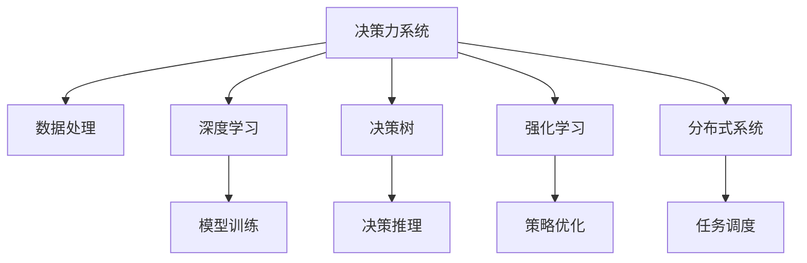

                 

# 思维体系:决策力的基石

> 关键词：决策力,人工智能,深度学习,思维模型,人机交互,自动化决策,优化算法

## 1. 背景介绍

### 1.1 问题由来

在当今这个快速变化的世界中，面对复杂多变的决策环境，决策力已经成为个人和组织的核心竞争力。然而，传统的人工决策方法往往受限于人类的认知局限和经验限制，难以在高度不确定性、大规模数据和快速变化的环境中做出最优决策。随着人工智能技术的发展，尤其是深度学习在决策支持中的应用，使得自动化的决策能力成为可能。

深度学习作为人工智能的重要分支，通过构建复杂的神经网络模型，可以从海量数据中提取抽象的特征和模式，进而做出预测和决策。这一技术在自然语言处理、图像识别、语音识别等领域取得了巨大成功。

本文聚焦于如何构建和应用高效的思维模型，特别是基于深度学习的决策力系统，以期提升个人和组织在复杂环境中的决策效率和质量。

### 1.2 问题核心关键点

构建高效决策力系统的核心关键点在于：
- **决策模型的选择与设计**：选择合适的深度学习模型和架构，设计有效的决策逻辑和规则。
- **数据与特征工程**：收集、处理和选择合适的数据，进行特征工程，提取对决策有用的特征。
- **模型训练与优化**：使用适当的损失函数和优化算法，训练和优化决策模型。
- **模型应用与部署**：将训练好的模型应用到实际决策场景中，并进行必要的调整和优化。
- **人机交互与解释性**：设计易于理解且可解释的交互界面，实现人机协同决策。

本文将从这些关键点出发，全面探讨基于深度学习的决策力系统的构建与实践。

## 2. 核心概念与联系

### 2.1 核心概念概述

为更好地理解基于深度学习的决策力系统，本节将介绍几个密切相关的核心概念：

- **决策力系统(Decision-Making System)**：一个集成数据处理、模型训练、决策推理和人机交互的系统，能够自动或半自动地从数据中提取决策依据，辅助决策者做出最优决策。

- **深度学习(Deep Learning)**：一类基于多层神经网络的机器学习技术，通过从数据中学习抽象的特征表示，进行复杂模式识别和预测。

- **决策树(Decision Tree)**：一种基于树形结构的决策模型，通过一系列的决策节点和结果节点，形成从数据到决策的映射路径。

- **强化学习(Reinforcement Learning, RL)**：一种通过试错反馈机制，不断优化策略以实现特定目标的学习方法。

- **分布式系统(Distributed System)**：一种将计算任务分散到多个节点上执行的系统架构，能够提升系统的并行处理能力和稳定性。

这些核心概念之间的逻辑关系可以通过以下Mermaid流程图来展示：



这个流程图展示了几类决策支持技术的核心组件及其之间的关系：

1. **数据处理**：为深度学习模型提供数据支持，包含数据清洗、特征提取等环节。
2. **模型训练**：利用数据训练深度学习模型，进行参数优化。
3. **决策推理**：将训练好的模型应用于实际决策场景，进行预测和决策。
4. **策略优化**：通过强化学习等方法，不断优化决策策略。
5. **任务调度**：在分布式系统中，合理分配计算任务，提升系统效率和稳定性。

这些组件共同构成了高效的决策力系统，通过深度学习技术，能够在各种复杂场景中提供高精度的决策支持。

## 3. 核心算法原理 & 具体操作步骤

### 3.1 算法原理概述

基于深度学习的决策力系统，主要利用多层神经网络进行决策推理。其核心思想是：通过从数据中学习抽象的特征表示，构建决策模型，并利用训练好的模型进行预测和决策。

形式化地，假设输入数据为 $x$，决策模型为 $M_{\theta}$，其中 $\theta$ 为模型参数。决策目标为 $y$，则决策过程可以表示为：

$$
y = M_{\theta}(x)
$$

其中 $M_{\theta}$ 是一个复杂的非线性映射函数，能够从输入数据中提取高层次的特征表示，并进行决策映射。

### 3.2 算法步骤详解

基于深度学习的决策力系统的构建通常包括以下几个关键步骤：

**Step 1: 数据准备与特征工程**
- 收集和清洗决策相关的数据，如历史交易记录、用户行为数据等。
- 提取有用的特征，如时间、地点、用户特征等，构建特征向量。
- 使用PCA、LDA等降维技术，简化数据表示，减少计算复杂度。

**Step 2: 选择模型架构**
- 选择合适的深度学习模型，如卷积神经网络(CNN)、循环神经网络(RNN)、长短期记忆网络(LSTM)等，根据决策任务的特点进行模型设计。
- 确定模型的输入、输出层结构和隐藏层数量，选择合适的激活函数和损失函数。

**Step 3: 模型训练**
- 利用训练集对模型进行训练，最小化损失函数。
- 使用随机梯度下降(SGD)、Adam等优化算法更新模型参数。
- 进行交叉验证，防止过拟合，评估模型的泛化能力。

**Step 4: 模型评估与优化**
- 在验证集上评估模型性能，使用准确率、召回率、F1分数等指标。
- 调整模型超参数，如学习率、批大小、隐藏层大小等，进一步优化模型。
- 引入正则化技术，如L2正则、Dropout等，避免过拟合。

**Step 5: 模型应用与部署**
- 将训练好的模型应用到实际决策场景中，进行预测和决策。
- 使用API接口或插件，将模型集成到业务系统中。
- 在实际运行中，根据反馈数据和环境变化，不断调整和优化模型。

### 3.3 算法优缺点

基于深度学习的决策力系统具有以下优点：
1. 能够处理大规模数据和高维特征，提取高层次的抽象表示。
2. 具有较强的泛化能力，适用于各种复杂决策场景。
3. 可以集成多个模型，形成多模态决策支持。
4. 具备一定的解释性，通过可视化技术可以查看模型的决策过程。

同时，该方法也存在一定的局限性：
1. 对数据质量和特征工程依赖较大，需要大量的标注数据和专业技能。
2. 模型复杂度高，计算资源消耗大。
3. 解释性不足，难以理解模型内部决策逻辑。
4. 容易受到数据噪声和异常值的影响。

尽管存在这些局限性，但就目前而言，基于深度学习的决策力系统仍是最先进的决策支持技术之一。未来相关研究的重点在于如何进一步降低对数据和特征工程的依赖，提高模型的鲁棒性和解释性。

### 3.4 算法应用领域

基于深度学习的决策力系统已经在金融风控、推荐系统、医疗诊断等多个领域得到了广泛应用，涵盖了决策模型的训练、应用和优化等全过程。

在金融风控领域，基于深度学习的决策力系统可以用于信用评分、欺诈检测、风险评估等任务，通过学习历史交易数据和用户行为，构建风险预测模型。

在推荐系统领域，决策力系统能够根据用户的历史行为和当前需求，推荐个性化的商品或服务，提升用户体验和满意度。

在医疗诊断领域，系统可以通过分析患者的病历、实验室检查等数据，辅助医生进行疾病诊断和治疗方案推荐，提高诊断的准确性和效率。

除了这些传统应用外，基于深度学习的决策力系统还在智能交通、智慧城市、环境保护等新兴领域中发挥了重要作用，为各种决策支持任务提供了新的解决方案。

## 4. 数学模型和公式 & 详细讲解 & 举例说明

### 4.1 数学模型构建

本节将使用数学语言对基于深度学习的决策力系统进行更加严格的刻画。

假设决策力系统的输入为 $x$，输出为 $y$，决策模型为 $M_{\theta}$，其中 $\theta$ 为模型参数。定义损失函数为 $\ell$，用于衡量模型预测和真实标签之间的差异。

决策过程可以表示为：

$$
y = M_{\theta}(x)
$$

目标是最小化损失函数：

$$
\min_{\theta} \ell(M_{\theta}(x), y)
$$

其中 $\ell$ 可以是交叉熵损失、均方误差损失等。

### 4.2 公式推导过程

以下我们以二分类任务为例，推导交叉熵损失函数及其梯度的计算公式。

假设模型 $M_{\theta}$ 在输入 $x$ 上的输出为 $\hat{y}=M_{\theta}(x) \in [0,1]$，表示样本属于正类的概率。真实标签 $y \in \{0,1\}$。则二分类交叉熵损失函数定义为：

$$
\ell(M_{\theta}(x),y) = -[y\log \hat{y} + (1-y)\log (1-\hat{y})]
$$

将其代入损失函数，得：

$$
\mathcal{L}(\theta) = -\frac{1}{N}\sum_{i=1}^N [y_i\log M_{\theta}(x_i)+(1-y_i)\log(1-M_{\theta}(x_i))]
$$

根据链式法则，损失函数对参数 $\theta_k$ 的梯度为：

$$
\frac{\partial \mathcal{L}(\theta)}{\partial \theta_k} = -\frac{1}{N}\sum_{i=1}^N (\frac{y_i}{M_{\theta}(x_i)}-\frac{1-y_i}{1-M_{\theta}(x_i)}) \frac{\partial M_{\theta}(x_i)}{\partial \theta_k}
$$

其中 $\frac{\partial M_{\theta}(x_i)}{\partial \theta_k}$ 可进一步递归展开，利用自动微分技术完成计算。

在得到损失函数的梯度后，即可带入参数更新公式，完成模型的迭代优化。重复上述过程直至收敛，最终得到适应决策场景的最优模型参数 $\theta^*$。

### 4.3 案例分析与讲解

以信用评分为例，分析基于深度学习的决策力系统的构建过程：

**数据准备**：
- 收集历史信用数据，包括用户的基本信息、交易记录、逾期情况等。
- 提取特征，如年龄、收入、交易金额、还款期限等，构建特征向量。
- 使用PCA等降维技术简化数据表示。

**模型选择**：
- 选择合适的深度学习模型，如多层感知器(MLP)、卷积神经网络(CNN)、循环神经网络(RNN)等。
- 设计输入层、隐藏层和输出层，选择合适的激活函数和损失函数。

**模型训练**：
- 使用训练集对模型进行训练，最小化损失函数。
- 使用SGD、Adam等优化算法更新模型参数。
- 进行交叉验证，防止过拟合，评估模型的泛化能力。

**模型评估**：
- 在验证集上评估模型性能，使用准确率、召回率、F1分数等指标。
- 调整模型超参数，如学习率、批大小、隐藏层大小等，进一步优化模型。
- 引入正则化技术，如L2正则、Dropout等，避免过拟合。

**模型应用**：
- 将训练好的模型应用到新用户的信用评分任务中，进行预测。
- 使用API接口或插件，将模型集成到信用评分系统中。
- 在实际运行中，根据反馈数据和环境变化，不断调整和优化模型。

通过以上步骤，可以构建一个高效的基于深度学习的决策力系统，为信用评分任务提供高精度的决策支持。

## 5. 项目实践：代码实例和详细解释说明

### 5.1 开发环境搭建

在进行决策力系统的开发实践前，我们需要准备好开发环境。以下是使用Python进行TensorFlow开发的环境配置流程：

1. 安装Anaconda：从官网下载并安装Anaconda，用于创建独立的Python环境。

2. 创建并激活虚拟环境：
```bash
conda create -n tf-env python=3.8 
conda activate tf-env
```

3. 安装TensorFlow：从官网获取对应的安装命令。例如：
```bash
conda install tensorflow -c pytorch -c conda-forge
```

4. 安装Keras：
```bash
pip install keras
```

5. 安装各类工具包：
```bash
pip install numpy pandas scikit-learn matplotlib tqdm jupyter notebook ipython
```

完成上述步骤后，即可在`tf-env`环境中开始决策力系统的开发。

### 5.2 源代码详细实现

下面我以信用评分任务为例，给出使用TensorFlow进行决策力系统开发的完整代码实现。

首先，定义模型类：

```python
import tensorflow as tf
from tensorflow.keras.models import Sequential
from tensorflow.keras.layers import Dense

class CreditScoringModel:
    def __init__(self, input_dim, output_dim, hidden_units):
        self.input_dim = input_dim
        self.output_dim = output_dim
        self.hidden_units = hidden_units
        
        self.model = Sequential([
            Dense(hidden_units, input_dim=input_dim, activation='relu'),
            Dense(hidden_units, activation='relu'),
            Dense(output_dim, activation='sigmoid')
        ])
        
    def compile_model(self, optimizer='adam', loss='binary_crossentropy'):
        self.model.compile(optimizer=optimizer, loss=loss)
        
    def train_model(self, x_train, y_train, x_val, y_val, epochs=10, batch_size=32):
        self.model.fit(x_train, y_train, validation_data=(x_val, y_val), epochs=epochs, batch_size=batch_size)
        
    def evaluate_model(self, x_val, y_val):
        loss, accuracy = self.model.evaluate(x_val, y_val)
        return accuracy
        
    def predict(self, x):
        return self.model.predict(x)
```

然后，定义数据处理函数：

```python
import pandas as pd
from sklearn.model_selection import train_test_split
from sklearn.preprocessing import StandardScaler

def preprocess_data(df):
    features = df.drop('label', axis=1)
    target = df['label']
    
    features = StandardScaler().fit_transform(features)
    return features, target
    
def load_data(file_path):
    data = pd.read_csv(file_path)
    features, target = preprocess_data(data)
    
    X_train, X_val, y_train, y_val = train_test_split(features, target, test_size=0.2, random_state=42)
    X_train = X_train.reshape((-1, 1))
    X_val = X_val.reshape((-1, 1))
    
    return X_train, y_train, X_val, y_val
```

接着，定义训练和评估函数：

```python
def train_and_evaluate_model(model, x_train, y_train, x_val, y_val):
    model.compile_model(optimizer='adam', loss='binary_crossentropy')
    
    model.train_model(x_train, y_train, x_val, y_val)
    
    accuracy = model.evaluate_model(x_val, y_val)
    print(f"Validation accuracy: {accuracy:.3f}")
    
    return model
```

最后，启动训练流程并在验证集上评估：

```python
X_train, y_train, X_val, y_val = load_data('credit_data.csv')

model = CreditScoringModel(input_dim=10, output_dim=1, hidden_units=64)
train_and_evaluate_model(model, X_train, y_train, X_val, y_val)
```

以上就是使用TensorFlow进行决策力系统开发的完整代码实现。可以看到，TensorFlow提供了强大的模型构建和训练工具，使得决策力系统的构建变得更加高效和灵活。

### 5.3 代码解读与分析

让我们再详细解读一下关键代码的实现细节：

**CreditScoringModel类**：
- `__init__`方法：初始化模型的输入、输出维度和隐藏层大小，构建多层感知器模型。
- `compile_model`方法：编译模型，设置优化器和损失函数。
- `train_model`方法：使用训练集对模型进行训练，设置训练轮数和批次大小。
- `evaluate_model`方法：在验证集上评估模型性能，返回准确率。
- `predict`方法：对新的输入数据进行预测。

**preprocess_data和load_data函数**：
- `preprocess_data`函数：对数据进行标准化处理，返回特征和标签。
- `load_data`函数：从数据文件中加载数据，并进行数据分割、标准化和重塑。

**train_and_evaluate_model函数**：
- 将模型编译、训练和评估的过程封装在一个函数中，方便复用。

通过以上代码实现，可以构建一个高效的基于深度学习的决策力系统，为信用评分任务提供高精度的决策支持。

## 6. 实际应用场景

### 6.1 智能客服系统

基于深度学习的决策力系统可以广泛应用于智能客服系统的构建。传统客服往往需要配备大量人力，高峰期响应缓慢，且一致性和专业性难以保证。而使用决策力系统的智能客服系统，可以7x24小时不间断服务，快速响应客户咨询，用自然流畅的语言解答各类常见问题。

在技术实现上，可以收集企业内部的历史客服对话记录，将问题和最佳答复构建成监督数据，在此基础上对决策力系统进行训练。训练好的系统能够自动理解用户意图，匹配最合适的答案模板进行回复。对于客户提出的新问题，还可以接入检索系统实时搜索相关内容，动态组织生成回答。如此构建的智能客服系统，能大幅提升客户咨询体验和问题解决效率。

### 6.2 金融舆情监测

金融机构需要实时监测市场舆论动向，以便及时应对负面信息传播，规避金融风险。传统的人工监测方式成本高、效率低，难以应对网络时代海量信息爆发的挑战。基于深度学习的决策力系统，可以在实时抓取的网络文本数据上运行，通过分析舆情信息，预测市场趋势，帮助机构规避风险。

具体而言，可以收集金融领域相关的新闻、报道、评论等文本数据，并对其进行主题标注和情感标注。在此基础上对决策力系统进行训练，使其能够自动判断文本属于何种主题，情感倾向是正面、中性还是负面。将训练好的系统应用到实时抓取的网络文本数据上，就能够自动监测不同主题下的情感变化趋势，一旦发现负面信息激增等异常情况，系统便会自动预警，帮助机构快速应对潜在风险。

### 6.3 个性化推荐系统

当前的推荐系统往往只依赖用户的历史行为数据进行物品推荐，无法深入理解用户的真实兴趣偏好。基于深度学习的决策力系统可以更好地挖掘用户行为背后的语义信息，从而提供更精准、多样的推荐内容。

在实践中，可以收集用户浏览、点击、评论、分享等行为数据，提取和用户交互的物品标题、描述、标签等文本内容。将文本内容作为模型输入，用户的后续行为（如是否点击、购买等）作为监督信号，在此基础上训练决策力系统。训练好的系统能够从文本内容中准确把握用户的兴趣点。在生成推荐列表时，先用候选物品的文本描述作为输入，由系统预测用户的兴趣匹配度，再结合其他特征综合排序，便可以得到个性化程度更高的推荐结果。

### 6.4 未来应用展望

随着深度学习技术的发展，基于决策力系统的决策支持将逐渐覆盖更多领域，为各行各业提供高效、可靠、可解释的决策服务。

在智慧医疗领域，基于决策力系统的医疗问答、病历分析、药物研发等应用将提升医疗服务的智能化水平，辅助医生诊疗，加速新药开发进程。

在智能教育领域，决策力系统可应用于作业批改、学情分析、知识推荐等方面，因材施教，促进教育公平，提高教学质量。

在智慧城市治理中，决策力系统可应用于城市事件监测、舆情分析、应急指挥等环节，提高城市管理的自动化和智能化水平，构建更安全、高效的未来城市。

此外，在企业生产、社会治理、文娱传媒等众多领域，基于深度学习的决策力系统也将不断涌现，为传统行业数字化转型升级提供新的技术路径。相信随着技术的日益成熟，决策力系统将成为人工智能落地应用的重要范式，推动人工智能技术向更广阔的领域加速渗透。

## 7. 工具和资源推荐

### 7.1 学习资源推荐

为了帮助开发者系统掌握深度学习在决策支持中的应用，这里推荐一些优质的学习资源：

1. **《深度学习》课程**：斯坦福大学李飞飞教授主讲，系统介绍了深度学习的基本概念、算法和应用。

2. **《TensorFlow实战》书籍**：深入浅出地介绍了TensorFlow的用法和实践案例，适合初学者和有一定基础的开发者。

3. **Kaggle竞赛平台**：提供了丰富的数据集和竞赛项目，通过参与实践，提升决策力系统的构建能力。

4. **《深度学习框架设计与实现》书籍**：详细介绍了深度学习框架的原理和实现方法，适合深入学习深度学习框架的开发者。

5. **Coursera《机器学习》课程**：由Andrew Ng教授主讲，介绍了机器学习的基本概念和算法，适合初学者和有一定基础的开发者。

通过对这些资源的学习实践，相信你一定能够快速掌握深度学习在决策支持中的应用，并用于解决实际的决策问题。

### 7.2 开发工具推荐

高效的开发离不开优秀的工具支持。以下是几款用于深度学习决策力系统开发的常用工具：

1. **TensorFlow**：由Google主导开发的开源深度学习框架，生产部署方便，适合大规模工程应用。

2. **Keras**：高层次的深度学习框架，简单易用，适合快速迭代研究。

3. **PyTorch**：由Facebook主导开发的深度学习框架，灵活高效，适合研究和生产应用。

4. **Jupyter Notebook**：交互式的编程环境，支持Python、R等多种语言，适合代码开发和数据分析。

5. **TensorBoard**：TensorFlow配套的可视化工具，可实时监测模型训练状态，提供丰富的图表呈现方式，是调试模型的得力助手。

6. **Kaggle**：数据科学竞赛平台，提供丰富的数据集和竞赛项目，帮助开发者提升决策力系统的构建能力。

合理利用这些工具，可以显著提升决策力系统的开发效率，加快创新迭代的步伐。

### 7.3 相关论文推荐

深度学习在决策支持领域的研究源于学界的持续研究。以下是几篇奠基性的相关论文，推荐阅读：

1. **《神经网络与深度学习》**：Ian Goodfellow、Yoshua Bengio、Aaron Courville合著的经典教材，系统介绍了神经网络的基本概念、算法和应用。

2. **《深度学习在金融风控中的应用》**：通过分析金融风控领域的应用案例，探讨了深度学习在信用评分、欺诈检测、风险评估等方面的应用。

3. **《深度学习在推荐系统中的应用》**：介绍了深度学习在推荐系统中的应用，包括协同过滤、深度神经网络等方法。

4. **《深度学习在医疗诊断中的应用》**：分析了深度学习在医疗诊断领域的应用，包括疾病预测、图像识别等任务。

5. **《分布式深度学习系统》**：介绍了分布式深度学习系统的设计与实现方法，适合对分布式计算有需求的应用场景。

这些论文代表了大深度学习在决策支持领域的最新进展，通过学习这些前沿成果，可以帮助研究者把握学科前进方向，激发更多的创新灵感。

## 8. 总结：未来发展趋势与挑战

### 8.1 总结

本文对基于深度学习的决策力系统进行了全面系统的介绍。首先阐述了深度学习在决策支持中的应用背景和重要性，明确了决策力系统在复杂决策场景中的核心价值。其次，从原理到实践，详细讲解了决策力系统的构建步骤和实现方法，给出了决策力系统开发的完整代码实例。同时，本文还探讨了决策力系统在金融风控、推荐系统、医疗诊断等多个领域的应用前景，展示了深度学习在决策支持领域的广阔应用空间。此外，本文精选了决策力系统的各类学习资源，力求为读者提供全方位的技术指引。

通过本文的系统梳理，可以看到，基于深度学习的决策力系统正在成为决策支持技术的核心范式，极大地提升了决策的效率和质量。随着深度学习技术的发展，决策力系统将在更多领域得到应用，为各种决策支持任务提供新的解决方案。

### 8.2 未来发展趋势

展望未来，基于深度学习的决策力系统将呈现以下几个发展趋势：

1. **模型复杂度增加**：随着模型架构的不断优化和特征工程的深入挖掘，决策力系统的复杂度将进一步提升。深度神经网络、卷积神经网络、递归神经网络等复杂模型将得到更广泛的应用。

2. **多模态融合**：决策力系统将从单一的文本数据，扩展到包含图像、语音、视频等多模态数据，提高系统的综合决策能力。

3. **分布式训练**：决策力系统将更多地采用分布式训练技术，通过多个节点的协同计算，提高训练效率和模型性能。

4. **实时决策**：通过引入在线学习和增量学习技术，决策力系统将具备实时决策能力，能够快速适应环境变化和数据更新。

5. **自适应决策**：决策力系统将引入自适应算法，根据用户反馈和环境变化，动态调整模型参数，提高决策的灵活性和鲁棒性。

6. **解释性增强**：决策力系统将更加注重可解释性，通过可视化技术展示决策过程，增强系统的可信度和透明度。

以上趋势凸显了基于深度学习的决策力系统的广阔前景。这些方向的探索发展，必将进一步提升决策力系统的性能和应用范围，为决策支持领域带来新的变革。

### 8.3 面临的挑战

尽管基于深度学习的决策力系统已经取得了显著成果，但在迈向更加智能化、普适化应用的过程中，它仍面临着诸多挑战：

1. **数据质量问题**：决策力系统对数据质量和标注数据的依赖较大，数据噪声和异常值可能会影响模型性能。如何获取高质量、多样化的数据，进行有效的特征工程，仍然是一个重要挑战。

2. **计算资源需求高**：深度学习模型的训练和推理计算资源消耗大，需要高性能计算设备和分布式系统支持。如何在有限的计算资源下，提高模型的性能和效率，仍然是一个重要问题。

3. **解释性不足**：深度学习模型通常被视为“黑盒”系统，难以解释其内部决策逻辑。如何设计易于理解的交互界面，增强系统的可解释性和透明度，仍是一个重要挑战。

4. **鲁棒性问题**：决策力系统面对数据分布变化和异常数据时，可能出现鲁棒性不足的问题。如何提高模型的泛化能力和鲁棒性，增强系统的稳定性，仍然是一个重要问题。

5. **安全性和隐私问题**：深度学习模型可能会学习到敏感信息，对用户隐私构成威胁。如何保护数据隐私和安全，确保模型输出符合伦理道德，仍然是一个重要问题。

6. **复杂性管理**：深度学习模型和决策力系统设计复杂，需要大量的人工干预和调试。如何降低系统的复杂性，提高开发效率，仍然是一个重要问题。

正视决策力系统面临的这些挑战，积极应对并寻求突破，将是大深度学习在决策支持领域走向成熟的必由之路。相信随着学界和产业界的共同努力，这些挑战终将一一被克服，决策力系统必将在构建人机协同的智能决策系统中扮演越来越重要的角色。

### 8.4 研究展望

面向未来，基于深度学习的决策力系统需要从以下几个方面寻求新的突破：

1. **强化学习在决策中的应用**：将强化学习与深度学习结合，提升决策力系统的自适应能力和鲁棒性。

2. **模型压缩与优化**：通过模型压缩、稀疏化存储等方法，提高决策力系统的计算效率和推理速度。

3. **分布式系统的优化**：进一步优化分布式系统的设计和算法，提高系统的并行处理能力和稳定性。

4. **可解释性增强**：引入因果分析和博弈论工具，增强决策力系统的解释性和透明度。

5. **多模态融合**：将不同模态的数据整合到决策力系统中，提高系统的综合决策能力。

6. **伦理与安全约束**：引入伦理导向的评估指标，过滤和惩罚有偏见、有害的输出倾向，确保模型输出符合伦理道德。

这些研究方向的探索，必将引领基于深度学习的决策力系统迈向更高的台阶，为决策支持领域带来新的变革。面向未来，深度学习在决策支持领域的研究和应用将继续深化，推动决策力系统向更加高效、可靠、可解释、可控的方向发展。

## 9. 附录：常见问题与解答

**Q1：什么是决策力系统？**

A: 决策力系统是一个集成数据处理、模型训练、决策推理和人机交互的系统，能够自动或半自动地从数据中提取决策依据，辅助决策者做出最优决策。

**Q2：如何选择合适的深度学习模型进行决策力系统的构建？**

A: 选择合适的深度学习模型需要考虑决策任务的特点和数据特征。常用的模型包括多层感知器(MLP)、卷积神经网络(CNN)、循环神经网络(RNN)等。在选择模型时，需要考虑模型的输入输出层结构、隐藏层大小、激活函数和损失函数等。

**Q3：如何提高决策力系统的鲁棒性和泛化能力？**

A: 提高决策力系统的鲁棒性和泛化能力，需要从数据质量、模型复杂度、正则化技术、增量学习等方面入手。选择高质量、多样化的数据，进行有效的特征工程；使用复杂的模型架构，引入正则化技术和增量学习算法，如dropout、L2正则、early stopping等；引入对抗样本训练，提高模型的鲁棒性。

**Q4：如何增强决策力系统的解释性和透明度？**

A: 增强决策力系统的解释性和透明度，需要引入可视化技术和因果分析方法，展示决策过程和决策依据。例如，使用SHAP、LIME等工具进行模型解释，引入因果推断和博弈论思想，分析决策过程和决策逻辑。

**Q5：如何保护决策力系统的数据隐私和安全？**

A: 保护决策力系统的数据隐私和安全，需要采用数据脱敏、加密、访问控制等技术。对敏感数据进行脱敏处理，确保数据不被泄露；使用数据加密技术，保护数据传输和存储安全；采用访问控制技术，限制对数据的访问权限，防止数据滥用。

通过以上常见问题的解答，相信读者能够更加全面地理解基于深度学习的决策力系统的构建和应用。

---

作者：禅与计算机程序设计艺术 / Zen and the Art of Computer Programming

