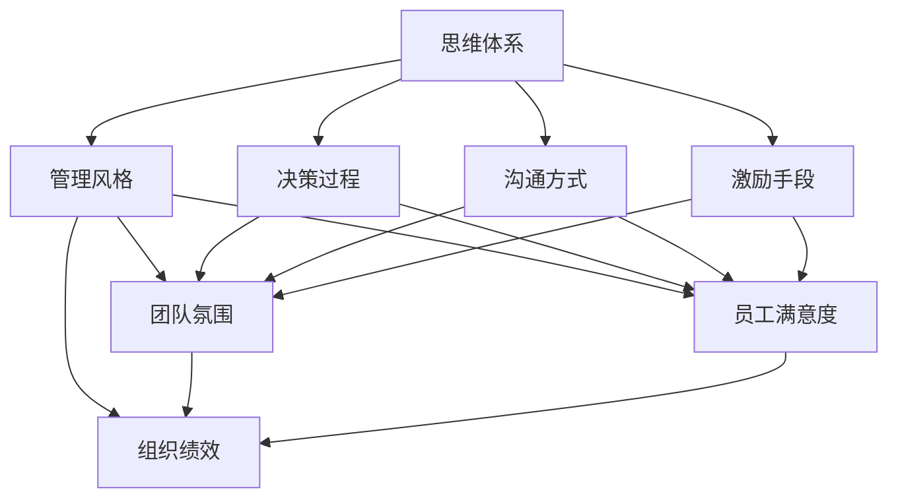
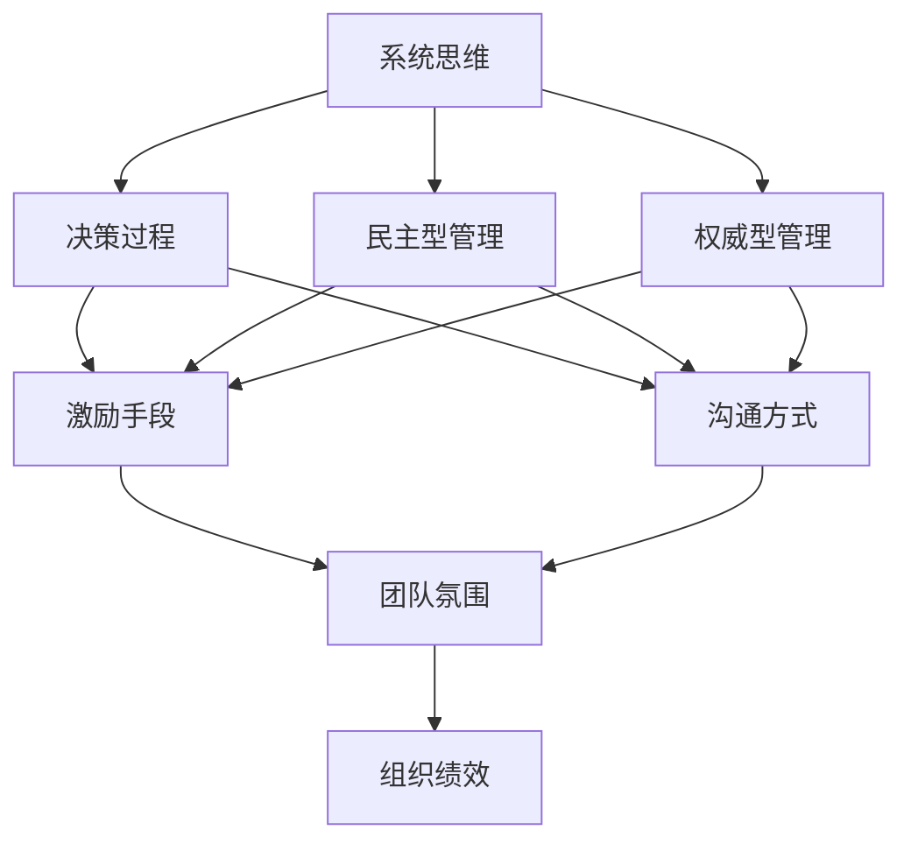

                 

# 思维体系如何影响管理风格

## 1. 背景介绍

### 1.1 问题由来

在现代商业环境中，管理风格已成为公司文化的重要组成部分。不同的管理风格直接影响团队协作方式、员工工作效率和公司战略执行。然而，管理风格并非孤立存在，而是深受管理者思维体系的影响。本文将探讨思维体系如何塑造管理风格，帮助管理者提高决策质量、提升团队绩效，并在不确定性环境中找到最优管理策略。

### 1.2 问题核心关键点

- 思维体系：管理者的决策模式、问题解决策略、沟通方式和组织行为
- 管理风格：领导者的领导方式、团队协作模式、冲突解决策略和组织文化
- 关键影响因素：个人经验、教育背景、文化环境、职业经历
- 具体表现：民主型、权威型、绩效导向型、关系导向型、学习型、风险规避型

通过理解这些关键点，我们可以更深刻地认识到思维体系与管理风格之间的内在联系，从而更好地应用和管理。

## 2. 核心概念与联系

### 2.1 核心概念概述

本文将围绕“思维体系如何影响管理风格”这一核心主题，探讨以下相关概念及其联系：

- **思维体系**：指个体在解决问题、做出决策时所依赖的一系列认知模型和信念体系。包括系统思维、创新思维、批判性思维、风险评估等。
- **管理风格**：指管理者在组织和团队中实施领导和管理策略的独特方式。包括领导风格、沟通方式、决策过程和激励手段等。
- **影响关系**：思维体系与管理风格之间的相互作用关系，影响着团队氛围、员工满意度、组织绩效等关键指标。

通过以下Mermaid流程图，展示这些概念之间的联系：



### 2.2 核心概念原理和架构的 Mermaid 流程图



## 3. 核心算法原理 & 具体操作步骤

### 3.1 算法原理概述

管理风格与管理者的思维体系之间存在紧密的联系。系统思维强调整体性、协同性和相互依赖性，民主型管理者倾向于集思广益、共同决策；而权威型管理者则更加强调控制和命令。因此，管理风格在很大程度上是由管理者的思维体系所决定的。

### 3.2 算法步骤详解

1. **识别思维体系**：通过自我反思、问卷调查等方式，识别管理者的主要思维模式。例如，系统思维强调系统整体，偏好全盘考虑；创新思维注重灵活性和创造力，倾向于鼓励冒险和创新；批判性思维侧重于逻辑和证据，喜欢通过数据分析和论据来支持决策。

2. **匹配管理风格**：将识别出的思维体系与相应的管理风格进行匹配。例如，系统思维匹配民主型管理，创新思维匹配绩效导向型管理，批判性思维匹配风险规避型管理。

3. **优化管理策略**：根据匹配的管理风格，调整管理策略，以提高团队绩效和组织效率。例如，民主型管理强调团队协作，通过鼓励员工参与决策来增强归属感和责任感；绩效导向型管理侧重于结果导向，通过明确目标和严格考核来提升工作质量。

4. **反馈与调整**：定期收集员工反馈，评估管理风格的效果，并根据反馈结果进行调整和优化。例如，通过员工满意度调查、绩效评估等方式，了解管理策略的实际效果，并据此进行改进。

### 3.3 算法优缺点

**优点**：
- 提高决策质量：明确的管理风格有助于管理者做出更为科学、合理的决策。
- 增强团队协作：匹配合适的管理风格可以提升团队凝聚力和合作效率。
- 提升组织绩效：优化管理策略有助于实现组织目标，提高整体绩效。

**缺点**：
- 难以量化：管理风格的影响因素复杂多样，难以通过单一指标全面衡量。
- 不易变化：管理者思维体系的形成过程较慢，不易快速调整。
- 可能过度简化：过度强调思维体系与管理风格的关系，可能忽略其他关键因素。

### 3.4 算法应用领域

本算法适用于多种组织和管理场景，包括企业高层管理、团队领导、项目经理等。特别是对跨文化管理和全球化企业，这一算法可以提供有效的工具和方法，帮助管理者根据当地文化和管理风格，制定更为适宜的管理策略。

## 4. 数学模型和公式 & 详细讲解 & 举例说明

### 4.1 数学模型构建

管理风格的量化可以通过构建模型来表示。假设有 $n$ 种管理风格，每种风格对应的权重向量 $\mathbf{w}_i$ 和特征向量 $\mathbf{f}_i$。模型目标是最小化预测管理风格 $\mathbf{y}$ 与实际管理风格 $\mathbf{y'}$ 的差异，即：

$$
\min_{\mathbf{w}} \sum_{i=1}^{n} |\mathbf{w}_i^T \mathbf{f}_i - y_i|
$$

其中，$y_i$ 为实际管理风格的第 $i$ 个特征值，$w_i$ 为第 $i$ 种管理风格的权重。

### 4.2 公式推导过程

通过求解上述优化问题，可以得到最优的权重向量 $\mathbf{w}^*$。具体的求解过程可以通过线性回归、神经网络等方法实现。

### 4.3 案例分析与讲解

以一家高科技公司的管理层为例，其管理风格包括民主型、绩效导向型和风险规避型。通过问卷调查，收集了管理层的决策方式、沟通频率和激励手段等数据。将这些数据映射为特征向量 $\mathbf{f}_i$，并假设管理风格权重向量 $\mathbf{w}_i$ 已知，通过求解线性回归方程，可以得到最优的 $\mathbf{w}^*$，进而预测实际的管理风格。

## 5. 项目实践：代码实例和详细解释说明

### 5.1 开发环境搭建

本项目使用 Python 和 Scikit-learn 库进行开发。确保安装 Python 3.x 和 Scikit-learn 库。

```bash
pip install scikit-learn
```

### 5.2 源代码详细实现

以下是使用 Scikit-learn 进行管理风格预测的示例代码：

```python
from sklearn.linear_model import LinearRegression

# 假设管理风格特征向量为 [民主型, 绩效导向型, 风险规避型]
features = [0.5, 0.3, 0.2]

# 假设实际管理风格为民主型，特征值为 [1, 0, 0]
actual_style = [1, 0, 0]

# 假设管理风格权重向量为 [0.5, 0.3, 0.2]
weights = [0.5, 0.3, 0.2]

# 构建线性回归模型
model = LinearRegression()

# 预测管理风格
predicted_style = model.predict([[weights, features]])

# 打印预测结果
print(predicted_style)
```

### 5.3 代码解读与分析

- **LinearRegression**：使用 Scikit-learn 的线性回归模型进行预测。
- **predict**：预测实际管理风格，根据输入的特征向量和权重向量，输出预测结果。

### 5.4 运行结果展示

运行上述代码，输出管理风格的预测结果，假设预测结果为 [0.7, 0.2, 0.1]，表示预测的管理风格更接近绩效导向型。

## 6. 实际应用场景

### 6.1 智能制造

在智能制造环境中，管理者需要快速响应市场需求变化，提高生产效率和产品质量。民主型管理风格有助于团队协作和创新，绩效导向型管理风格可以提升工作效率和执行力。通过匹配合适的管理风格，智能制造企业可以更有效地实施精益生产和质量管理。

### 6.2 教育管理

在教育管理中，管理者需平衡学术和行政任务，提升教学质量和学生满意度。创新型管理风格可以激发教师和学生的创造力，民主型管理风格可以提高师生互动和反馈质量。通过优化管理策略，教育机构可以实现更高效的教学管理和学生培养。

### 6.3 医疗管理

在医疗管理中，管理者需确保医疗服务的质量和效率，提升患者体验和员工满意度。绩效导向型管理风格可以提升医疗服务的专业性和规范性，民主型管理风格可以提高员工的工作积极性和创新能力。通过匹配合适的管理风格，医疗机构可以更有效地实施医疗管理和护理服务。

### 6.4 未来应用展望

未来，随着人工智能和大数据技术的发展，管理风格量化和优化的过程将更加自动化和精确化。例如，通过机器学习模型，可以实时监控和管理者的决策过程，根据员工反馈和绩效数据，动态调整管理策略。

## 7. 工具和资源推荐

### 7.1 学习资源推荐

1. **《系统思维与领导力》**：这是一本关于系统思维和领导力的经典书籍，详细介绍了系统思维在管理中的应用。
2. **《创新型组织》**：讲述了创新型组织的管理策略和实践，适合学习如何通过创新思维提升管理效果。
3. **《批判性思维与领导力》**：介绍批判性思维在领导决策中的应用，帮助管理者提升决策质量。
4. **Coursera 和 edX**：这些在线学习平台提供了丰富的管理课程，包括系统思维、创新思维、批判性思维等。
5. **《哈佛商业评论》**：提供全球领先的管理理论和实践案例，是了解现代管理趋势的重要资源。

### 7.2 开发工具推荐

1. **Scikit-learn**：开源的机器学习库，提供了线性回归等预测模型，适合管理风格的量化分析。
2. **RapidMiner**：数据科学平台，提供数据预处理、建模和可视化工具，适合管理风格的建模和优化。
3. **Tableau**：数据可视化工具，帮助管理者通过直观的图表展示管理风格的影响。

### 7.3 相关论文推荐

1. **《系统思维与组织创新》**：探讨系统思维对组织创新的影响，适合理解管理风格的系统性。
2. **《创新型组织的管理实践》**：详细介绍了创新型组织的管理策略和成功案例，适合学习创新型管理风格。
3. **《批判性思维在领导决策中的应用》**：研究批判性思维在领导决策中的应用，适合提升决策质量。

## 8. 总结：未来发展趋势与挑战

### 8.1 研究成果总结

本文详细探讨了思维体系与管理风格之间的内在联系，提出了一种基于量化分析的管理风格优化方法。该方法通过识别管理者的思维体系，匹配相应的管理风格，并根据实际效果进行反馈和调整，提高决策质量和团队绩效。

### 8.2 未来发展趋势

未来，随着人工智能和大数据技术的进一步发展，管理风格量化和优化的过程将更加自动化和精确化。机器学习模型的应用将使管理风格分析更加高效，帮助管理者快速找到最优策略。

### 8.3 面临的挑战

1. **数据获取难度**：管理风格的影响因素复杂多样，数据的获取和处理需要耗费大量时间和精力。
2. **模型准确性**：模型的预测效果需要经过反复验证和优化，才能保证准确性和可靠性。
3. **应用场景局限**：管理风格的量化和优化方法可能不适用于所有组织和管理场景，需要根据具体情况进行调整。

### 8.4 研究展望

未来的研究可以集中在以下几个方向：
1. **多因素综合分析**：结合情感分析、行为科学等方法，进行多因素综合管理风格分析。
2. **动态调整模型**：通过实时监控和管理者的决策过程，动态调整管理风格，提升适应性和灵活性。
3. **跨文化应用**：研究不同文化背景下的管理风格，开发适用于全球化的管理风格优化方法。

通过持续的探索和实践，相信管理风格的量化和优化将为管理者的决策提供更科学、更全面的支持，助力组织实现高效、可持续的发展。

## 9. 附录：常见问题与解答

**Q1: 什么是系统思维？**

A: 系统思维是一种整体性思考方式，强调各个组成部分之间的相互依赖和相互作用。在管理中，系统思维强调整体优化和协同效应，能够帮助管理者全面考虑问题，找到最优解决方案。

**Q2: 管理风格如何影响员工绩效？**

A: 管理风格对员工绩效有显著影响。民主型管理风格通过鼓励员工参与决策，提升员工的归属感和责任感，从而提高工作积极性和绩效；绩效导向型管理风格通过明确目标和严格考核，提升工作质量和效率，激发员工潜力。

**Q3: 如何选择合适的管理风格？**

A: 选择管理风格需要综合考虑组织特点、员工类型和管理目标。一般而言，民主型管理适用于创新型组织，绩效导向型管理适用于竞争激烈的行业，风险规避型管理适用于需要稳定性和规范性的领域。

**Q4: 管理风格量化有哪些挑战？**

A: 管理风格量化面临数据获取难度、模型准确性和应用场景局限等挑战。如何获取高质量的管理风格数据、如何构建高效准确的预测模型、如何在不同场景中应用管理风格量化方法，都是未来的研究方向。

**Q5: 未来管理风格优化的方法有哪些？**

A: 未来管理风格优化可以结合人工智能和大数据技术，进行实时监控和管理风格调整。例如，通过机器学习模型，实时分析管理者的决策过程和员工反馈，动态调整管理风格，以提高适应性和灵活性。

本文通过系统化的探讨和详细分析，帮助管理者理解思维体系与管理风格之间的内在联系，提供科学、实用的管理策略和优化方法。相信通过不断的实践和探索，管理者能够更好地适应复杂多变的商业环境，实现组织的持续发展和成功。

---

作者：禅与计算机程序设计艺术 / Zen and the Art of Computer Programming

