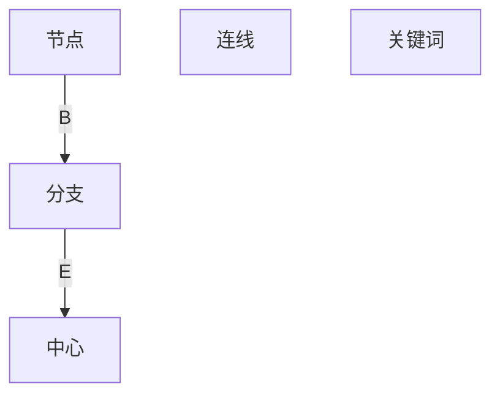

                 

# 思维导图：可视化思考的有效工具

> 关键词：思维导图,知识管理,认知提升,问题解决,创意激发

## 1. 背景介绍

### 1.1 问题由来
在信息爆炸的时代，人类每天都在处理海量信息。仅靠传统的线性思维模式，难以有效地整合和利用这些信息。这不仅导致信息处理的效率低下，还容易遗漏重要细节。为了应对这一挑战，一种新的信息处理方法——思维导图，应运而生。思维导图通过视觉化、结构化的方式，帮助人们更好地理解、记忆和处理信息。

### 1.2 问题核心关键点
思维导图的核心关键点包括：

- **视觉化呈现**：通过图形、颜色、线条等视觉元素，使得信息更加直观易记。
- **结构化组织**：通过分支、层级等结构，将信息组织成逻辑清晰的层次关系。
- **信息链接**：通过关键词、连线等元素，建立不同信息之间的关联，形成知识网络。
- **创意激发**：通过自由联想、发散思维等方法，激发新的想法和解决方案。
- **知识管理**：通过整理、分类、检索等操作，高效管理个人或团队的知识库。

## 2. 核心概念与联系

### 2.1 核心概念概述

思维导图是一个以节点和连线为基础，用于可视化信息的工具。其核心概念包括：

- **节点(Node)**：代表信息的基本单元，可以是概念、问题、方案等。
- **连线(Link)**：连接节点，表示不同信息之间的逻辑关系。
- **分支(Branch)**：从主节点延伸出的子节点，表示信息的细化或深化。
- **中心(Center)**：整个思维导图的核心，通常是最终目标或主题。
- **关键词(Keywords)**：简明扼要地概括节点内容，帮助快速理解信息。

### 2.2 核心概念原理和架构的 Mermaid 流程图(Mermaid 流程节点中不要有括号、逗号等特殊字符)



该图展示了思维导图的基本结构：节点通过连线连接，分支从节点延伸，最终汇聚于中心节点，每个节点用关键词简明扼要地描述信息。

## 3. 核心算法原理 & 具体操作步骤

### 3.1 算法原理概述

思维导图的主要算法原理包括以下几点：

- **节点创建与编辑**：用户可以根据需要创建、编辑节点，节点之间通过连线建立关联。
- **分支扩展**：节点可以拓展出多个子节点，形成层次结构，表示信息的不同层次。
- **关键词提取**：通过自然语言处理技术，自动提取节点的关键词，提高信息表达的准确性。
- **搜索与过滤**：用户可以输入关键词或短语，快速搜索和过滤思维导图中的节点。
- **合并与拆分**：用户可以将节点合并，或将分支拆分成多个节点，灵活调整思维导图结构。

### 3.2 算法步骤详解

思维导图的具体操作步骤包括：

1. **确定中心节点**：明确思维导图的核心主题，作为整个思维导图的中心。
2. **创建子节点**：围绕中心节点，创建多个子节点，表示与中心相关的不同方面或细节。
3. **拓展分支**：对每个子节点，进一步创建子节点，形成多级分支，表示信息的层次和细化。
4. **添加关键词**：为每个节点添加简明扼要的关键词，用于快速理解和检索信息。
5. **连线关联**：通过连线建立不同节点之间的关联，表示信息之间的逻辑关系。
6. **持续优化**：根据信息的变化或新的发现，持续更新和优化思维导图。

### 3.3 算法优缺点

思维导图的主要优点包括：

- **直观易记**：通过视觉化方式呈现信息，易于理解和记忆。
- **结构清晰**：通过层次结构组织信息，逻辑关系一目了然。
- **信息关联**：通过连线建立信息之间的关联，形成知识网络。
- **创意激发**：通过自由联想、发散思维，激发新的想法和解决方案。
- **灵活调整**：根据信息的变化或新的发现，随时调整思维导图结构。

其缺点包括：

- **制作复杂**：对于初学者或复杂任务，制作思维导图可能需要较长时间。
- **适用性有限**：思维导图适合处理信息量较少、结构清晰的任务，对于复杂和数据密集型任务，可能效率较低。
- **依赖个人理解**：思维导图的质量和效果，高度依赖于制作者的理解和表达能力。

### 3.4 算法应用领域

思维导图在多个领域都有广泛应用，包括：

- **个人知识管理**：用于整理和存储个人学习、工作、生活中的各种信息，提升知识管理效率。
- **项目管理**：用于规划和跟踪项目进度，明确任务优先级，提高团队协作效率。
- **教育培训**：用于辅助教学和学习，帮助学生理解和记忆知识，激发学习兴趣。
- **问题解决**：用于分析和解决复杂问题，通过结构化思维，找到问题的根本原因和解决方案。
- **创意激发**：用于头脑风暴和创意思维，通过自由联想和发散思维，激发新的创意和想法。

## 4. 数学模型和公式 & 详细讲解 & 举例说明

### 4.1 数学模型构建

思维导图虽然主要是一种信息可视化工具，但其构建过程可以简单地建模为以下形式：

- **节点集合**：记思维导图中的节点集合为 $N = \{n_1, n_2, ..., n_k\}$，其中 $n_i$ 表示第 $i$ 个节点。
- **连线集合**：记思维导图中的连线集合为 $L = \{l_1, l_2, ..., l_m\}$，其中 $l_i$ 表示第 $i$ 条连线。
- **分支结构**：记每个节点的分支数为 $b_i$，则整个思维导图的分支数 $B = \sum_{i=1}^k b_i$。

### 4.2 公式推导过程

思维导图的基本算法公式包括：

- **节点总数计算**：$|N| = k$。
- **连线总数计算**：$|L| = m$。
- **分支总数计算**：$B = \sum_{i=1}^k b_i$。
- **关键词提取**：对于节点 $n_i$，关键词 $w_i = \text{extract}(n_i)$。

其中，$\text{extract}(n_i)$ 表示从节点 $n_i$ 中提取关键词的过程。

### 4.3 案例分析与讲解

以项目管理思维导图为例，分析其结构和信息关联：

1. **中心节点**：项目目标。
2. **主要分支**：项目进度、资源分配、风险管理。
3. **子节点**：
   - 进度：里程碑、任务分配、时间表。
   - 资源：人员、设备、资金。
   - 风险：技术风险、市场风险、成本风险。
4. **关键词**：
   - 进度：Gantt图、关键路径。
   - 资源：团队成员、设备清单。
   - 风险：风险评估、应急预案。
5. **连线关联**：
   - 进度与任务分配、时间表连线。
   - 资源与人员、设备、资金连线。
   - 风险与技术风险、市场风险、成本风险连线。

## 5. 项目实践：代码实例和详细解释说明

### 5.1 开发环境搭建

要开发思维导图工具，首先需要安装以下开发环境：

1. **Python 环境**：使用 Anaconda 或 Miniconda 创建虚拟环境。
2. **图形界面库**：使用 Tkinter 或 PyQt 创建图形界面。
3. **文件处理库**：使用 JSON 或 XML 格式存储思维导图数据。
4. **自然语言处理库**：使用 NLTK 或 spaCy 提取节点关键词。

### 5.2 源代码详细实现

下面是一个简单的 Python 代码示例，用于创建和保存思维导图：

```python
import json

class MindMap:
    def __init__(self, root):
        self.root = root
        self.nodes = {}
        self.links = []

    def add_node(self, parent, child):
        self.nodes[child] = {
            'parent': parent,
            'children': [],
            'keyword': ''
        }
        self.nodes[parent]['children'].append(child)

    def add_link(self, parent, child):
        self.links.append((parent, child))

    def save(self, filename):
        data = {
            'nodes': self.nodes,
            'links': self.links
        }
        with open(filename, 'w') as f:
            json.dump(data, f)

    def load(self, filename):
        with open(filename, 'r') as f:
            data = json.load(f)
            self.nodes = data['nodes']
            self.links = data['links']

# 示例使用
m = MindMap('项目管理')
m.add_node('项目目标', '项目进度')
m.add_node('项目目标', '资源分配')
m.add_node('项目目标', '风险管理')
m.add_node('项目进度', '里程碑')
m.add_node('项目进度', '任务分配')
m.add_node('资源分配', '人员')
m.add_node('资源分配', '设备')
m.add_node('资源分配', '资金')
m.add_node('风险管理', '技术风险')
m.add_node('风险管理', '市场风险')
m.add_node('风险管理', '成本风险')
m.add_link('项目进度', '里程碑')
m.add_link('项目进度', '任务分配')
m.add_link('资源分配', '人员')
m.add_link('资源分配', '设备')
m.add_link('资源分配', '资金')
m.add_link('风险管理', '技术风险')
m.add_link('风险管理', '市场风险')
m.add_link('风险管理', '成本风险')
m.save('project_mindmap.json')
```

### 5.3 代码解读与分析

上述代码展示了思维导图的基本实现步骤：

- **创建 MindMap 对象**：通过指定根节点，初始化思维导图。
- **添加节点和连线**：使用 `add_node` 和 `add_link` 方法，添加节点和连线，形成思维导图的基本结构。
- **保存和加载**：使用 `save` 和 `load` 方法，保存思维导图数据到 JSON 文件，并从文件中加载数据。

## 6. 实际应用场景

### 6.1 教育培训

思维导图在教育培训中有着广泛应用，可以辅助教师教学和学生学习。教师可以使用思维导图呈现课程大纲、知识点、思维导图，帮助学生更好地理解和记忆课程内容。学生可以通过绘制思维导图，整理和总结学习笔记，提升学习效率。

### 6.2 个人知识管理

思维导图是个人知识管理的重要工具。用户可以将自己的学习资料、工作文档、生活经验等信息，整理成思维导图，方便查找、分类、更新。通过思维导图，用户可以快速获取所需信息，提升知识管理的效率和质量。

### 6.3 项目管理

思维导图在项目管理中也有着重要应用。项目经理可以使用思维导图规划项目进度、资源分配、风险管理等任务，明确任务优先级，提高团队协作效率。通过思维导图，项目经理可以快速掌握项目整体情况，及时发现和解决问题。

### 6.4 问题解决

思维导图在问题解决中也有着广泛应用。用户可以通过绘制思维导图，分析问题的各个方面和细节，找到问题的根本原因和解决方案。思维导图帮助用户进行结构化思维，提升问题解决的效率和质量。

## 7. 工具和资源推荐

### 7.1 学习资源推荐

以下是一些推荐的思维导图学习资源：

1. **《思维导图大全》**：系统介绍思维导图的基本原理、方法和应用，适合初学者入门。
2. **Coursera 课程**：Coursera 提供多门关于思维导图制作的在线课程，包括制作技巧、案例分析等。
3. **MindMeister**：MindMeister 是一个在线思维导图工具，提供丰富的模板和协作功能。
4. **MindManager**：MindManager 是一款流行的思维导图软件，功能强大，支持多种导出格式。
5. **XMind**：XMind 是一款跨平台的思维导图工具，支持多种文件格式，适合个人和团队使用。

### 7.2 开发工具推荐

以下是一些推荐的思维导图开发工具：

1. **PyQt**：使用 PyQt 创建图形界面，方便开发复杂的前端界面。
2. **JSON/XML 库**：使用 Python 的 json 或 xml 库，方便存储和读取思维导图数据。
3. **NLTK/spaCy**：使用 NLTK 或 spaCy，提取节点关键词，提升信息表达的准确性。
4. **SciPy**：使用 SciPy 进行数学计算和数据处理，优化思维导图算法的性能。
5. **TensorFlow/PyTorch**：使用 TensorFlow 或 PyTorch 进行深度学习算法的实现，提升思维导图工具的智能程度。

### 7.3 相关论文推荐

以下是一些关于思维导图的研究论文：

1. **《Mind Maps: Concepts, Techniques, Applications》**：系统介绍思维导图的基本原理和应用，适合深入研究。
2. **《Mind Mapping Software: A Comparative Study》**：比较分析不同类型的思维导图软件，适合选择和使用软件。
3. **《The Use of Mind Maps in Teaching and Learning》**：探讨思维导图在教育和培训中的应用，适合教学人员参考。
4. **《A Comparison of Mind Mapping and Outlining》**：对比思维导图和传统大纲的优缺点，适合选择使用工具。
5. **《Mind Mapping: A User-Centered Approach to Knowledge Organization》**：探讨思维导图在知识组织中的应用，适合知识管理工作者参考。

## 8. 总结：未来发展趋势与挑战

### 8.1 总结

思维导图作为一种信息可视化工具，已经被广泛应用于教育、管理、问题解决等多个领域。其直观易记、结构清晰、信息关联等特点，使其成为一种非常有效的信息处理方式。通过本文的系统梳理，可以看到，思维导图在信息处理和知识管理中的广泛应用，对于提升个人和团队的思维能力和信息处理效率有着重要作用。

### 8.2 未来发展趋势

思维导图的发展趋势包括：

1. **智能化提升**：通过引入人工智能技术，自动提取关键词、自动生成思维导图等，提升思维导图的使用效率和效果。
2. **可视化增强**：通过引入更加丰富的视觉元素，如颜色、图标等，增强思维导图的视觉吸引力，提升用户体验。
3. **交互性增强**：通过引入互动元素，如节点拖动、连线调整等，增强思维导图的交互性，提升用户操作便利性。
4. **跨平台支持**：思维导图工具将支持更多平台，如移动端、Web端等，方便用户随时随地使用。
5. **协作和共享**：思维导图工具将支持更多的协作和共享功能，方便团队成员共同编辑和共享思维导图。

### 8.3 面临的挑战

思维导图虽然有着广泛的应用，但其发展仍面临一些挑战：

1. **学习门槛较高**：对于初学者而言，思维导图的学习门槛较高，需要花费一定的时间和精力。
2. **应用场景受限**：思维导图适用于信息量较少、结构清晰的场景，对于数据密集型任务，效率较低。
3. **视觉设计要求高**：思维导图的视觉设计要求较高，需要良好的美学素养和设计能力。
4. **数据隐私问题**：思维导图工具需要处理大量的个人数据，数据隐私和安全问题需要引起重视。

### 8.4 研究展望

思维导图未来的研究展望包括：

1. **智能化思维导图**：结合自然语言处理、人工智能等技术，自动提取关键词、自动生成思维导图等，提升思维导图的使用效率和效果。
2. **可视化增强**：通过引入更加丰富的视觉元素，如颜色、图标等，增强思维导图的视觉吸引力，提升用户体验。
3. **交互性增强**：通过引入互动元素，如节点拖动、连线调整等，增强思维导图的交互性，提升用户操作便利性。
4. **跨平台支持**：思维导图工具将支持更多平台，如移动端、Web端等，方便用户随时随地使用。
5. **协作和共享**：思维导图工具将支持更多的协作和共享功能，方便团队成员共同编辑和共享思维导图。

## 9. 附录：常见问题与解答

**Q1：思维导图如何实现关键词提取？**

A: 关键词提取可以通过自然语言处理技术实现。具体而言，可以使用 NLTK 或 spaCy 等库，对节点文本进行分词、词性标注、情感分析等操作，提取简明扼要的关键词。

**Q2：思维导图在项目管理中有哪些具体应用？**

A: 思维导图在项目管理中有以下具体应用：

- **项目规划**：使用思维导图规划项目进度、资源分配、风险管理等任务，明确任务优先级，提高团队协作效率。
- **任务分解**：将大任务分解为多个小任务，使用思维导图表示任务之间的逻辑关系，确保任务执行的顺序和依赖关系。
- **进度跟踪**：使用思维导图跟踪项目进度，及时发现和解决问题，确保项目按时完成。
- **资源分配**：使用思维导图规划人员、设备、资金等资源分配，确保资源的高效利用。

**Q3：思维导图工具的跨平台支持现状如何？**

A: 目前大部分思维导图工具已经支持跨平台，如 MindMeister、MindManager、XMind 等。这些工具可以在 Windows、macOS、Linux 等多个操作系统上运行，方便用户随时随地使用。

**Q4：思维导图在教育培训中有哪些具体应用？**

A: 思维导图在教育培训中有以下具体应用：

- **课程规划**：使用思维导图规划课程大纲，明确课程内容和学习目标，提升课程设计质量。
- **知识整理**：使用思维导图整理和总结学习笔记，提升学习效率和效果。
- **思维导图制作**：将思维导图作为教学辅助工具，帮助学生理解和记忆课程内容，激发学习兴趣。
- **头脑风暴**：使用思维导图进行头脑风暴，激发学生思维，培养创新能力。

**Q5：思维导图在个人知识管理中有哪些具体应用？**

A: 思维导图在个人知识管理中有以下具体应用：

- **知识整理**：使用思维导图整理和存储学习资料、工作文档、生活经验等信息，方便查找、分类、更新。
- **信息检索**：使用思维导图进行信息检索，快速获取所需信息，提升知识管理效率。
- **知识共享**：使用思维导图进行知识共享，方便团队成员共同编辑和共享思维导图，提高知识共享效率。

---

作者：禅与计算机程序设计艺术 / Zen and the Art of Computer Programming

