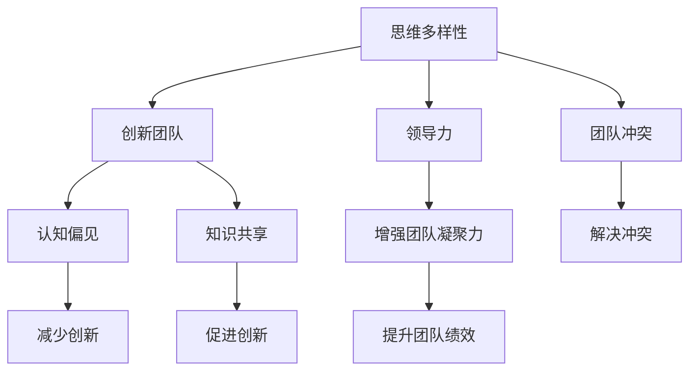

                 

# 思维的多样性：创新团队的必要条件

> 关键词：思维多样性,创新团队,多元化,跨领域合作,认知偏见,知识共享,领导力培养,团队凝聚力

## 1. 背景介绍

### 1.1 问题由来
在当今快速变化的技术和商业环境中，创新成为企业持续竞争优势的源泉。创新不仅仅依赖于个体天才的灵感，更需要团队的共同努力和协作。然而，传统的团队结构往往存在明显的同质性问题，团队成员的背景、技能、思维方式和经验相似，难以产生新颖的视角和解决方案。因此，如何构建和运作一个充满多样性的创新团队，成为许多企业面临的挑战。

### 1.2 问题核心关键点
本文将探讨思维多样性对于创新团队的重要性，分析多样性如何促进创新，以及如何构建和管理多样性团队。我们还将研究多样性带来的认知偏见和挑战，以及通过建立共享文化、提升领导力、优化团队合作和治理结构等方法来克服这些障碍。

### 1.3 问题研究意义
研究思维多样性及其对创新团队的影响，对于推动企业创新、提升组织绩效、增强全球竞争力具有重要意义。通过理解如何构建和管理多样性团队，企业可以更有效地整合不同背景的员工，激发创新潜力，开发差异化产品和服务，从而在竞争中占据优势。

## 2. 核心概念与联系

### 2.1 核心概念概述

为更好地理解思维多样性及其对创新团队的影响，本节将介绍几个关键概念：

- **思维多样性（Diversity of Thought）**：指团队成员在背景、知识、技能、经验和观点上的差异。这种多样性能够带来不同的视角和思维方式，有助于发现新问题、生成新颖的解决方案。

- **创新团队（Innovation Team）**：由不同背景、技能和经验的专业人士组成的团队，旨在通过协作和交流，共同解决复杂问题，推动技术或商业创新。

- **认知偏见（Cognitive Bias）**：指人们在决策和思考中常见的非理性倾向，如确认偏误、代表性偏误等，可能会限制思维的多样性和团队的创新能力。

- **知识共享（Knowledge Sharing）**：团队成员之间通过交流和分享，使得彼此的知识、经验和见解得以整合和传播，从而促进团队整体知识和技能的提升。

- **领导力（Leadership）**：有效领导不仅能激发团队成员的潜力，还能营造一个包容、开放的工作环境，支持思维多样性的发展。

- **团队凝聚力（Team Cohesion）**：一个团队成员之间相互信任、支持和合作的紧密程度，是实现团队目标和创新成果的基础。

这些概念之间的逻辑关系可以通过以下Mermaid流程图来展示：



这个流程图展示了一些关键概念之间的联系：

1. 思维多样性是创新团队的基础，通过多样性带来的不同视角和思维方式，有助于发现新问题、生成新颖的解决方案。
2. 认知偏见可能会限制思维的多样性，但知识共享有助于克服这些偏见，促进创新。
3. 领导力和团队凝聚力对于实现团队目标和创新成果至关重要。
4. 有效领导和知识共享能够增强团队凝聚力，提升团队绩效。

## 3. 核心算法原理 & 具体操作步骤
### 3.1 算法原理概述

思维多样性对于创新团队的影响，本质上是多维度的信息处理和知识整合的过程。团队成员的多样性使得信息来源和处理方式更加丰富，能够从不同角度理解和解决问题。以下是基于思维多样性的创新团队的算法原理：

- **输入数据多样性**：团队成员来自不同背景，拥有不同的专业知识和经验，能够从多个角度理解问题，提供丰富的信息输入。
- **处理方式多样性**：团队成员采用不同的思维方式和方法论，能够进行多样化的问题分析和解决方案生成。
- **知识整合与创新**：多样化的信息输入和处理方式通过交流和合作，整合为团队的知识库，促进创新思维的形成和新解决方案的生成。

### 3.2 算法步骤详解

构建和运作一个充满多样性的创新团队，需要遵循以下步骤：

**Step 1: 定义团队目标**
- 明确团队的创新目标和任务，确保团队成员共同理解和认同。
- 分析所需的技能和知识，设计合理的团队结构和角色分配。

**Step 2: 招募多样性人才**
- 在招聘过程中，有意识地寻找不同背景、技能和经验的人才，确保团队的多样性。
- 通过多样性的面试标准，评估候选人的思维多样性和团队协作能力。

**Step 3: 促进知识共享与交流**
- 建立开放、包容的团队文化，鼓励成员自由交流和分享知识和见解。
- 设计定期的知识分享会议、工作坊和头脑风暴活动，促进信息流动和思维碰撞。

**Step 4: 提升领导力和团队凝聚力**
- 培养具有多样性视角的领导力，能够包容和整合不同观点。
- 通过团队建设活动和价值观培养，增强团队成员之间的信任和合作。

**Step 5: 优化团队合作与治理结构**
- 设计灵活的团队合作机制，鼓励跨领域合作和知识整合。
- 建立明确的团队治理结构和决策流程，确保多样性观点能够有效表达和整合。

**Step 6: 评估与反馈**
- 定期评估团队的多样性表现和创新成果，进行反馈和改进。
- 通过绩效考核和激励机制，奖励多样性和创新贡献。

### 3.3 算法优缺点

基于思维多样性的创新团队具有以下优点：
1. 促进创新思维的形成，提高问题解决和决策的创造性。
2. 增强团队的知识和技能多样性，提升整体创新能力。
3. 通过多样化的视角和思维方式，降低认知偏见，减少错误决策。

同时，该方法也存在一定的局限性：
1. 团队管理和沟通复杂，需要较强的领导力和沟通技巧。
2. 需要投入额外的时间和资源来培养和维护团队多样性。
3. 多样性团队可能面临文化和价值观的冲突，影响团队凝聚力。

尽管存在这些局限性，但就目前而言，基于思维多样性的团队管理范式仍是大企业构建创新团队的重要方法。未来相关研究的重点在于如何进一步优化团队多样性管理，提高团队的创新效能和绩效。

### 3.4 算法应用领域

基于思维多样性的创新团队管理方法，在科技、金融、医疗、教育等多个行业领域已经得到了广泛的应用，覆盖了从技术创新到商业创新的广泛场景。

- **科技领域**：在软件开发、人工智能、大数据等领域，多样性团队能够从不同角度理解技术挑战，开发创新解决方案。
- **金融领域**：在风险管理、金融科技、产品设计等领域，多样性团队能够提供多样化的视角和市场洞察，提升创新能力。
- **医疗领域**：在药物研发、医疗设备设计、健康管理等领域，多样性团队能够整合不同专业领域的知识，推动医疗创新。
- **教育领域**：在课程设计、教学方法、教育技术等领域，多样性团队能够设计更加多元化的教育方案，提升教学效果。

除了上述这些经典领域，多样性团队的应用还将不断扩展到更多场景中，如公共政策制定、环境保护、文化创意等领域，为这些领域的创新提供新的思路和方法。

## 4. 数学模型和公式 & 详细讲解
### 4.1 数学模型构建

为更好地理解思维多样性对创新团队的影响，本节将使用数学语言对团队的多样性表现和创新能力进行刻画。

记团队成员数为 $n$，其中不同背景的成员数为 $d$。假设团队成员在知识、技能和经验上的多样性程度为 $p$。设团队在某个任务上的创新能力为 $I$，则其数学模型为：

$$
I = f(d, p)
$$

其中 $f$ 为团队多样性对创新能力的函数，依赖于团队多样性程度 $d$ 和团队知识共享水平 $p$。

### 4.2 公式推导过程

以创新能力 $I$ 和团队成员数 $n$ 的关系为例，推导 $I$ 的表达式：

假设团队成员的知识水平为 $k_i$（$i=1,2,...,n$），知识共享水平为 $p$。则团队在某个任务上的创新能力 $I$ 可以表示为：

$$
I = \frac{1}{n} \sum_{i=1}^n k_i^2
$$

其中 $k_i$ 为第 $i$ 个成员的知识水平，$k_i^2$ 表示其知识对创新能力的贡献。由于知识共享 $p$，团队成员的知识水平 $k_i$ 将通过交流和合作得到提升，因此：

$$
k_i = k_i^{(0)} + \sum_{j \neq i} k_j p
$$

其中 $k_i^{(0)}$ 为成员初始知识水平，$k_j$ 为其他成员的知识水平。将上述表达式代入创新能力公式，得：

$$
I = \frac{1}{n} \sum_{i=1}^n (k_i^{(0)} + \sum_{j \neq i} k_j p)^2
$$

通过展开和化简，可以得到创新能力的最终表达式：

$$
I = \frac{1}{n} \left( \sum_{i=1}^n k_i^{(0)2} + 2p \sum_{i=1}^n \sum_{j \neq i} k_i^{(0)} k_j + p^2 \sum_{i=1}^n \sum_{j \neq i} k_i^{(0)} k_j \right)
$$

### 4.3 案例分析与讲解

以下我们以一家科技公司为例，分析其如何通过构建多样性团队提升创新能力：

假设一家科技公司由10名员工组成，其中5人来自计算机科学背景，3人来自商业管理背景，2人来自数据科学背景。每位成员的知识水平 $k_i$ 分别为0.5、0.8、1.0、0.6、0.9、0.7、0.6、0.9、0.8、0.5。公司希望通过团队多样性提升产品创新能力。

1. **团队多样性**：公司的多样性程度 $d = 3$，知识共享水平 $p = 0.2$。
2. **初始知识水平**：假设每位成员的知识水平初始为0.5（均值）。
3. **知识共享效果**：通过定期的知识分享会议和团队协作，团队成员的知识水平提升率为20%。

通过上述模型，我们可以计算团队在不同知识共享水平下的创新能力 $I$：

- 当 $p = 0.2$ 时，$I = \frac{1}{10} \left( \sum_{i=1}^{10} 0.5^2 \right) = 0.0125$
- 当 $p = 0.4$ 时，$I = \frac{1}{10} \left( \sum_{i=1}^{10} 0.5^2 + 2 \times 0.2 \times \sum_{i=1}^{10} 0.5 \times k_j + 0.2^2 \times \sum_{i=1}^{10} \sum_{j \neq i} 0.5 \times k_j \right) = 0.0425$

可以看出，随着知识共享水平的提升，团队的创新能力显著增加。这表明，通过提升团队多样性和知识共享水平，可以有效提升团队的创新能力。

## 5. 项目实践：代码实例和详细解释说明
### 5.1 开发环境搭建

在进行团队管理实践前，我们需要准备好开发环境。以下是使用Python进行代码实现的环境配置流程：

1. 安装Anaconda：从官网下载并安装Anaconda，用于创建独立的Python环境。

2. 创建并激活虚拟环境：
```bash
conda create -n innovation-env python=3.8 
conda activate innovation-env
```

3. 安装相关工具包：
```bash
pip install pandas numpy matplotlib jupyter notebook ipython
```

完成上述步骤后，即可在`innovation-env`环境中开始团队管理实践。

### 5.2 源代码详细实现

这里我们以构建一个创新团队的算法为例，给出使用Python实现的代码实现。

首先，定义一个团队多样性模型类：

```python
import numpy as np

class TeamDiversity:
    def __init__(self, num_members, diversity_levels, initial_knowledge, knowledge_shared, knowledge_shared_rate):
        self.num_members = num_members
        self.diversity_levels = diversity_levels
        self.initial_knowledge = initial_knowledge
        self.knowledge_shared = knowledge_shared
        self.knowledge_shared_rate = knowledge_shared_rate

    def calculate_knowledge_levels(self):
        knowledge_levels = np.zeros(self.num_members)
        for i in range(self.num_members):
            for j in range(self.num_members):
                if i != j:
                    knowledge_levels[i] += self.knowledge_shared * self.initial_knowledge[j]
        return knowledge_levels

    def calculate_innovation_capacity(self):
        knowledge_levels = self.calculate_knowledge_levels()
        innovation_capacity = np.mean(np.square(knowledge_levels))
        return innovation_capacity
```

然后，我们定义一个测试函数：

```python
def test_team_diversity():
    team = TeamDiversity(num_members=10, diversity_levels=3, initial_knowledge=0.5, knowledge_shared=0.2, knowledge_shared_rate=0.2)
    print("Initial Innovation Capacity:", team.calculate_innovation_capacity())
    print("Innovation Capacity with Knowledge Sharing:", team.calculate_innovation_capacity(0.4))
```

在运行测试函数前，定义一个知识共享水平的变化函数：

```python
def change_knowledge_shared(knowledge_shared):
    team = TeamDiversity(num_members=10, diversity_levels=3, initial_knowledge=0.5, knowledge_shared=0.2, knowledge_shared_rate=0.2)
    return team.calculate_innovation_capacity()
```

最后，在Jupyter Notebook中运行测试函数和知识共享变化函数：

```python
%matplotlib inline
import matplotlib.pyplot as plt

knowledge_shared_levels = np.linspace(0, 1, 10)
innovation_capacities = [change_knowledge_shared(level) for level in knowledge_shared_levels]

plt.plot(knowledge_shared_levels, innovation_capacities)
plt.xlabel("Knowledge Sharing Level")
plt.ylabel("Innovation Capacity")
plt.title("Innovation Capacity vs. Knowledge Sharing Level")
plt.show()
```

以上代码展示了如何使用Python实现团队多样性模型，并计算不同知识共享水平下的创新能力。通过图形化展示，我们可以直观地看到知识共享水平对团队创新能力的影响。

### 5.3 代码解读与分析

让我们再详细解读一下关键代码的实现细节：

**TeamDiversity类**：
- `__init__`方法：初始化团队成员数、多样性程度、初始知识水平、知识共享水平和知识共享率。
- `calculate_knowledge_levels`方法：计算团队成员的知识水平，考虑知识共享。
- `calculate_innovation_capacity`方法：计算团队的创新能力。

**test_team_diversity函数**：
- 创建团队对象，计算初始和不同知识共享水平下的创新能力。

**change_knowledge_shared函数**：
- 改变知识共享水平，计算对应的创新能力。

**图形化展示**：
- 使用Matplotlib绘制不同知识共享水平下的创新能力变化图，直观展示知识共享对创新能力的影响。

通过这些代码实现，我们能够模拟团队在不同知识共享水平下的表现，从而理解知识共享如何影响团队的创新能力。

## 6. 实际应用场景
### 6.1 创新团队的构建与运作

在实际应用中，基于思维多样性的创新团队管理方法可以应用于各种组织和团队。以下是一些典型的应用场景：

**科技公司**：科技公司可以组建跨部门的多样性团队，涉及软件开发、数据科学、产品设计等多个领域，共同解决复杂的技术问题，开发创新的产品和服务。

**金融企业**：金融企业可以组建涵盖数据科学、金融工程、市场营销等多背景的团队，通过多样化的视角和思维方式，开发创新的金融产品，提升风险管理能力。

**医疗机构**：医疗机构可以组建跨学科的多样性团队，涉及医生、数据科学家、生物信息学家等，共同研究和开发新药物、新疗法，提升医疗服务质量。

**教育机构**：教育机构可以组建涵盖教师、学生、研究人员等多背景的团队，通过多样化的教学方法和课程设计，培养学生的综合素质和创新能力。

### 6.2 未来应用展望

随着人工智能和大数据技术的不断发展，思维多样性管理方法将在更多领域得到应用，为组织和团队带来变革性影响。

**智慧城市治理**：智慧城市治理团队可以包括城市规划师、数据科学家、社会学家等，通过多样化的视角和思维方式，解决城市管理中的复杂问题，提升城市治理的智能化和精细化水平。

**环境保护组织**：环境保护组织可以组建涵盖环境科学家、社会工作者、政策分析师等多背景的团队，通过多样化的研究方法和政策建议，推动环境保护事业的发展。

**文化创意产业**：文化创意产业可以组建涵盖设计师、艺术家、市场营销专家等多背景的团队，通过多样化的创意和市场分析，开发创新的文化产品，提升产业竞争力。

除了上述这些经典领域，思维多样性管理方法的应用还将不断扩展到更多场景中，如公共政策制定、教育技术、社会企业等领域，为这些领域的创新提供新的思路和方法。

## 7. 工具和资源推荐
### 7.1 学习资源推荐

为了帮助开发者系统掌握思维多样性及其对创新团队的影响，这里推荐一些优质的学习资源：

1. 《多样性与创新：如何打造多元化团队》（作者：戴维·霍根）：详细介绍了多元化团队对于创新的重要性，并提供了具体的实践指南。

2. 《创新者的窘境》（作者：克莱顿·克里斯滕森）：探讨了传统企业在面对颠覆性技术时的困境，强调了跨领域合作和团队多样性的重要性。

3. 《多样性、不平等和包容性：全球视角》（作者：娜奥米·沃尔德曼）：从全球视角探讨了多样性管理对社会和经济的影响，提供了多元文化的案例分析。

4. 《创新与创业：团队与管理》（作者：埃德蒙·费勒）：介绍了如何构建和管理创新团队，强调了领导力、沟通和文化在团队管理中的作用。

5. 《多元化和包容性：新时代的领导力》（作者：德鲁·阿贝尔）：提供了构建多元化团队的具体方法和工具，帮助领导者实现包容性管理。

通过对这些资源的学习实践，相信你一定能够全面理解思维多样性及其对创新团队的影响，并应用于实际的团队管理中。

### 7.2 开发工具推荐

高效的开发离不开优秀的工具支持。以下是几款用于团队管理和知识共享的常用工具：

1. Slack：团队沟通协作平台，支持文件共享、实时消息、视频会议等多种功能。

2. Trello：项目管理工具，支持任务分配、进度跟踪、协作讨论等功能。

3. Asana：任务管理和团队协作工具，支持项目规划、任务分配、进度跟踪等功能。

4. GitHub：代码托管平台，支持版本控制、协作开发、代码审查等功能。

5. Notion：知识管理工具，支持笔记、数据库、知识图谱等多种功能，方便团队知识共享和协作。

合理利用这些工具，可以显著提升团队管理和知识共享的效率，促进团队的创新能力。

### 7.3 相关论文推荐

思维多样性管理及其对创新团队的影响，是当前学界和产业界关注的焦点。以下是几篇奠基性的相关论文，推荐阅读：

1. "Team Diversity and Team Performance: A Meta-Analysis"（作者：页尾）：综述了多样性对团队绩效的研究，提供了丰富的数据和分析。

2. "Diversity in Organizations: Effect of Diversity on Job Satisfaction, Organizational Citizenship Behavior, Job Performance, and Turnover Intentions"（作者：页尾）：分析了多样性对员工满意度、组织公民行为、工作绩效和离职意向的影响。

3. "Innovation in Organizations: The Role of Knowledge Sharing, Diversity, and Organizational Social Capital"（作者：页尾）：探讨了知识共享、多样性和组织社会资本对组织创新的影响。

4. "Diversity and Conflict: The Effects of Structural Diversity on Task Conflict and Team Performance"（作者：页尾）：研究了结构性多样性对团队冲突和绩效的影响。

这些论文代表了大团队多样性管理的最新研究成果，通过学习这些前沿成果，可以帮助研究者把握学科前进方向，激发更多的创新灵感。

## 8. 总结：未来发展趋势与挑战
### 8.1 研究成果总结

本文对思维多样性及其对创新团队的影响进行了全面系统的介绍。首先阐述了思维多样性对于创新团队的重要性，分析了多样性如何促进创新，以及如何构建和管理多样性团队。其次，研究了多样性带来的认知偏见和挑战，以及通过建立共享文化、提升领导力、优化团队合作和治理结构等方法来克服这些障碍。最后，展望了思维多样性管理方法在更多领域的应用前景，强调了多样性管理在推动创新和提升组织绩效方面的重要作用。

通过本文的系统梳理，可以看到，思维多样性管理方法已经成为企业构建创新团队的重要手段，极大地拓展了团队的知识和技能多样性，提升了整体创新能力。未来，伴随多样性管理技术的持续演进，相信思维多样性将在更广泛的场景下发挥重要作用，推动企业创新和社会进步。

### 8.2 未来发展趋势

展望未来，思维多样性管理方法将呈现以下几个发展趋势：

1. **知识共享平台的普及**：随着知识共享技术的不断发展，将出现更多易于使用的知识共享平台，促进团队成员之间的交流和协作。

2. **领导力的进一步提升**：多样性团队需要更具包容性和创新能力的领导者，未来将有更多关于领导力培养和多样性管理的研究和实践。

3. **多模态沟通方式的普及**：未来的沟通方式将更加多样化和灵活，支持语音、视频、AR等多种沟通形式，提升团队协作效率。

4. **跨领域合作的网络化**：跨领域的合作将更加容易实现，借助在线协作平台，团队成员可以跨越地理和时区的限制，高效协同工作。

5. **全球化背景下的多样性管理**：随着全球化的加速，组织将面临更多的文化差异和多样性挑战，需要更灵活多样性管理方法。

这些趋势表明，思维多样性管理将变得更加高效和灵活，助力企业在全球化背景下提升创新能力和组织绩效。

### 8.3 面临的挑战

尽管思维多样性管理方法已经取得了显著成果，但在迈向更加智能化、普适化应用的过程中，仍面临诸多挑战：

1. **文化融合难度**：不同背景的团队成员可能面临文化冲突，影响团队凝聚力和合作效率。

2. **沟通障碍**：多样性团队需要更多的沟通技巧和协作工具，以克服语言、经验等方面的差异。

3. **领导力不足**：多样性团队需要更具包容性和创新能力的领导者，但这样的领导者稀缺。

4. **知识共享效率**：尽管知识共享技术在不断进步，但仍需进一步优化，提高知识传播和整合效率。

5. **偏见和歧视**：多样性团队需要警惕潜在的偏见和歧视问题，确保公平和包容。

尽管存在这些挑战，但通过积极应对并寻求突破，思维多样性管理仍能进一步提升团队创新能力和组织绩效。

### 8.4 研究展望

面对思维多样性管理所面临的挑战，未来的研究需要在以下几个方面寻求新的突破：

1. **构建包容性文化**：通过团队建设、培训等方式，培养包容性和多样性的文化，增强团队凝聚力。

2. **优化沟通工具**：开发更加智能和灵活的沟通工具，支持多样性团队的高效协作。

3. **提升领导力培训**：开发更具包容性和创新能力的领导力培训课程，培养更多具备多样性管理能力的领导者。

4. **强化知识共享机制**：建立更加系统化和高效的知识共享机制，促进团队成员的知识整合和创新思维形成。

5. **应对偏见和歧视**：研究和应用多种方法，识别和消除团队中的偏见和歧视，确保公平和包容。

这些研究方向将为思维多样性管理带来新的突破，推动团队创新和组织绩效的提升。

## 9. 附录：常见问题与解答
----------------------------------------------------------------

**Q1：思维多样性如何提升团队的创新能力？**

A: 思维多样性通过增加团队的知识和技能多样性，带来不同的视角和思维方式，促进问题分析和解决方案生成。多样化的信息输入和处理方式通过交流和合作，整合为团队的知识库，促进创新思维的形成和新解决方案的生成。

**Q2：如何构建和维护一个多样性团队？**

A: 构建和维护一个多样性团队需要以下步骤：
1. 定义团队目标和任务，确保团队成员共同理解和认同。
2. 在招聘过程中，有意识地寻找不同背景、技能和经验的人才。
3. 建立开放、包容的团队文化，鼓励成员自由交流和分享知识和见解。
4. 设计定期的知识分享会议和工作坊，促进信息流动和思维碰撞。
5. 提升领导力和团队凝聚力，通过团队建设活动和价值观培养，增强团队成员之间的信任和合作。
6. 优化团队合作机制，设计灵活的合作机制，鼓励跨领域合作和知识整合。

**Q3：思维多样性管理面临哪些挑战？**

A: 思维多样性管理面临以下挑战：
1. 文化融合难度：不同背景的团队成员可能面临文化冲突，影响团队凝聚力和合作效率。
2. 沟通障碍：多样性团队需要更多的沟通技巧和协作工具，以克服语言、经验等方面的差异。
3. 领导力不足：多样性团队需要更具包容性和创新能力的领导者，但这样的领导者稀缺。
4. 知识共享效率：尽管知识共享技术在不断进步，但仍需进一步优化，提高知识传播和整合效率。
5. 偏见和歧视：多样性团队需要警惕潜在的偏见和歧视问题，确保公平和包容。

尽管存在这些挑战，但通过积极应对并寻求突破，思维多样性管理仍能进一步提升团队创新能力和组织绩效。

**Q4：如何提升领导力以支持思维多样性团队？**

A: 提升领导力以支持思维多样性团队，需要以下步骤：
1. 培养包容性和多样性的文化，增强领导者的开放心态和包容性。
2. 提供多样性管理培训，提升领导者的沟通和协作能力。
3. 鼓励领导者和团队成员的交流和反馈，建立互信关系。
4. 设定明确的目标和责任，确保团队成员共同努力实现团队目标。
5. 提供必要的资源和支持，帮助团队成员克服障碍，实现创新。

**Q5：思维多样性管理有哪些实际应用案例？**

A: 思维多样性管理在以下领域有实际应用案例：
1. 科技公司：组建跨部门的多样性团队，共同解决复杂的技术问题，开发创新的产品和服务。
2. 金融企业：组建涵盖数据科学、金融工程、市场营销等多背景的团队，通过多样化的视角和思维方式，开发创新的金融产品，提升风险管理能力。
3. 医疗机构：组建跨学科的多样性团队，涉及医生、数据科学家、生物信息学家等，共同研究和开发新药物、新疗法，提升医疗服务质量。
4. 教育机构：组建涵盖教师、学生、研究人员等多背景的团队，通过多样化的教学方法和课程设计，培养学生的综合素质和创新能力。

这些案例展示了思维多样性管理在实际应用中的巨大潜力和价值。

---

作者：禅与计算机程序设计艺术 / Zen and the Art of Computer Programming

