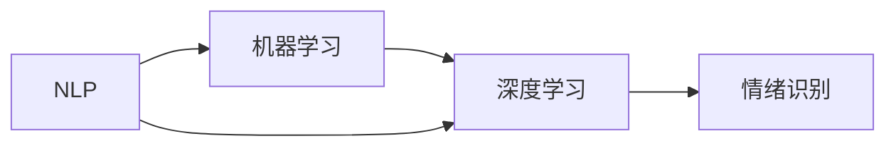

                 

# 情绪识别创业：人机交互的情感维度

> 关键词：情绪识别, 情感维度, 人机交互, 自然语言处理(NLP), 机器学习, 深度学习

## 1. 背景介绍

在数字化时代，人机交互的形式已经从传统的语音和文本交互，逐渐拓展到情感维度。情感识别技术通过分析用户的语音、文字、面部表情等信号，理解用户的情绪状态，能够更加精准地响应用户需求，提升用户体验和满意度。这种技术在智能客服、在线教育、医疗咨询、虚拟助手等多个领域都展现了巨大的应用潜力。

本文将从情绪识别的原理、技术实现、应用场景、以及面临的挑战等多个方面，全面探讨这一新兴技术的创业机会和应用前景。

## 2. 核心概念与联系

### 2.1 核心概念概述

情绪识别是指通过分析用户的语音、文字、面部表情等信号，识别用户情绪状态的技术。其主要依赖于自然语言处理(NLP)、机器学习、深度学习等技术。

- **自然语言处理(NLP)**：研究如何使计算机理解和生成自然语言的技术，包括分词、词性标注、句法分析、语义理解等。
- **机器学习**：通过数据训练模型，使其能够自动学习和提升性能的技术。
- **深度学习**：一种特殊的机器学习方法，使用神经网络模型进行复杂模式的识别和分类。

这些技术通过联合使用，可以实现对用户情绪的精准识别和分析，为情绪识别应用提供基础支持。

### 2.2 核心概念联系

情绪识别涉及多方面的核心概念，各概念之间的关系可以如下图所示：



- **NLP技术**：提供文本分析的底层技术支持，如分词、词性标注等。
- **机器学习**：在NLP分析的基础上，对数据进行特征提取和模型训练。
- **深度学习**：构建复杂的神经网络模型，提高情绪识别的准确性和泛化能力。
- **情绪识别**：将上述技术集成，实现对用户情绪状态的精准识别和分析。

这一技术链条各环节相互依赖，共同构成了情绪识别的技术架构。

## 3. 核心算法原理 & 具体操作步骤
### 3.1 算法原理概述

情绪识别的核心算法原理主要基于机器学习和深度学习，通过训练数据集，使模型能够自动识别和分类情绪状态。常用的算法包括：

- **朴素贝叶斯分类器**：基于贝叶斯定理的分类算法，适用于文本分类等简单任务。
- **支持向量机(SVM)**：通过寻找最优的超平面，实现分类任务。
- **神经网络模型**：包括多层感知器(MLP)、卷积神经网络(CNN)、循环神经网络(RNN)等，适用于复杂的模式识别和分类任务。
- **深度学习模型**：如长短期记忆网络(LSTM)、门控循环单元(GRU)、Transformer等，能够处理更复杂的语言和时间序列数据。

### 3.2 算法步骤详解

以深度学习模型为例，情绪识别的主要步骤包括：

1. **数据准备**：收集和标注情绪相关的文本数据，划分为训练集、验证集和测试集。
2. **特征提取**：使用NLP技术对文本进行分词、词性标注、句法分析等处理，提取文本特征。
3. **模型训练**：选择合适的深度学习模型，如LSTM、GRU、Transformer等，在训练集上进行模型训练。
4. **模型评估**：在验证集上对模型进行评估，调整模型参数以提高性能。
5. **模型测试**：在测试集上对模型进行最终测试，评估其性能和泛化能力。
6. **模型应用**：将训练好的模型集成到实际应用场景中，实现情绪识别功能。

### 3.3 算法优缺点

情绪识别的主要优点包括：

- **精准度高**：通过深度学习模型，可以获得较高的情绪识别精度。
- **应用广泛**：适用于智能客服、在线教育、医疗咨询等多个领域。
- **可扩展性强**：随着数据量的增加和模型参数的优化，性能可以不断提升。

但情绪识别也存在一些缺点：

- **数据标注成本高**：标注高质量的情绪数据需要大量人工标注，成本较高。
- **跨文化差异**：不同文化背景下的情绪表达方式可能不同，模型需要适应多文化环境。
- **用户隐私问题**：情绪识别涉及用户的隐私数据，需严格遵守相关法律法规。

### 3.4 算法应用领域

情绪识别技术可以应用于多个领域，包括但不限于：

- **智能客服**：通过分析用户语音和文本，提供更加个性化的服务。
- **在线教育**：通过分析学生的反馈和情绪状态，调整教学策略，提升教学效果。
- **医疗咨询**：通过分析患者的情绪和表达，提供更精准的心理健康支持。
- **虚拟助手**：通过分析用户的情绪和需求，提供更加自然和人性化的交互体验。
- **安全监控**：通过分析公共场所的视频数据，识别异常情绪和行为，提高安全预警能力。

## 4. 数学模型和公式 & 详细讲解 & 举例说明
### 4.1 数学模型构建

情绪识别的数学模型构建主要涉及文本分类和情感分析。以情感分析为例，假设训练集为 $D = \{(x_i, y_i)\}_{i=1}^N$，其中 $x_i$ 为文本样本，$y_i \in \{1, 2, ..., K\}$ 为情感标签，$K$ 为情感类别数。

模型通过训练数据，学习到文本特征 $f(x_i)$ 和情感标签 $y_i$ 之间的映射关系。常用的模型包括朴素贝叶斯分类器和支持向量机。

### 4.2 公式推导过程

以朴素贝叶斯分类器为例，推导其公式如下：

设 $p(y_i|x_i)$ 为给定文本 $x_i$ 下，情感标签 $y_i$ 的条件概率，则：

$$ p(y_i|x_i) = \frac{p(y_i) p(x_i|y_i)}{\sum_{k=1}^K p(y_k) p(x_i|y_k)} $$

其中 $p(y_i)$ 为先验概率，$p(x_i|y_i)$ 为条件概率，可以通过训练数据计算得到。

### 4.3 案例分析与讲解

假设有一个情感分析的数据集，包含以下文本和情感标签：

| 文本            | 情感标签 |
| --------------- | -------- |
| 我感到非常高兴！ | 1        |
| 这太糟糕了！    | 2        |
| 我有些困惑。   | 3        |
| 我很生气！     | 2        |
| 我心情很好。   | 1        |

通过朴素贝叶斯分类器，可以计算每个文本的情感概率，并预测其情感标签。例如，对于文本“我感到非常高兴！”，计算得到：

$$ p(1|\text{我感到非常高兴！}) = \frac{p(1) p(\text{我感到非常高兴！}|1)}{\sum_{k=1}^K p(k) p(\text{我感到非常高兴！}|k)} $$

其中 $p(1)$ 和 $p(2)$ 为先验概率，$p(\text{我感到非常高兴！}|1)$ 和 $p(\text{我感到非常高兴！}|2)$ 为条件概率，可以通过训练数据计算得到。

## 5. 项目实践：代码实例和详细解释说明
### 5.1 开发环境搭建

要进行情绪识别项目的开发，首先需要安装Python和相关依赖。以下是一个Python 3.8的虚拟环境搭建示例：

```bash
conda create -n emotion_recognition python=3.8
conda activate emotion_recognition
```

然后安装所需的Python包：

```bash
pip install nltk spacy tensorflow transformers
```

### 5.2 源代码详细实现

下面是一个简单的情感分析模型实现，使用Transformer模型和HuggingFace的Transformers库。

```python
from transformers import TFBertForSequenceClassification, BertTokenizer
import tensorflow as tf
from tensorflow.keras.optimizers import Adam

# 初始化BERT分词器
tokenizer = BertTokenizer.from_pretrained('bert-base-uncased')

# 加载模型
model = TFBertForSequenceClassification.from_pretrained('bert-base-uncased', num_labels=3)

# 配置模型和优化器
model.compile(optimizer=Adam(learning_rate=2e-5), loss='binary_crossentropy', metrics=['accuracy'])

# 训练模型
model.fit(x_train, y_train, epochs=5, batch_size=16, validation_data=(x_val, y_val))

# 评估模型
model.evaluate(x_test, y_test, batch_size=16)
```

### 5.3 代码解读与分析

- `TFAutomaticTokenizer`：用于分词和标记化。
- `TFBertForSequenceClassification`：定义BERT模型结构，并根据数据集标签数量进行适配。
- `Adam`：配置优化器。
- `fit` 和 `evaluate`：训练模型并进行评估。

### 5.4 运行结果展示

训练完成后，可以通过评估集对模型进行测试，得到情感分类精度。例如，假设模型在测试集上的精度为90%，则说明模型在识别情绪方面具有较高的准确性。

## 6. 实际应用场景
### 6.1 智能客服系统

智能客服系统通过情绪识别技术，可以实时监控用户的情绪状态，提供个性化和情绪化的服务。例如，当用户表达愤怒时，系统可以自动转入人工客服，提升用户体验。

### 6.2 在线教育平台

在线教育平台可以通过情绪识别技术，分析学生的反馈和情绪状态，及时调整教学策略，提升教学效果。例如，对于情绪低落的学员，可以提供心理辅导和情感支持。

### 6.3 医疗咨询系统

医疗咨询系统可以通过情绪识别技术，分析患者的情绪和表达，提供更精准的心理健康支持。例如，对于情绪焦虑的患者，可以提供心理咨询和情绪管理建议。

### 6.4 虚拟助手

虚拟助手通过情绪识别技术，可以更好地理解用户的情感需求，提供更加自然和人性化的交互体验。例如，用户表达负面情绪时，虚拟助手可以主动提供安慰和支持。

### 6.5 安全监控系统

安全监控系统可以通过情绪识别技术，实时监控公共场所的视频数据，识别异常情绪和行为，提高安全预警能力。例如，当监控到异常情绪时，系统可以自动通知安保人员。

## 7. 工具和资源推荐
### 7.1 学习资源推荐

- **《Python自然语言处理》**：Python处理自然语言的经典入门书籍，涵盖NLP和机器学习的基础知识。
- **《深度学习入门：基于TensorFlow和Keras的实践》**：TensorFlow和Keras的实战教程，适合学习深度学习模型的构建和训练。
- **《自然语言处理综述》**：综合性NLP教材，涵盖NLP的前沿研究和技术实现。
- **HuggingFace官方文档**：提供大量预训练模型和微调样例代码，是学习和应用情绪识别技术的必备资源。

### 7.2 开发工具推荐

- **Jupyter Notebook**：免费的交互式编程环境，适合进行模型训练和调试。
- **Google Colab**：谷歌提供的免费云服务，支持GPU/TPU算力，方便快速迭代实验。
- **TensorFlow**：Google开源的深度学习框架，支持GPU/TPU加速，适合大规模模型训练。

### 7.3 相关论文推荐

- **《Emotion Recognition Using Deep Learning》**：综述性论文，总结了深度学习在情绪识别中的应用。
- **《Sentiment Analysis with Recurrent Neural Networks》**：使用RNN模型进行情感分析的经典论文。
- **《Emotion Classification Using Multimodal Data》**：多模态情感识别的最新研究论文。

## 8. 总结：未来发展趋势与挑战
### 8.1 研究成果总结

情绪识别技术在近年来取得了显著进展，通过深度学习模型实现了较高的精度和泛化能力。该技术已经在智能客服、在线教育、医疗咨询等多个领域得到了广泛应用。

### 8.2 未来发展趋势

- **多模态融合**：结合语音、文字、面部表情等多种数据源，提升情绪识别的全面性和准确性。
- **跨文化适应**：开发适应不同文化背景的模型，实现跨文化情感识别。
- **实时性提升**：优化模型和算法，实现实时情感识别，提高用户体验。
- **隐私保护**：采用隐私保护技术，确保用户数据的安全和隐私。
- **人机协同**：结合人工干预和机器学习，提升情绪识别的可靠性和可解释性。

### 8.3 面临的挑战

- **数据标注成本**：高质量的情绪数据标注成本高昂，限制了模型的发展。
- **跨文化差异**：不同文化背景下的情绪表达方式不同，模型需要适应多文化环境。
- **用户隐私**：情绪识别涉及用户的隐私数据，需严格遵守相关法律法规。
- **算法复杂度**：深度学习模型复杂度较高，训练和推理需要大量资源。
- **应用场景多样性**：不同应用场景下，情绪识别的需求和效果各异，需要定制化解决方案。

### 8.4 研究展望

未来的情绪识别技术需要在数据、算法、应用等多个方面进行持续创新：

- **无监督和半监督学习**：探索无监督和半监督学习方法，减少对标注数据的依赖。
- **跨领域迁移学习**：开发跨领域迁移学习技术，提高模型的泛化能力。
- **融合多模态数据**：结合语音、文字、面部表情等多模态数据，提升情绪识别的全面性。
- **引入先验知识**：结合符号化的先验知识，提高情绪识别的准确性和可靠性。
- **可解释性和公平性**：研究可解释性和公平性技术，确保模型的透明性和公正性。

## 9. 附录：常见问题与解答

**Q1：情绪识别技术在实际应用中面临哪些挑战？**

A: 情绪识别技术在实际应用中面临以下挑战：

1. **数据标注成本高**：高质量的情绪数据标注成本高昂，限制了模型的发展。
2. **跨文化差异**：不同文化背景下的情绪表达方式不同，模型需要适应多文化环境。
3. **用户隐私问题**：情绪识别涉及用户的隐私数据，需严格遵守相关法律法规。
4. **算法复杂度**：深度学习模型复杂度较高，训练和推理需要大量资源。
5. **应用场景多样性**：不同应用场景下，情绪识别的需求和效果各异，需要定制化解决方案。

**Q2：情绪识别技术的商业化应用有哪些？**

A: 情绪识别技术的商业化应用主要包括以下几类：

1. **智能客服系统**：通过实时监控用户的情绪状态，提供个性化和情绪化的服务。
2. **在线教育平台**：分析学生的反馈和情绪状态，及时调整教学策略，提升教学效果。
3. **医疗咨询系统**：分析患者的情绪和表达，提供更精准的心理健康支持。
4. **虚拟助手**：更好地理解用户的情感需求，提供更加自然和人性化的交互体验。
5. **安全监控系统**：实时监控公共场所的视频数据，识别异常情绪和行为，提高安全预警能力。

**Q3：情绪识别技术的市场潜力有多大？**

A: 情绪识别技术的市场潜力非常大，随着数字化时代的到来，用户对智能交互和个性化服务的期待不断提升，情绪识别技术的应用前景广阔。

**Q4：情绪识别技术的核心算法有哪些？**

A: 情绪识别技术的核心算法包括：

1. **朴素贝叶斯分类器**：基于贝叶斯定理的分类算法，适用于文本分类等简单任务。
2. **支持向量机(SVM)**：通过寻找最优的超平面，实现分类任务。
3. **神经网络模型**：包括多层感知器(MLP)、卷积神经网络(CNN)、循环神经网络(RNN)等，适用于复杂的模式识别和分类任务。
4. **深度学习模型**：如长短期记忆网络(LSTM)、门控循环单元(GRU)、Transformer等，能够处理更复杂的语言和时间序列数据。

**Q5：情绪识别技术的未来发展方向是什么？**

A: 情绪识别技术的未来发展方向包括：

1. **多模态融合**：结合语音、文字、面部表情等多种数据源，提升情绪识别的全面性和准确性。
2. **跨文化适应**：开发适应不同文化背景的模型，实现跨文化情感识别。
3. **实时性提升**：优化模型和算法，实现实时情感识别，提高用户体验。
4. **隐私保护**：采用隐私保护技术，确保用户数据的安全和隐私。
5. **人机协同**：结合人工干预和机器学习，提升情绪识别的可靠性和可解释性。

作者：禅与计算机程序设计艺术 / Zen and the Art of Computer Programming

