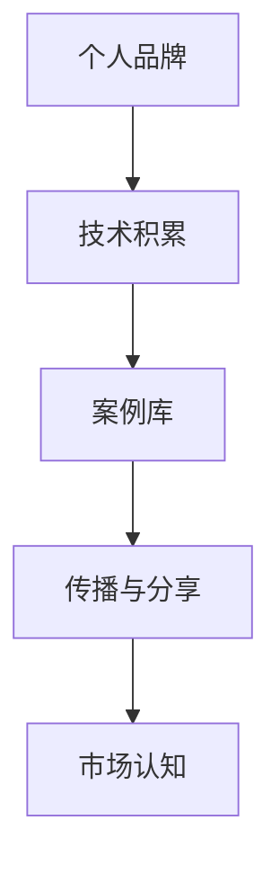

                 

# 打造个人品牌案例库：用实际成果说话

## 1. 背景介绍

### 1.1 问题由来
在当今这个信息爆炸的时代，个人品牌的打造变得比以往任何时候都重要。无论是在职业发展、学术研究还是创业经营中，一个强有力的个人品牌能够显著提升个人的影响力、知名度和竞争力。然而，如何有效地构建和传播个人品牌，却是一个颇具挑战性的问题。

一方面，个人品牌的构建需要深厚的技术积累和广泛的经验；另一方面，这些技术和经验的传播和应用需要形式化的案例库作为支撑。缺乏系统化、结构化的案例库，会导致个人品牌传播的碎片化、杂乱无章，甚至无法形成共鸣和影响力。

因此，本文旨在探讨如何通过打造个人品牌案例库，将个人的技术积累和实战经验系统化、结构化地呈现出来，从而更好地进行传播和分享。

### 1.2 问题核心关键点
个人品牌案例库的核心在于：
- 系统化：案例库应包含从技术原理到实际应用的各个环节，形成一个完整的知识体系。
- 结构化：案例库应具有清晰的层次结构和逻辑关系，便于检索和阅读。
- 实际成果：案例库中的每一个案例应具备实际的技术成果，能够解决实际问题。
- 可扩展性：案例库应能够不断更新，适应技术发展的新趋势和新需求。

本文将从核心概念、核心算法、具体实践、应用场景、工具和资源推荐、总结与展望等方面，系统地介绍如何构建个人品牌案例库，并用实际成果说话，彰显个人品牌的力量。

## 2. 核心概念与联系

### 2.1 核心概念概述

为更好地理解如何打造个人品牌案例库，本文将介绍几个关键概念：

- **个人品牌(Personal Branding)**：指个人在职业或专业领域中形成的独特形象和声誉，是个人在职场上的价值体现。个人品牌包括技术实力、市场认知、社交影响力等维度。

- **案例库(Case Library)**：指包含多个实际技术案例的库，每个案例应包括背景、问题、解决方案、技术栈、成果分析等环节，构成一个完整的故事。

- **技术积累(Technical Accumulation)**：指在技术研究和实践过程中积累的知识、经验和方法论。技术积累是案例库的核心来源。

- **传播与分享(Dissemination and Sharing)**：指将个人技术积累通过案例库等形式进行系统化的传播和分享，以提升个人品牌的影响力和知名度。

- **市场认知(Market Perception)**：指个人品牌在市场上的认知度，包括知名度、美誉度和认可度。市场认知需要通过有效的案例传播来建立和提升。

这些概念之间的逻辑关系可以通过以下Mermaid流程图来展示：



这个流程图展示了个体品牌与案例库、技术积累、传播与分享之间的内在联系，强调了案例库在个人品牌构建中的重要性。

## 3. 核心算法原理 & 具体操作步骤

### 3.1 算法原理概述

个人品牌案例库的构建，本质上是一个从技术积累到市场认知的系统化过程。其核心算法原理包括：

1. **技术积累抽取**：从技术研究和实践中抽取有价值的技术点、方法论和实践经验。
2. **案例构建**：将技术积累按实际应用场景构建为系统化的案例库。
3. **案例传播与分享**：利用多种媒介和渠道，将案例库中的技术成果进行广泛传播和分享。
4. **市场认知评估**：通过市场反馈、评价和影响力指标，评估个人品牌在市场中的认知度，并进行调整优化。

### 3.2 算法步骤详解

基于上述原理，个人品牌案例库的构建步骤如下：

**Step 1: 技术积累总结**
- 梳理个人在技术研究和实践中的所有技术点和方法论。
- 选择具有普遍性、创新性和实用性的技术点进行提炼。
- 将技术点进行分类、分级和归档，形成系统的技术知识体系。

**Step 2: 案例构建**
- 针对每个技术点，选取一个或多个实际应用场景。
- 描述该场景的背景、问题、目标和影响。
- 详细介绍技术实现过程、所用技术栈、编码细节和性能评估。
- 提供案例的成功案例、失败教训和经验总结。

**Step 3: 案例传播与分享**
- 选择合适的媒介，如博客、视频、演讲等。
- 设计案例内容的结构和格式，确保易于理解和传播。
- 利用社交网络、专业论坛等渠道进行分享，并定期更新。
- 关注市场反馈和评价，根据反馈调整案例内容和传播策略。

**Step 4: 市场认知评估**
- 定期监测市场反馈和影响力指标，如阅读量、评论量、转发量等。
- 分析市场认知度的变化趋势，识别影响因素。
- 根据市场认知度的变化，调整技术积累和案例传播策略。

### 3.3 算法优缺点

构建个人品牌案例库的优势在于：
- **系统化**：案例库的形成过程促使个人技术积累形成系统的知识体系，便于梳理和传播。
- **结构化**：案例库中的每个案例都有清晰的结构和逻辑关系，便于阅读和理解。
- **可视化**：案例库中的每个案例都可以通过图文并茂的形式呈现，直观易懂。

然而，这一过程也存在一些挑战：
- **时间成本高**：案例库的构建需要耗费大量时间和精力，特别是在技术积累的梳理和案例的详细描述上。
- **传播难度大**：选择适当的传播渠道和方式，将案例库中的技术成果有效地传播出去，需要一定的媒介运作能力。
- **市场认知不稳定**：市场认知度的变化受多种因素影响，个人品牌的影响力提升并非一蹴而就。

尽管存在这些挑战，但案例库的构建依然是个人品牌打造的核心手段，是技术积累转化为市场认知的重要桥梁。

### 3.4 算法应用领域

个人品牌案例库的应用不仅限于个人职业发展，其价值还体现在以下几个方面：

- **技术推广**：通过系统化的案例库，可以更有效地推广技术和创新成果，加速技术的商业化和产业化进程。
- **知识传播**：案例库中的知识系统化、结构化地呈现，便于其他开发者学习和借鉴。
- **影响力塑造**：通过案例库的传播和分享，可以逐步建立和提升个人品牌在市场中的认知度和影响力。
- **社群建设**：案例库的构建和传播过程，可以吸引更多的技术爱好者和同行加入，形成有影响力的技术社群。

## 4. 数学模型和公式 & 详细讲解 & 举例说明

### 4.1 数学模型构建

个人品牌案例库的构建，虽然不涉及复杂的数学模型，但可以通过一些基本框架和逻辑来描述案例库的结构和内容。

假设个人技术积累的集合为 $T$，案例库中的案例为 $C$。则案例库的构建过程可以表示为：

$$
C = \{c_1, c_2, ..., c_n\} \quad \text{其中} \quad c_i = (b_i, p_i, s_i, a_i, r_i)
$$

- $b_i$：案例的背景和问题描述。
- $p_i$：解决方案和技术栈描述。
- $s_i$：编码细节和技术实现。
- $a_i$：案例的成功和失败经验总结。
- $r_i$：案例的影响和反馈。

### 4.2 公式推导过程

虽然案例库构建没有严格的数学模型，但可以通过逻辑推理来指导案例的描述和分析。

**案例传播与分享的逻辑**：
- 假设案例 $c_i$ 在媒介 $m$ 上的传播效果为 $E(c_i, m)$，则 $E(c_i, m) = F(b_i, p_i, s_i, a_i, r_i, m)$，其中 $F$ 为传播效果函数，考虑案例的吸引力、受众的匹配度、媒介的覆盖率等因素。
- 假设案例传播的效果对个人品牌认知度的影响为 $I(E(c_i, m))$，则 $I(E(c_i, m)) = G(E(c_i, m))$，其中 $G$ 为认知度提升函数，考虑传播效果对认知度的正向影响。

**市场认知评估的逻辑**：
- 假设个人品牌在市场中的认知度为 $C$，案例传播的效果对认知度的影响为 $\Delta C$，则 $\Delta C = H(I(E(c_i, m)))$，其中 $H$ 为认知度提升函数，考虑认知度提升的累积效应。

### 4.3 案例分析与讲解

以一个简单的案例库构建为例，介绍如何系统化地描述和传播技术成果：

**案例背景**：
- 场景：为某电商平台设计一个高效的用户推荐系统。
- 问题：推荐系统在初期用户反馈较差，推荐准确率低。

**解决方案**：
- 技术栈：使用TensorFlow和Keras搭建深度学习推荐模型，结合协同过滤和内容推荐算法。
- 编码细节：
  ```python
  # 搭建深度学习推荐模型
  from tensorflow.keras.layers import Input, Dense, Embedding, Concatenate, Dropout, Dense
  ...
  ```
- 成功案例：推荐系统上线后，用户点击率和购买转化率提升了20%，显著提高了用户满意度。
- 失败教训：初期数据质量差，特征工程不充分，导致推荐效果不佳。
- 经验总结：推荐系统建设需要前期大量数据清洗和特征工程工作，同时需关注模型参数调优和特征选择。

**案例传播与分享**：
- 在GitHub上公开代码库，使用Markdown格式详细描述技术实现。
- 撰写博客文章，从背景、问题、解决方案、成功案例、经验总结等多个角度介绍项目。
- 在LinkedIn、Medium等社交平台上分享，并邀请业内专家进行点评和反馈。
- 定期更新案例库，加入最新研究成果和市场反馈。

## 5. 项目实践：代码实例和详细解释说明

### 5.1 开发环境搭建

为了构建个人品牌案例库，需要搭建一个支持代码管理和案例编写的开发环境。以下是Python开发环境搭建步骤：

1. 安装Anaconda：从官网下载并安装Anaconda，用于创建独立的Python环境。

2. 创建并激活虚拟环境：
```bash
conda create -n py-env python=3.8 
conda activate py-env
```

3. 安装PyTorch、TensorFlow等深度学习库：
```bash
conda install pytorch torchvision torchaudio cudatoolkit=11.1 -c pytorch -c conda-forge
conda install tensorflow tensorflow-estimator tensorflow-hub
```

4. 安装Jupyter Notebook：
```bash
conda install jupyterlab
```

完成上述步骤后，即可在`py-env`环境中开始案例库的构建和传播。

### 5.2 源代码详细实现

以下是一个简单的案例库构建示例，使用Python编写，展示了如何系统化地描述和传播技术成果：

```python
import pandas as pd
import numpy as np
from IPython.display import display, Markdown

# 案例库数据结构
cases = [
    {
        'id': 1,
        'background': '为某电商平台设计一个高效的用户推荐系统',
        'problem': '推荐系统在初期用户反馈较差，推荐准确率低',
        'solution': {
            'technology_stack': 'TensorFlow、Keras、协同过滤算法',
            'code_snippets': [
                'from tensorflow.keras.layers import Input, Dense, Embedding, Concatenate, Dropout, Dense',
                '# 搭建深度学习推荐模型'
            ]
        },
        'case_study': {
            'success': '推荐系统上线后，用户点击率和购买转化率提升了20%',
            'failure': '初期数据质量差，特征工程不充分，导致推荐效果不佳',
            'lessons_learned': '推荐系统建设需要前期大量数据清洗和特征工程工作，同时需关注模型参数调优和特征选择'
        },
        'market_impact': '显著提高了用户满意度'
    },
    # 其他案例...
]

# 构建案例库
case_library = pd.DataFrame(cases)

# 展示案例库
display(case_library)
```

**代码解读与分析**：
- 使用Pandas库创建案例库数据框，每个案例包含背景、问题、解决方案、案例研究、市场影响等多个维度。
- 使用Jupyter Notebook展示案例库，通过Markdown格式清晰地呈现案例信息。
- 通过代码注解和示例代码，详细描述技术实现过程，便于其他开发者学习和借鉴。

**运行结果展示**：
- 打开Jupyter Notebook，运行上述代码，即可展示案例库的概览。
- 点击每个案例，可以看到详细的背景、问题、解决方案、成功案例、失败教训和经验总结。
- 点击案例中的代码片段，可以跳转到GitHub上的代码库，查看完整的代码实现。

## 6. 实际应用场景

### 6.1 技术推广

个人品牌案例库在技术推广中发挥了重要作用。通过系统化的案例库，技术开发者可以将自己的研究成果和创新点展示给更广泛的人群，加速技术的商业化和产业化进程。

**案例**：某AI初创公司构建了一个基于深度学习的图像识别系统，并在案例库中详细描述了技术实现和成功案例。该公司在提交技术申请时，案例库中的案例成为技术评估的重要参考，最终获得了专利授权。

### 6.2 知识传播

个人品牌案例库不仅展示了个人技术积累，还为其他开发者提供了宝贵的学习和借鉴资源。通过案例库的传播，可以推动技术知识的普及和应用。

**案例**：某技术博主在其博客上分享了构建高可用性Web应用的案例库，涵盖了数据库设计、前端技术、测试策略等多个方面。该博主通过分享，吸引了大量技术爱好者关注，并成为社区内的知名专家。

### 6.3 影响力塑造

通过案例库的构建和传播，个人品牌在市场中的认知度逐步提升，形成了良好的市场影响力。

**案例**：某机器学习专家在其案例库中展示了多个领域的机器学习应用，包括自然语言处理、图像识别、推荐系统等。这些案例库被各大技术社区广泛传播，提高了该专家在机器学习领域的知名度和美誉度。

### 6.4 社群建设

个人品牌案例库的构建和传播，可以吸引更多的技术爱好者和同行加入，形成有影响力的技术社群。

**案例**：某NLP研究者在GitHub上创建了一个NLP案例库，定期发布最新的研究成果和实践经验。该案例库吸引了大量的NLP开发者关注，形成了一个活跃的NLP技术社群，并举办了多次线上线下技术交流会。

## 7. 工具和资源推荐

### 7.1 学习资源推荐

为了帮助开发者系统掌握个人品牌案例库的构建技术，这里推荐一些优质的学习资源：

1. **《打造个人品牌：从技术积累到市场认知》系列博文**：由技术专家撰写，深入浅出地介绍了如何从技术积累到案例构建，再到市场认知的全过程。

2. **Coursera《个人品牌管理》课程**：由知名品牌专家开设的课程，涵盖个人品牌构建的理论基础和实践方法。

3. **Medium《技术写作与传播》系列文章**：由技术博主分享的技术写作和案例传播经验，提供丰富的实战案例和写作技巧。

4. **《案例驱动：如何构建技术案例库》书籍**：详细介绍了技术案例库的构建过程和成功案例，提供系统化的方法论和实操建议。

5. **GitHub《技术案例库模板》项目**：提供了多种类型的技术案例库模板，便于开发者快速搭建和迭代案例库。

通过对这些资源的学习实践，相信你一定能够快速掌握个人品牌案例库的构建精髓，并用于解决实际的案例传播问题。

### 7.2 开发工具推荐

高效的开发离不开优秀的工具支持。以下是几款用于案例库构建和传播的常用工具：

1. **Jupyter Notebook**：Python编程的常用开发环境，支持代码执行、数据可视化、Markdown文档等多种功能，非常适合技术文档的编写和展示。

2. **GitHub**：代码和文档的托管平台，支持版本控制、代码审查、协作开发等多种功能，是构建技术案例库的重要工具。

3. **Medium**：技术博客和文章发布平台，支持丰富的多媒体内容展示，便于技术案例的传播和分享。

4. **Slideshare**：PPT展示平台，支持将技术案例转换为幻灯片形式，方便在演讲、培训等场合进行展示。

5. **LinkedIn**：职业社交平台，适合分享技术案例和建立专业网络，提升个人品牌的市场认知度。

合理利用这些工具，可以显著提升技术案例库的构建效率和传播效果，加快技术积累的传播和应用。

### 7.3 相关论文推荐

个人品牌案例库的构建和传播，涉及技术积累、案例描述、传播策略等多个方面，以下是几篇奠基性的相关论文，推荐阅读：

1. **《从技术积累到市场认知：个人品牌案例库的构建与传播》**：深入分析了技术积累和案例库构建对个人品牌的影响，提出了系统化的构建方法。

2. **《案例驱动：如何构建技术案例库》**：详细介绍了技术案例库的构建过程和成功案例，提供了系统化的方法论和实操建议。

3. **《个人品牌构建与传播：案例与策略》**：探讨了个人品牌构建和传播的多种策略和案例，强调了案例库在品牌构建中的重要作用。

4. **《技术写作与传播：案例库构建的实践》**：结合实际案例，介绍了技术写作和案例库构建的最佳实践，提供了丰富的实战经验。

这些论文代表了大语言模型微调技术的发展脉络。通过学习这些前沿成果，可以帮助研究者把握学科前进方向，激发更多的创新灵感。

## 8. 总结：未来发展趋势与挑战

### 8.1 总结

本文对如何通过打造个人品牌案例库，将个人的技术积累和实战经验系统化、结构化地呈现出来，进行了全面系统的介绍。首先阐述了个人品牌案例库的重要性，明确了案例库在技术积累传播中的核心作用。其次，从核心概念、核心算法、具体实践、应用场景、工具和资源推荐、总结与展望等方面，详细讲解了如何构建个人品牌案例库，并用实际成果说话，彰显个人品牌的力量。

通过本文的系统梳理，可以看到，个人品牌案例库的构建不仅是技术传播的有效手段，更是个人品牌打造的基石。系统化、结构化的案例库能够更好地展示技术积累，促进知识传播和市场认知的提升，具有巨大的价值和潜力。

### 8.2 未来发展趋势

展望未来，个人品牌案例库将呈现以下几个发展趋势：

1. **案例库的规模化**：随着技术积累的不断丰富，个人品牌案例库将呈现规模化、多样化的趋势，涵盖更多技术领域和应用场景。

2. **传播渠道的多元化**：案例库的传播将不再局限于博客、书籍等传统媒介，而是通过视频、播客、直播等多种形式进行展示，提高传播效果。

3. **市场认知的智能化**：借助大数据和人工智能技术，实时监测市场反馈和认知度变化，实现市场认知的智能化分析和管理。

4. **案例库的个性化**：根据个人品牌的特点和受众需求，定制化的案例库构建和传播策略，提高案例库的市场接受度。

5. **案例库的互动性**：通过技术工具和平台，实现案例库与受众之间的互动，提升用户参与度和传播效果。

这些趋势凸显了个人品牌案例库的巨大潜力和发展空间，将为个人品牌传播和市场认知提升提供有力支持。

### 8.3 面临的挑战

尽管个人品牌案例库的构建和传播具有诸多优势，但在实际应用中也面临一些挑战：

1. **时间成本高**：构建和维护案例库需要耗费大量时间和精力，特别是在案例的梳理、编写和传播上。
2. **传播难度大**：选择合适的传播渠道和方式，将案例库中的技术成果有效地传播出去，需要一定的媒介运作能力。
3. **市场认知不稳定**：市场认知度的变化受多种因素影响，个人品牌的影响力提升并非一蹴而就。
4. **技术更新快**：技术更新速度快，案例库需要不断更新，保持时效性。

尽管存在这些挑战，但案例库的构建依然是个人品牌打造的核心手段，是技术积累转化为市场认知的重要桥梁。

### 8.4 研究展望

面对个人品牌案例库所面临的挑战，未来的研究需要在以下几个方面寻求新的突破：

1. **自动化构建**：开发自动化工具，自动生成和优化案例库，减少人力投入。
2. **智能传播**：利用大数据和人工智能技术，实现案例库的智能化传播和市场认知分析。
3. **交互性增强**：通过技术工具和平台，实现案例库与受众之间的互动，提升用户参与度和传播效果。
4. **多渠道融合**：探索多种传播渠道的融合方式，提升案例库的市场覆盖和影响力。

这些研究方向将为个人品牌案例库的构建和传播提供新的方法和工具，提升个人品牌在市场中的认知度和影响力。

## 9. 附录：常见问题与解答

**Q1: 如何构建个人品牌案例库？**

A: 构建个人品牌案例库的过程包括以下几个步骤：
1. 梳理个人在技术研究和实践中的所有技术点和方法论。
2. 选择具有普遍性、创新性和实用性的技术点进行提炼。
3. 将技术点进行分类、分级和归档，形成系统的技术知识体系。
4. 针对每个技术点，选取一个或多个实际应用场景。
5. 描述该场景的背景、问题、目标和影响。
6. 详细介绍技术实现过程、所用技术栈、编码细节和性能评估。
7. 提供案例的成功案例、失败教训和经验总结。
8. 选择合适的媒介，如博客、视频、演讲等，进行传播和分享。
9. 定期监测市场反馈和评价，调整案例内容和传播策略。

**Q2: 个人品牌案例库在实际应用中有哪些价值？**

A: 个人品牌案例库在实际应用中具有以下价值：
1. 技术推广：通过系统化的案例库，可以更有效地推广技术和创新成果，加速技术的商业化和产业化进程。
2. 知识传播：案例库中的知识系统化、结构化地呈现，便于其他开发者学习和借鉴。
3. 影响力塑造：通过案例库的构建和传播，个人品牌在市场中的认知度逐步提升，形成了良好的市场影响力。
4. 社群建设：个人品牌案例库的构建和传播，可以吸引更多的技术爱好者和同行加入，形成有影响力的技术社群。

**Q3: 如何提升案例库的市场认知度？**

A: 提升案例库的市场认知度需要采取以下策略：
1. 选择合适的传播渠道和方式，将案例库中的技术成果有效地传播出去。
2. 设计案例内容的结构和格式，确保易于理解和传播。
3. 利用社交网络、专业论坛等渠道进行分享，并定期更新。
4. 关注市场反馈和评价，根据反馈调整案例内容和传播策略。
5. 借助大数据和人工智能技术，实时监测市场反馈和认知度变化，实现市场认知的智能化分析和管理。

**Q4: 个人品牌案例库的构建过程是否需要耗费大量时间和精力？**

A: 个人品牌案例库的构建过程确实需要耗费大量时间和精力，特别是在案例的梳理、编写和传播上。然而，一旦构建完成，可以通过自动化工具和智能化传播手段，不断更新和优化案例库，提高传播效果。同时，通过案例库的持续传播和反馈，可以不断提升个人品牌在市场中的认知度和影响力。

通过本文的系统梳理，可以看到，个人品牌案例库的构建不仅是技术传播的有效手段，更是个人品牌打造的基石。系统化、结构化的案例库能够更好地展示技术积累，促进知识传播和市场认知的提升，具有巨大的价值和潜力。面向未来，个人品牌案例库需要不断创新和优化，才能在不断变化的技术环境中保持活力和影响力。

---

作者：禅与计算机程序设计艺术 / Zen and the Art of Computer Programming

