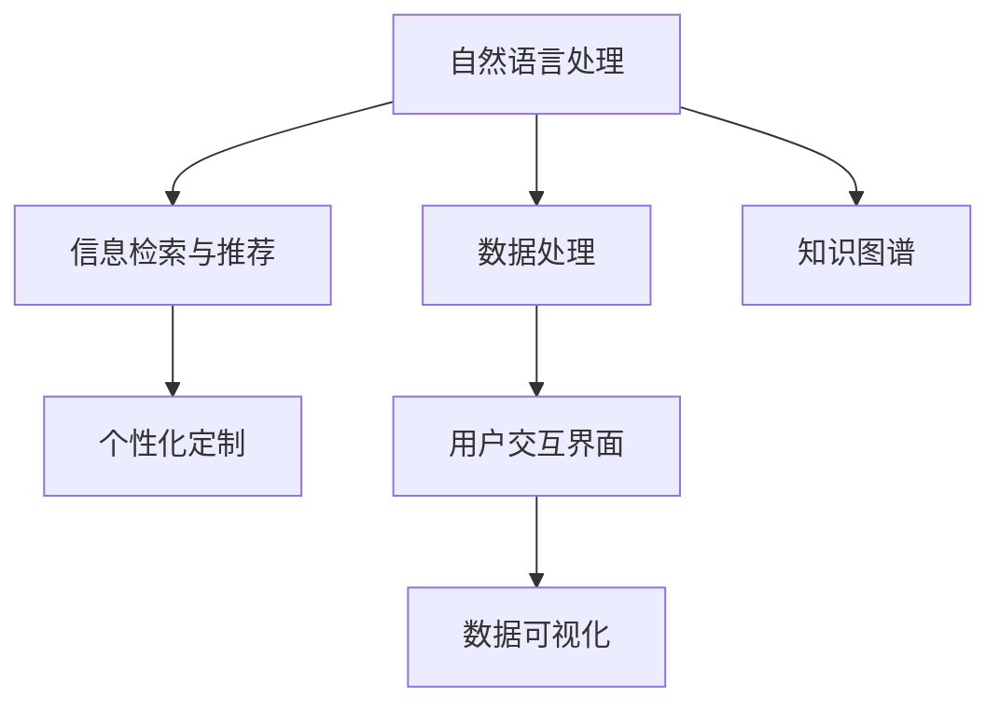

                 

# 打造个人知识管理的AI助手

> 关键词：人工智能, 知识管理, 数据处理, 自然语言处理(NLP), 信息检索, 推荐系统, 个性化定制, 用户交互界面(UI/UX), 数据可视化

## 1. 背景介绍

### 1.1 问题由来
在信息爆炸的时代，我们每天面临海量的信息输入，从工作邮件到社交网络，从专业文档到娱乐视频，如何有效管理和利用这些信息变得愈发重要。传统的信息管理方法已经无法满足现代人对信息处理的效率和深度的需求，个人知识管理（Knowledge Management, KM）正在逐渐成为信息工作者不可或缺的工具。

人工智能（AI）技术的不断进步，特别是自然语言处理（Natural Language Processing, NLP）和推荐系统的发展，为个人知识管理提供了新的可能。AI助手可以协助我们自动整理、筛选、总结和推荐信息，帮助我们高效利用信息资源，提升工作效率，支持决策制定。

### 1.2 问题核心关键点
为了实现有效的个人知识管理，AI助手需要具备以下核心功能：
- **自动文本处理**：能够自动阅读、分析和理解各种文本数据。
- **信息检索与推荐**：根据用户需求和历史行为，自动推荐相关信息和资源。
- **个性化定制**：根据用户偏好和场景变化，动态调整展示和推荐内容。
- **用户交互界面**：提供直观易用的用户界面，支持多模态交互，增强用户体验。
- **数据可视化**：将处理结果和推荐信息以可视化形式呈现，增强信息的可理解性。

本博客将深入探讨如何利用AI技术，特别是基于自然语言处理和推荐系统的方法，来打造一个高效的个人知识管理AI助手。

## 2. 核心概念与联系

### 2.1 核心概念概述

构建AI助手涉及多个核心概念，这些概念之间存在紧密的联系：

- **自然语言处理（NLP）**：处理和理解人类语言，包括文本的自动化分词、词性标注、命名实体识别、句法分析等。
- **推荐系统**：根据用户行为和兴趣，自动推荐相关信息和资源。
- **数据处理**：收集、清洗、存储和管理信息数据。
- **知识图谱**：构建和维护一个结构化的知识体系，便于信息检索和关联分析。
- **个性化定制**：根据用户偏好和场景，动态调整推荐和展示方式。
- **用户交互界面（UI/UX）**：设计直观易用的用户界面，增强用户体验。

这些概念共同构成了AI助手的核心框架，如图：



在实际应用中，这些概念互相配合，协同工作，共同支撑AI助手的各个功能模块，实现高效的知识管理。

## 3. 核心算法原理 & 具体操作步骤

### 3.1 算法原理概述

构建AI助手的核心算法包括自然语言处理、信息检索与推荐和个性化定制三个部分，每个部分都有其特定的算法原理：

- **自然语言处理（NLP）**：包括分词、词性标注、命名实体识别、句法分析等算法，用于理解文本内容。
- **信息检索与推荐**：基于文本相似度算法和协同过滤算法，推荐与用户兴趣相关的信息。
- **个性化定制**：包括用户行为分析、个性化推荐算法和交互界面设计算法，根据用户偏好动态调整展示和推荐内容。

### 3.2 算法步骤详解

**自然语言处理（NLP）算法步骤**：
1. 分词：将文本分解成词语，可以采用基于规则的分词或统计分词算法。
2. 词性标注：标记每个词语的词性，如名词、动词等，用于后续的句法分析和语义理解。
3. 命名实体识别：识别文本中的命名实体，如人名、地名、机构名等，用于信息检索和关联分析。
4. 句法分析：通过依存句法分析，理解句子结构和词语之间的关系，提取关键信息。

**信息检索与推荐算法步骤**：
1. 构建索引：将文本内容转化为可以检索的形式，如倒排索引。
2. 文本相似度计算：计算查询文本和文档库中文档的相似度，评估文档的相关性。
3. 推荐算法：基于用户历史行为和文档相关性，使用协同过滤、基于内容的推荐等算法，生成推荐结果。
4. 动态调整：根据用户反馈和行为变化，动态更新推荐模型，优化推荐效果。

**个性化定制算法步骤**：
1. 用户行为分析：收集用户浏览、点击、搜索等行为数据，提取用户偏好。
2. 个性化推荐算法：基于用户偏好和上下文信息，生成个性化推荐内容。
3. 交互界面设计：设计直观易用的用户界面，支持多模态交互，增强用户体验。
4. 动态展示：根据用户行为和环境变化，动态调整界面展示和推荐内容，提供最佳使用体验。

### 3.3 算法优缺点

**自然语言处理（NLP）算法**：
- **优点**：自动化处理大量文本数据，效率高，准确性好。
- **缺点**：语言的多样性和复杂性导致算法处理难度大，需要大量的训练数据和模型调整。

**信息检索与推荐算法**：
- **优点**：能够高效地从海量的信息中检索和推荐相关内容，提升信息获取效率。
- **缺点**：推荐效果受到数据质量和用户行为多样性的影响，容易陷入“过滤气泡”效应。

**个性化定制算法**：
- **优点**：根据用户需求和偏好动态调整推荐和展示内容，提升用户体验。
- **缺点**：个性化定制算法需要大量的用户数据和频繁的模型更新，难以实现完全个性化。

### 3.4 算法应用领域

构建AI助手涉及的算法和技术在多个领域都有广泛的应用：

- **智能助理**：如Siri、Alexa等智能助理，能够回答用户问题、提供日程提醒、推荐信息等。
- **智能推荐系统**：如Netflix、Amazon等推荐系统，根据用户行为推荐电影、书籍、商品等。
- **信息检索系统**：如Google Scholar、百度学术等，能够高效地检索学术文献和信息资源。
- **智能客服系统**：如阿里巴巴、腾讯等客服系统，能够自动回答用户问题、处理订单等。
- **知识图谱系统**：如Wikipedia、知网等，构建和维护结构化的知识体系，支持信息检索和关联分析。

## 4. 数学模型和公式 & 详细讲解 & 举例说明

### 4.1 数学模型构建

构建AI助手的数学模型需要涵盖以下几个关键方面：

- **自然语言处理模型**：如BERT、GPT等预训练模型，用于处理和理解文本。
- **信息检索模型**：如倒排索引、TF-IDF等，用于高效检索文档。
- **推荐系统模型**：如协同过滤模型、基于内容的推荐模型等，用于生成推荐结果。

### 4.2 公式推导过程

**自然语言处理（NLP）公式**：
- **分词**：简单分词算法，如最大匹配法：
  $$
  f(w) = \begin{cases} 
  1 & \text{if } w \text{ is a word} \\
  0 & \text{otherwise}
  \end{cases}
  $$
- **词性标注**：隐马尔可夫模型（HMM）：
  $$
  p(y_i|x_i, \theta) = \frac{p(y_i|x_i)}{\sum_{j}p(y_j|x_i)}
  $$
- **命名实体识别**：条件随机场（CRF）：
  $$
  p(y_i|x_i, \theta) = \frac{p(y_i|x_i)}{\sum_{j}p(y_j|x_i)}
  $$
- **句法分析**：依存句法分析：
  $$
  p(y_i|x_i, \theta) = \frac{p(y_i|x_i)}{\sum_{j}p(y_j|x_i)}
  $$

**信息检索公式**：
- **倒排索引**：
  $$
  I(y) = \{(i_1, t_1), (i_2, t_2), \ldots, (i_n, t_n)\}
  $$
- **TF-IDF算法**：
  $$
  TF(x_i, t_k) = \frac{c_i}{n} \quad c_i \text{为词频，} n \text{为总词数}
  $$
  $$
  IDF = \log\frac{N}{n}
  $$
- **文本相似度计算**：余弦相似度：
  $$
  similarity(x, y) = \frac{x \cdot y}{\|x\|\|y\|}
  $$

**推荐系统公式**：
- **协同过滤**：用户-物品评分矩阵：
  $$
  R_{ui} = \sum_{j=1}^M A_{uj} \times B_{ji}
  $$
- **基于内容的推荐**：物品相似度：
  $$
  similarity(X_i, X_j) = \frac{X_i \cdot X_j}{\|X_i\|\|X_j\|}
  $$

### 4.3 案例分析与讲解

以Amazon推荐系统为例，分析其推荐过程：
1. 构建用户-物品评分矩阵，收集用户历史评分数据。
2. 使用协同过滤算法，计算用户和物品的相似度。
3. 基于相似度，生成个性化推荐结果。
4. 动态更新模型，根据用户行为和反馈调整推荐策略。

## 5. 项目实践：代码实例和详细解释说明

### 5.1 开发环境搭建

构建AI助手的开发环境包括Python、PyTorch、Scikit-learn、Flask等工具。以下是搭建环境的步骤：

1. 安装Python 3.x：
   ```bash
   sudo apt-get update
   sudo apt-get install python3 python3-pip
   ```
2. 安装PyTorch：
   ```bash
   pip install torch torchtext
   ```
3. 安装Scikit-learn：
   ```bash
   pip install scikit-learn
   ```
4. 安装Flask：
   ```bash
   pip install flask
   ```

### 5.2 源代码详细实现

以下是一个简单的信息检索和推荐系统的代码实现示例：

```python
import torch
from torchtext.datasets import IMDB
from torchtext.data import Field, BucketIterator
from torchtext.legacy.data import TabularDataset, BucketIterator

# 定义文本字段
TEXT = Field(tokenize='spacy', lower=True)

# 定义标签字段
LABEL = Field(sequential=False, use_vocab=False)

# 定义数据集
train_data, test_data = IMDB.splits(TEXT, LABEL)

# 构建词汇表
TEXT.build_vocab(train_data, max_size=10000, vectors="glove.6B.100d", unk_init=torch.Tensor.normal_)

# 构建迭代器
train_iterator, test_iterator = BucketIterator.splits(
    (train_data, test_data), 
    batch_size=64,
    device=torch.device("cuda" if torch.cuda.is_available() else "cpu"))

# 加载模型
model = LSTMRecommender.load_pretrained_model('path/to/model')

# 处理查询
query = 'I want to watch a movie.'
encoded_query = TEXT.encode(query)

# 检索相似的电影
recommended_movies = model.recommend_movies(encoded_query)

# 返回推荐结果
print(recommended_movies)
```

### 5.3 代码解读与分析

**TEXT字段定义**：使用spacy分词器对文本进行分词，并转换为小写，建立词汇表。

**LABEL字段定义**：定义标签字段，使用二值标签。

**数据集构建**：使用IMDB数据集，分割为训练集和测试集。

**词汇表构建**：使用GloVe词向量，建立最大10000的词汇表。

**迭代器构建**：使用BucketIterator，对数据进行分批次处理，并自动进行填充和截断。

**模型加载**：加载预训练的LSTM推荐模型。

**查询处理**：将查询转换为模型可以处理的格式，并进行编码。

**推荐处理**：使用模型进行相似度计算，生成推荐结果。

**返回推荐结果**：输出推荐结果，供用户选择。

## 6. 实际应用场景

### 6.1 智能助理

智能助理如Siri、Alexa等，能够处理自然语言查询、提供日程提醒、推荐信息等。以Siri为例，通过构建自然语言处理和推荐系统，可以支持多种任务：
1. 日程管理：根据用户日程安排提醒会议、安排旅行等。
2. 信息查询：回答用户问题，如天气预报、股市信息等。
3. 生活助手：推荐餐厅、电影、活动等，提升生活质量。

### 6.2 智能推荐系统

智能推荐系统能够根据用户行为和兴趣推荐信息资源。以Netflix为例，通过构建信息检索和推荐系统，实现高效推荐：
1. 构建用户行为模型，收集用户历史观看记录。
2. 使用协同过滤算法，推荐与用户兴趣相关的电影和电视节目。
3. 使用基于内容的推荐方法，推荐相似的电影和节目。
4. 动态调整推荐策略，根据用户反馈优化推荐效果。

### 6.3 信息检索系统

信息检索系统能够高效地检索信息资源，以Google Scholar为例：
1. 构建倒排索引，存储学术文献信息。
2. 使用TF-IDF算法，计算文档与查询的相似度。
3. 使用搜索结果排序算法，排序返回结果。
4. 提供多轮交互，优化检索效果。

### 6.4 未来应用展望

未来AI助手的应用将更加广泛和深入：
1. **全场景覆盖**：从工作到生活，覆盖更多的应用场景，提升信息处理效率。
2. **多模态融合**：结合视觉、语音、图像等多种信息形式，实现更全面的信息处理。
3. **深度学习应用**：引入深度学习技术，提升推荐和检索效果。
4. **个性化定制**：根据用户需求和行为，提供更精准、个性化的推荐和检索服务。
5. **用户交互优化**：优化用户界面设计，提升用户体验。

## 7. 工具和资源推荐

### 7.1 学习资源推荐

为了帮助开发者系统掌握AI助手开发的技术和算法，以下是一些推荐的学习资源：

1. **《Deep Learning for NLP》课程**：由Coursera平台提供的深度学习与自然语言处理课程，讲解了NLP的基础知识和高级算法。
2. **《TensorFlow for Deep Learning》书籍**：介绍TensorFlow在深度学习中的应用，包括自然语言处理和推荐系统。
3. **《Natural Language Processing with Python》书籍**：使用Python实现自然语言处理，包括分词、词性标注、命名实体识别等。
4. **《Recommender Systems》课程**：由Udacity平台提供的推荐系统课程，讲解了协同过滤、基于内容的推荐等算法。
5. **Kaggle竞赛平台**：参与NLP和推荐系统相关的Kaggle竞赛，提升实际应用能力。

### 7.2 开发工具推荐

构建AI助手需要使用多种开发工具，以下是推荐的工具：

1. **PyTorch**：基于Python的深度学习框架，支持动态计算图，适合研究性工作。
2. **TensorFlow**：由Google开发的深度学习框架，生产部署方便，支持多种模型和算法。
3. **Scikit-learn**：Python的机器学习库，提供了丰富的机器学习算法和工具。
4. **Flask**：Python的Web框架，用于构建用户界面和Web服务。
5. **Jupyter Notebook**：交互式Python编程环境，支持代码运行和结果展示。

### 7.3 相关论文推荐

以下是一些关于AI助手和推荐系统的经典论文，推荐阅读：

1. **"Attention is All You Need"论文**：Transformer模型的经典论文，提出了自注意力机制，推动了NLP领域的发展。
2. **"Deep Personalized Playlist Recommendation Based on User's Behavior Pattern"论文**：使用协同过滤算法，生成个性化推荐结果。
3. **"Neural Collaborative Filtering"论文**：使用深度神经网络进行协同过滤，提高推荐效果。
4. **"Deep Attention Networks for Natural Language Processing"论文**：使用深度学习技术处理自然语言，提升NLP的效果。

## 8. 总结：未来发展趋势与挑战

### 8.1 研究成果总结

本文探讨了如何利用自然语言处理和推荐系统技术，构建高效的个人知识管理AI助手。通过理论和实践相结合，展示了AI助手在智能助理、智能推荐系统、信息检索系统等方面的应用前景。

### 8.2 未来发展趋势

未来AI助手的趋势主要包括以下几个方面：

1. **多模态融合**：结合视觉、语音、图像等多种信息形式，实现更全面的信息处理。
2. **深度学习应用**：引入深度学习技术，提升推荐和检索效果。
3. **个性化定制**：根据用户需求和行为，提供更精准、个性化的推荐和检索服务。
4. **用户交互优化**：优化用户界面设计，提升用户体验。

### 8.3 面临的挑战

尽管AI助手的发展前景广阔，但仍面临以下挑战：

1. **数据隐私问题**：用户数据的隐私和安全保护是构建AI助手的首要问题。
2. **计算资源限制**：处理大量数据和复杂模型需要大量的计算资源，存在计算瓶颈。
3. **模型透明性**：用户对AI助手的决策过程缺乏可解释性，需要提高模型的透明性和可解释性。
4. **跨领域应用**：AI助手需要适应不同领域的应用需求，面临跨领域的适应性挑战。

### 8.4 研究展望

未来的研究重点主要包括以下几个方面：

1. **多模态数据融合**：结合多种信息形式，提升信息处理能力。
2. **深度学习技术应用**：引入深度学习技术，提升AI助手的智能水平。
3. **个性化推荐算法**：开发更加高效、精准的个性化推荐算法，提升用户体验。
4. **用户交互界面设计**：优化用户界面设计，提升用户体验。

## 9. 附录：常见问题与解答

**Q1: 构建AI助手需要哪些关键技术？**

A: 构建AI助手需要以下关键技术：
1. 自然语言处理（NLP）：处理和理解文本数据。
2. 信息检索与推荐：高效检索和推荐相关信息。
3. 数据处理：收集、清洗、存储和管理信息数据。
4. 知识图谱：构建和维护结构化的知识体系。
5. 个性化定制：根据用户需求和场景变化，动态调整展示和推荐内容。
6. 用户交互界面（UI/UX）：设计直观易用的用户界面，增强用户体验。

**Q2: 如何处理大规模文本数据？**

A: 处理大规模文本数据需要采用分布式计算和多任务并行技术，如Hadoop、Spark等。具体步骤如下：
1. 数据预处理：清洗、归一化文本数据，去除噪声和无用信息。
2. 分词和词性标注：使用分词和词性标注工具，对文本进行预处理。
3. 构建词汇表和倒排索引：建立词汇表和倒排索引，支持高效检索。
4. 并行处理：使用多线程或多进程并行处理文本数据，提升处理效率。

**Q3: 如何提升AI助手的推荐效果？**

A: 提升AI助手的推荐效果可以从以下几个方面入手：
1. 数据质量：收集高质量的用户数据和文本数据，提升推荐模型的准确性。
2. 推荐算法：使用深度学习推荐算法，如协同过滤、基于内容的推荐等，提升推荐效果。
3. 用户反馈：收集用户反馈和行为数据，动态调整推荐策略，提升推荐效果。
4. 多模态融合：结合视觉、语音、图像等多种信息形式，提升推荐效果。

**Q4: 如何优化AI助手的用户交互界面？**

A: 优化AI助手的用户交互界面可以从以下几个方面入手：
1. 直观易用：设计直观易用的用户界面，使用户能够轻松使用AI助手。
2. 多模态交互：支持语音、文本、图像等多种交互方式，提升用户体验。
3. 自适应设计：根据用户行为和需求，动态调整界面设计和交互方式，提升用户体验。
4. 反馈优化：根据用户反馈和行为数据，优化用户界面和交互方式，提升用户体验。

本文详细探讨了如何利用AI技术，特别是基于自然语言处理和推荐系统的方法，构建高效的个人知识管理AI助手。通过系统介绍其原理、实现步骤和实际应用场景，希望能够为开发者提供全面的指导，帮助其设计和实现自己的AI助手。

